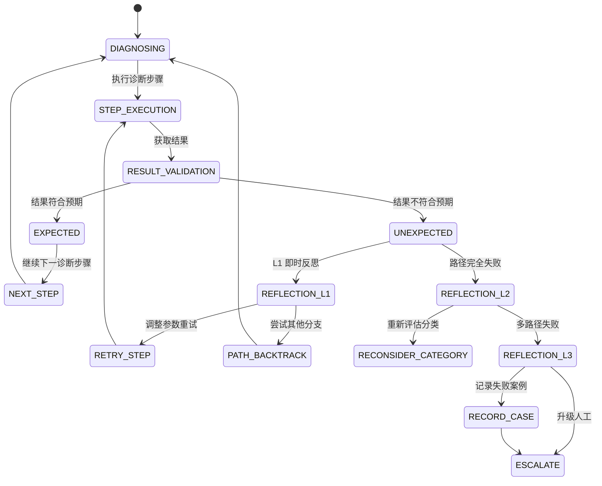

# P1-反思机制设计文档 (Agent Self-Reflection)

> **版本**: v1.0
> **创建日期**: 2026-05-18
> **用途**: 定义 AI Agent 在假设验证失败后的回溯逻辑与反思机制

---

## 1. 反思机制概述

### 1.1 背景

在问题诊断过程中，Agent 的初始假设可能不正确。当验证步骤返回与预期不符的结果时，Agent 需要具备反思能力：
- 识别假设失败
- 回溯诊断路径
- 调整假设方向
- 避免重复验证

### 1.2 反思层级

| 层级 | 触发条件 | 行为 |
|------|---------|------|
| L1 即时反思 | 单个步骤结果与预期不符 | 调整该步骤参数，重新执行 |
| L2 路径反思 | 一个诊断路径全部失败 | 回溯到上一个决策点，尝试其他分支 |
| L3 全局反思 | 多个路径失败 | 重新评估症状，怀疑初始分类是否正确 |
| L4 升级反思 | 所有路径失败 | 记录失败案例，升级人工处理 |

---

## 2. 反思触发器定义

### 2.1 假设验证失败模式

```yaml
reflection_triggers:
  # 类型 1: 命令执行失败
  command_execution_failure:
    patterns:
      - "connection refused"
      - "timeout"
      - "unauthorized"
      - "not found"
    action: "检查权限/连接性，尝试替代命令"
  
  # 类型 2: 结果不符合预期
  unexpected_result:
    patterns:
      - "expected: Running, got: Pending"
      - "expected: 3 replicas, got: 1"
      - "expected: no errors, got: ImagePullBackOff"
    action: "分析差异原因，调整诊断方向"
  
  # 类型 3: 空结果
  empty_result:
    patterns:
      - "no pods found"
      - "no events found"
      - "endpoints is empty"
    action: "扩大搜索范围，检查 namespace/selector"
  
  # 类型 4: 矛盾结果
  contradictory_result:
    patterns:
      - "node is Ready but [[concepts/pod-lifecycle|pod]] cannot schedule"
      - "service exists but no endpoints"
    action: "深入检查资源关联关系"
```

### 2.2 反思状态机



---

## 3. 回溯决策逻辑

### 3.1 回溯触发条件

```yaml
backtrack_conditions:
  # 条件 1: 诊断路径无进展
  path_stagnation:
    criteria: "同一路径连续 3 个步骤返回空结果或错误"
    threshold: 3
    action: "回溯到上一个决策点"
  
  # 条件 2: 假设与事实矛盾
  hypothesis_fact_contradiction:
    criteria: "假设 A → 预期结果 B，但实际结果为 NOT B"
    confidence: "< 0.3"
    action: "放弃假设 A，尝试对立假设"
  
  # 条件 3: 时间耗尽
  time_exhausted:
    criteria: "单个 Skill 诊断时间超过 5 分钟"
    action: "回溯并尝试其他 Skill 或升级"
```

### 3.2 回溯执行流程

```
当诊断路径失败时：
1. 记录失败路径和失败原因
2. 检查是否有其他未尝试的分支
   - 如有：选择下一个分支继续
   - 如无：回溯到上一个决策点
3. 回溯时：
   - 标记已尝试的路径（避免重复）
   - 更新假设置信度
   - 记录学到的事实
4. 如果所有分支失败：
   - 重新评估初始分类
   - 尝试其他 Category
```

### 3.3 回溯示例

```python
class DiagnosticBacktracker:
    def backtrack(self, failed_path: List[Step], context: DiagnosticContext):
        # 1. 记录失败
        self.failure_history.append({
            "path": failed_path,
            "timestamp": datetime.now(),
            "reason": self.analyze_failure_reason(failed_path)
        })
        
        # 2. 获取决策点
        decision_points = self.find_decision_points(failed_path)
        
        for point in decision_points:
            # 3. 获取该点的其他分支
            other_branches = point.get_untried_branches()
            
            if other_branches:
                # 4. 选择下一个分支
                next_branch = self.select_next_branch(other_branches)
                return next_branch
        
        # 5. 所有分支失败，重新评估
        return self.escalate_or_reclassify(context)
    
    def select_next_branch(self, branches: List[Branch]) -> Branch:
        # 选择优先级最高的未尝试分支
        # 考虑：风险等级、成功率、历史反馈
        return max(branches, key=lambda b: b.priority_score)
```

---

## 4. 反思动作库

### 4.1 L1 即时反思动作

```yaml
L1_reflection_actions:
  command_retry:
    trigger: "命令执行失败（超时、权限）"
    actions:
      - "检查命令语法是否正确"
      - "验证 namespace 是否正确"
      - "确认 RBAC 权限是否足够"
      - "尝试使用 kubectl auth can-i 验证权限"
      - "增加 timeout 参数重试"
    
  result_interpretation:
    trigger: "结果不符合预期"
    actions:
      - "检查输出格式是否与预期一致"
      - "验证资源名称拼写"
      - "确认是否需要 -o json 输出"
      - "查看 events 中的详细错误信息"
    
  scope_expansion:
    trigger: "空结果"
    actions:
      - "尝试 all-namespaces"
      - "放宽 selector 条件"
      - "移除 field_selector 限制"
      - "检查是否在正确的 namespace"
```

### 4.2 L2 路径反思动作

```yaml
L2_reflection_actions:
  branch_switch:
    trigger: "路径中所有步骤失败"
    actions:
      - "识别上一个决策点"
      - "列出该点的其他分支"
      - "优先选择风险等级低的分支"
      - "记录失败的分支原因"
    
  hypothesis_revision:
    trigger: "假设被事实否定"
    actions:
      - "列出假设的所有支持证据"
      - "识别与事实矛盾的证据"
      - "计算对立假设的概率"
      - "切换到概率最高的假设"
    
  tool_alternative:
    trigger: "工具执行失败"
    actions:
      - "kubectl get → kubectl describe"
      - "kubectl logs → kubectl exec"
      - "API 调用 → kubectl proxy"
      - "远程 SSH → kubectl debug"
```

### 4.3 L3 全局反思动作

```yaml
L3_reflection_actions:
  category_reassessment:
    trigger: "多个路径失败"
    actions:
      - "回顾初始症状描述"
      - "检查是否有可能的分类错误"
      - "尝试其他 Category 的诊断路径"
      - "扩大关键词匹配范围"
    
  symptom_rediscovery:
    trigger: "初始分类可能错误"
    actions:
      - "重新提取症状关键词"
      - "分析日志中的其他异常信号"
      - "检查相关组件是否也受影响"
      - "考虑复合问题的可能"
    
  evidence_accumulation:
    trigger: "无法确定根因"
    actions:
      - "收集所有已确认的事实"
      - "排除已排除的假设"
      - "计算剩余假设的概率"
      - "提供最可能的几个根因供人工决策"
```

---

## 5. 反思上下文记录

### 5.1 反思记录结构

```yaml
reflection_record:
  session_id: "sess-20260518-001"
  ticket_id: "TKT-20260518-001"
  
  reflection_history:
    - level: "L1"
      timestamp: "2026-05-18T10:15:30Z"
      trigger: "unexpected_result"
      failed_step: "kubectl get pods -n default"
      expected: "3 running pods"
      actual: "0 pods found"
      action_taken: "扩大到 all-namespaces 查询"
      result: "success"
      
    - level: "L2"
      timestamp: "2026-05-18T10:20:45Z"
      trigger: "path_stagnation"
      failed_path: ["step1", "step2", "step3"]
      backtrack_point: "decision_node_2"
      branches_tried: ["A", "B"]
      action_taken: "切换到分支 C"
      result: "success"
      
    - level: "L3"
      timestamp: "2026-05-18T10:30:00Z"
      trigger: "multiple_path_failure"
      all_paths_failed: ["network_path", "storage_path", "compute_path"]
      original_category: "TC-INFRA-NET"
      attempted_categories: ["TC-INFRA-NODE", "TC-APP-POD"]
      final_action: "escalate_to_human"
```

### 5.2 反思学习机制

```python
class ReflectionLearning:
    def learn_from_failure(self, record: ReflectionRecord):
        # 1. 更新假设置信度
        for hypothesis in record.failed_hypotheses:
            hypothesis.confidence *= 0.5  # 降低置信度
        
        # 2. 记录学到的事实
        self.learned_facts.append({
            "observation": record.actual_result,
            "negates": record.hypothesis,
            "timestamp": record.timestamp
        })
        
        # 3. 更新工具成功率
        for tool in record.failed_tools:
            tool.success_rate *= 0.9
            tool.last_failure = record.timestamp
            
        # 4. 生成新的诊断提示
        self.hints.append(f"当遇到 {record.trigger} 时，避免 {record.action_taken}")
```

---

## 6. 反思评估指标

### 6.1 反思有效性指标

| 指标 | 计算方法 | 目标值 |
|------|---------|--------|
| 反思覆盖率 | 触发反思的案例数 / 总案例数 | > 30% |
| 反思成功率 | 反思后找到根因的案例数 / 触发反思的案例数 | > 60% |
| 回溯效率 | 回溯次数 / 最终诊断步骤数 | < 0.5 |
| 升级率 | 升级人工的案例数 / 总案例数 | < 10% |
| 平均诊断时间 | 总诊断时间 / 案例数 | < 5 分钟 |

### 6.2 反思质量评估

```yaml
reflection_quality:
  criteria:
    - name: "及时性"
      description: "反思是否在合适的时机触发"
      scoring:
        - "过早（未充分尝试）": 1
        - "适时": 3
        - "过晚（已浪费大量时间）": 1
    
    - name: "准确性"
      description: "反思动作是否针对正确的失败原因"
      scoring:
        - "错误（加剧问题）": 0
        - "部分正确": 2
        - "完全正确": 3
    
    - name: "效率"
      description: "反思是否快速找到正确方向"
      scoring:
        - "多次回溯仍失败": 1
        - "1-2次回溯成功": 2
        - "首次反思即成功": 3
  
  overall_score:
    sum(各criteria分数) / 3
    # 3 分：优秀，2 分：良好，1 分：需改进，0 分：不合格
```

---

## 7. 与其他模块的接口

### 7.1 与 P0-2 多技能协同的联动

```yaml
interface_with_multi_skill:
  # 当单个 Skill 多次反思失败时
  trigger: "同一 Skill 反思次数 >= 3"
  action: "触发多技能协同"
  
  # 通知协调器
  notification:
    skill_id: "SKILL-NODE-001"
    reflection_count: 3
    failed_hypotheses: ["RC-001", "RC-002"]
    
  # 请求协同
  coordination_request:
    reason: "单一 Skill 无法覆盖复杂问题"
    request: "启动跨 Skill 诊断"
    suggested_skills: ["SKILL-NET-001", "SKILL-STORE-001"]
```

### 7.2 与 P0-3 会话上下文的联动

```yaml
interface_with_session_context:
  # 反射记录写入上下文
  reflection_record_event:
    event_type: "REFLECTION_TRIGGERED"
    level: "L2"
    trigger: "path_stagnation"
    
  # 上下文更新
  session_context_updates:
    - key: "diagnostic_path"
      operation: "append_branch"
      value: {"branch": "C", "result": "pending"}
      
    - key: "failed_hypotheses"
      operation: "add"
      value: ["RC-001", "RC-002"]
      
    - key: "hypothesis_confidence"
      operation: "decrease"
      value: {"RC-001": 0.95, "RC-002": 0.30}
```

---

## 8. 实施检查清单

- [ ] 定义所有反思触发器的模式匹配规则
- [ ] 实现回溯决策树结构
- [ ] 建立反思记录的数据模型
- [ ] 集成到 Skill 执行引擎
- [ ] 添加反思质量评估指标
- [ ] 建立反思学习反馈循环

---

**下一步行动**: 实现反射机制原型，在 topic-skills 中选择一个 Skill 进行集成测试。