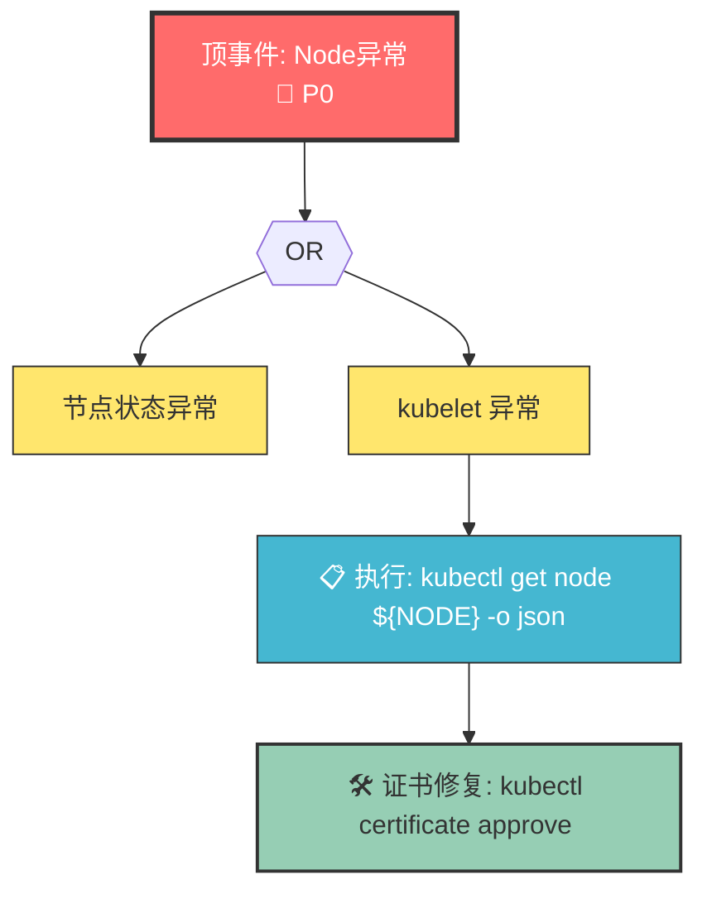

# 深度研究最佳实践指南

> **版本**: v1.0
> **创建日期**: 2026-05-18
> **用途**: 详细说明如何在最佳深度研究场景下使用本项目

---

## 一、深度研究场景定义

### 1.1 什么是深度研究？

深度研究是指 AI Agent 在复杂问题场景下，通过多轮推理、多源验证、迭代反思，最终定位根因并给出可执行修复方案的过程。与简单问答不同，深度研究需要：

| 特征 | 说明 |
|------|------|
| **多轮推理** | 不是一次性回答，而是持续追问、验证、调整 |
| **结构化诊断** | 遵循FTA/FEBM等方法论，有明确的推理路径 |
| **证据链完整** | 每一步结论都有证据支撑 |
| **可执行输出** | 不仅告诉用户"是什么"，还要告诉"怎么做" |
| **自我反思** | 假设失败时能自动回溯，调整方向 |

### 1.2 本项目支撑深度研究的核心能力

```
┌─────────────────────────────────────────────────────────────────────┐
│                    KUDIG 深度研究架构                                │
├─────────────────────────────────────────────────────────────────────┤
│                                                                     │
│   输入层              处理层                输出层                   │
│   ══════            ═══════            ═══════                    │
│                                                                     │
│   用户问题 ──────►│意图识别│──────►│FTA推理│──────►│根因定位│        │
│                   │(320条) │       │(67树) │       │(置信度)│        │
│                   └────────┘       └───────┘       └───────┘        │
│                                         │                │          │
│                                         ▼                ▼          │
│                                   ┌──────────┐    ┌───────────┐     │
│                                   │工具执行  │    │修复方案   │      │
│                                   │(35+工具) │    │(风险评估) │      │
│                                   └──────────┘    └───────────┘     │
│                                         │                │          │
│                                         ▼                ▼          │
│                                   ┌──────────┐    ┌───────────┐     │
│                                   │反思机制  │    │验证反馈   │      │
│                                   │(回溯决策) │    │(知识闭环) │      │
│                                   └──────────┘    └───────────┘     │
│                                                                     │
└─────────────────────────────────────────────────────────────────────┘
```

---

## 二、深度研究使用流程

### 2.1 流程概览

```
用户报告问题
     │
     ▼
┌─────────────────────────────────────────────────────────────┐
│  Step 1: 症状理解与分类 (Intent Recognition)                │
│  ════════════════════════════════════════════               │
│                                                              │
│  输入: "节点 NotReady，Pod 被驱逐"                           │
│                                                              │
│  处理:                                                        │
│    1. 关键词匹配 → 命中 "NotReady" → TC-INFRA-NODE          │
│    2. 语义向量匹配 → 匹配到 SKILL-NODE-001 (置信度 0.92)     │
│    3. 意图确认 → 触发 Node 问题诊断流程                       │
│                                                              │
│  输出:                                                        │
│    - category: TC-INFRA-NODE                                │
│    - skill_id: SKILL-NODE-001                               │
│    - suggested_path: FTA-NODE-023                            │
│                                                              │
└─────────────────────────────────────────────────────────────┘
     │
     ▼
┌─────────────────────────────────────────────────────────────┐
│  Step 2: FTA 问题树推理 (Root Cause Localization)            │
│  ═══════════════════════════════════════════════             │
│                                                              │
│  处理:                                                        │
│    1. 加载 FTA-NODE-023 问题树                               │
│    2. 按概率排序:                                             │
│       - kubelet 证书过期 (0.35)                               │
│       - 磁盘压力驱逐 (0.25)                                   │
│       - 网络分区 (0.20)                                       │
│       - CNI 异常 (0.15)                                       │
│       - 其他 (0.05)                                          │
│    3. 按优先级验证，收集证据                                   │
│                                                              │
│  证据收集:                                                    │
│    kubectl describe node {node} → Conditions: Ready=False    │
│    ssh {node} openssl x509 -in /var/lib/kubelet/pki/...      │
│    → 证书过期时间: 2026-05-18 10:00:00 (已过期)              │
│                                                              │
│  输出:                                                        │
│    - root_cause: RC-001 (kubelet 证书过期)                   │
│    - confidence: 0.85                                        │
│    - evidence: [证书有效期, kubelet 日志, Lease 更新失败]    │
│                                                              │
└─────────────────────────────────────────────────────────────┘
     │
     ▼
┌─────────────────────────────────────────────────────────────┐
│  Step 3: 详细诊断 (Detailed Diagnosis)                       │
│  ═══════════════════════════════════════════                  │
│                                                              │
│  处理:                                                        │
│    1. 调用工具收集更多证据                                     │
│    2. 检查关联组件状态                                         │
│    3. 验证假设是否成立                                         │
│                                                              │
│  诊断命令:                                                    │
│    kubectl get csr | grep kubelet-serving                    │
│    kubectl certificate approve <csr-name>                    │
│    kubectl uncordon {node}                                   │
│    kubectl get pods -n kube-system -l k8s-app=kube-dns      │
│                                                              │
│  输出:                                                        │
│    - diagnosis_report: 完整诊断报告                           │
│    - repair_plan: [REM-001, REM-002]                        │
│    - risk_assessment: MEDIUM                                │
│                                                              │
└─────────────────────────────────────────────────────────────┘
     │
     ▼
┌─────────────────────────────────────────────────────────────┐
│  Step 4: 修复执行与验证 (Remediation & Verification)         │
│  ══════════════════════════════════════════════              │
│                                                              │
│  修复:                                                        │
│    1. 批准 CSR: kubectl certificate approve <csr-name>     │
│    2. 等待 kubelet 重启                                       │
│    3. uncordon 节点                                          │
│                                                              │
│  验证:                                                        │
│    kubectl get node {node} -o jsonpath='{.status.conditions}'│
│    → Conditions: Ready=True                                  │
│                                                              │
│  输出:                                                        │
│    - status: RESOLVED                                        │
│    - verification_time: 45s                                   │
│    - knowledge_update: 更新 FTA 置信度                       │
│                                                              │
└─────────────────────────────────────────────────────────────┘
```

---

## 三、核心模块深度使用

### 3.1 意图识别语料库 (P0-1)

**使用场景**: 当用户输入一个问题时，Agent 需要判断这是什么类型的问题。

**语料结构**:
```json
{
  "text": "节点 NotReady，Pod 被驱逐",
  "lang": "zh",
  "category": "TC-INFRA-NODE",
  "skill_id": "SKILL-NODE-001",
  "keywords": ["NotReady", "驱逐", "节点"],
  "severity_hint": "P0",
  "confidence": 0.95
}
```

**深度研究用法**:

| 场景 | 用法 | 说明 |
|------|------|------|
| **工单路由** | 加载 `P0-1-intent-corpus-expanded.jsonl` | 320条意图语料，支持分类 |
| **边界Case** | 扩展到500+/Category | 覆盖混语言、缩写、日志格式 |
| **置信度校准** | 定期更新 `confidence` 字段 | 根据实际准确率调整 |

**加载示例**:
```python
import json

# 加载意图语料
with open('P0-1-intent-corpus-expanded.jsonl', 'r') as f:
    corpus = [json.loads(line) for line in f]

# 按 category 分组
from collections import defaultdict
category_corpus = defaultdict(list)
for item in corpus:
    category_corpus[item['category']].append(item)

# 匹配函数
def match_intent(user_input: str, top_k: int = 3):
    # 1. 关键词精确匹配
    for item in corpus:
        if any(kw in user_input for kw in item['keywords']):
            return item
    
    # 2. 语义相似度匹配（需要 embedding 模型）
    # ... embedding + cosine similarity
    
    # 3. 返回 top-k 候选
    return top_k_candidates
```

### 3.2 工具 Schema (P0-Tool-Schema)

**使用场景**: Agent 在诊断过程中需要执行 kubectl 命令。

**Schema 结构**:
```yaml
tool:
  name: kubectl_describe_pod
  description: 获取 Pod 详细信息，包括事件、容器状态
  category: DIAGNOSTIC
  
  parameters:
    name:
      type: string
      required: true
    namespace:
      type: string
      default: "default"
  
  output:
    format: text/table
    sections: [Name, Namespace, Status, Containers, Events]
  
  risk_level: LOW
  side_effects: []
  rollback: false
```

**深度研究用法**:

| 场景 | 用法 | 说明 |
|------|------|------|
| **自动诊断** | 读取 `P0-Tool-Schema-Definition.md` | 35个工具定义 |
| **命令生成** | 根据参数规范生成命令 | 避免语法错误 |
| **风险评估** | 根据 `risk_level` 判断是否需确认 | HIGH 风险需人工确认 |
| **回滚支持** | 根据 `rollback` 字段准备回滚方案 | 修复前记录原状态 |

**工具选择决策树**:
```
诊断目标
    │
    ├─ 了解 Pod 状态 → kubectl_get_pods
    │
    ├─ 查看详细事件 → kubectl_describe_pod
    │
    ├─ 查看资源使用 → kubectl_top_pod / kubectl_top_node
    │
    ├─ 查看日志 → kubectl_logs
    │
    ├─ 查看网络 → kubectl_get_services / kubectl_get_endpoints
    │
    ├─ 查看存储 → kubectl_get_pvc / kubectl_get_pv
    │
    ├─ 修复操作 → kubectl_rollout_restart / kubectl_scale
    │
    └─ 节点操作 → kubectl_cordon / kubectl_drain
```

### 3.3 知识图谱 RDF 模型 (P0-Knowledge-Graph)

**使用场景**: 当需要跨域推理，例如"这个问题是网络导致的还是存储导致的？"

**RDF 模型**:
```turtle
# 问题树关联
kudig:FTA-NODE-023 kudig:hasTopEvent kudig:TE-NODE-001 .
kudig:TE-NODE-001 kudig:decomposedInto kudig:IE-NODE-001, kudig:IE-NODE-002 .

# 根因关联
kudig:IE-NODE-001 kudig:contains kudig:BE-NODE-001 .
kudig:BE-NODE-001 kudig:leadsTo kudig:RC-001 .

# 技能覆盖
kudig:RC-001 kudig:coveredBy kudig:SKILL-NODE-001 .
kudig:RC-001 kudig:remediatedBy kudig:REM-001 .
```

**深度研究用法**:

| 场景 | 用法 | 说明 |
|------|------|------|
| **根因传播** | 从症状追溯到根因 | 利用 FTA 逻辑门 |
| **技能协同** | 当根因涉及多组件时 | 触发多技能协同 (P0-2) |
| **知识补全** | 缺失环节自动关联 | 利用 crossRefersTo 关系 |
| **推理加速** | 预计算路径缩短搜索 | 缓存常见问题路径 |

**SPARQL 查询示例**:
```sparql
# 查询症状对应的根因和修复
PREFIX kudig: <https://kudig.io/ontology/>

SELECT ?rootCause ?remediation ?skill
WHERE {
    ?symptom kudig:hasType "NodeNotReady" .
    ?symptom kudig:leadsTo ?rootCause .
    ?rootCause kudig:remediatedBy ?remediation .
    ?rootCause kudig:coveredBy ?skill .
}
```

### 3.4 决策树 Mermaid 可视化 (P1-4)

**使用场景**: 当需要向用户展示诊断路径，或调试 Agent 的推理逻辑。

**Mermaid 规范**:


**深度研究用法**:

| 场景 | 用法 | 说明 |
|------|------|------|
| **推理可视化** | 将诊断路径渲染为 Mermaid 图 | 用户可理解 Agent 在做什么 |
| **调试分析** | 查看决策路径是否有问题 | 快速定位推理缺陷 |
| **知识沉淀** | 将新问题模式转为 Mermaid | 沉淀为组织知识 |
| **培训演示** | 用 Mermaid 展示诊断流程 | 培训新员工 |

### 3.5 反思机制 (P1-7)

**使用场景**: 当诊断路径失败，需要回溯或调整方向。

**反思触发器**:
```yaml
reflection_triggers:
  command_execution_failure:
    patterns: ["connection refused", "timeout", "unauthorized"]
    action: "检查权限/连接性，尝试替代命令"
  
  unexpected_result:
    patterns: ["expected: Running, got: Pending"]
    action: "分析差异原因，调整诊断方向"
  
  path_stagnation:
    criteria: "同一路径连续 3 个步骤返回空结果"
    action: "回溯到上一个决策点"
```

**深度研究用法**:

| 层级 | 触发条件 | 行为 |
|------|---------|------|
| **L1 即时反思** | 单个步骤结果与预期不符 | 调整该步骤参数，重新执行 |
| **L2 路径反思** | 一个诊断路径全部失败 | 回溯到上一个决策点，尝试其他分支 |
| **L3 全局反思** | 多个路径失败 | 重新评估症状，怀疑初始分类是否正确 |
| **L4 升级反思** | 所有路径失败 | 记录失败案例，升级人工处理 |

**回溯决策流程**:
```
假设验证失败
    │
    ▼
检查是否有其他分支未尝试?
    │
    ├─ 是 → 选择下一个分支
    │
    └─ 否 → 回溯到上一个决策点
    
    ▼
更新假设置信度
记录学到的事实
    │
    ▼
如果所有分支失败 → 重新评估分类
```

### 3.6 评估基准 (P1-8)

**使用场景**: 当需要评估 Agent 的诊断能力，或持续改进 Agent。

**评估维度**:

| 维度 | 权重 | 指标 |
|------|------|------|
| **准确率** | 35% | Top-1/3/5 准确率，症状分类准确率 |
| **覆盖率** | 25% | 类别覆盖率，根因覆盖率，边界Case覆盖率 |
| **效率** | 20% | 平均诊断时间，工具调用次数，反思次数 |
| **可解释性** | 10% | 路径可追溯性，置信度说明，修复建议可执行性 |
| **安全性** | 10% | 危险操作率，高风险操作确认率，回滚成功率 |

**评分等级**:

| 等级 | 分数 | 说明 |
|------|------|------|
| **S** | 0.90-1.00 | 卓越，生产级可靠 |
| **A** | 0.80-0.89 | 优秀，偶需人工复核 |
| **B** | 0.70-0.79 | 良好，需改进后上线 |
| **C** | 0.60-0.69 | 可接受，需大幅改进 |
| **D** | 0.50-0.59 | 不足，不建议上线 |
| **F** | 0.00-0.49 | 不合格，需重新设计 |

**深度研究用法**:

| 场景 | 用法 | 说明 |
|------|------|------|
| **上线前评估** | 使用 500 案例基准测试 | 确保 Agent 达到 B 级以上 |
| **持续监控** | 每日/周/月定期评估 | 发现能力退化及时修复 |
| **改进验证** | 改进前后对比评估 | 量化改进效果 |
| **Benchmark 更新** | 季度更新测试集 | 覆盖新问题模式 |

---

## 四、端到端深度研究示例

### 4.1 示例：Pod CrashLoopBackOff 深度研究

**输入**:
```
用户报告: "default 命名空间下 nginx-deployment-7d9f8b5c4-abcde Pod 处于 CrashLoopBackOff 状态，
Exit Code 137，怀疑 OOMKilled"
```

**Step 1: 症状理解与分类**

```python
# 1. 加载意图语料
corpus = load_corpus('P0-1-intent-corpus-expanded.jsonl')

# 2. 匹配意图
user_input = "Pod CrashLoopBackOff Exit Code 137 OOMKilled"
matched = match_intent(user_input, corpus)

# 输出:
# category: TC-APP-POD
# skill_id: SKILL-POD-001
# confidence: 0.95

# 3. 触发对应 Skill
skill = load_skill('SKILL-POD-001')
```

**Step 2: FTA 问题树推理**

```python
# 1. 加载 FTA 问题树
fta = load_fta('FTA-POD-001')  # Pod 问题树

# 2. 按概率排序候选根因
# BE-2.3.1: JVM heap 不足 (0.30)
# BE-2.3.2: 内存泄漏 (0.25)
# BE-2.3.3: 资源配置过小 (0.20)
# BE-2.3.4: 外部依赖超时 (0.15)
# BE-2.3.5: 代码死循环 (0.10)

# 3. 按优先级验证
# 验证 BE-2.3.1: kubectl get pod -o jsonpath
# 证据: limits.memory=1Gi, usage~1.2Gi
# 后验概率: P(JVM|证据) = 0.72
# 结论: 根因 = JVM heap 配置小于实际需求
```

**Step 3: 详细诊断**

```python
# 1. 执行详细诊断命令
commands = [
    "kubectl top pod nginx-abcde --containers",
    "kubectl get pod nginx-abcde -o jsonpath='{.spec.containers[*].resources}'",
    "kubectl exec nginx-abcde -- jcmd 1 GC.heap_info"
]

# 2. 收集证据
# memory usage: 1.2Gi > limit 1Gi
# JVM heap: -Xmx768m (配置值)
# actual heap: ~1.1Gi (实际使用)

# 3. 确认根因
root_cause = {
    "id": "RC-POD-OOM-001",
    "title": "JVM heap 配置小于实际需求",
    "confidence": 0.85,
    "evidence": [
        "memory usage 1.2Gi > limit 1Gi",
        "JVM heap 配置 768m < 实际需求",
        "Exit code 137 (OOMKilled)"
    ]
}
```

**Step 4: 修复执行与验证**

```python
# 1. 生成修复方案
repair_plan = [
    {
        "id": "REM-001",
        "action": "增加 memory limit 到 2Gi",
        "risk_level": "LOW",
        "auto_execute": True,
        "rollback": "kubectl rollout undo deployment/nginx-deployment"
    },
    {
        "id": "REM-002",
        "action": "调整 JVM heap: -Xmx1g",
        "risk_level": "MEDIUM",
        "auto_execute": False,
        "confirmation_required": True
    }
]

# 2. 执行修复
if repair_plan[0]['risk_level'] == 'LOW' and repair_plan[0]['auto_execute']:
    execute_repair(repair_plan[0])
    verify_repair('nginx-deployment')

# 3. 验证结果
# kubectl get pod nginx-abcde
# → Status: Running, Restarts: 0

# 4. 更新知识
update_fta_confidence('BE-2.3.1', delta=+0.05)
add_case_to_febm(...)
```

**输出**:
```json
{
  "session_id": "sess-20260518-001",
  "ticket_id": "TKT-20260518-001",
  "category": "TC-APP-POD",
  "root_cause": {
    "id": "RC-POD-OOM-001",
    "title": "JVM heap 配置小于实际需求",
    "confidence": 0.85
  },
  "repair_plan": [
    {"id": "REM-001", "status": "EXECUTED", "verified": true}
  ],
  "diagnosis_time": "2m30s",
  "tool_calls": 8,
  "reflections": 1
}
```

---

## 五、最佳实践清单

### 5.1 深度研究准备

- [ ] 意图语料库加载完成，覆盖 6 大 Category
- [ ] 工具 Schema 已配置，35+ 工具可执行
- [ ] 知识图谱 RDF 模型已初始化
- [ ] 反思机制已启用，4 级回溯配置完成
- [ ] 评估基准已建立，500 案例测试集就绪

### 5.2 深度研究执行

- [ ] 用户输入后立即进行意图识别，延迟 < 500ms
- [ ] FTA 推理按概率优先级验证，不盲目遍历
- [ ] 每步诊断都记录证据，支撑结论
- [ ] HIGH 风险修复操作需人工确认
- [ ] 所有修复准备回滚方案
- [ ] 反思触发时正确回溯，不重复失败路径

### 5.3 深度研究完成

- [ ] 根因确认有置信度和证据支撑
- [ ] 修复方案包含具体命令和风险等级
- [ ] 验证结果清晰可查
- [ ] 知识反馈已更新（FTA 置信度、FEBM 案例）
- [ ] 会话上下文已保存，支持追问

### 5.4 持续改进

- [ ] 每日执行冒烟测试（10 个精选案例）
- [ ] 每周执行回归测试（50 个已知案例）
- [ ] 每月执行全面评估（500 个案例）
- [ ] 评估结果用于改进模型和知识库
- [ ] 新问题模式及时补充到 FTA 和意图语料

---

## 六、相关文档索引

| 文档 | 说明 | 路径 |
|------|------|------|
| DEEP-RESEARCH-ASSESSMENT | 深度研究能力评估报告 | ./DEEP-RESEARCH-ASSESSMENT.md |
| P0-1-intent-corpus-expanded | 扩充意图语料库（320条） | ./P0-1-intent-corpus-expanded.jsonl |
| P0-Tool-Schema-Definition | Agent工具Schema定义 | ./P0-Tool-Schema-Definition.md |
| P0-Knowledge-Graph-RDF-Model | 知识图谱RDF模型 | ./P0-Knowledge-Graph-RDF-Model.md |
| P1-4-Decision-Tree-Mermaid-Spec | 决策树Mermaid可视化规范 | ./P1-4-Decision-Tree-Mermaid-Spec.md |
| P1-7-Reflection-Mechanism | 反思机制设计 | ./P1-7-Reflection-Mechanism.md |
| P1-8-Agent-Diagnostic-Benchmark | Agent诊断能力评估基准 | ./P1-8-Agent-Diagnostic-Benchmark.md |

---

**下一步行动**: 根据此指南配置您的 AI Agent，确保所有模块正确集成。