---
title: [[Kubernetes|Kubernetes]] 架构全景图
description: 全面介绍 Kubernetes 架构总览、控制平面、节点组件、核心对象模型、高可用架构、扩展机制、安全架构和可观测性
category: domain-1-architecture
tags:
- k8s
- architecture
- kubernetes
- control-plane
- node
- ha
- security
- observability
- [[etcd|etcd]]
- apiserver
- deep-dive
last_updated: 2026-05
difficulty: intermediate
reading_level: intermediate
audience:
- 架构师
- SRE
- 平台工程师
estimated_read_time: 10min
intent_queries:
- Kubernetes 架构全景图 是什么
- 如何 Kubernetes 架构全景图
- Kubernetes 1 architecture fundamentals 最佳实践
trigger_keywords:
- Kubernetes
- 架构全景图
- architecture
- fundamentals
k8s_versions:
- '1.25'
- '1.26'
- '1.27'
- '1.28'
- '1.29'
- '1.30'
- '1.31'
- '1.32'
authors:
- name: KUDIG Team
  role: contributor
related_docs:
- path: ../domain-01-cluster-fundamentals/01-design-principles-foundations.md
  type: depth
  desc: 设计原则——理解 K8s 的设计哲学
- path: ../domain-01-cluster-fundamentals/01-plane-architecture-overview.md
  type: depth
  desc: 控制平面架构深度解析
- path: ../domain-10-troubleshooting-diagnostics/topic-fta/list/pod-fta.md
  type: fta
  desc: Pod 故障树分析
- path: ../domain-17-system-foundation/topic-cheat-sheet/k8s.md
  type: cheatsheet
  desc: K8s 命令速查卡
cross_refs:
- type: domain
  path: ../domain-13-container-runtime/
  label: '相关知识域: domain-13-container-runtime'
- type: domain
  path: ../domain-01-cluster-fundamentals/
  label: '相关知识域: domain-01-cluster-fundamentals'
- type: cheatsheet
  path: ../domain-17-system-foundation/topic-cheat-sheet/k8s.md
  label: '速查卡: k8s'
- type: cheatsheet
  path: ../domain-17-system-foundation/topic-cheat-sheet/kubectl-scene-cheatsheet.md
  label: '速查卡: kubectl-scene-cheatsheet'
aliases:
- architecture overview
- overview
- 全景
- 架构全景图
- 架构概览
- 概览
- 概述
- 系统架构

tier: peripheral---


# Kubernetes 架构全景图 (Architecture Overview)

> **适用版本**: v1.25 - v1.32 | **最后更新**: 2026-05 | **参考**: [Kubernetes Concepts](https://kubernetes.io/docs/concepts/architecture/)

<!-- chunk: 目录 -->
## 目录

1. [架构总览](#1-架构总览)
2. [控制平面详解](#2-控制平面详解)
3. [节点组件详解](#3-节点组件详解)
4. [核心对象模型](#4-核心对象模型)
5. [通信机制](#5-通信机制)
6. [高可用架构](#6-高可用架构)
7. [扩展机制](#7-扩展机制)
8. [安全架构](#8-安全架构)
9. [监控与可观测性](#9-监控与可观测性)
10. [生产实践案例](#10-生产实践案例)

---

<!-- chunk: 1. 架构总览 -->
## 1. 架构总览

### 1.1 宏观架构图

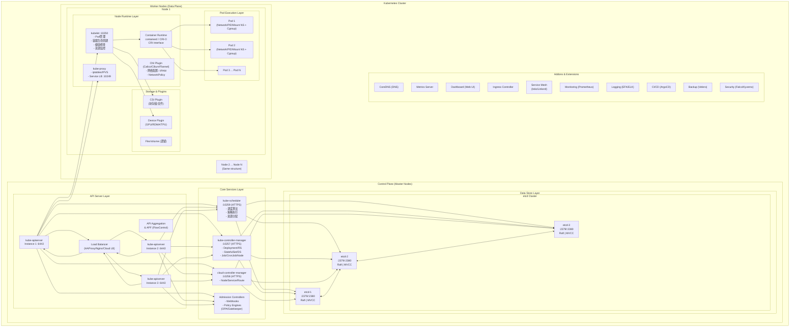

### 1.2 设计理念与核心原则

| 设计原则 | 描述 | 体现 |
|----------|------|------|
| **声明式 API** | 描述期望状态，由系统驱动到达 | 所有资源都是声明式配置 |
| **控制器模式** | 持续调谐当前状态到期望状态 | Controller Manager 包含40+控制器 |
| **松耦合设计** | 组件通过 API Server 交互 | 组件可独立升级和扩展 |
| **可扩展性** | 插件化架构 | CRI/CNI/CSI/Device Plugin/Admission |
| **自愈能力** | 自动故障检测与恢复 | [[ReplicaSet|ReplicaSet]]/DaemonSet 自动重启 |
| **水平扩展** | 通过副本实现扩展 | HPA/VPA/Cluster Autoscaler |
| **不可变基础设施** | 容器镜像不可变 | 配置变更通过滚动更新 |
| **最终一致性** | 分布式系统一致性模型 | 基于 etcd 的最终一致性 |

### 1.3 分层架构模型

| 层次 | 名称 | 职责 | 关键组件 |
|------|------|------|----------|
| **Layer 1** | 编排层 (Orchestration) | 调度、编排、自动化 | Scheduler, Controllers |
| **Layer 2** | API 层 (API) | 统一入口、认证授权 | API Server, Admission |
| **Layer 3** | 数据层 (Data) | 持久化存储 | etcd |
| **Layer 4** | 运行时层 (Runtime) | 容器运行环境 | kubelet, Container Runtime |
| **Layer 5** | 网络层 (Network) | Pod 网络、Service 负载均衡 | CNI, kube-proxy |
| **Layer 6** | 存储层 (Storage) | 持久化卷管理 | CSI, Volume Plugin |
| **Layer 7** | 扩展层 (Extension) | 自定义功能扩展 | CRD, Operator, Webhook |

---

<!-- chunk: 2. 控制平面详解 -->
## 2. 控制平面详解

### 2.1 kube-apiserver

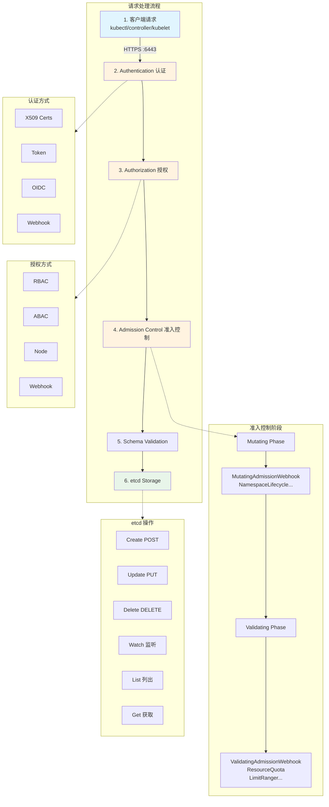

#### 核心功能

| 功能 | 描述 | 实现机制 |
|------|------|----------|
| **RESTful API** | 提供声明式 API | HTTP/HTTPS + JSON/Protobuf |
| **认证** | 验证客户端身份 | X.509/Token/OIDC/Webhook |
| **授权** | 控制访问权限 | RBAC/ABAC/Node/Webhook |
| **准入控制** | 请求拦截与修改 | Mutating/Validating Webhook |
| **数据持久化** | 存储集群状态 | etcd (MVCC + Watch) |
| **API 聚合** | 扩展 API | AA (API Aggregation) |
| **审计日志** | 记录所有操作 | Audit Policy + Backend |
| **限流** | 防止过载 | API Priority and Fairness (APF) |

#### 关键配置参数

| 参数 | 描述 | 推荐值 |
|------|------|--------|
| `--etcd-servers` | etcd 集群地址 | https://etcd1:2379,https://etcd2:2379,https://etcd3:2379 |
| `--bind-address` | 监听地址 | 0.0.0.0 (生产环境使用内网 IP) |
| `--secure-port` | HTTPS 端口 | 6443 |
| `--enable-admission-plugins` | 启用准入插件 | NamespaceLifecycle,LimitRanger,ServiceAccount,PersistentVolumeLabel,DefaultStorageClass,MutatingAdmissionWebhook,ValidatingAdmissionWebhook,ResourceQuota,PodSecurity |
| `--authorization-mode` | 授权模式 | Node,RBAC |
| `--client-ca-file` | 客户端 CA 证书 | /etc/kubernetes/pki/ca.crt |
| `--tls-cert-file` | TLS 证书 | /etc/kubernetes/pki/apiserver.crt |
| `--tls-private-key-file` | TLS 私钥 | /etc/kubernetes/pki/apiserver.key |
| `--service-cluster-ip-range` | Service CIDR | 10.96.0.0/12 |
| `--service-account-key-file` | SA 公钥 | /etc/kubernetes/pki/sa.pub |
| `--kubelet-client-certificate` | Kubelet 客户端证书 | /etc/kubernetes/pki/apiserver-kubelet-client.crt |

### 2.2 etcd

#### 架构与特性

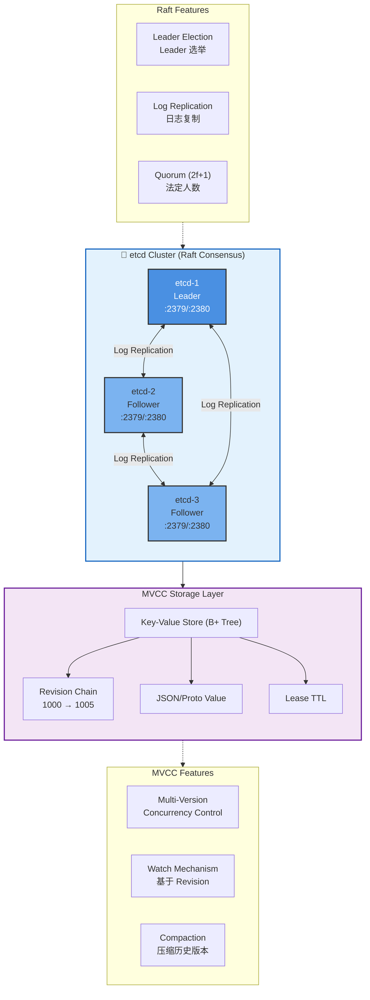

| 特性 | 描述 | 技术细节 |
|------|------|----------|
| **Raft 共识** | 保证一致性 | Leader/Follower/Candidate 角色切换 |
| **MVCC** | 多版本控制 | 保留历史版本，支持 Watch |
| **Watch** | 实时监听 | 基于 Revision 推送变化 |
| **Lease** | 租约机制 | 支持 TTL，用于心跳 |
| **事务** | 原子操作 | Compare-And-Swap (CAS) |
| **快照备份** | 数据备份 | etcdctl snapshot save |
| **水平扩展** | 只读副本 | Learner 模式 (非投票成员) |

#### 数据存储结构

```
/registry/
├── pods/
│   ├── default/nginx-xxx         → Pod 对象
│   └── kube-system/coredns-xxx   → Pod 对象
├── deployments/
│   └── default/nginx             → Deployment 对象
├── services/
│   └── default/kubernetes        → Service 对象
├── nodes/
│   ├── node-1                    → Node 对象
│   └── node-2                    → Node 对象
├── secrets/
│   └── default/my-secret         → Secret 对象 (加密存储)
└── events/
    └── default/nginx-xxx.event   → Event 对象

# 每个对象存储格式 (简化)
{
  "apiVersion": "v1",
  "kind": "Pod",
  "metadata": {
    "name": "nginx-xxx",
    "namespace": "default",
    "resourceVersion": "1005",  # etcd Revision
    "uid": "12345678-1234-1234-1234-123456789012"
  },
  "spec": {...},
  "status": {...}
}
```

### 2.3 kube-scheduler

#### 调度流程

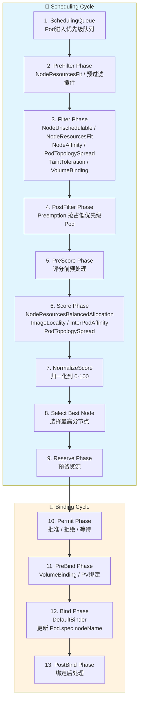

#### 调度策略

| 策略类型 | 插件 | 功能 | 应用场景 |
|----------|------|------|----------|
| **资源分配** | NodeResourcesFit | 检查 CPU/内存/GPU 是否满足 | 基础调度 |
| **亲和性** | NodeAffinity | 节点标签匹配 | 指定机型/可用区 |
| **反亲和性** | InterPodAntiAffinity | Pod 分散部署 | 高可用 |
| **拓扑分布** | PodTopologySpread | 跨可用区均衡 | 容错 |
| **污点容忍** | TaintToleration | 节点污点与 Pod 容忍 | 专用节点 |
| **优先级** | PriorityClass | 高优先级 Pod 抢占 | 关键业务 |
| **资源评分** | LeastAllocated | 选择资源最空闲节点 | 负载均衡 |
| **镜像本地性** | ImageLocality | 优先选择已有镜像节点 | 加速启动 |

### 2.4 kube-controller-manager

#### 内置控制器

| 控制器 | 职责 | 调谐逻辑 | 关键参数 |
|--------|------|----------|----------|
| **Deployment** | 管理 ReplicaSet | 滚动更新、回滚 | maxSurge, maxUnavailable |
| **ReplicaSet** | 维持 Pod 副本数 | 创建/删除 Pod | replicas |
| **StatefulSet** | 有状态应用 | 顺序创建/删除 | podManagementPolicy |
| **DaemonSet** | 每节点一个 Pod | 节点变化时调整 | updateStrategy |
| **Job** | 批处理任务 | 运行到完成 | completions, parallelism |
| **CronJob** | 定时任务 | 定时创建 Job | schedule |
| **Node** | 节点生命周期 | 驱逐不健康节点 Pod | node-eviction-rate |
| **ServiceAccount** | 自动创建 SA | 注入 Token | service-account-private-key-file |
| **Namespace** | 命名空间生命周期 | 级联删除资源 | concurrent-namespace-syncs |
| **PersistentVolume** | PV 绑定 | PV/PVC 匹配 | pv-recycler-pod-template-filepath-nfs |
| **EndpointSlice** | Service 端点 | 更新后端 Pod IP | concurrent-endpoint-syncs |
| **ResourceQuota** | 资源配额 | 限制命名空间资源 | quota-resync-period |
| **HorizontalPodAutoscaler** | 水平扩缩容 | 根据指标调整副本 | horizontal-pod-autoscaler-sync-period |
| **TTLAfterFinished** | 清理已完成 Job | 定时删除 | ttl-seconds-after-finished |

#### Leader 选举机制

```yaml
# Controller Manager Leader 选举配置
apiVersion: v1
kind: Endpoints
metadata:
  name: kube-controller-manager
  namespace: kube-system
  annotations:
    control-plane.alpha.kubernetes.io/leader: |
      {
        "holderIdentity": "master-1_xxxxx",
        "leaseDurationSeconds": 15,
        "acquireTime": "2026-01-20T10:00:00Z",
        "renewTime": "2026-01-20T10:00:10Z",
        "leaderTransitions": 0
      }
```

| 参数 | 描述 | 默认值 |
|------|------|--------|
| `--leader-elect` | 启用 Leader 选举 | true |
| `--leader-elect-lease-duration` | Lease 持续时间 | 15s |
| `--leader-elect-renew-deadline` | 续约截止时间 | 10s |
| `--leader-elect-retry-period` | 重试周期 | 2s |
| `--leader-elect-resource-name` | 资源名称 | kube-controller-manager |

### 2.5 cloud-controller-manager

#### 云平台集成

| 云平台 | CCM 实现 | 功能 |
|--------|----------|------|
| **AWS** | cloud-provider-aws | Node/Service/Route Controller |
| **Azure** | cloud-provider-azure | Node/Service/Route Controller |
| **GCP** | cloud-provider-gcp | Node/Service/Route Controller |
| **阿里云** | cloud-provider-alibaba-cloud | Node/Service/Route Controller |
| **OpenStack** | cloud-provider-openstack | Node/Service/Route Controller |

#### 核心控制器

| 控制器 | 职责 | 云平台操作 |
|--------|------|------------|
| **Node Controller** | 节点生命周期管理 | 查询云平台实例状态、添加节点标签 (zone/region/instance-type) |
| **Service Controller** | LoadBalancer Service | 创建/删除云负载均衡器 |
| **Route Controller** | Pod 网络路由 | 配置 VPC 路由表 |
| **Volume Controller** | 云盘挂载 | Attach/Detach 云盘 (已废弃，迁移到 CSI) |

---

<!-- chunk: 3. 节点组件详解 -->
## 3. 节点组件详解

### 3.1 kubelet

#### 核心功能架构

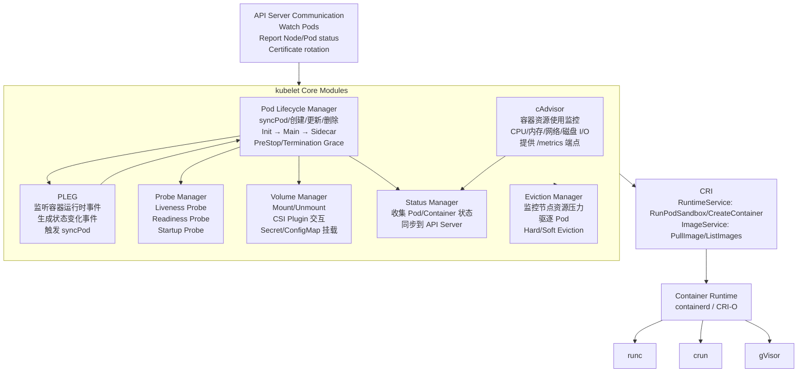

#### 关键配置参数

| 参数 | 描述 | 推荐值 |
|------|------|--------|
| `--kubeconfig` | API Server 配置 | /etc/kubernetes/kubelet.conf |
| `--pod-manifest-path` | 静态 Pod 路径 | /etc/kubernetes/manifests |
| `--container-runtime-endpoint` | CRI Socket | unix:///run/containerd/containerd.sock |
| `--cgroup-driver` | cgroup 驱动 | systemd (与 runtime 一致) |
| `--eviction-hard` | 硬驱逐阈值 | memory.available<100Mi,nodefs.available<10% |
| `--eviction-soft` | 软驱逐阈值 | memory.available<200Mi,nodefs.available<15% |
| `--eviction-soft-grace-period` | 软驱逐宽限期 | memory.available=1m30s |
| `--max-pods` | 单节点最大 Pod 数 | 110 (云平台可能更高) |
| `--pod-infra-container-image` | pause 镜像 | registry.k8s.io/pause:3.9 |
| `--cluster-dns` | CoreDNS IP | 10.96.0.10 |
| `--cluster-domain` | 集群域名 | cluster.local |

### 3.2 kube-proxy

#### 工作模式对比

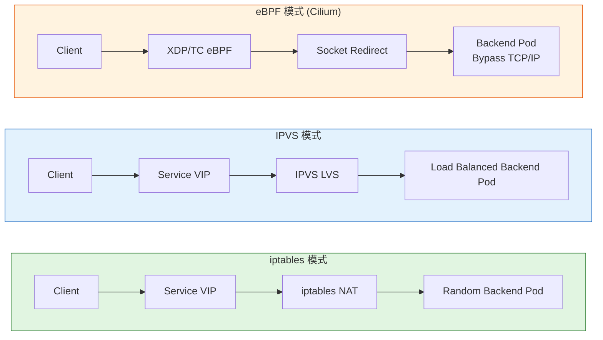

| 模式 | 延迟 | 吞吐量 | CPU 消耗 | Service 规模 | 推荐场景 |
|------|------|--------|----------|--------------|----------|
| **iptables** | 高 | 低 | 高 | <1000 | 小规模/兼容性 |
| **IPVS** | 中 | 高 | 中 | >1000 | 大规模生产 |
| **eBPF** | 最低 | 最高 | 最低 | 无限制 | 高性能/新内核 |

#### IPVS 配置示例

```yaml
# kube-proxy ConfigMap
apiVersion: v1
kind: ConfigMap
metadata:
  name: kube-proxy
  namespace: kube-system
data:
  config.conf: |
    apiVersion: kubeproxy.config.k8s.io/v1alpha1
    kind: KubeProxyConfiguration
    mode: ipvs
    ipvs:
      scheduler: rr  # rr, lc, dh, sh, sed
      strictARP: true  # 启用严格 ARP (配合 MetalLB)
      syncPeriod: 30s
      minSyncPeriod: 5s
    iptables:
      masqueradeAll: false
      masqueradeBit: 14
      minSyncPeriod: 0s
      syncPeriod: 30s
    clusterCIDR: 10.244.0.0/16
    metricsBindAddress: 0.0.0.0:10249
```

### 3.3 容器运行时

#### 运行时演进

```
Docker (Monolithic) ──► containerd (Modular) ──► CRI-O (Lightweight)
        │                       │                       │
        ├─ dockerd              ├─ containerd           ├─ CRI-O
        ├─ containerd           │                       │
        └─ runc                 └─ runc                 └─ runc

Kubernetes 1.24+ 移除 dockershim，推荐:
- containerd (通用)
- CRI-O (Kubernetes 专用)
```

| 运行时 | 优点 | 缺点 | 适用场景 |
|--------|------|------|----------|
| **containerd** | 轻量、性能好、生态丰富 | 调试工具少 (需 nerdctl) | 通用生产 |
| **CRI-O** | 极简、Kubernetes 原生 | 功能有限 | Kubernetes 专用 |
| **Docker** | 生态最好、调试方便 | 笨重 (需 cri-dockerd) | 开发环境 |

---

<!-- chunk: 4. 核心对象模型 -->
## 4. 核心对象模型

### 4.1 Kubernetes 对象层次

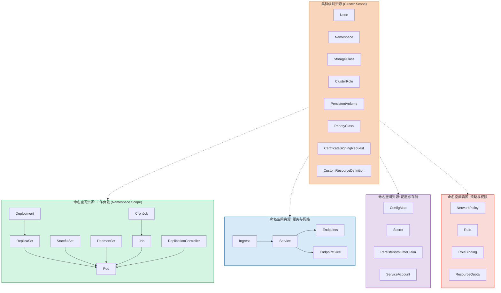

### 4.2 对象元数据结构

```yaml
# 标准 Kubernetes 对象结构
apiVersion: apps/v1      # API 组/版本
kind: Deployment         # 资源类型
metadata:                # 元数据
  name: nginx-deployment
  namespace: default
  labels:                # 标签 (用于选择器)
    app: nginx
    environment: production
  annotations:           # 注解 (用于存储非标识性信息)
    description: "Nginx web server"
    deployment.kubernetes.io/revision: "3"
  ownerReferences:       # 所有者引用 (级联删除)
  - apiVersion: apps/v1
    kind: ReplicaSet
    name: nginx-deployment-xxx
    uid: xxx
    controller: true
    blockOwnerDeletion: true
  finalizers:            # 终结器 (删除前执行清理)
  - kubernetes.io/pvc-protection
  resourceVersion: "1234567"  # etcd Revision (乐观并发控制)
  generation: 5              # spec 修改次数
  creationTimestamp: "2026-01-20T10:00:00Z"
  uid: "12345678-1234-1234-1234-123456789012"
spec:                    # 期望状态
  replicas: 3
  selector:
    matchLabels:
      app: nginx
  template:
    metadata:
      labels:
        app: nginx
    spec:
      containers:
      - name: nginx
        image: nginx:1.25
        ports:
        - containerPort: 80
status:                  # 当前状态 (由 Controller 更新)
  replicas: 3
  availableReplicas: 3
  readyReplicas: 3
  conditions:
  - type: Available
    status: "True"
    lastUpdateTime: "2026-01-20T10:01:00Z"
    lastTransitionTime: "2026-01-20T10:00:30Z"
    reason: MinimumReplicasAvailable
    message: "Deployment has minimum availability."
```

### 4.3 Pod 生命周期

```mermaid
flowchart TD
    subgraph PodLifecycle["Pod 生命周期状态机"]
        direction TB

        Pending["["<b>Pending</b><br/>等待调度"]
        PendingDetail["API Server 已创建 Pod<br/>• 等待 Scheduler 调度<br/>• 等待镜像拉取<br/>• 等待存储卷挂载"]

        Creating["["<b>Creating</b><br/>创建中"]
        CreatingDetail["kubelet 接收分配<br/>• 创建 Pod Sandbox<br/>• 调用 CNI 配置网络<br/>• 拉取镜像<br/>• 顺序启动 Init Containers<br/>• 并行启动 Main Containers"]

        Running["["<b>Running</b><br/>运行中"]
        RunningDetail["至少一个容器运行<br/>• Startup Probe → Liveness Probe<br/>• Readiness Probe → Service 流量<br/>• PostStart Hook"]

        Succeeded["["<b>Succeeded</b><br/>成功完成"]
        SucceededDetail["所有容器正常退出 (0)<br/>restartPolicy: Never"]

        Failed["["<b>Failed</b><br/>失败"]
        FailedDetail["容器异常退出 (非0)<br/>Always/OnFailure → 重启<br/>Never → 保持 Failed"]

        Terminating["["<b>Terminating</b><br/>终止中"]
        TerminatingDetail["PreStop Hook<br/>SIGTERM → grace period<br/>SIGKILL → 清理资源"]

        Completed["["<b>Completed</b>"]
        Unknown["["<b>Unknown</b>"]

        Pending --> Creating
        Creating --> Running
        Running --> Succeeded
        Running --> Failed
        Succeeded --> Terminating
        Failed --> Terminating
        Terminating --> Completed
        Terminating --> Unknown
    end

    style Pending fill:#e1f5fe
    style Creating fill:#e8f5e9
    style Running fill:#fff3e0
    style Succeeded fill:#e8f5e9
    style Failed fill:#ffebee
    style Terminating fill:#fce4ec
    style Completed fill:#f3e5f5
    style Unknown fill:#fff8e1
```

#### Pod 状态条件 (Conditions)

| Condition Type | True 含义 | False 含义 |
|----------------|-----------|------------|
| **PodScheduled** | Pod 已调度到节点 | 等待调度 |
| **Initialized** | 所有 Init Container 完成 | Init Container 运行中 |
| **ContainersReady** | 所有容器就绪 | 容器未就绪 |
| **Ready** | Pod 就绪 (可接收流量) | Pod 未就绪 |

---

<!-- chunk: 5. 通信机制 -->
## 5. 通信机制

### 5.1 组件间通信

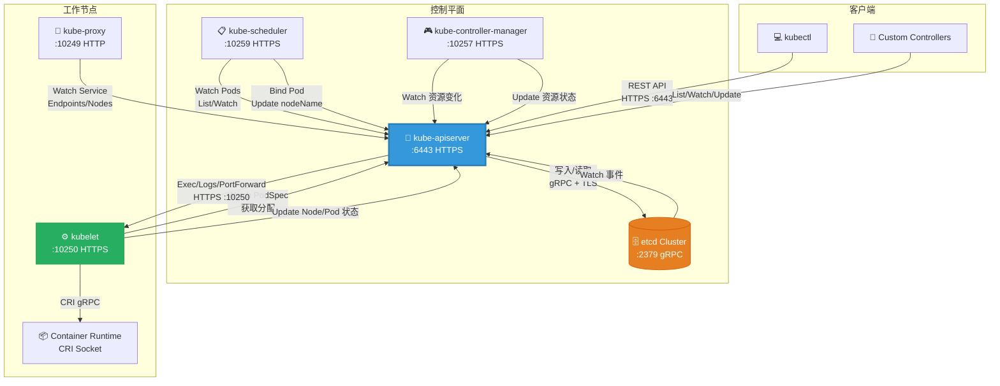

### 5.2 认证与授权流程

| 步骤 | 阶段 | 机制 | 示例 |
|------|------|------|------|
| **1. 认证** | Authentication | X.509 证书/Bearer Token | kubectl (客户端证书) |
| **2. 授权** | Authorization | RBAC (Role-Based Access Control) | ClusterRole/RoleBinding |
| **3. 准入控制** | Admission Control | Mutating/Validating Webhook | 注入 Sidecar/策略验证 |
| **4. 持久化** | Storage | etcd | 保存到 /registry/pods/... |

### 5.3 Watch 机制详解

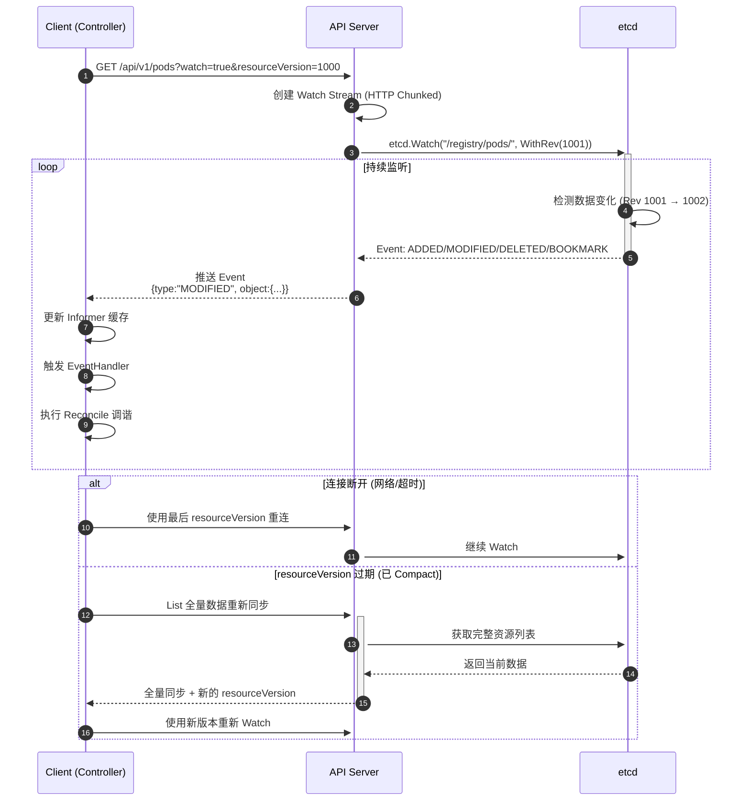

#### Watch 关键参数

| 参数 | 描述 | 示例 |
|------|------|------|
| `watch=true` | 启用 Watch | `?watch=true` |
| `resourceVersion` | 起始版本 | `?resourceVersion=1000` |
| `timeoutSeconds` | 超时时间 | `?timeoutSeconds=600` |
| `allowWatchBookmarks` | 允许 Bookmark | `?allowWatchBookmarks=true` |

---

<!-- chunk: 6. 高可用架构 -->
## 6. 高可用架构

### 6.1 控制平面高可用部署

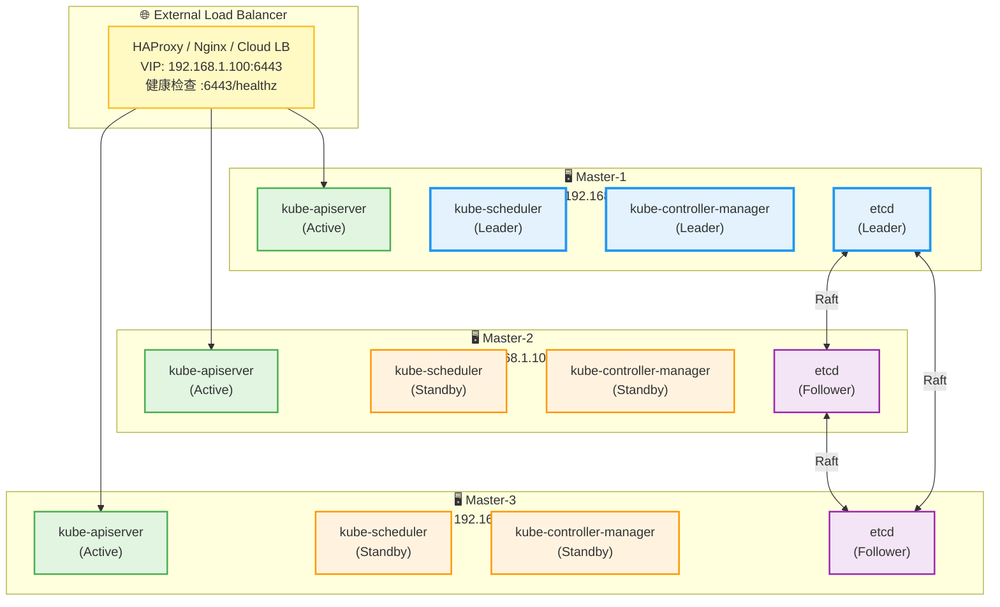

#### HA 关键配置

| 组件 | HA 方式 | 配置 | 最小副本数 |
|------|---------|------|------------|
| **API Server** | 多副本 + LB | 无状态，可水平扩展 | 2 (推荐 3) |
| **etcd** | Raft 集群 | 奇数节点 (2f+1) | 3 (推荐 5) |
| **Scheduler** | Leader 选举 | `--leader-elect=true` | 2 (推荐 3) |
| **Controller Manager** | Leader 选举 | `--leader-elect=true` | 2 (推荐 3) |

#### kubeadm HA 部署示例

```bash
# Master-1 初始化 (第一个控制平面节点)
kubeadm init \
  --control-plane-endpoint "loadbalancer.example.com:6443" \
  --upload-certs \
  --pod-network-cidr=10.244.0.0/16

# Master-2/3 加入 (其他控制平面节点)
kubeadm join loadbalancer.example.com:6443 \
  --token <token> \
  --discovery-token-ca-cert-hash sha256:<hash> \
  --control-plane \
  --certificate-key <certificate-key>

# Worker 节点加入
kubeadm join loadbalancer.example.com:6443 \
  --token <token> \
  --discovery-token-ca-cert-hash sha256:<hash>
```

### 6.2 etcd 高可用配置

#### etcd 集群拓扑

| 节点数 | 容错能力 | 推荐场景 |
|--------|----------|----------|
| 1 | 0 (不可用) | 开发/测试 |
| 3 | 1 | 小型生产 |
| 5 | 2 | 大型生产 |
| 7 | 3 | 关键业务 (罕见) |

#### 备份与恢复

> ⚠️ **🔴 灾难性操作** — 含不可逆命令，执行前必须满足变更窗口+双人复核+事前备份+回滚方案
> - `etcdctl snapshot restore`：用快照覆盖 etcd 数据目录，集群状态强制回退

```bash
# etcd 快照备份
ETCDCTL_API=3 etcdctl snapshot save /backup/etcd-$(date +%Y%m%d).db \
  --endpoints=https://127.0.0.1:2379 \
  --cacert=/etc/kubernetes/pki/etcd/ca.crt \
  --cert=/etc/kubernetes/pki/etcd/server.crt \
  --key=/etc/kubernetes/pki/etcd/server.key

# 验证快照
ETCDCTL_API=3 etcdctl snapshot status /backup/etcd-20260120.db --write-out=table

# 恢复 etcd (需停止 API Server)
ETCDCTL_API=3 etcdctl snapshot restore /backup/etcd-20260120.db \
  --data-dir=/var/lib/etcd-restore \
  --name=etcd-1 \
  --initial-cluster=etcd-1=https://192.168.1.101:2380,etcd-2=https://192.168.1.102:2380,etcd-3=https://192.168.1.103:2380 \
  --initial-advertise-peer-urls=https://192.168.1.101:2380

# 更新 etcd 数据目录
# /etc/kubernetes/manifests/etcd.yaml
# - --data-dir=/var/lib/etcd-restore
```

---

<!-- chunk: 7. 扩展机制 -->
## 7. 扩展机制

### 7.1 Kubernetes 扩展点

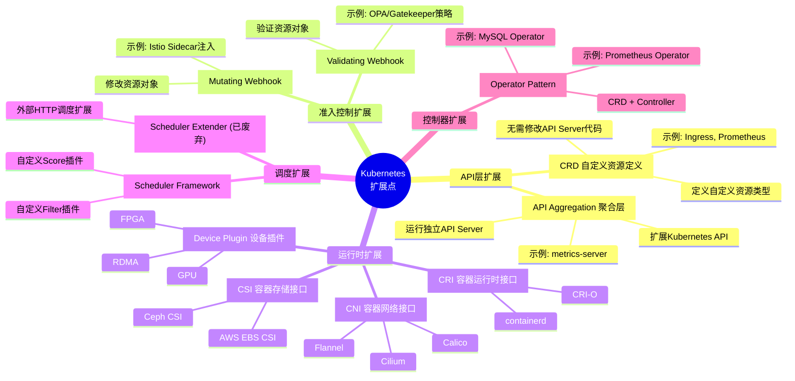

### 7.2 CRD 示例

```yaml
# 定义 CRD
apiVersion: apiextensions.k8s.io/v1
kind: CustomResourceDefinition
metadata:
  name: databases.example.com
spec:
  group: example.com
  names:
    kind: Database
    listKind: DatabaseList
    plural: databases
    singular: database
    shortNames:
    - db
  scope: Namespaced
  versions:
  - name: v1
    served: true
    storage: true
    schema:
      openAPIV3Schema:
        type: object
        properties:
          spec:
            type: object
            properties:
              engine:
                type: string
                enum: ["mysql", "postgresql"]
              version:
                type: string
              replicas:
                type: integer
                minimum: 1
            required:
            - engine
            - version
          status:
            type: object
            properties:
              ready:
                type: boolean
    subresources:
      status: {}
    additionalPrinterColumns:
    - name: Engine
      type: string
      jsonPath: .spec.engine
    - name: Replicas
      type: integer
      jsonPath: .spec.replicas
    - name: Ready
      type: boolean
      jsonPath: .status.ready
    - name: Age
      type: date
      jsonPath: .metadata.creationTimestamp

---
# 创建 CR 实例
apiVersion: example.com/v1
kind: Database
metadata:
  name: my-mysql
spec:
  engine: mysql
  version: "8.0"
  replicas: 3
```

### 7.3 Operator 模式

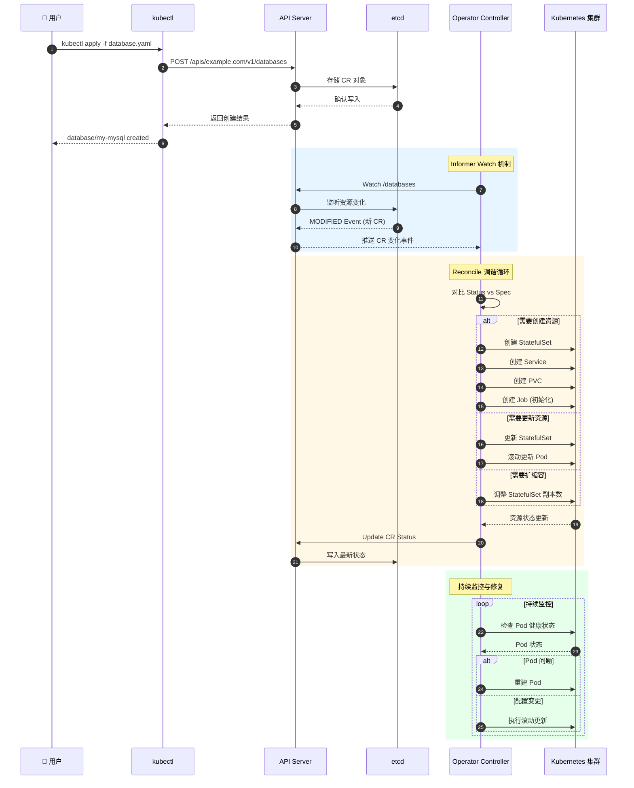

---

<!-- chunk: 8. 安全架构 -->
## 8. 安全架构

### 8.1 安全层次

```mermaid
graph TB
    subgraph "Layer 1: 集群访问控制"
        L1["🔐 认证 Authentication"] --> L2["🛡️ 授权 Authorization"]
        L2 --> L3["✅ 准入控制 Admission Control"]

        L1 --> AUTH1["X.509 Client Certificates"]
        L1 --> AUTH2["Static/Bootstrap Token"]
        L1 --> AUTH3["ServiceAccount Token"]
        L1 --> AUTH4["OpenID Connect"]
        L1 --> AUTH5["Webhook Token"]

        L2 --> AUTHZ1["RBAC"]
        L2 --> AUTHZ2["ABAC"]
        L2 --> AUTHZ3["Node Authorization"]
        L2 --> AUTHZ4["Webhook Authorization"]

        L3 --> ADM1["PodSecurity"]
        L3 --> ADM2["Mutating Webhook"]
        L3 --> ADM3["Validating Webhook"]
        L3 --> ADM4["ResourceQuota/LimitRanger"]
    end

    subgraph "Layer 2: 网络隔离"
        L4["🌐 NetworkPolicy"] --> L5["🔒 Service Mesh mTLS"]
        L4 --> NET1["Ingress/Egress 规则"]
        L4 --> NET2["命名空间隔离"]
        L4 --> NET3["Pod 级防火墙"]
        L5 --> NET4["Istio/Linkerd"]
        L5 --> NET5["东西向流量加密"]
    end

    subgraph "Layer 3: 容器安全"
        L6["📦 镜像安全"] --> L7["🛡️ Runtime Security"]
        L7 --> L8["📋 Pod Security Standards"]

        L6 --> IMG1["镜像签名验证 Cosign/Notary"]
        L6 --> IMG2["镜像扫描 Trivy/Clair"]
        L6 --> IMG3["私有镜像仓库"]

        L7 --> RUN1["Seccomp"]
        L7 --> RUN2["AppArmor/SELinux"]
        L7 --> RUN3["Capabilities Drop"]
        L7 --> RUN4["User Namespaces"]
        L7 --> RUN5["安全容器 gVisor/Kata"]

        L8 --> SEC1["Privileged 特权模式"]
        L8 --> SEC2["Baseline 基线"]
        L8 --> SEC3["Restricted 受限模式"]
    end

    subgraph "Layer 4: 数据安全"
        L9["🔑 Secrets Management"] --> L10["📊 Audit Logging"]
        L9 --> SECM1["etcd 加密"]
        L9 --> SECM2["Secret 对象"]
        L9 --> SECM3["Sealed Secrets"]
        L9 --> SECM4["Vault/ESO 外部密钥"]
        L10 --> AUD1["API 审计日志"]
        L10 --> AUD2["Falco 运行时审计"]
    end

    L3 -.-> L4
    L8 -.-> L9
```

### 8.2 RBAC 权限模型

```yaml
# ClusterRole (集群级别)
apiVersion: rbac.authorization.k8s.io/v1
kind: ClusterRole
metadata:
  name: pod-reader
rules:
- apiGroups: [""]
  resources: ["pods"]
  verbs: ["get", "list", "watch"]
- apiGroups: [""]
  resources: ["pods/log"]
  verbs: ["get"]

---
# Role (命名空间级别)
apiVersion: rbac.authorization.k8s.io/v1
kind: Role
metadata:
  name: deployment-manager
  namespace: production
rules:
- apiGroups: ["apps"]
  resources: ["deployments"]
  verbs: ["get", "list", "watch", "create", "update", "patch", "delete"]

---
# ClusterRoleBinding (集群级别绑定)
apiVersion: rbac.authorization.k8s.io/v1
kind: ClusterRoleBinding
metadata:
  name: read-pods-global
roleRef:
  apiGroup: rbac.authorization.k8s.io
  kind: ClusterRole
  name: pod-reader
subjects:
- kind: User
  name: jane
  apiGroup: rbac.authorization.k8s.io

---
# RoleBinding (命名空间绑定)
apiVersion: rbac.authorization.k8s.io/v1
kind: RoleBinding
metadata:
  name: manage-deployments
  namespace: production
roleRef:
  apiGroup: rbac.authorization.k8s.io
  kind: Role
  name: deployment-manager
subjects:
- kind: ServiceAccount
  name: cicd-deployer
  namespace: production
```

### 8.3 Pod Security Standards

| 级别 | 描述 | 限制 |
|------|------|------|
| **Privileged** | 无限制 | 允许已知的权限提升 |
| **Baseline** | 基线 | 阻止已知的权限提升，允许默认配置 |
| **Restricted** | 严格限制 | 强制执行当前 Pod 加固最佳实践 |

```yaml
# Namespace 级别应用 Pod Security
apiVersion: v1
kind: Namespace
metadata:
  name: production
  labels:
    pod-security.kubernetes.io/enforce: restricted
    pod-security.kubernetes.io/audit: restricted
    pod-security.kubernetes.io/warn: restricted
```

---

<!-- chunk: 9. 监控与可观测性 -->
## 9. 监控与可观测性

### 9.1 可观测性三大支柱

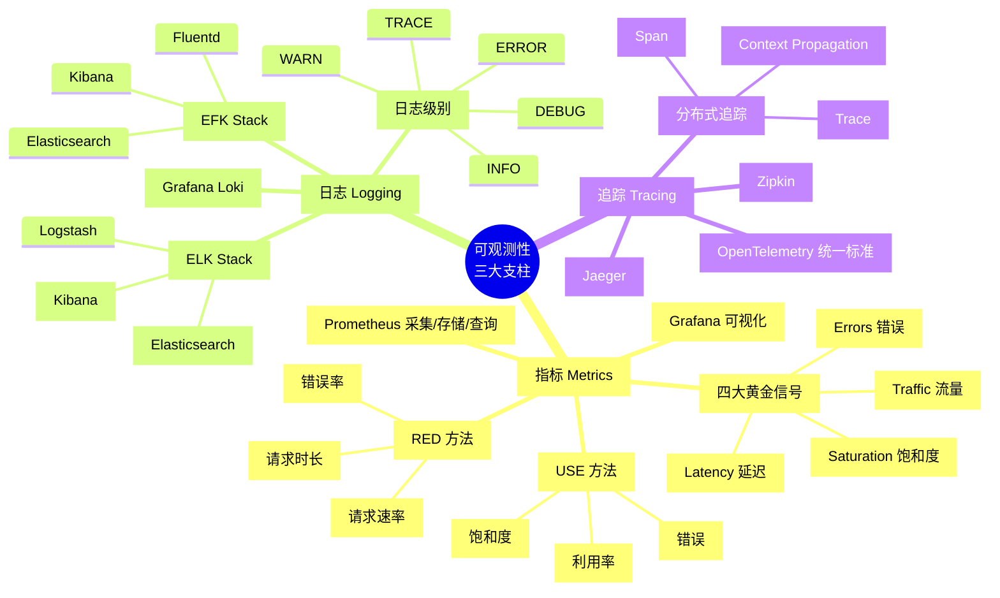

### 9.2 核心监控指标

| 层次 | 指标类别 | 关键指标 | 采集方式 |
|------|----------|----------|----------|
| **控制平面** | API Server | `apiserver_request_duration_seconds`, `apiserver_request_total` | Prometheus /metrics |
| | etcd | `etcd_disk_backend_commit_duration_seconds`, `etcd_mvcc_db_total_size_in_bytes` | Prometheus /metrics |
| | Scheduler | `scheduler_scheduling_attempt_duration_seconds`, `scheduler_pending_pods` | Prometheus /metrics |
| | Controller Manager | `workqueue_depth`, `workqueue_queue_duration_seconds` | Prometheus /metrics |
| **节点** | Kubelet | `kubelet_pod_start_duration_seconds`, `kubelet_running_pods` | Prometheus /metrics |
| | cAdvisor | `container_cpu_usage_seconds_total`, `container_memory_working_set_bytes` | Prometheus /metrics |
| | Node Exporter | `node_cpu_seconds_total`, `node_memory_MemAvailable_bytes` | Prometheus /metrics |
| **应用** | Pod/Container | CPU/内存/网络/磁盘 I/O | cAdvisor |
| | Service | 请求速率/错误率/延迟 | Service Mesh / Application |

### 9.3 告警规则示例

```yaml
# Prometheus AlertRule
apiVersion: monitoring.coreos.com/v1
kind: PrometheusRule
metadata:
  name: kubernetes-alerts
  namespace: monitoring
spec:
  groups:
  - name: kubernetes-system
    interval: 30s
    rules:
    # API Server 告警
    - alert: KubeAPIDown
      expr: up{job="apiserver"} == 0
      for: 5m
      labels:
        severity: critical
      annotations:
        summary: "Kubernetes API Server is down"
        description: "API Server {{ $labels.instance }} is down for 5 minutes."

    - alert: APIServerLatencyHigh
      expr: histogram_quantile(0.99, apiserver_request_duration_seconds_bucket{verb!="WATCH"}) > 4
      for: 10m
      labels:
        severity: warning
      annotations:
        summary: "API Server latency is high"
        description: "P99 latency for {{ $labels.verb }} requests is {{ $value }}s"

    # etcd 告警
    - alert: EtcdNoLeader
      expr: etcd_server_has_leader == 0
      for: 1m
      labels:
        severity: critical
      annotations:
        summary: "etcd has no leader"
        description: "etcd cluster has no leader for 1 minute."

    - alert: EtcdHighFsyncDuration
      expr: histogram_quantile(0.99, etcd_disk_backend_commit_duration_seconds_bucket) > 0.5
      for: 5m
      labels:
        severity: warning
      annotations:
        summary: "etcd fsync duration is high"
        description: "P99 fsync duration is {{ $value }}s"

    # 节点告警
    - alert: NodeNotReady
      expr: kube_node_status_condition{condition="Ready",status="true"} == 0
      for: 5m
      labels:
        severity: critical
      annotations:
        summary: "Node is not ready"
        description: "Node {{ $labels.node }} is not ready for 5 minutes."

    - alert: NodeMemoryPressure
      expr: kube_node_status_condition{condition="MemoryPressure",status="true"} == 1
      for: 5m
      labels:
        severity: warning
      annotations:
        summary: "Node has memory pressure"
        description: "Node {{ $labels.node }} has memory pressure."

    # Pod 告警
    - alert: PodCrashLooping
      expr: rate(kube_pod_container_status_restarts_total[15m]) > 0
      for: 15m
      labels:
        severity: warning
      annotations:
        summary: "Pod is crash looping"
        description: "Pod {{ $labels.namespace }}/{{ $labels.pod }} is restarting frequently."

    - alert: PodNotReady
      expr: kube_pod_status_phase{phase!~"Running|Succeeded"} > 0
      for: 15m
      labels:
        severity: warning
      annotations:
        summary: "Pod is not ready"
        description: "Pod {{ $labels.namespace }}/{{ $labels.pod }} is in {{ $labels.phase }} phase for 15 minutes."
```

---

<!-- chunk: 10. 生产实践案例 -->
## 10. 生产实践案例

### 10.1 大规模集群优化

| 优化项 | 配置 | 效果 |
|--------|------|------|
| **API Server** | `--max-requests-inflight=400`, `--max-mutating-requests-inflight=200` | 提高并发处理能力 |
| | `--etcd-compaction-interval=5m` | 控制 etcd 压缩频率 |
| | `--event-ttl=1h` | 减少 Event 对象数量 |
| **etcd** | `--quota-backend-bytes=8GB` | 增加存储配额 |
| | `--heartbeat-interval=100`, `--election-timeout=1000` | 优化心跳与选举 |
| | 定期快照备份 | 灾难恢复 |
| **Scheduler** | `--kube-api-qps=100`, `--kube-api-burst=200` | 提高 API 请求 QPS |
| **kubelet** | `--max-pods=500` | 云环境单节点更多 Pod (AWS) |
| | `--image-gc-high-threshold=90`, `--image-gc-low-threshold=80` | 镜像垃圾回收 |
| **kube-proxy** | IPVS 模式 | 大规模 Service 性能 |

### 10.2 多租户隔离方案

```yaml
# 方案一: Namespace 隔离 (软隔离)
apiVersion: v1
kind: Namespace
metadata:
  name: tenant-a
  labels:
    tenant: a
---
# ResourceQuota (限制资源)
apiVersion: v1
kind: ResourceQuota
metadata:
  name: tenant-a-quota
  namespace: tenant-a
spec:
  hard:
    requests.cpu: "100"
    requests.memory: "200Gi"
    requests.storage: "1Ti"
    persistentvolumeclaims: "50"
    pods: "500"
---
# NetworkPolicy (网络隔离)
apiVersion: networking.k8s.io/v1
kind: NetworkPolicy
metadata:
  name: deny-other-namespaces
  namespace: tenant-a
spec:
  podSelector: {}
  policyTypes:
  - Ingress
  ingress:
  - from:
    - podSelector: {}  # 只允许同命名空间

# 方案二: 虚拟集群 (硬隔离)
# - vcluster (虚拟 Kubernetes API Server)
# - Kamaji (Kubernetes 控制平面即服务)
```

### 10.3 容量规划参考

| 集群规模 | 节点数 | Pod 数 | Master 配置 | etcd 配置 |
|----------|--------|--------|-------------|-----------|
| **小型** | < 50 | < 1500 | 2C4G | 3 节点 (2C4G, SSD) |
| **中型** | 50-250 | 1500-7500 | 4C8G | 3 节点 (4C8G, SSD) |
| **大型** | 250-1000 | 7500-30000 | 8C16G | 5 节点 (8C16G, NVMe) |
| **超大型** | > 1000 | > 30000 | 16C32G | 5 节点 (16C32G, NVMe) |

### 10.4 灾难恢复检查清单

| 项目 | 备份内容 | 频率 | 存储位置 |
|------|----------|------|----------|
| **etcd 快照** | 集群状态 | 每小时 | 对象存储 (S3/OSS) |
| **证书备份** | /etc/kubernetes/pki | 每次变更 | 加密存储 |
| **配置备份** | kubeconfig, manifests | 每次变更 | Git 仓库 |
| **应用数据** | PV 数据 | 每天 (Velero) | 对象存储 |
| **恢复演练** | 完整集群重建 | 每季度 | - |

---

<!-- chunk: 附录 -->
## 附录

### A. 版本兼容性

| Kubernetes 版本 | 支持的 kubelet 版本 | 支持的 kubectl 版本 | etcd 版本 |
|-----------------|---------------------|---------------------|-----------|
| 1.32 | 1.32, 1.31, 1.30 | 1.33, 1.32, 1.31 | 3.5.x |
| 1.31 | 1.31, 1.30, 1.29 | 1.32, 1.31, 1.30 | 3.5.x |
| 1.30 | 1.30, 1.29, 1.28 | 1.31, 1.30, 1.29 | 3.5.x |
| 1.29 | 1.29, 1.28, 1.27 | 1.30, 1.29, 1.28 | 3.5.x |
| 1.28 | 1.28, 1.27, 1.26 | 1.29, 1.28, 1.27 | 3.5.x |

### B. 端口参考

| 组件 | 端口 | 协议 | 说明 |
|------|------|------|------|
| API Server | 6443 | HTTPS | Kubernetes API |
| etcd | 2379 | HTTPS | 客户端通信 |
| etcd | 2380 | HTTPS | 集群间通信 |
| kubelet | 10250 | HTTPS | kubelet API |
| kubelet | 10255 | HTTP | 只读端口 (已废弃) |
| kube-scheduler | 10259 | HTTPS | 健康检查/指标 |
| kube-controller-manager | 10257 | HTTPS | 健康检查/指标 |
| kube-proxy | 10249 | HTTP | 指标 |

### C. 常用命令速查

> ⚠️ **🟠 高危操作** — 影响业务流量或节点状态，需变更工单+影响评估+计划回滚
> - `kubectl cordon`：标记节点不可调度
> - `kubectl drain`：驱逐节点所有 Pod，业务流量受影响
> - `kubectl exec`：进入容器执行命令，可能改变容器状态

```bash
# 集群信息
kubectl cluster-info
kubectl version
kubectl api-resources

# 节点管理
kubectl get nodes
kubectl describe node <node-name>
kubectl cordon <node-name>  # 标记不可调度
kubectl drain <node-name>   # 驱逐 Pod

# Pod 调试
kubectl get pods -o wide
kubectl describe pod <pod-name>
kubectl logs <pod-name> -c <container-name>
kubectl exec -it <pod-name> -- sh

# 资源查看
kubectl top nodes
kubectl top pods

# etcd 操作
ETCDCTL_API=3 etcdctl member list
ETCDCTL_API=3 etcdctl endpoint status
ETCDCTL_API=3 etcdctl endpoint health

# 证书检查
kubeadm certs check-expiration
openssl x509 -in /etc/kubernetes/pki/apiserver.crt -text -noout
```

<!-- chunk: 11. 生产环境运维专家增强指南 -->
## 11. 生产环境运维专家增强指南

### 11.1 企业级高可用架构设计

#### 多区域灾备架构
```yaml
# 生产区多区域部署架构
multi_region_deployment:
  primary_region:
    name: "华北-北京"
    zone: ["cn-beijing-a", "cn-beijing-b", "cn-beijing-c"]
    control_plane_nodes: 3
    worker_nodes: 50
    
  secondary_region:
    name: "华东-上海" 
    zone: ["cn-shanghai-a", "cn-shanghai-b"]
    control_plane_nodes: 0  # 热备模式
    worker_nodes: 20
    
  dr_region:
    name: "华南-广州"
    zone: ["cn-guangzhou-a"]
    control_plane_nodes: 0  # 冷备模式
    worker_nodes: 10
    
  cross_region_connectivity:
    vpn_tunnel: "IPSec with 99.95% SLA"
    latency_requirement: "<10ms between regions"
    bandwidth_guarantee: "1Gbps dedicated"
```

#### 零信任安全架构实施

> ⚠️ **🟡 中危变更** — 变更集群资源状态，建议先 --dry-run 或 diff 确认
> - `helm upgrade/install`：部署/升级 release
> - `kubectl apply/create/replace`：创建/变更集群资源
> - `kubectl label/annotate`：改元数据可能影响选择器/控制器

```bash
# 生产环境安全加固脚本
#!/bin/bash
# production-security-hardening.sh

echo "🔒 开始生产环境安全加固..."

# 1. 网络层面安全
echo "🌐 配置网络策略..."
kubectl apply -f - <<EOF
apiVersion: networking.k8s.io/v1
kind: NetworkPolicy
metadata:
  name: default-deny-all
  namespace: production
spec:
  podSelector: {}
  policyTypes:
  - Ingress
  - Egress
EOF

# 2. Pod安全策略实施
echo "🛡️  配置Pod安全标准..."
kubectl label namespace production pod-security.kubernetes.io/enforce=restricted
kubectl label namespace production pod-security.kubernetes.io/enforce-version=latest

# 3. 密钥管理增强
echo "🔑 部署外部密钥管理系统..."
helm repo add external-secrets https://external-secrets.github.io/kubernetes-external-secrets/
helm install external-secrets external-secrets/kubernetes-external-secrets \
  --namespace kube-system \
  --set serviceAccount.create=false \
  --set serviceAccount.name=external-secrets

# 4. 运行时安全监控
echo "👀 部署Falco运行时安全..."
kubectl create namespace falco
helm repo add falcosecurity https://falcosecurity.github.io/charts
helm install falco falcosecurity/falco \
  --namespace falco \
  --set ebpf.enabled=true \
  --set falcosidekick.enabled=true \
  --set falcosidekick.webui.enabled=true
```

### 11.2 性能优化专家指南

#### 集群性能基准测试矩阵
```yaml
# 不同规模集群的性能基准
performance_benchmarks:
  small_cluster:  # 10-50节点
    target_metrics:
      api_server_latency_p99: "<50ms"
      scheduler_throughput: ">100 pods/sec"
      etcd_disk_latency: "<5ms"
    resource_allocation:
      control_plane: "8C16G"
      worker_nodes: "4C8G"
      
  medium_cluster:  # 50-200节点
    target_metrics:
      api_server_latency_p99: "<100ms"
      scheduler_throughput: ">200 pods/sec"
      etcd_disk_latency: "<10ms"
    resource_allocation:
      control_plane: "16C32G"
      worker_nodes: "8C16G"
      
  large_cluster:  # 200-1000节点
    target_metrics:
      api_server_latency_p99: "<200ms"
      scheduler_throughput: ">500 pods/sec"
      etcd_disk_latency: "<15ms"
    resource_allocation:
      control_plane: "32C64G"
      worker_nodes: "16C32G"
      
  xlarge_cluster:  # 1000+节点
    target_metrics:
      api_server_latency_p99: "<500ms"
      scheduler_throughput: ">1000 pods/sec"
      etcd_disk_latency: "<20ms"
    resource_allocation:
      control_plane: "多区域部署"
      api_server_instances: 10+
      etcd_cluster: "9节点分片"
```

#### 自动化性能调优脚本
```python
#!/usr/bin/env python3
# cluster-performance-tuner.py

import subprocess
import json
import time
from typing import Dict, List

class ClusterPerformanceTuner:
    def __init__(self):
        self.metrics_thresholds = {
            'api_latency_p99': 100,  # ms
            'etcd_disk_latency': 10,  # ms
            'node_cpu_utilization': 70,  # %
            'pod_startup_time': 30  # seconds
        }
    
    def collect_metrics(self) -> Dict:
        """收集集群关键性能指标"""
        metrics = {}
        
        # API Server 延迟
        api_metrics = subprocess.run([
            'kubectl', 'get', '--raw', 
            '/apis/metrics.k8s.io/v1beta1/nodes'
        ], capture_output=True, text=True)
        
        # etcd 性能
        etcd_metrics = subprocess.run([
            'kubectl', 'exec', '-n', 'kube-system',
            'etcd-$(hostname)', '--',
            'etcdctl', 'endpoint', 'status', '-w', 'json'
        ], capture_output=True, text=True)
        
        # 节点资源使用
        node_metrics = subprocess.run([
            'kubectl', 'top', 'nodes', '-o', 'json'
        ], capture_output=True, text=True)
        
        return {
            'api_metrics': json.loads(api_metrics.stdout) if api_metrics.returncode == 0 else {},
            'etcd_metrics': json.loads(etcd_metrics.stdout) if etcd_metrics.returncode == 0 else {},
            'node_metrics': json.loads(node_metrics.stdout) if node_metrics.returncode == 0 else {}
        }
    
    def analyze_performance(self, metrics: Dict) -> List[str]:
        """分析性能瓶颈"""
        recommendations = []
        
        # API Server 延迟分析
        if metrics.get('api_metrics'):
            avg_latency = self.calculate_avg_latency(metrics['api_metrics'])
            if avg_latency > self.metrics_thresholds['api_latency_p99']:
                recommendations.append(f"API Server 延迟过高 ({avg_latency}ms)，建议:")
                recommendations.append("- 增加 API Server 实例数")
                recommendations.append("- 启用 API 优先级和公平性")
                recommendations.append("- 优化 etcd 性能")
        
        # etcd 性能分析
        if metrics.get('etcd_metrics'):
            disk_latency = self.extract_etcd_disk_latency(metrics['etcd_metrics'])
            if disk_latency > self.metrics_thresholds['etcd_disk_latency']:
                recommendations.append(f"etcd 磁盘延迟过高 ({disk_latency}ms)，建议:")
                recommendations.append("- 使用更快的存储介质 (NVMe SSD)")
                recommendations.append("- 调整 etcd 参数 (--quota-backend-bytes)")
                recommendations.append("- 考虑 etcd 集群扩展")
        
        return recommendations
    
    def generate_optimization_plan(self, recommendations: List[str]) -> str:
        """生成优化执行计划"""
        plan = """
<!-- chunk: 🚀 集群性能优化执行计划 -->
## 🚀 集群性能优化执行计划

### 立即执行 (0-2小时)
"""
        for rec in recommendations[:3]:  # 前3个最紧急的建议
            plan += f"- {rec}\n"
        
        plan += """
### 短期优化 (1-2周)
- 部署集群性能监控面板
- 实施自动化扩缩容策略
- 优化应用资源配置

### 长期规划 (1-3月)
- 架构重构评估
- 多集群部署规划
- 成本效益分析
"""
        return plan

# 使用示例
if __name__ == "__main__":
    tuner = ClusterPerformanceTuner()
    current_metrics = tuner.collect_metrics()
    recommendations = tuner.analyze_performance(current_metrics)
    optimization_plan = tuner.generate_optimization_plan(recommendations)
    
    print(optimization_plan)
```

### 11.3 成本优化专家策略

#### 智能资源调度优化
```yaml
# 成本优化的调度器配置
cost_optimized_scheduling:
  priority_classes:
    critical: 
      value: 1000000
      global_default: false
      description: "业务关键应用"
      
    production:
      value: 900000
      global_default: false
      description: "生产环境应用"
      
    batch:
      value: 500000
      global_default: false
      description: "批处理作业"
      
    development:
      value: 100000
      global_default: true
      description: "开发测试环境"

  node_affinity_rules:
    cost_optimization:
      preferred_during_scheduling:
        - weight: 100
          preference:
            match_expressions:
              - key: "node.kubernetes.io/instance-type"
                operator: "In"
                values: ["ecs.g6e.large", "ecs.c6e.large"]  # 经济型实例
                
    performance_critical:
      required_during_scheduling:
        - match_expressions:
            - key: "node.kubernetes.io/instance-type"
              operator: "In"
              values: ["ecs.g7ne.2xlarge", "ecs.c7ne.2xlarge"]  # 性能型实例
```

#### 混合云成本优化策略

> ⚠️ **🟡 中危变更** — 变更集群资源状态，建议先 --dry-run 或 diff 确认
> - `helm upgrade/install`：部署/升级 release
> - `kubectl apply/create/replace`：创建/变更集群资源
> - `kubectl label/annotate`：改元数据可能影响选择器/控制器

```bash
#!/bin/bash
# hybrid-cloud-cost-optimizer.sh

# Spot实例利用策略
setup_spot_instances() {
    echo "💰 配置Spot实例组..."
    
    cat <<EOF | kubectl apply -f -
apiVersion: karpenter.sh/v1alpha5
kind: Provisioner
metadata:
  name: spot-worker-pool
spec:
  requirements:
    - key: "karpenter.sh/capacity-type"
      operator: In
      values: ["spot"]
    - key: "kubernetes.io/arch"
      operator: In
      values: ["amd64"]
  limits:
    resources:
      cpu: 1000
      memory: 1000Gi
  provider:
    subnetSelector:
      Tier: "Private"
    securityGroupSelector:
      Tier: "Worker"
  ttlSecondsAfterEmpty: 30
EOF
}

# 应用成本标签策略
apply_cost_allocation_labels() {
    echo "🏷️  应用成本分摊标签..."
    
    kubectl label namespaces --all \
        cost-center=engineering \
        department=platform \
        environment=production \
        owner=devops-team --overwrite
}

# 成本监控仪表板
deploy_cost_monitoring() {
    echo "📊 部署成本监控..."
    
    helm repo add kubecost https://kubecost.github.io/cost-analyzer/
    helm install kubecost kubecost/cost-analyzer \
        --namespace kubecost \
        --create-namespace \
        --set kubecostToken="your-token-here" \
        --set prometheus.server.persistentVolume.size=32Gi \
        --set persistentVolume.size=32Gi
}

# 执行所有优化策略
main() {
    setup_spot_instances
    apply_cost_allocation_labels
    deploy_cost_monitoring
    
    echo "✅ 成本优化配置完成"
    echo "💡 建议定期审查成本报告并调整策略"
}

main
```

### 11.4 问题应急响应专家手册

#### SRE故障处理黄金法则
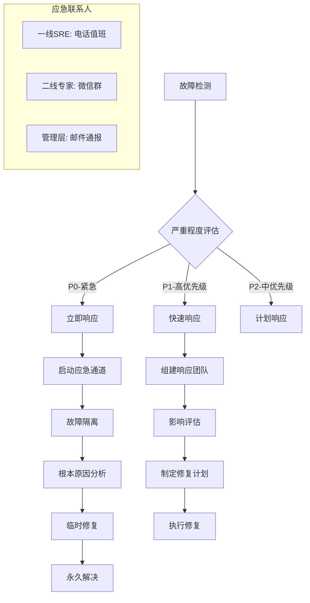

#### 自动化故障恢复脚本

> ⚠️ **🟡 中危变更** — 变更集群资源状态，建议先 --dry-run 或 diff 确认
> - `kubectl delete`：删除资源（可由声明式清单重建）
> - `kubectl exec`：进入容器执行命令，可能改变容器状态

```bash
#!/bin/bash
# automated-failure-recovery.sh

set -euo pipefail

# 故障检测和分类
detect_failure() {
    local component=$1
    case $component in
        "api-server")
            kubectl get --raw /healthz >/dev/null 2>&1
            return $?
            ;;
        "etcd")
            ETCD_POD=$(kubectl get pods -n kube-system -l component=etcd -o jsonpath='{.items[0].metadata.name}')
            kubectl exec -n kube-system $ETCD_POD -- etcdctl endpoint health
            return $?
            ;;
        "nodes")
            not_ready_count=$(kubectl get nodes --no-headers | awk '$2 != "Ready" {print $1}' | wc -l)
            return $((not_ready_count > 0 ? 1 : 0))
            ;;
    esac
}

# 自动恢复流程
auto_recovery() {
    local failure_type=$1
    
    case $failure_type in
        "api-server-down")
            echo "🔄 重启API Server..."
            kubectl delete pod -n kube-system -l component=kube-apiserver
            ;;
        "etcd-unhealthy")
            echo "🔄 恢复etcd集群..."
            # 这里应该调用具体的etcd恢复脚本
            ;;
        "node-not-ready")
            echo "🔄 修复节点问题..."
            # 执行节点诊断和修复
            ;;
    esac
}

# 主监控循环
main() {
    COMPONENTS=("api-server" "etcd" "nodes")
    
    while true; do
        for component in "${COMPONENTS[@]}"; do
            if ! detect_failure "$component"; then
                echo "🚨 检测到 $component 问题"
                auto_recovery "${component}-down"
                
                # 发送告警通知
                curl -X POST "https://hooks.slack.com/services/YOUR/SLACK/WEBHOOK" \
                    -H "Content-Type: application/json" \
                    -d "{\"text\": \"🚨 Kubernetes组件问题: $component\"}"
            fi
        done
        
        sleep 60  # 每分钟检查一次
    done
}

# 后台运行监控
main &
echo "🎯 问题监控已启动 (PID: $!)"
```

---

---

**表格底部标记**: Kusheet Project | 作者: Allen Galler (allengaller@gmail.com) | 参考: [Kubernetes 官方文档](https://kubernetes.io/docs/)

---

<!-- chunk: Obsidian 相关文档 -->
## Obsidian 相关文档

- domain-01-cluster-fundamentals MOC
- [[domain-01-cluster-fundamentals/README.md|Domain-1: Kubernetes架构基础]]
- Domain-1 架构基础 — 开源项目索引
- Kubernetes 核心组件深度剖析
- 03 - 功能和API表
- 04 - Kubernetes 源码结构深度解析
- kubectl 命令完整参考
- 06 - 集群配置参数完全参考
- 07 - 升级路径与策略指南
- 08 - 多租户架构设计 (Multi-Tenancy Architecture)
- 09 - 边缘计算集成架构 (KubeEdge/OpenYurt)
- 10 - Windows 容器支持与集成指南

## Related

- 设计原则——理解 K8s 的设计哲学
- 控制平面架构深度解析
- [[domain-17-system-foundation/topic-cheat-sheet/k8s.md|K8s 命令速查卡]]
- 相关知识域: domain-13-container-runtime
- 相关知识域: domain-01-cluster-fundamentals
- [[domain-17-system-foundation/topic-cheat-sheet/k8s.md|速查卡: k8s]]
- [[domain-17-system-foundation/topic-cheat-sheet/kubectl-scene-cheatsheet.md|速查卡: kubectl-scene-cheatsheet]]
- [[domain-19-landscape-references/topic-index/gitops-cicd-index.md|GitOps / CI-CD 全局索引]]

## See Also

- 99-kubernetes-v1.33-upgrade-guide
- 99-kubernetes-version-lifecycle-support-policy
- 02-core-components-deep-dive
- 03-api-versions-features
