# [[Kubernetes|Kubernetes]] v1.29-v1.33 核心特性架构图集

> **适用版本**: Kubernetes v1.29 - v1.33  
> **最后更新**: 2026-04-24  
> **用途**: 核心新特性的 Mermaid 架构图解  
> **目标读者**: 架构师、平台工程师、技术决策者

---

<!-- chunk: 📋 目录 -->
## 📋 目录

- [Sidecar 容器架构](#sidecar-容器架构)
- [CEL 准入策略架构](#cel-准入策略架构)
- [DRA 动态资源分配架构](#dra-动态资源分配架构)
- [In-Place Pod Resize 架构](#in-place-pod-resize-架构)
- [nftables kube-proxy 架构](#nftables-kube-proxy-架构)
- [Queueing Hints 调度优化架构](#queueing-hints-调度优化架构)
- [用户命名空间安全架构](#用户命名空间安全架构)
- [协调领导者选举架构](#协调领导者选举架构)

---

<!-- chunk: Sidecar 容器架构 -->
## Sidecar 容器架构

### 启动顺序状态机

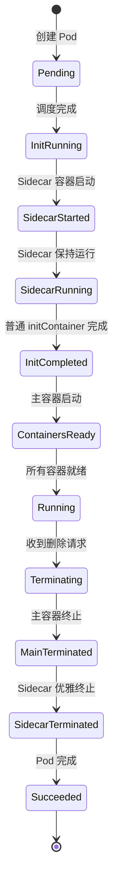

### Sidecar 与普通 InitContainer 对比

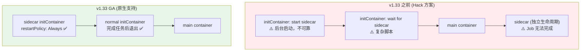

### Job 场景中的 Sidecar

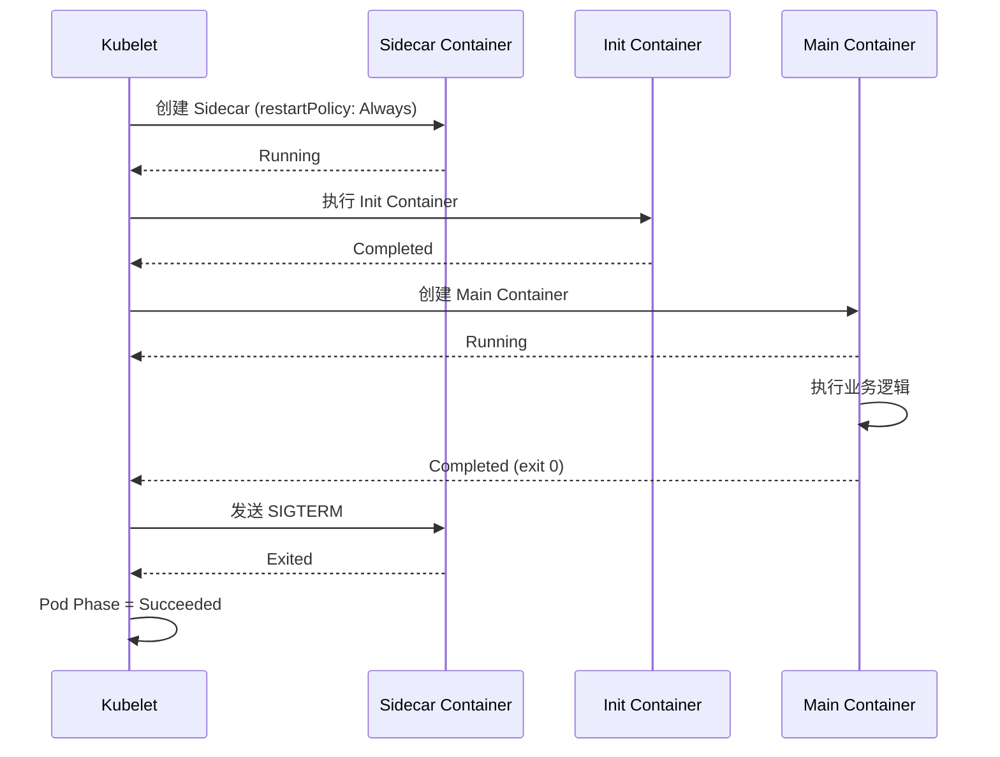

---

<!-- chunk: CEL 准入策略架构 -->
## CEL 准入策略架构

### Webhook vs CEL 准入对比

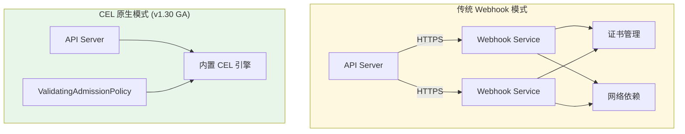

### CEL 准入策略执行流程

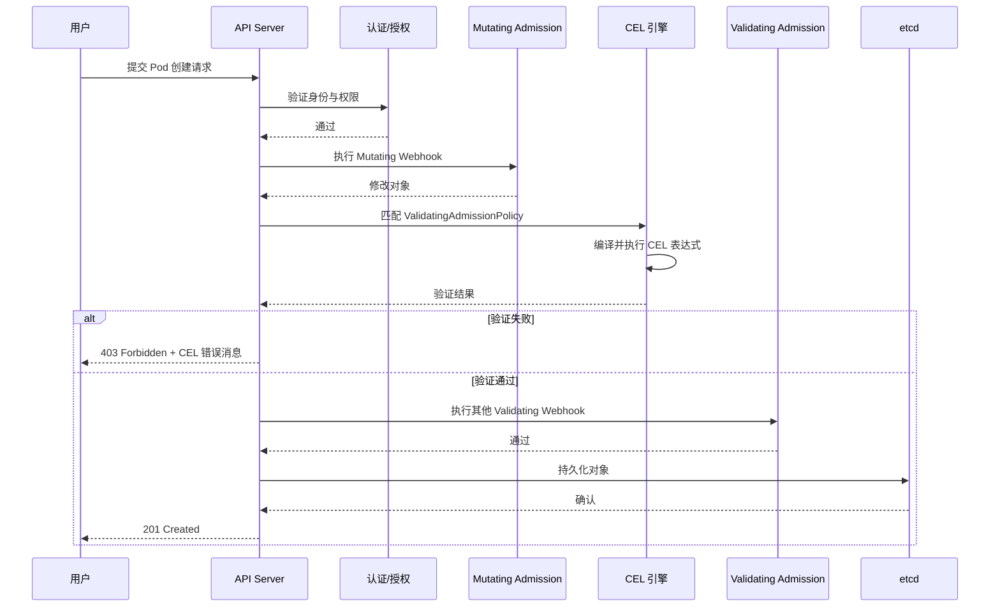

---

<!-- chunk: DRA 动态资源分配架构 -->
## DRA 动态资源分配架构

### DRA 完整数据流

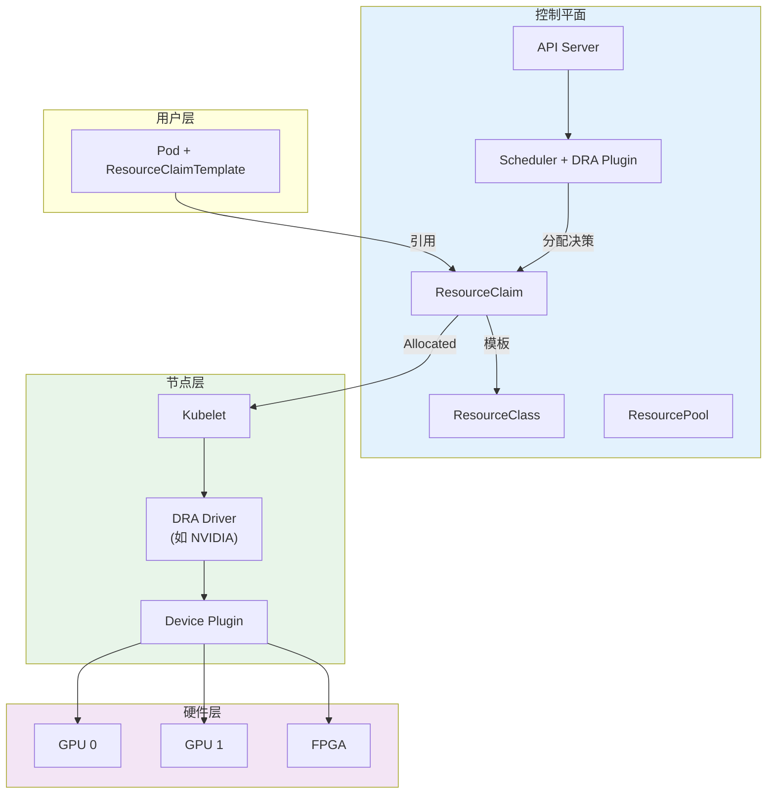

### DRA 与 Device Plugin 对比

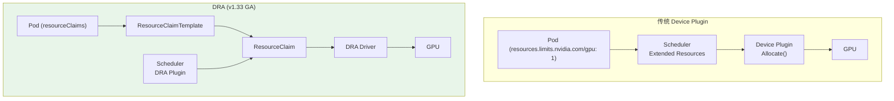

---

<!-- chunk: In-Place Pod Resize 架构 -->
## In-Place Pod Resize 架构

### 资源调整状态流转

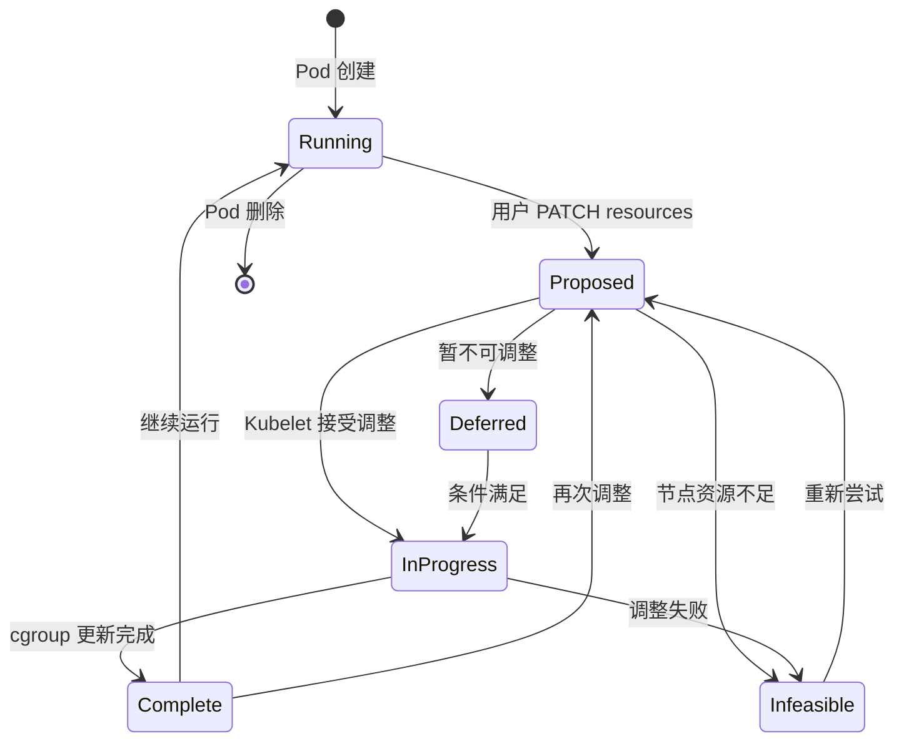

### 原地调整与重建对比

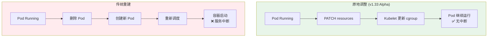

---

<!-- chunk: nftables kube-proxy 架构 -->
## nftables kube-proxy 架构

### 三种代理模式对比

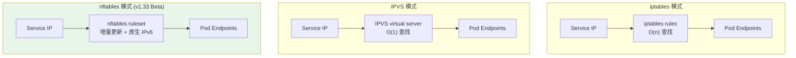

### nftables 数据包路径

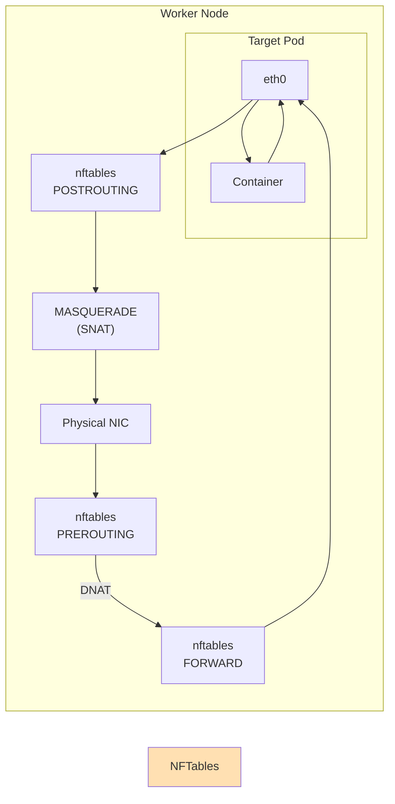

---

<!-- chunk: Queueing Hints 调度优化架构 -->
## Queueing Hints 调度优化架构

### 传统调度队列 vs Queueing Hints

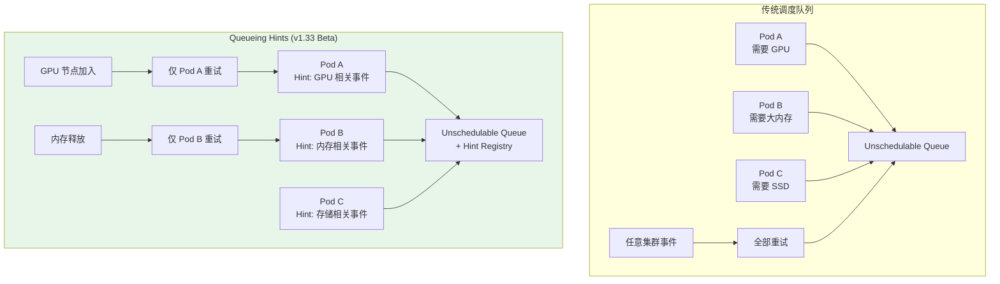

### Queueing Hint 注册机制

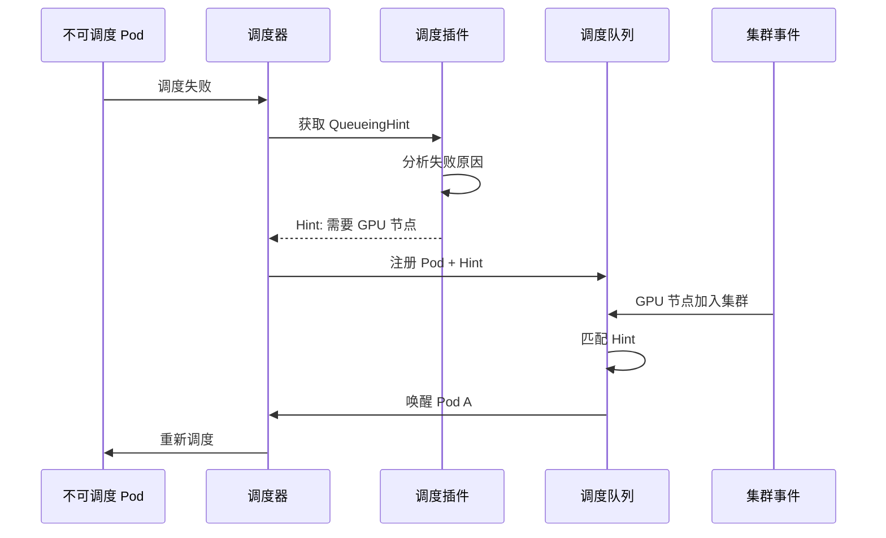

---

<!-- chunk: 用户命名空间安全架构 -->
## 用户命名空间安全架构

### UID 映射模型

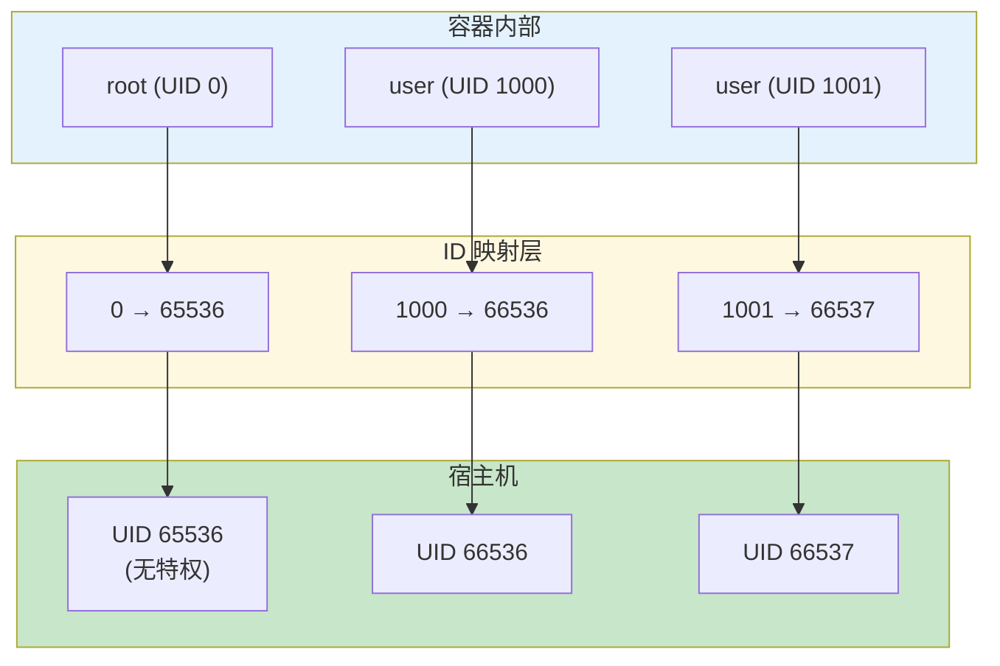

### 安全边界增强

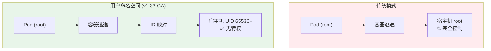

---

<!-- chunk: 协调领导者选举架构 -->
## 协调领导者选举架构

### 传统 vs 协调选举对比

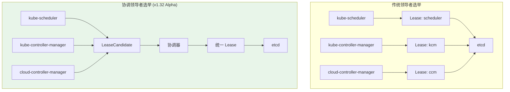

---

<!-- chunk: 附录：全特性架构总览 -->
## 附录：全特性架构总览

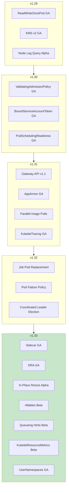

---

<!-- chunk: 参考链接 -->
## 参考链接

- [Kubernetes 特性门控](https://kubernetes.io/docs/reference/command-line-tools-reference/feature-gates/)
- [Sidecar KEP](https://github.com/kubernetes/enhancements/tree/master/keps/sig-node/753-sidecar-containers)
- [DRA KEP](https://github.com/kubernetes/enhancements/tree/master/keps/sig-scheduling/3960-dynamic-resource-allocation)
- [Queueing Hints KEP](https://github.com/kubernetes/enhancements/tree/master/keps/sig-scheduling/4247-queueing-hint)

---

<!-- chunk: Obsidian 相关文档 -->
## Obsidian 相关文档

- domain-01-cluster-fundamentals KUDIG Database — Global MOC
- [[domain-01-cluster-fundamentals/README.md|Domain-1: Kubernetes架构基础]]
- index.md|Domain-1 架构基础 — 开源项目索引]]
- Kubernetes 架构全景图
- [[entities/kubernetes.md|kubernetes]]
- 03 - 功能和API表
- structure.md|04 - Kubernetes 源码结构深度解析]]
- kubectl 命令完整参考
- 06 - 集群配置参数完全参考
- 07 - 升级路径与策略指南
- 08 - 多租户架构设计 (Multi-Tenancy Architecture)
- 09 - 边缘计算集成架构 (KubeEdge/OpenYurt)

## See Also

- 99-kubernetes-api-version-matrix
- 99-kubernetes-core-components-v1.29-v1.33-update
- 99-kubernetes-v1.25-v1.33-feature-comparison-table
- 99-kubernetes-v1.29-v1.33-complete-feature-gates-reference
