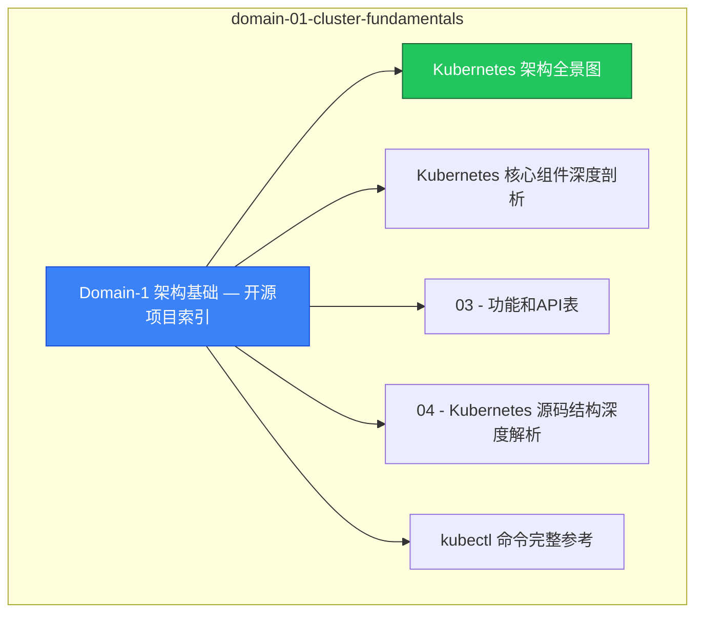

# domain-01-cluster-fundamentals MOC

> **MOC 版本**: 1.0
> **知识域**: domain-01-cluster-fundamentals
> **文档数量**: 33 篇
> **最后更新**: 2026-05-21
> **用途**: 本知识域的导航入口，汇总所有相关文档、关联领域、和场景入口

---

## 领域概述

Kubernetes 架构基础 — 系统整体设计、核心组件、API 版本、源码结构、集群部署

### 知识域定位

| 维度 | 说明 |
|---|---|
| **知识域** | domain-01-cluster-fundamentals |
| **文档数量** | 33 篇 |
| **难度分布** | 入门 1 / 进阶 1 / 高级 1 / 专家 0 |

---

## 文档清单

| # | 文档 | 难度 | 标签 | 估计阅读时间 |
|---|---|---|---|---|
| 1 | [[domain-01-cluster-fundamentals/00-open-source-projects-index.md|Domain-1 架构基础 — 开源项目索引]] |  | k8s, architecture, deep-dive |  |
| 2 | [[domain-01-cluster-fundamentals/01-kubernetes-architecture-overview.md|Kubernetes 架构全景图]] | 进阶 | k8s, architecture, kubernetes | 10min |
| 3 | [[domain-01-cluster-fundamentals/02-core-components-deep-dive.md|Kubernetes 核心组件深度剖析]] | 高级 | k8s, components, api-server | 15min |
| 4 | [[domain-01-cluster-fundamentals/03-api-versions-features.md|03 - 功能和API表]] |  | k8s, architecture, deep-dive |  |
| 5 | [[domain-01-cluster-fundamentals/04-source-code-structure.md|04 - Kubernetes 源码结构深度解析]] |  | k8s, architecture, deep-dive |  |
| 6 | [[domain-01-cluster-fundamentals/05-kubectl-commands-reference.md|kubectl 命令完整参考]] | 入门 | k8s, kubectl, cli | 10min |
| 7 | [[domain-01-cluster-fundamentals/06-cluster-configuration-parameters.md|06 - 集群配置参数完全参考]] |  | k8s, architecture, deep-dive |  |
| 8 | [[domain-01-cluster-fundamentals/07-upgrade-paths-strategy.md|07 - 升级路径与策略指南]] |  | k8s, architecture, deep-dive |  |
| 9 | [[domain-01-cluster-fundamentals/08-multi-tenancy-architecture.md|08 - 多租户架构设计 (Multi-Tenancy Architecture)]] |  | k8s, architecture, deep-dive |  |
| 10 | [[domain-01-cluster-fundamentals/09-edge-computing-kubeedge.md|09 - 边缘计算集成架构 (KubeEdge/OpenYurt)]] |  | k8s, architecture, deep-dive |  |
| 11 | [[domain-01-cluster-fundamentals/10-windows-containers-support.md|10 - Windows 容器支持与集成指南]] |  | k8s, architecture, deep-dive |  |
| 12 | [[domain-01-cluster-fundamentals/11-kubernetes-source-code-architecture.md|11 - Kubernetes 源码架构深度分析]] |  | k8s, architecture, deep-dive |  |
| 13 | [[domain-01-cluster-fundamentals/12-cluster-deployment-patterns.md|12 - Kubernetes 集群部署架构模式指南]] |  | k8s, architecture, deep-dive |  |
| 14 | [[domain-01-cluster-fundamentals/13-performance-tuning-guide.md|13 - Kubernetes 性能调优专项指南]] |  | k8s, architecture, deep-dive |  |
| 15 | [[domain-01-cluster-fundamentals/14-security-architecture.md|14 - Kubernetes 安全架构深度分析]] |  | k8s, architecture, deep-dive |  |
| 16 | [[domain-01-cluster-fundamentals/15-observability-architecture.md|15 - Kubernetes 可观测性架构体系]] |  | k8s, architecture, deep-dive |  |
| 17 | [[domain-01-cluster-fundamentals/16-troubleshooting-guide.md|16 - Kubernetes 故障排查专家级指南]] |  | k8s, architecture, deep-dive |  |
| 18 | [[domain-01-cluster-fundamentals/17-production-operations-best-practices.md|17 - 生产环境运维最佳实践 (Production Operations Best Practices)]] |  | k8s, architecture, deep-dive |  |
| 19 | [[domain-01-cluster-fundamentals/18-upgrade-migration-strategy.md|18 - Kubernetes 升级和迁移策略指南]] |  | k8s, architecture, deep-dive |  |
| 20 | [[domain-01-cluster-fundamentals/99-kubectl-v1.29-v1.33-new-commands-guide.md|Kubectl v1.29 - v1.33 新命令与用法速查]] |  | k8s, architecture, deep-dive |  |
| 21 | [[domain-01-cluster-fundamentals/99-kubernetes-api-version-matrix.md|Kubernetes 版本 API 兼容矩阵 (1.28 → 1.33)]] |  | k8s, architecture, deep-dive |  |
| 22 | [[domain-01-cluster-fundamentals/99-kubernetes-core-components-v1.29-v1.33-update.md|Kubernetes 核心组件 v1.29 - v1.33 新特性速查]] |  | k8s, architecture, deep-dive |  |
| 23 | [[domain-01-cluster-fundamentals/99-kubernetes-core-features-mermaid-diagrams.md|Kubernetes v1.29-v1.33 核心特性架构图集]] |  | k8s, architecture, deep-dive |  |
| 24 | [[domain-01-cluster-fundamentals/99-kubernetes-v1.25-v1.33-feature-comparison-table.md|Kubernetes v1.25 - v1.33 特性对比总表]] |  | k8s, architecture, deep-dive |  |
| 25 | [[domain-01-cluster-fundamentals/99-kubernetes-v1.29-v1.33-complete-feature-gates-reference.md|Kubernetes v1.29 - v1.33 完整 Feature Gate 与特性参考手册]] |  | k8s, architecture, deep-dive |  |
| 26 | [[domain-01-cluster-fundamentals/99-kubernetes-v1.29-v1.33-features-guide.md|Kubernetes v1.29 - v1.33 版本特性深度指南]] |  | k8s, architecture, deep-dive |  |
| 27 | [[domain-01-cluster-fundamentals/99-kubernetes-v1.33-deprecation-migration-guide.md|Kubernetes v1.33 弃用功能与迁移指南]] |  | k8s, architecture, deep-dive |  |
| 28 | [[domain-01-cluster-fundamentals/99-kubernetes-v1.33-ecosystem-compatibility-matrix.md|Kubernetes v1.33 生态系统兼容性矩阵]] |  | k8s, architecture, deep-dive |  |
| 29 | [[domain-01-cluster-fundamentals/99-kubernetes-v1.33-practical-cookbook.md|Kubernetes v1.33 实战案例集]] |  | k8s, architecture, deep-dive |  |
| 30 | [[domain-01-cluster-fundamentals/99-kubernetes-v1.33-production-best-practices.md|Kubernetes v1.33 生产环境最佳实践]] |  | k8s, architecture, deep-dive |  |
| 31 | [[domain-01-cluster-fundamentals/99-kubernetes-v1.33-quick-reference-card.md|Kubernetes v1.33 速查卡]] |  | k8s, architecture, deep-dive |  |
| 32 | [[domain-01-cluster-fundamentals/99-kubernetes-v1.33-upgrade-guide.md|Kubernetes v1.33 升级实操指南]] |  | k8s, architecture, deep-dive |  |
| 33 | [[domain-01-cluster-fundamentals/99-kubernetes-version-lifecycle-support-policy.md|Kubernetes 版本生命周期与支持策略]] |  | k8s, architecture, deep-dive |  |

---

## 知识图谱

---

## 关联入口

| 入口 | 说明 |
|---|---|
| [[../domain-10-troubleshooting-diagnostics/topic-fta/MOC.md|FTA 故障树]] | domain-01-cluster-fundamentals 相关故障树分析 |
| [[../domain-10-troubleshooting-diagnostics/topic-skills/MOC.md|Skills 技能]] | domain-01-cluster-fundamentals 相关操作技能 |
| [[../domain-19-landscape-references/topic-index/README.md|深度研究入口]] | 语料库索引与向量检索 |

---

## 统计信息

| 指标 | 数值 |
|---|---|
| 文档总数 | 33 |
| 覆盖 K8s 版本 | v1.25 - v1.32 |

---

*本文档由 scripts/generate-mocs.py 自动生成，最后更新 2026-05-21。*
