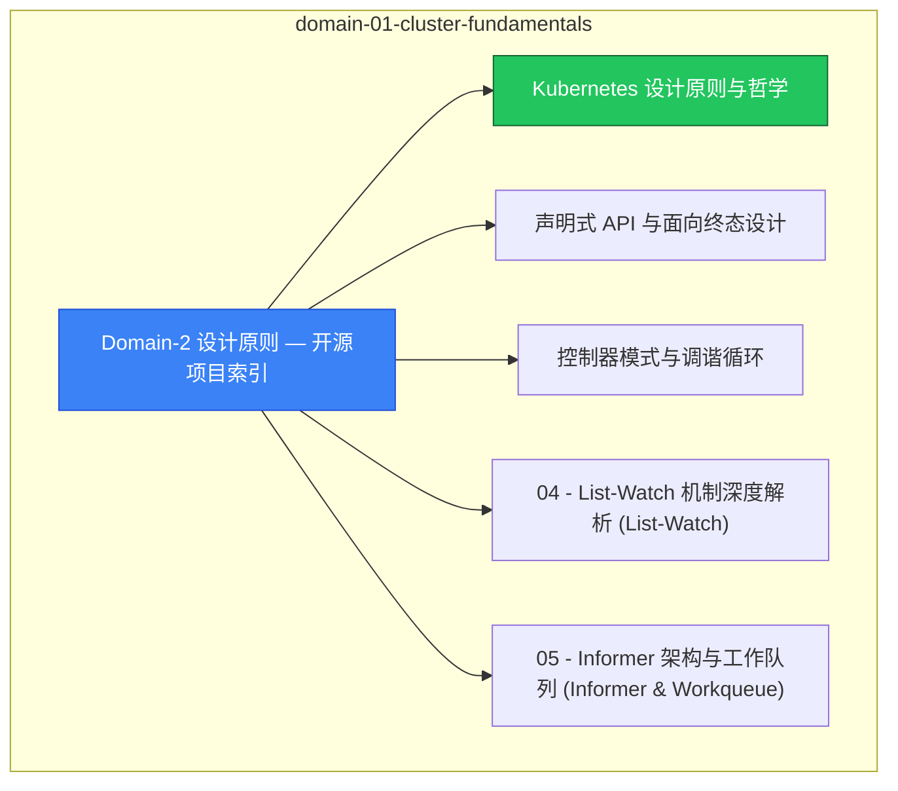

# domain-01-cluster-fundamentals MOC

> **MOC 版本**: 1.0
> **知识域**: domain-01-cluster-fundamentals
> **文档数量**: 20 篇
> **最后更新**: 2026-05-21
> **用途**: 本知识域的导航入口，汇总所有相关文档、关联领域、和场景入口

---

## 领域概述

Kubernetes 设计原则 — API 设计理念、声明式 API、控制器模式、渐进式交付

### 知识域定位

| 维度 | 说明 |
|---|---|
| **知识域** | domain-01-cluster-fundamentals |
| **文档数量** | 20 篇 |
| **难度分布** | 入门 0 / 进阶 0 / 高级 3 / 专家 0 |

---

## 文档清单

| # | 文档 | 难度 | 标签 | 估计阅读时间 |
|---|---|---|---|---|
| 1 | [[domain-01-cluster-fundamentals/00-open-source-projects-index.md|Domain-2 设计原则 — 开源项目索引]] |  | k8s, design-principles |  |
| 2 | [[domain-01-cluster-fundamentals/01-design-principles-foundations.md|Kubernetes 设计原则与哲学]] | 高级 | k8s, design-principles, philosophy | 5min |
| 3 | [[domain-01-cluster-fundamentals/02-declarative-api-pattern.md|声明式 API 与面向终态设计]] | 高级 | k8s, declarative, api | 5min |
| 4 | [[domain-01-cluster-fundamentals/03-controller-pattern.md|控制器模式与调谐循环]] | 高级 | k8s, controller, reconcile | 5min |
| 5 | [[domain-01-cluster-fundamentals/04-watch-list-mechanism.md|04 - List-Watch 机制深度解析 (List-Watch)]] |  | k8s, design-principles |  |
| 6 | [[domain-01-cluster-fundamentals/05-informer-workqueue.md|05 - Informer 架构与工作队列 (Informer & Workqueue)]] |  | k8s, design-principles |  |
| 7 | [[domain-01-cluster-fundamentals/06-resource-version-control.md|06 - 资源版本与并发控制 (Concurrency Control)]] |  | k8s, design-principles |  |
| 8 | [[domain-01-cluster-fundamentals/07-distributed-consensus-etcd.md|07 - 分布式共识与 etcd 原理 (etcd & Raft)]] |  | k8s, design-principles |  |
| 9 | [[domain-01-cluster-fundamentals/08-high-availability-patterns.md|08 - 高可用架构模式 (HA Patterns)]] |  | k8s, design-principles |  |
| 10 | [[domain-01-cluster-fundamentals/09-source-code-walkthrough.md|09 - Kubernetes 源码结构与阅读指南 (Source Code)]] |  | k8s, design-principles |  |
| 11 | [[domain-01-cluster-fundamentals/10-cap-theorem-distributed-systems.md|10 - CAP 定理与分布式系统基础 (CAP Theorem)]] |  | k8s, design-principles |  |
| 12 | [[domain-01-cluster-fundamentals/11-extensibility-design-patterns.md|11 - 扩展性设计模式 (Extensibility)]] |  | k8s, design-principles |  |
| 13 | [[domain-01-cluster-fundamentals/12-operator-development-guide.md|12 - Operator 模式与控制器开发 (Operator Guide)]] |  | k8s, design-principles, guide |  |
| 14 | [[domain-01-cluster-fundamentals/13-admission-control-webhooks.md|13 - 准入控制与 Webhook 机制深度解析]] |  | k8s, design-principles |  |
| 15 | [[domain-01-cluster-fundamentals/14-service-mesh-architecture.md|14 - 服务网格与微服务架构设计]] |  | k8s, design-principles, architecture |  |
| 16 | [[domain-01-cluster-fundamentals/15-chaos-engineering.md|15 - 混沌工程与故障注入设计]] |  | k8s, design-principles |  |
| 17 | [[domain-01-cluster-fundamentals/16-observability-design-principles.md|16 - 可观测性设计原则]] |  | k8s, design-principles, observability |  |
| 18 | [[domain-01-cluster-fundamentals/17-security-design-patterns.md|17 - 安全设计模式]] |  | k8s, design-principles, security |  |
| 19 | [[domain-01-cluster-fundamentals/18-performance-optimization-principles.md|18 - 性能优化原理]] |  | k8s, design-principles, performance |  |
| 20 | [[domain-01-cluster-fundamentals/99-kubernetes-v1.33-design-principles-evolution.md|Kubernetes v1.29-v1.33 设计原理演进与影响分析]] |  | k8s, design-principles |  |

---

## 知识图谱

---

## 关联入口

| 入口 | 说明 |
|---|---|
| [[../domain-10-troubleshooting-diagnostics/topic-fta/MOC.md|FTA 故障树]] | domain-01-cluster-fundamentals 相关故障树分析 |
| [[../domain-10-troubleshooting-diagnostics/topic-skills/MOC.md|Skills 技能]] | domain-01-cluster-fundamentals 相关操作技能 |
| [[../domain-19-landscape-references/topic-index/README.md|深度研究入口]] | 语料库索引与向量检索 |

---

## 统计信息

| 指标 | 数值 |
|---|---|
| 文档总数 | 20 |
| 覆盖 K8s 版本 | v1.25 - v1.32 |

---

*本文档由 scripts/generate-mocs.py 自动生成，最后更新 2026-05-21。*
