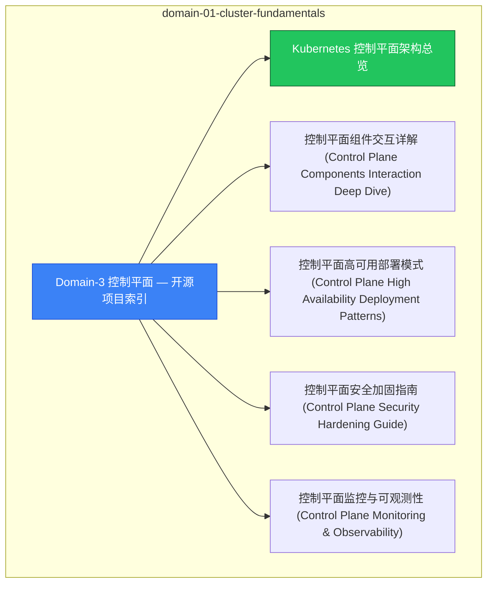

# domain-01-cluster-fundamentals MOC

> **MOC 版本**: 1.0
> **知识域**: domain-01-cluster-fundamentals
> **文档数量**: 37 篇
> **最后更新**: 2026-05-21
> **用途**: 本知识域的导航入口，汇总所有相关文档、关联领域、和场景入口

---

## 领域概述

控制平面 — etcd、apiserver、scheduler、controller-manager 深度解析

### 知识域定位

| 维度 | 说明 |
|---|---|
| **知识域** | domain-01-cluster-fundamentals |
| **文档数量** | 37 篇 |
| **难度分布** | 入门 0 / 进阶 0 / 高级 3 / 专家 0 |

---

## 文档清单

| # | 文档 | 难度 | 标签 | 估计阅读时间 |
|---|---|---|---|---|
| 1 | [[domain-01-cluster-fundamentals/00-open-source-projects-index.md|Domain-3 控制平面 — 开源项目索引]] |  | k8s, control-plane, deep-dive |  |
| 2 | [[domain-01-cluster-fundamentals/01-plane-architecture-overview.md|Kubernetes 控制平面架构总览]] |  | k8s, control-plane, deep-dive |  |
| 3 | [[domain-01-cluster-fundamentals/02-plane-components-interaction.md|控制平面组件交互详解 (Control Plane Components Interaction Deep Dive)]] |  | k8s, control-plane, deep-dive |  |
| 4 | [[domain-01-cluster-fundamentals/03-plane-high-availability.md|控制平面高可用部署模式 (Control Plane High Availability Deployment Patterns)]] |  | k8s, control-plane, deep-dive |  |
| 5 | [[domain-01-cluster-fundamentals/04-plane-security-hardening.md|控制平面安全加固指南 (Control Plane Security Hardening Guide)]] |  | k8s, control-plane, deep-dive |  |
| 6 | [[domain-01-cluster-fundamentals/05-plane-monitoring-observability.md|控制平面监控与可观测性 (Control Plane Monitoring & Observability)]] |  | k8s, control-plane, deep-dive |  |
| 7 | [[domain-01-cluster-fundamentals/06-plane-troubleshooting.md|控制平面故障排查手册 (Control Plane Troubleshooting Handbook)]] |  | k8s, control-plane, deep-dive |  |
| 8 | [[domain-01-cluster-fundamentals/07-plane-upgrade-migration.md|控制平面升级与迁移策略 (Control Plane Upgrade & Migration Strategy)]] |  | k8s, control-plane, deep-dive |  |
| 9 | [[domain-01-cluster-fundamentals/08-plane-performance-benchmarking.md|控制平面性能基准测试 (Control Plane Performance Benchmarking)]] |  | k8s, control-plane, deep-dive |  |
| 10 | [[domain-01-cluster-fundamentals/09-plane-scalability-guide.md|控制平面扩缩容指南 (Control Plane Scalability Guide)]] |  | k8s, control-plane, deep-dive |  |
| 11 | [[domain-01-cluster-fundamentals/10-plane-backup-disaster-recovery.md|控制平面备份与灾备方案 (Control Plane Backup & Disaster Recovery)]] |  | k8s, control-plane, deep-dive |  |
| 12 | [[domain-01-cluster-fundamentals/11-etcd-deep-dive.md|etcd 深度解析]] | 高级 | k8s, etcd, raft | 10min |
| 13 | [[domain-01-cluster-fundamentals/12-apiserver-deep-dive.md|kube-apiserver 深度解析]] | 高级 | k8s, apiserver, authentication | 20min |
| 14 | [[domain-01-cluster-fundamentals/13-kube-controller-manager-deep-dive.md|kube-controller-manager 深度解析]] | 高级 | k8s, controller-manager, controllers | 25min |
| 15 | [[domain-01-cluster-fundamentals/14-cloud-controller-manager-deep-dive.md|cloud-controller-manager 深度解析 (CCM Deep Dive)]] |  | k8s, control-plane, deep-dive |  |
| 16 | [[domain-01-cluster-fundamentals/15-kubelet-deep-dive.md|kubelet 深度解析 (kubelet Deep Dive)]] |  | k8s, control-plane, deep-dive |  |
| 17 | [[domain-01-cluster-fundamentals/16-kube-proxy-deep-dive.md|kube-proxy 深度解析 (kube-proxy Deep Dive)]] |  | k8s, control-plane, deep-dive |  |
| 18 | [[domain-01-cluster-fundamentals/17-apiserver-tuning.md|API Server 性能调优]] |  | k8s, control-plane, deep-dive |  |
| 19 | [[domain-01-cluster-fundamentals/18-api-priority-fairness.md|68 - API 优先级与公平性 (API Priority and Fairness)]] |  | k8s, control-plane, deep-dive |  |
| 20 | [[domain-01-cluster-fundamentals/19-etcd-operations.md|30 - etcd运维操作]] |  | k8s, control-plane, deep-dive |  |
| 21 | [[domain-01-cluster-fundamentals/20-kube-scheduler-deep-dive.md|Kubernetes Scheduler 深度解析 (Kube-Scheduler Deep Dive)]] |  | k8s, control-plane, deep-dive |  |
| 22 | [[domain-01-cluster-fundamentals/21-container-runtime-deep-dive.md|容器运行时深度解析 (Container Runtime Interface Deep Dive)]] |  | k8s, control-plane, deep-dive |  |
| 23 | [[domain-01-cluster-fundamentals/22-container-storage-deep-dive.md|CSI 容器存储接口深度解析 (Container Storage Interface Deep Dive)]] |  | k8s, control-plane, deep-dive |  |
| 24 | [[domain-01-cluster-fundamentals/23-container-network-deep-dive.md|CNI 容器网络接口深度解析 (Container Network Interface Deep Dive)]] |  | k8s, control-plane, deep-dive |  |
| 25 | [[domain-01-cluster-fundamentals/24-production-deployment-best-practices.md|生产环境部署最佳实践 (Production Deployment Best Practices)]] |  | k8s, control-plane, deep-dive |  |
| 26 | [[domain-01-cluster-fundamentals/25-multi-cloud-hybrid-deployment.md|多云混合部署架构 (Multi-Cloud Hybrid Deployment Architecture)]] |  | k8s, control-plane, deep-dive |  |
| 27 | [[domain-01-cluster-fundamentals/26-gitops-automation-operations.md|GitOps自动化运维实践 (GitOps Automation Operations Practice)]] |  | k8s, control-plane, deep-dive |  |
| 28 | [[domain-01-cluster-fundamentals/27-authz-authn-deep-dive.md|Kubernetes 认证授权深度解析 (Authentication & Authorization Deep Dive)]] |  | k8s, control-plane, deep-dive |  |
| 29 | [[domain-01-cluster-fundamentals/28-api-extension-deep-dive.md|Kubernetes API扩展深度解析 (API Extensions Deep Dive)]] |  | k8s, control-plane, deep-dive |  |
| 30 | [[domain-01-cluster-fundamentals/29-in-place-pod-resize.md|29 - 原地 Pod 资源调整 (In-Place Pod Resize)]] |  | k8s, control-plane, deep-dive |  |
| 31 | [[domain-01-cluster-fundamentals/30-dynamic-resource-allocation.md|30 - 动态资源分配 (Dynamic Resource Allocation)]] |  | k8s, control-plane, deep-dive |  |
| 32 | [[domain-01-cluster-fundamentals/31-kubectl-complete-reference.md|31 - kubectl 完全命令参考 (kubectl Complete Reference)]] |  | k8s, control-plane, deep-dive |  |
| 33 | [[domain-01-cluster-fundamentals/32-kubeadm-cluster-lifecycle.md|32 - kubeadm 集群生命周期管理 (Cluster Lifecycle with kubeadm)]] |  | k8s, control-plane, deep-dive |  |
| 34 | [[domain-01-cluster-fundamentals/32-kubeadm-upgrade-complete-guide.md|kubeadm 升级完整路径指南（含 rollback）]] |  | k8s, control-plane, deep-dive |  |
| 35 | [[domain-01-cluster-fundamentals/33-kubelet-eviction-thresholds.md|Kubelet 驱逐阈值量化完整文档]] |  | k8s, control-plane, deep-dive |  |
| 36 | [[domain-01-cluster-fundamentals/final-completion-check.md|Domain-3 控制平面最终完整性检查清单]] |  | k8s, control-plane, deep-dive |  |
| 37 | [[domain-01-cluster-fundamentals/quality-report.md|Domain-3 控制平面质量检查报告]] |  | k8s, control-plane, deep-dive |  |

---

## 知识图谱

---

## 关联入口

| 入口 | 说明 |
|---|---|
| [[../domain-10-troubleshooting-diagnostics/topic-fta/MOC.md|FTA 故障树]] | domain-01-cluster-fundamentals 相关故障树分析 |
| [[../domain-10-troubleshooting-diagnostics/topic-skills/MOC.md|Skills 技能]] | domain-01-cluster-fundamentals 相关操作技能 |
| [[../domain-19-landscape-references/topic-index/README.md|深度研究入口]] | 语料库索引与向量检索 |

---

## 统计信息

| 指标 | 数值 |
|---|---|
| 文档总数 | 37 |
| 覆盖 K8s 版本 | v1.25 - v1.32 |

---

*本文档由 scripts/generate-mocs.py 自动生成，最后更新 2026-05-21。*
