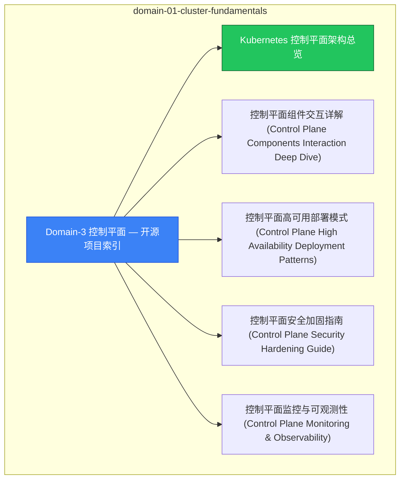

# domain-01-cluster-fundamentals MOC

> **MOC 版本**: 1.0
> **知识域**: domain-01-cluster-fundamentals
> **文档数量**: 37 篇
> **最后更新**: 2026-05-21
> **用途**: 本知识域的导航入口，汇总所有相关文档、关联领域、和场景入口

---

## 领域概述

控制平面 — etcd、apiserver、scheduler、controller-manager 深度解析

### 知识域定位

| 维度 | 说明 |
|---|---|
| **知识域** | domain-01-cluster-fundamentals |
| **文档数量** | 37 篇 |
| **难度分布** | 入门 0 / 进阶 0 / 高级 3 / 专家 0 |

---

## 文档清单

| # | 文档 | 难度 | 标签 | 估计阅读时间 |
|---|---|---|---|---|
| 1 | Domain-3 控制平面 — 开源项目索引 |  | k8s, control-plane, deep-dive |  |
| 2 | Kubernetes 控制平面架构总览 |  | k8s, control-plane, deep-dive |  |
| 3 | 控制平面组件交互详解 (Control Plane Components Interaction Deep Dive) |  | k8s, control-plane, deep-dive |  |
| 4 | 控制平面高可用部署模式 (Control Plane High Availability Deployment Patterns) |  | k8s, control-plane, deep-dive |  |
| 5 | 控制平面安全加固指南 (Control Plane Security Hardening Guide) |  | k8s, control-plane, deep-dive |  |
| 6 | 控制平面监控与可观测性 (Control Plane Monitoring & Observability) |  | k8s, control-plane, deep-dive |  |
| 7 | 控制平面故障排查手册 (Control Plane Troubleshooting Handbook) |  | k8s, control-plane, deep-dive |  |
| 8 | 控制平面升级与迁移策略 (Control Plane Upgrade & Migration Strategy) |  | k8s, control-plane, deep-dive |  |
| 9 | 控制平面性能基准测试 (Control Plane Performance Benchmarking) |  | k8s, control-plane, deep-dive |  |
| 10 | 控制平面扩缩容指南 (Control Plane Scalability Guide) |  | k8s, control-plane, deep-dive |  |
| 11 | 控制平面备份与灾备方案 (Control Plane Backup & Disaster Recovery) |  | k8s, control-plane, deep-dive |  |
| 12 | etcd 深度解析 | 高级 | k8s, etcd, raft | 10min |
| 13 | kube-apiserver 深度解析 | 高级 | k8s, apiserver, authentication | 20min |
| 14 | kube-controller-manager 深度解析 | 高级 | k8s, controller-manager, controllers | 25min |
| 15 | cloud-controller-manager 深度解析 (CCM Deep Dive) |  | k8s, control-plane, deep-dive |  |
| 16 | kubelet 深度解析 (kubelet Deep Dive) |  | k8s, control-plane, deep-dive |  |
| 17 | kube-proxy 深度解析 (kube-proxy Deep Dive) |  | k8s, control-plane, deep-dive |  |
| 18 | API Server 性能调优 |  | k8s, control-plane, deep-dive |  |
| 19 | 68 - API 优先级与公平性 (API Priority and Fairness) |  | k8s, control-plane, deep-dive |  |
| 20 | 30 - etcd运维操作 |  | k8s, control-plane, deep-dive |  |
| 21 | Kubernetes Scheduler 深度解析 (Kube-Scheduler Deep Dive) |  | k8s, control-plane, deep-dive |  |
| 22 | 容器运行时深度解析 (Container Runtime Interface Deep Dive) |  | k8s, control-plane, deep-dive |  |
| 23 | CSI 容器存储接口深度解析 (Container Storage Interface Deep Dive) |  | k8s, control-plane, deep-dive |  |
| 24 | CNI 容器网络接口深度解析 (Container Network Interface Deep Dive) |  | k8s, control-plane, deep-dive |  |
| 25 | 生产环境部署最佳实践 (Production Deployment Best Practices) |  | k8s, control-plane, deep-dive |  |
| 26 | 多云混合部署架构 (Multi-Cloud Hybrid Deployment Architecture) |  | k8s, control-plane, deep-dive |  |
| 27 | GitOps自动化运维实践 (GitOps Automation Operations Practice) |  | k8s, control-plane, deep-dive |  |
| 28 | Kubernetes 认证授权深度解析 (Authentication & Authorization Deep Dive) |  | k8s, control-plane, deep-dive |  |
| 29 | Kubernetes API扩展深度解析 (API Extensions Deep Dive) |  | k8s, control-plane, deep-dive |  |
| 30 | 29 - 原地 Pod 资源调整 (In-Place Pod Resize) |  | k8s, control-plane, deep-dive |  |
| 31 | 30 - 动态资源分配 (Dynamic Resource Allocation) |  | k8s, control-plane, deep-dive |  |
| 32 | 31 - kubectl 完全命令参考 (kubectl Complete Reference) |  | k8s, control-plane, deep-dive |  |
| 33 | 32 - kubeadm 集群生命周期管理 (Cluster Lifecycle with kubeadm) |  | k8s, control-plane, deep-dive |  |
| 34 | kubeadm 升级完整路径指南（含 rollback） |  | k8s, control-plane, deep-dive |  |
| 35 | Kubelet 驱逐阈值量化完整文档 |  | k8s, control-plane, deep-dive |  |
| 36 | Domain-3 控制平面最终完整性检查清单 |  | k8s, control-plane, deep-dive |  |
| 37 | Domain-3 控制平面质量检查报告 |  | k8s, control-plane, deep-dive |  |

---

## 知识图谱

---

## 关联入口

| 入口 | 说明 |
|---|---|
| FTA 故障树 | domain-01-cluster-fundamentals 相关故障树分析 |
| Skills 技能 | domain-01-cluster-fundamentals 相关操作技能 |
| 深度研究入口 | 语料库索引与向量检索 |

---

## 统计信息

| 指标 | 数值 |
|---|---|
| 文档总数 | 37 |
| 覆盖 K8s 版本 | v1.25 - v1.32 |

---

*本文档由 scripts/generate-mocs.py 自动生成，最后更新 2026-05-21。*
