title: Kubernetes 生产环境完整架构蓝图
description: '# Kubernetes 生产环境完整架构蓝图'
category: production-operations
tags:
- k8s
- production
- operations
- best-practices
- etcd
- apiserver
- kubelet
- scheduler
- controller-manager
- prometheus
last_updated: 2026-05
difficulty: advanced
reading_level: advanced
audience:
- SRE
- 运维工程师
- 平台工程师
estimated_read_time: 5min
intent_queries:
- Kubernetes 生产环境完整架构蓝图 是什么
- 如何 Kubernetes 生产环境完整架构蓝图
- Kubernetes 18 production operations 最佳实践
trigger_keywords:
- Kubernetes
- 生产环境完整架构蓝图
- production
- operations
authors:
- name: KUDIG Team
  role: contributor
k8s_versions:
- '1.28'
- '1.29'
- '1.30'
- '1.31'
- '1.32'
---

# Kubernetes 生产环境完整架构蓝图

> **适用版本**: Kubernetes v1.29 - v1.33  
> **最后更新**: 2026-04-24  
> **用途**: 企业级生产环境架构设计参考，含完整 Mermaid 架构图  
> **目标读者**: 平台架构师、SRE、DevOps 工程师

---

<!-- chunk: 📋 目录 -->## 📋 目录

- [一、生产环境整体架构](#一生产环境整体架构)
- [二、控制平面高可用架构](#二控制平面高可用架构)
- [三、工作节点与运行时架构](#三工作节点与运行时架构)
- [四、网络架构设计](#四网络架构设计)
- [五、存储架构设计](#五存储架构设计)
- [六、安全架构设计](#六安全架构设计)
- [七、可观测性架构](#七可观测性架构)
- [八、多集群与联邦架构](#八多集群与联邦架构)
- [九、灾备与业务连续性架构](#九灾备与业务连续性架构)
- [十、GitOps 与 CI/CD 架构](#十gitops-与-cicd-架构)

---

<!-- chunk: 一、生产环境整体架构 -->## 一、生产环境整体架构

#<!-- chunk: 1.1 全景架构图 -->## 1.1 全景架构图

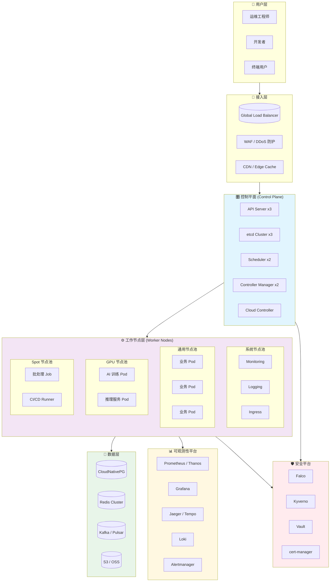
```mermaid
flowchart TB
    subgraph User["👤 用户层"]
        U1[运维工程师]
        U2[开发者]
        U3[终端用户]
    end

    subgraph Access["🔐 接入层"]
        LB1[(Global Load Balancer)]
        WAF[WAF / DDoS 防护]
        CDN[CDN / Edge Cache]
    end

    subgraph Control["🎛️ 控制平面 (Control Plane)"]
        API[API Server x3]
        ETCD[etcd Cluster x3]
        SCHED[Scheduler x2]
        KCM[Controller Manager x2]
        CCM[Cloud Controller]
    end

    subgraph Worker["⚙️ 工作节点层 (Worker Nodes)"]
        direction TB
        subgraph SystemNode["系统节点池"]
            SN1[Monitoring]
            SN2[Logging]
            SN3[Ingress]
        end
        subgraph GeneralNode["通用节点池"]
            GN1[业务 Pod]
            GN2[业务 Pod]
            GN3[业务 Pod]
        end
        subgraph GPUNode["GPU 节点池"]
            GPU1[AI 训练 Pod]
            GPU2[推理服务 Pod]
        end
        subgraph SpotNode["Spot 节点池"]
            SP1[批处理 Job]
            SP2[CI/CD Runner]
        end
    end

    subgraph Data["💾 数据层"]
        DB[(CloudNativePG)]
        Cache[(Redis Cluster)]
        MQ[(Kafka / Pulsar)]
        OBJ[(S3 / OSS)]
    end

    subgraph Observability["📊 可观测性平台"]
        PROM[Prometheus / Thanos]
        GRAF[Grafana]
        JAEG[Jaeger / Tempo]
        LOKI[Loki]
        ALERT[Alertmanager]
    end

    subgraph Security["🛡️ 安全平台"]
        FALCO[Falco]
        KYV[Kyverno]
        VAULT[Vault]
        CERT[cert-manager]
    end

    User --> Access
    Access --> Control
    Control --> Worker
    Worker --> Data
    Worker --> Observability
    Worker --> Security
    Control --> Security

    style Control fill:#e1f5fe
    style Worker fill:#f3e5f5
    style Observability fill:#fff8e1
    style Security fill:#ffebee
    style Data fill:#e8f5e9
```

#<!-- chunk: 1.2 分层职责说明 -->## 1.2 分层职责说明

| 层级 | 组件 | 职责 | 高可用策略 |
|:---|:---|:---|:---|
| **接入层** | Global LB, WAF, CDN | 流量入口、安全防护、边缘加速 | 多地域 Anycast |
| **控制平面** | API Server, etcd, Scheduler | 集群状态管理、调度决策 | 3 节点 HA，etcd 集群 |
| **工作节点** | 多节点池 (系统/通用/GPU/Spot) | 工作负载运行 | 节点池自动扩缩容 |
| **数据层** | DB, Cache, MQ, Object Storage | 持久化数据存储 | 主从复制、跨可用区 |
| **可观测性** | Metrics, Logs, Traces | 监控、告警、链路追踪 | 多副本、远程存储 |
| **安全平台** | 运行时检测、策略、密钥 | 威胁检测、合规、加密 | 多实例、自动轮换 |

#<!-- chunk: 1.3 多可用区部署架构 -->## 1.3 多可用区部署架构

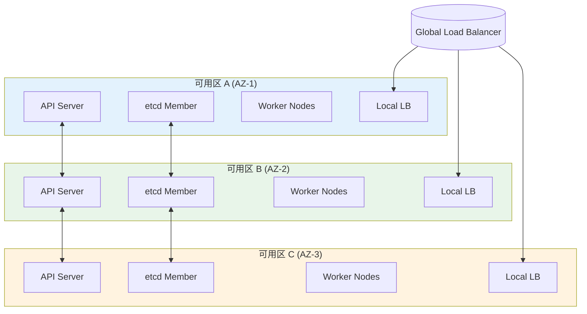
```mermaid
flowchart TB
    subgraph AZ1["可用区 A (AZ-1)"]
        API1[API Server]
        ETCD1[etcd Member]
        NODE1[Worker Nodes]
        LB1[Local LB]
    end

    subgraph AZ2["可用区 B (AZ-2)"]
        API2[API Server]
        ETCD2[etcd Member]
        NODE2[Worker Nodes]
        LB2[Local LB]
    end

    subgraph AZ3["可用区 C (AZ-3)"]
        API3[API Server]
        ETCD3[etcd Member]
        NODE3[Worker Nodes]
        LB3[Local LB]
    end

    GLB[(Global Load Balancer)]

    GLB --> LB1
    GLB --> LB2
    GLB --> LB3

    API1 <--> API2 <--> API3
    ETCD1 <--> ETCD2 <--> ETCD3

    style AZ1 fill:#e3f2fd
    style AZ2 fill:#e8f5e9
    style AZ3 fill:#fff3e0
```

---

<!-- chunk: 二、控制平面高可用架构 -->## 二、控制平面高可用架构

#<!-- chunk: 2.1 控制平面组件关系 -->## 2.1 控制平面组件关系

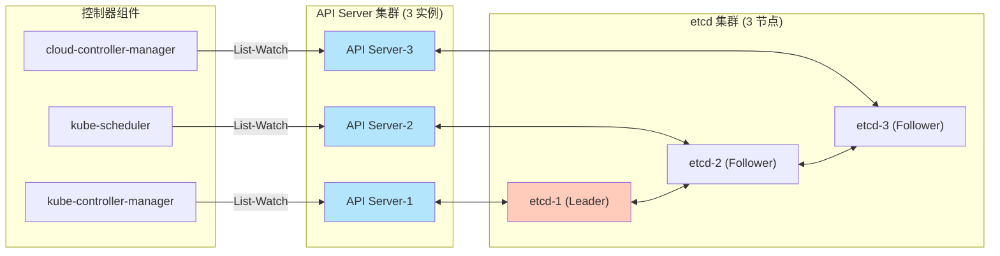
```mermaid
flowchart LR
    subgraph APIServerCluster["API Server 集群 (3 实例)"]
        API1["API Server-1"]
        API2["API Server-2"]
        API3["API Server-3"]
    end

    subgraph ETCDCluster["etcd 集群 (3 节点)"]
        E1["etcd-1 (Leader)"]
        E2["etcd-2 (Follower)"]
        E3["etcd-3 (Follower)"]
    end

    subgraph Controllers["控制器组件"]
        KCM["kube-controller-manager"]
        SCHED["kube-scheduler"]
        CCM["cloud-controller-manager"]
    end

    API1 <--> E1
    API2 <--> E2
    API3 <--> E3
    E1 <--> E2 <--> E3

    KCM -->|List-Watch| API1
    SCHED -->|List-Watch| API2
    CCM -->|List-Watch| API3

    style E1 fill:#ffccbc
    style API1 fill:#b3e5fc
    style API2 fill:#b3e5fc
    style API3 fill:#b3e5fc
```

#<!-- chunk: 2.2 API Server 请求处理流程 -->## 2.2 API Server 请求处理流程

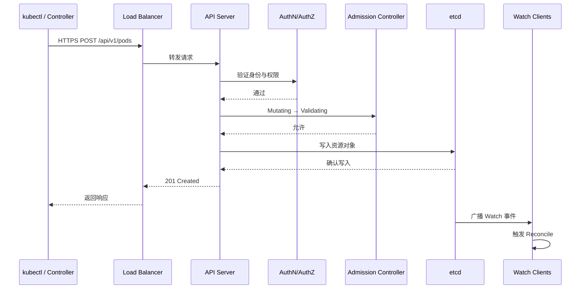
```mermaid
sequenceDiagram
    participant Client as kubectl / Controller
    participant LB as Load Balancer
    participant API as API Server
    participant Auth as AuthN/AuthZ
    participant Admission as Admission Controller
    participant ETCD as etcd
    participant Watcher as Watch Clients

    Client->>LB: HTTPS POST /api/v1/pods
    LB->>API: 转发请求
    API->>Auth: 验证身份与权限
    Auth-->>API: 通过
    API->>Admission: Mutating → Validating
    Admission-->>API: 允许
    API->>ETCD: 写入资源对象
    ETCD-->>API: 确认写入
    API-->>LB: 201 Created
    LB-->>Client: 返回响应
    ETCD->>Watcher: 广播 Watch 事件
    Watcher->>Watcher: 触发 Reconcile
```

#<!-- chunk: 2.3 etcd 数据流与备份架构 -->## 2.3 etcd 数据流与备份架构

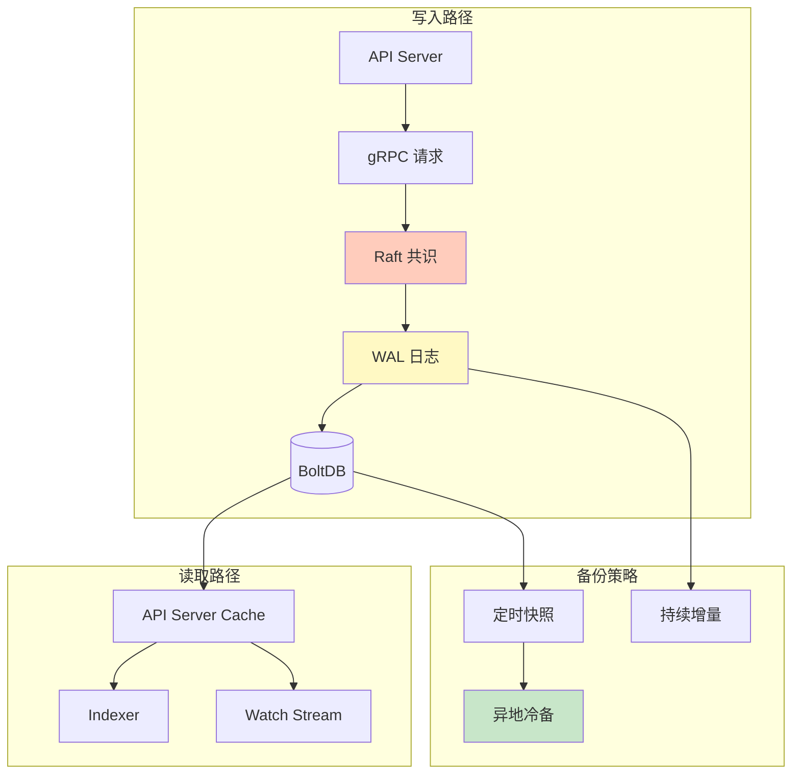
```mermaid
flowchart TB
    subgraph WritePath["写入路径"]
        API[API Server]
        GRPC[gRPC 请求]
        RAFT[Raft 共识]
        WAL[WAL 日志]
        DB[(BoltDB)]
    end

    subgraph ReadPath["读取路径"]
        CACHE[API Server Cache]
        INDEX[Indexer]
        WATCH[Watch Stream]
    end

    subgraph Backup["备份策略"]
        SNAPSHOT[定时快照]
        CONTINUOUS[持续增量]
        OFFSITE[异地冷备]
    end

    API --> GRPC --> RAFT --> WAL --> DB
    DB --> CACHE --> INDEX
    CACHE --> WATCH
    DB --> SNAPSHOT --> OFFSITE
    WAL --> CONTINUOUS

    style RAFT fill:#ffccbc
    style WAL fill:#fff9c4
    style OFFSITE fill:#c8e6c9
```

---

<!-- chunk: 三、工作节点与运行时架构 -->## 三、工作节点与运行时架构

#<!-- chunk: 3.1 节点内部组件交互 -->## 3.1 节点内部组件交互

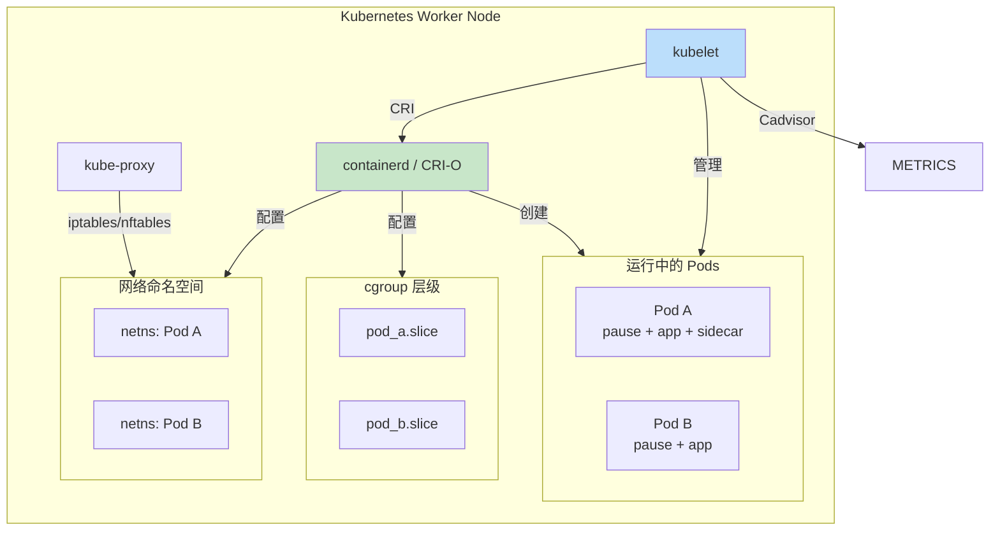
```mermaid
flowchart TB
    subgraph Node["Kubernetes Worker Node"]
        KUBELET[kubelet]
        KPROXY[kube-proxy]
        CRICONTAINER[containerd / CRI-O]

        subgraph Pods["运行中的 Pods"]
            P1["Pod A<br/>pause + app + sidecar"]
            P2["Pod B<br/>pause + app"]
        end

        subgraph Cgroups["cgroup 层级"]
            C1["pod_a.slice"]
            C2["pod_b.slice"]
        end

        subgraph Network["网络命名空间"]
            NS1["netns: Pod A"]
            NS2["netns: Pod B"]
        end
    end

    KUBELET -->|CRI| CRICONTAINER
    KUBELET -->|管理| Pods
    CRICONTAINER -->|创建| Pods
    CRICONTAINER -->|配置| Cgroups
    CRICONTAINER -->|配置| Network
    KPROXY -->|iptables/nftables| Network
    KUBELET -->|Cadvisor| METRICS

    style KUBELET fill:#bbdefb
    style CRICONTAINER fill:#c8e6c9
```

#<!-- chunk: 3.2 节点池与自动扩缩容架构 -->## 3.2 节点池与自动扩缩容架构

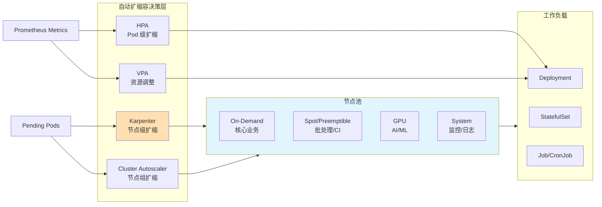
```mermaid
flowchart LR
    subgraph Autoscaler["自动扩缩容决策层"]
        HPA["HPA<br/>Pod 级扩缩"]
        VPA["VPA<br/>资源调整"]
        KARP["Karpenter<br/>节点级扩缩"]
        CA["Cluster Autoscaler<br/>节点组扩缩"]
    end

    subgraph Pools["节点池"]
        ON_DEMAND["On-Demand<br/>核心业务"]
        SPOT["Spot/Preemptible<br/>批处理/CI"]
        GPU["GPU<br/>AI/ML"]
        SYSTEM["System<br/>监控/日志"]
    end

    subgraph Workloads["工作负载"]
        DEP["Deployment"]
        STS["StatefulSet"]
        JOB["Job/CronJob"]
    end

    METRICS["Prometheus Metrics"] --> HPA
    METRICS --> VPA
    PENDING["Pending Pods"] --> KARP
    PENDING --> CA

    HPA --> DEP
    VPA --> DEP
    KARP --> Pools
    CA --> Pools
    Pools --> Workloads

    style KARP fill:#ffe0b2
    style Pools fill:#e1f5fe
```

#<!-- chunk: 3.3 DRA (动态资源分配) GPU 架构 -->## 3.3 DRA (动态资源分配) GPU 架构

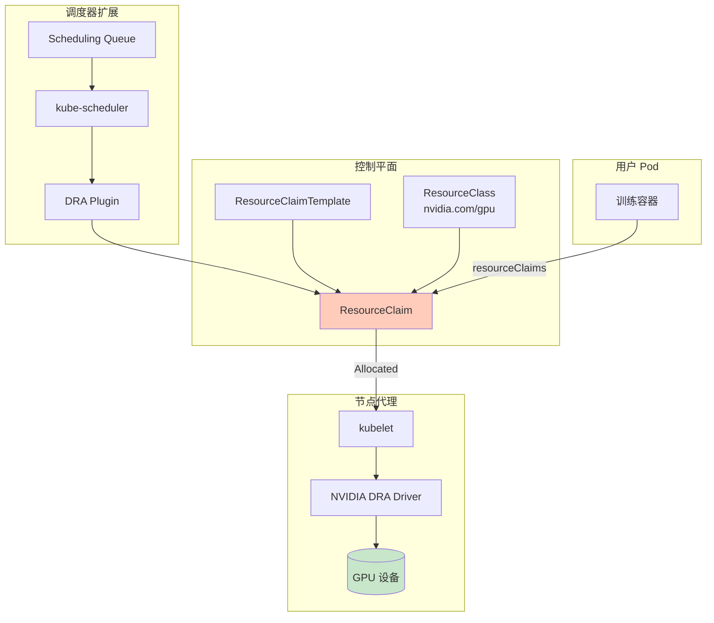
```mermaid
flowchart TB
    subgraph SchedulerExt["调度器扩展"]
        SCHED["kube-scheduler"]
        DRA_PLUGIN["DRA Plugin"]
        QUEUE["Scheduling Queue"]
    end

    subgraph ControlPlane["控制平面"]
        RC_TEMPLATE["ResourceClaimTemplate"]
        RC["ResourceClaim"]
        CLASS["ResourceClass<br/>nvidia.com/gpu"]
    end

    subgraph NodeAgent["节点代理"]
        KUBELET[kubelet]
        DRA_DRIVER["NVIDIA DRA Driver"]
        GPU[(GPU 设备)]
    end

    subgraph UserPod["用户 Pod"]
        CONTAINER["训练容器"]
    end

    SCHED --> DRA_PLUGIN
    DRA_PLUGIN --> RC
    RC_TEMPLATE --> RC
    CLASS --> RC
    RC -->|Allocated| KUBELET
    KUBELET --> DRA_DRIVER
    DRA_DRIVER --> GPU
    CONTAINER -->|resourceClaims| RC
    QUEUE --> SCHED

    style RC fill:#ffccbc
    style GPU fill:#c8e6c9
```

---

<!-- chunk: 四、网络架构设计 -->## 四、网络架构设计

#<!-- chunk: 4.1 生产环境网络全景 -->## 4.1 生产环境网络全景

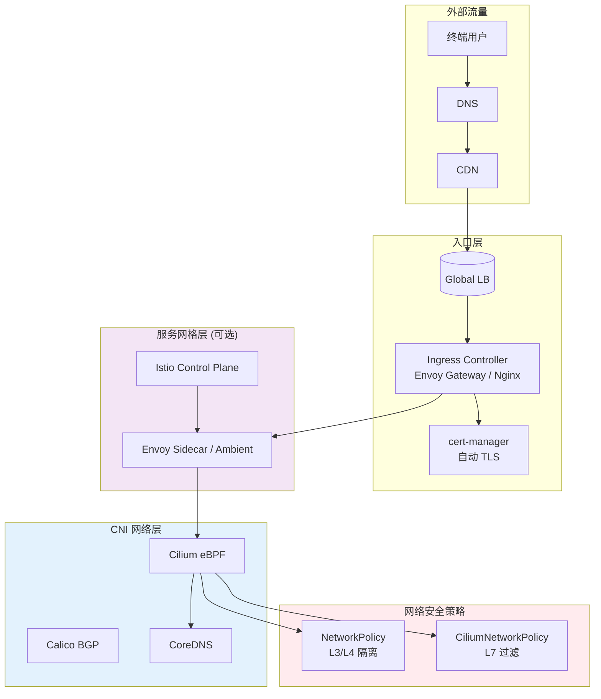
```mermaid
flowchart TB
    subgraph External["外部流量"]
        DNS[DNS]
        CDN[CDN]
        USERS[终端用户]
    end

    subgraph Ingress["入口层"]
        GLB[(Global LB)]
        ING_CONTROLLER["Ingress Controller<br/>Envoy Gateway / Nginx"]
        CERT[cert-manager<br/>自动 TLS]
    end

    subgraph ServiceMesh["服务网格层 (可选)"]
        PROXY["Envoy Sidecar / Ambient"]
        ISTIO["Istio Control Plane"]
    end

    subgraph CNI["CNI 网络层"]
        CILIUM["Cilium eBPF"]
        CALICO["Calico BGP"]
        COREDNS["CoreDNS"]
    end

    subgraph Policy["网络安全策略"]
        NETPOL["NetworkPolicy<br/>L3/L4 隔离"]
        CNP["CiliumNetworkPolicy<br/>L7 过滤"]
    end

    USERS --> DNS --> CDN --> GLB
    GLB --> ING_CONTROLLER --> CERT
    ING_CONTROLLER --> PROXY
    PROXY --> CILIUM
    ISTIO --> PROXY
    CILIUM --> COREDNS
    CILIUM --> NETPOL
    CILIUM --> CNP

    style ServiceMesh fill:#f3e5f5
    style CNI fill:#e3f2fd
    style Policy fill:#ffebee
```

#<!-- chunk: 4.2 Cilium eBPF 数据包路径 -->## 4.2 Cilium eBPF 数据包路径

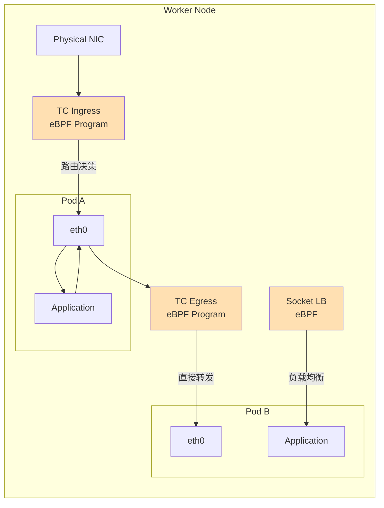
```mermaid
flowchart LR
    subgraph Node["Worker Node"]
        NIC["Physical NIC"]
        TC_EGR["TC Egress<br/>eBPF Program"]
        TC_ING["TC Ingress<br/>eBPF Program"]
        SOCK["Socket LB<br/>eBPF"]

        subgraph Pod1["Pod A"]
            ETH0["eth0"]
            APP1["Application"]
        end

        subgraph Pod2["Pod B"]
            ETH1["eth0"]
            APP2["Application"]
        end
    end

    NIC --> TC_ING
    TC_ING -->|路由决策| ETH0
    ETH0 --> APP1
    APP1 --> ETH0
    ETH0 --> TC_EGR
    TC_EGR -->|直接转发| ETH1
    SOCK -->|负载均衡| APP2

    style TC_EGR fill:#ffe0b2
    style TC_ING fill:#ffe0b2
    style SOCK fill:#ffe0b2
```

#<!-- chunk: 4.3 服务发现与 DNS 架构 -->## 4.3 服务发现与 DNS 架构

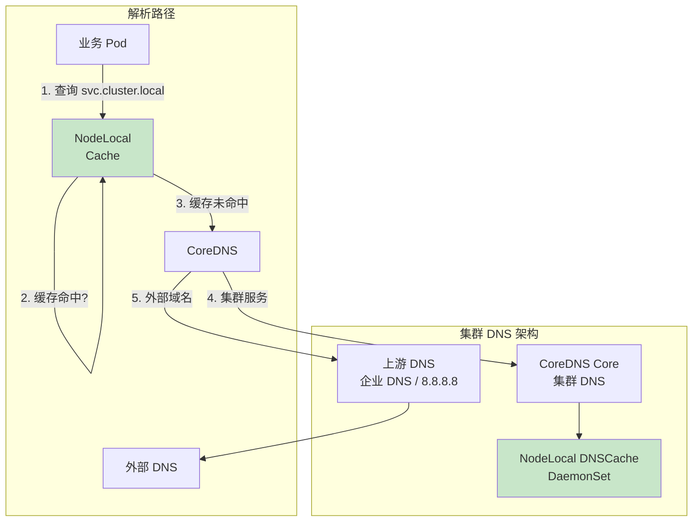
```mermaid
flowchart TB
    subgraph DNSArchitecture["集群 DNS 架构"]
        COREDNS_CORE["CoreDNS Core<br/>集群 DNS"]
        NODELOCAL["NodeLocal DNSCache<br/>DaemonSet"]
        UPSTREAM["上游 DNS<br/>企业 DNS / 8.8.8.8"]
    end

    subgraph Resolution["解析路径"]
        APP["业务 Pod"]
        NLC["NodeLocal<br/>Cache"]
        CORE["CoreDNS"]
        EXT["外部 DNS"]
    end

    APP -->|1. 查询 svc.cluster.local| NLC
    NLC -->|2. 缓存命中?| NLC
    NLC -->|3. 缓存未命中| CORE
    CORE -->|4. 集群服务| COREDNS_CORE
    CORE -->|5. 外部域名| UPSTREAM
    UPSTREAM --> EXT

    COREDNS_CORE --> NODELOCAL

    style NODELOCAL fill:#c8e6c9
    style NLC fill:#c8e6c9
```

---

<!-- chunk: 五、存储架构设计 -->## 五、存储架构设计

#<!-- chunk: 5.1 生产环境存储分层 -->## 5.1 生产环境存储分层

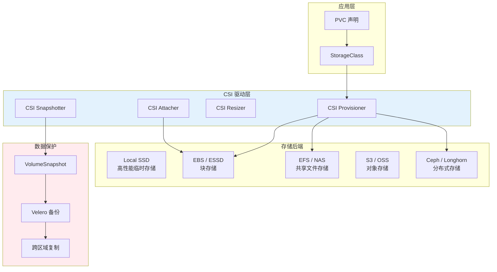
```mermaid
flowchart TB
    subgraph Apps["应用层"]
        PVC["PVC 声明"]
        SC["StorageClass"]
    end

    subgraph CSI["CSI 驱动层"]
        PROVISIONER["CSI Provisioner"]
        ATTACHER["CSI Attacher"]
        RESIZER["CSI Resizer"]
        SNAPSHOTTER["CSI Snapshotter"]
    end

    subgraph Backend["存储后端"]
        LOCAL["Local SSD<br/>高性能临时存储"]
        EBS["EBS / ESSD<br/>块存储"]
        EFS["EFS / NAS<br/>共享文件存储"]
        S3["S3 / OSS<br/>对象存储"]
        CEPH["Ceph / Longhorn<br/>分布式存储"]
    end

    subgraph DR["数据保护"]
        SNAPSHOT["VolumeSnapshot"]
        BACKUP["Velero 备份"]
        REPLICATE["跨区域复制"]
    end

    PVC --> SC
    SC --> PROVISIONER
    PROVISIONER --> EBS
    PROVISIONER --> EFS
    PROVISIONER --> CEPH
    ATTACHER --> EBS
    SNAPSHOTTER --> SNAPSHOT
    SNAPSHOT --> BACKUP --> REPLICATE

    style CSI fill:#e3f2fd
    style DR fill:#ffebee
```

#<!-- chunk: 5.2 有状态应用存储模式 -->## 5.2 有状态应用存储模式

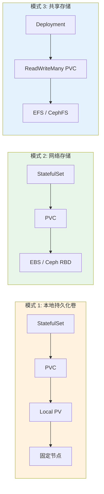
```mermaid
flowchart LR
    subgraph Pattern1["模式 1: 本地持久化卷"]
        STS1["StatefulSet"]
        PVC1["PVC"]
        LOCAL1["Local PV"]
        NODE1["固定节点"]
    end

    subgraph Pattern2["模式 2: 网络存储"]
        STS2["StatefulSet"]
        PVC2["PVC"]
        NET["EBS / Ceph RBD"]
    end

    subgraph Pattern3["模式 3: 共享存储"]
        DEP["Deployment"]
        PVC3["ReadWriteMany PVC"]
        SHARED["EFS / CephFS"]
    end

    STS1 --> PVC1 --> LOCAL1 --> NODE1
    STS2 --> PVC2 --> NET
    DEP --> PVC3 --> SHARED

    style Pattern1 fill:#fff3e0
    style Pattern2 fill:#e8f5e9
    style Pattern3 fill:#e3f2fd
```

---

<!-- chunk: 六、安全架构设计 -->## 六、安全架构设计

#<!-- chunk: 6.1 零信任安全架构 -->## 6.1 零信任安全架构

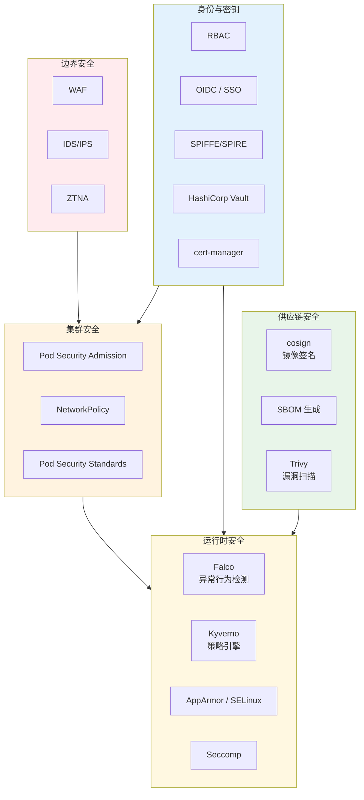
```mermaid
flowchart TB
    subgraph Perimeter["边界安全"]
        WAF["WAF"]
        IDS["IDS/IPS"]
        ZTNA["ZTNA"]
    end

    subgraph ClusterSec["集群安全"]
        PSA["Pod Security Admission"]
        NETPOL["NetworkPolicy"]
        PSP_REPLACEMENT["Pod Security Standards"]
    end

    subgraph RuntimeSec["运行时安全"]
        FALCO["Falco<br/>异常行为检测"]
        KYV["Kyverno<br/>策略引擎"]
        APPARMOR["AppArmor / SELinux"]
        SECCOMP["Seccomp"]
    end

    subgraph Identity["身份与密钥"]
        RBAC["RBAC"]
        OIDC["OIDC / SSO"]
        SPIFFE["SPIFFE/SPIRE"]
        VAULT["HashiCorp Vault"]
        CERTM["cert-manager"]
    end

    subgraph SupplyChain["供应链安全"]
        COSIGN["cosign<br/>镜像签名"]
        SBOM["SBOM 生成"]
        TRIVY["Trivy<br/>漏洞扫描"]
    end

    Perimeter --> ClusterSec --> RuntimeSec
    Identity --> ClusterSec
    Identity --> RuntimeSec
    SupplyChain --> RuntimeSec

    style Perimeter fill:#ffebee
    style ClusterSec fill:#fff3e0
    style RuntimeSec fill:#fff8e1
    style Identity fill:#e3f2fd
    style SupplyChain fill:#e8f5e9
```

#<!-- chunk: 6.2 认证授权流程 -->## 6.2 认证授权流程

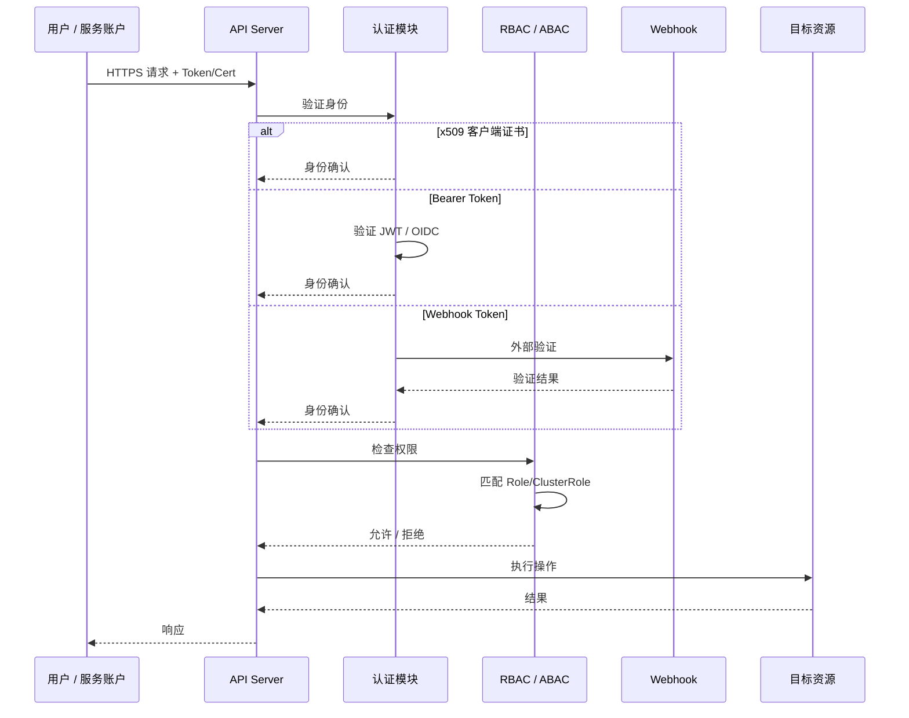
```mermaid
sequenceDiagram
    participant User as 用户 / 服务账户
    participant API as API Server
    participant AuthN as 认证模块
    participant AuthZ as RBAC / ABAC
    participant Webhook as Webhook
    participant Resource as 目标资源

    User->>API: HTTPS 请求 + Token/Cert
    API->>AuthN: 验证身份
    alt x509 客户端证书
        AuthN-->>API: 身份确认
    else Bearer Token
        AuthN->>AuthN: 验证 JWT / OIDC
        AuthN-->>API: 身份确认
    else Webhook Token
        AuthN->>Webhook: 外部验证
        Webhook-->>AuthN: 验证结果
        AuthN-->>API: 身份确认
    end

    API->>AuthZ: 检查权限
    AuthZ->>AuthZ: 匹配 Role/ClusterRole
    AuthZ-->>API: 允许 / 拒绝

    API->>Resource: 执行操作
    Resource-->>API: 结果
    API-->>User: 响应
```

#<!-- chunk: 6.3 密钥管理架构 -->## 6.3 密钥管理架构

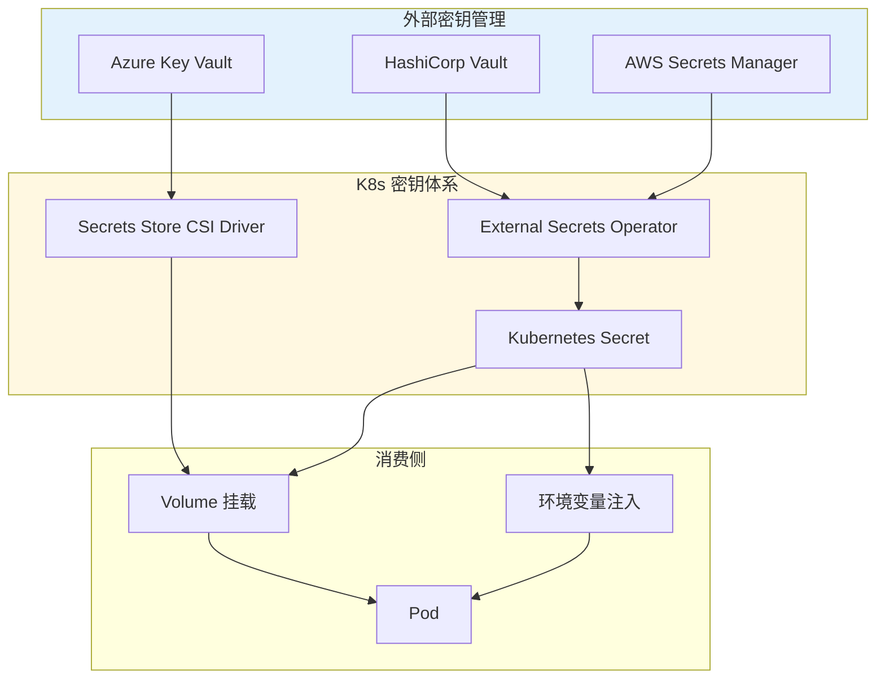
```mermaid
flowchart TB
    subgraph ExternalSecrets["外部密钥管理"]
        VAULT["HashiCorp Vault"]
        AWS_SM["AWS Secrets Manager"]
        AZURE_KV["Azure Key Vault"]
    end

    subgraph K8sSecrets["K8s 密钥体系"]
        ES["External Secrets Operator"]
        SECRET["Kubernetes Secret"]
        CSI_SECRET["Secrets Store CSI Driver"]
    end

    subgraph Consumption["消费侧"]
        POD["Pod"]
        VOL["Volume 挂载"]
        ENV["环境变量注入"]
    end

    VAULT --> ES
    AWS_SM --> ES
    AZURE_KV --> CSI_SECRET
    ES --> SECRET
    CSI_SECRET --> VOL
    SECRET --> ENV
    SECRET --> VOL
    VOL --> POD
    ENV --> POD

    style ExternalSecrets fill:#e3f2fd
    style K8sSecrets fill:#fff8e1
```

---

<!-- chunk: 七、可观测性架构 -->## 七、可观测性架构

#<!-- chunk: 7.1 三大支柱统一架构 -->## 7.1 三大支柱统一架构

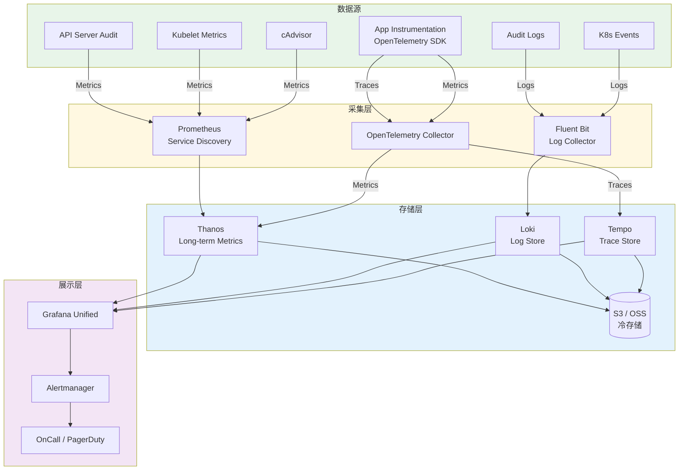
```mermaid
flowchart TB
    subgraph Sources["数据源"]
        APISERVER["API Server Audit"]
        KUBELET_METRICS["Kubelet Metrics"]
        CADVISOR["cAdvisor"]
        APP_METRICS["App Instrumentation<br/>OpenTelemetry SDK"]
        AUDIT["Audit Logs"]
        EVENTS["K8s Events"]
    end

    subgraph Collection["采集层"]
        PROM["Prometheus<br/>Service Discovery"]
        OTEL_COL["OpenTelemetry Collector"]
        FLUENT["Fluent Bit<br/>Log Collector"]
    end

    subgraph Storage["存储层"]
        THANOS["Thanos<br/>Long-term Metrics"]
        LOKI["Loki<br/>Log Store"]
        TEMPO["Tempo<br/>Trace Store"]
        S3_LTS[(S3 / OSS<br/>冷存储)]
    end

    subgraph Visualization["展示层"]
        GRAFANA["Grafana Unified"]
        ALERTMANAGER["Alertmanager"]
        ONCALL["OnCall / PagerDuty"]
    end

    APISERVER -->|Metrics| PROM
    KUBELET_METRICS -->|Metrics| PROM
    CADVISOR -->|Metrics| PROM
    APP_METRICS -->|Traces| OTEL_COL
    APP_METRICS -->|Metrics| OTEL_COL
    AUDIT -->|Logs| FLUENT
    EVENTS -->|Logs| FLUENT

    PROM --> THANOS
    OTEL_COL -->|Metrics| THANOS
    OTEL_COL -->|Traces| TEMPO
    FLUENT --> LOKI

    THANOS --> S3_LTS
    LOKI --> S3_LTS
    TEMPO --> S3_LTS

    THANOS --> GRAFANA
    LOKI --> GRAFANA
    TEMPO --> GRAFANA
    GRAFANA --> ALERTMANAGER
    ALERTMANAGER --> ONCALL

    style Sources fill:#e8f5e9
    style Collection fill:#fff8e1
    style Storage fill:#e3f2fd
    style Visualization fill:#f3e5f5
```

#<!-- chunk: 7.2 分布式追踪链路 -->## 7.2 分布式追踪链路

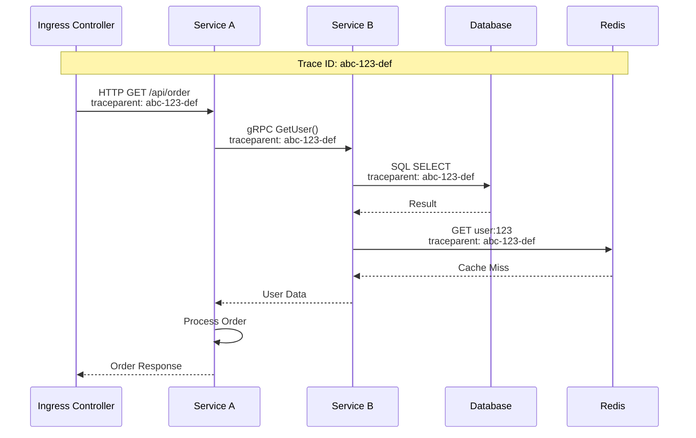
```mermaid
sequenceDiagram
    participant Ingress as Ingress Controller
    participant SVC_A as Service A
    participant SVC_B as Service B
    participant DB as Database
    participant Cache as Redis

    Note over Ingress,Cache: Trace ID: abc-123-def

    Ingress->>SVC_A: HTTP GET /api/order<br/>traceparent: abc-123-def
    SVC_A->>SVC_B: gRPC GetUser()<br/>traceparent: abc-123-def
    SVC_B->>DB: SQL SELECT<br/>traceparent: abc-123-def
    DB-->>SVC_B: Result
    SVC_B->>Cache: GET user:123<br/>traceparent: abc-123-def
    Cache-->>SVC_B: Cache Miss
    SVC_B-->>SVC_A: User Data
    SVC_A->>SVC_A: Process Order
    SVC_A-->>Ingress: Order Response
```

#<!-- chunk: 7.3 告警路由架构 -->## 7.3 告警路由架构

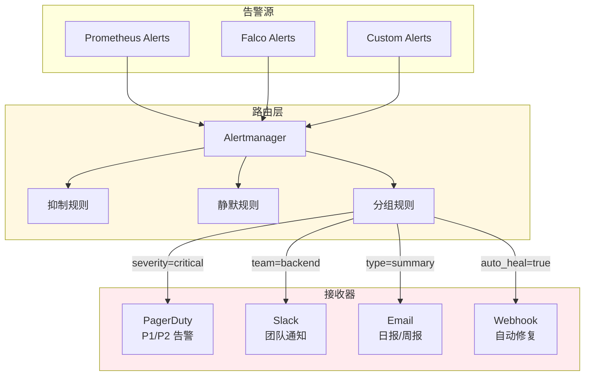
```mermaid
flowchart TB
    subgraph Alerts["告警源"]
        PROM_ALERT["Prometheus Alerts"]
        FALCO_ALERT["Falco Alerts"]
        CUSTOM["Custom Alerts"]
    end

    subgraph Routing["路由层"]
        AM["Alertmanager"]
        INHIBITION["抑制规则"]
        SILENCE["静默规则"]
        GROUPING["分组规则"]
    end

    subgraph Receivers["接收器"]
        PAGERDUTY["PagerDuty<br/>P1/P2 告警"]
        SLACK["Slack<br/>团队通知"]
        EMAIL["Email<br/>日报/周报"]
        WEBHOOK["Webhook<br/>自动修复"]
    end

    PROM_ALERT --> AM
    FALCO_ALERT --> AM
    CUSTOM --> AM
    AM --> INHIBITION
    AM --> SILENCE
    AM --> GROUPING
    GROUPING -->|severity=critical| PAGERDUTY
    GROUPING -->|team=backend| SLACK
    GROUPING -->|type=summary| EMAIL
    GROUPING -->|auto_heal=true| WEBHOOK

    style Routing fill:#fff8e1
    style Receivers fill:#ffebee
```

---

<!-- chunk: 八、多集群与联邦架构 -->## 八、多集群与联邦架构

#<!-- chunk: 8.1 多集群统一管理架构 -->## 8.1 多集群统一管理架构

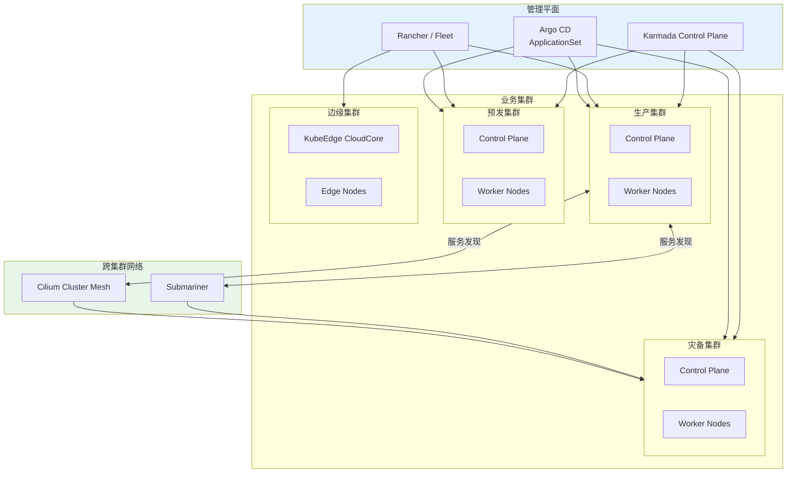
```mermaid
flowchart TB
    subgraph ControlPlane["管理平面"]
        KARMADA["Karmada Control Plane"]
        RANCHER["Rancher / Fleet"]
        ARGO_CD["Argo CD<br/>ApplicationSet"]
    end

    subgraph Clusters["业务集群"]
        subgraph PROD["生产集群"]
            PROD_CP["Control Plane"]
            PROD_WK["Worker Nodes"]
        end

        subgraph DR["灾备集群"]
            DR_CP["Control Plane"]
            DR_WK["Worker Nodes"]
        end

        subgraph STAGING["预发集群"]
            STG_CP["Control Plane"]
            STG_WK["Worker Nodes"]
        end

        subgraph EDGE["边缘集群"]
            EDGE_CP["KubeEdge CloudCore"]
            EDGE_NODE["Edge Nodes"]
        end
    end

    subgraph Networking["跨集群网络"]
        SUBMARINER["Submariner"]
        CLUSTERMESH["Cilium Cluster Mesh"]
    end

    KARMADA --> PROD
    KARMADA --> DR
    KARMADA --> STAGING
    RANCHER --> PROD
    RANCHER --> STAGING
    RANCHER --> EDGE
    ARGO_CD --> PROD
    ARGO_CD --> STAGING
    ARGO_CD --> DR

    PROD <-->|服务发现| SUBMARINER --> DR
    PROD <-->|服务发现| CLUSTERMESH --> DR

    style ControlPlane fill:#e3f2fd
    style Networking fill:#e8f5e9
```

#<!-- chunk: 8.2 跨集群流量管理 -->## 8.2 跨集群流量管理

```mermaid
flowchart LR
    subgraph ClusterA["Cluster A (北京)"]
        SVC_A["Service A<br/>v1.0"]
        ING_A["Ingress"]
    end

    subgraph ClusterB["Cluster B (上海)"]
        SVC_B["Service A<br/>v1.1"]
        ING_B["Ingress"]
    end

    subgraph GSLB["全局负载均衡"]
        DNS["GeoDNS / GTM"]
        HEALTH["健康检查"]
    end

    USERS["用户"] --> DNS
    DNS -->|北京用户| ING_A
    DNS -->|上海用户| ING_B
    HEALTH --> SVC_A
    HEALTH --> SVC_B
    ING_A --> SVC_A
    ING_B --> SVC_B

    style GSLB fill:#fff8e1
```

---

<!-- chunk: 九、灾备与业务连续性架构 -->## 九、灾备与业务连续性架构

#<!-- chunk: 9.1 多层灾备架构 -->## 9.1 多层灾备架构

```mermaid
flowchart TB
    subgraph RTO_RPO["恢复目标"]
        RTO["RTO: 恢复时间目标"]
        RPO["RPO: 恢复点目标"]
    end

    subgraph Layer1["L1: 应用层高可用"]
        MULTI_POD["多副本 + PDB"]
        HPA["HPA 自动扩容"]
        ANTIAFFINITY["Pod 反亲和性"]
    end

    subgraph Layer2["L2: 节点层容错"]
        MULTI_AZ["多可用区部署"]
        NODE_POOL["节点池自动替换"]
        CORDON_DRAIN["优雅驱逐"]
    end

    subgraph Layer3["L3: 集群级灾备"]
        ETCD_BK["etcd 定时快照"]
        VELERO["Velero 备份"]
        CROSS_CLUSTER["跨集群复制"]
    end

    subgraph Layer4["L4: 地域级容灾"]
        CROSS_REGION["跨区域集群"]
        DNS_FAILOVER["DNS 故障转移"]
        DATA_REPL["数据跨区域复制"]
    end

    RTO --> Layer1 --> Layer2 --> Layer3 --> Layer4
    RPO --> Layer1 --> Layer2 --> Layer3 --> Layer4

    style Layer1 fill:#c8e6c9
    style Layer2 fill:#fff9c4
    style Layer3 fill:#ffe0b2
    style Layer4 fill:#ffccbc
```

#<!-- chunk: 9.2 备份与恢复流程 -->## 9.2 备份与恢复流程

```mermaid
sequenceDiagram
    participant Schedule as CronJob / Schedule
    participant Velero as Velero
    participant S3 as S3 备份存储
    participant ETCD as etcd Snapshot
    participant Cluster as 目标集群

    rect rgb(200, 230, 240)
        Note over Schedule,ETCD: 备份阶段
        Schedule->>Velero: 触发备份
        Velero->>Cluster: 读取资源对象
        Velero->>Cluster: 读取 PV 数据
        Velero->>S3: 上传备份包
        ETCD->>S3: 上传快照
    end

    rect rgb(255, 230, 200)
        Note over S3,Cluster: 恢复阶段
        S3->>Velero: 下载备份包
        Velero->>Cluster: 恢复命名空间
        Velero->>Cluster: 恢复 PVC + PV
        S3->>ETCD: 恢复 etcd
    end
```

---

<!-- chunk: 十、GitOps 与 CI/CD 架构 -->## 十、GitOps 与 CI/CD 架构

#<!-- chunk: 10.1 GitOps 完整流水线 -->## 10.1 GitOps 完整流水线

```mermaid
flowchart TB
    subgraph Git["Git 仓库"]
        APP_CODE["应用代码"]
        HELM_CHART["Helm Charts"]
        KUSTOMIZE["Kustomize Overlays"]
        POLICY["OPA Policies"]
    end

    subgraph CI["持续集成"]
        BUILD["镜像构建"]
        TEST["单元/集成测试"]
        SCAN["镜像安全扫描"]
        SIGN["镜像签名<br/>cosign"]
    end

    subgraph Registry["镜像仓库"]
        HARBOR["Harbor<br/>签名镜像 + SBOM"]
    end

    subgraph CD["持续部署 (GitOps)"]
        ARGO["Argo CD"]
        FLUX["Flux"]
        IMAGE_UPDATER["Image Updater"]
    end

    subgraph Cluster["目标集群"]
        APP["应用工作负载"]
        POLICY_ENF["策略执行<br/>Kyverno"]
    end

    APP_CODE --> BUILD --> TEST --> SCAN --> SIGN --> HARBOR
    HELM_CHART --> ARGO
    KUSTOMIZE --> ARGO
    POLICY --> ARGO
    HARBOR --> IMAGE_UPDATER --> ARGO
    ARGO -->|同步| APP
    ARGO -->|验证| POLICY_ENF

    style CI fill:#e3f2fd
    style CD fill:#e8f5e9
    style Registry fill:#fff8e1
```

#<!-- chunk: 10.2 金丝雀发布架构 -->## 10.2 金丝雀发布架构

```mermaid
flowchart LR
    subgraph Traffic["流量管理"]
        INGRESS["Ingress /<br>Gateway API"]
        FLG["Flagger<br/>金丝雀控制器"]
        PROM_METRICS["Prometheus Metrics"]
    end

    subgraph Versions["版本部署"]
        V1["Deployment v1.0<br/>100% 流量"]
        V2["Deployment v1.1<br/>0% → 100%"]
    end

    subgraph Analysis["分析决策"]
        LATENCY["延迟 < 500ms"]
        ERROR_RATE["错误率 < 1%"]
        CUSTOM["自定义指标"]
    end

    INGRESS --> V1
    FLG -->|创建| V2
    FLG -->|渐进流量切换| INGRESS
    PROM_METRICS --> FLG
    FLG -->|分析| LATENCY
    FLG -->|分析| ERROR_RATE
    FLG -->|分析| CUSTOM
    LATENCY -->|通过| FLG
    ERROR_RATE -->|通过| FLG
    CUSTOM -->|通过| FLG
    FLG -->|成功| V2
    FLG -->|失败| V1

    style FLG fill:#ffe0b2
    style Analysis fill:#c8e6c9
```

---

<!-- chunk: 附录：架构决策树 -->## 附录：架构决策树

```mermaid
flowchart TD
    START([生产环境架构设计])

    START --> Q1{集群规模?}
    Q1 -->|单集群 < 100 节点| SINGLE["标准单集群架构<br/>HA 控制平面 + 多节点池"]
    Q1 -->|多集群 > 100 节点| MULTI["多集群联邦架构<br/>Karmada / Rancher"]

    START --> Q2{网络要求?}
    Q2 -->|高性能 + 安全| CILIUM["Cilium eBPF<br/>+ Cluster Mesh"]
    Q2 -->|简单 + 稳定| CALICO["Calico BGP<br/>+ NetworkPolicy"]

    START --> Q3{存储类型?}
    Q3 -->|数据库| LOCAL["Local PV<br/>+ 节点亲和性"]
    Q3 -->|共享文件| RWX["ReadWriteMany<br/>EFS / CephFS"]
    Q3 -->|对象存储| S3["S3 CSI Driver<br/>直接挂载"]

    START --> Q4{部署策略?}
    Q4 -->|零停机 + 回滚| CANARY["金丝雀发布<br/>Flagger + Prometheus"]
    Q4 -->|快速迭代| BLUE_GREEN["蓝绿部署<br/>双环境切换"]
    Q4 -->|简单滚动| ROLLING["滚动更新<br/>maxSurge / maxUnavailable"]

    START --> Q5{GPU / AI?}
    Q5 -->|是| GPU_ARCH["DRA + GPU Operator<br/>+ Karpenter GPU 节点池"]
    Q5 -->|否| STANDARD["标准资源管理<br/>HPA + VPA"]

    style START fill:#bbdefb
    style SINGLE fill:#c8e6c9
    style MULTI fill:#c8e6c9
    style CILIUM fill:#fff8e1
    style CALICO fill:#fff8e1
    style CANARY fill:#ffccbc
    style BLUE_GREEN fill:#ffccbc
    style ROLLING fill:#ffccbc
    style GPU_ARCH fill:#e1f5fe
```

---

<!-- chunk: 参考链接 -->## 参考链接

- [Kubernetes 生产环境最佳实践](https://kubernetes.io/docs/setup/production-environment/)
- [Cilium 生产架构指南](https://docs.cilium.io/en/stable/concepts/)
- [Prometheus 高可用架构](https://prometheus.io/docs/introduction/faq/)
- [Argo CD 架构](https://argo-cd.readthedocs.io/en/stable/operator-manual/architecture/)
- [Velero 备份恢复](https://velero.io/docs/)

---

<!-- chunk: Obsidian 相关文档 -->## Obsidian 相关文档

- [[domain-11-production-operations/MOC.md|domain-11-production-operations MOC]]
- [[domain-11-production-operations/README.md|Domain 17: 生产环境运维最佳实践 (Production Operations Best Practices)]]
- [[domain-11-production-operations/00-open-source-projects-index.md|Domain-18 生产运维 — 开源项目索引]]
- [[domain-01-cluster-fundamentals/01-production-architecture-design-principles.md|01-生产架构设计原则]]
- [[domain-01-cluster-fundamentals/02-multi-cloud-hybrid-deployment-strategy.md|02-多云混合部署策略]]
- [[domain-01-cluster-fundamentals/03-edge-computing-production-deployment.md|03-边缘计算生产部署]]
- [[domain-06-observability/04-enterprise-monitoring-system.md|04-企业级监控体系]]
- [[domain-06-observability/05-logging-collection-analysis-platform.md|05-日志收集分析平台]]
- [[domain-06-observability/06-apm-application-performance-monitoring.md|06-APM应用性能监控]]
- [[domain-05-security-compliance/07-zero-trust-security-architecture.md|07-零信任安全架构]]
- [[domain-05-security-compliance/08-cis-benchmark-compliance-audit.md|08-CIS基准合规检查]]
- [[domain-05-security-compliance/09-software-bill-of-materials.md|09-软件物料清单]]

## Related

- [[domain-20-application-patterns/20-microservice-governance-architecture.md|20-microservice-governance-architecture]]
- [[domain-20-application-patterns/45-smart-port-shipping.md|45-smart-port-shipping]]
- [[domain-20-application-patterns/65-autonomous-driving-sim.md|65-autonomous-driving-sim]]
- [[domain-20-application-patterns/19-cloudnative-devops-architecture.md|19-cloudnative-devops-architecture]]
- [[domain-20-application-patterns/84-national-park.md|84-national-park]]
- [[domain-20-application-patterns/83-cultural-digitization.md|83-cultural-digitization]]
- [[domain-20-application-patterns/94-smart-prison.md|94-smart-prison]]
- [[domain-20-application-patterns/30-hrtech-saas.md|30-hrtech-saas]]
- [[domain-20-application-patterns/68-quantum-computing-cloud.md|68-quantum-computing-cloud]]
- [[domain-20-application-patterns/64-ai-drug-discovery.md|64-ai-drug-discovery]]
- [[domain-20-application-patterns/91-urban-air-mobility.md|91-urban-air-mobility]]
- [[domain-20-application-patterns/21-cross-border-ecommerce.md|21-cross-border-ecommerce]]
- [[domain-20-application-patterns/69-6g-core-network.md|69-6g-core-network]]
- [[domain-20-application-patterns/71-smart-tax.md|71-smart-tax]]
- [[domain-20-application-patterns/03-cms-architecture.md|03-cms-architecture]]
- [[domain-20-application-patterns/85-hydrogen-energy.md|85-hydrogen-energy]]
- [[domain-20-application-patterns/18-data-midplatform-architecture.md|18-data-midplatform-architecture]]
- [[domain-20-application-patterns/16-video-shortform-architecture.md|16-video-shortform-architecture]]
- [[domain-20-application-patterns/55-crossborder-dtc.md|55-crossborder-dtc]]
- [[domain-20-application-patterns/27-hospitality-tourism.md|27-hospitality-tourism]]
- [[domain-20-application-patterns/40-cloud-gaming.md|40-cloud-gaming]]
- [[domain-20-application-patterns/87-flexible-manufacturing.md|87-flexible-manufacturing]]
- [[domain-20-application-patterns/34-sportstech.md|34-sportstech]]
- [[domain-20-application-patterns/93-digital-twin-factory.md|93-digital-twin-factory]]
- [[domain-20-application-patterns/28-proptech.md|28-proptech]]
- [[domain-20-application-patterns/09-gaming-backend-architecture.md|09-gaming-backend-architecture]]
- [[domain-20-application-patterns/59-industrial-internet-platform.md|59-industrial-internet-platform]]
- [[domain-20-application-patterns/54-social-gaming-metaverse.md|54-social-gaming-metaverse]]
- [[domain-20-application-patterns/31-instant-retail.md|31-instant-retail]]
- [[domain-20-application-patterns/22-nev-connected-vehicle.md|22-nev-connected-vehicle]]
- [[domain-20-application-patterns/33-crossborder-warehouse.md|33-crossborder-warehouse]]
- [[domain-20-application-patterns/05-online-education-architecture.md|05-online-education-architecture]]
- [[domain-20-application-patterns/70-ecny-cbdc.md|70-ecny-cbdc]]
- [[domain-20-application-patterns/62-distributed-energy.md|62-distributed-energy]]
- [[domain-20-application-patterns/75-affective-computing.md|75-affective-computing]]
- [[domain-20-application-patterns/50-unmanned-retail.md|50-unmanned-retail]]
- [[domain-20-application-patterns/77-fusion-energy-monitoring.md|77-fusion-energy-monitoring]]
- [[domain-20-application-patterns/42-secondhand-circular.md|42-secondhand-circular]]
- [[domain-20-application-patterns/79-polar-research.md|79-polar-research]]
- [[domain-20-application-patterns/26-aviation-travel.md|26-aviation-travel]]
- [[domain-20-application-patterns/80-tsn-network.md|80-tsn-network]]
- [[domain-20-application-patterns/43-enterprise-im.md|43-enterprise-im]]
- [[domain-20-application-patterns/73-smart-firefighting.md|73-smart-firefighting]]
- [[domain-20-application-patterns/14-smart-healthcare-architecture.md|14-smart-healthcare-architecture]]
- [[domain-20-application-patterns/96-carbon-capture.md|96-carbon-capture]]
- [[domain-20-application-patterns/60-v2x-autonomous-driving.md|60-v2x-autonomous-driving]]
- [[domain-20-application-patterns/74-immersive-xr.md|74-immersive-xr]]
- [[domain-20-application-patterns/78-deep-sea-exploration.md|78-deep-sea-exploration]]
- [[domain-20-application-patterns/12-smart-logistics-architecture.md|12-smart-logistics-architecture]]
- [[domain-20-application-patterns/51-smart-manufacturing-mes.md|51-smart-manufacturing-mes]]
- [[domain-20-application-patterns/08-ai-ml-inference-architecture.md|08-ai-ml-inference-architecture]]
- [[domain-20-application-patterns/23-xinchuang-it-innovation.md|23-xinchuang-it-innovation]]
- [[domain-20-application-patterns/47-smart-mining.md|47-smart-mining]]
- [[domain-20-application-patterns/58-web3-gamefi.md|58-web3-gamefi]]
- [[domain-20-application-patterns/29-agritech-iot.md|29-agritech-iot]]
- [[domain-20-application-patterns/57-digital-therapeutics.md|57-digital-therapeutics]]
- [[domain-20-application-patterns/92-smart-sports-venue.md|92-smart-sports-venue]]
- [[domain-20-application-patterns/76-synthetic-biology.md|76-synthetic-biology]]
- [[domain-20-application-patterns/61-smart-grid.md|61-smart-grid]]
- [[domain-20-application-patterns/17-saas-multitenant-architecture.md|17-saas-multitenant-architecture]]
- [[domain-20-application-patterns/11-smart-retail-architecture.md|11-smart-retail-architecture]]
- [[domain-20-application-patterns/25-quantitative-trading.md|25-quantitative-trading]]
- [[domain-20-application-patterns/81-smart-customs.md|81-smart-customs]]
- [[domain-20-application-patterns/24-insurtech.md|24-insurtech]]
- [[domain-20-application-patterns/90-neuromorphic-computing.md|90-neuromorphic-computing]]
- [[domain-20-application-patterns/46-satellite-internet.md|46-satellite-internet]]
- [[domain-20-application-patterns/52-smart-water.md|52-smart-water]]
- [[domain-20-application-patterns/86-solid-state-battery.md|86-solid-state-battery]]
- [[domain-20-application-patterns/67-brain-computer-interface.md|67-brain-computer-interface]]
- [[domain-20-application-patterns/82-legaltech.md|82-legaltech]]
- [[domain-20-application-patterns/15-energy-power-architecture.md|15-energy-power-architecture]]
- [[domain-20-application-patterns/37-pet-economy.md|37-pet-economy]]
- [[domain-20-application-patterns/49-livestream-ecommerce.md|49-livestream-ecommerce]]
- [[domain-20-application-patterns/66-space-internet.md|66-space-internet]]
- [[domain-20-application-patterns/06-fintech-architecture.md|06-fintech-architecture]]
- [[domain-20-application-patterns/88-nanomaterials.md|88-nanomaterials]]
- [[domain-20-application-patterns/10-social-media-architecture.md|10-social-media-architecture]]
- [[domain-20-application-patterns/39-smart-campus.md|39-smart-campus]]
- [[domain-20-application-patterns/13-digital-government-architecture.md|13-digital-government-architecture]]
- [[domain-20-application-patterns/48-vocational-edtech.md|48-vocational-edtech]]
- [[domain-20-application-patterns/72-digital-twin-city.md|72-digital-twin-city]]
- [[domain-20-application-patterns/32-smart-restaurant.md|32-smart-restaurant]]
- [[domain-20-application-patterns/89-crispr-gene-editing.md|89-crispr-gene-editing]]
- [[domain-20-application-patterns/56-smart-elderly-care.md|56-smart-elderly-care]]
- [[domain-20-application-patterns/44-martech-adtech.md|44-martech-adtech]]
- [[domain-20-application-patterns/95-industrial-metaverse.md|95-industrial-metaverse]]
- [[domain-19-landscape-references/topic-index/etcd-index|etcd 知识图谱索引]]

## See Also

- [[domain-01-cluster-fundamentals/99-kubernetes-deployment-patterns-architecture.md|99-kubernetes-deployment-patterns-architecture]]
- [[domain-01-cluster-fundamentals/99-kubernetes-multi-tenant-architecture.md|99-kubernetes-multi-tenant-architecture]]
- [[domain-01-cluster-fundamentals/01-production-architecture-design-principles.md|01-production-architecture-design-principles]]
- [[domain-01-cluster-fundamentals/02-multi-cloud-hybrid-deployment-strategy.md|02-multi-cloud-hybrid-deployment-strategy]]
