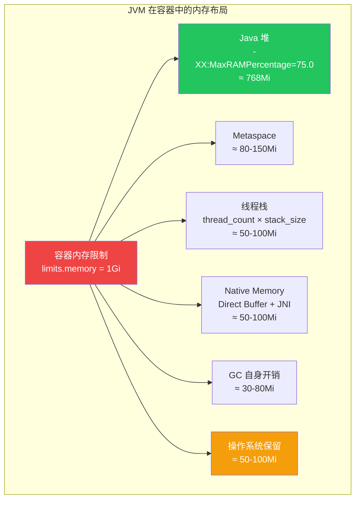

# JVM GC 容器调优深度指南

> **适用版本**: JDK 17+ / JDK 21+ (推荐) / JDK 24+ / [[Kubernetes|Kubernetes]] v1.28+
> **最后更新**: 2026-04-30

---

## 一、概述

JVM 在容器环境中运行面临独特的挑战：内存限制严格、CPU 核心数可能不固定、GC 行为与裸金属环境大不相同。错误配置的 JVM 在 Kubernetes 中最常见的结局就是 `OOMKilled`——这不仅仅是 Java 层面的 OOM，而是容器被内核直接杀掉。

本指南深入对比 G1GC、ZGC、Shenandoah 三款主流垃圾收集器在容器场景下的表现，提供精确的内存 sizing 公式、GC 监控方案以及常见 OOMKilled 场景的排查方法。



---

## 二、架构设计

### 2.1 容器内存模型

在容器中，JVM 看到的可用内存由 `cgroup` 限制决定，而非物理机内存。理解容器内存分配是 GC 调优的基础：

```
┌────────────────────────────────────────────────────────┐
│  容器内存限制 (limits.memory = 1Gi = 1024Mi)          │
│                                                        │
│  ┌──────────────────────────────────────────────────┐  │
│  │  Java 堆 (Heap)                                   │  │
│  │  MaxRAMPercentage=75.0 → ~768Mi                   │  │
│  │                                                    │  │
│  │  ┌─────────────┐  ┌──────────────────────────┐   │  │
│  │  │ Young Gen   │  │ Old Gen / Tenured        │   │  │
│  │  │ (Eden+S0+S1)│  │                          │   │  │
│  │  └─────────────┘  └──────────────────────────┘   │  │
│  └──────────────────────────────────────────────────┘  │
│                                                        │
│  ┌──────────────┐ ┌─────────┐ ┌───────────────────┐  │
│  │ Metaspace    │ │线程栈   │ │ Native/Direct Buf │  │
│  │ 80-150Mi     │ │50-100Mi │ │ 50-100Mi          │  │
│  └──────────────┘ └─────────┘ └───────────────────┘  │
│                                                        │
│  ┌──────────────┐ ┌─────────────────────────────────┐ │
│  │ GC 开销      │ │ OS 内核/页缓存保留              │ │
│  │ 30-80Mi      │ │ 50-100Mi                        │ │
│  └──────────────┘ └─────────────────────────────────┘ │
│                                                        │
│  ⚠️ 如果总使用超过 1024Mi → OOMKilled                  │
└────────────────────────────────────────────────────────┘
```

### 2.2 容器感知机制

JDK 10+ 引入了 `UseContainerSupport`（JDK 11+ 默认开启），JVM 通过读取 cgroup 文件自动感知容器资源限制：

```java
// JDK 源码级别理解: os::Linux::container_init()
// 读取路径:
//   /sys/fs/cgroup/memory/memory.limit_in_bytes     (cgroup v1)
//   /sys/fs/cgroup/memory.max                        (cgroup v2)
//   /sys/fs/cgroup/cpu/cpu.cfs_quota_us              (cgroup v1)
//   /sys/fs/cgroup/cpu.max                           (cgroup v2)
```

验证容器感知是否生效：

```bash
# 在容器内执行
java -XshowSettings:system -version

# 输出应包含:
# Operating System Metrics:
#     Provider: cgroupv1
#     Effective CPU Count: 2
#     CPU Quota: 100000/100000
#     Memory Limit: 1073741824 (1 GiB)
#     Memory Swap Limit: 2147483648 (2 GiB)

# 验证 JVM 看到的 CPU 核心数
java -XX:+PrintFlagsFinal -version | grep -i 'ActiveProcessor|UseContainer'
```

---

## 三、核心配置

### 3.1 G1GC — 通用场景首选

G1GC 是 JDK 9+ 的默认 GC，在容器环境中表现稳定，适合大多数 Spring Boot 应用：

```bash
JAVA_OPTS="-XX:+UseContainerSupport \
  -XX:MaxRAMPercentage=75.0 \
  -XX:InitialRAMPercentage=50.0 \
  -XX:+UseG1GC \
  -XX:MaxGCPauseMillis=200 \
  -XX:G1HeapRegionSize=4m \
  -XX:InitiatingHeapOccupancyPercent=45 \
  -XX:G1MixedGCCountTarget=8 \
  -XX:G1MixedGCLiveThresholdPercent=85 \
  -XX:G1ReservePercent=10 \
  -XX:ParallelGCThreads=2 \
  -XX:ConcGCThreads=1 \
  -XX:+UseStringDeduplication \
  -Xlog:gc*:stdout:time,uptime,level,tags"
```

G1GC 调优参数说明：

| 参数 | 默认值 | 推荐容器值 | 说明 |
|------|--------|-----------|------|
| `MaxGCPauseMillis` | 200ms | 100-200ms | G1 尽力达到的目标暂停时间 |
| `G1HeapRegionSize` | 自动计算 | 2m/4m/8m | 堆 < 2Gi 用 2m，2-8Gi 用 4m，> 8Gi 用 8m |
| `InitiatingHeapOccupancyPercent` | 45 | 35-45 | 触发并发标记的堆占用百分比 |
| `G1MixedGCCountTarget` | 8 | 4-16 | 混合 GC 轮次目标 |
| `G1MixedGCLiveThresholdPercent` | 85 | 80-90 | Region 存活对象比例阈值 |
| `ParallelGCThreads` | CPU数 | min(CPU_limit, 4) | STW 阶段并行线程数 |
| `ConcGCThreads` | ParallelGCThreads/4 | max(1, ParallelGCThreads/4) | 并发标记线程数 |

### 3.2 ZGC — 低延迟场景首选（JDK 17+）

ZGC 设计目标是将 GC 暂停控制在亚毫秒级（< 1ms），非常适合延迟敏感的服务：

```bash
# JDK 17/19: 非分代 ZGC
JAVA_OPTS="-XX:+UseContainerSupport \
  -XX:MaxRAMPercentage=70.0 \
  -XX:InitialRAMPercentage=50.0 \
  -XX:+UseZGC \
  -XX:ZCollectionInterval=0 \
  -XX:ZAllocationSpikeTolerance=2.0 \
  -XX:ZFragmentationLimit=5 \
  -XX:SoftMaxHeapSize=700m \
  -XX:ConcGCThreads=1 \
  -Xlog:gc*:stdout:time,uptime,level,tags"
```

```bash
# JDK 21+: 分代 ZGC (Generational ZGC) — 强烈推荐
JAVA_OPTS="-XX:+UseContainerSupport \
  -XX:MaxRAMPercentage=70.0 \
  -XX:InitialRAMPercentage=50.0 \
  -XX:+UseZGC \
  -XX:+ZGenerational \
  -XX:SoftMaxHeapSize=700m \
  -XX:ConcGCThreads=1 \
  -Xlog:gc*:stdout:time,uptime,level,tags"
```

> **重要**: ZGC 降低 `MaxRAMPercentage` 到 70%，因为 ZGC 需要更多 native 内存（彩色指针、多重映射），开销比 G1GC 大。

### 3.3 Shenandoah — 低延迟备选方案（JDK 17+）

Shenandoah 是 Red Hat 开发的低延迟 GC，与 ZGC 类似但实现不同：

```bash
JAVA_OPTS="-XX:+UseContainerSupport \
  -XX:MaxRAMPercentage=70.0 \
  -XX:InitialRAMPercentage=50.0 \
  -XX:+UseShenandoahGC \
  -XX:ShenandoahGCMode=generational \
  -XX:ShenandoahGCHeuristics=compact \
  -XX:ShenandoahMemoryPoolGranularity=2m \
  -XX:ConcGCThreads=1 \
  -XX:ParallelGCThreads=2 \
  -Xlog:gc*:stdout:time,uptime,level,tags"
```

> **注意**: Shenandoah 在某些 JDK 发行版中不可用（如 Oracle JDK）。使用 Eclipse Temurin 或 Red Hat build of OpenJDK。

### 3.4 GC 选型对比

```mermaid
graph LR
    START[选择 GC] --> Q1{暂停要求?}
    Q1 | "< 10ms" --> Q2{JDK 版本?}
    Q1 | "10-200ms" --> Q3{堆大小?}
    Q1 | "> 200ms 可接受" --> Q4{吞吐量优先?}
    
    Q2 | "≥ JDK 21" --> ZGC_GEN[Generational ZGC<br/>✅ 推荐]
    Q2 | "JDK 17-20" --> ZGC[ZGC<br/>非分代模式]
    
    Q3 | "< 4Gi" --> G1_SMALL[G1GC<br/>调优后可接受]
    Q3 | "≥ 4Gi" --> G1_LARGE[G1GC<br/>适当调大 Region]
    
    Q4 | "是" --> PARALLEL[ParallelGC<br/>批处理场景]
    Q4 | "否" --> G1_DEFAULT[G1GC<br/>默认选择]
    
    style ZGC_GEN fill:#22c55e,color:#fff
    style G1_DEFAULT fill:#3b82f6,color:#fff
```

**深度对比表**：

| 维度 | G1GC | ZGC (Generational) | Shenandoah |
|------|------|--------------------|------------|
| **暂停时间** | 50-200ms | < 1ms | < 10ms |
| **吞吐量影响** | < 5% | 5-15% | 5-10% |
| **堆推荐范围** | 512Mi - 16Gi | 512Mi - 8Ti | 512Mi - 4Ti |
| **内存开销** | 堆 × 1.05-1.10 | 堆 × 1.15-1.30 | 堆 × 1.10-1.20 |
| **调优难度** | 中等 | 低（几乎无需调优） | 低 |
| **成熟度** | 生产级（JDK 9+） | 生产级（JDK 21+ 分代） | 生产级（JDK 17+） |
| **最适合场景** | 通用服务 | 金融/交易/实时 | 低延迟通用 |
| **容器友好度** | 优秀 | 良好 | 良好 |
| **NUMA 感知** | 是 | 是 | 是 |
| **JDK 可用性** | 所有 JDK | JDK 15+ | 非Oracle JDK |

### 3.5 内存 Sizing 公式

#### 精确计算公式

```
容器内存限制 (limits.memory) 计算公式:

  limits.memory = Heap + Metaspace + ThreadStacks + NativeMemory + GcOverhead + OsReserve

  Heap           = (limits.memory) × MaxRAMPercentage
  Metaspace      = MaxMetaspaceSize (默认无限制，建议显式设置)
  ThreadStacks   = max(1, availableProcessors) × Xss × 1.5 (包含非 JVM 线程)
  NativeMemory   = DirectByteBuffer + JNI + CodeCache + Arena
  GcOverhead     = GC 算法自身的 native 内存开销
  OsReserve      = 50-100Mi (内核页缓存、socket buffer 等)

反推公式 (已知应用需求，求容器限制):

  ContainerLimit = HeapRequired / TargetRAMPercentage + MemoryPadding

  MemoryPadding (经验值):
    - G1GC:      Heap × 0.25 ~ 0.35
    - ZGC:       Heap × 0.35 ~ 0.50 (ZGC 额外开销较大)
    - Shenandoah: Heap × 0.30 ~ 0.40

  示例: 应用需要 768Mi 堆，使用 G1GC
    ContainerLimit = 768 / 0.75 + 768 × 0.30
                   = 1024 + 230 ≈ 1254Mi → 向上取整到 1280Mi 或 1.5Gi
```

#### 实际计算示例

```bash
# 场景: Spring Boot 应用，约 200 并发，使用 G1GC

# 1. 估算堆需求 (通过压测或监控获取)
#    堆使用峰值约 500Mi → 设置 MaxRAMPercentage=75.0
#    Heap = ContainerLimit × 0.75

# 2. 估算非堆内存
#    Metaspace: 100Mi (Spring Boot + 依赖较多)
#    ThreadStacks: 200 threads × 1Mi × 1.5 = 300Mi → 偏高，调小
#                 200 threads × 512k × 1.5 = 150Mi → 使用 -Xss512k
#    DirectBuffer: 64Mi
#    CodeCache: 80Mi (-XX:ReservedCodeCacheSize=80m)
#    GC Overhead: 50Mi (G1GC)
#    OS Reserve: 80Mi
#    Total Non-Heap: 100 + 150 + 64 + 80 + 50 + 80 = 524Mi

# 3. 计算容器限制
#    ContainerLimit = Heap + NonHeap = 500/0.75... 不对
#    ContainerLimit = Heap/0.75 + NonHeap_margin
#    简化: ContainerLimit = Heap / MaxRAMPercentage + NonHeap
#    但 NonHeap 也受 ContainerLimit 影响...

# 4. 实用方法 (迭代计算):
#    假设 ContainerLimit = 1Gi = 1024Mi
#    Heap = 1024 × 0.75 = 768Mi (足够覆盖 500Mi 峰值)
#    NonHeap = 1024 - 768 = 256Mi
#    需要的 NonHeap ≈ 524Mi → 不足!
#
#    假设 ContainerLimit = 1.5Gi = 1536Mi
#    Heap = 1536 × 0.75 = 1152Mi (远超需求)
#    降低 MaxRAMPercentage = 60.0
#    Heap = 1536 × 0.60 = 922Mi (足够)
#    NonHeap = 1536 - 922 = 614Mi (足够)
#    ✅ 最终: limits.memory=1536Mi, MaxRAMPercentage=60.0

# 5. 最终 JVM 参数
JAVA_OPTS="-XX:+UseContainerSupport \
  -XX:MaxRAMPercentage=60.0 \
  -XX:InitialRAMPercentage=40.0 \
  -XX:+UseG1GC \
  -XX:MaxGCPauseMillis=200 \
  -XX:MaxMetaspaceSize=150m \
  -XX:ReservedCodeCacheSize=80m \
  -Xss512k \
  -XX:MaxDirectMemorySize=64m"
```

### 3.6 GC 日志在容器中的配置

```bash
# JDK 17+ 统一日志框架 (JEP 158 / JEP 271)
GC_LOG_OPTS="-Xlog:gc*=info:stdout:time,uptime,level,tags"

# 生产环境推荐 — 写到 stdout 被 [[fluentd|Fluentd]]/Filebeat 采集
GC_LOG_OPTS="-Xlog:gc*:stdout:time,uptime,level,tags \
  -Xlog:gc+heap=debug:stdout:time,uptime \
  -Xlog:gc+phases=debug:stdout:time,uptime"

# 如果需要输出到文件 (用于事后分析)
GC_LOG_OPTS="-Xlog:gc*:file=/app/logs/gc.log:time,uptime,level,tags:filecount=5,filesize=20m"

# 完整生产配置
JAVA_OPTS="-XX:+UseContainerSupport \
  -XX:MaxRAMPercentage=75.0 \
  -XX:InitialRAMPercentage=50.0 \
  -XX:+UseG1GC \
  -XX:MaxGCPauseMillis=200 \
  -Xlog:gc*:stdout:time,uptime,level,tags \
  -XX:+HeapDumpOnOutOfMemoryError \
  -XX:HeapDumpPath=/app/logs/heapdump.hprof \
  -XX:ErrorFile=/app/logs/hs_err_pid%p.log"
```

---

## 四、最佳实践

### 4.1 [[Prometheus|Prometheus]] JMX Exporter 监控 GC

#### 方式一：Java Agent 注入（推荐）

```yaml
# ConfigMap: jmx-exporter-config
apiVersion: v1
kind: ConfigMap
metadata:
  name: jmx-exporter-config
  namespace: production
data:
  config.yml: |
    lowercaseOutputName: true
    lowercaseOutputLabelNames: true
    rules:
      - pattern: "java.lang<type=Memory><>(HeapMemoryUsage|NonHeapMemoryUsage)"
        name: jvm_memory_$1
        labels:
          area: $1
        attrNameSnakeCase: true
        type: GAUGE
      
      - pattern: "java.lang<type=GarbageCollector, name=(.*)><>CollectionTime"
        name: jvm_gc_collection_time_seconds
        labels:
          gc: $1
        value: $1
        type: COUNTER
      
      - pattern: "java.lang<type=GarbageCollector, name=(.*)><>CollectionCount"
        name: jvm_gc_collection_count
        labels:
          gc: $1
        type: COUNTER
      
      - pattern: "java.lang<type=MemoryPool, name=(.*)><(Usage|PeakUsage)>(used|committed|max)"
        name: jvm_memory_pool_$3
        labels:
          pool: $1
          type: $2
        type: GAUGE

      - pattern: "java.lang<type=Threading><>(ThreadCount|PeakThreadCount|DaemonThreadCount|TotalStartedThreadCount)"
        name: jvm_threads_$1
        type: GAUGE

      - pattern: "java.lang<type=ClassLoading><>(LoadedClassCount|TotalLoadedClassCount|UnloadedClassCount)"
        name: jvm_classloading_$1
        type: GAUGE

      - pattern: "java.lang<type=OperatingSystem><>(AvailableProcessors|SystemLoadAverage|ProcessCpuLoad|SystemCpuLoad)"
        name: jvm_os_$1
        type: GAUGE

      - pattern: "java.nio<type=BufferPool, name=(.*)><>(Count|MemoryUsed|TotalCapacity)"
        name: jvm_buffer_pool_$2
        labels:
          pool: $1
        type: GAUGE
```

Deployment 中使用 initContainer 注入 JMX Exporter：

```yaml
spec:
  initContainers:
    - name: copy-jmx-exporter
      image: bitnami/jmx-exporter:1.0.1
      command: ["cp", "/opt/bitnami/jmx-exporter/jmx_prometheus_javaagent.jar", /shared/jmx_exporter.jar]
      volumeMounts:
        - name: shared
          mountPath: /shared
  containers:
    - name: myapp
      env:
        - name: JAVA_OPTS
          value: >-
            -XX:+UseContainerSupport
            -XX:MaxRAMPercentage=75.0
            -XX:+UseG1GC
            -javaagent:/shared/jmx_exporter.jar=9404:/config/jmx-config.yml
      volumeMounts:
        - name: shared
          mountPath: /shared
        - name: jmx-config
          mountPath: /config/jmx-config.yml
          subPath: config.yml
      ports:
        - name: jmx-metrics
          containerPort: 9404
  volumes:
    - name: shared
      emptyDir: {}
    - name: jmx-config
      configMap:
        name: jmx-exporter-config
```

#### 方式二：Micrometer 直接暴露（推荐 Spring Boot 应用）

```yaml
management:
  endpoints:
    web:
      exposure:
        include: prometheus,metrics,health
  metrics:
    export:
      prometheus:
        enabled: true
    tags:
      application: ${spring.application.name}
    distribution:
      percentiles-histogram:
        http.server.requests: true
      slo:
        http.server.requests: 50ms,100ms,200ms,500ms,1s
```

### 4.2 Grafana JVM Dashboard 关键指标

```yaml
# Prometheus 告警规则
groups:
  - name: jvm-gc-alerts
    rules:
      - alert: JVMGCPauseTooLong
        expr: |
          rate(jvm_gc_pause_seconds_sum[5m]) / rate(jvm_gc_pause_seconds_count[5m]) > 0.5
        for: 5m
        labels:
          severity: warning
        annotations:
          summary: "JVM GC 平均暂停时间过长 ({{ $value }}s)"
          description: "Pod {{ $labels.pod }} 的 GC 平均暂停时间超过 500ms"
      
      - alert: JVMGCFrequentYoungGC
        expr: |
          rate(jvm_gc_pause_seconds_count{action="end of minor GC"}[5m]) > 10
        for: 10m
        labels:
          severity: warning
        annotations:
          summary: "Young GC 频率过高"
          description: "Pod {{ $labels.pod }} 每秒触发 {{ $value }} 次 Young GC"
      
      - alert: JVMMemoryNearLimit
        expr: |
          jvm_memory_used_bytes{area="heap"} / jvm_memory_max_bytes{area="heap"} > 0.9
        for: 5m
        labels:
          severity: critical
        annotations:
          summary: "JVM 堆内存使用率超过 90%"
          description: "Pod {{ $labels.pod }} 堆使用率 {{ $value | humanizePercentage }}"

      - alert: JVMHighGCRate
        expr: |
          (rate(jvm_gc_pause_seconds_sum[5m])) / (rate(jvm_gc_pause_seconds_count[5m]) > 0) > 0.2
        for: 10m
        labels:
          severity: warning
        annotations:
          summary: "GC 占用 CPU 时间超过 20%"
```

### 4.3 不同场景的 GC 配置模板

#### 微服务 API（通用）

```bash
JAVA_OPTS="-XX:+UseContainerSupport \
  -XX:MaxRAMPercentage=75.0 \
  -XX:InitialRAMPercentage=50.0 \
  -XX:+UseG1GC \
  -XX:MaxGCPauseMillis=200 \
  -XX:ParallelGCThreads=2 \
  -XX:ConcGCThreads=1 \
  -XX:+UseStringDeduplication"
# 容器配置: requests.memory=768Mi, limits.memory=1Gi
```

#### 金融交易（极低延迟）

```bash
JAVA_OPTS="-XX:+UseContainerSupport \
  -XX:MaxRAMPercentage=65.0 \
  -XX:InitialRAMPercentage=40.0 \
  -XX:+UseZGC \
  -XX:+ZGenerational \
  -XX:SoftMaxHeapSize=650m \
  -XX:ConcGCThreads=1"
# 容器配置: requests.memory=1Gi, limits.memory=1.5Gi
```

#### 数据处理（高吞吐）

```bash
JAVA_OPTS="-XX:+UseContainerSupport \
  -XX:MaxRAMPercentage=80.0 \
  -XX:InitialRAMPercentage=60.0 \
  -XX:+UseG1GC \
  -XX:MaxGCPauseMillis=500 \
  -XX:G1HeapRegionSize=8m \
  -XX:InitiatingHeapOccupancyPercent=40 \
  -XX:ParallelGCThreads=4 \
  -XX:ConcGCThreads=2"
# 容器配置: requests.memory=2Gi, limits.memory=4Gi
```

---

## 五、故障排查

### 5.1 OOMKilled 场景全面排查

#### 场景一：堆内存超过容器限制

> ⚠️ **🟡 中危变更** — 变更集群资源状态，建议先 --dry-run 或 diff 确认
> - `kubectl exec`：进入容器执行命令，可能改变容器状态

```
症状: Pod 状态为 OOMKilled, lastState.terminated.reason = "OOMKilled"
原因: JVM 堆 + 非堆内存总和超过 limits.memory

排查步骤:
1. kubectl describe pod <pod> | grep -A5 "Last State"
   → 确认 OOMKilled 和退出码 137

2. 检查当前 JVM 内存配置
   kubectl exec <pod> -- jcmd 1 VM.flags | grep -i 'RAM|Heap|Meta'

3. 计算: Heap × MaxRAMPercentage 是否合理
   例: limits=1Gi, MaxRAMPercentage=75.0
       Heap = 1024 × 0.75 = 768Mi
       Non-Heap 需要约 256Mi → 总计 1024Mi
       但 OS 还需要 50-100Mi → 超出!

4. 解决方案:
   a. 降低 MaxRAMPercentage 到 65-70%
   b. 增大 limits.memory
   c. 限制非堆内存: -XX:MaxMetaspaceSize=128m -XX:MaxDirectMemorySize=64m
```

#### 场景二：Metaspace 泄漏

> ⚠️ **🟡 中危变更** — 变更集群资源状态，建议先 --dry-run 或 diff 确认
> - `kubectl exec`：进入容器执行命令，可能改变容器状态

```
症状: 容器内存持续增长，最终 OOMKilled
原因: Metaspace 无上限（默认无限制），类加载器泄漏

排查步骤:
1. 监控 Metaspace 使用趋势
   kubectl exec <pod> -- jcmd 1 GC.info | grep -i meta

2. 检查类加载数量
   kubectl exec <pod> -- jcmd 1 VM.classloader_stats

3. 生成堆直方图
   kubectl exec <pod> -- jcmd 1 GC.class_histogram | head -30

4. 解决方案:
   a. 设置 -XX:MaxMetaspaceSize=256m
   b. 排查动态代理/反射导致的类泄漏
   c. 检查 Spring Boot DevTools 是否在生产环境禁用
```

#### 场景三：Direct Buffer 泄漏

> ⚠️ **🟡 中危变更** — 变更集群资源状态，建议先 --dry-run 或 diff 确认
> - `kubectl exec`：进入容器执行命令，可能改变容器状态

```
症状: Native 内存持续增长，Heap 使用正常
原因: NIO DirectByteBuffer 未释放

排查步骤:
1. 查看 NIO Buffer 池指标
   kubectl exec <pod> -- jcmd 1 VM.native_memory summary

2. 检查 JMX 指标
   java.nio:type=BufferPool,name=direct → MemoryUsed

3. 解决方案:
   a. 设置 -XX:MaxDirectMemorySize=128m
   b. 排查 Netty / NIO 使用是否正确释放 buffer
   c. 添加 -Dio.netty.leakDetection.level=PARANOID（开发环境）
```

### 5.2 GC 问题诊断表

| 症状 | 可能原因 | 诊断方法 | 解决方案 |
|------|---------|---------|---------|
| Young GC 频率过高 | 堆太小或分配速率过高 | 查看 GC 日志中 Young GC 间隔 | 增大堆或优化对象分配 |
| Full GC 频繁触发 | Metaspace 不足/老年代满 | `jcmd 1 GC.heap_info` | 增大 MaxMetaspaceSize 或堆 |
| GC 暂停 > 1s | G1 Full GC / 堆太大 | 查看 GC 日志 pause time | 切换 ZGC 或减小堆 |
| 内存持续增长 | 内存泄漏 | `jcmd 1 GC.heap_dump` 后用 MAT 分析 | 修复泄漏代码 |
| CPU 100% | GC 线程占用 | `top -H -p <pid>` | 检查 GC 日志是否频繁 Full GC |
| Prometheus 指标缺失 | JMX Exporter 未配置 | `curl pod:9404/metrics` | 检查 agent 配置 |
| GC 日志为空 | 日志配置错误 | `kubectl logs <pod> | grep GC` | 检查 -Xlog 参数 |
| 容器被 SIGKILL | 超过 memory limit | `dmesg | grep oom` | 增大 limit 或降低 MaxRAMPercentage |

### 5.3 GC 日志分析实战

```bash
# G1GC 日志关键信息提取
# 示例日志行:
# [2026-04-30T10:15:32.456+0800][info ][gc,start    ] GC(42) Pause Young (Normal) (G1 Evacuation Pause)
# [2026-04-30T10:15:32.512+0800][info ][gc          ] GC(42) Pause Young (Normal) (G1 Evacuation Pause) 256M->128M(768M) 56.234ms

# 提取 GC 暂停时间
kubectl logs <pod> | grep "Pause.*[0-9]*ms$" | \
  awk '{match($0, /[0-9]+\.[0-9]+ms/, arr); print arr[0]}'

# 统计 GC 频率（每小时）
kubectl logs <pod> --since=1h | grep -c "Pause Young"

# 提取 Full GC
kubectl logs <pod> | grep "Pause Full"

# 计算总 GC 时间占比
TOTAL_GC_TIME=$(kubectl logs <pod> --since=1h | grep -oP '\d+\.\d+ms' | \
  awk '{sum += $1} END {print sum}')
echo "Total GC time in last hour: ${TOTAL_GC_TIME}ms"

# 生成 GC 报告（需要 GC 日志文件）
# 使用 GCEasy.io 或 JClarity Censum 分析
```

### 5.4 Native Memory Tracking

> ⚠️ **🟡 中危变更** — 变更集群资源状态，建议先 --dry-run 或 diff 确认
> - `kubectl exec`：进入容器执行命令，可能改变容器状态

```bash
# 启用 NMT（注意有 5-10% 性能开销）
JAVA_OPTS="-XX:NativeMemoryTracking=summary ..."

# 查看内存分布
kubectl exec <pod> -- jcmd 1 VM.native_memory summary

# 输出示例:
# Total: reserved=2048MiB, committed=1024MiB
# -                 Java Heap (reserved=768MiB, committed=768MiB)
# -                     Class (reserved=1080MiB, committed=120MiB)
# -                    Thread (reserved=256MiB, committed=256MiB)
# -                      Code (reserved=245MiB, committed=45MiB)
# -                        GC (reserved=128MiB, committed=32MiB)
# -                  Internal (reserved=64MiB, committed=64MiB)
# -                    Symbol (reserved=20MiB, committed=20MiB)

# 比较两个时间点的内存差异
kubectl exec <pod> -- jcmd 1 VM.native_memory baseline
# ... 等待一段时间 ...
kubectl exec <pod> -- jcmd 1 VM.native_memory summary.diff
```

---

## 六、参考资源

- [JEP 346: Promptly Return Unused Committed Memory from G1](https://openjdk.org/jeps/346)
- [JEP 333: ZGC: A Scalable Low-Latency Garbage Collector](https://openjdk.org/jeps/333)
- [JEP 404: Generational ZGC (JDK 21)](https://openjdk.org/jeps/404)
- [Shenandoah GC Wiki](https://wiki.openjdk.org/display/shenandoah)
- [JMX Exporter GitHub](https://github.com/prometheus/jmx_exporter)
- [GCEasy GC Log Analyzer](https://gceasy.io/)
- [JDK Mission Control](https://www.oracle.com/java/technologies/jdk-mission-control.html)
- [Container Awareness in JDK](https://openjdk.org/jeps/387)
