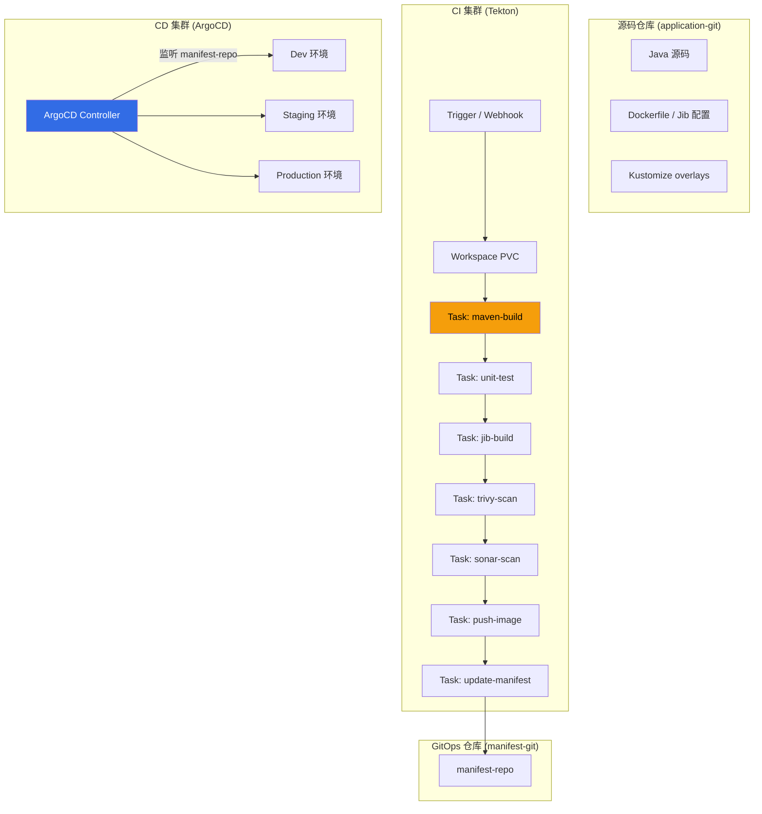

# Java CI/CD on [[Kubernetes|Kubernetes]]: Tekton + [[ArgoCD|ArgoCD]] 实践指南

> **适用版本**: Tekton Pipelines v0.60+ / ArgoCD v2.12+ / JDK 17+ / Kubernetes v1.28+
> **最后更新**: 2026-04-30

---

## 一、概述

在 Kubernetes 上为 Java 应用构建 CI/CD 流水线，需要解决一系列特定挑战：Maven/Gradle 依赖缓存管理、容器镜像构建优化、安全扫描集成、质量门禁、多架构构建以及 GitOps 部署策略。Tekton 提供声明式的流水线能力，ArgoCD 实现 GitOps 持续交付，两者结合为 Java 应用提供完整的云原生 CI/CD 方案。

本指南覆盖从代码提交到生产部署的完整流水线，包括 Tekton Task/Pipeline 定义、Jib 容器构建、[[Trivy|Trivy]] 安全扫描、SonarQube 质量门禁、ArgoCD GitOps 部署以及 Canary/Blue-Green 发布策略。

```mermaid
graph LR
    subgraph "CI: Tekton Pipeline"
        GIT[Git Trigger] --> BUILD[Maven/Gradle 构建]
        BUILD --> TEST[单元测试]
        TEST --> IMAGE[Jib 镜像构建]
        IMAGE --> SCAN[Trivy 安全扫描]
        SCAN --> QUALITY[SonarQube 质量门禁]
        QUALITY --> PUSH[推送镜像]
        PUSH --> MANIFEST[更新 Kustomize/Helm]
        MANIFEST --> GITOPS[推送到 GitOps 仓库]
    end

    subgraph "CD: ArgoCD GitOps"
        GITOPS --> SYNC[ArgoCD 检测变更]
        SYNC --> DEPLOY[部署到目标集群]
        DEPLOY --> STRATEGY[Canary / Blue-Green]
        STRATEGY --> VERIFY[健康验证]
        VERIFY --> PROD[生产就绪]
    end

    style GIT fill:#f59e0b,color:#fff
    style PROD fill:#22c55e,color:#fff
    style SYNC fill:#326ce5,color:#fff
```



---

## 二、架构设计

### 2.1 流水线整体架构



---

## 三、核心配置

### 3.1 Tekton 基础资源定义

#### Workspace 和 PVC

```yaml
apiVersion: v1
kind: PersistentVolumeClaim
metadata:
  name: java-pipeline-workspace
  namespace: ci-cd
spec:
  accessModes:
    - ReadWriteOnce
  resources:
    requests:
      storage: 10Gi
  storageClassName: standard
---
apiVersion: v1
kind: PersistentVolumeClaim
metadata:
  name: maven-local-repo
  namespace: ci-cd
spec:
  accessModes:
    - ReadWriteOnce
  resources:
    requests:
      storage: 20Gi
  storageClassName: standard
```

#### Maven Settings ConfigMap

```yaml
apiVersion: v1
kind: ConfigMap
metadata:
  name: maven-settings
  namespace: ci-cd
data:
  settings.xml: |
    <?xml version="1.0" encoding="UTF-8"?>
    <settings>
      <localRepository>/workspace/m2-repository</localRepository>
      <mirrors>
        <mirror>
          <id>aliyun</id>
          <mirrorOf>central</mirrorOf>
          <name>Aliyun Maven</name>
          <url>https://maven.aliyun.com/repository/central</url>
        </mirror>
      </mirrors>
      <profiles>
        <profile>
          <id>ci</id>
          <properties>
            <maven.test.failure.ignore>false</maven.test.failure.ignore>
            <skipITs>true</skipITs>
          </properties>
        </profile>
      </profiles>
      <activeProfiles>
        <activeProfile>ci</activeProfile>
      </activeProfiles>
    </settings>
```

### 3.2 Tekton Task 定义

#### Task: Maven 构建 + 测试

```yaml
apiVersion: tekton.dev/v1
kind: Task
metadata:
  name: maven-build
  namespace: ci-cd
spec:
  description: "使用 Maven 构建和测试 Java 项目"
  workspaces:
    - name: source
      description: 源代码工作区
    - name: maven-settings
      description: Maven settings.xml
    - name: maven-repo
      description: Maven 本地仓库缓存
  params:
    - name: GOALS
      description: Maven 目标
      default: "clean package"
      type: string
    - name: MAVEN_IMAGE
      description: Maven 镜像
      default: "maven:3.9-eclipse-temurin-21"
      type: string
    - name: CONTEXT_DIR
      description: 构建上下文目录
      default: "."
      type: string
    - name: JVM_OPTS
      description: JVM 参数
      default: "-XX:+UseContainerSupport -XX:MaxRAMPercentage=75.0"
      type: string
  results:
    - name: IMAGE_DIGEST
      description: 构建产物摘要
    - name: ARTIFACT_PATH
      description: JAR 文件路径
  steps:
    - name: build
      image: $(params.MAVEN_IMAGE)
      workingDir: $(workspaces.source.path)/$(params.CONTEXT_DIR)
      env:
        - name: MAVEN_OPTS
          value: "$(params.JVM_OPTS) -Dmaven.repo.local=$(workspaces.maven-repo.path)"
      script: |
        #!/bin/bash
        set -e
        cp $(workspaces.maven-settings.path)/settings.xml /tmp/settings.xml
        mvn -s /tmp/settings.xml $(params.GOALS) \
          -Dmaven.test.failure.ignore=false \
          -DskipITs=true \
          -B -V

        # 查找构建产物
        ARTIFACT=$(find target -name "*.jar" ! -name "*-sources.jar" ! -name "*-javadoc.jar" | head -1)
        if [ -z "$ARTIFACT" ]; then
          echo "Error: No JAR artifact found"
          exit 1
        fi
        echo -n "$ARTIFACT" > $(results.ARTIFACT_PATH.path)
        echo "Built artifact: $ARTIFACT"
      resources:
        requests:
          memory: "1Gi"
          cpu: "500m"
        limits:
          memory: "2Gi"
          cpu: "2000m"
```

#### Task: Jib 容器镜像构建

```yaml
apiVersion: tekton.dev/v1
kind: Task
metadata:
  name: jib-build
  namespace: ci-cd
spec:
  description: "使用 Jib 构建容器镜像（无需 [[entities/docker.md|docker]] daemon）"
  workspaces:
    - name: source
  params:
    - name: IMAGE
      description: 目标镜像地址
      type: string
    - name: VERSION
      description: 镜像版本标签
      type: string
    - name: CONTEXT_DIR
      default: "."
    - name: MAVEN_IMAGE
      default: "maven:3.9-eclipse-temurin-21"
    - name: REGISTRY_SERVER
      default: "registry.example.com"
  results:
    - name: IMAGE_DIGEST
      description: 镜像 digest
    - name: IMAGE_URL
      description: 完整镜像 URL
  steps:
    - name: build-and-push
      image: $(params.MAVEN_IMAGE)
      workingDir: $(workspaces.source.path)/$(params.CONTEXT_DIR)
      env:
        - name: DOCKER_CONFIG
          value: /tekton/home/.docker
      script: |
        #!/bin/bash
        set -e
        IMAGE_URL="$(params.IMAGE):$(params.VERSION)"
        echo "Building image: ${IMAGE_URL}"

        mvn compile com.google.cloud.tools:jib-maven-plugin:3.4.4:build \
          -Djib.to.image=${IMAGE_URL} \
          -Djib.to.tags=$(params.VERSION),latest \
          -Djib.httpTimeout=300000 \
          -B

        # 获取镜像 digest
        DIGEST=$(mvn help:evaluate \
          -Dexpression=jib.to.image \
          -q -DforceStdout 2>/dev/null || echo "unknown")

        echo -n "${DIGEST}" > $(results.IMAGE_DIGEST.path)
        echo -n "${IMAGE_URL}" > $(results.IMAGE_URL.path)
        echo "Image pushed: ${IMAGE_URL}"
      resources:
        requests:
          memory: "1Gi"
          cpu: "500m"
        limits:
          memory: "2Gi"
          cpu: "2000m"
```

#### Task: Trivy 安全扫描

```yaml
apiVersion: tekton.dev/v1
kind: Task
metadata:
  name: trivy-scan
  namespace: ci-cd
spec:
  description: "使用 Trivy 扫描容器镜像安全漏洞"
  params:
    - name: IMAGE_URL
      description: 镜像 URL
      type: string
    - name: SEVERITY
      description: 漏洞严重级别
      default: "CRITICAL,HIGH"
    - name: EXIT_CODE
      description: 发现漏洞时是否失败
      default: "1"
  results:
    - name: SCAN_RESULT
      description: 扫描结果摘要
  steps:
    - name: scan
      image: aquasec/trivy:0.58.0
      script: |
        #!/bin/sh
        set -e
        trivy image --severity $(params.SEVERITY) \
          --exit-code $(params.EXIT_CODE) \
          --format table \
          --no-progress \
          --ignore-unfixed \
          "$(params.IMAGE_URL)"

        echo "Scan passed for $(params.IMAGE_URL)"
        echo -n "PASSED" > $(results.SCAN_RESULT.path)
      resources:
        requests:
          memory: "512Mi"
          cpu: "250m"
        limits:
          memory: "1Gi"
          cpu: "1000m"
```

#### Task: SonarQube 质量门禁

```yaml
apiVersion: tekton.dev/v1
kind: Task
metadata:
  name: sonar-quality-gate
  namespace: ci-cd
spec:
  description: "SonarQube 代码质量扫描与门禁检查"
  workspaces:
    - name: source
  params:
    - name: SONAR_PROJECT_KEY
      type: string
    - name: SONAR_URL
      default: "http://sonarqube.ci-cd:9000"
    - name: MAVEN_IMAGE
      default: "maven:3.9-eclipse-temurin-21"
    - name: CONTEXT_DIR
      default: "."
  results:
    - name: QUALITY_GATE_STATUS
  steps:
    - name: sonar-scan
      image: $(params.MAVEN_IMAGE)
      workingDir: $(workspaces.source.path)/$(params.CONTEXT_DIR)
      script: |
        #!/bin/bash
        set -e
        mvn sonar:sonar \
          -Dsonar.host.url=$(params.SONAR_URL) \
          -Dsonar.projectKey=$(params.SONAR_PROJECT_KEY) \
          -B -DskipTests

        # 等待质量门禁结果
        sleep 10

        # 查询质量门禁状态
        STATUS=$(curl -s "$(params.SONAR_URL)/api/qualitygates/project_status?projectKey=$(params.SONAR_PROJECT_KEY)" \
          | python3 -c "import sys,json; print(json.load(sys.stdin)['projectStatus']['status'])")

        echo "Quality Gate: ${STATUS}"
        echo -n "${STATUS}" > $(results.QUALITY_GATE_STATUS.path)

        if [ "${STATUS}" != "OK" ] && [ "${STATUS}" != "NONE" ]; then
          echo "Quality gate failed!"
          exit 1
        fi
```

#### Task: 更新 GitOps Manifest

```yaml
apiVersion: tekton.dev/v1
kind: Task
metadata:
  name: update-manifest
  namespace: ci-cd
spec:
  description: "更新 GitOps 仓库中的镜像版本"
  workspaces:
    - name: source
  params:
    - name: GITOPS_REPO
      type: string
    - name: GITOPS_BRANCH
      default: "main"
    - name: IMAGE_URL
      type: string
    - name: IMAGE_DIGEST
      type: string
    - name: APP_NAME
      type: string
    - name: ENVIRONMENT
      default: "staging"
    - name: GIT_USER
      default: "tekton-bot"
    - name: GIT_EMAIL
      default: "tekton-bot@example.com"
  steps:
    - name: update
      image: alpine/git:v2.36.3
      script: |
        #!/bin/sh
        set -e
        git config --global user.name "$(params.GIT_USER)"
        git config --global user.email "$(params.GIT_EMAIL)"

        git clone --branch $(params.GITOPS_BRANCH) --depth 1 \
          "$(params.GITOPS_REPO)" /tmp/gitops

        cd /tmp/gitops
        OVERLAY_DIR="apps/$(params.APP_NAME)/overlays/$(params.ENVIRONMENT)"

        # 使用 kustomize edit 更新镜像
        if command -v kustomize > /dev/null 2>&1; then
          cd "$OVERLAY_DIR"
          kustomize edit set image \
            "$(params.APP_NAME)=$(params.IMAGE_URL)"
        else
          # 直接使用 sed 替换
          sed -i "s|image:.*$(params.APP_NAME).*|image: $(params.IMAGE_URL)|g" \
            "$OVERLAY_DIR/deployment.yaml"
        fi

        git add .
        git commit -m "chore($(params.APP_NAME)): update image to $(params.IMAGE_URL)"
        git push origin $(params.GITOPS_BRANCH)
```

### 3.3 Tekton Pipeline 组装

```yaml
apiVersion: tekton.dev/v1
kind: Pipeline
metadata:
  name: java-ci-pipeline
  namespace: ci-cd
spec:
  description: "Java 应用 CI 流水线: 构建 -> 测试 -> 镜像 -> 扫描 -> 质量门禁 -> 部署"
  workspaces:
    - name: shared-workspace
    - name: maven-settings
    - name: maven-repo
  params:
    - name: GIT_REPO
      type: string
    - name: GIT_REVISION
      default: "main"
    - name: APP_NAME
      type: string
    - name: IMAGE
      type: string
    - name: VERSION
      type: string
    - name: CONTEXT_DIR
      default: "."
    - name: SONAR_PROJECT_KEY
      type: string
    - name: GITOPS_REPO
      type: string
    - name: DEPLOY_ENV
      default: "staging"
  results:
    - name: IMAGE_URL
      value: $(tasks.jib-build.results.IMAGE_URL)
    - name: IMAGE_DIGEST
      value: $(tasks.jib-build.results.IMAGE_DIGEST)

  tasks:
    - name: fetch-source
      taskRef:
        name: git-clone
        kind: ClusterTask
      workspaces:
        - name: output
          workspace: shared-workspace
      params:
        - name: url
          value: $(params.GIT_REPO)
        - name: revision
          value: $(params.GIT_REVISION)

    - name: maven-build
      runAfter: ["fetch-source"]
      taskRef:
        name: maven-build
      workspaces:
        - name: source
          workspace: shared-workspace
        - name: maven-settings
          workspace: maven-settings
        - name: maven-repo
          workspace: maven-repo
      params:
        - name: CONTEXT_DIR
          value: $(params.CONTEXT_DIR)

    - name: sonar-scan
      runAfter: ["maven-build"]
      taskRef:
        name: sonar-quality-gate
      workspaces:
        - name: source
          workspace: shared-workspace
      params:
        - name: SONAR_PROJECT_KEY
          value: $(params.SONAR_PROJECT_KEY)
        - name: CONTEXT_DIR
          value: $(params.CONTEXT_DIR)

    - name: jib-build
      runAfter: ["sonar-scan"]
      taskRef:
        name: jib-build
      workspaces:
        - name: source
          workspace: shared-workspace
      params:
        - name: IMAGE
          value: $(params.IMAGE)
        - name: VERSION
          value: $(params.VERSION)
        - name: CONTEXT_DIR
          value: $(params.CONTEXT_DIR)

    - name: trivy-scan
      runAfter: ["jib-build"]
      taskRef:
        name: trivy-scan
      params:
        - name: IMAGE_URL
          value: $(tasks.jib-build.results.IMAGE_URL)

    - name: update-manifest
      runAfter: ["trivy-scan"]
      taskRef:
        name: update-manifest
      workspaces:
        - name: source
          workspace: shared-workspace
      params:
        - name: GITOPS_REPO
          value: $(params.GITOPS_REPO)
        - name: IMAGE_URL
          value: $(tasks.jib-build.results.IMAGE_URL)
        - name: IMAGE_DIGEST
          value: $(tasks.jib-build.results.IMAGE_DIGEST)
        - name: APP_NAME
          value: $(params.APP_NAME)
        - name: ENVIRONMENT
          value: $(params.DEPLOY_ENV)
```

### 3.4 PipelineRun 触发

```yaml
apiVersion: tekton.dev/v1
kind: PipelineRun
metadata:
  name: java-ci-run-$(uid)
  namespace: ci-cd
spec:
  pipelineRef:
    name: java-ci-pipeline
  workspaces:
    - name: shared-workspace
      volumeClaimTemplate:
        spec:
          accessModes:
            - ReadWriteOnce
          resources:
            requests:
              storage: 5Gi
    - name: maven-settings
      configMap:
        name: maven-settings
    - name: maven-repo
      persistentVolumeClaim:
        claimName: maven-local-repo
  params:
    - name: GIT_REPO
      value: "https://github.com/example/myapp.git"
    - name: GIT_REVISION
      value: "main"
    - name: APP_NAME
      value: "myapp"
    - name: IMAGE
      value: "registry.example.com/myapp"
    - name: VERSION
      value: "1.0.0-$(uid)"
    - name: SONAR_PROJECT_KEY
      value: "com.example:myapp"
    - name: GITOPS_REPO
      value: "https://github.com/example/gitops-manifests.git"
    - name: DEPLOY_ENV
      value: "staging"
```

### 3.5 ArgoCD Application 定义

#### Staging 环境

```yaml
apiVersion: argoproj.io/v1alpha1
kind: Application
metadata:
  name: myapp-staging
  namespace: argocd
  labels:
    app: myapp
    env: staging
  annotations:
    notifications.argoproj.io/subscribe.on-deployed.slack: staging-channel
  finalizers:
    - resources-finalizer.argocd.argoproj.io
spec:
  project: default
  source:
    repoURL: https://github.com/example/gitops-manifests.git
    targetRevision: main
    path: apps/myapp/overlays/staging
  destination:
    server: https://kubernetes.default.svc
    namespace: staging
  syncPolicy:
    automated:
      prune: true
      selfHeal: true
      allowEmpty: false
    syncOptions:
      - CreateNamespace=true
      - PrunePropagationPolicy=foreground
      - PruneLast=true
    retry:
      limit: 3
      backoff:
        duration: 5s
        factor: 2
        maxDuration: 3m
```

#### Production 环境（手动审批）

```yaml
apiVersion: argoproj.io/v1alpha1
kind: Application
metadata:
  name: myapp-production
  namespace: argocd
  labels:
    app: myapp
    env: production
  finalizers:
    - resources-finalizer.argocd.argoproj.io
spec:
  project: production
  source:
    repoURL: https://github.com/example/gitops-manifests.git
    targetRevision: main
    path: apps/myapp/overlays/production
  destination:
    server: https://kubernetes.default.svc
    namespace: production
  syncPolicy:
    syncOptions:
      - CreateNamespace=true
      - PrunePropagationPolicy=foreground
```

---

## 四、最佳实践

### 4.1 Canary 发布策略 (Argo Rollouts)

```yaml
apiVersion: argoproj.io/v1alpha1
kind: Rollout
metadata:
  name: myapp
  namespace: production
spec:
  replicas: 10
  strategy:
    canary:
      canaryService: myapp-canary
      stableService: myapp-stable
      trafficRouting:
        istio:
          virtualServices:
            - name: myapp-vsvc
              routes:
                - primary
      steps:
        - setWeight: 5
        - pause: {duration: 5m}
        - setWeight: 10
        - pause: {duration: 5m}
        - analysis:
            templates:
              - templateName: success-rate
                clusterScope: false
        - setWeight: 30
        - pause: {duration: 10m}
        - analysis:
            templates:
              - templateName: error-rate
                clusterScope: false
        - setWeight: 50
        - pause: {duration: 10m}
        - setWeight: 80
        - pause: {duration: 5m}
        - setWeight: 100
      rollbackWindow:
        revisions: 3
      abortScaleDownDelaySeconds: 30
  revisionHistoryLimit: 3
  selector:
    matchLabels:
      app: myapp
  template:
    metadata:
      labels:
        app: myapp
    spec:
      containers:
        - name: myapp
          image: registry.example.com/myapp:latest
          ports:
            - containerPort: 8080
          resources:
            requests:
              memory: "768Mi"
              cpu: "250m"
            limits:
              memory: "1Gi"
              cpu: "1000m"
          livenessProbe:
            httpGet:
              path: /actuator/health/liveness
              port: 8081
            periodSeconds: 10
          readinessProbe:
            httpGet:
              path: /actuator/health/readiness
              port: 8081
            periodSeconds: 5
```

AnalysisTemplate（基于 [[Prometheus|Prometheus]] 指标自动判断是否继续发布）:

```yaml
apiVersion: argoproj.io/v1alpha1
kind: AnalysisTemplate
metadata:
  name: success-rate
  namespace: production
spec:
  metrics:
    - name: success-rate
      interval: 30s
      count: 10
      successCondition: result[0] >= 0.99
      failureLimit: 3
      provider:
        prometheus:
          address: http://prometheus.observability:9090
          query: |
            sum(rate(http_server_requests_seconds_count{uri!="/actuator/health",status!~"5..",app="myapp"}[1m]))
            /
            sum(rate(http_server_requests_seconds_count{uri!="/actuator/health",app="myapp"}[1m]))
---
apiVersion: argoproj.io/v1alpha1
kind: AnalysisTemplate
metadata:
  name: error-rate
  namespace: production
spec:
  metrics:
    - name: error-rate
      interval: 30s
      count: 10
      successCondition: result[0] <= 0.01
      failureLimit: 2
      provider:
        prometheus:
          address: http://prometheus.observability:9090
          query: |
            sum(rate(http_server_requests_seconds_count{status=~"5..",app="myapp"}[1m]))
            /
            sum(rate(http_server_requests_seconds_count{app="myapp"}[1m]))
```

### 4.2 Blue-Green 发布策略

```yaml
apiVersion: argoproj.io/v1alpha1
kind: Rollout
metadata:
  name: myapp-bg
  namespace: production
spec:
  replicas: 5
  strategy:
    blueGreen:
      activeService: myapp-active
      previewService: myapp-preview
      autoPromotionEnabled: false
      previewReplicaCount: 2
      scaleDownDelaySeconds: 60
      prePromotionAnalysis:
        templates:
          - templateName: smoke-test
      postPromotionAnalysis:
        templates:
          - templateName: success-rate
  selector:
    matchLabels:
      app: myapp-bg
  template:
    metadata:
      labels:
        app: myapp-bg
    spec:
      containers:
        - name: myapp
          image: registry.example.com/myapp:latest
          ports:
            - containerPort: 8080
```

### 4.3 多架构构建

```yaml
apiVersion: tekton.dev/v1
kind: Task
metadata:
  name: multi-arch-build
  namespace: ci-cd
spec:
  description: "使用 Docker buildx 构建多架构镜像 (amd64 + arm64)"
  params:
    - name: IMAGE
      type: string
    - name: VERSION
      type: string
    - name: CONTEXT_DIR
      default: "."
    - name: PLATFORMS
      default: "linux/amd64,linux/arm64"
  workspaces:
    - name: source
  steps:
    - name: build-multi-arch
      image: docker:24.0
      env:
        - name: DOCKER_HOST
          value: tcp://localhost:2376
        - name: DOCKER_TLS_VERIFY
          value: "1"
        - name: DOCKER_CERT_PATH
          value: /certs/client
      workingDir: $(workspaces.source.path)/$(params.CONTEXT_DIR)
      script: |
        #!/bin/sh
        set -e
        docker buildx create --name multiarch --use
        docker buildx build \
          --platform $(params.PLATFORMS) \
          -t "$(params.IMAGE):$(params.VERSION)" \
          -t "$(params.IMAGE):latest" \
          --push \
          .
  sidecars:
    - image: docker:24.0-dind
      name: docker-daemon
      securityContext:
        privileged: true
      env:
        - name: DOCKER_TLS_CERTDIR
          value: /certs
      volumeMounts:
        - name: dind-certs
          mountPath: /certs
  volumes:
    - name: dind-certs
      emptyDir: {}
```

---

## 五、故障排查

| 症状 | 可能原因 | 诊断方法 | 解决方案 |
|------|---------|---------|---------|
| Pipeline 执行失败 | Maven 依赖下载失败 | `tkn pipeline logs <run> --last` | 检查 maven-settings 和网络策略 |
| Jib 构建失败 | 认证信息缺失 | 查看Tekton Task 日志 | 配置 docker-registry Secret |
| Trivy 扫描失败 | 漏洞数超过阈值 | 查看扫描报告 | 修复漏洞或调整 SEVERITY 阈值 |
| SonarQube 超时 | 分析时间过长 | 查看 SonarQube 项目页 | 增大 Task 资源限制 |
| ArgoCD 不同步 | GitOps 仓库权限 | `argocd app get myapp-staging` | 检查 SSH key / HTTPS 凭证 |
| 镜像拉取失败 | Secret 未配置 | `kubectl get events -n staging` | 配置 imagePullSecrets |
| Canary 停止推进 | Analysis 失败 | `kubectl get analysisRun` | 检查 Prometheus 指标 |
| Rollout 回滚 | 健康检查失败 | `kubectl argo rollouts get rollout myapp` | 检查探针和指标 |
| PVC 空间不足 | Maven 缓存过大 | `kubectl get pvc` | 定期清理或设置 sizeLimit |
| 构建时间过长 | 依赖未缓存 | 查看 PVC 使用量 | 确保 maven-repo PVC 复用 |

**Tekton 常用诊断命令**:

```bash
# 查看最近一次 PipelineRun
tkn pipeline logs java-ci-pipeline --last

# 查看 PipelineRun 状态
tkn pipelinerun list
tkn pipelinerun describe <run-name>

# 查看 TaskRun 日志
tkn taskrun logs <taskrun-name>

# 重新运行失败的 Pipeline
tkn pipeline start java-ci-pipeline \
  --use-pipelinerun <failed-run-name> \
  --param VERSION=1.0.0-retry
```

**ArgoCD 常用诊断命令**:

```bash
# 同步状态
argocd app get myapp-staging
argocd app sync myapp-staging --prune

# 查看 diff
argocd app diff myapp-staging

# Rollout 管理
kubectl argo rollouts get rollout myapp -n production
kubectl argo rollouts promote myapp -n production
kubectl argo rollouts undo myapp -n production

# 手动触发 Analysis
kubectl argo rollouts promote myapp -n production --full
```

---

## 六、参考资源

- [Tekton 官方文档](https://tekton.dev/docs/)
- [ArgoCD 官方文档](https://argo-cd.readthedocs.io/)
- [Argo Rollouts 文档](https://argoproj.github.io/argo-rollouts/)
- [Jib Maven Plugin](https://github.com/GoogleContainerTools/jib/tree/master/jib-maven-plugin)
- [Trivy 漏洞扫描](https://trivy.dev/)
- [SonarQube 文档](https://docs.sonarqube.org/)
- [Kustomize 文档](https://kustomize.io/)
- [Docker Buildx 多架构](https://docs.docker.com/build/building/multi-platform/)
