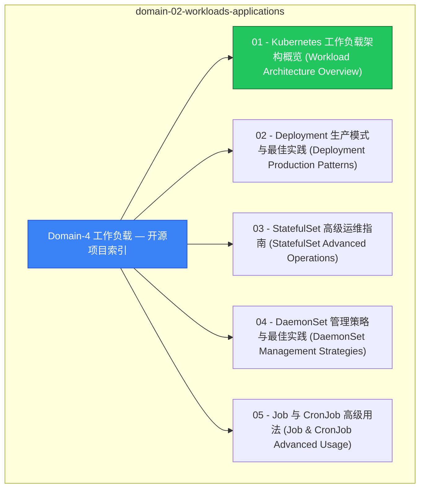

# domain-02-workloads-applications MOC

> **MOC 版本**: 1.0
> **知识域**: domain-02-workloads-applications
> **文档数量**: 28 篇
> **最后更新**: 2026-05-21
> **用途**: 本知识域的导航入口，汇总所有相关文档、关联领域、和场景入口

---

## 领域概述

工作负载 — Pod、Deployment、StatefulSet、DaemonSet、Job、CronJob

### 知识域定位

| 维度 | 说明 |
|---|---|
| **知识域** | domain-02-workloads-applications |
| **文档数量** | 28 篇 |
| **难度分布** | 入门 0 / 进阶 2 / 高级 1 / 专家 0 |

---

## 文档清单

| # | 文档 | 难度 | 标签 | 估计阅读时间 |
|---|---|---|---|---|
| 1 | [[domain-02-workloads-applications/00-open-source-projects-index.md|Domain-4 工作负载 — 开源项目索引]] |  | k8s, workload, pod |  |
| 2 | [[domain-02-workloads-applications/01-workload-overview-architecture.md|01 - Kubernetes 工作负载架构概览 (Workload Architecture Overview)]] |  | k8s, workload, pod |  |
| 3 | [[domain-02-workloads-applications/02-deployment-production-patterns.md|02 - Deployment 生产模式与最佳实践 (Deployment Production Patterns)]] |  | k8s, workload, pod |  |
| 4 | [[domain-02-workloads-applications/03-statefulset-advanced-operations.md|03 - StatefulSet 高级运维指南 (StatefulSet Advanced Operations)]] |  | k8s, workload, pod |  |
| 5 | [[domain-02-workloads-applications/04-daemonset-management.md|04 - DaemonSet 管理策略与最佳实践 (DaemonSet Management Strategies)]] |  | k8s, workload, pod |  |
| 6 | [[domain-02-workloads-applications/05-job-cronjob-advanced.md|05 - Job 与 CronJob 高级用法 (Job & CronJob Advanced Usage)]] |  | k8s, workload, pod |  |
| 7 | [[domain-02-workloads-applications/06-workload-monitoring-alerting.md|06 - 工作负载监控与告警体系 (Workload Monitoring & Alerting System)]] |  | k8s, workload, pod |  |
| 8 | [[domain-02-workloads-applications/07-workload-troubleshooting-handbook.md|07 - 工作负载故障排查与应急响应手册 (Workload Troubleshooting & Incident Response Handbook)]] |  | k8s, workload, pod |  |
| 9 | [[domain-02-workloads-applications/08-multi-cloud-workload-strategy.md|08 - 多云混合部署工作负载管理策略 (Multi-Cloud Hybrid Deployment Workload Strategy)]] |  | k8s, workload, pod |  |
| 10 | [[domain-02-workloads-applications/09-edge-computing-deployment.md|09 - 边缘计算工作负载部署模式 (Edge Computing Workload Deployment Patterns)]] |  | k8s, workload, pod |  |
| 11 | [[domain-02-workloads-applications/10-workload-controllers-overview.md|工作负载控制器详解]] | 进阶 | k8s, workload, deployment | 5min |
| 12 | [[domain-02-workloads-applications/11-pod-lifecycle-events.md|Pod 生命周期事件表]] | 进阶 | k8s, pod, lifecycle | 5min |
| 13 | [[domain-02-workloads-applications/12-advanced-pod-patterns.md|111 - 容器与 Pod 高级运维模式 (Advanced Pod Patterns)]] |  | k8s, workload, pod |  |
| 14 | [[domain-02-workloads-applications/13-container-lifecycle-hooks.md|74 - 容器生命周期钩子 (Container Lifecycle Hooks)]] |  | k8s, workload, pod |  |
| 15 | [[domain-02-workloads-applications/14-sidecar-containers-patterns.md|Sidecar 容器模式]] |  | k8s, workload, pod |  |
| 16 | [[domain-02-workloads-applications/15-container-runtime-interfaces.md|39 - 容器运行时对比表]] |  | k8s, workload, pod |  |
| 17 | [[domain-02-workloads-applications/16-runtime-class-configuration.md|70 - RuntimeClass配置]] |  | k8s, workload, pod |  |
| 18 | [[domain-02-workloads-applications/17-container-images-registry.md|51 - 容器镜像管理与仓库 (Container Images & Registry)]] |  | k8s, workload, pod |  |
| 19 | [[domain-02-workloads-applications/18-node-management-operations.md|27 - 节点与节点池管理 (Node & NodePool Management)]] |  | k8s, workload, pod |  |
| 20 | [[domain-02-workloads-applications/19-scheduler-configuration.md|调度器配置与优化]] | 高级 | k8s, scheduler, affinity | 5min |
| 21 | [[domain-02-workloads-applications/20-kubelet-configuration.md|Kubelet 配置与调优]] |  | k8s, workload, pod |  |
| 22 | [[domain-02-workloads-applications/21-hpa-vpa-autoscaling.md|HPA/VPA 自动伸缩配置]] |  | k8s, workload, pod |  |
| 23 | [[domain-02-workloads-applications/22-cluster-capacity-planning.md|集群容量规划]] |  | k8s, workload, pod |  |
| 24 | [[domain-02-workloads-applications/23-resource-management.md|16 - 资源管理表]] |  | k8s, workload, pod |  |
| 25 | [[domain-02-workloads-applications/99-kubernetes-v1.33-workloads-guide.md|Kubernetes v1.29-v1.33 工作负载管理新特性指南]] |  | k8s, workload, pod |  |
| 26 | [[domain-02-workloads-applications/99-spring-boot-kubernetes-guide.md|Spring Boot on Kubernetes 生产实践指南]] |  | k8s, workload, pod |  |
| 27 | [[domain-02-workloads-applications/QUALITY_REPORT.md|Domain-4 工作负载管理质量报告]] |  | k8s, workload, pod |  |
| 28 | [[domain-02-workloads-applications/README-old.md|Domain-4: Kubernetes工作负载]] |  | k8s, workload, pod |  |

---

## 知识图谱

---

## 关联入口

| 入口 | 说明 |
|---|---|
| [[../domain-10-troubleshooting-diagnostics/topic-fta/MOC.md|FTA 故障树]] | domain-02-workloads-applications 相关故障树分析 |
| [[../domain-10-troubleshooting-diagnostics/topic-skills/MOC.md|Skills 技能]] | domain-02-workloads-applications 相关操作技能 |
| [[../domain-19-landscape-references/topic-index/README.md|深度研究入口]] | 语料库索引与向量检索 |

---

## 统计信息

| 指标 | 数值 |
|---|---|
| 文档总数 | 28 |
| 覆盖 K8s 版本 | v1.25 - v1.32 |

---

*本文档由 scripts/generate-mocs.py 自动生成，最后更新 2026-05-21。*
