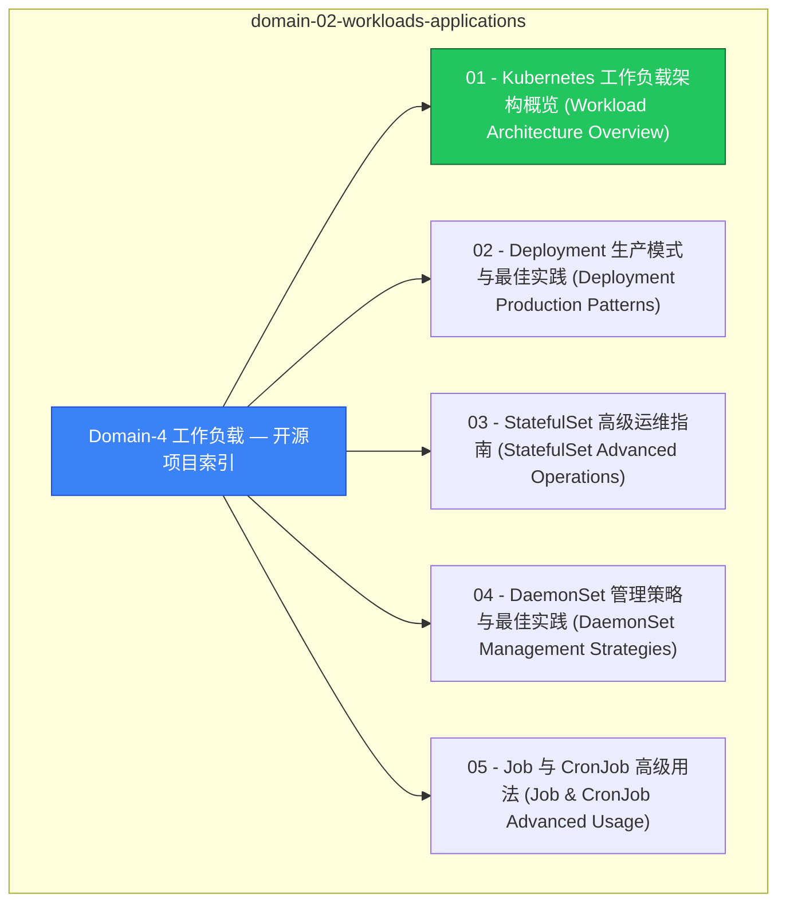

# domain-02-workloads-applications MOC

> **MOC 版本**: 1.0
> **知识域**: domain-02-workloads-applications
> **文档数量**: 28 篇
> **最后更新**: 2026-05-21
> **用途**: 本知识域的导航入口，汇总所有相关文档、关联领域、和场景入口

---

## 领域概述

工作负载 — Pod、Deployment、StatefulSet、DaemonSet、Job、CronJob

### 知识域定位

| 维度 | 说明 |
|---|---|
| **知识域** | domain-02-workloads-applications |
| **文档数量** | 28 篇 |
| **难度分布** | 入门 0 / 进阶 2 / 高级 1 / 专家 0 |

---

## 文档清单

| # | 文档 | 难度 | 标签 | 估计阅读时间 |
|---|---|---|---|---|
| 1 | Domain-4 工作负载 — 开源项目索引 |  | k8s, workload, pod |  |
| 2 | 01 - Kubernetes 工作负载架构概览 (Workload Architecture Overview) |  | k8s, workload, pod |  |
| 3 | 02 - Deployment 生产模式与最佳实践 (Deployment Production Patterns) |  | k8s, workload, pod |  |
| 4 | 03 - StatefulSet 高级运维指南 (StatefulSet Advanced Operations) |  | k8s, workload, pod |  |
| 5 | 04 - DaemonSet 管理策略与最佳实践 (DaemonSet Management Strategies) |  | k8s, workload, pod |  |
| 6 | 05 - Job 与 CronJob 高级用法 (Job & CronJob Advanced Usage) |  | k8s, workload, pod |  |
| 7 | 06 - 工作负载监控与告警体系 (Workload Monitoring & Alerting System) |  | k8s, workload, pod |  |
| 8 | 07 - 工作负载故障排查与应急响应手册 (Workload Troubleshooting & Incident Response Handbook) |  | k8s, workload, pod |  |
| 9 | 08 - 多云混合部署工作负载管理策略 (Multi-Cloud Hybrid Deployment Workload Strategy) |  | k8s, workload, pod |  |
| 10 | 09 - 边缘计算工作负载部署模式 (Edge Computing Workload Deployment Patterns) |  | k8s, workload, pod |  |
| 11 | 工作负载控制器详解 | 进阶 | k8s, workload, deployment | 5min |
| 12 | Pod 生命周期事件表 | 进阶 | k8s, pod, lifecycle | 5min |
| 13 | 111 - 容器与 Pod 高级运维模式 (Advanced Pod Patterns) |  | k8s, workload, pod |  |
| 14 | 74 - 容器生命周期钩子 (Container Lifecycle Hooks) |  | k8s, workload, pod |  |
| 15 | Sidecar 容器模式 |  | k8s, workload, pod |  |
| 16 | 39 - 容器运行时对比表 |  | k8s, workload, pod |  |
| 17 | 70 - RuntimeClass配置 |  | k8s, workload, pod |  |
| 18 | 51 - 容器镜像管理与仓库 (Container Images & Registry) |  | k8s, workload, pod |  |
| 19 | 27 - 节点与节点池管理 (Node & NodePool Management) |  | k8s, workload, pod |  |
| 20 | 调度器配置与优化 | 高级 | k8s, scheduler, affinity | 5min |
| 21 | Kubelet 配置与调优 |  | k8s, workload, pod |  |
| 22 | HPA/VPA 自动伸缩配置 |  | k8s, workload, pod |  |
| 23 | 集群容量规划 |  | k8s, workload, pod |  |
| 24 | 16 - 资源管理表 |  | k8s, workload, pod |  |
| 25 | Kubernetes v1.29-v1.33 工作负载管理新特性指南 |  | k8s, workload, pod |  |
| 26 | Spring Boot on Kubernetes 生产实践指南 |  | k8s, workload, pod |  |
| 27 | Domain-4 工作负载管理质量报告 |  | k8s, workload, pod |  |
| 28 | Domain-4: Kubernetes工作负载 |  | k8s, workload, pod |  |

---

## 知识图谱

---

## 关联入口

| 入口 | 说明 |
|---|---|
| FTA 故障树 | domain-02-workloads-applications 相关故障树分析 |
| Skills 技能 | domain-02-workloads-applications 相关操作技能 |
| 深度研究入口 | 语料库索引与向量检索 |

---

## 统计信息

| 指标 | 数值 |
|---|---|
| 文档总数 | 28 |
| 覆盖 K8s 版本 | v1.25 - v1.32 |

---

*本文档由 scripts/generate-mocs.py 自动生成，最后更新 2026-05-21。*
