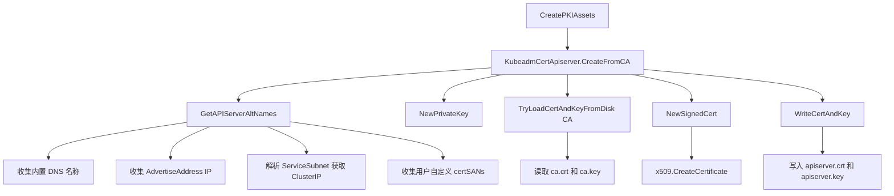

title: API Server 证书生成源码分析
description: '## 概述'
category: functions
tags:
- k8s
- operations
- cluster-management
- etcd
- apiserver
- kubelet
- containerd
- rbac
last_updated: '2026-05-18'
difficulty: advanced
reading_level: advanced
audience:
- Kubernetes 管理员
- 集群运维人员
- 网络工程师
estimated_read_time: 5min
intent_queries:
- Kubernetes API Server 证书 SAN 生成 GetAPIServerAltNames 源码
- kubeadm API Server 证书生成流程 NewSignedCert
- API Server 证书 Subject Alternative Name 动态收集
- API Server 客户端证书 apiserver-kubelet-client apiserver-etcd-client
- kubeadm certSANs 自定义扩展
trigger_keywords:
- GetAPIServerAltNames
- SAN
- apiserver
- apiserver-kubelet-client
- apiserver-etcd-client
- ServerAuth
- ClientAuth
- certSANs
- advertiseAddress
- ServiceSubnet
related_domains:
- domain-01-cluster-fundamentals
related_topics:
- cluster-cert/pki-architecture
- cluster-cert/ca-generation
- cluster-cert/cert-config
- cluster-cert/apiserver-cert-flags
authors:
- name: KUDIG Team
  role: contributor
k8s_versions:
- '1.28'
- '1.29'
- '1.30'
- '1.31'
- '1.32'
---

# API Server 证书生成源码分析

## 概述

API Server 证书是 Kubernetes 集群中最重要的服务端证书，它不仅需要包含正确的 SAN（Subject Alternative Name）以支持集群内外的多种访问方式，还需要配置正确的扩展密钥用途（EKU）。本文档基于 kubeadm 源码，深入分析 API Server 证书的生成逻辑、SAN 动态收集机制、CA 签发流程以及多场景下的证书验证实践。

---

## 函数签名

```go
func GetAPIServerAltNames(cfg *kubeadmapi.InitConfiguration) (*certutil.AltNames, error)

func NewSignedCert(cfg Config, key crypto.Signer, caCert *x509.Certificate, caKey crypto.Signer) (*x509.Certificate, error)

func (k *KubeadmCert) CreateFromCA(cfg *kubeadmapi.InitConfiguration, caCert *KubeadmCert) error

func NewPrivateKey() (*rsa.PrivateKey, error)

func TryLoadCertAndKeyFromDisk(certPath, keyPath string) (*x509.Certificate, crypto.Signer, error)

func WriteCertAndKey(pkiPath, baseName string, cert *x509.Certificate, key *rsa.PrivateKey) error

func NewCertAndKey(caCert *x509.Certificate, caKey crypto.Signer, config *certutil.Config, key *rsa.PrivateKey) (*x509.Certificate, error)

func GetIndexedIP(cidr *net.IPNet, index int) (net.IP, error)
```

---

## 源码位置

| 功能 | 文件路径 |
|------|---------|
| API Server 证书定义 | `cmd/kubeadm/app/phases/certs/certs.go` |
| SAN 收集逻辑 | `cmd/kubeadm/app/phases/certs/certs.go` |
| 证书生成工具 | `cmd/kubeadm/app/util/pkiutil/pki_helpers.go` |
| 通用证书库 | `staging/src/k8s.io/client-go/util/cert/cert.go` |
| 证书写入磁盘 | `cmd/kubeadm/app/util/pkiutil/pki_helpers.go` |
| PKI 资产创建入口 | `cmd/kubeadm/app/phases/certs/certs.go` |

---

## 参数说明

| 参数 | 类型 | 说明 |
|------|------|------|
| `cfg` | `*kubeadmapi.InitConfiguration` | kubeadm 初始化配置，包含网络、节点注册、API Server 参数 |
| `key` | `crypto.Signer` | 待签名的私钥（通常为 RSA 2048 位） |
| `caCert` | `*x509.Certificate` | CA 证书，用于作为签名模板的 Issuer |
| `caKey` | `crypto.Signer` | CA 私钥，用于对证书进行数字签名 |
| `cfg.AltNames` | `certutil.AltNames` | 包含 DNSNames 和 IPs 的 SAN 列表 |
| `cfg.Usages` | `[]x509.ExtKeyUsage` | 扩展密钥用途，如 ServerAuth 或 ClientAuth |
| `cfg.ValidityPeriod` | `time.Duration` | 证书有效期，默认 1 年 |
| `pkiPath` | `string` | PKI 文件存储目录，默认 `/etc/kubernetes/pki` |
| `baseName` | `string` | 证书文件基名，如 `apiserver` |

---

## 返回值

| 函数 | 返回值 | 说明 |
|------|--------|------|
| `GetAPIServerAltNames` | `(*certutil.AltNames, error)` | 包含所有 DNS 和 IP 的 SAN 列表 |
| `NewSignedCert` | `(*x509.Certificate, error)` | CA 签名后的 X.509 证书对象 |
| `CreateFromCA` | `error` | 证书创建和持久化失败时返回错误 |
| `NewPrivateKey` | `(*rsa.PrivateKey, error)` | 新生成的 RSA 私钥 |
| `WriteCertAndKey` | `error` | 文件写入失败时返回错误 |

---

## 调用链



---

## 源码分析

### 1. API Server 证书定义

```go
var KubeadmCertApiserver = &KubeadmCert{
    Name:     "apiserver",
    LongName: "certificate for serving the Kubernetes API",
    BaseName: KubeadmCertApiserver,
    CAName:   "ca",
    Config: certutil.Config{
        CommonName:   "kube-apiserver",
        Organization: []string{"system:masters"},
        Usages:       []x509.ExtKeyUsage{x509.ExtKeyUsageServerAuth},
    },
}
```

**关键属性**：

| 属性 | 值 | 说明 |
|-----|---|------|
| `CommonName` | `kube-apiserver` | 证书主体名称 |
| `Organization` | `system:masters` | 所属组织，RBAC 中该组具有 cluster-admin 权限 |
| `Usages` | `ExtKeyUsageServerAuth` | 仅用于服务端认证 |
| `CAName` | `ca` | 由 kubernetes-ca 签发 |

### 2. SAN 收集函数

```go
func GetAPIServerAltNames(cfg *kubeadmapi.InitConfiguration) (*certutil.AltNames, error) {
    altNames := &certutil.AltNames{
        DNSNames: []string{
            cfg.NodeRegistration.Name,
            "kubernetes",
            "kubernetes.default",
            "kubernetes.default.svc",
            "kubernetes.default.svc." + cfg.Networking.DNSDomain,
        },
        IPs: []net.IP{
            cfg.LocalAPIEndpoint.AdvertiseAddress,
        },
    }

    svcSubnetCIDR, err := net.ParseCIDR(cfg.Networking.ServiceSubnet)
    if err == nil {
        internalAPIServerVirtualIP, err := utilsnet.GetIndexedIP(svcSubnetCIDR, 1)
        if err == nil {
            altNames.IPs = append(altNames.IPs, internalAPIServerVirtualIP)
        }
    }

    for _, altname := range cfg.APIServer.CertSANs {
        if ip := net.ParseIP(altname); ip != nil {
            altNames.IPs = append(altNames.IPs, ip)
        } else {
            altNames.DNSNames = append(altNames.DNSNames, altname)
        }
    }

    return altNames, nil
}
```

### 3. 默认 SAN 列表

```go
DNSNames: [
    "<node-hostname>",
    "kubernetes",
    "kubernetes.default",
    "kubernetes.default.svc",
    "kubernetes.default.svc.cluster.local",
]
IPs: [
    <API Server AdvertiseAddress>,
    <Service CIDR 第一个 IP>,
]
```

### 4. CA 签发证书核心函数

```go
func NewSignedCert(cfg Config, key crypto.Signer, caCert *x509.Certificate, caKey crypto.Signer) (*x509.Certificate, error) {
    serial, err := rand.Int(rand.Reader, new(big.Int).SetInt64(math.MaxInt64))
    if err != nil {
        return nil, err
    }

    certTmpl := x509.Certificate{
        SerialNumber: serial,
        Subject: pkix.Name{
            CommonName:   cfg.CommonName,
            Organization: cfg.Organization,
        },
        DNSNames:     cfg.AltNames.DNSNames,
        IPAddresses:  cfg.AltNames.IPs,
        NotBefore:    time.Now().Add(-5 * time.Minute).UTC(),
        NotAfter:     time.Now().Add(cfg.ValidityPeriod).UTC(),
        KeyUsage:     x509.KeyUsageKeyEncipherment | x509.KeyUsageDigitalSignature,
        ExtKeyUsage:  cfg.Usages,
    }

    certDERBytes, err := x509.CreateCertificate(rand.Reader, &certTmpl, caCert, key.Public(), caKey)
    if err != nil {
        return nil, err
    }

    return x509.ParseCertificate(certDERBytes)
}
```

**关键属性分析**：

| 属性 | 值 | 说明 |
|-----|---|------|
| `SerialNumber` | 随机生成 | 防止证书指纹冲突 |
| `KeyUsage` | `KeyEncipherment | DigitalSignature` | 非 CA 证书不需要 CertSign |
| `ExtKeyUsage` | `ServerAuth` | 仅用于服务端 TLS 认证 |
| `NotBefore` | 当前时间 - 5 分钟 | 允许轻微的时钟偏差 |
| `NotAfter` | 当前时间 + 1 年 | 默认有效期 |

### 5. kubeadm 封装调用链

```go
func (k *KubeadmCert) CreateFromCA(cfg *kubeadmapi.InitConfiguration, caCert *KubeadmCert) error {
    altNames, err := k.GetConfig(cfg)
    key, err := pkiutil.NewPrivateKey()
    certConfig := certutil.Config{
        CommonName:     k.Config.CommonName,
        Organization:   k.Config.Organization,
        AltNames:       *altNames,
        Usages:         k.Config.Usages,
        ValidityPeriod: cfg.CertificateValidityPeriod,
    }
    caCertFile, caKeyFile := caCert.PathsForCertificateAndKey(cfg.CertificatesDir)
    caCertificate, caKey, err := pkiutil.TryLoadCertAndKeyFromDisk(caCertFile, caKeyFile)
    cert, err := pkiutil.NewCertAndKey(caCertificate, caKey, &certConfig, key)
    return pkiutil.WriteCertAndKey(cfg.CertificatesDir, k.BaseName, cert, key)
}
```

### 6. API Server 客户端证书

API Server 不仅需要服务端证书，还需要客户端证书用于连接 kubelet 和 etcd：

```go
var KubeadmCertApiserverKubeletClient = &KubeadmCert{
    Name:     "apiserver-kubelet-client",
    CAName:   "ca",
    Config: certutil.Config{
        CommonName:   "kube-apiserver-kubelet-client",
        Organization: []string{"system:masters"},
        Usages:       []x509.ExtKeyUsage{x509.ExtKeyUsageClientAuth},
    },
}

var KubeadmCertApiserverEtcdClient = &KubeadmCert{
    Name:     "apiserver-etcd-client",
    CAName:   "etcd-ca",
    Config: certutil.Config{
        CommonName:   "kube-apiserver-etcd-client",
        Organization: []string{"system:masters"},
        Usages:       []x509.ExtKeyUsage{x509.ExtKeyUsageClientAuth},
    },
}
```

**关键差异**：
- `apiserver-kubelet-client`：由 `kubernetes-ca` 签发，EKU 为 `ClientAuth`
- `apiserver-etcd-client`：由 `etcd-ca` 签发（独立信任域），EKU 为 `ClientAuth`

---

## 执行流程

```
CreatePKIAssets 入口
  │
  ├── 生成/加载 CA 证书
  │     ├── kubernetes-ca (ca.crt, ca.key)
  │     ├── etcd-ca (etcd/ca.crt, etcd/ca.key)
  │     └── front-proxy-ca (front-proxy-ca.crt, front-proxy-ca.key)
  │
  ├── 生成 API Server 服务端证书
  │     ├── GetAPIServerAltNames (收集 SAN)
  │     │     ├── 内置 DNS: kubernetes, kubernetes.default, ...
  │     │     ├── AdvertiseAddress IP
  │     │     ├── Service CIDR 第一个 IP (10.96.0.1)
  │     │     └── 用户自定义 certSANs
  │     ├── NewPrivateKey (生成 RSA 2048 私钥)
  │     ├── NewSignedCert (CA 签名)
  │     └── WriteCertAndKey (写入 apiserver.crt, apiserver.key)
  │
  ├── 生成 API Server -> kubelet 客户端证书
  │     └── CreateFromCA(kubernetes-ca, ClientAuth)
  │
  └── 生成 API Server -> etcd 客户端证书
        └── CreateFromCA(etcd-ca, ClientAuth)
```

---

## 使用场景

### 场景 1：多入口访问 API Server

当集群有多个入口（内网 LB、外网 LB、VIP）时，需要将所有入口地址加入 certSANs：

```yaml
apiVersion: kubeadm.k8s.io/v1beta3
kind: ClusterConfiguration
apiServer:
  certSANs:
    - "k8s-api.example.com"
    - "k8s-api.internal.com"
    - "203.0.113.10"
    - "10.0.0.100"
    - "192.168.1.100"
```

### 场景 2：证书续期后 SAN 丢失

`kubeadm certs renew` 使用原证书的 SAN，但如果是手动生成的新证书，必须确保 SAN 完整：

```bash
kubeadm certs renew apiserver --config=kubeadm-config.yaml
```

### 场景 3：API Server 客户端证书验证

API Server 作为服务端，使用 `kubernetes-ca` 验证所有客户端证书：

```go
--client-ca-file=/etc/kubernetes/pki/ca.crt
--requestheader-client-ca-file=/etc/kubernetes/pki/front-proxy-ca.crt
```

**验证逻辑**：
1. 普通客户端（kubectl、kubelet）使用 `--client-ca-file` 验证
2. API 聚合层请求（metrics-server）使用 `--requestheader-client-ca-file` 验证
3. 从客户端证书提取 `Subject.CommonName` 作为用户名
4. 从客户端证书提取 `Subject.Organization` 作为用户组

---

## 配置示例 YAML

```yaml
apiVersion: kubeadm.k8s.io/v1beta3
kind: ClusterConfiguration
networking:
  serviceSubnet: "10.96.0.0/12"
  podSubnet: "10.244.0.0/16"
  dnsDomain: "cluster.local"
apiServer:
  extraArgs:
    authorization-mode: "Node,RBAC"
  certSANs:
    - "192.168.1.100"
    - "k8s.example.com"
    - "api.k8s.internal"
    - "10.0.0.50"
  timeoutForControlPlane: 4m0s
certificatesDir: "/etc/kubernetes/pki"
---
apiVersion: kubeadm.k8s.io/v1beta3
kind: InitConfiguration
localAPIEndpoint:
  advertiseAddress: "192.168.1.10"
  bindPort: 6443
nodeRegistration:
  name: "control-plane-1"
  criSocket: "unix:///var/run/containerd/containerd.sock"
```

---

## 实战示例

### 示例 1：查看 API Server 证书 SAN

```bash
openssl x509 -in /etc/kubernetes/pki/apiserver.crt -noout -ext subjectAltName
```

### 示例 2：验证证书链

```bash
openssl verify -CAfile /etc/kubernetes/pki/ca.crt /etc/kubernetes/pki/apiserver.crt
```

### 示例 3：验证证书与私钥匹配

```bash
diff <(openssl x509 -in /etc/kubernetes/pki/apiserver.crt -noout -modulus | md5) \
     <(openssl rsa -in /etc/kubernetes/pki/apiserver.key -noout -modulus | md5)
```

### 示例 4：远程检查 API Server 证书

```bash
echo | openssl s_client -connect 192.168.1.10:6443 -servername kubernetes 2>/dev/null | \
  openssl x509 -noout -text | grep -A2 "Subject Alternative Name"
```

### 示例 5：重新生成 API Server 证书

> ⚠️ **🟠 高危操作** — 影响业务流量或节点状态，需变更工单+影响评估+计划回滚
> - `systemctl stop/restart`：停止/重启系统服务，影响节点上所有容器

```bash
kubeadm certs renew apiserver --config=/etc/kubernetes/kubeadm-config.yaml
systemctl restart kubelet
```

### 示例 6：检查证书有效期

```bash
for cert in /etc/kubernetes/pki/apiserver*.crt; do
  echo "=== $cert ==="
  openssl x509 -in "$cert" -noout -dates -subject
done
```

---

## 常见错误

| 错误 | 现象 | 根因 | 解决 |
|-----|------|------|------|
| SAN 缺失 | `x509: certificate is valid for X, not Y` | 新 IP/域名未加入 certSANs | 更新 kubeadm-config，重新生成证书 |
| 证书过期 | `certificate has expired` | 超过 1 年有效期 | `kubeadm certs renew apiserver` |
| CA 不信任 | `signed by unknown authority` | 使用错误的 CA 验证 | 确认客户端使用正确的 ca.crt |
| 密钥不匹配 | `private key does not match public key` | 证书与私钥不配对 | 重新生成匹配的证书密钥对 |
| AdvertiseAddress 缺失 | `x509: certificate signed by unknown authority` | SAN 中缺少 API Server 公告地址 | 检查 InitConfiguration.localAPIEndpoint |
| ClusterIP 缺失 | 集群内 Pod 无法访问 API | SAN 缺少 Service CIDR 第一个 IP | 检查 networking.serviceSubnet 配置 |
| renew 后未重启 | 证书已更新但组件仍用旧证书 | 组件内存中缓存了旧证书 | 重启 kubelet 或 API Server Pod |

---

## 相关函数

| 函数 | 源码位置 | 说明 |
|------|---------|------|
| `CreatePKIAssets` | `cmd/kubeadm/app/phases/certs/certs.go` | PKI 资产创建入口 |
| `GetAPIServerAltNames` | `cmd/kubeadm/app/phases/certs/certs.go` | SAN 收集 |
| `NewSignedCert` | `staging/src/k8s.io/client-go/util/cert/cert.go` | CA 签名核心 |
| `NewPrivateKey` | `cmd/kubeadm/app/util/pkiutil/pki_helpers.go` | RSA 密钥生成 |
| `WriteCertAndKey` | `cmd/kubeadm/app/util/pkiutil/pki_helpers.go` | 证书持久化 |
| `TryLoadCertAndKeyFromDisk` | `cmd/kubeadm/app/util/pkiutil/pki_helpers.go` | 加载已有证书 |
| `GetIndexedIP` | `staging/src/k8s.io/utils/net/parse.go` | 从 CIDR 获取指定索引 IP |

## Related

- [[reference|#reference Hub]] — tag hub

- [[domain-17-system-foundation/topic-cheat-sheet/go.md|go]]
- [[domain-17-system-foundation/topic-cheat-sheet/networking.md|networking]]
- [[domain-17-system-foundation/topic-cheat-sheet/k8s.md|k8s]]
- [[entities/kubernetes.md|kubernetes]]
- [[entities/containerd.md|containerd]]
