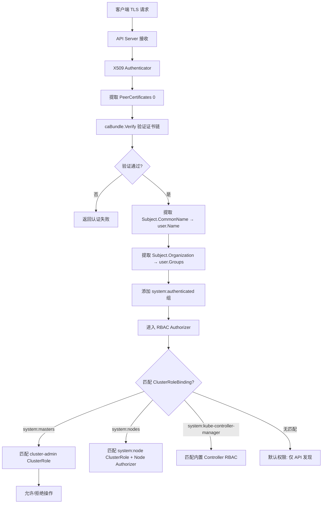
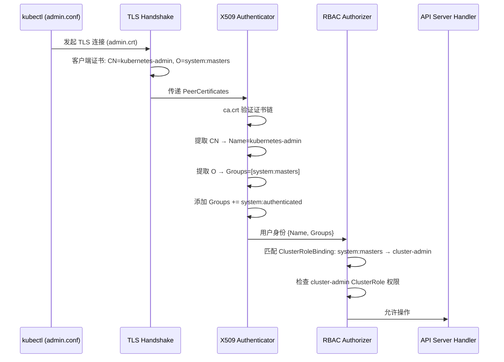

title: 证书身份到 RBAC 的映射关系
description: '| X509 认证插件 | `staging/src/k8s.io/apiserver/pkg/authentication/request/x509/x509.go`
  | 证书身份提取 |'
category: functions
tags:
- k8s
- operations
- cluster-management
- etcd
- apiserver
- kubelet
- scheduler
- controller-manager
- rbac
last_updated: '2026-05-18'
difficulty: advanced
reading_level: advanced
audience:
- Kubernetes 管理员
- 安全工程师
- 权限管理员
estimated_read_time: 5min
intent_queries:
- Kubernetes X509 证书身份提取 CommonName Organization RBAC
- system:masters cluster-admin 特殊地位
- Node Authorizer 节点鉴权 kubelet 权限约束
- Front Proxy 请求头认证 X-Remote-User
- 证书 RBAC 映射 故障排查
trigger_keywords:
- X509 Authenticator
- CommonName
- Organization
- system:masters
- cluster-admin
- Node Authorizer
- Node鉴权
- RBAC
- X-Remote-User
- Impersonation
related_domains:
- domain-01-cluster-fundamentals
- domain-05-security-compliance
- domain-10-troubleshooting-diagnostics
related_topics:
- cluster-cert/pki-architecture
- cluster-cert/ca-generation
- cluster-cert/apiserver-cert-flags
- cluster-cert/front-proxy-workflow
authors:
- name: KUDIG Team
  role: contributor
k8s_versions:
- '1.28'
- '1.29'
- '1.30'
- '1.31'
- '1.32'
---

# 证书身份到 RBAC 的映射关系

## 函数签名

```go
func (a *Authenticator) AuthenticateRequest(req *http.Request) (*authenticator.Response, bool, error)

func NewSelfSignedCACert(cfg Config, key crypto.Signer) (*x509.Certificate, error)

func (k *KubeadmCert) CreateFromCA(cfg *kubeadmapi.InitConfiguration, caCert *KubeadmCert) error
```

## 源码位置

| 组件 | 源码路径 | 说明 |
|------|---------|------|
| X509 认证插件 | `staging/src/k8s.io/apiserver/pkg/authentication/request/x509/x509.go` | 证书身份提取 |
| RBAC 鉴权 | `plugin/pkg/auth/authorizer/rbac/` | RBAC 授权逻辑 |
| kubeadm 证书配置 | `cmd/kubeadm/app/phases/certs/certs.go` | 各组件证书的 CN/O 定义 |
| Node 鉴权器 | `plugin/pkg/auth/authorizer/node/` | 节点级别的特殊鉴权 |
| ABAC 鉴权 | `plugin/pkg/auth/authorizer/abac/` | 基于属性的访问控制 |

## 参数说明

### X509 Authenticator 参数

| 参数名 | 类型 | 说明 |
|--------|------|------|
| `a.caBundle` | `*x509.CertPool` | 信任的 CA 证书池，对应 `--client-ca-file` |
| `a.opts` | `*x509.VerifyOptions` | 证书验证选项（含 KeyUsages） |
| `req.TLS.PeerCertificates` | `[]*x509.Certificate` | TLS 握手中的客户端证书链 |

### KubeadmCert 证书配置

| 证书名 | CommonName | Organization | RBAC 映射 |
|--------|-----------|--------------|-----------|
| admin | `kubernetes-admin` | `system:masters` | cluster-admin ClusterRoleBinding |
| controller-manager | `system:kube-controller-manager` | `system:kube-controller-manager` | 内置 Controller 权限 |
| scheduler | `system:kube-scheduler` | `system:kube-scheduler` | 内置 Scheduler 权限 |
| apiserver-kubelet-client | `kube-apiserver-kubelet-client` | `system:masters` | kubelet 完全访问 |
| apiserver-etcd-client | `kube-apiserver-etcd-client` | `system:masters` | etcd 完全访问 |
| front-proxy-client | `front-proxy-client` | 无 | Front Proxy 白名单 |
| kubelet (CSR 签发后) | `system:node:<nodename>` | `system:nodes` | system:node ClusterRole |
| etcd-healthcheck | `kube-etcd-healthcheck-client` | `system:masters` | etcd 健康检查权限 |

## 返回值

| 函数 | 返回值 | 说明 |
|------|--------|------|
| `AuthenticateRequest` | `(*authenticator.Response, bool, error)` | 返回用户身份信息，是否认证成功，错误信息 |
| `NewSelfSignedCACert` | `(*x509.Certificate, error)` | 返回自签名 CA 证书 |
| `CreateFromCA` | `error` | 证书创建成功或失败 |

### authenticator.Response 结构

```go
type Response struct {
    User user.Info
    Audiences []string
}

type DefaultInfo struct {
    Name   string
    UID    string
    Groups []string
    Extra  map[string][]string
}
```

## 调用链



## 源码分析

### 概述

Kubernetes 不维护独立的"用户数据库"，而是通过 TLS 客户端证书中的 Subject 字段来标识调用者身份。API Server 从证书中提取 CommonName（用户名）和 Organization（用户组），再交由 RBAC 授权系统进行权限判定。理解这一映射机制是排查认证与授权问题的关键。

### X509 认证插件核心源码

```go
// staging/src/k8s.io/apiserver/pkg/authentication/request/x509/x509.go
type Authenticator struct {
    opts x509.VerifyOptions
    user.UserMapper

    caBundle *x509.CertPool
}

func (a *Authenticator) AuthenticateRequest(req *http.Request) (*authenticator.Response, bool, error) {
    if req.TLS == nil || len(req.TLS.PeerCertificates) == 0 {
        return nil, false, nil
    }

    clientCertificate := req.TLS.PeerCertificates[0]

    verifyingOptions := x509.VerifyOptions{
        Roots:     a.caBundle,
        KeyUsages: []x509.ExtKeyUsage{x509.ExtKeyUsageClientAuth},
        Intermediates: x509.NewCertPool(),
    }

    for _, intermediate := range req.TLS.PeerCertificates[1:] {
        verifyingOptions.Intermediates.AddCert(intermediate)
    }

    chains, err := clientCertificate.Verify(verifyingOptions)
    if err != nil {
        return nil, false, err
    }

    user := &user.DefaultInfo{
        Name:   clientCertificate.Subject.CommonName,
        Groups: clientCertificate.Subject.Organization,
    }

    return &authenticator.Response{User: user}, true, nil
}
```

### kubeadm 证书中的身份定义

```go
// cmd/kubeadm/app/phases/certs/certs.go

// 管理员证书
var KubeadmCertAdmin = &KubeadmCert{
    Name:     "admin",
    LongName: "admin kubeconfig client certificate",
    BaseName: "admin",
    Config: certutil.Config{
        CommonName:   "kubernetes-admin",
        Organization: []string{"system:masters"},
        Usages:       []x509.ExtKeyUsage{x509.ExtKeyUsageClientAuth},
    },
}

// Controller Manager 证书
var KubeadmCertControllerManager = &KubeadmCert{
    Name:     "controller-manager",
    LongName: "kube-controller-manager client certificate",
    BaseName: "controller-manager",
    CAName:   "ca",
    Config: certutil.Config{
        CommonName:   "system:kube-controller-manager",
        Organization: []string{"system:kube-controller-manager"},
        Usages:       []x509.ExtKeyUsage{x509.ExtKeyUsageClientAuth},
    },
}

// Scheduler 证书
var KubeadmCertScheduler = &KubeadmCert{
    Name:     "scheduler",
    LongName: "kube-scheduler client certificate",
    BaseName: "scheduler",
    CAName:   "ca",
    Config: certutil.Config{
        CommonName:   "system:kube-scheduler",
        Organization: []string{"system:kube-scheduler"},
        Usages:       []x509.ExtKeyUsage{x509.ExtKeyUsageClientAuth},
    },
}

// API Server -> kubelet 客户端证书
var KubeadmCertApiserverKubeletClient = &KubeadmCert{
    Name:     "apiserver-kubelet-client",
    LongName: "apiserver client for kubelet communications",
    BaseName: "apiserver-kubelet-client",
    CAName:   "ca",
    Config: certutil.Config{
        CommonName:   "kube-apiserver-kubelet-client",
        Organization: []string{"system:masters"},
        Usages:       []x509.ExtKeyUsage{x509.ExtKeyUsageClientAuth},
    },
}

// API Server -> etcd 客户端证书
var KubeadmCertApiserverEtcdClient = &KubeadmCert{
    Name:     "apiserver-etcd-client",
    LongName: "apiserver client for etcd communications",
    BaseName: "apiserver-etcd-client",
    CAName:   "etcd-ca",
    Config: certutil.Config{
        CommonName:   "kube-apiserver-etcd-client",
        Organization: []string{"system:masters"},
        Usages:       []x509.ExtKeyUsage{x509.ExtKeyUsageClientAuth},
    },
}
```

### system:masters 的特殊地位

```yaml
# 集群内置的 ClusterRoleBinding（不可删除）
apiVersion: rbac.authorization.k8s.io/v1
kind: ClusterRoleBinding
metadata:
  name: cluster-admin
roleRef:
  apiGroup: rbac.authorization.k8s.io
  kind: ClusterRole
  name: cluster-admin
subjects:
- apiGroup: rbac.authorization.k8s.io
  kind: Group
  name: system:masters
```

`system:masters` 组被绑定到 `cluster-admin` ClusterRole，拥有集群的完全控制权限。**该绑定不可删除**，是 Kubernetes 的默认超级管理员机制。

### Node Authorizer 的特殊约束

```go
// plugin/pkg/auth/authorizer/node/
// Node Authorizer 要求:
// 1. 用户名必须是 system:node:<nodename>
// 2. 只能访问本节点相关的资源
// 3. 证书 CN 必须精确匹配节点名
```

kubelet 的证书身份严格约束：

```yaml
# 内置 ClusterRoleBinding
subjects:
- kind: Group
  name: system:nodes
  apiGroup: rbac.authorization.k8s.io
roleRef:
  kind: ClusterRole
  name: system:node
```

### Front Proxy 的身份传递

```go
// API Server 启动参数
--requestheader-allowed-names=["front-proxy-client"]
--requestheader-client-ca-file=/etc/kubernetes/pki/front-proxy-ca.crt
--requestheader-username-headers=X-Remote-User
--requestheader-group-headers=X-Remote-Group
```

Front Proxy 体系使用 RequestHeader 认证插件：

```
客户端 ──► API Server ──► 扩展 API Server (metrics-server)
            │                  ▲
            │ 携带 X-Remote-User 头    │
            └──────────────────────────┘
            使用 front-proxy-client 证书
```

API Server 在连接扩展 API Server 时：
1. 使用 `front-proxy-client.crt` 进行 TLS 客户端认证
2. 将原始用户的身份信息放入 HTTP Header
3. 扩展 API Server 使用 `front-proxy-ca.crt` 验证 API Server 身份
4. 扩展 API Server 信任 Header 中的用户信息（impersonation 机制）

## 执行流程



## 使用场景

1. **排查权限问题**：通过证书 CN/O 确认用户身份和 RBAC 映射
2. **自定义组件接入**：为外部组件签发证书并配置对应 RBAC
3. **审计追踪**：通过证书 Subject 追踪操作者身份
4. **多租户隔离**：为不同团队签发不同身份的证书
5. **节点安全**：理解 Node Authorizer 对 kubelet 的权限约束

## 配置示例

### 自定义组件证书 RBAC 配置

```yaml
# 步骤 1: 签发证书 (CN=ci-pipeline, O=ci-cd)
# openssl req -new -key ci-pipeline.key -out ci-pipeline.csr \
#   -subj "/O=ci-cd/CN=ci-pipeline"

# 步骤 2: 创建 RBAC
apiVersion: rbac.authorization.k8s.io/v1
kind: ClusterRole
metadata:
  name: ci-pipeline-role
rules:
- apiGroups: ["", "apps"]
  resources: ["deployments", "pods", "services"]
  verbs: ["get", "list", "watch", "create", "update", "patch", "delete"]
- apiGroups: [""]
  resources: ["namespaces"]
  verbs: ["get", "list"]
---
apiVersion: rbac.authorization.k8s.io/v1
kind: ClusterRoleBinding
metadata:
  name: ci-pipeline-binding
roleRef:
  apiGroup: rbac.authorization.k8s.io
  kind: ClusterRole
  name: ci-pipeline-role
subjects:
- apiGroup: rbac.authorization.k8s.io
  kind: Group
  name: ci-cd
```

### kubeconfig 嵌入自定义证书

```yaml
apiVersion: v1
kind: Config
clusters:
- cluster:
    certificate-authority-data: LS0tLS1CRUdJTi...
    server: https://192.168.1.10:6443
  name: production
users:
- name: ci-pipeline
  user:
    client-certificate-data: LS0tLS1CRUdJTi...
    client-key-data: LS0tLS1CRUdJTi...
contexts:
- context:
    cluster: production
    user: ci-pipeline
  name: ci-pipeline@production
current-context: ci-pipeline@production
```

## 实战示例

### 身份验证调试

```bash
# 查看当前用户的证书身份
kubectl config view --raw -o jsonpath='{.users[?(@.name=="kubernetes-admin")].user.client-certificate-data}' | \
  base64 -d | openssl x509 -noout -subject -issuer
# subject=CN = kubernetes-admin, O = system:masters
# issuer=CN = kubernetes-ca

# 查看当前用户身份
kubectl auth whoami
# ATTRIBUTE   VALUE
# Username    kubernetes-admin
# Groups      [system:masters system:authenticated]

# 模拟用户权限检查
kubectl auth can-i create pods --as=system:node:worker-1
# yes

kubectl auth can-i '*' '*' --as-group=system:masters --as=kubernetes-admin
# yes

# 查看证书的完整 Subject
openssl x509 -in /etc/kubernetes/pki/apiserver-kubelet-client.crt -noout -subject -ext subjectAltName
# subject=CN = kube-apiserver-kubelet-client, O = system:masters

# 查看 CSR 中请求的证书身份
kubectl get csr node-csr-xxx -o jsonpath='{.spec.username}'
# system:bootstrap:abcdef
kubectl get csr node-csr-xxx -o jsonpath='{.spec.groups}'
# ["system:bootstrappers:kubeadm:default-node-token","system:authenticated"]
```

### 查看 RBAC 绑定关系

```bash
# 查看 system:masters 绑定
kubectl get clusterrolebinding cluster-admin -o yaml
# apiVersion: rbac.authorization.k8s.io/v1
# kind: ClusterRoleBinding
# metadata:
#   name: cluster-admin
# roleRef:
#   name: cluster-admin
# subjects:
# - name: system:masters

# 查看 system:nodes 绑定
kubectl get clusterrolebinding -o wide | grep system:nodes
# kubeadm:node-autoapprove-certificate-rotation   system:certificates.k8s.io:certificatesigningrequests:selfnodeclient   ClusterRole/system:nodes

# 查看所有 ClusterRoleBinding
kubectl get clusterrolebinding -o wide
```

## 常见错误

| 错误 | 现象 | 原因 | 解决方案 |
|------|------|------|----------|
| Organization 错误 | `User "xxx" cannot create resource "pods"` | 证书不属于预期的 RBAC 组 | 检查证书 O 字段，创建对应 ClusterRoleBinding |
| CommonName 不匹配 | kubelet 无法通过 Node Authorizer | CN 必须是 `system:node:<nodename>` | 重新签发证书确保 CN 格式正确 |
| CA 不信任 | `x509: certificate signed by unknown authority` | `--client-ca-file` 与证书签发 CA 不匹配 | 确认 API Server 的 `--client-ca-file` 指向正确 CA |
| 证书用途错误 | `certificate specifies incompatible key usage` | 服务端证书用于客户端认证 | 确保证书 EKU 包含 `ClientAuth` |
| front-proxy 配置错误 | metrics-server 401 | `--requestheader-allowed-names` 未包含 front-proxy-client 的 CN | 添加 CN 到 allowed-names 列表 |
| kubelet 证书过期 | 节点 NotReady | kubelet 客户端证书过期未轮换 | 检查 `rotateCertificates: true` 配置 |
| CSR 自动审批失败 | 节点无法获取证书 | 自动审批 RBAC 规则缺失 | 检查 kubeadm 创建的自动审批 ClusterRoleBinding |

## 相关函数

| 函数 | 源码位置 | 说明 |
|------|---------|------|
| [`CreatePKIAssets`](02-ca-generation.md) | `cmd/kubeadm/app/phases/certs/certs.go` | kubeadm 证书生成入口 |
| [`buildKubeConfigFromSpec`](12-kubeconfig-certs.md) | `cmd/kubeadm/app/phases/kubeconfig/kubeconfig.go` | kubeconfig 中证书嵌入 |
| [`GetAPIServerAltNames`](13-cert-config.md) | `cmd/kubeadm/app/phases/certs/certs.go` | API Server 证书 SAN 生成 |
| [`NewCertificateAuthority`](02-ca-generation.md) | `cmd/kubeadm/app/util/pkiutil/pki_helpers.go` | CA 证书生成 |
| [`kubeadm certs renew`](README.md) | `cmd/kubeadm/app/cmd/phases/certs/renew.go` | 证书续期与 RBAC 身份保持 |
| [`X509 Authenticator`](11-apiserver-cert-flags.md) | `staging/src/k8s.io/apiserver/pkg/authentication/request/x509/x509.go` | X509 认证插件 |

---

## 扩展场景：自定义组件的证书身份设计

### 设计原则

为外部组件或自研服务设计证书身份时，应遵循以下原则：

```
┌─────────────────────────────────────────────────────────────┐
│             证书身份设计检查清单                              │
├─────────────────────────────────────────────────────────────┤
│  1. CommonName 唯一性                                       │
│     - 每个组件应有唯一的 CN，便于审计追踪                    │
│     - 格式建议: <component-name>.<namespace>.svc            │
│                                                              │
│  2. Organization 最小权限                                   │
│     - 不使用 system:masters                                 │
│     - 创建专用的 Organization 组                             │
│     - 绑定最小必要权限的 ClusterRole                         │
│                                                              │
│  3. SAN 配置（如需要外部访问）                               │
│     - DNS: <service>.<namespace>.svc.cluster.local          │
│     - IP: 用于 ClusterIP 直接访问                             │
│                                                              │
│  4. 证书用途 (EKU)                                          │
│     - ServerAuth: 作为服务端提供 TLS                         │
│     - ClientAuth: 作为客户端连接 API Server                  │
│                                                              │
│  5. 有效期管理                                               │
│     - 建议: 90 天 - 1 年                                    │
│     - 自动化轮换机制                                         │
└─────────────────────────────────────────────────────────────┘
```

### 设计示例：CI/CD Pipeline 组件

```yaml
# 1. 生成专用 Organization 的证书
# openssl req -new -key ci-pipeline.key \
#   -subj "/O=ci-cd/CN=ci-pipeline.production.svc" \
#   -out ci-pipeline.csr

# 2. 创建最小权限 RBAC
apiVersion: rbac.authorization.k8s.io/v1
kind: ClusterRole
metadata:
  name: ci-pipeline-readonly
rules:
- apiGroups: [""]
  resources: ["pods", "services", "configmaps"]
  verbs: ["get", "list", "watch"]
- apiGroups: ["apps"]
  resources: ["deployments"]
  verbs: ["get", "list", "watch", "update", "patch"]

---
apiVersion: rbac.authorization.k8s.io/v1
kind: ClusterRoleBinding
metadata:
  name: ci-pipeline-readonly
roleRef:
  apiGroup: rbac.authorization.k8s.io
  kind: ClusterRole
  name: ci-pipeline-readonly
subjects:
- apiGroup: rbac.authorization.k8s.io
  kind: Group
  name: ci-cd
```

## Related

- [[README.md|README]]
- [[domain-17-system-foundation/topic-cheat-sheet/go.md|go]]
- [[domain-17-system-foundation/topic-cheat-sheet/k8s.md|k8s]]
- [[entities/kubernetes.md|kubernetes]]
- USER
