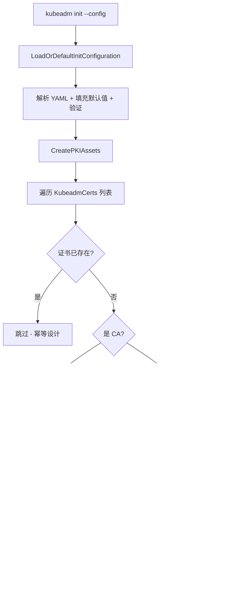
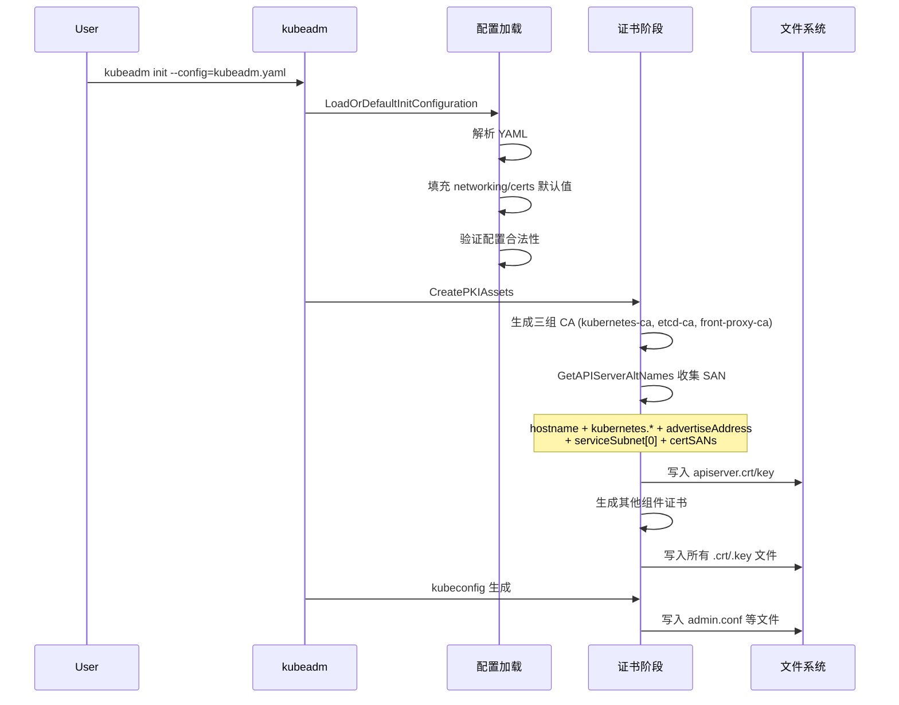

title: kubeadm 配置对证书生成的影响
description: '# kubeadm 配置对证书生成的影响'
category: functions
tags:
- k8s
- operations
- cluster-management
- etcd
- apiserver
- kubelet
- containerd
last_updated: '2026-05-18'
difficulty: intermediate
reading_level: intermediate
audience:
- Kubernetes 管理员
- 集群运维人员
estimated_read_time: 5min
intent_queries:
- kubeadm InitConfiguration ClusterConfiguration 证书配置字段
- kubeadm certSANs API Server 证书 SAN 自动生成规则
- controlPlaneEndpoint 高可用对证书的影响
- CertificatesDir 证书存储目录配置
- kubeadm 外部 etcd 模式证书配置
trigger_keywords:
- InitConfiguration
- ClusterConfiguration
- certSANs
- controlPlaneEndpoint
- CertificatesDir
- advertiseAddress
- ServiceSubnet
- SAN
- external etcd
- kubeadm 配置
related_domains:
- domain-01-cluster-fundamentals
related_topics:
- cluster-cert/pki-architecture
- cluster-cert/ca-generation
- cluster-cert/apiserver-cert
- cluster-cert/etcd-cert
authors:
- name: KUDIG Team
  role: contributor
k8s_versions:
- '1.28'
- '1.29'
- '1.30'
- '1.31'
- '1.32'
---

# kubeadm 配置对证书生成的影响

## 函数签名

```go
func LoadOrDefaultInitConfiguration(configPath string, defaultCfg *kubeadmapiv1.InitConfiguration, opts LoadOrDefaultConfigurationOptions) (*kubeadmapi.InitConfiguration, error)

func GetAPIServerAltNames(cfg *kubeadmapi.InitConfiguration) (*certutil.AltNames, error)

func GetEtcdAltNames(cfg *kubeadmapi.InitConfiguration) (*certutil.AltNames, error)

func FetchInitConfigurationFromCluster(client clientset.Interface, kubeadmConfigMapName string, description string, dryRun bool) (*kubeadmapi.InitConfiguration, error)

func (k *KubeadmCert) CreateFromCA(cfg *kubeadmapi.InitConfiguration, caCert *KubeadmCert) error
```

## 源码位置

| 组件 | 源码路径 | 说明 |
|------|---------|------|
| 配置类型定义 | `cmd/kubeadm/app/apis/kubeadm/v1beta3/types.go` | InitConfiguration/ClusterConfiguration |
| 配置加载 | `cmd/kubeadm/app/util/config/initconfiguration.go` | 配置解析与默认值 |
| 证书阶段 | `cmd/kubeadm/app/phases/certs/certs.go` | GetAPIServerAltNames、证书生成 |
| PKI 工具 | `cmd/kubeadm/app/util/pkiutil/pki_helpers.go` | 证书写入与验证 |
| 配置上传 | `cmd/kubeadm/app/phases/uploadconfig/uploadconfig.go` | ConfigMap 存储 |
| 配置验证 | `cmd/kubeadm/app/apis/kubeadm/v1beta3/validation.go` | 配置校验 |

## 参数说明

### InitConfiguration 证书相关字段

| 字段 | 类型 | 说明 | 默认值 |
|------|------|------|--------|
| `certificatesDir` | `string` | 证书存储目录 | `/etc/kubernetes/pki` |
| `localAPIEndpoint.advertiseAddress` | `string` | API Server 公告地址 | 无（必填） |
| `localAPIEndpoint.bindPort` | `int32` | API Server 端口 | 6443 |
| `nodeRegistration.name` | `string` | 节点名称 | hostname |
| `nodeRegistration.criSocket` | `string` | CRI socket 路径 | 自动检测 |

### ClusterConfiguration 证书相关字段

| 字段 | 类型 | 说明 | 默认值 |
|------|------|------|--------|
| `apiServer.certSANs` | `[]string` | API Server 证书额外 SAN | |
| `networking.serviceSubnet` | `string` | Service CIDR | `10.96.0.0/12` |
| `networking.podSubnet` | `string` | Pod CIDR | 无 |
| `networking.dnsDomain` | `string` | 集群 DNS 域名 | `cluster.local` |
| `controlPlaneEndpoint` | `string` | HA 负载均衡地址 | |
| `etcd.local` | `*LocalEtcd` | 本地 etcd 配置 | |
| `etcd.external` | `*ExternalEtcd` | 外部 etcd 配置 | |

### SAN 自动生成规则

| SAN 来源 | 类型 | 说明 |
|----------|------|------|
| 节点主机名 | DNS | `cfg.NodeRegistration.Name` |
| `kubernetes` | DNS | 固定值 |
| `kubernetes.default` | DNS | 固定值 |
| `kubernetes.default.svc` | DNS | 固定值 |
| `kubernetes.default.svc.<dnsDomain>` | DNS | 默认 `cluster.local` |
| `advertiseAddress` | IP | API Server 公告地址 |
| Service CIDR 第一个 IP | IP | 默认 `10.96.0.1` |
| `127.0.0.1` | IP | localhost |
| `certSANs` 中的 IP | IP | 用户自定义 |
| `certSANs` 中的域名 | DNS | 用户自定义 |

## 返回值

| 函数 | 返回值 | 说明 |
|------|--------|------|
| `GetAPIServerAltNames` | `(*certutil.AltNames, error)` | API Server 证书 SAN 列表 |
| `GetEtcdAltNames` | `(*certutil.AltNames, error)` | etcd 证书 SAN 列表 |
| `LoadOrDefaultInitConfiguration` | `(*kubeadmapi.InitConfiguration, error)` | 加载或默认的配置 |
| `FetchInitConfigurationFromCluster` | `(*kubeadmapi.InitConfiguration, error)` | 从 ConfigMap 获取配置 |

## 调用链



## 源码分析

### 概述

kubeadm 的 `InitConfiguration` 和 `ClusterConfiguration` 中有多个字段直接影响证书的生成结果。理解这些配置项是正确部署集群、特别是高可用和外部访问场景下确保证书有效的前提。

### GetAPIServerAltNames — SAN 收集核心

```go
// cmd/kubeadm/app/phases/certs/certs.go
func GetAPIServerAltNames(cfg *kubeadmapi.InitConfiguration) (*certutil.AltNames, error) {
    altNames := &certutil.AltNames{}

    // 1. 自动添加的 DNS SAN
    hostname, err := os.Hostname()
    if err != nil {
        return nil, err
    }
    addDNSNames(altNames,
        hostname,
        "kubernetes",
        "kubernetes.default",
        "kubernetes.default.svc",
        fmt.Sprintf("kubernetes.default.svc.%s", cfg.Networking.DNSDomain),
    )

    // 2. 自动添加的 IP SAN
    addIPAddresses(altNames,
        cfg.LocalAPIEndpoint.AdvertiseAddress,
        net.IPv4(127, 0, 0, 1),
        net.IPv6loopback,
    )

    // 3. Service CIDR 第一个 IP (kubernetes.default.svc 的 ClusterIP)
    _, svcSubnet, err := net.ParseCIDR(cfg.Networking.ServiceSubnet)
    if err != nil {
        return nil, fmt.Errorf("error parsing service subnet: %v", err)
    }
    apiServerServiceIP, err := ipallocator.GetIndexedIP(svcSubnet, 1)
    if err != nil {
        return nil, err
    }
    addIPAddresses(altNames, apiServerServiceIP)

    // 4. controlPlaneEndpoint
    if cfg.ControlPlaneEndpoint != "" {
        host, _, err := net.SplitHostPort(cfg.ControlPlaneEndpoint)
        if err == nil {
            if ip := net.ParseIP(host); ip != nil {
                addIPAddresses(altNames, ip)
            } else {
                addDNSNames(altNames, host)
            }
        }
    }

    // 5. 用户自定义 certSANs
    for _, san := range cfg.APIServer.CertSANs {
        if ip := net.ParseIP(san); ip != nil {
            addIPAddresses(altNames, ip)
        } else {
            addDNSNames(altNames, san)
        }
    }

    return altNames, nil
}
```

### CertificatesDir — 证书存储目录

```go
type InitConfiguration struct {
    CertificatesDir string `json:"certificatesDir"`
}
```

**影响范围**：
- 所有 `.crt`、`.key`、`.conf` 文件的输出目录
- 外部 CA 模式下，kubeadm 从此目录读取预先放置的 CA 证书
- kubeconfig 文件也存储在此目录的上级目录 `/etc/kubernetes/`

### controlPlaneEndpoint — 高可用端点

```go
type ClusterConfiguration struct {
    ControlPlaneEndpoint string `json:"controlPlaneEndpoint"`
}
```

**对证书的影响**：
- 域名自动加入 `apiserver.crt` 的 DNS SAN
- IP 自动加入 `apiserver.crt` 的 IP SAN
- 同时写入各组件 kubeconfig 的 `server` 字段

### etcd 配置对证书的影响

```go
type Etcd struct {
    Local    *LocalEtcd    `json:"local,omitempty"`
    External *ExternalEtcd `json:"external,omitempty"`
}
```

**本地 etcd 模式**：
- kubeadm 生成完整 etcd PKI（ca/server/peer/healthcheck）
- 生成 `apiserver-etcd-client` 证书

**外部 etcd 模式**：
- kubeadm 只生成 `apiserver-etcd-client` 证书
- etcd CA 和服务端证书由外部系统管理

### 配置验证源码

```go
// cmd/kubeadm/app/apis/kubeadm/v1beta3/validation.go
func ValidateInitConfiguration(config *kubeadmapi.InitConfiguration) []error {
    var allErrors []error

    if config.CertificatesDir == "" {
        allErrors = append(allErrors, field.Required(
            field.NewPath("certificatesDir"),
            "certificatesDir is required",
        ))
    }

    if config.LocalAPIEndpoint.AdvertiseAddress == "" {
        allErrors = append(allErrors, field.Required(
            field.NewPath("localAPIEndpoint.advertiseAddress"),
            "advertiseAddress is required",
        ))
    }

    return allErrors
}
```

## 执行流程



## 使用场景

1. **标准单节点部署**：最小配置，kubeadm 自动生成所有 SAN
2. **高可用部署**：必须配置 `controlPlaneEndpoint` 和 `certSANs`
3. **外部访问**：添加外部可达 IP/域名到 `certSANs`
4. **外部 etcd**：配置 `etcd.external` 并提供证书路径
5. **证书更新**：修改 `certSANs` 后重新生成 API Server 证书

## 配置示例

```yaml
apiVersion: kubeadm.k8s.io/v1beta3
kind: InitConfiguration
localAPIEndpoint:
  advertiseAddress: 192.168.1.10
  bindPort: 6443
certificatesDir: /etc/kubernetes/pki
nodeRegistration:
  name: master-1
  criSocket: unix:///var/run/containerd/containerd.sock
  taints:
  - key: node-role.kubernetes.io/control-plane
    effect: NoSchedule
---
apiVersion: kubeadm.k8s.io/v1beta3
kind: ClusterConfiguration
clusterName: production-cluster
kubernetesVersion: v1.32.0
controlPlaneEndpoint: "lb.example.com:6443"
networking:
  serviceSubnet: "10.96.0.0/12"
  podSubnet: "10.244.0.0/16"
  dnsDomain: "cluster.local"
apiServer:
  certSANs:
    - "192.168.1.10"
    - "192.168.1.11"
    - "192.168.1.12"
    - "10.96.0.1"
    - "lb.example.com"
    - "kubernetes"
    - "kubernetes.default"
    - "kubernetes.default.svc"
    - "kubernetes.default.svc.cluster.local"
  extraArgs:
    audit-log-path: "/var/log/kubernetes/audit.log"
    tls-min-version: "VersionTLS13"
etcd:
  local:
    dataDir: "/var/lib/etcd"
    serverCertSANs:
      - "etcd.example.com"
    peerCertSANs:
      - "etcd-peer.example.com"
---
apiVersion: kubelet.config.k8s.io/v1beta1
kind: KubeletConfiguration
rotateCertificates: true
serverTLSBootstrap: true
```

## 实战示例

### 验证 certSANs 是否生效

> ⚠️ **🟠 高危操作** — 影响业务流量或节点状态，需变更工单+影响评估+计划回滚
> - `systemctl stop/restart`：停止/重启系统服务，影响节点上所有容器

```bash
# 1. 查看当前配置
kubectl get cm kubeadm-config -n kube-system -o yaml

# 2. 验证 certSANs
openssl x509 -in /etc/kubernetes/pki/apiserver.crt -noout -ext subjectAltName
# X509v3 Subject Alternative Name:
#     DNS:master-1, DNS:kubernetes, DNS:kubernetes.default,
#     DNS:kubernetes.default.svc, DNS:kubernetes.default.svc.cluster.local,
#     DNS:lb.example.com, IP Address:192.168.1.10,
#     IP Address:10.96.0.1, IP Address:127.0.0.1,
#     IP Address:192.168.1.11, IP Address:192.168.1.12

# 3. 使用 kubeadm 验证配置
kubeadm config validate --config kubeadm-config.yaml
# configuration is valid

# 4. 添加新 SAN 后重新生成证书
# 备份
sudo cp -r /etc/kubernetes/pki /etc/kubernetes/pki.backup.$(date +%Y%m%d)
# 修改 kubeadm-config.yaml 添加新 SAN
# 重新生成
sudo kubeadm init phase certs apiserver --config /etc/kubernetes/kubeadm-config.yaml
# 重启
sudo systemctl restart kubelet
# 验证
openssl x509 -in /etc/kubernetes/pki/apiserver.crt -noout -ext subjectAltName
```

### kubeadm upgrade 与证书配置

> ⚠️ **🟠 高危操作** — 影响业务流量或节点状态，需变更工单+影响评估+计划回滚
> - `systemctl stop/restart`：停止/重启系统服务，影响节点上所有容器
> - `kubectl edit/patch`：修改运行中的资源

```bash
# upgrade 后如 SAN 缺失
# 1. 更新 ConfigMap
kubectl edit cm kubeadm-config -n kube-system

# 2. 重新生成受影响证书
kubeadm init phase certs apiserver --config /etc/kubernetes/kubeadm-config.yaml

# 3. 重新生成 kubeconfig
kubeadm init phase kubeconfig admin --config /etc/kubernetes/kubeadm-config.yaml

# 4. 重启组件
systemctl restart kubelet

# 5. 验证
openssl x509 -in /etc/kubernetes/pki/apiserver.crt -noout -ext subjectAltName
cp /etc/kubernetes/admin.conf ~/.kube/config
```

## 常见错误

| 错误 | 现象 | 原因 | 解决方案 |
|------|------|------|----------|
| SAN 缺失负载均衡地址 | `x509: certificate is valid for ..., not for lb.example.com` | certSANs 未包含 LB 地址 | 添加到 certSANs 并重新生成证书 |
| Service CIDR 错误 | API Server 无法访问 `kubernetes.default.svc` | serviceSubnet 第一个 IP 未包含在 SAN | 检查 networking.serviceSubnet 配置 |
| 外部 etcd CA 不匹配 | `certificate signed by unknown authority` | etcd.external.caFile 指向错误 CA | 确认 caFile 指向外部 etcd 的 CA |
| certificatesDir 不存在 | `directory does not exist` | 自定义路径未创建 | `mkdir -p /custom/pki` |
| upgrade 后证书未更新 | 旧 SAN 仍存在 | kubeadm upgrade 不覆盖已有证书 | 手动删除旧证书后重新生成 |
| dnsDomain 修改后证书无效 | 内部服务无法连接 API | Corefile 和证书 SAN 不匹配 | 同时更新 dnsDomain 和证书 |

## 相关函数

- [`CreatePKIAssets`](02-ca-generation.md) — 证书生成主入口
- [`GetEtcdAltNames`](04-etcd-cert.md) — etcd SAN 收集
- [`buildKubeConfigFromSpec`]([[domain-07-platform-engineering/topic-code-analysis/cluster-cert/12-kubeconfig-certs.md|12-kubeconfig-certs]].md) — kubeconfig 生成
- [`kubeadm certs renew`](README.md) — 证书续期
- [`kubeadm config validate`](17-init-phases.md) — 配置验证

## Related

- [[README|README]]
- [[domain-17-system-foundation/topic-cheat-sheet/go.md|go]]
- [[domain-17-system-foundation/topic-cheat-sheet/networking.md|networking]]
- [[domain-17-system-foundation/topic-cheat-sheet/k8s.md|k8s]]
- [[domain-19-landscape-references/topic-index/cert-index.md|Certificate / TLS 证书知识图谱索引]]
