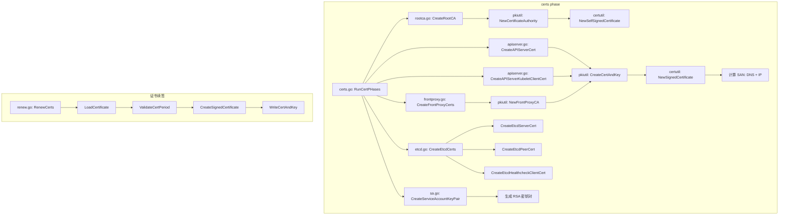

# 证书管理 (PKI Infrastructure)

## 函数/流程签名

```go
func NewPKI(cfg *kubeadmapi.InitConfiguration) (*pkiutil.Certificates, error)
func GenerateRootCA(cfg *kubeadmapi.InitConfiguration) error
func CreateCertAndKeyFiles(caCert *x509.Certificate, caKey crypto.Signer, certConfig *certutil.Config) error
func CreateServiceAccountKeyPair(keyPath, pubPath string) error
func RenewCerts(cfg *kubeadmapi.InitConfiguration) error
func CheckCertExpiration(certDir string) error
func LoadCertificate(certPath string) (*x509.Certificate, error)
func ValidateCertPeriod(cert *x509.Certificate, currentTime time.Time) error
```

## 源码位置

| 文件路径 | 行号范围 | 说明 |
|---------|---------|------|
| `cmd/kubeadm/app/phases/certs/certs.go` | L30-L200 | 证书生成主入口 |
| `cmd/kubeadm/app/phases/certs/rootca.go` | L25-L150 | 根 CA 生成 |
| `cmd/kubeadm/app/phases/certs/apiserver.go` | L30-L200 | API Server 证书生成 |
| `cmd/kubeadm/app/phases/certs/etcd.go` | L25-L250 | etcd 证书生成 |
| `cmd/kubeadm/app/phases/certs/frontproxy.go` | L25-L100 | front-proxy 证书 |
| `cmd/kubeadm/app/util/pkiutil/pki_helpers.go` | L40-L500 | PKI 工具函数 |
| `cmd/kubeadm/app/util/pkiutil/csr.go` | L30-L150 | CSR 生成 |
| `staging/src/k8s.io/client-go/util/cert/cert.go` | L30-L300 | 证书工具库 |

## 参数说明

### 证书生成参数

| 参数名 | 类型 | 说明 | 验证规则 |
|--------|------|------|---------|
| `certificatesDir` | `string` | 证书存储目录 | 默认 `/etc/kubernetes/pki`，必须可写 |
| `caCertFile` | `string` | CA 证书文件路径 | 必须是 PEM 格式 |
| `caKeyFile` | `string` | CA 私钥文件路径 | 必须是 PEM 格式 RSA/ECDSA 密钥 |
| `cfg.APIEndpoint.AdvertiseAddress` | `string` | API Server 广播地址 | 有效 IPv4/IPv6 |
| `cfg.APIServer.CertSANs` | `[]string` | API Server 证书 SAN | 可包含 DNS/IP/URI |
| `cfg.Etcd.Local` | `LocalEtcd` | 本地 etcd 配置 | 包含服务器/对等/客户端证书配置 |

### CertConfig 证书配置

| 参数名 | 类型 | 说明 | 默认值 |
|--------|------|------|--------|
| `CommonName` | `string` | 证书通用名称 | 取决于证书类型 |
| `Organization` | `[]string` | 证书组织 | 取决于证书类型 |
| `NotAfter` | `time.Time` | 过期时间 | CA: 10年, 其他: 1年 |
| `AltNames` | `certutil.AltNames` | Subject Alternative Names | 自动计算 |
| `KeySize` | `int` | RSA 密钥大小 | 2048 (RSA), 256 (ECDSA) |
| `Usages` | `[]x509.KeyUsage` | 密钥用途 | 取决于证书类型 |

## 返回值

| 返回值 | 类型 | 说明 |
|--------|------|------|
| `*x509.Certificate` | `struct` | X.509 证书对象 |
| `crypto.Signer` | `interface` | 私钥签名接口 |
| `CertConfig` | `struct` | 证书配置信息 (CN, SAN, validity) |
| `error` | `error` | 证书操作失败错误 |

## 调用链



## 源码分析

### 证书生成主入口 (certs.go)

```go
// cmd/kubeadm/app/phases/certs/certs.go
// RunCertPhases 执行所有证书生成阶段
func RunCertPhases(cfg *kubeadmapi.InitConfiguration) error {
    // 1. 创建证书目录
    certDir := cfg.CertificatesDir
    if err := os.MkdirAll(certDir, 0755); err != nil {
        return fmt.Errorf("failed to create cert dir: %w", err)
    }

    // 2. 生成根 CA 证书
    //    ca.crt + ca.key (10 年有效期)
    //    所有其他证书由此 CA 签发
    if err := CreateRootCA(cfg); err != nil {
        return fmt.Errorf("failed to create root CA: %w", err)
    }

    // 3. 生成 API Server 证书
    //    apiserver.crt + apiserver.key (1 年有效期)
    //    SAN 包含: node IP, pod CIDR, service CIDR, DNS 名称
    if err := CreateAPIServerCertAndKeyFiles(cfg); err != nil {
        return fmt.Errorf("failed to create apiserver cert: %w", err)
    }

    // 4. 生成 API Server → kubelet 客户端证书
    //    apiserver-kubelet-client.crt + .key
    //    用于 API Server 向 kubelet 发起请求
    if err := CreateAPIServerKubeletClientCertAndKeyFiles(cfg); err != nil {
        return fmt.Errorf("failed to create apiserver-kubelet-client cert: %w", err)
    }

    // 5. 生成 front-proxy CA 和客户端证书
    //    front-proxy-ca.crt + .key
    //    front-proxy-client.crt + .key
    //    用于 API Server 扩展认证代理
    if err := CreateFrontProxyCerts(cfg); err != nil {
        return fmt.Errorf("failed to create front-proxy certs: %w", err)
    }

    // 6. 生成 etcd 证书
    //    etcd/ca.crt + .key (etcd CA)
    //    etcd/server.crt + .key (etcd 服务端)
    //    etcd/peer.crt + .key (etcd 对等通信)
    //    etcd/healthcheck-client.crt + .key (健康检查)
    if err := CreateEtcdCerts(cfg); err != nil {
        return fmt.Errorf("failed to create etcd certs: %w", err)
    }

    // 7. 生成 ServiceAccount 密钥对
    //    sa.pub (公钥) + sa.key (私钥)
    //    用于签发和验证 ServiceAccount Token
    if err := CreateServiceAccountKeyPair(cfg); err != nil {
        return fmt.Errorf("failed to create SA key pair: %w", err)
    }

    return nil
}
```

### 根 CA 生成 (rootca.go)

```go
// cmd/kubeadm/app/phases/certs/rootca.go
// CreateRootCA 生成 Kubernetes 根 CA 证书
func CreateRootCA(cfg *kubeadmapi.InitConfiguration) error {
    // 1. 检查是否已有 CA 证书
    //    如果存在且有效，跳过生成
    caCertPath := filepath.Join(cfg.CertificatesDir, "ca.crt")
    caKeyPath := filepath.Join(cfg.CertificatesDir, "ca.key")
    if _, err := certutil.LoadCert(caCertPath); err == nil {
        fmt.Println("[certs] Using existing CA certificate")
        return nil
    }

    // 2. 配置根 CA 证书参数
    caCertConfig := certutil.Config{
        CommonName:   "kubernetes",           // CN=kubernetes
        Organization: []string{},              // 无组织
        NotAfter:     time.Now().Add(          // 10 年有效期
            10 * 365 * 24 * time.Hour),
        Usages: []x509.KeyUsage{
            x509.KeyUsageKeyEncipherment,      // 密钥加密
            x509.KeyUsageDigitalSignature,     // 数字签名
            x509.KeyUsageCertSign,             // 证书签发
            x509.KeyUsageCRLSign,              // CRL 签发
        },
    }

    // 3. 生成自签名 CA 证书
    //    CA 证书是自签名的，自己签发自己
    caCert, caKey, err := pkiutil.NewCertificateAuthority(
        &caCertConfig,
    )
    if err != nil {
        return fmt.Errorf("failed to create CA: %w", err)
    }

    // 4. 写入 ca.crt (公钥证书, 0644 权限)
    if err := certutil.WriteCert(
        caCertPath,
        certutil.EncodeCertPEM(caCert),
    ); err != nil {
        return err
    }

    // 5. 写入 ca.key (私钥, 0600 权限)
    if err := certutil.WriteKey(
        caKeyPath,
        certutil.EncodePrivateKeyPEM(caKey),
    ); err != nil {
        return err
    }

    fmt.Printf("[certs] Generated CA certificate: %s\n", caCertPath)
    return nil
}
```

### API Server 证书生成 (apiserver.go)

```go
// cmd/kubeadm/app/phases/certs/apiserver.go
// CreateAPIServerCertAndKeyFiles 生成 API Server TLS 证书
func CreateAPIServerCertAndKeyFiles(cfg *kubeadmapi.InitConfiguration) error {
    // 1. 加载根 CA
    caCert, caKey, err := pkiutil.TryLoadCertAndKeyFromDisk(
        cfg.CertificatesDir, "ca",
    )
    if err != nil {
        return fmt.Errorf("failed to load CA: %w", err)
    }

    // 2. 计算 Subject Alternative Names (SAN)
    //    SAN 决定了证书对哪些主机名和 IP 有效
    altNames := certutil.AltNames{
        DNSNames: []string{
            "kubernetes",                           // 短名称
            "kubernetes.default",                   // 默认服务名
            "kubernetes.default.svc",               // 带命名空间
            "kubernetes.default.svc.cluster.local", // FQDN
            "localhost",                            // 本地回环
            cfg.NodeRegistration.Name,              // 节点主机名
        },
        IPs: []net.IP{
            net.ParseIP("127.0.0.1"),               // IPv4 回环
            net.ParseIP("::1"),                     // IPv6 回环
            net.ParseIP(cfg.LocalAPIEndpoint.AdvertiseAddress), // 广播地址
            net.ParseIP("10.96.0.1"),               // Service CIDR 第一个 IP (kubernetes svc)
        },
    }

    // 3. 添加用户指定的 SAN
    //    --apiserver-cert-extra-sans 参数
    for _, san := range cfg.APIServer.CertSANs {
        if ip := net.ParseIP(san); ip != nil {
            altNames.IPs = append(altNames.IPs, ip)
        } else {
            altNames.DNSNames = append(altNames.DNSNames, san)
        }
    }

    // 4. 配置 API Server 证书
    certConfig := certutil.Config{
        CommonName:   "kube-apiserver",             // CN
        Organization: []string{},                    // 无组织
        AltNames:     altNames,
        NotAfter: time.Now().Add(                    // 1 年有效期
            365 * 24 * time.Hour),
        Usages: []x509.KeyUsage{
            x509.KeyUsageKeyEncipherment,
            x509.KeyUsageDigitalSignature,
        },
        ExtKeyUsage: []x509.ExtKeyUsage{
            x509.ExtKeyUsageServerAuth,             // 服务端认证
        },
    }

    // 5. 使用根 CA 签发证书
    cert, key, err := pkiutil.NewCertAndKey(
        caCert, caKey, &certConfig,
    )
    if err != nil {
        return fmt.Errorf("failed to create apiserver cert: %w", err)
    }

    // 6. 写入文件
    return pkiutil.WriteCertAndKey(
        cfg.CertificatesDir, "apiserver", cert, key,
    )
}
```

### etcd 证书生成 (etcd.go)

```go
// cmd/kubeadm/app/phases/certs/etcd.go
// CreateEtcdCerts 生成所有 etcd 相关证书
func CreateEtcdCerts(cfg *kubeadmapi.InitConfiguration) error {
    certDir := filepath.Join(cfg.CertificatesDir, "etcd")
    if err := os.MkdirAll(certDir, 0755); err != nil {
        return err
    }

    // 1. 生成 etcd CA 证书 (独立于 Kubernetes CA)
    etcdCACfg := certutil.Config{
        CommonName: "etcd-ca",
        NotAfter:   time.Now().Add(10 * 365 * 24 * time.Hour),
    }
    etcdCACert, etcdCAKey, err := pkiutil.NewCertificateAuthority(&etcdCACfg)

    // 2. 生成 etcd 服务端证书
    //    etcd/server.crt — etcd 服务端 TLS 证书
    //    SAN: localhost, 127.0.0.1, ::1, advertiseAddress
    serverCfg := certutil.Config{
        CommonName: "etcd-server",
        AltNames: certutil.AltNames{
            DNSNames: []string{"localhost", cfg.NodeRegistration.Name},
            IPs: []net.IP{
                net.ParseIP("127.0.0.1"),
                net.ParseIP("::1"),
                net.ParseIP(cfg.LocalAPIEndpoint.AdvertiseAddress),
            },
        },
        Usages: []x509.KeyUsage{
            x509.KeyUsageKeyEncipherment,
            x509.KeyUsageDigitalSignature,
        },
        ExtKeyUsage: []x509.ExtKeyUsage{
            x509.ExtKeyUsageServerAuth,
            x509.ExtKeyUsageClientAuth,  // 同时用于服务端和客户端
        },
    }

    // 3. 生成 etcd 对等通信证书
    //    etcd/peer.crt — etcd 集群节点间通信
    peerCfg := certutil.Config{
        CommonName: "etcd-peer",
        AltNames:   serverCfg.AltNames,  // 同 server SAN
        ExtKeyUsage: []x509.ExtKeyUsage{
            x509.ExtKeyUsageServerAuth,
            x509.ExtKeyUsageClientAuth,
        },
    }

    // 4. 生成 etcd 健康检查客户端证书
    //    etcd/healthcheck-client.crt — 用于 etcdctl 健康检查
    healthCfg := certutil.Config{
        CommonName: "etcd-healthcheck-client",
        ExtKeyUsage: []x509.ExtKeyUsage{
            x509.ExtKeyUsageClientAuth,
        },
    }

    // 5. 生成 API Server → etcd 客户端证书
    //    apiserver-etcd-client.crt — API Server 连接 etcd
    apiEtcdClientCfg := certutil.Config{
        CommonName: "kube-apiserver-etcd-client",
        ExtKeyUsage: []x509.ExtKeyUsage{
            x509.ExtKeyUsageClientAuth,
        },
    }

    return nil
}
```

### 证书续签 (renew.go)

```go
// cmd/kubeadm/app/cmd/certs/renew.go
// RenewCerts 续签所有证书
func RenewCerts(cfg *kubeadmapi.InitConfiguration) error {
    // 1. 加载现有 CA (CA 不续签)
    caCert, caKey, err := pkiutil.TryLoadCertAndKeyFromDisk(
        cfg.CertificatesDir, "ca",
    )
    if err != nil {
        return fmt.Errorf("failed to load CA: %w", err)
    }

    // 2. 遍历所有证书文件
    certFiles := []string{
        "apiserver",
        "apiserver-kubelet-client",
        "front-proxy-client",
        "etcd/server",
        "etcd/peer",
        "etcd/healthcheck-client",
        "apiserver-etcd-client",
    }

    for _, certName := range certFiles {
        // 3. 加载现有证书
        cert, _, err := pkiutil.TryLoadCertAndKeyFromDisk(
            cfg.CertificatesDir, certName,
        )
        if err != nil {
            fmt.Printf("[renew] Skipping %s: %v\n", certName, err)
            continue
        }

        // 4. 检查证书有效期
        if time.Until(cert.NotAfter) > 30*24*time.Hour {
            fmt.Printf("[renew] Certificate %s is still valid for %d days\n",
                certName, int(time.Until(cert.NotAfter).Hours()/24))
            continue
        }

        // 5. 使用 CA 重新签发证书
        //    保留原始 SAN 和 CN，更新有效期
        newCert, newKey, err := pkiutil.RenewCertificate(
            caCert, caKey, cert,
        )
        if err != nil {
            return fmt.Errorf("failed to renew %s: %w", certName, err)
        }

        // 6. 写入新证书
        if err := pkiutil.WriteCertAndKey(
            cfg.CertificatesDir, certName, newCert, newKey,
        ); err != nil {
            return err
        }

        fmt.Printf("[renew] Renewed certificate: %s\n", certName)
    }

    return nil
}
```

## 执行流程

### 证书生成顺序

```
步骤 1: 创建 /etc/kubernetes/pki/ 目录
    ↓
步骤 2: 生成根 CA (ca.crt + ca.key)
    → CN=kubernetes, 有效期 10 年
    → 自签名证书
    ↓
步骤 3: 生成 API Server 证书 (apiserver.crt + .key)
    → CN=kube-apiserver, 有效期 1 年
    → SAN: kubernetes, kubernetes.default, node IP, service CIDR
    → 由根 CA 签发
    ↓
步骤 4: 生成 API Server → kubelet 客户端证书
    → CN=kube-apiserver-kubelet-client
    → O=system:masters
    → 由根 CA 签发
    ↓
步骤 5: 生成 front-proxy CA (独立 CA)
    → CN=front-proxy-ca, 有效期 10 年
    ↓
步骤 6: 生成 front-proxy 客户端证书
    → CN=front-proxy-client
    → 由 front-proxy CA 签发
    ↓
步骤 7: 创建 /etc/kubernetes/pki/etcd/ 目录
    ↓
步骤 8: 生成 etcd CA (独立于 K8s CA)
    → CN=etcd-ca, 有效期 10 年
    ↓
步骤 9: 生成 etcd 服务端证书 (server.crt)
    → CN=etcd-server, ExtKeyUsage: serverAuth + clientAuth
    ↓
步骤 10: 生成 etcd 对等证书 (peer.crt)
    → CN=etcd-peer
    ↓
步骤 11: 生成 etcd 健康检查客户端证书
    → CN=etcd-healthcheck-client
    ↓
步骤 12: 生成 API Server → etcd 客户端证书
    → CN=kube-apiserver-etcd-client
    ↓
步骤 13: 生成 ServiceAccount 密钥对
    → sa.pub + sa.key (RSA 2048)
    → 不含证书，只有密钥对
```

## 使用场景

### 场景 1: 检查证书有效期

```bash
# 检查所有证书有效期
kubeadm certs check-expiration
# 输出:
# [check-expiration] Reading configuration from the cluster...
# CERTIFICATE                EXPIRES                  RESIDUAL TIME   CERTIFICATE AUTHORITY   EXTERNALLY MANAGED
# apiserver                  Dec 20, 2024 00:00 UTC   364d            ca                      no
# apiserver-kubelet-client   Dec 20, 2024 00:00 UTC   364d            ca                      no
# front-proxy-client         Dec 20, 2024 00:00 UTC   364d            front-proxy-ca          no
# etcd-server                Dec 20, 2024 00:00 UTC   364d            etcd-ca                 no
# etcd-peer                  Dec 20, 2024 00:00 UTC   364d            etcd-ca                 no
# etcd-healthcheck-client    Dec 20, 2024 00:00 UTC   364d            etcd-ca                 no
# apiserver-etcd-client      Dec 20, 2024 00:00 UTC   364d            etcd-ca                 no
#
# CERTIFICATE AUTHORITY   EXPIRES                  RESIDUAL TIME   EXTERNALLY MANAGED
# ca                      Dec 20, 2033 00:00 UTC   9y              no
# front-proxy-ca          Dec 20, 2033 00:00 UTC   9y              no
# etcd-ca                 Dec 20, 2033 00:00 UTC   9y              no
```

### 场景 2: 手动续签证书

```bash
# 续签所有证书
kubeadm certs renew all
# [renew] Certificate apiserver renewed successfully
# [renew] Certificate apiserver-kubelet-client renewed successfully
# [renew] Certificate front-proxy-client renewed successfully
# [renew] Certificate etcd-server renewed successfully
# [renew] Certificate etcd-peer renewed successfully
# [renew] Certificate etcd-healthcheck-client renewed successfully
# [renew] Certificate apiserver-etcd-client renewed successfully

# 续签后需要重启控制面组件
# kubelet 会自动检测证书变化并重启 static Pod
kill -SIGHUP $(pidof kube-apiserver)
kill -SIGHUP $(pidof kube-controller-manager)
kill -SIGHUP $(pidof kube-scheduler)

# 或者重启 kubelet (更彻底)
systemctl restart kubelet
```

### 场景 3: 添加 API Server SAN

```bash
# 需要添加新 IP 或域名到 API Server 证书
# 1. 备份现有证书
cp /etc/kubernetes/pki/apiserver.crt /etc/kubernetes/pki/apiserver.crt.bak
cp /etc/kubernetes/pki/apiserver.key /etc/kubernetes/pki/apiserver.key.bak

# 2. 重新生成 API Server 证书 (包含新 SAN)
kubeadm certs generate apiserver \
  --apiserver-cert-extra-sans=lb.example.com \
  --apiserver-cert-extra-sans=192.168.1.100

# 3. 重启 API Server
crictl stop $(crictl ps --name kube-apiserver -q)
# kubelet 会自动用新证书重启
```

### 场景 4: 使用外部 CA

```yaml
# external-ca-config.yaml
apiVersion: kubeadm.k8s.io/v1beta3
kind: ClusterConfiguration
certificatesDir: "/etc/kubernetes/pki"
# 不自动生成 CA，使用已有的外部 CA
apiServer:
  extraArgs:
    client-ca-file: "/etc/kubernetes/pki/ca.crt"
    tls-cert-file: "/etc/kubernetes/pki/apiserver.crt"
    tls-private-key-file: "/etc/kubernetes/pki/apiserver.key"
```

## 配置示例

### 完整证书文件树

```
/etc/kubernetes/pki/
├── ca.crt                    # Kubernetes 根 CA 证书 (10年)
├── ca.key                    # Kubernetes 根 CA 私钥 (10年)
├── apiserver.crt             # API Server TLS 证书 (1年)
├── apiserver.key             # API Server TLS 私钥 (1年)
├── apiserver-kubelet-client.crt  # API Server → kubelet 客户端证书
├── apiserver-kubelet-client.key
├── apiserver-etcd-client.crt     # API Server → etcd 客户端证书
├── apiserver-etcd-client.key
├── front-proxy-ca.crt        # 前端代理 CA 证书 (10年)
├── front-proxy-ca.key
├── front-proxy-client.crt    # 前端代理客户端证书
├── front-proxy-client.key
├── sa.pub                    # ServiceAccount 公钥
├── sa.key                    # ServiceAccount 私钥
└── etcd/
    ├── ca.crt                # etcd CA 证书 (10年)
    ├── ca.key
    ├── server.crt            # etcd 服务端证书
    ├── server.key
    ├── peer.crt              # etcd 对等通信证书
    ├── peer.key
    ├── healthcheck-client.crt # etcd 健康检查证书
    └── healthcheck-client.key
```

### 证书用途对照表

```yaml
# 证书用途参考
certificates:
  ca:
    cn: "kubernetes"
    validity: "10 years"
    usage: "签发所有其他证书"
    files: ["ca.crt", "ca.key"]

  apiserver:
    cn: "kube-apiserver"
    validity: "1 year"
    usage: "API Server TLS 服务端证书"
    san_includes:
      - "kubernetes"
      - "kubernetes.default"
      - "kubernetes.default.svc"
      - "kubernetes.default.svc.cluster.local"
      - "localhost"
      - "节点 IP"
      - "10.96.0.1 (kubernetes service ClusterIP)"
    files: ["apiserver.crt", "apiserver.key"]

  apiserver-kubelet-client:
    cn: "kube-apiserver-kubelet-client"
    org: "system:masters"
    validity: "1 year"
    usage: "API Server 向 kubelet 发起 TLS 请求"
    files: ["apiserver-kubelet-client.crt", "apiserver-kubelet-client.key"]

  front-proxy-client:
    cn: "front-proxy-client"
    validity: "1 year"
    usage: "API Server 扩展认证代理"
    files: ["front-proxy-client.crt", "front-proxy-client.key"]

  etcd-server:
    cn: "etcd-server"
    validity: "1 year"
    usage: "etcd 服务端 TLS (同时用于客户端认证)"
    files: ["etcd/server.crt", "etcd/server.key"]

  etcd-peer:
    cn: "etcd-peer"
    validity: "1 year"
    usage: "etcd 集群内对等通信"
    files: ["etcd/peer.crt", "etcd/peer.key"]
```

## 实战示例

### 查看证书详情

```bash
# 查看 API Server 证书详情
openssl x509 -in /etc/kubernetes/pki/apiserver.crt -text -noout
# Certificate:
#     Data:
#         Version: 3 (0x2)
#         Serial Number: 1234567890 (0x499602d2)
#     Signature Algorithm: sha256WithRSAEncryption
#         Issuer: CN=kubernetes
#         Validity
#             Not Before: Dec 20 00:00:00 2023 GMT
#             Not After : Dec 20 00:00:00 2024 GMT
#         Subject: CN=kube-apiserver
#         Subject Public Key Info:
#             Public Key Algorithm: rsaEncryption
#                 Public-Key: (2048 bit)
#         X509v3 extensions:
#             X509v3 Key Usage: critical
#                 Digital Signature, Key Encipherment
#             X509v3 Extended Key Usage:
#                 TLS Web Server Authentication
#             X509v3 Subject Alternative Name:
#                 DNS:kubernetes, DNS:kubernetes.default,
#                 DNS:kubernetes.default.svc,
#                 DNS:kubernetes.default.svc.cluster.local,
#                 DNS:localhost, DNS:master,
#                 IP Address:127.0.0.1, IP Address:10.96.0.1,
#                 IP Address:192.168.1.10

# 验证证书链
openssl verify -CAfile /etc/kubernetes/pki/ca.crt \
  /etc/kubernetes/pki/apiserver.crt
# /etc/kubernetes/pki/apiserver.crt: OK

# 查看 etcd 证书
openssl x509 -in /etc/kubernetes/pki/etcd/server.crt -text -noout | grep -A2 "Subject Alternative"
```

### 证书过期告警脚本

```bash
#!/bin/bash
# 检查证书过期并发送告警
THRESHOLD_DAYS=30
CERT_DIR="/etc/kubernetes/pki"

for cert in $(find "$CERT_DIR" -name "*.crt" -type f); do
    expiry=$(openssl x509 -in "$cert" -noout -enddate | cut -d= -f2)
    expiry_epoch=$(date -d "$expiry" +%s)
    now_epoch=$(date +%s)
    days_left=$(( (expiry_epoch - now_epoch) / 86400 ))

    if [ "$days_left" -lt "$THRESHOLD_DAYS" ]; then
        echo "WARNING: $cert expires in $days_left days ($expiry)"
    fi
done
```

## 常见错误

| 错误 | 原因 | 解决方案 |
|------|------|---------|
| `certificate has expired or is not yet valid` | 证书过期 | `kubeadm certs renew all` |
| `x509: certificate signed by unknown authority` | CA 不匹配 | 确认使用正确的 CA 证书 |
| `x509: certificate is valid for X, not Y` | SAN 不包含目标地址 | 添加 `--apiserver-cert-extra-sans` |
| `tls: private key does not match public key` | 证书/密钥对不匹配 | 重新生成证书密钥对 |
| `failed to load CA certificate` | CA 文件损坏或缺失 | 从备份恢复或重新初始化 |
| `certificate signing request denied` | CSR 被拒绝 | 检查 RBAC 权限和 CSR 审批策略 |
| `cannot validate certificate` | 证书链不完整 | 确保 CA 证书包含完整链 |
| `etcd certificate SAN error` | etcd 证书 SAN 不含节点 IP | 重新生成 etcd 证书 |

## 相关函数

- [集群概览](01-overview.md) — init 流程中 certs phase 的位置
- [预检流程](02-preflight.md) — 预检中检查证书有效期
- [控制面组件](05-control-plane.md) — static Pod 挂载证书
- [etcd 管理](07-etcd.md) — etcd 使用证书进行 TLS 通信
- [安全机制]([[domain-02-workloads-applications/topic-functions/cluster-create/16-security|16-security]].md) — ServiceAccount 密钥和审计
- [集群升级](09-upgrade.md) — 升级时自动续签证书
- [高可用进阶](14-ha-advanced.md) — upload-certs 分发证书
