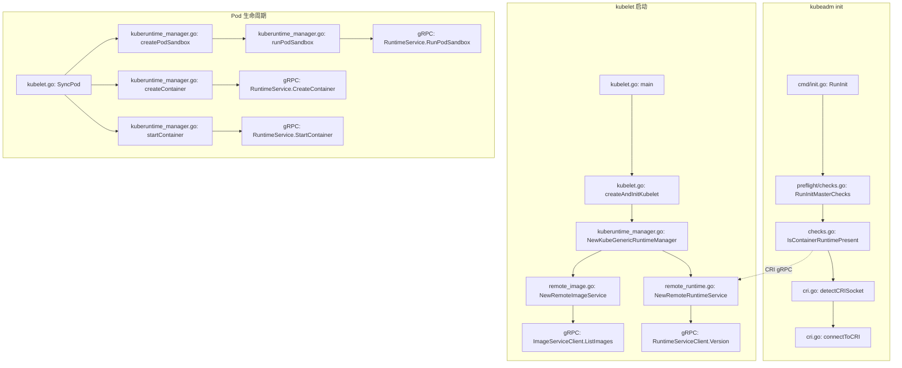

title: CRI 运行时管理 (Container Runtime Interface)
description: '# CRI 运行时管理 (Container Runtime Interface)'
category: functions
tags:
- k8s
- operations
- cluster-management
- etcd
- apiserver
- kubelet
- scheduler
- controller-manager
- cilium
- flannel
last_updated: '2026-05-18'
difficulty: advanced
reading_level: advanced
audience:
- Kubernetes开发者
- DevOps工程师
- SRE
- 云原生工程师
estimated_read_time: 5min
intent_queries:
- Kubernetes CRI containerd docker runtime management
- kubeadm CRI socket configuration container runtime
- containerd vs CRI-O Kubernetes runtime comparison
- Kata Containers gVisor runtimeclass Kubernetes
- CRI API version compatibility Kubernetes
trigger_keywords:
- CRI
- containerd
- CRI-O
- docker
- Kata Containers
- gVisor
- RuntimeClass
- crictl
- OCI runtime
- runc
- pause container
related_domains:
- domain-01-cluster-fundamentals
- domain-10-troubleshooting-diagnostics
related_topics:
- kubeadm init
- kubelet
- containerd
- CNI networking
- security
authors:
- name: KUDIG Team
  role: contributor
k8s_versions:
- '1.28'
- '1.29'
- '1.30'
- '1.31'
- '1.32'
---

# CRI 运行时管理 (Container Runtime Interface)

## 函数/流程签名

```go
func NewCRIRuntimeManager(runtimeEndpoint string, imageEndpoint string) (*RuntimeManager, error)
func (m *RuntimeManager) PullImage(image string, auth AuthConfig) (string, error)
func (m *RuntimeManager) ListContainers(filter *runtimeapi.ContainerFilter) ([]*runtimeapi.Container, error)
func (m *RuntimeManager) RemoveContainer(containerID string) error
func (m *RuntimeManager) StartContainer(containerID string) error
func (m *RuntimeManager) StopContainer(containerID string, timeout int64) error
```

## 源码位置

| 文件路径 | 说明 |
|---------|------|
| `cmd/kubeadm/app/cmd/init.go` | kubeadm init 入口，调用 CRI 预检 |
| `cmd/kubeadm/app/preflight/checks.go` | CRI 连通性检查 |
| `pkg/kubelet/cri/` | kubelet CRI 接口实现 |
| `pkg/kubelet/cri/remote/remote_runtime.go` | 远程 CRI runtime 客户端 |
| `pkg/kubelet/cri/remote/remote_image.go` | 远程 CRI image 客户端 |
| `pkg/kubelet/cri/streaming/` | CRI streaming (exec/attach/port-forward) |
| `staging/src/k8s.io/cri-api/pkg/apis/runtime/v1/` | CRI API 定义 (protobuf) |
| `pkg/kubelet/kuberuntime/` | kubelet 内部 CRI 管理器 |
| `pkg/kubelet/kuberuntime/kuberuntime_manager.go` | RuntimeManager 结构体 |

## 参数说明

### CRI Runtime 接口参数

| 参数名 | 类型 | 说明 | 验证规则 |
|--------|------|------|---------|
| `runtimeEndpoint` | `string` | CRI runtime gRPC 端点地址 | 必须是 unix socket 或 tcp 地址 |
| `imageEndpoint` | `string` | CRI image service 端点地址 | 为空时使用 runtimeEndpoint |
| `runtimeHandler` | `string` | 运行时处理器名称 (用于 RuntimeClass) | 必须匹配已注册的 RuntimeClass |
| `timeout` | `time.Duration` | CRI 操作超时时间 | 默认 2 分钟 |
| `containerID` | `string` | 容器唯一标识符 | 必须符合 CRI ID 格式 |
| `imageSpec` | `runtimeapi.ImageSpec` | 镜像规范 | image 字段不能为空 |
| `podSandboxConfig` | `runtimeapi.PodSandboxConfig` | Pod 沙箱配置 | 包含 metadata, dns, port_mappings |

### kubelet CRI 启动参数

| 参数名 | 类型 | 说明 | 默认值 |
|--------|------|------|--------|
| `--container-runtime-endpoint` | `string` | CRI runtime endpoint | `unix:///var/run/containerd/containerd.sock` |
| `--image-service-endpoint` | `string` | CRI image service endpoint | 同 runtime endpoint |
| `--runtime-request-timeout` | `duration` | 所有 CRI 请求超时 | `2m` |
| `--container-runtime` | `string` | 容器运行时类型 (已废弃) | `remote` |

## 返回值

| 返回值 | 类型 | 说明 |
|--------|------|------|
| `RuntimeManager` | `*struct` | CRI 运行时管理器实例，封装了 runtime 和 image 服务客户端 |
| `ContainerStatus` | `*runtimeapi.ContainerStatus` | 容器状态信息 (Running/Exited/Unknown) |
| `Image` | `*runtimeapi.Image` | 镜像信息 (ID, RepoTags, RepoDigests, Size) |
| `PodSandboxStatus` | `*runtimeapi.PodSandboxStatus` | Pod 沙箱状态 (Network, Linux namespaces) |
| `error` | `error` | CRI 操作失败时返回的错误信息 |

## 调用链



## 源码分析

### CRI 预检 (preflight/checks.go)

```go
// cmd/kubeadm/app/preflight/checks.go
// IsContainerRuntimePresent 检查节点上是否有可用的容器运行时
func IsContainerRuntimePresent() error {
    // 1. 检测 CRI socket 文件
    //    优先级: containerd > crio > docker
    sockets := []string{
        "/var/run/containerd/containerd.sock",  // containerd (默认)
        "/var/run/crio/crio.sock",              // CRI-O
        "/var/run/dockershim.sock",             // docker (已废弃)
    }

    for _, socket := range sockets {
        if _, err := os.Stat(socket); err == nil {
            // 2. 尝试通过 CRI gRPC 连接
            runtimeSvc, err := remote.NewRemoteRuntimeService(
                socket,         // unix socket 路径
                5*time.Second,  // 连接超时
            )
            if err != nil {
                continue // 连接失败，尝试下一个
            }
            defer runtimeSvc.Close()

            // 3. 调用 Version API 确认运行时可用
            version, err := runtimeSvc.Version(
                context.TODO(),
                &runtimeapi.VersionRequest{},  // CRI API 版本请求
            )
            if err != nil {
                return fmt.Errorf("CRI runtime version check failed: %w", err)
            }

            // 4. 验证 CRI API 版本兼容性
            if version.RuntimeApiVersion < "0.1.0" {
                return fmt.Errorf("unsupported CRI API version: %s", version.RuntimeApiVersion)
            }

            return nil // 运行时可用
        }
    }

    // 5. 所有 socket 都不可用
    return errors.New("[ERROR CRI]: container runtime is not ready")
}
```

### RuntimeManager 初始化 (kuberuntime_manager.go)

```go
// pkg/kubelet/kuberuntime/kuberuntime_manager.go
// NewKubeGenericRuntimeManager 创建通用的 CRI 运行时管理器
func NewKubeGenericRuntimeManager(
    recorder record.EventRecorder,          // 事件记录器
    livenessManager proberesults.Manager,    // 存活探针管理器
    startupManager proberesults.Manager,     // 启动探针管理器
    seccompDefault bool,                    // 是否启用默认 seccomp profile
    containerRefManager *kubecontainer.RefContainer,
    machineInfo *cadvisorapi.MachineInfo,   // 节点信息
    podStateProvider podStateProvider,      // Pod 状态提供者
) (KubeGenericRuntime, error) {
    // 1. 初始化运行时服务客户端
    //    runtimeService 封装 gRPC 调用到 CRI runtime
    runtimeService, err := remote.NewRemoteRuntimeService(
        getRuntimeEndpoint(),  // 从 kubelet 参数获取
        runtimeRequestTimeout, // 默认 2 分钟
    )
    if err != nil {
        return nil, fmt.Errorf("failed to create runtime service: %w", err)
    }

    // 2. 初始化镜像服务客户端
    //    imageService 封装 gRPC 调用到 CRI image service
    imageService, err := remote.NewRemoteImageService(
        getImageEndpoint(),    // 从 kubelet 参数获取
        runtimeRequestTimeout,
    )
    if err != nil {
        return nil, fmt.Errorf("failed to create image service: %w", err)
    }

    // 3. 创建 RuntimeManager 结构体
    //    管理容器和镜像的所有操作
    manager := &kubeGenericRuntimeManager{
        recorder:            recorder,
        containerRefManager: containerRefManager,
        runtimeService:      runtimeService,  // CRI runtime 客户端
        imageService:        imageService,    // CRI image 客户端
        machineInfo:         machineInfo,
        seccompDefault:      seccompDefault,
    }

    // 4. 获取运行时类型和版本信息
    //    用于后续决定容器创建策略
    typeVersion, err := manager.getTypedVersion()
    if err != nil {
        return nil, fmt.Errorf("failed to get runtime type/version: %w", err)
    }

    // 5. 根据 runtime 类型设置不同的操作参数
    manager.runtime = typeVersion
    manager.os = goruntime.GOOS

    return manager, nil
}
```

### Pod 沙箱创建 (kuberuntime_manager.go)

```go
// pkg/kubelet/kuberuntime/kuberuntime_manager.go
// runPodSandbox 创建并启动 Pod 沙箱 (pause 容器)
func (m *kubeGenericRuntimeManager) runPodSandbox(
    ctx context.Context,
    pod *v1.Pod,                              // Pod 对象
    config *runtimeapi.PodSandboxConfig,      // 沙箱配置
    runtimeHandler string,                    // RuntimeClass handler
) (string, error) {
    // 1. 选择 runtime handler
    //    如果 Pod 指定了 RuntimeClass，使用对应的 handler
    var runPodSandboxFunc func() (string, error)
    if runtimeHandler != "" {
        runPodSandboxFunc = func() (string, error) {
            return m.runtimeService.RunPodSandbox(
                ctx,
                config,
                runtimeHandler,  // 例如 "runc", "kata-containers"
            )
        }
    } else {
        runPodSandboxFunc = func() (string, error) {
            return m.runtimeService.RunPodSandbox(ctx, config, "")
        }
    }

    // 2. 调用 CRI gRPC 创建沙箱
    //    内部实现:
    //    - 创建 network namespace
    //    - 启动 pause 容器 (共享网络命名空间)
    //    - 设置 Pod cgroup
    podSandboxID, err := runPodSandboxFunc()
    if err != nil {
        return "", fmt.Errorf("failed to run pod sandbox: %w", err)
    }

    // 3. 等待沙箱网络就绪
    //    CNI 插件在此阶段为 Pod 分配 IP
    if err := m.waitSandboxReady(podSandboxID); err != nil {
        // 网络未就绪，清理沙箱
        m.runtimeService.RemovePodSandbox(ctx, podSandboxID)
        return "", fmt.Errorf("sandbox network not ready: %w", err)
    }

    // 4. 设置沙箱网络
    //    调用 CNI 插件配置网络
    if err := m.setupSandboxNetwork(podSandboxID, pod, config); err != nil {
        m.runtimeService.RemovePodSandbox(ctx, podSandboxID)
        return "", fmt.Errorf("failed to setup sandbox network: %w", err)
    }

    return podSandboxID, nil
}
```

### 容器创建与启动 (kuberuntime_manager.go)

```go
// pkg/kubelet/kuberuntime/kuberuntime_manager.go
// createContainer 在 Pod 沙箱中创建容器
func (m *kubeGenericRuntimeManager) createContainer(
    ctx context.Context,
    pod *v1.Pod,                              // Pod 对象
    container *v1.Container,                  // 容器规格
    podSandboxID string,                      // Pod 沙箱 ID
    podSandboxConfig *runtimeapi.PodSandboxConfig,
) (string, error) {
    // 1. 生成容器配置
    //    将 Kubernetes ContainerSpec 转换为 CRI ContainerConfig
    containerConfig, err := m.generateContainerConfig(
        container, pod, podSandboxID,
    )
    if err != nil {
        return "", fmt.Errorf("failed to generate container config: %w", err)
    }

    // 2. 拉取镜像 (如果本地不存在)
    imageSpec := &runtimeapi.ImageSpec{
        Image: container.Image,  // 例如 "nginx:1.25"
    }
    imageStatus, err := m.imageService.ImageStatus(
        ctx, imageSpec,
    )
    if err != nil || imageStatus == nil {
        // 镜像不存在，拉取
        if _, err := m.imageService.PullImage(
            ctx, imageSpec, nil, // authConfig 为 nil (公开镜像)
        ); err != nil {
            return "", fmt.Errorf("failed to pull image %s: %w", container.Image, err)
        }
    }

    // 3. 调用 CRI CreateContainer
    //    注意: Create 只是创建，不会启动
    containerID, err := m.runtimeService.CreateContainer(
        ctx,
        podSandboxID,       // 容器所在的 Pod 沙箱
        containerConfig,    // 容器配置
        podSandboxConfig,   // 沙箱配置 (提供 namespace 信息)
    )
    if err != nil {
        return "", fmt.Errorf("failed to create container: %w", err)
    }

    return containerID, nil
}

// startContainer 启动已创建的容器
func (m *kubeGenericRuntimeManager) startContainer(
    ctx context.Context,
    containerID string,     // 容器 ID
    pod *v1.Pod,
    container *v1.Container,
) error {
    // 1. 启动容器
    if err := m.runtimeService.StartContainer(ctx, containerID); err != nil {
        return fmt.Errorf("failed to start container %q: %w", containerID, err)
    }

    // 2. 启动后处理
    //    - 记录容器启动事件
    //    - 启动存活/就绪探针
    //    - 设置容器 termination message 路径
    m.recorder.Eventf(pod, v1.EventTypeNormal,
        "Started container", "Started container %s", container.Name)

    return nil
}
```

### CRI gRPC 客户端 (remote_runtime.go)

```go
// pkg/kubelet/cri/remote/remote_runtime.go
// RemoteRuntimeService 封装 CRI runtime service gRPC 客户端
type RemoteRuntimeService struct {
    client    runtimeapi.RuntimeServiceClient // gRPC 客户端
    timeout   time.Duration                    // 默认超时
    // ...
}

// Version 获取运行时版本信息
func (r *RemoteRuntimeService) Version(
    ctx context.Context,
    req *runtimeapi.VersionRequest,
) (*runtimeapi.VersionResponse, error) {
    // 设置超时上下文
    ctx, cancel := context.WithTimeout(ctx, r.timeout)
    defer cancel()

    // 调用 CRI gRPC Version 方法
    // 等价于: crictl version
    resp, err := r.client.Version(ctx, req)
    if err != nil {
        return nil, err
    }

    return resp, nil
}

// RunPodSandbox 创建并启动 Pod 沙箱
func (r *RemoteRuntimeService) RunPodSandbox(
    ctx context.Context,
    config *runtimeapi.PodSandboxConfig,
    runtimeHandler string,
) (string, error) {
    ctx, cancel := context.WithTimeout(ctx, r.timeout)
    defer cancel()

    // 构建 CRI 请求
    req := &runtimeapi.RunPodSandboxRequest{
        Config:         config,         // Pod 沙箱配置
        RuntimeHandler: runtimeHandler, // RuntimeClass handler
    }

    // 调用 gRPC
    resp, err := r.client.RunPodSandbox(ctx, req)
    if err != nil {
        return "", err
    }

    // 返回 Pod 沙箱 ID
    return resp.PodSandboxId, nil
}
```

## 执行流程

### kubeadm init 中的 CRI 检测流程

```
步骤 1: kubeadm init 启动
    ↓
步骤 2: preflight 阶段调用 RunInitMasterChecks()
    ↓
步骤 3: IsContainerRuntimePresent() 检查 CRI 运行时
    ↓
步骤 4: 依次检测 socket 文件:
    - /var/run/containerd/containerd.sock (containerd)
    - /var/run/crio/crio.sock (CRI-O)
    - /var/run/dockershim.sock (已废弃)
    ↓
步骤 5: 找到可用 socket 后，建立 gRPC 连接
    ↓
步骤 6: 调用 CRI Version API 验证连通性
    ↓
步骤 7: 验证 CRI API 版本兼容性 (>= v0.1.0)
    ↓
步骤 8: 记录 runtimeEndpoint 到 InitConfiguration
    ↓
步骤 9: 后续阶段使用该端点拉取镜像和创建容器
```

### kubelet CRI 交互流程

```
步骤 1: kubelet 启动，创建 RuntimeManager
    ↓
步骤 2: 连接 CRI runtime service (gRPC unix socket)
    ↓
步骤 3: 连接 CRI image service (gRPC unix socket)
    ↓
步骤 4: 收到 Pod 调度通知 (从 API Server watch)
    ↓
步骤 5: 调用 RunPodSandbox (创建 pause 容器 + 网络命名空间)
    ↓
步骤 6: CNI 插件为沙箱分配 IP 地址
    ↓
步骤 7: 对每个容器: PullImage → CreateContainer → StartContainer
    ↓
步骤 8: 启动存活/就绪探针监控
    ↓
步骤 9: 上报 Pod 状态到 API Server
```

### containerd 内部处理流程

```
步骤 1: kubelet 发送 CRI gRPC 请求到 containerd socket
    ↓
步骤 2: containerd CRI plugin 接收请求
    ↓
步骤 3: 解析请求参数 (镜像名、容器配置等)
    ↓
步骤 4: 调用 containerd core API:
    - Pull: 从 registry 拉取镜像
    - Create: 创建 container (snapshot + rootfs)
    - Task: 创建 OCI runtime task
    ↓
步骤 5: 调用 OCI runtime (runc/kata) 运行容器
    ↓
步骤 6: 返回结果给 kubelet
```

## 使用场景

### 场景 1: 自定义 Containerd 配置

在 kubeadm init 前配置 containerd:

```toml
# /etc/containerd/config.toml
version = 2

[plugins."io.containerd.grpc.v1.cri"]
  # CRI sandbox 镜像 (pause 容器)
  sandbox_image = "registry.k8s.io/pause:3.9"

  # 容器运行时类型
  [plugins."io.containerd.grpc.v1.cri".containerd]
    default_runtime_name = "runc"

    [plugins."io.containerd.grpc.v1.cri".containerd.runtimes.runc]
      runtime_type = "io.containerd.runc.v2"
      runtime_engine = ""
      runtime_root = ""

      # cgroup 驱动 (必须与 kubelet 一致)
      [plugins."io.containerd.grpc.v1.cri".containerd.runtimes.runc.options]
        SystemdCgroup = true  # 使用 systemd cgroup driver

  # 镜像拉取配置
  [plugins."io.containerd.grpc.v1.cri".registry]
    [plugins."io.containerd.grpc.v1.cri".registry.mirrors]
      [plugins."io.containerd.grpc.v1.cri".registry.mirrors."docker.io"]
        endpoint = ["https://registry-1.docker.io"]
      [plugins."io.containerd.grpc.v1.cri".registry.mirrors."registry.k8s.io"]
        endpoint = ["https://registry.k8s.io"]

  # 私有仓库认证
  [plugins."io.containerd.grpc.v1.cri".registry.configs]
    [plugins."io.containerd.grpc.v1.cri".registry.configs."registry.example.com".auth]
      username = "admin"
      password = "password"
```

### 场景 2: 使用 Kata Containers (安全容器)

```yaml
# RuntimeClass 定义
apiVersion: node.k8s.io/v1
kind: RuntimeClass
metadata:
  name: kata-containers
handler: kata-containers        # 对应 CRI runtime handler
overhead:
  podFixed:
    memory: "160Mi"             # 额外内存开销
    cpu: "100m"                 # 额外 CPU 开销
scheduling:
  nodeSelector:
    kata-containers.io/runtime: "true"  # 只调度到支持 kata 的节点
  tolerations:
  - effect: NoExecute
    key: kata-containers.io/runtime
    operator: Equal
    value: "true"

---
# 使用 RuntimeClass 的 Pod
apiVersion: v1
kind: Pod
metadata:
  name: secure-pod
spec:
  runtimeClassName: kata-containers  # 使用 kata 运行时
  containers:
  - name: app
    image: nginx:1.25
    securityContext:
      readOnlyRootFilesystem: true
```

### 场景 3: gVisor (沙箱运行时)

```yaml
# gVisor RuntimeClass
apiVersion: node.k8s.io/v1
kind: RuntimeClass
metadata:
  name: gvisor
handler: runsc   # gVisor runsc handler

---
# Pod 使用 gVisor
apiVersion: v1
kind: Pod
metadata:
  name: gvisor-pod
spec:
  runtimeClassName: gvisor
  containers:
  - name: app
    image: nginx:1.25
```

### 场景 4: 离线环境镜像预拉取

```bash
# 1. 导出镜像
docker pull registry.k8s.io/pause:3.9
docker pull registry.k8s.io/kube-apiserver:v1.28.0
docker pull registry.k8s.io/kube-controller-manager:v1.28.0
docker pull registry.k8s.io/kube-scheduler:v1.28.0
docker pull registry.k8s.io/kube-proxy:v1.28.0
docker pull registry.k8s.io/etcd:3.5.9-0
docker pull registry.k8s.io/coredns/coredns:v1.10.1

# 2. 保存为 tar
docker save -o k8s-images.tar \
  registry.k8s.io/pause:3.9 \
  registry.k8s.io/kube-apiserver:v1.28.0 \
  registry.k8s.io/kube-controller-manager:v1.28.0 \
  registry.k8s.io/kube-scheduler:v1.28.0 \
  registry.k8s.io/kube-proxy:v1.28.0 \
  registry.k8s.io/etcd:3.5.9-0 \
  registry.k8s.io/coredns/coredns:v1.10.1

# 3. 传输到目标节点
scp k8s-images.tar root@node:/tmp/

# 4. 在目标节点导入
ctr -n=k8s.io images import /tmp/k8s-images.tar

# 5. 验证镜像
crictl images
```

### 场景 5: containerd 降级问题排除

```bash
# containerd 不可用时，查看状态
systemctl status containerd

# 查看 containerd 日志
journalctl -u containerd -n 100 --no-pager

# 检查 containerd 配置
containerd config dump

# 重启 containerd
systemctl restart containerd

# 检查 CRI 连通性
crictl --runtime-endpoint unix:///var/run/containerd/containerd.sock info

# 输出:
# {
#   "status": {
#     "conditions": [
#       {"type": "RuntimeReady", "status": true},
#       {"type": "NetworkReady", "status": true}
#     ]
#   }
# }
```

## 配置示例

### kubeadm 使用 containerd

```yaml
# kubeadm-init-config.yaml
apiVersion: kubeadm.k8s.io/v1beta3
kind: InitConfiguration
nodeRegistration:
  criSocket: unix:///var/run/containerd/containerd.sock
  name: master-1
  taints:
  - effect: NoSchedule
    key: node-role.kubernetes.io/control-plane
---
apiVersion: kubeadm.k8s.io/v1beta3
kind: ClusterConfiguration
kubernetesVersion: v1.28.0
imageRepository: registry.k8s.io
---
apiVersion: kubelet.config.k8s.io/v1beta1
kind: KubeletConfiguration
cgroupDriver: systemd
containerRuntimeEndpoint: unix:///var/run/containerd/containerd.sock
```

### kubeadm 使用 CRI-O

```yaml
# kubeadm-init-config-crio.yaml
apiVersion: kubeadm.k8s.io/v1beta3
kind: InitConfiguration
nodeRegistration:
  criSocket: unix:///var/run/crio/crio.sock
  name: master-1
---
apiVersion: kubelet.config.k8s.io/v1beta1
kind: KubeletConfiguration
cgroupDriver: systemd
containerRuntimeEndpoint: unix:///var/run/crio/crio.sock
```

### containerd 使用私有镜像仓库

```toml
# /etc/containerd/config.toml - 私有仓库配置
version = 2

[plugins."io.containerd.grpc.v1.cri".registry.configs."harbor.example.com"]
  [plugins."io.containerd.grpc.v1.cri".registry.configs."harbor.example.com".tls]
    insecure_skip_verify = true  # 跳过 TLS 验证 (仅测试环境)
  [plugins."io.containerd.grpc.v1.cri".registry.configs."harbor.example.com".auth]
    username = "robot$k8s"
    password = "Harbor12345"

[plugins."io.containerd.grpc.v1.cri".registry.mirrors."harbor.example.com"]
  endpoint = ["https://harbor.example.com"]
```

## 实战示例

### crictl 常用命令

```bash
# 查看 CRI 运行时信息
crictl info
# 输出:
# {
#   "status": {
#     "conditions": [
#       {"type": "RuntimeReady", "status": true, "reason": "", "message": ""},
#       {"type": "NetworkReady", "status": true, "reason": "", "message": ""}
#     ]
#   },
#   "config": {
#     "containerd": {
#       "snapshotter": "overlayfs",
#       "defaultRuntimeName": "runc"
#     }
#   }
# }

# 列出所有容器
crictl ps -a
# CONTAINER ID   IMAGE              CREATED         STATE    NAME                ATTEMPT
# abc123def456   nginx:1.25         10 minutes ago  Running  nginx               0
# 789ghi012jkl   pause:3.9          10 minutes ago  Running  POD                 0

# 列出所有 Pod (沙箱)
crictl pods
# POD ID         CREATED         STATE    NAME             NAMESPACE    ATTEMPT
# pod123abc      10 minutes ago  Ready    nginx-pod        default      0

# 查看容器日志
crictl logs abc123def456
crictl logs --tail 50 abc123def456

# 在容器中执行命令
crictl exec -it abc123def456 /bin/sh

# 查看容器详情
crictl inspect abc123def456

# 查看镜像列表
crictl images
# IMAGE                    TAG                 IMAGE ID            SIZE
# registry.k8s.io/pause    3.9                 abc123def456        744kB
# nginx                    1.25                def456ghi789        187MB

# 拉取镜像
crictl pull nginx:1.25
crictl pull harbor.example.com/app:v1.0

# 删除容器
crictl stop abc123def456
crictl rm abc123def456

# 删除 Pod
crictl stopp pod123abc
crictl rmp pod123abc

# 查看容器指标
crictl stats
# CONTAINER ID   NAME       CPU %   MEM USAGE / LIMIT   MEM %   IO
# abc123def456   nginx      0.05%   5.2MiB / 1GiB      0.51%   12kB / 0B
```

### kubeadm 镜像管理

```bash
# 查看需要的镜像列表
kubeadm config images list --kubernetes-version v1.28.0
# 输出:
# registry.k8s.io/kube-apiserver:v1.28.0
# registry.k8s.io/kube-controller-manager:v1.28.0
# registry.k8s.io/kube-scheduler:v1.28.0
# registry.k8s.io/kube-proxy:v1.28.0
# registry.k8s.io/pause:3.9
# registry.k8s.io/etcd:3.5.9-0
# registry.k8s.io/coredns/coredns:v1.10.1

# 拉取所有镜像
kubeadm config images pull --kubernetes-version v1.28.0

# 使用国内镜像仓库拉取
kubeadm config images pull \
  --image-repository=registry.cn-hangzhou.aliyuncs.com/google_containers \
  --kubernetes-version=v1.28.0

# 查看已拉取的镜像
crictl images | grep registry.k8s.io
```

### RuntimeClass 管理

```bash
# 列出所有 RuntimeClass
kubectl get runtimeclasses
# NAME              HANDLER            AGE
# gvisor            runsc              10d
# kata-containers   kata-containers    5d

# 查看 RuntimeClass 详情
kubectl describe runtimeclass gvisor
# Name:         gvisor
# Handler:      runsc
# Overhead:
#   PodFixed:
#     CPU: 100m
#     Memory: 160Mi
# Scheduling:
#   Node Selector:
#     gvisor.io/runtime: true

# 创建使用 RuntimeClass 的 Pod
kubectl run gvisor-nginx --image=nginx --overrides='{"spec":{"runtimeClassName":"gvisor"}}'
```

## 常见错误

| 错误 | 原因 | 解决方案 |
|------|------|---------|
| `[ERROR CRI]: container runtime is not ready` | containerd 服务未启动或 socket 不存在 | `systemctl start containerd && systemctl enable containerd` |
| `CRI socket not found` | 未安装容器运行时 | 安装 containerd: `apt-get install -y containerd` |
| `failed to pull image` | 镜像仓库不可达或认证失败 | 配置 containerd 镜像仓库或使用 `kubeadm config images pull` |
| `runtimeService.Version failed` | CRI API 版本不兼容 | 升级 containerd 到与 K8s 版本匹配的版本 |
| `cgroup driver mismatch` | containerd 和 kubelet 使用不同的 cgroup driver | 统一使用 systemd: containerd 设置 `SystemdCgroup = true` |
| `failed to create pod sandbox` | pause 镜像不存在或网络问题 | 手动拉取: `crictl pull registry.k8s.io/pause:3.9` |
| `container OOMKilled` | 容器内存限制太低 | 增大 Pod 的 `resources.limits.memory` |
| `ImagePullBackOff` | 镜像拉取失败 (私有仓库认证/网络) | 配置 imagePullSecrets 或 containerd 认证 |
| `exec format error` | 镜像架构不匹配 (如 ARM 镜像在 x86 节点) | 使用正确架构的镜像或指定 `nodeSelector` |
| `NetworkPlugin cni failed` | CNI 插件未安装 | 安装 CNI 插件 (Calico/Cilium/Flannel) |

## 相关函数

- [预检流程](02-preflight.md) — kubeadm preflight 检查 CRI 连通性
- [控制面组件](05-control-plane.md) — kube-apiserver 等 static Pod 通过 CRI 启动
- [节点加入](06-join.md) — join 时检查 CRI 运行时
- [证书管理](03-certs.md) — CRI 与证书挂载关系
- [集群升级](09-upgrade.md) — 升级时 CRI 兼容性检查
- [存储与卷](22-storage-volumes.md) — CRI volume 挂载实现
- [kube-proxy](21-kube-proxy.md) — kube-proxy 依赖 CRI 运行
- [安全机制](16-security.md) — CRI 运行时安全配置

## CRI API 版本兼容性

| Kubernetes 版本 | CRI API 版本 | containerd 推荐版本 | CRI-O 推荐版本 |
|-----------------|-------------|-------------------|---------------|
| 1.24 | v1alpha2 | 1.6.x | 1.24.x |
| 1.25 | v1 | 1.6.x | 1.25.x |
| 1.26 | v1 | 1.6.x/1.7.x | 1.26.x |
| 1.27 | v1 | 1.7.x | 1.27.x |
| 1.28 | v1 | 1.7.x | 1.28.x |
| 1.29 | v1 | 1.7.x | 1.29.x |

## CRI 架构图

```
┌─────────────────────────────────────────────────────────────────────┐
│                          Kubernetes Node                            │
│                                                                     │
│  ┌─────────────┐         gRPC (unix socket)                        │
│  │   kubelet    │◄────────────────────────────┐                    │
│  │             │                              │                    │
│  │  CRI Plugin │  RuntimeService              │  ImageService      │
│  │  Manager    │  - RunPodSandbox             │  - PullImage       │
│  │             │  - CreateContainer           │  - ListImages      │
│  │             │  - StartContainer            │  - ImageStatus     │
│  │             │  - StopContainer             │  - RemoveImage     │
│  │             │  - RemovePodSandbox          │                    │
│  └─────────────┘                              │                    │
│                                               ▼                    │
│  ┌──────────────────────────────────────────────────────────────┐  │
│  │                    Container Runtime                          │  │
│  │  ┌────────────┐  ┌────────────┐  ┌────────────┐             │  │
│  │  │ containerd │  │   CRI-O    │  │   Docker   │ (已废弃)     │  │
│  │  │  (推荐)    │  │            │  │            │             │  │
│  │  └─────┬──────┘  └─────┬──────┘  └─────┬──────┘             │  │
│  │        │               │               │                     │  │
│  │        ▼               ▼               ▼                     │  │
│  │  ┌──────────────────────────────────────────────┐            │  │
│  │  │              OCI Runtime                      │            │  │
│  │  │  runc | kata-containers | gVisor (runsc)     │            │  │
│  │  └──────────────────────────────────────────────┘            │  │
│  └──────────────────────────────────────────────────────────────┘  │
│                                                                     │
│  ┌──────────────────────────────────────────────────────────────┐  │
│  │                    CNI Plugin                                 │  │
│  │  Calico | Cilium | Flannel | Weave                           │  │
│  └──────────────────────────────────────────────────────────────┘  │
└─────────────────────────────────────────────────────────────────────┘
```

## Related

- [[domain-17-system-foundation/topic-cheat-sheet/go.md|go]]
- [[domain-17-system-foundation/topic-cheat-sheet/networking.md|networking]]
- [[domain-17-system-foundation/topic-cheat-sheet/linux.md|linux]]
- [[domain-17-system-foundation/topic-cheat-sheet/k8s.md|k8s]]
- [[domain-17-system-foundation/topic-cheat-sheet/docker.md|docker]]
