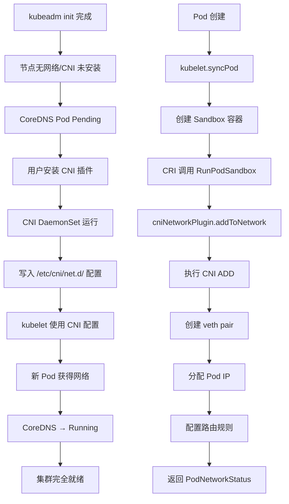
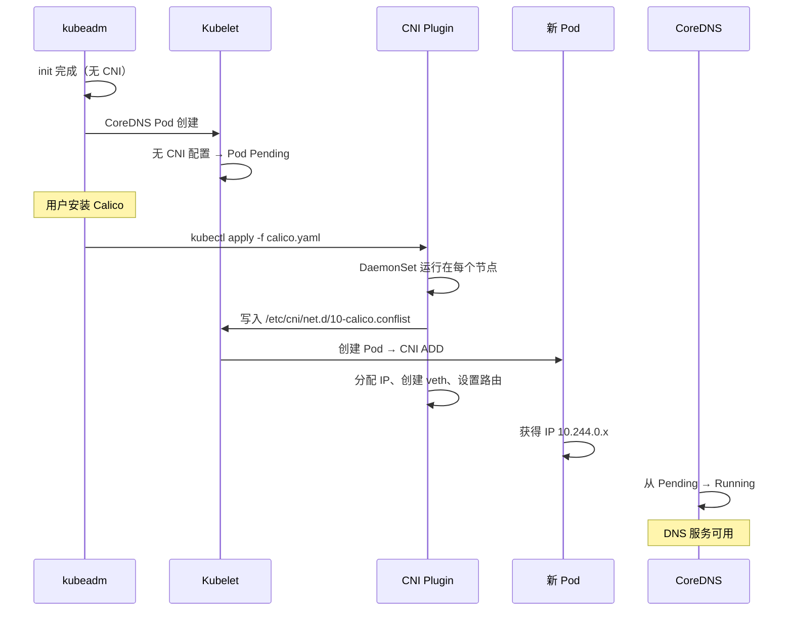

title: CNI 网络插件与集群网络
description: '# CNI 网络插件与集群网络'
category: functions
tags:
- k8s
- operations
- cluster-management
- etcd
- apiserver
- kubelet
- prometheus
- cilium
- flannel
- calico
last_updated: '2026-05-18'
difficulty: advanced
reading_level: advanced
audience:
- DevOps工程师
- 网络工程师
- Kubernetes管理员
estimated_read_time: 5min
intent_queries:
- Kubernetes CNI network plugin Calico Cilium Flannel
- kubelet CNI configuration /etc/cni/net.d
- Kubernetes pod network DNS CoreDNS
- CNI ADD DEL command container network interface
- Kubernetes CNI bridge veth pair pod IP allocation
trigger_keywords:
- CNI
- Calico
- Cilium
- Flannel
- network plugin
- pod network
- veth
- bridge
- CoreDNS
- DNS
- kubelet
- overlay
- VXLAN
- BGP
related_domains:
- domain-03-networking-traffic
- domain-10-troubleshooting-diagnostics
related_topics:
- pod network
- CNI
- DNS
- kube-proxy
- Service
- Ingress
authors:
- name: KUDIG Team
  role: contributor
k8s_versions:
- '1.28'
- '1.29'
- '1.30'
- '1.31'
- '1.32'
---

# CNI 网络插件与集群网络

## 函数签名

```go
func (plugin *NoopNetworkPlugin) Name() string
func (plugin *NoopNetworkPlugin) SetUpPod(namespace string, name string, podUID types.UID, containerID kubecontainer.ContainerID) error
func (plugin *NoopNetworkPlugin) TearDownPod(namespace string, name string, podUID types.UID, containerID kubecontainer.ContainerID) error

func (m *kubeGenericRuntimeManager) networkPlugin.Pod(taskUID string) (*Pod, error)

// kubelet CNI 调用链
func (bm *Browser) GetPodNetworkStatus(uid types.UID) (*PodNetworkStatus, error)
func (p *cniNetworkPlugin) addToNetwork(ctx context.Context, network *cniNetwork, podName string, podNamespace string, podSandboxID string, podNetNSPath string, annotations map[string]string) (cnitypes.Result, error)
func (p *cniNetworkPlugin) removeFromNetwork(ctx context.Context, network *cniNetwork, podName string, podNamespace string, podSandboxID string, podNetNSPath string) error
```

## 源码位置

| 组件 | 源码路径 | 说明 |
|------|---------|------|
| CNI 插件接口 | `pkg/kubelet/dockershim/network/cni/cni.go` | CNI 插件 Go 绑定 |
| Pod 网络设置 | `pkg/kubelet/network/cni.go` | SetUpPod/TearDownPod |
| kubelet CNI 配置 | `pkg/kubelet/kubelet.go` | CNI 初始化 |
| CoreDNS 部署 | `cmd/kubeadm/app/phases/addons/dns/dns.go` | CoreDNS 安装 |
| kube-proxy | `pkg/proxy/` | iptables/ipvs/nftables 模式 |
| Service 负载均衡 | `pkg/proxy/iptables/proxier.go` | iptables 模式实现 |
| Endpoints 控制器 | `pkg/controller/endpoints/` | Endpoints 同步 |

## 参数说明

### kubelet CNI 相关参数

| 参数 | 默认值 | 说明 |
|------|--------|------|
| `--cni-bin-dir` | `/opt/cni/bin` | CNI 插件二进制目录 |
| `--cni-conf-dir` | `/etc/cni/net.d` | CNI 配置文件目录 |
| `--network-plugin` | `cni` | 网络插件类型 |
| `--cni-cache-dir` | `/var/lib/cni/cache` | CNI 缓存目录 |
| `--pod-network-cidr` | 无 | kubeadm init 时的 Pod CIDR |

### CNI 插件对比

| 插件 | 模式 | 数据面 | 性能 | 网络模型 | BGP 支持 |
|------|------|--------|------|---------|---------|
| Calico | Overlay+BGP | eBPF/Linux Routing | 高 | IP-in-IP/VXLAN | 是 |
| Cilium | Overlay+BGP | eBPF | 最高 | VXLAN/Geneve | 是 |
| Flannel | Overlay | VXLAN | 中 | VXLAN | 否 |
| Weave | Overlay | sleeve/fastdp | 中 | VXLAN | 否 |
| kube-router | 路由 | eBPF | 高 | BGP | 是 |

### CoreDNS Corefile 配置

| 插件 | 说明 |
|------|------|
| `errors` | 错误日志 |
| `health` | 健康检查端点 :8080/health |
| `ready` | 就绪端点 :8181/ready |
| `kubernetes` | Kubernetes Service DNS 解析 |
| `prometheus` | Metrics 端点 :9153/metrics |
| `forward` | 上游 DNS 转发 |
| `cache` | DNS 缓存 TTL |
| `loop` | 检测 DNS 解析环路 |
| `reload` | 自动重载 Corefile |
| `loadbalance` | DNS 负载均衡 |

## 返回值

| 函数 | 返回值 | 说明 |
|------|--------|------|
| `SetUpPod` | `error` | Pod 网络设置成功或失败 |
| `TearDownPod` | `error` | Pod 网络拆除成功或失败 |
| `addToNetwork` | `(cnitypes.Result, error)` | CNI ADD 操作结果 |
| `removeFromNetwork` | `error` | CNI DEL 操作结果 |

## 调用链



## 源码分析

### 概述

kubeadm init 完成后，集群节点间网络不通，必须安装 CNI 插件。CNI（Container Network Interface）是 Kubernetes 的网络插件标准，kubelet 通过 CRI 调用 CNI 插件的 ADD/DEL/CHECK 命令来管理 Pod 网络命名空间。整个集群网络依赖 CNI 提供 Pod IP 分配、跨节点通信、网络策略等能力。

### CNI 安装时序

```
kubeadm init 完成
    ↓
CoreDNS Pod 处于 Pending (因为节点无网络)
    ↓
安装 CNI 插件 (Calico/Cilium/Flannel)
    ↓
CNI DaemonSet 在每个节点运行
    ↓
写入 /etc/cni/net.d/ 配置文件
    ↓
kubelet 检测到 CNI 配置
    ↓
新创建的 Pod 获得 IP 和网络连通
    ↓
CoreDNS Pod 变为 Running
    ↓
集群可正常工作
```

### kubelet CNI 初始化

```go
// pkg/kubelet/kubelet.go
func (kl *Kubelet) initializeRuntimeDependencies() error {
    networkPluginName := kl.networkPluginName
    if networkPluginName == "" {
        networkPluginName = "cni"
    }

    kl.networkPlugin, err = network.NewNetworkPlugin(
        kl.networkPluginDirs,
        networkPluginName,
        kl.host,
        kl.podCIDR,
    )
    return err
}
```

### Pod 网络设置

```go
// pkg/kubelet/network/cni.go
func (plugin *cniNetworkPlugin) SetUpPod(namespace string, name string, podUID types.UID, containerID kubecontainer.ContainerID, annotations map[string]string) error {
    if err := plugin.checkInitialized(); err != nil {
        return err
    }

    netnsPath, err := plugin.host.GetNetNS(containerID.ID)
    if err != nil {
        return fmt.Errorf("CNI failed to retrieve network namespace path: %v", err)
    }

    podNetwork := plugin.getDefaultNetwork()
    if podNetwork == nil {
        return fmt.Errorf("CNI network not found for pod %s/%s", namespace, name)
    }

    _, err = plugin.addToNetwork(context.TODO(), podNetwork, name, namespace, containerID.ID, netnsPath, annotations)
    if err != nil {
        return fmt.Errorf("CNI failed to set up pod network: %v", err)
    }

    return nil
}

func (plugin *cniNetworkPlugin) addToNetwork(ctx context.Context, network *cniNetwork, podName string, podNamespace string, podSandboxID string, podNetNSPath string, annotations map[string]string) (cnitypes.Result, error) {
    rt, err := plugin.buildCNIRuntimeConf(podName, podNamespace, podSandboxID, podNetNSPath, annotations)
    if err != nil {
        return nil, fmt.Errorf("error building CNI config: %v", err)
    }

    res, err := network.add(ctx, rt)
    if err != nil {
        return nil, fmt.Errorf("error adding pod to network: %v", err)
    }

    return res, nil
}
```

### DNS 解析流程

```
Pod 内应用发起 DNS 查询:
1. 应用调用 gethostbyname("nginx.default.svc.cluster.local")
    ↓
2. glibc 将查询发送到 /etc/resolv.conf 中的 nameserver
    nameserver 10.96.0.10
    ↓
3. kubelet 配置 Pod 的 resolv.conf 指向 CoreDNS:
    nameserver 10.96.0.10
    search default.svc.cluster.local svc.cluster.local cluster.local
    options ndots:5
    ↓
4. CoreDNS 接收 UDP 53 端口请求
    ↓
5. CoreDNS 查询 etcd/本地缓存获取 Service Endpoints
    ↓
6. 返回 ClusterIP (10.96.0.x)
    ↓
7. kube-proxy iptables/ipvs 将 ClusterIP DNAT 到具体 PodIP
```

### CoreDNS Corefile

```yaml
apiVersion: v1
kind: ConfigMap
metadata:
  name: coredns
  namespace: kube-system
data:
  Corefile: |
    .:53 {
        errors
        health {
           lameduck 5s
        }
        ready
        kubernetes cluster.local in-addr.arpa ip6.arpa {
           pods insecure
           fallthrough in-addr.arpa ip6.arpa
           ttl 30
        }
        prometheus :9153
        forward . /etc/resolv.conf {
           max_concurrent 1000
        }
        cache 30
        loop
        reload
        loadbalance
    }
```

### Pod 网络模型

```
节点 A                              节点 B
┌──────────────────┐               ┌──────────────────┐
│  Pod A           │               │  Pod B           │
│  10.244.0.10     │               │  10.244.1.10     │
│       ↓ eth0      │               │       ↓ eth0      │
│  ┌─────┴─────┐    │               │  ┌─────┴─────┐    │
│  │  veth0    │    │               │  │  veth0    │    │
│  └─────┬─────┘    │               │  └─────┬─────┘    │
│        ↓          │               │        ↓          │
│  ┌─────┴─────┐    │               │  ┌─────┴─────┐    │
│  │  bridge   │    │               │  │  bridge   │    │
│  │  cni0     │    │               │  │  cni0     │    │
│  └─────┬─────┘    │               │  └─────┬─────┘    │
│        ↓          │               │        ↓          │
│  ┌─────┴──────────┴─────────────────────────┴─────┐    │
│  │              VXLAN Tunnel (overlay)           │    │
│  └────────────────────┬──────────────────────────┘    │
└──────────────────────┼────────────────────────────────┘
                       ↓
                 物理网卡 (eth0)
                 节点 IP: 192.168.1.x
```

## 执行流程



## 使用场景

1. **集群初始化后安装 CNI**：kubeadm init 后必须安装 CNI 才能正常运行
2. **CNI 插件迁移**：从 Flannel 切换到 Calico/Cilium
3. **网络策略配置**：使用 Calico/Cilium 的 NetworkPolicy
4. **DNS 调试**：排查 CoreDNS 解析问题
5. **网络性能优化**：选择 BGP 模式替代 VXLAN overlay

## 配置示例

### Calico 安装配置

```yaml
apiVersion: operator.tigera.io/v1
kind: Installation
metadata:
  name: default
spec:
  calicoNetwork:
    ipPools:
    - blockSize: 26
      cidr: 10.244.0.0/16
      encapsulation: VXLANCrossSubnet
      natOutgoing: Enabled
      nodeSelector: all()
  registry: quay.io
---
apiVersion: operator.tigera.io/v1
kind: APIServer
metadata:
  name: default
spec: {}
```

### Cilium 安装配置

```yaml
apiVersion: helm.cilium.io/v1alpha1
kind: Cilium
metadata:
  name: cilium
spec:
  kubeProxyReplacement: strict
  hubble:
    enabled: true
    listenAddress: ":4244"
  ipam:
    mode: "kubernetes"
  tunnelProtocol: "vxlan"
  endpointRoutes:
    enabled: true
  bgp:
    enabled: false
```

## 实战示例

### 安装 Calico 并验证

```bash
# 安装 Calico
kubectl apply -f https://raw.githubusercontent.com/projectcalico/calico/v3.26.0/manifests/calico.yaml
# daemonset.apps/calico-node created
# deployment.apps/calico-kube-controllers created

# 检查 CNI Pods
kubectl get pods -n kube-system -l k8s-app=calico-node
# NAME                READY   STATUS    RESTARTS   AGE
# calico-node-abcde   1/1     Running   0          2m
# calico-node-fghij   1/1     Running   0          2m

# 检查 CNI 配置
cat /etc/cni/net.d/10-calico.conflist | python3 -m json.tool
# {
#   "name": "k8s-pod-network",
#   "cniVersion": "0.3.1",
#   "plugins": [
#     {
#       "type": "calico",
#       "ipam": {"type": "calico-ipam"}
#     }
#   ]
# }

# 验证 CoreDNS 运行
kubectl get pods -n kube-system -l k8s-app=kube-dns
# NAME                       READY   STATUS    RESTARTS   AGE
# coredns-5d78c9869d-abcde   1/1     Running   0          5m
# coredns-5d78c9869d-fghij   1/1     Running   0          5m

# 测试跨节点通信
kubectl run -it --rm debug --image=busybox -- sh
# / # wget -qO- http://nginx.default.svc.cluster.local
# / # ping 10.244.1.10
# PING 10.244.1.10: 56 data bytes
# 64 bytes from 10.244.1.10: seq=0 ttl=62 time=0.5 ms
```

### DNS 调试

```bash
# 查看 CoreDNS 日志
kubectl logs -n kube-system -l k8s-app=kube-dns
# [INFO] 10.244.0.10:50142 - 5 "A IN nginx.default.svc.cluster.local. udp 54 false 512" NOERROR qr,aa,rd 107 0.000106321s

# 测试 DNS 解析
kubectl run -it --rm debug --image=busybox -- sh
# / # nslookup nginx.default.svc.cluster.local
# Server:    10.96.0.10
# Address:   10.96.0.10:53
# Name:      nginx.default.svc.cluster.local
# Address:   10.96.0.100

# 查看 Pod 的 resolv.conf
kubectl exec -it <pod> -- cat /etc/resolv.conf
# nameserver 10.96.0.10
# search default.svc.cluster.local svc.cluster.local cluster.local
# options ndots:5
```

## 常见错误

| 错误 | 现象 | 原因 | 解决方案 |
|------|------|------|----------|
| CoreDNS 一直 Pending | `0/1 nodes are available` | CNI 未安装 | 安装 Calico/Cilium/Flannel |
| Pod 无法跨节点通信 | `ping: bad address` | 防火墙阻止 VXLAN (4789/8472) | 开放 VXLAN 端口 |
| Service 无法访问 | Connection refused | kube-proxy iptables 规则错误 | `iptables -t nat -L KUBE-SERVICES` |
| DNS 解析失败 | `server can't find xxx` | CoreDNS 未就绪 | `kubectl rollout restart deployment/coredns` |
| NodePort 无法访问 | 超时 | 防火墙阻止 30000-32767 | 开放 NodePort 端口范围 |
| CNI 配置冲突 | Pod 网络异常 | 多个 CNI 配置文件 | 只保留一个 CNI 配置 |
| Pod CIDR 不匹配 | Calico/Cilium 无法分配 IP | `--pod-network-cidr` 与 CNI 配置不一致 | 统一 Pod CIDR |

## 相关函数

- [`kubeadm init phase addon`](17-init-phases.md) — CoreDNS 和 kube-proxy 安装
- [`kube-proxy 模式`](21-kube-proxy.md) — iptables/ipvs/nftables 对比
- [`Service 与 Endpoints`](22-storage-volumes.md) — Service 负载均衡机制
- [`Pod 网络命名空间`](../node-create/09-cni-node.md) — veth pair 和 bridge

## Related

- [[domain-17-system-foundation/topic-cheat-sheet/go.md|go]]
- [[domain-17-system-foundation/topic-cheat-sheet/networking.md|networking]]
- [[domain-17-system-foundation/topic-cheat-sheet/linux.md|linux]]
- [[domain-17-system-foundation/topic-cheat-sheet/k8s.md|k8s]]
- [[entities/kubernetes.md|kubernetes]]
