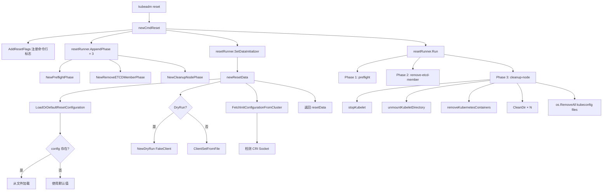
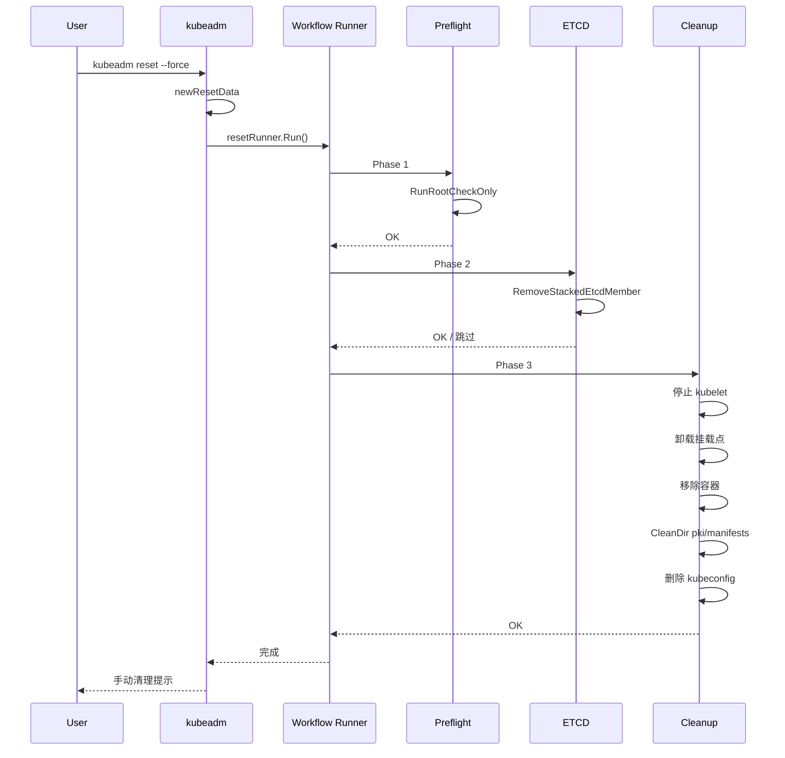

title: kubeadm reset 源码分析
category: cluster-delete
tags:
- kubeadm
- reset
- cleanup
- phase
- preflight
- remove-etcd-member
- cleanup-node
last_updated: 2026-05-18
description: 深入分析 kubeadm reset 命令的源码实现，涵盖 resetData 构建流程、三个 Phase（preflight/remove-etcd-member/cleanup-node）的执行逻辑、DryRun
  模式、--skip-phases 跳过机制以及 best-effort 容错策略。
difficulty: advanced
intent_queries:
- kubeadm reset source code analysis
- kubeadm resetData resetOptions kubernetes
- kubeadm reset phases preflight cleanup-node
- kubeadm reset dry-run skip-phases
- kubeadm reset force best effort
trigger_keywords:
- kubeadm reset
- resetData
- resetOptions
- preflight
- remove-etcd-member
- cleanup-node
- DryRun
- SkipPhases
- ForceReset
- workflow.Runner
reading_level: advanced
audience:
- platform-engineer
- sre
- kubernetes-administrator
estimated_read_time: 5min
related_domains:
- domain-01-cluster-fundamentals
- domain-01-cluster-fundamentals
related_topics:
- cluster-delete
- cleanup
- etcd-cleanup
- force-delete
- ha-delete
- reset-phase-commands
domain_link: '[Installation](../domain-01-cluster-fundamentals/README.md)'
topic_link: '[Cluster Delete Overview](./01-overview.md)'
authors:
- name: KUDIG Team
  role: contributor
k8s_versions:
- '1.28'
- '1.29'
- '1.30'
- '1.31'
- '1.32'
---

# kubeadm reset 源码分析

## 函数签名

```go
func newCmdReset(in io.Reader, out io.Writer, resetOptions *resetOptions) *cobra.Command

func newResetData(cmd *cobra.Command, opts *resetOptions, in io.Reader, out io.Writer, allowExperimental bool) (*resetData, error)

func AddResetFlags(flagSet *flag.FlagSet, resetOptions *resetOptions)

func runPreflight(c workflow.RunData) error
func runRemoveETCDMember(c workflow.RunData) error
func runCleanupNode(c workflow.RunData) error

func LoadOrDefaultResetConfiguration(configPath string, defaultCfg *kubeadmapiv1.ResetConfiguration, opts LoadOrDefaultConfigurationOptions) (*kubeadmapi.ResetConfiguration, error)
```

## 源码位置

| 组件 | 源码路径 | 说明 |
|------|---------|------|
| 命令入口 | `cmd/kubeadm/app/cmd/reset.go` | 命令注册、resetData 构建 |
| 预检阶段 | `cmd/kubeadm/app/cmd/phases/reset/preflight.go` | root 权限检查、用户确认 |
| etcd 移除 | `cmd/kubeadm/app/cmd/phases/reset/removeetcdmember.go` | RemoveStackedEtcdMember |
| 节点清理 | `cmd/kubeadm/app/cmd/phases/reset/cleanupnode.go` | 停止服务、清理目录 |
| 卸载逻辑 | `cmd/kubeadm/app/cmd/phases/reset/unmount.go` | 挂载点卸载 |
| Linux 卸载 | `cmd/kubeadm/app/cmd/phases/reset/unmount_linux.go` | unmount2() 系统调用 |
| 配置加载 | `cmd/kubeadm/app/util/config/initconfiguration.go` | ResetConfiguration 加载 |

## 参数说明

### resetOptions 字段

| 字段 | 类型 | 说明 |
|------|------|------|
| `kubeconfigPath` | `string` | kubeconfig 路径，默认 `/etc/kubernetes/admin.conf` |
| `cfgPath` | `string` | `--config` 指定的配置文件路径 |
| `ignorePreflightErrors` | `[]string` | 忽略的预检错误 |
| `externalcfg` | `*kubeadmapiv1.ResetConfiguration` | 命令行标志构建的默认配置 |
| `skipCRIDetect` | `bool` | 是否跳过容器运行时检测 |

### ResetConfiguration 字段

| 字段 | 类型 | 说明 | 默认值 |
|------|------|------|--------|
| `CertificatesDir` | `string` | 证书存储目录 | `/etc/kubernetes/pki` |
| `CleanupTmpDir` | `bool` | 清理临时目录 | `false` |
| `CRISocket` | `string` | 容器运行时 socket | 自动检测 |
| `DryRun` | `bool` | 干跑模式 | `false` |
| `Force` | `bool` | 跳过确认 | `false` |
| `IgnorePreflightErrors` | `[]string` | 忽略预检错误 | |
| `SkipPhases` | `[]string` | 跳过的阶段 | |
| `UnmountFlags` | `[]string` | Linux unmount 标志 | |
| `Timeouts` | `*Timeouts` | 超时配置 | |

### resetData 接口方法

| 方法 | 返回类型 | 说明 |
|------|---------|------|
| `ForceReset()` | `bool` | 是否强制重置 |
| `InputReader()` | `io.Reader` | 用户输入读取器 |
| `IgnorePreflightErrors()` | `sets.Set[string]` | 忽略的错误集合 |
| `Cfg()` | `*kubeadmapi.InitConfiguration` | 从集群获取的配置 |
| `ResetCfg()` | `*kubeadmapi.ResetConfiguration` | reset 配置 |
| `DryRun()` | `bool` | 是否干跑 |
| `Client()` | `clientset.Interface` | API 客户端 |
| `CertificatesDir()` | `string` | 证书目录 |
| `CRISocketPath()` | `string` | CRI socket 路径 |
| `CleanupTmpDir()` | `bool` | 是否清理临时目录 |

## 返回值

| 函数 | 返回值 | 说明 |
|------|--------|------|
| `newCmdReset` | `*cobra.Command` | 配置好的 reset 子命令 |
| `newResetData` | `(*resetData, error)` | reset 数据实例 |
| `LoadOrDefaultResetConfiguration` | `(*kubeadmapi.ResetConfiguration, error)` | 加载或默认的 Reset 配置 |
| `runPreflight` | `error` | 预检失败返回错误 |
| `runRemoveETCDMember` | `error` | etcd 移除失败返回错误 |
| `runCleanupNode` | `error` | 清理失败返回错误 |

## 调用链



## 源码分析

### 概述

`kubeadm reset` 是 Kubernetes 官方提供的节点级重置命令，用于 "best effort" 地回滚 `kubeadm init` 或 `kubeadm join` 对本机所做的修改。它使用与 init 相同的 workflow.Runner 框架，将重置过程分解为 preflight、remove-etcd-member、cleanup-node 三个有序阶段。reset 采用 best-effort 策略，大部分 warning 不会导致失败，只有致命错误才会中断。

### 命令注册与标志

```go
// cmd/kubeadm/app/cmd/reset.go
type resetOptions struct {
    kubeconfigPath        string
    cfgPath               string
    ignorePreflightErrors []string
    externalcfg           *kubeadmapiv1.ResetConfiguration
    skipCRIDetect         bool
}

func AddResetFlags(flagSet *flag.FlagSet, resetOptions *resetOptions) {
    flagSet.StringVar(&resetOptions.externalcfg.CertificatesDir, "cert-dir",
        resetOptions.externalcfg.CertificatesDir,
        "The path to the directory where the certificates are stored.")
    flagSet.BoolVarP(&resetOptions.externalcfg.Force, "force", "f",
        resetOptions.externalcfg.Force,
        "Reset the node without prompting for confirmation.")
    flagSet.BoolVar(&resetOptions.externalcfg.DryRun, "dry-run",
        resetOptions.externalcfg.DryRun,
        "Don't make any changes; just output what would be done.")
    flagSet.BoolVar(&resetOptions.externalcfg.CleanupTmpDir, "cleanup-tmp-dir",
        resetOptions.externalcfg.CleanupTmpDir,
        "Also clean up the /etc/kubernetes/tmp directory.")
    options.AddKubeConfigFlag(flagSet, &resetOptions.kubeconfigPath)
    options.AddConfigFlag(flagSet, &resetOptions.cfgPath)
    options.AddIgnorePreflightErrorsFlag(flagSet, &resetOptions.ignorePreflightErrors)
    cmdutil.AddCRISocketFlag(flagSet, &resetOptions.externalcfg.CRISocket)
}
```

### resetData 构建流程

```go
type resetData struct {
    certificatesDir       string
    client                clientset.Interface
    criSocketPath         string
    forceReset            bool
    ignorePreflightErrors sets.Set[string]
    inputReader           io.Reader
    outputWriter          io.Writer
    cfg                   *kubeadmapi.InitConfiguration
    resetCfg              *kubeadmapi.ResetConfiguration
    dryRun                bool
    cleanupTmpDir         bool
}

func newResetData(cmd *cobra.Command, opts *resetOptions, in io.Reader, out io.Writer, allowExperimental bool) (*resetData, error) {
    // 1. 加载配置
    resetCfg, err := configutil.LoadOrDefaultResetConfiguration(
        opts.cfgPath,
        opts.externalcfg,
        configutil.LoadOrDefaultConfigurationOptions{
            AllowExperimental: allowExperimental,
            SkipCRIDetect:     opts.skipCRIDetect,
        },
    )
    if err != nil {
        return nil, err
    }

    // 2. 构建 API Client
    var client clientset.Interface
    if resetCfg.DryRun {
        dryRun := apiclient.NewDryRun().WithDefaultMarshalFunction().WithWriter(os.Stdout)
        dryRun.AppendReactor(dryRun.GetKubeadmConfigReactor()).
            AppendReactor(dryRun.GetKubeletConfigReactor()).
            AppendReactor(dryRun.GetKubeProxyConfigReactor())
        client = dryRun.FakeClient()
    } else {
        client, err = kubeconfigutil.ClientSetFromFile(opts.kubeconfigPath)
        if err != nil {
            klog.Warningf("could not create a Kubernetes API client: %v\n"+
                "This can happen if the cluster has been already deleted.", err)
        }
    }

    // 3. 从集群获取配置（best-effort，失败仅 warning）
    var cfg *kubeadmapi.InitConfiguration
    if client != nil {
        cfg, err = configutil.FetchInitConfigurationFromCluster(client, nil, "reset", true, true, true)
        if err != nil {
            klog.Warningf("could not fetch the kubeadm-config ConfigMap: %v", err)
        }
    }

    // 4. 检测 CRI Socket
    criSocketPath := detectCRISocket(resetCfg, cfg)

    // 5. 确定 CertificatesDir
    certificatesDir := determineCertificatesDir(resetCfg, cfg)

    return &resetData{
        certificatesDir:       certificatesDir,
        client:                client,
        criSocketPath:         criSocketPath,
        forceReset:            resetCfg.Force,
        ignorePreflightErrors: sets.New[string](resetCfg.IgnorePreflightErrors...),
        inputReader:           in,
        outputWriter:          out,
        cfg:                   cfg,
        resetCfg:              resetCfg,
        dryRun:                resetCfg.DryRun,
        cleanupTmpDir:         resetCfg.CleanupTmpDir,
    }, nil
}
```

**关键**: 如果无法连接 API Server（集群已不可用），`cfg` 为 nil 时 etcd 移除阶段会跳过，但节点清理仍正常工作。

### Phase 注册与执行

```go
// 三个 Phase 按固定顺序执行
resetRunner.AppendPhase(phases.NewPreflightPhase())
resetRunner.AppendPhase(phases.NewRemoveETCDMemberPhase())
resetRunner.AppendPhase(phases.NewCleanupNodePhase())

// 支持 --skip-phases 跳过
if len(resetRunner.Options.SkipPhases) == 0 {
    resetRunner.Options.SkipPhases = data.resetCfg.SkipPhases
}
```

| # | Phase | 别名 | 说明 |
|---|-------|------|------|
| 1 | `preflight` | `pre-flight` | 预检：root 权限检查、用户确认 |
| 2 | `remove-etcd-member` | — | 从 etcd 集群移除本地成员（仅控制面） |
| 3 | `cleanup-node` | `cleanupnode` | 节点清理：停止服务、删除容器、清理目录 |

### DryRun 模式

```go
if resetCfg.DryRun {
    dryRun := apiclient.NewDryRun().
        WithDefaultMarshalFunction().
        WithWriter(os.Stdout)
    dryRun.AppendReactor(dryRun.GetKubeadmConfigReactor()).
        AppendReactor(dryRun.GetKubeletConfigReactor()).
        AppendReactor(dryRun.GetKubeProxyConfigReactor())
    client = dryRun.FakeClient()
}
```

干跑模式输出示例：
```
[dryrun] Would stop the kubelet service
[dryrun] Would unmount mounted directories in "/var/lib/kubelet"
[dryrun] Would remove Kubernetes-managed containers
[dryrun] Would delete contents of directories: [/etc/kubernetes/pki /etc/kubernetes/manifests]
[dryrun] Would delete files: [/etc/kubernetes/admin.conf /etc/kubernetes/kubelet.conf ...]
```

## 执行流程



## 使用场景

1. **节点重置后重新加入**：reset → 修复问题 → 重新 join
2. **集群完全销毁**：所有节点依次 reset
3. **控制面节点替换**：remove-etcd-member → reset → 新节点 join --control-plane
4. **开发/测试环境清理**：快速重置节点
5. **故障恢复**：节点异常时 reset 恢复干净状态

## 配置示例

```yaml
apiVersion: kubeadm.k8s.io/v1beta4
kind: ResetConfiguration
certificatesDir: /etc/kubernetes/pki
cleanupTmpDir: true
criSocket: unix:///run/containerd/containerd.sock
dryRun: false
force: true
ignorePreflightErrors:
  - IsPrivilegedUser
skipPhases: []
unmountFlags:
  - MNT_DETACH
timeouts:
  etcdTakeover: 2m0s
```

## 实战示例

### 标准 reset 流程

> ⚠️ **🔴 灾难性操作** — 含不可逆命令，执行前必须满足变更窗口+双人复核+事前备份+回滚方案
> - `kubeadm reset`：清理节点所有 K8s 配置/证书/CNI，节点脱离集群

```bash
kubeadm reset  # ⚠️ 清理节点所有 K8s 配置
#[reset] Are you sure you want to proceed? [y/N]: y
#[preflight] Running pre-flight checks
#[reset] Reading configuration from the cluster...
#[reset] Stopping the kubelet service
#[reset] Unmounting mounted directories in "/var/lib/kubelet"
#[reset] Removing Kubernetes-managed containers
#[reset] Deleting contents of /etc/kubernetes/pki
#[reset] Deleting contents of /etc/kubernetes/manifests
#[reset] Deleting file /etc/kubernetes/admin.conf
#[reset] Deleting file /etc/kubernetes/kubelet.conf
#[reset] Deleting file /etc/kubernetes/controller-manager.conf
#[reset] Deleting file /etc/kubernetes/scheduler.conf
#[reset] Deleting contents of /var/lib/kubelet
#[reset] Deleting contents of /var/lib/etcd
#
#The reset process does not perform cleanup of CNI plugin configuration,
#network filtering rules and kubeconfig files.
```

### etcd 成员移除超时

> ⚠️ **🔴 灾难性操作** — 含不可逆命令，执行前必须满足变更窗口+双人复核+事前备份+回滚方案
> - `etcdctl member remove`：移除 etcd 成员，误删多数派会致集群不可用/丢数据
> - `kubeadm reset`：清理节点所有 K8s 配置/证书/CNI，节点脱离集群

```bash
# 场景：etcd 成员移除超时（网络延迟或 etcd 响应慢）
kubeadm reset --force  # ⚠️ 清理节点所有 K8s 配置
# [reset] Failed to remove etcd member: context deadline exceeded

# 解决方案 1: 增加超时时间
kubeadm reset --config=reset.yaml  # ⚠️ 清理节点所有 K8s 配置
# reset.yaml:
# timeouts:
#   etcdTakeover: 5m0s

# 解决方案 2: 跳过 etcd 移除，手动处理
kubeadm reset --force --skip-phases=remove-etcd-member  # ⚠️ 清理节点所有 K8s 配置

# 手动移除 etcd 成员
etcdctl member list
etcdctl member remove <member-id> --endpoints=https://cp1:2379  # ⚠️ 移除 etcd 成员，可能丢数据
```

### 配置文件指定非默认证书目录

> ⚠️ **🔴 灾难性操作** — 含不可逆命令，执行前必须满足变更窗口+双人复核+事前备份+回滚方案
> - `kubeadm reset`：清理节点所有 K8s 配置/证书/CNI，节点脱离集群

```bash
# 场景：使用自定义证书目录（如 /root/k8s/pki）
kubeadm reset --config=reset.yaml  # ⚠️ 清理节点所有 K8s 配置
# reset.yaml:
# certificatesDir: /root/k8s/pki
# force: true

# kubeadm 会自动清理 /root/k8s/pki 目录
```

### 跳过特定阶段

> ⚠️ **🔴 灾难性操作** — 含不可逆命令，执行前必须满足变更窗口+双人复核+事前备份+回滚方案
> - `kubeadm reset`：清理节点所有 K8s 配置/证书/CNI，节点脱离集群

```bash
kubeadm reset --force --skip-phases=remove-etcd-member  # ⚠️ 清理节点所有 K8s 配置
#[preflight] Running pre-flight checks
#[skip] Skipping phase remove-etcd-member
#[reset] Stopping the kubelet service
#...
```

### 手动清理提示后的完整清理

> ⚠️ **🔴 灾难性操作** — 含不可逆命令，执行前必须满足变更窗口+双人复核+事前备份+回滚方案
> - `kubeadm reset`：清理节点所有 K8s 配置/证书/CNI，节点脱离集群
> - `rm -rf (系统/数据路径)`：删除系统或数据文件，可能摧毁节点或丢失全部数据
> - `iptables -F/-P DROP`：清空/改防火墙规则，可能立即断网(含SSH)

```bash
kubeadm reset --force  # ⚠️ 清理节点所有 K8s 配置
# ... reset 输出 ...

# 手动清理
iptables -F && iptables -t nat -F && iptables -t mangle -F && iptables -X
ipvsadm -C
rm -rf /etc/cni/net.d  # ⚠️ 删除系统/数据文件
rm -rf /var/lib/kubelet  # ⚠️ 删除系统/数据文件
rm -rf $HOME/.kube  # ⚠️ 删除系统/数据文件
rm -f /etc/systemd/system/kubelet.service
rm -rf /etc/systemd/system/kubelet.service.d/  # ⚠️ 删除系统/数据文件
systemctl daemon-reload

```

## 常见错误

| 错误 | 现象 | 原因 | 解决方案 |
|------|------|------|----------|
| API Server 不可达 | `could not create a Kubernetes API client` | 集群已崩溃 | 不影响 reset，仅跳过 etcd 移除 |
| etcd 移除超时 | `context deadline exceeded` | etcd 集群仲裁不足 | 手动 `etcdctl member remove` |
| Unmount 卡住 | reset 挂起 | 挂载点被进程占用 | `umount -l` 懒卸载 |
| 容器移除失败 | `error removing containers` | CRI 运行时无响应 | `crictl stop -a && crictl rm -a` |
| 权限不足 | `preflight check failed: is not running as root` | 非 root 用户执行 | 使用 `sudo kubeadm reset` |
| 配置文件格式错误 | `failed to load config` | YAML 格式问题 | `kubeadm config validate --config` |

## 相关函数

- [`newCmdReset`](01-overview.md) — reset 命令入口
- [`runCleanupNode`](04-cleanup.md) — cleanup-node 阶段详细实现
- [`runRemoveEtcd`](05-etcd-cleanup.md) — etcd 成员移除详细实现
- [`RemoveStackedEtcdMember`](05-etcd-cleanup.md) — 移除本地 stacked etcd
- [`CleanDir`](04-cleanup.md) — 目录清理工具函数
- [`InteractivelyConfirmAction`](01-overview.md) — 交互式确认

## Related

- [[reference|#reference Hub]] — tag hub

- [[README|README]]
- [[scripts/man/INSTALL.md|INSTALL]]
- [[domain-17-system-foundation/topic-cheat-sheet/go.md|go]]
- [[domain-17-system-foundation/topic-cheat-sheet/linux.md|linux]]
- [[domain-17-system-foundation/topic-cheat-sheet/k8s.md|k8s]]

```