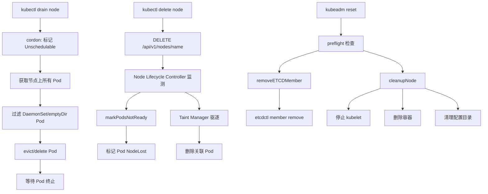

title: 节点删除流程 — kubectl delete node 源码分析
category: cluster-delete
tags:
- kubectl
- delete-node
- drain
- evict
- taint
- node-lifecycle
- kubeadm-reset
- pod
last_updated: 2026-05-18
description: 深入分析 Kubernetes 节点删除的完整流程，涵盖 kubectl drain 驱逐、kubectl delete node 删除
  Node 对象、Node Lifecycle Controller 响应、kubeadm reset 重置、Taint Manager 驱逐以及 etcd 成员移除等关键环节。
difficulty: advanced
intent_queries:
- kubernetes node deletion source code
- kubectl delete node workflow kubernetes
- kubectl drain node source code analysis
- node lifecycle controller reconcileNodeDelete
- taint eviction noExecuteTaintManager kubernetes
trigger_keywords:
- kubectl delete node
- kubectl drain
- reconcileNodeDelete
- markPodsNotReady
- taintEviction
- noExecuteTaintManager
- PodDisruptionBudget
- kubeadm reset
- removeETCDMember
- cleanupNode
reading_level: advanced
audience:
- platform-engineer
- sre
- kubernetes-administrator
estimated_read_time: 5min
related_domains:
- domain-01-cluster-fundamentals
- domain-02-workloads-applications
related_topics:
- cluster-delete
- cleanup
- etcd-cleanup
- force-delete
- ha-delete
domain_link: '[Control Plane](../domain-01-cluster-fundamentals/README.md)'
topic_link: '[Cluster Delete Overview](./01-overview.md)'
authors:
- name: KUDIG Team
  role: contributor
k8s_versions:
- '1.28'
- '1.29'
- '1.30'
- '1.31'
- '1.32'
---

# 节点删除流程 — kubectl delete node 源码分析

## 概述

Kubernetes 节点删除分为两个层面：**API 层删除**（`kubectl delete node`，从 etcd 移除 Node 对象）和**节点级重置**（`kubeadm reset`，清理本地数据）。两者通常配合使用。本文档从源码层面分析完整的节点删除流程，涵盖 drain 驱逐、Node 对象删除、Node Lifecycle Controller 响应、kubeadm reset 重置等关键环节。

---

## 函数签名

```go
func (nc *Controller) reconcileNodeDelete(node *v1.Node) error

func (nc *Controller) markPodsNotReady(node *v1.Node) error

func (nc *noExecuteTaintManager) taintEviction(node *v1.Node) error

func draincmd.RunDrain(ctx context.Context, drainer *Drainer, nodes []string) error

func (d *Drainer) deleteOrEvictPodsSimple(ctx context.Context, pods []*corev1.Pod) error

func RunCleanup(cmd *cobra.Command, args []string) error

func removeETCDMember(cfg *kubeadmapi.InitConfiguration) error

func cleanupNode(dirsToClean []string) error
```

---

## 源码位置

| 功能 | 文件路径 |
|------|---------|
| Node Lifecycle Controller | `pkg/controller/nodelifecycle/node_lifecycle_controller.go` |
| Pod 驱逐逻辑 | `pkg/controller/nodelifecycle/taint_controller.go` |
| kubectl drain | `staging/src/k8s.io/kubectl/pkg/cmd/drain/drain.go` |
| Pod 优雅终止 | `pkg/kubelet/kubelet_pods.go` |
| kubeadm reset | `cmd/kubeadm/app/cmd/reset.go` |
| etcd 成员移除 | `cmd/kubeadm/app/phases/removeetcdmember/` |
| 节点清理 | `cmd/kubeadm/app/phases/reset/cleanup.go` |

---

## 参数说明

| 参数 | 类型 | 说明 |
|------|------|------|
| `node` | `*v1.Node` | 待处理的 Node 对象 |
| `nc` | `*Controller` | Node Lifecycle Controller 实例 |
| `drainer` | `*Drainer` | kubectl drain 配置，包含超时、force 等选项 |
| `cfg` | `*kubeadmapi.InitConfiguration` | kubeadm 配置，包含 etcd 连接信息 |
| `dirsToClean` | `[]string` | reset 时需要清理的目录列表 |
| `pods` | `[]*corev1.Pod` | 待驱逐或删除的 Pod 列表 |

---

## 返回值

| 函数 | 返回值 | 说明 |
|------|--------|------|
| `reconcileNodeDelete` | `error` | 节点删除协调失败时返回错误 |
| `RunDrain` | `error` | drain 过程中任何 Pod 驱逐失败时返回 |
| `RunCleanup` | `error` | reset 清理失败时返回错误 |
| `removeETCDMember` | `error` | etcd 成员移除失败时返回 |

---

## 调用链



---

## 源码分析

### 1. kubectl drain — 节点驱逐

```go
func RunDrain(ctx context.Context, drainer *Drainer, nodes []string) error {
    for _, nodeName := range nodes {
        // Step 1: Cordon 节点
        if err := drainer.CordonHelper.Update(ctx); err != nil {
            return err
        }

        // Step 2: 获取节点上所有 Pod
        pods, err := drainer.GetPodsForDeletion(ctx, nodeName)
        if err != nil {
            return err
        }

        // Step 3: 驱逐或删除 Pod
        if err := drainer.deleteOrEvictPodsSimple(ctx, pods); err != nil {
            return err
        }
    }
    return nil
}
```

**驱逐行为**：

| 资源类型 | 行为 |
|----------|------|
| ReplicaSet/Deployment Pod | 驱逐后在其他节点重建 |
| StatefulSet Pod | 驱逐后按序号重建（需要 PV 支持） |
| DaemonSet Pod | 默认阻止驱逐，需 `--ignore-daemonsets` |
| 使用 emptyDir 的 Pod | 默认阻止驱逐，需 `--delete-emptydir-data` |
| 使用 local PV 的 Pod | 无法驱逐（数据绑定节点） |

### 2. Pod 优雅终止

```go
func (kl *Kubelet) killPod(pod *v1.Pod, podStatus *PodStatus, graceful bool) error {
    if graceful {
        // 1. 调用容器运行时终止 Pod
        err := kl.containerRuntime.KillPod(pod, podStatus, killPodOptions)
        if err != nil {
            return err
        }
    } else {
        // 强制终止
        err := kl.containerRuntime.KillPod(pod, podStatus, &KillPodOptions{})
    }
    return nil
}
```

**优雅终止流程**：
```
1. kubelet 发送 SIGTERM 到 Pod 中 PID 1
2. 等待 terminationGracePeriodSeconds（默认 30s）
3. 超时后发送 SIGKILL 强制终止
4. Pod 被从 etcd 中删除
5. Controller 在其他节点重建 Pod
```

### 3. Node Lifecycle Controller — 节点心跳监测

```go
func (nc *Controller) reconcileNodeDelete(node *v1.Node) error {
    // 检查节点是否已被删除
    _, err := nc.kubeClient.CoreV1().Nodes().Get(context.TODO(), node.Name, metav1.GetOptions{})
    if apierrors.IsNotFound(err) {
        // 节点已删除，清理该节点上的所有 Pod
        return nc.deletePodsForNode(node.Name)
    }
    return nil
}
```

**节点心跳监测参数**：

```go
const (
    nodeMonitorGracePeriod = 40 * time.Second
    podEvictionTimeout     = 5 * time.Minute
    nodeMonitorPeriod      = 5 * time.Second
)
```

### 4. Taint Manager — 基于 Taint 的驱逐

```go
func (tc *noExecuteTaintManager) taintEviction(node *v1.Node) error {
    nodeInfo, err := tc.getNodeInfo(node.Name)
    if err != nil {
        return err
    }

    for _, pod := range nodeInfo.pods {
        if !isPodToleratedToAllNodeTaints(pod, nodeInfo.taints) {
            // Pod 不容忍当前节点的 Taint，需要驱逐
            if err := tc.evictPod(pod); err != nil {
                return err
            }
        }
    }
    return nil
}
```

**Pod 驱逐策略**：

| Node Condition | Taint | Pod Toleration | 驱逐行为 |
|---------------|-------|---------------|---------|
| Ready=Unknown | `node.kubernetes.io/unreachable` | `tolerationSeconds` 后驱逐 | 默认 300s |
| Ready=False | `node.kubernetes.io/not-ready` | `tolerationSeconds` 后驱逐 | 默认 300s |
| MemoryPressure | `node.kubernetes.io/memory-pressure` | 无 toleration 的 Pod 被驱逐 | — |
| DiskPressure | `node.kubernetes.io/disk-pressure` | 无 toleration 的 Pod 被驱逐 | — |

### 5. kubeadm reset — 节点重置

```go
func RunCleanup(cmd *cobra.Command, args []string) error {
    // Step 1: Preflight 检查
    if os.Getuid() != 0 {
        return errors.New("this command must be run as root")
    }

    // Step 2: 移除 etcd 成员（仅控制面节点）
    if isControlPlaneNode() {
        if err := removeETCDMember(cfg); err != nil {
            fmt.Printf("[reset] failed to remove etcd member: %v\n", err)
        }
    }

    // Step 3: 停止 kubelet
    if err := stopKubelet(); err != nil {
        fmt.Printf("[reset] failed to stop kubelet: %v\n", err)
    }

    // Step 4: 删除所有容器
    if err := removeContainers(); err != nil {
        fmt.Printf("[reset] failed to remove containers: %v\n", err)
    }

    // Step 5: 清理目录
    dirsToClean := []string{
        "/etc/kubernetes/manifests",
        "/etc/kubernetes/pki",
        "/etc/kubernetes/conf",
        "/var/lib/kubelet",
        "/var/lib/dockershim",
        "/var/lib/etcd",
    }
    return cleanupNode(dirsToClean)
}
```

### 6. etcd 成员移除

```go
func removeETCDMember(cfg *kubeadmapi.InitConfiguration) error {
    client, err := etcdutil.NewClient(
        cfg.Etcd.Endpoints,
        cfg.Etcd.CAFile,
        cfg.Etcd.CertFile,
        cfg.Etcd.KeyFile,
    )
    if err != nil {
        return err
    }
    defer client.Close()

    memberList, err := client.MemberList(context.TODO())
    if err != nil {
        return err
    }

    for _, member := range memberList.Members {
        if member.Name == cfg.NodeRegistration.Name {
            _, err = client.MemberRemove(context.TODO(), member.ID)
            return err
        }
    }
    return nil
}
```

---

## 执行流程

```
kubectl drain <node>
  │
  ├── cordon: node.spec.unschedulable = true
  ├── 列出节点上所有 Pod
  │     ├── DaemonSet Pod → 跳过 (需 --ignore-daemonsets)
  │     ├── emptyDir Pod → 跳过 (需 --delete-emptydir-data)
  │     └── 其他 Pod → 加入驱逐列表
  ├── 逐个驱逐 Pod (eviction API)
  │     └── POST /api/v1/namespaces/<ns>/pods/<pod>/eviction
  └── 等待所有 Pod 终止

kubectl delete node <node>
  │
  ├── DELETE /api/v1/nodes/<node>
  ├── Node Lifecycle Controller 触发
  │     ├── markPodsNotReady → NodeLost
  │     └── deletePodsForNode → 清理 Pod
  └── ReplicaSet Controller → 重建 Pod

kubeadm reset (在目标节点上)
  │
  ├── preflight: 检查 root 权限
  ├── removeETCDMember (控制面节点)
  │     ├── 连接 etcd 集群
  │     └── etcdctl member remove
  ├── 停止 kubelet
  ├── 删除所有容器 (crictl rm -a)
  ├── 清理 /etc/kubernetes/
  ├── 清理 /var/lib/kubelet/
  └── 清理 /var/lib/etcd/ (控制面节点)
```

---

## 使用场景

### 场景 1：正常节点下线

```bash
kubectl drain worker-1 --ignore-daemonsets --delete-emptydir-data
kubectl delete node worker-1
# 在 worker-1 上:
kubeadm reset -f
iptables -F && iptables -t nat -F && iptables -t mangle -F
ipvsadm -C
rm -rf /etc/cni/net.d
```

### 场景 2：不可达节点强制删除

```bash
kubectl delete node unreachable-node --force --grace-period=0
# 节点恢复后执行:
kubeadm reset -f
```

### 场景 3：控制面节点删除（HA 集群）

```bash
kubectl drain cp-2 --ignore-daemonsets --delete-emptydir-data
kubectl delete node cp-2
# 在 cp-2 上:
kubeadm reset -f
# 在其他控制面节点上确认:
etcdctl member list
# 如果未自动移除:
etcdctl member remove <member-id>
```

### 场景 4：大规模节点快速删除（滚动）

```bash
# 场景：需要快速删除多个节点
NODES=$(kubectl get nodes -l node-role=worker --no-headers | cut -d' ' -f1)

for node in $NODES; do
    kubectl drain $node --ignore-daemonsets --delete-emptydir-data --timeout=60s --force &
done
wait

# 等待所有驱逐完成后，批量删除
kubectl delete node $NODES

# 在所有节点上执行 reset（并行）
for node in $NODES; do
    ssh $node "kubeadm reset -f" &
done
wait
```

### 场景 5：节点网络不可达但本地登录可执行 reset

```bash
# 场景：节点网络不可达，但可以通过 console/IPMI 登录

# 在可达节点上删除 Node 对象
kubectl delete node unreachable-node --grace-period=0

# 在目标节点上本地执行 reset（通过 console）
# 登录后执行:
kubeadm reset -f

# 手动清理网络
rm -rf /etc/cni/net.d
iptables -F && iptables -t nat -F
ipvsadm -C
```

---

## 配置示例 YAML

```yaml
apiVersion: kubeadm.k8s.io/v1beta3
kind: ResetConfiguration
cleanupTmpDir: true
certificatesDir: "/etc/kubernetes/pki"
criSocket: "unix:///var/run/containerd/containerd.sock"
force: true
---
apiVersion: kubeadm.k8s.io/v1beta3
kind: ClusterConfiguration
etcd:
  external:
    endpoints:
      - "https://cp-1:2379"
      - "https://cp-2:2379"
      - "https://cp-3:2379"
    caFile: "/etc/kubernetes/pki/etcd/ca.crt"
    certFile: "/etc/kubernetes/pki/apiserver-etcd-client.crt"
    keyFile: "/etc/kubernetes/pki/apiserver-etcd-client.key"
```

---

## 实战示例

### 示例 1：检查节点上运行的 Pod

```bash
kubectl get pods --all-namespaces --field-selector spec.nodeName=worker-1 -o wide
```

### 示例 2：安全驱逐 Pod（带超时）

```bash
kubectl drain worker-1 --ignore-daemonsets --delete-emptydir-data --timeout=120s --grace-period=60
```

### 示例 3：检查 etcd 集群健康

```bash
etcdctl endpoint health --cluster \
  --cacert=/etc/kubernetes/pki/etcd/ca.crt \
  --cert=/etc/kubernetes/pki/etcd/healthcheck-client.crt \
  --key=/etc/kubernetes/pki/etcd/healthcheck-client.key
```

### 示例 4：确认 Node 已删除

```bash
kubectl get nodes
kubectl get pods --all-namespaces --field-selector spec.nodeName=deleted-node
```

### 示例 5：reset 后手动清理 CNI

```bash
rm -rf /etc/cni/net.d/*
rm -rf /var/lib/cni/
ip link delete cni0
ip link delete flannel.1
```

---

## 常见错误

| 错误 | 现象 | 根因 | 解决 |
|-----|------|------|------|
| DaemonSet Pod 阻止 drain | `cannot delete DaemonSet-managed Pods` | 未指定 `--ignore-daemonsets` | 添加 `--ignore-daemonsets` 标志 |
| emptyDir Pod 阻止 drain | `cannot delete Pods with local storage` | 未指定 `--delete-emptydir-data` | 添加 `--delete-emptydir-data` |
| Pod 驱逐超时 | drain 命令卡住 | Pod 的 preStop hook 或 terminationGracePeriodSeconds 过长 | 使用 `--timeout` 和 `--grace-period` |
| etcd 成员残留 | etcd 集群告警 `member unreachable` | reset 未成功移除 etcd 成员 | 手动 `etcdctl member remove` |
| Node 对象残留 | `kubectl get nodes` 显示 NotReady | `kubeadm reset` 不删除 Node 对象 | 手动 `kubectl delete node` |
| Pod 状态 NodeLost | Pod 永远处于 Terminating | Node 删除后 Pod 无法被 kubelet 终止 | `kubectl delete pod <pod> --force --grace-period=0` |
| local PV 数据丢失 | 数据无法恢复 | 使用 local PV 的 Pod 被驱逐 | 驱逐前备份数据 |
| iptables 规则残留 | 网络流量异常 | reset 未清理 iptables | 手动 `iptables -F && iptables -t nat -F` |

---

## 相关函数

| 函数 | 源码位置 | 说明 |
|------|---------|------|
| `RunDrain` | `staging/src/k8s.io/kubectl/pkg/cmd/drain/drain.go` | drain 命令入口 |
| `reconcileNodeDelete` | `pkg/controller/nodelifecycle/node_lifecycle_controller.go` | 节点删除协调 |
| `markPodsNotReady` | `pkg/controller/nodelifecycle/node_lifecycle_controller.go` | 标记 Pod 不可用 |
| `taintEviction` | `pkg/controller/nodelifecycle/taint_controller.go` | Taint 驱逐 |
| `RunCleanup` | `cmd/kubeadm/app/cmd/reset.go` | reset 命令入口 |
| `removeETCDMember` | `cmd/kubeadm/app/phases/removeetcdmember/` | etcd 成员移除 |
| `cleanupNode` | `cmd/kubeadm/app/phases/reset/cleanup.go` | 节点清理 |

## Related

- [[README|README]]
- [[domain-17-system-foundation/topic-cheat-sheet/go|go]]
- [[domain-17-system-foundation/topic-cheat-sheet/k8s|k8s]]
- [[entities/kubernetes|kubernetes]]
- [[entities/cni|cni]]
