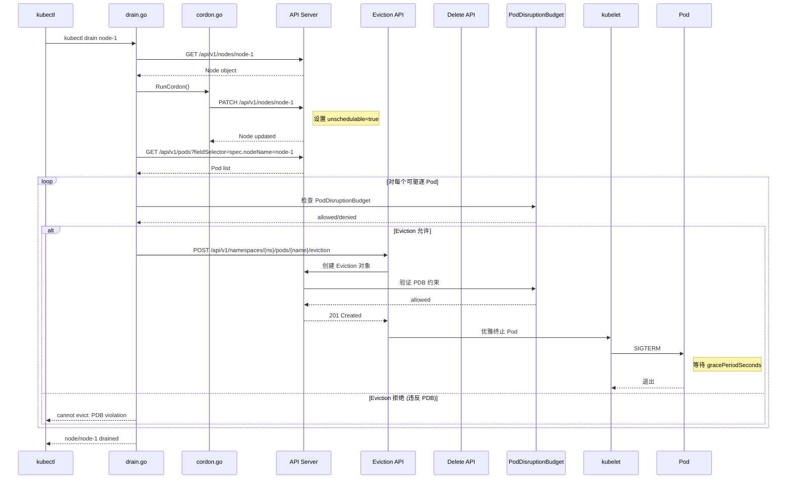

> **生产环境安全提示**
>
> 本文档包含可直接执行的运维命令。执行前请确认：当前目标集群与 Namespace 是否正确；是否具备足够的 RBAC 权限；是否已在非生产环境验证。命令风险等级标注：🔴 高风险（可能造成数据丢失或服务中断）、🟡 中风险（会修改集群状态，但通常可回滚）、🟢 低风险/只读（信息收集，无副作用）。


title: 节点驱逐与维护 kubectl drain
description: '| `force` | `bool` | 继续即使 Pod 管理器不存在 | 默认 false |'
category: functions
tags:
- k8s
- operations
- cluster-management
- kubelet
- calico
- redis
- mysql
- pdb
- statefulset
- daemonset
last_updated: 2026-05-18
difficulty: intermediate
reading_level: intermediate
audience:
- Kubernetes 运维工程师
- 平台工程师
estimated_read_time: 5min
intent_queries:
- kubectl drain node procedure
- kubectl cordon uncordon node
- pod eviction API PodDisruptionBudget
- kubectl drain --ignore-daemonsets
- node maintenance drain workflow
trigger_keywords:
- drain
- cordon
- uncordon
- eviction
- PodDisruptionBudget
- PDB
- evict
- deleteOrEvictPods
- graceful termination
- gracePeriodSeconds
- emptyDir
- DaemonSet
- mirror pod
- static pod
related_domains:
- domain-01-cluster-fundamentals
- domain-10-troubleshooting-diagnostics
related_topics:
- node-create/01-overview
- node-create/05-upgrade
- cluster-create/09-upgrade
- cluster-create/16-security
authors:
- name: KUDIG Team
  role: contributor
k8s_versions:
- '1.28'
- '1.29'
- '1.30'
- '1.31'
- '1.32'
---

# 节点驱逐与维护 (kubectl drain/cordon/uncordon)

## 函数/流程签名

```go
func RunDrain(o *DrainOptions, args []string) error
func (o *DrainOptions) RunCordon() error
func (o *DrainOptions) RunUncordon() error
func (o *DrainOptions) deleteOrEvictPods(pods []corev1.Pod) error
func (o *DrainOptions) evictPod(pod corev1.Pod) error
func (o *DrainOptions) deletePod(pod corev1.Pod) error
func (o *DrainOptions) getPodsForDeletion(nodeName string) ([]corev1.Pod, error)
```

## 源码位置

| 文件路径 | 行号范围 | 说明 |
|---------|---------|------|
| `cmd/kubectl/pkg/cmd/drain/drain.go` | L50-L200 | `DrainOptions` 结构体定义 |
| `cmd/kubectl/pkg/cmd/drain/drain.go` | L201-L350 | `RunDrain` 主入口 |
| `cmd/kubectl/pkg/cmd/drain/drain.go` | L351-L500 | `deleteOrEvictPods` 驱逐逻辑 |
| `pkg/apis/core/install/versioned.go` | - | Pod eviction API 注册 |
| `pkg/api/legacyscheme/scheme.go` | - | API scheme 注册 |
| `staging/src/k8s.io/api/core/v1/types.go` | L3500-L3600 | Pod 结构体定义 |

## 参数说明

### DrainOptions 参数

| 参数名 | 类型 | 说明 | 验证规则 |
|--------|------|------|---------|
| `nodeName` | `string` | 目标节点名称 | 必须是已存在的节点 |
| `gracePeriodSeconds` | `int` | Pod 优雅终止宽限期 (秒) | -1=使用 Pod 默认值，默认 30 |
| `timeout` | `time.Duration` | drain 超时时间 | 默认 0 (无限等待) |
| `deleteEmptydirData` | `bool` | 允许删除 emptyDir 卷数据的 Pod | 必须显式设置 |
| `ignoreDaemonsets` | `bool` | 忽略 DaemonSet Pod | 必须设置，否则拒绝 drain |
| `disableEviction` | `bool` | 使用 delete 而非 eviction API | 默认 false (优先 eviction) |
| `selector` | `string` | Label selector 过滤 Pod | 标准 label selector 语法 |
| `podSelector` | `string` | Pod label selector | 标准 label selector 语法 |
| `force` | `bool` | 继续即使 Pod 管理器不存在 | 默认 false |
| `dryRun` | `bool` | 只打印不执行 | 默认 false |

### cordon/uncordon 参数

| 参数名 | 类型 | 说明 | 默认值 |
|--------|------|------|--------|
| `nodeNames` | `[]string` | 目标节点列表 | 必填 |
| `selector` | `string` | Label selector | 空 |
| `dryRun` | `bool` | 只打印不执行 | false |

## 返回值

| 返回值 | 类型 | 说明 |
|--------|------|------|
| `error` | `error` | drain/cordon/uncordon 操作错误 |
| `CordonStatus` | `bool` | 当前节点是否已 cordon |

## 调用链



## 源码分析

### DrainOptions 结构体 (drain.go)

```go
// cmd/kubectl/pkg/cmd/drain/drain.go
// DrainOptions 封装了 drain/cordon/uncordon 的所有选项
type DrainOptions struct {
    // 节点名称
    nodeNames []string

    // Pod 驱逐参数
    gracePeriodSeconds int           // 优雅终止秒数
    timeout            time.Duration // drain 超时
    deleteEmptydirData bool          // 是否允许删除 emptyDir 数据
    ignoreDaemonsets   bool          // 是否忽略 DaemonSet Pod
    disableEviction    bool          // 是否禁用 eviction API
    force              bool          // 是否强制驱逐

    // 选择器
    selector   string // 节点 label selector
    podSelector string // Pod label selector

    // 输出
    dryRun bool
    out    io.Writer

    // 客户端
    client           kubernetes.Interface
    DynamicClient    dynamic.Interface
    Mapper           meta.RESTMapper
    scaleClient      scale.ScalesGetter
    restConfig       *rest.Config
}
```

### RunDrain 主入口 (drain.go)

```go
// cmd/kubectl/pkg/cmd/drain/drain.go
// RunDrain 执行节点驱逐操作
func (o *DrainOptions) RunDrain() error {
    // 1. 获取目标节点列表
    //    支持按名称或 label selector 选择
    nodes, err := o.getNodes()
    if err != nil {
        return fmt.Errorf("failed to get nodes: %w", err)
    }

    // 2. 对每个节点执行 drain
    for _, nodeName := range nodes {
        // 2.1 先 cordon 节点 (标记为不可调度)
        //     设置 node.spec.unschedulable = true
        if err := o.RunCordon(nodeName, true); err != nil {
            return fmt.Errorf("failed to cordon node %s: %w", nodeName, err)
        }

        // 2.2 获取节点上所有 Pod
        pods, err := o.getPodsForDeletion(nodeName)
        if err != nil {
            return fmt.Errorf("failed to get pods on node %s: %w", nodeName, err)
        }

        // 2.3 过滤需要驱逐的 Pod
        //     - 跳过 DaemonSet Pod (如果 --ignore-daemonsets)
        //     - 跳过 mirror Pod (由 kubelet 管理的静态 Pod)
        //     - 跳过 已终止的 Pod
        //     - 跳过 emptyDir Pod (除非 --delete-emptydir-data)
        drainablePods := o.filterPods(pods)

        // 2.4 驱逐或删除 Pod
        if err := o.deleteOrEvictPods(drainablePods); err != nil {
            return fmt.Errorf("failed to drain node %s: %w", nodeName, err)
        }
    }

    return nil
}
```

### Pod 过滤逻辑 (drain.go)

```go
// cmd/kubectl/pkg/cmd/drain/drain.go
// filterPods 过滤需要驱逐的 Pod
func (o *DrainOptions) filterPods(pods []corev1.Pod) []corev1.Pod {
    drainable := []corev1.Pod{}

    for _, pod := range pods {
        // 1. 检查 DaemonSet Pod
        //    DaemonSet Pod 不能被驱逐，由 DaemonSet controller 管理
        if isDaemonSetPod(&pod) {
            if !o.ignoreDaemonsets {
                // 如果未设置 --ignore-daemonsets，报错退出
                fmt.Fprintf(o.out,
                    "error: DaemonSet Pod %s/%s found but --ignore-daemonsets not set\n",
                    pod.Namespace, pod.Name)
                continue
            }
            // 设置了 --ignore-daemonsets，跳过
            fmt.Fprintf(o.out, "ignoring DaemonSet Pod %s/%s\n",
                pod.Namespace, pod.Name)
            continue
        }

        // 2. 检查 mirror Pod (静态 Pod 的 API 镜像)
        //    mirror Pod 由 kubelet 管理，不能通过 API 删除
        if isMirrorPod(&pod) {
            fmt.Fprintf(o.out, "ignoring mirror Pod %s/%s\n",
                pod.Namespace, pod.Name)
            continue
        }

        // 3. 检查 emptyDir 卷
        //    emptyDir 数据在 Pod 驱逐后会丢失
        if hasEmptyDir(&pod) && !o.deleteEmptydirData {
            fmt.Fprintf(o.out,
                "error: Pod %s/%s has emptyDir volume but --delete-emptydir-data not set\n",
                pod.Namespace, pod.Name)
            continue
        }

        // 4. 检查 Pod 状态
        //    已终止 (Succeeded/Failed) 的 Pod 不需要驱逐
        if pod.Status.Phase == corev1.PodSucceeded ||
           pod.Status.Phase == corev1.PodFailed {
            continue
        }

        drainable = append(drainable, pod)
    }

    return drainable
}
```

### 驱逐与删除 (drain.go)

```go
// cmd/kubectl/pkg/cmd/drain/drain.go
// deleteOrEvictPods 驱逐或删除 Pod 列表
func (o *DrainOptions) deleteOrEvictPods(pods []corev1.Pod) error {
    // 1. 选择驱逐策略
    if o.disableEviction {
        // 使用 delete API (不尊重 PDB)
        return o.deletePods(pods)
    }

    // 2. 优先使用 eviction API (尊重 PDB)
    //    eviction API 会检查 PodDisruptionBudget
    return o.evictPods(pods)
}

// evictPods 使用 eviction API 逐个驱逐 Pod
func (o *DrainOptions) evictPods(pods []corev1.Pod) error {
    // 1. 循环直到所有 Pod 被驱逐
    remaining := pods
    for len(remaining) > 0 {
        failed := []corev1.Pod{}

        // 2. 逐个尝试驱逐
        for _, pod := range remaining {
            err := o.evictPod(pod)
            if err != nil {
                // 3. 驱逐失败可能是 PDB 约束
                if apierrors.IsTooManyRequests(err) {
                    // 429 Too Many Requests = PDB 阻止驱逐
                    // 等待后重试
                    failed = append(failed, pod)
                } else {
                    // 其他错误直接返回
                    return fmt.Errorf("failed to evict pod %s/%s: %w",
                        pod.Namespace, pod.Name, err)
                }
            } else {
                fmt.Fprintf(o.out, "evicting pod %s/%s\n",
                    pod.Namespace, pod.Name)
            }
        }

        // 3. 如果有驱逐失败的 Pod，等待后重试
        if len(failed) > 0 {
            fmt.Fprintf(o.out, "waiting for %d pods to be evicted...\n",
                len(failed))
            time.Sleep(5 * time.Second) // 等待 5 秒后重试
            remaining = failed
        } else {
            break // 所有 Pod 驱逐完成
        }
    }

    return nil
}

// evictPod 驱逐单个 Pod (通过 eviction API)
func (o *DrainOptions) evictPod(pod corev1.Pod) error {
    // 构造 Eviction 对象
    eviction := &policyv1.Eviction{
        ObjectMeta: metav1.ObjectMeta{
            Name:      pod.Name,
            Namespace: pod.Namespace,
        },
        DeleteOptions: &metav1.DeleteOptions{
            // 设置优雅终止期
            GracePeriodSeconds: o.getGracePeriod(pod),
        },
    }

    // 调用 eviction API
    // POST /api/v1/namespaces/{ns}/pods/{name}/eviction
    return o.client.PolicyV1().Evictions(pod.Namespace).Evict(
        context.TODO(), eviction)
}
```

### Cordon 实现 (cordon.go)

```go
// cmd/kubectl/pkg/cmd/drain/cordon.go
// RunCordon 设置或取消节点不可调度状态
func (o *DrainOptions) RunCordon(nodeName string, desired bool) error {
    // 1. 获取 Node 对象
    node, err := o.client.CoreV1().Nodes().Get(
        context.TODO(), nodeName, metav1.GetOptions{})
    if err != nil {
        return fmt.Errorf("failed to get node %s: %w", nodeName, err)
    }

    // 2. 检查当前状态
    //    如果已经是期望状态，直接返回
    currentlyCordon := node.Spec.Unschedulable
    if currentlyCordon == desired {
        fmt.Fprintf(o.out, "node/%s already %s\n",
            nodeName, cordonStatus(desired))
        return nil
    }

    // 3. 更新 Node 对象
    //    设置 spec.unschedulable = desired
    node.Spec.Unschedulable = desired

    // 4. 发送更新请求到 API Server
    _, err = o.client.CoreV1().Nodes().Update(
        context.TODO(), node, metav1.UpdateOptions{})
    if err != nil {
        return fmt.Errorf("failed to update node %s: %w", nodeName, err)
    }

    fmt.Fprintf(o.out, "node/%s %s\n", nodeName, cordonAction(desired))
    return nil
}
```

## 执行流程

### drain 完整流程

```
步骤 1: 获取目标节点
    → 根据节点名或 label selector 查找
    ↓
步骤 2: Cordon 节点
    → 设置 node.spec.unschedulable = true
    → 新 Pod 不会被调度到该节点
    ↓
步骤 3: 获取节点上所有 Pod
    → fieldSelector: spec.nodeName=node-1
    ↓
步骤 4: 过滤 Pod
    → 跳过 DaemonSet Pod (如果 --ignore-daemonsets)
    → 跳过 mirror Pod (静态 Pod 镜像)
    → 跳过已终止 Pod (Succeeded/Failed)
    → 检查 emptyDir 卷 (需 --delete-emptydir-data)
    ↓
步骤 5: 驱逐 Pod (eviction API)
    → POST /api/v1/namespaces/{ns}/pods/{name}/eviction
    → API Server 检查 PodDisruptionBudget
    → 如果 PDB 允许，发送 SIGTERM 给容器
    → 等待 gracePeriodSeconds 后强制终止
    ↓
步骤 6: 等待所有 Pod 终止
    → 如果有 Pod 驱逐失败 (PDB)，等待 5 秒重试
    → 循环直到所有 Pod 驱逐完成
    ↓
步骤 7: 返回结果
    → 打印 "node/node-1 drained"
```

### Eviction vs Delete

```
Eviction API (推荐):
    POST /api/v1/namespaces/{ns}/pods/{name}/eviction
    → 检查 PodDisruptionBudget (PDB)
    → PDB 允许: 优雅终止 Pod
    → PDB 拒绝: 返回 429 Too Many Requests
    → 保证集群可用性

Delete API (不推荐):
    DELETE /api/v1/namespaces/{ns}/pods/{name}
    → 不检查 PodDisruptionBudget
    → 直接终止 Pod
    → 可能违反应用可用性要求
```

## 使用场景

### 场景 1: 节点维护 (内核升级)

> ⚠️ **🟠 高危操作** — 影响业务流量或节点状态，需变更工单+影响评估+计划回滚
> - `kubectl drain`：驱逐节点所有 Pod，业务流量受影响

> **🔴 高风险操作警告**
>
> 下方命令属于不可逆或高影响操作，执行前请确认：
> - 已备份关键数据与配置
> - 处于批准的变更窗口期
> - 已获得相关责任人授权
> - 已准备回滚或恢复方案
> - 目标集群、Namespace、节点/资源名称正确无误

``` bash
# 🔴 高风险：可能造成数据丢失或服务中断，执行前需备份、变更审批与回滚方案
# 1. 驱逐节点上的 Pod
kubectl drain node-1 \
  --delete-emptydir-data \
  --ignore-daemonsets

# 2. 执行维护操作
ssh node-1 "apt-get update && apt-get upgrade -y linux-image-generic"
ssh node-1 "reboot"

# 3. 等待节点恢复
kubectl wait --for=condition=Ready node/node-1 --timeout=300s

# 4. 恢复调度
kubectl uncordon node-1
```
### 场景 2: 集群升级时 drain

> ⚠️ **🟠 高危操作** — 影响业务流量或节点状态，需变更工单+影响评估+计划回滚
> - `kubectl cordon`：标记节点不可调度
> - `kubectl drain`：驱逐节点所有 Pod，业务流量受影响
> - `systemctl stop/restart`：停止/重启系统服务，影响节点上所有容器

> **🔴 高风险操作警告**
>
> 下方命令属于不可逆或高影响操作，执行前请确认：
> - 已备份关键数据与配置
> - 处于批准的变更窗口期
> - 已获得相关责任人授权
> - 已准备回滚或恢复方案
> - 目标集群、Namespace、节点/资源名称正确无误

``` bash
# 🔴 高风险：可能造成数据丢失或服务中断，执行前需备份、变更审批与回滚方案
# 逐个升级 worker 节点
for node in $(kubectl get nodes -l node-role.kubernetes.io/worker -o name); do
    echo "Upgrading $node..."

    # 1. Cordon
    kubectl cordon $node

    # 2. Drain
    kubectl drain $node \
      --delete-emptydir-data \
      --ignore-daemonsets \
      --timeout=120s

    # 3. 升级
    ssh ${node#node/} "apt-get install -y kubelet=1.29.0-1.1"
    ssh ${node#node/} "systemctl restart kubelet"

    # 4. Uncordon
    kubectl uncordon $node

    # 5. 等待节点就绪
    kubectl wait --for=condition=Ready $node --timeout=120s
done
```
### 场景 3: 配置 PodDisruptionBudget 保护关键应用

```yaml
# 保护关键应用: 至少保持 2 个副本可用
apiVersion: policy/v1
kind: PodDisruptionBudget
metadata:
  name: api-server-pdb
spec:
  minAvailable: 2        # 至少 2 个 Pod 可用
  selector:
    matchLabels:
      app: api-server

---
apiVersion: apps/v1
kind: Deployment
metadata:
  name: api-server
spec:
  replicas: 3
  selector:
    matchLabels:
      app: api-server
  template:
    metadata:
      labels:
        app: api-server
    spec:
      containers:
      - name: api-server
        image: nginx:1.25
        ports:
        - containerPort: 80
```

### 场景 4: 批量 drain 带标签的节点

> ⚠️ **🟠 高危操作** — 影响业务流量或节点状态，需变更工单+影响评估+计划回滚
> - `kubectl drain`：驱逐节点所有 Pod，业务流量受影响

``` bash
# 🟡 中风险：会修改集群/资源状态，执行前请确认目标、影响范围与授权
# drain 所有 worker 节点
kubectl drain -l node-role.kubernetes.io/worker= \
  --delete-emptydir-data \
  --ignore-daemonsets

# drain 特定可用区的节点
kubectl drain -l topology.kubernetes.io/zone=us-west-2a \
  --delete-emptydir-data \
  --ignore-daemonsets
```
### 场景 5: 强制 drain (跳过 PDB)

> ⚠️ **🟠 高危操作** — 影响业务流量或节点状态，需变更工单+影响评估+计划回滚
> - `kubectl drain`：驱逐节点所有 Pod，业务流量受影响

``` bash
# 🟡 中风险：会修改集群/资源状态，执行前请确认目标、影响范围与授权
# 警告: 会违反 PDB 约束，仅在紧急情况使用
kubectl drain node-1 \
  --delete-emptydir-data \
  --ignore-daemonsets \
  --disable-eviction \
  --grace-period=0 \
  --force
```
## 配置示例

### 全面的 PDB 配置

```yaml
# PDB: 最少可用副本数
apiVersion: policy/v1
kind: PodDisruptionBudget
metadata:
  name: web-app-pdb
spec:
  minAvailable: "50%"       # 50% 的 Pod 必须保持可用
  selector:
    matchLabels:
      app: web-app

---
# PDB: 最大不可用副本数
apiVersion: policy/v1
kind: PodDisruptionBudget
metadata:
  name: cache-pdb
spec:
  maxUnavailable: 1          # 最多允许 1 个 Pod 不可用
  selector:
    matchLabels:
      app: redis-cache

---
# StatefulSet PDB (推荐使用 maxUnavailable)
apiVersion: policy/v1
kind: PodDisruptionBudget
metadata:
  name: mysql-pdb
spec:
  maxUnavailable: 1
  selector:
    matchLabels:
      app: mysql
```

### drain 安全脚本

```yaml
# safe-drain-script.sh 内容参考
apiVersion: v1
kind: ConfigMap
metadata:
  name: drain-script
  namespace: kube-system
data:
  safe-drain.sh: |
    #!/bin/bash
    set -euo pipefail

    NODE=$1
    TIMEOUT=${2:-300}

    # 1. 检查节点是否存在
    if ! kubectl get node "$NODE" &>/dev/null; then
      echo "Error: Node $NODE not found"
      exit 1
    fi

    # 2. 检查节点状态
    STATUS=$(kubectl get node "$NODE" -o jsonpath='{.status.conditions[?(@.type=="Ready")].status}')
    if [ "$STATUS" != "True" ]; then
      echo "Warning: Node $NODE is not Ready (status: $STATUS)"
    fi

    # 3. 统计节点上的 Pod 数量
    POD_COUNT=$(kubectl get pods --all-namespaces \
      --field-selector spec.nodeName="$NODE" \
      --no-headers 2>/dev/null | wc -l)
    echo "Found $POD_COUNT pods on node $NODE"

    # 4. 执行 drain
    echo "Draining node $NODE (timeout: ${TIMEOUT}s)..."
    kubectl drain "$NODE" \
      --delete-emptydir-data \
      --ignore-daemonsets \
      --timeout="${TIMEOUT}s"

    # 5. 验证
    REMAINING=$(kubectl get pods --all-namespaces \
      --field-selector spec.nodeName="$NODE" \
      --no-headers 2>/dev/null | grep -v Completed | wc -l || echo 0)
    echo "Drain complete. Remaining pods: $REMAINING"
```

## 实战示例

### drain 完整操作

> ⚠️ **🟠 高危操作** — 影响业务流量或节点状态，需变更工单+影响评估+计划回滚
> - `kubectl cordon`：标记节点不可调度
> - `kubectl drain`：驱逐节点所有 Pod，业务流量受影响

> **🔴 高风险操作警告**
>
> 下方命令属于不可逆或高影响操作，执行前请确认：
> - 已备份关键数据与配置
> - 处于批准的变更窗口期
> - 已获得相关责任人授权
> - 已准备回滚或恢复方案
> - 目标集群、Namespace、节点/资源名称正确无误

``` bash
# 🔴 高风险：可能造成数据丢失或服务中断，执行前需备份、变更审批与回滚方案
# cordon 节点 (停止调度)
kubectl cordon node-1
# node/node-1 cordoned

# 查看节点状态
kubectl get nodes
# NAME      STATUS                     ROLES           AGE   VERSION
# node-1    Ready,SchedulingDisabled   control-plane   30d   v1.28.0
# node-2    Ready                      <none>          30d   v1.28.0

# drain 节点
kubectl drain node-1 --delete-emptydir-data --ignore-daemonsets
# node/node-1 already cordoned
# evicting pod default/nginx-deployment-6c8b5b5d4f-abcde
# evicting pod default/nginx-deployment-6c8b5b5d4f-fghij
# evicting pod kube-system/calico-node-xyz
# error: DaemonSet Pod kube-system/calico-node-xyz found but --ignore-daemonsets not set
# (如果加了 --ignore-daemonsets 则跳过)
# pod/nginx-deployment-6c8b5b5d4f-abcde evicted
# pod/nginx-deployment-6c8b5b5d4f-fghij evicted
# node/node-1 drained

# 验证节点上的 Pod
kubectl get pods --all-namespaces --field-selector spec.nodeName=node-1
# No resources found.

# 恢复调度
kubectl uncordon node-1
# node/node-1 uncordoned

# 验证
kubectl get nodes
# NAME      STATUS   ROLES           AGE   VERSION
# node-1    Ready    control-plane   30d   v1.28.0
# node-2    Ready    <none>          30d   v1.28.0
```
### drain 时 PDB 阻止

> ⚠️ **🟠 高危操作** — 影响业务流量或节点状态，需变更工单+影响评估+计划回滚
> - `kubectl drain`：驱逐节点所有 Pod，业务流量受影响

> **🔴 高风险操作警告**
>
> 下方命令属于不可逆或高影响操作，执行前请确认：
> - 已备份关键数据与配置
> - 处于批准的变更窗口期
> - 已获得相关责任人授权
> - 已准备回滚或恢复方案
> - 目标集群、Namespace、节点/资源名称正确无误

``` bash
# 🔴 高风险：可能造成数据丢失或服务中断，执行前需备份、变更审批与回滚方案
# 设置 PDB: 最少 2 个 Pod 可用
kubectl get pdb web-pdb -o yaml
# apiVersion: policy/v1
# kind: PodDisruptionBudget
# spec:
#   minAvailable: 2
#   selector:
#     matchLabels:
#       app: web

# 当前只有 2 个 Pod
kubectl get pods -l app=web
# NAME         READY   STATUS    RESTARTS   AGE
# web-abc      1/1     Running   0          5m
# web-def      1/1     Running   0          5m

# drain 时 PDB 阻止驱逐
kubectl drain node-1 --ignore-daemonsets --delete-emptydir-data
# evicting pod default/web-abc
# error when evicting pods "web-abc": Cannot evict pod as it would violate the pod's disruption budget.
# (PDB 要求至少 2 个可用，当前只有 2 个，驱逐 1 个会降到 1 个)

# 解决: 等待新 Pod 在其他节点启动后再 drain
kubectl scale deployment web --replicas=3
# 等待新 Pod 就绪
kubectl wait --for=condition=Ready pod -l app=web --timeout=60s
# 再 drain
kubectl drain node-1 --ignore-daemonsets --delete-emptydir-data
# evicting pod default/web-abc
# pod/web-abc evicted
# node/node-1 drained
```
### 查看 drain 状态

``` bash
# 🟢 低风险：只读/信息收集，通常无副作用
# 查看哪些节点被 cordon
kubectl get nodes -o jsonpath='{range .items[*]}{.metadata.name}{"\t"}{.spec.unschedulable}{"\n"}{end}'
# node-1    false
# node-2    false

# 查看节点上的 Pod 分布
kubectl get pods --all-namespaces -o wide --field-selector spec.nodeName=node-1

# 查看事件 (drain 过程中的 eviction 事件)
kubectl get events --field-selector reason=Evicted -A
```
## 常见错误

| 错误 | 原因 | 解决方案 |
|------|------|---------|
| `DaemonSet Pod found but --ignore-daemonsets not set` | 未设置忽略 DaemonSet | 添加 `--ignore-daemonsets` |
| `Cannot evict pod as it would violate the pod's disruption budget` | PDB 阻止驱逐 | 增加 Pod 副本数，等待新 Pod 就绪后重试 |
| `pod has emptyDir volume but --delete-emptydir-data not set` | Pod 使用 emptyDir 卷 | 添加 `--delete-emptydir-data` |
| `error: pods not managed by ReplicationController, ReplicaSet, Job, or StatefulSet` | Pod 无控制器管理 | 添加 `--force` 强制删除 |
| `error when evicting pods: timeout` | 驱逐超时 | 增大 `--timeout` 值 |
| `node not found` | 节点名称错误 | 检查 `kubectl get nodes` |
| `The connection to the server was refused` | API Server 不可达 | 检查 API Server 状态 |
| `drain hung` | Pod 容器忽略 SIGTERM | 检查应用是否正确处理信号，使用 `--grace-period=0` 强制 |
| `cannot delete mirror pod` | 尝试删除静态 Pod 镜像 | 删除对应节点的静态 Pod manifest 文件 |
| `StorageError: invalid attach id` | 卷卸载失败 | 检查 CSI driver 状态，手动清理卷 |

## 相关函数

- [集群概览](../cluster-create/01-overview.md) — kubeadm 整体架构
- [节点加入](../cluster-create/06-join.md) — 节点加入集群
- [集群升级](../cluster-create/09-upgrade.md) — 升级时 drain 操作
- [安全机制](../cluster-create/16-security.md) — PodDisruptionBudget 安全策略

## Related

- [[reference|#reference Hub]] — tag hub

- [[domain-17-system-foundation/topic-cheat-sheet/go.md|go]]
- [[domain-17-system-foundation/topic-cheat-sheet/sql.md|sql]]
- [[domain-17-system-foundation/topic-cheat-sheet/k8s.md|k8s]]
- [[skills/node-drain-and-maintenance.md|node-drain-and-maintenance]]
- [[entities/kubernetes.md|kubernetes]]


<!-- risk-assessed -->
