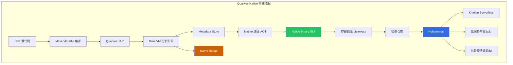
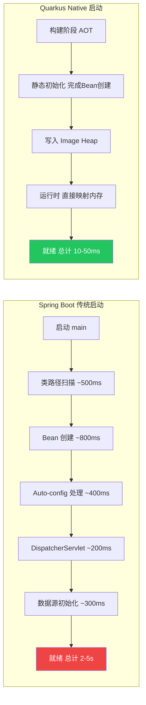
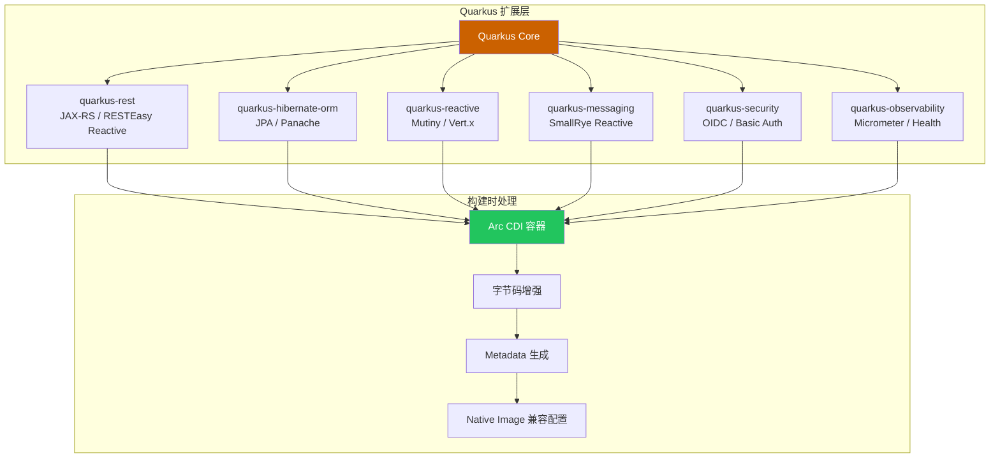

# Quarkus Native 编译与 Kubernetes 部署指南

> **适用版本**: JDK 17+ / Quarkus 3.18+ / GraalVM for JDK 21+ / Mandrel 21+ / Kubernetes v1.28+
> **最后更新**: 2026-04-30

---

## 一、概述

Quarkus 是 Red Hat 主导的云原生 Java 框架，核心理念是"容器优先"（Container First）。通过 GraalVM Native Image 编译或 Mandrel 构建工具，Quarkus 可实现 **10-50ms 启动时间**和 **30-80MB RSS 内存**——相比传统 Spring Boot 的 2-5s 启动和 200-500MB 内存，有一个数量级的提升。

### 1.1 为什么选择 Quarkus

| 特性 | Spring Boot JVM | Quarkus JVM | Quarkus Native |
|------|----------------|-------------|----------------|
| 启动时间 | 2-5s | 0.8-1.5s | 10-50ms |
| 首次响应 | 3-5s | 1-2s | 30-80ms |
| RSS 内存（空载） | 200-400MB | 100-180MB | 30-60MB |
| RSS 内存（负载） | 300-600MB | 150-300MB | 60-120MB |
| 镜像大小 | 300-500MB | 200-350MB | 40-80MB |
| GC 暂停 P99 | 50-200ms | 20-80ms | 1-5ms |

这种特性使 Quarkus 特别适合 Kubernetes 环境中的 Serverless（[[domain-19-landscape-references/01-cncf-landscape/graduated/knative/knative|Knative]]）、微服务和事件驱动架构。

### 1.2 Quarkus 架构核心理念

Quarkus 的性能优势来自三个核心设计：

1. **构建时元数据处理（Build-Time Metadata Processing）**：将传统框架在运行时通过反射完成的扫描、配置解析等工作前移到构建阶段
2. **静态初始化（Static Initialization）**：将 Bean 创建、依赖注入图构建等操作在 Native Image 编译期完成，运行时直接使用预构建结果
3. **Arc 容器（CDI 增强）**：基于 Javassist 的编译时字节码增强，取代运行时反射代理



---

## 二、架构设计

### 2.1 Quarkus vs Spring Boot 启动流程对比



### 2.2 内存模型深度对比

```
Spring Boot JVM 模式 (RSS ~300MB):
  JVM Heap:      150-250MB  (对象实例、缓存)
  Metaspace:      80-120MB  (类元数据)
  Thread Stacks:  30-50MB   (200线程 × 1MB)
  Code Cache:     40-60MB   (JIT 编译产物)
  GC Overhead:    20-40MB   (GC 数据结构)
  JVM Internal:   10-20MB   (JNI、内部缓冲)
  Direct Memory:  16-32MB   (NIO ByteBuffer)

Quarkus Native (RSS ~50MB):
  Native Heap:    20-40MB   (运行时对象分配)
  Image Heap:     15-25MB   (预初始化对象，编译时序列化)
  Thread Stacks:   5-10MB   (200线程 × 256KB)
  GC Overhead:      3-5MB   (Serial/Simple GC)
  无 Metaspace（类信息在编译时固化）
  无 Code Cache（无 JIT，AOT 编译）
  无 JVM Internal（无 JVM 运行时）
```

### 2.3 Quarkus 扩展生态架构



---

## 三、核心配置

### 3.1 完整项目 pom.xml

```xml
<?xml version="1.0" encoding="UTF-8"?>
<project xmlns="http://maven.apache.org/POM/4.0.0"
         xmlns:xsi="http://www.w3.org/2001/XMLSchema-instance"
         xsi:schemaLocation="http://maven.apache.org/POM/4.0.0 https://maven.apache.org/xsd/maven-4.0.0.xsd">
    <modelVersion>4.0.0</modelVersion>
    <groupId>com.example</groupId>
    <artifactId>quarkus-native-demo</artifactId>
    <version>1.0.0</version>
    <packaging>jar</packaging>

    <properties>
        <quarkus.platform.version>3.18.2</quarkus.platform.version>
        <native.maven.plugin.version>0.10.5</native.maven.plugin.version>
        <compiler-plugin.version>3.13.0</compiler-plugin.version>
        <surefire-plugin.version>3.5.2</surefire-plugin.version>
        <maven.compiler.source>21</maven.compiler.source>
        <maven.compiler.target>21</maven.compiler.target>
        <maven.compiler.release>21</maven.compiler.release>
        <project.build.sourceEncoding>UTF-8</project.build.sourceEncoding>
    </properties>

    <dependencyManagement>
        <dependencies>
            <dependency>
                <groupId>io.quarkus.platform</groupId>
                <artifactId>quarkus-bom</artifactId>
                <version>${quarkus.platform.version}</version>
                <type>pom</type>
                <scope>import</scope>
            </dependency>
        </dependencies>
    </dependencyManagement>

    <dependencies>
        <dependency>
            <groupId>io.quarkus</groupId>
            <artifactId>quarkus-rest</artifactId>
        </dependency>
        <dependency>
            <groupId>io.quarkus</groupId>
            <artifactId>quarkus-rest-jackson</artifactId>
        </dependency>
        <dependency>
            <groupId>io.quarkus</groupId>
            <artifactId>quarkus-hibernate-orm-panache</artifactId>
        </dependency>
        <dependency>
            <groupId>io.quarkus</groupId>
            <artifactId>quarkus-jdbc-postgresql</artifactId>
        </dependency>
        <dependency>
            <groupId>io.quarkus</groupId>
            <artifactId>quarkus-agroal</artifactId>
        </dependency>
        <dependency>
            <groupId>io.quarkus</groupId>
            <artifactId>quarkus-smallrye-health</artifactId>
        </dependency>
        <dependency>
            <groupId>io.quarkus</groupId>
            <artifactId>quarkus-smallrye-fault-tolerance</artifactId>
        </dependency>
        <dependency>
            <groupId>io.quarkus</groupId>
            <artifactId>quarkus-smallrye-openapi</artifactId>
        </dependency>
        <dependency>
            <groupId>io.quarkus</groupId>
            <artifactId>quarkus-micrometer-registry-prometheus</artifactId>
        </dependency>
        <dependency>
            <groupId>io.quarkus</groupId>
            <artifactId>quarkus-cache</artifactId>
        </dependency>
        <dependency>
            <groupId>io.quarkus</groupId>
            <artifactId>quarkus-security</artifactId>
        </dependency>
        <dependency>
            <groupId>io.quarkus</groupId>
            <artifactId>quarkus-oidc</artifactId>
        </dependency>
        <dependency>
            <groupId>io.quarkus</groupId>
            <artifactId>quarkus-hibernate-validator</artifactId>
        </dependency>
        <dependency>
            <groupId>io.quarkus</groupId>
            <artifactId>quarkus-junit5</artifactId>
            <scope>test</scope>
        </dependency>
        <dependency>
            <groupId>io.rest-assured</groupId>
            <artifactId>rest-assured</artifactId>
            <scope>test</scope>
        </dependency>
    </dependencies>

    <build>
        <plugins>
            <plugin>
                <groupId>io.quarkus.platform</groupId>
                <artifactId>quarkus-maven-plugin</artifactId>
                <version>${quarkus.platform.version}</version>
                <extensions>true</extensions>
                <executions>
                    <execution>
                        <goals>
                            <goal>build</goal>
                            <goal>generate-code</goal>
                            <goal>generate-code-tests</goal>
                        </goals>
                    </execution>
                </executions>
            </plugin>
            <plugin>
                <groupId>org.graalvm.buildtools</groupId>
                <artifactId>native-maven-plugin</artifactId>
                <version>${native.maven.plugin.version}</version>
                <configuration>
                    <metadataRepository>
                        <enabled>true</enabled>
                    </metadataRepository>
                    <agent>
                        <enabled>true</enabled>
                    </agent>
                </configuration>
            </plugin>
            <plugin>
                <groupId>org.apache.maven.plugins</groupId>
                <artifactId>maven-compiler-plugin</artifactId>
                <version>${compiler-plugin.version}</version>
                <configuration>
                    <parameters>true</parameters>
                </configuration>
            </plugin>
            <plugin>
                <groupId>org.apache.maven.plugins</groupId>
                <artifactId>maven-surefire-plugin</artifactId>
                <version>${surefire-plugin.version}</version>
                <configuration>
                    <systemPropertyVariables>
                        <java.util.logging.manager>org.jboss.logmanager.LogManager</java.util.logging.manager>
                        <maven.home>${maven.home}</maven.home>
                    </systemPropertyVariables>
                </configuration>
            </plugin>
        </plugins>
    </build>

    <profiles>
        <profile>
            <id>native</id>
            <activation>
                <property>
                    <name>native</name>
                </property>
            </activation>
            <properties>
                <skipITs>false</skipITs>
                <quarkus.native.enabled>true</quarkus.native.enabled>
            </properties>
        </profile>
    </profiles>
</project>
```

### 3.2 完整 application.yml 配置

```yaml
quarkus:
  application:
    name: quarkus-native-demo
    version: 1.0.0

  http:
    port: 8080
    access-log:
      enabled: true
      pattern: '%h %l %u %t "%r" %s %b "%{i,Referer}" "%{i,User-Agent}" %D'
    limits:
      max-body-size: 10M
      max-header-size: 20K

  native:
    enabled: true
    additional-build-args: >
      --initialize-at-run-time=io.netty.channel.DefaultChannelId,
      -H:+ReportExceptionStackTraces,
      --enable-url-protocols=http,https,
      --no-fallback,
      -H:MaxHeapSize=67108864
    resources:
      includes: application.yml,db/migration/**,META-INF/resources/**

  datasource:
    db-kind: postgresql
    jdbc:
      min-size: 5
      max-size: 20
      acquisition-timeout: 30s
      leak-detection-interval: 60s
    metrics:
      enabled: true

  hibernate-orm:
    dialect: postgresql
    database:
      generation: none
    metrics:
      enabled: true
    log:
      sql: false
      format-sql: false
      slow-query:
        enabled: true
        threshold: 500ms

  smallrye-health:
    root-path: /q/health
    liveness-path: /q/health/live
    readiness-path: /q/health/ready
    startup-path: /q/health/started
    check-enabled-default:
      readiness: true
      liveness: true
      startup: true

  micrometer:
    export:
      prometheus:
        enabled: true
        path: /q/metrics
    binder:
      http-server:
        enabled: true
      jvm:
        enabled: true

  cache:
    caffeine:
      product-detail:
        initial-capacity: 100
        maximum-size: 1000
        expire-after-write: 5M
        metrics-enabled: true

  log:
    level: INFO
    category:
      "com.example":
        level: DEBUG
      "io.quarkus.hibernate":
        level: WARN
    console:
      json:
        enabled: true
        pretty-print: false
    file:
      enable: false

  oidc:
    enabled: true
    auth-server-url: https://keycloak.example.com/realms/production
    client-id: quarkus-native-demo
    credentials:
      secret: ${KEYCLOAK_CLIENT_SECRET}
    token:
      issuer: any

  smallrye-openapi:
    path: /q/openapi
    info-title: Quarkus Native Demo API
    info-version: 1.0.0
    info-description: Product catalog REST API

app:
  max-items-per-page: 50
  cache:
    ttl: 300
    max-size: 1000
```

### 3.3 完整 JPA Entity 与 Panache Repository

```java
package com.example.entity;

import jakarta.persistence.Entity;
import jakarta.persistence.Table;
import jakarta.persistence.Column;
import jakarta.persistence.GeneratedValue;
import jakarta.persistence.GenerationType;
import jakarta.persistence.Id;
import jakarta.persistence.NamedQueries;
import jakarta.persistence.NamedQuery;
import jakarta.persistence.PrePersist;
import jakarta.persistence.PreUpdate;
import jakarta.validation.constraints.NotBlank;
import jakarta.validation.constraints.Positive;
import jakarta.validation.constraints.Size;
import java.time.Instant;

@Entity
@Table(name = "products")
@NamedQueries({
    @NamedQuery(name = "Product.findByCategory",
        query = "SELECT p FROM Product p WHERE p.category = :category ORDER BY p.name"),
    @NamedQuery(name = "Product.findActiveByPriceRange",
        query = "SELECT p FROM Product p WHERE p.active = true AND p.price BETWEEN :min AND :max"),
    @NamedQuery(name = "Product.countByCategory",
        query = "SELECT COUNT(p) FROM Product p WHERE p.category = :category")
})
public class Product {

    @Id
    @GeneratedValue(strategy = GenerationType.IDENTITY)
    private Long id;

    @NotBlank
    @Size(min = 1, max = 255)
    @Column(nullable = false)
    private String name;

    @Column(length = 2000)
    private String description;

    @Positive
    @Column(nullable = false)
    private Double price;

    @NotBlank
    @Column(nullable = false)
    private String category;

    @Column(name = "image_url")
    private String imageUrl;

    @Column(nullable = false)
    private Boolean active = true;

    @Column(name = "created_at", nullable = false, updatable = false)
    private Instant createdAt;

    @Column(name = "updated_at")
    private Instant updatedAt;

    @PrePersist
    protected void onCreate() {
        this.createdAt = Instant.now();
        this.updatedAt = Instant.now();
    }

    @PreUpdate
    protected void onUpdate() {
        this.updatedAt = Instant.now();
    }

    public Long getId() { return id; }
    public void setId(Long id) { this.id = id; }
    public String getName() { return name; }
    public void setName(String name) { this.name = name; }
    public String getDescription() { return description; }
    public void setDescription(String description) { this.description = description; }
    public Double getPrice() { return price; }
    public void setPrice(Double price) { this.price = price; }
    public String getCategory() { return category; }
    public void setCategory(String category) { this.category = category; }
    public String getImageUrl() { return imageUrl; }
    public void setImageUrl(String imageUrl) { this.imageUrl = imageUrl; }
    public Boolean getActive() { return active; }
    public void setActive(Boolean active) { this.active = active; }
    public Instant getCreatedAt() { return createdAt; }
    public Instant getUpdatedAt() { return updatedAt; }
    public void setUpdatedAt(Instant updatedAt) { this.updatedAt = updatedAt; }
}
```

```java
package com.example.repository;

import com.example.entity.Product;
import io.quarkus.hibernate.orm.panache.PanacheRepository;
import io.quarkus.panache.common.Page;
import io.quarkus.panache.common.Sort;
import jakarta.enterprise.context.ApplicationScoped;
import java.util.List;
import java.util.Optional;

@ApplicationScoped
public class ProductRepository implements PanacheRepository<Product> {

    public List<Product> findByCategory(String category, int pageIndex, int pageSize) {
        return find("category", Sort.by("name").and("price"), category)
            .page(Page.of(pageIndex, pageSize))
            .list();
    }

    public long countByCategory(String category) {
        return count("category", category);
    }

    public Optional<Product> findActiveById(Long id) {
        return find("id = ?1 AND active = true", id).firstResultOptional();
    }

    public List<Product> findActiveByPriceRange(double min, double max) {
        return getEntityManager()
            .createNamedQuery("Product.findActiveByPriceRange", Product.class)
            .setParameter("min", min)
            .setParameter("max", max)
            .getResultList();
    }

    public List<String> findAllCategories() {
        return getEntityManager()
            .createQuery("SELECT DISTINCT p.category FROM Product p ORDER BY p.category", String.class)
            .getResultList();
    }
}
```

### 3.4 完整 REST 资源类

```java
package com.example.resource;

import com.example.entity.Product;
import com.example.repository.ProductRepository;
import io.quarkus.cache.CacheResult;
import io.quarkus.security.Authenticated;
import io.quarkus.security.RolesAllowed;
import jakarta.inject.Inject;
import jakarta.transaction.Transactional;
import jakarta.validation.Valid;
import jakarta.ws.rs.*;
import jakarta.ws.rs.core.MediaType;
import jakarta.ws.rs.core.Response;
import org.eclipse.microprofile.faulttolerance.*;
import org.eclipse.microprofile.metrics.annotation.Counted;
import org.eclipse.microprofile.metrics.annotation.Timed;
import java.time.Instant;
import java.time.temporal.ChronoUnit;
import java.util.List;
import java.util.Map;

@Path("/api/v1/products")
@Produces(MediaType.APPLICATION_JSON)
@Consumes(MediaType.APPLICATION_JSON)
@Authenticated
public class ProductResource {

    @Inject
    ProductRepository productRepository;

    @GET
    @Timed(name = "products_list_time", description = "Time to list products")
    @Counted(name = "products_list_count", description = "Number of product list calls")
    @Timeout(value = 3, unit = ChronoUnit.SECONDS)
    @Fallback(fallbackMethod = "listProductsFallback")
    @CircuitBreaker(
        requestVolumeThreshold = 10,
        failureRatio = 0.5,
        delay = 5,
        delayUnit = ChronoUnit.SECONDS,
        successThreshold = 3
    )
    @Bulkhead(value = 20, waitingTaskQueue = 10)
    @Retry(maxRetries = 2, delay = 100, delayUnit = ChronoUnit.MILLIS)
    public Response listProducts(
            @QueryParam("page") @DefaultValue("1") int page,
            @QueryParam("size") @DefaultValue("20") int size,
            @QueryParam("category") String category) {

        List<Product> products;
        long total;

        if (category != null && !category.isBlank()) {
            products = productRepository.findByCategory(category, page - 1, size);
            total = productRepository.countByCategory(category);
        } else {
            products = productRepository.findAll().page(page - 1, size).list();
            total = productRepository.count();
        }

        return Response.ok(Map.of(
            "items", products,
            "pagination", Map.of(
                "page", page,
                "size", size,
                "total", total,
                "totalPages", (total + size - 1) / size
            )
        )).build();
    }

    public Response listProductsFallback(int page, int size, String category) {
        return Response.ok(Map.of(
            "items", List.of(),
            "pagination", Map.of(
                "page", page,
                "size", 0,
                "total", 0,
                "cached", true
            ),
            "fallback", true
        )).build();
    }

    @GET
    @Path("/{id}")
    @CacheResult(cacheName = "product-detail")
    @Timed(name = "products_get_time", description = "Time to get a product")
    public Response getProduct(@PathParam("id") Long id) {
        Product product = productRepository.findActiveById(id)
            .orElse(null);
        if (product == null) {
            return Response.status(Response.Status.NOT_FOUND)
                .entity(Map.of("error", "Product not found", "id", id))
                .build();
        }
        return Response.ok(product).build();
    }

    @POST
    @Transactional
    @RolesAllowed("admin")
    @Timed(name = "products_create_time", description = "Time to create a product")
    public Response createProduct(@Valid Product product) {
        product.setActive(true);
        productRepository.persist(product);
        return Response.status(Response.Status.CREATED)
            .entity(product)
            .build();
    }

    @PUT
    @Path("/{id}")
    @Transactional
    @RolesAllowed("admin")
    @Timed(name = "products_update_time", description = "Time to update a product")
    public Response updateProduct(@PathParam("id") Long id, @Valid Product update) {
        Product existing = productRepository.findById(id);
        if (existing == null) {
            return Response.status(Response.Status.NOT_FOUND)
                .entity(Map.of("error", "Product not found", "id", id))
                .build();
        }
        existing.setName(update.getName());
        existing.setDescription(update.getDescription());
        existing.setPrice(update.getPrice());
        existing.setCategory(update.getCategory());
        existing.setImageUrl(update.getImageUrl());
        existing.setActive(update.getActive());
        existing.setUpdatedAt(Instant.now());
        productRepository.persist(existing);
        return Response.ok(existing).build();
    }

    @DELETE
    @Path("/{id}")
    @Transactional
    @RolesAllowed("admin")
    public Response deleteProduct(@PathParam("id") Long id) {
        boolean deleted = productRepository.deleteById(id);
        if (!deleted) {
            return Response.status(Response.Status.NOT_FOUND)
                .entity(Map.of("error", "Product not found", "id", id))
                .build();
        }
        return Response.noContent().build();
    }

    @GET
    @Path("/categories")
    @CacheResult(cacheName = "product-categories")
    public Response listCategories() {
        List<String> categories = productRepository.findAllCategories();
        return Response.ok(Map.of("categories", categories)).build();
    }
}
```

### 3.5 SmallRye Health 自定义检查

```java
package com.example.health;

import io.agroal.api.AgroalDataSource;
import io.quarkus.agroal.DataSource;
import io.smallrye.health.api.HealthRegistry;
import io.smallrye.health.api.HealthType;
import jakarta.enterprise.context.ApplicationScoped;
import jakarta.inject.Inject;
import org.eclipse.microprofile.health.HealthCheck;
import org.eclipse.microprofile.health.HealthCheckResponse;
import org.eclipse.microprofile.health.HealthCheckResponseBuilder;
import org.eclipse.microprofile.health.Readiness;
import org.eclipse.microprofile.health.Liveness;
import org.eclipse.microprofile.health.Startup;
import java.sql.Connection;
import java.sql.ResultSet;
import java.sql.SQLException;
import java.sql.Statement;

@Readiness
@Liveness
@Startup
@ApplicationScoped
public class DatabaseHealthCheck implements HealthCheck {

    @Inject
    AgroalDataSource dataSource;

    @Override
    public HealthCheckResponse call() {
        HealthCheckResponseBuilder builder = HealthCheckResponse
            .named("database-connection")
            .up();

        try (Connection conn = dataSource.getConnection();
             Statement stmt = conn.createStatement();
             ResultSet rs = stmt.executeQuery("SELECT 1")) {

            if (rs.next()) {
                builder.withData("status", "connected");
            }

            io.agroal.api.AgroalDataSource.Metrics metrics = dataSource.getMetrics();
            builder.withData("activeCount", metrics.activeCount())
                   .withData("availableCount", metrics.availableCount())
                   .withData("awaitingCount", metrics.awaitingCount())
                   .withData("maxPoolSize", metrics.maxPoolSize());

        } catch (SQLException e) {
            builder.down()
                   .withData("error", e.getMessage())
                   .withData("sqlState", e.getSQLState());
        }

        return builder.build();
    }
}
```

```java
package com.example.health;

import io.smallrye.health.api.AsyncHealthCheck;
import io.smallrye.mutiny.Uni;
import jakarta.enterprise.context.ApplicationScoped;
import org.eclipse.microprofile.health.HealthCheckResponse;
import org.eclipse.microprofile.health.Readiness;

@Readiness
@ApplicationScoped
public class ReactiveHealthCheck implements AsyncHealthCheck {

    @Override
    public Uni<HealthCheckResponse> call() {
        return Uni.createFrom().item(
            HealthCheckResponse.named("reactive-check")
                .up()
                .withData("eventLoop", "active")
                .build()
        );
    }
}
```

### 3.6 异常处理与 CORS 配置

```java
package com.example.config;

import io.quarkus.runtime.annotations.RegisterForReflection;
import jakarta.ws.rs.core.Response;
import jakarta.ws.rs.ext.ExceptionMapper;
import jakarta.ws.rs.ext.Provider;
import jakarta.validation.ConstraintViolationException;
import jakarta.persistence.EntityNotFoundException;
import jakarta.persistence.OptimisticLockException;
import java.util.Map;
import java.util.stream.Collectors;

@Provider
public class GlobalExceptionHandler {

    @Provider
    @RegisterForReflection
    public static class ConstraintViolationMapper
            implements ExceptionMapper<ConstraintViolationException> {
        @Override
        public Response toResponse(ConstraintViolationException e) {
            Map<String, String> violations = e.getConstraintViolations().stream()
                .collect(Collectors.toMap(
                    v -> v.getPropertyPath().toString(),
                    v -> v.getMessage(),
                    (a, b) -> a
                ));
            return Response.status(400)
                .entity(Map.of(
                    "error", "Validation failed",
                    "violations", violations
                ))
                .build();
        }
    }

    @Provider
    @RegisterForReflection
    public static class EntityNotFoundMapper
            implements ExceptionMapper<EntityNotFoundException> {
        @Override
        public Response toResponse(EntityNotFoundException e) {
            return Response.status(404)
                .entity(Map.of("error", "Entity not found", "message", e.getMessage()))
                .build();
        }
    }

    @Provider
    @RegisterForReflection
    public static class OptimisticLockMapper
            implements ExceptionMapper<OptimisticLockException> {
        @Override
        public Response toResponse(OptimisticLockException e) {
            return Response.status(409)
                .entity(Map.of("error", "Concurrent modification conflict", "message", e.getMessage()))
                .build();
        }
    }

    @Provider
    @RegisterForReflection
    public static class ThrowableMapper
            implements ExceptionMapper<Throwable> {
        @Override
        public Response toResponse(Throwable e) {
            return Response.status(500)
                .entity(Map.of("error", "Internal server error", "message", e.getClass().getName()))
                .build();
        }
    }
}
```

```java
package com.example.config;

import io.quarkus.runtime.annotations.RegisterForReflection;
import jakarta.ws.rs.container.ContainerRequestFilter;
import jakarta.ws.rs.container.ContainerResponseFilter;
import jakarta.ws.rs.container.ContainerRequestContext;
import jakarta.ws.rs.container.ContainerResponseContext;
import jakarta.ws.rs.ext.Provider;
import org.jboss.logging.MDC;
import java.util.UUID;

@Provider
@RegisterForReflection
public class RequestTracingFilter implements ContainerRequestFilter, ContainerResponseFilter {

    @Override
    public void filter(ContainerRequestContext requestContext) {
        String traceId = requestContext.getHeaderString("traceparent");
        String requestId = UUID.randomUUID().toString().substring(0, 8);
        MDC.put("requestId", requestId);
        requestContext.setProperty("requestId", requestId);
        requestContext.setProperty("startTime", System.nanoTime());
    }

    @Override
    public void filter(ContainerRequestContext requestContext,
                       ContainerResponseContext responseContext) {
        Object startTime = requestContext.getProperty("startTime");
        if (startTime != null) {
            long duration = (System.nanoTime() - (Long) startTime) / 1_000_000;
            responseContext.getHeaders().putSingle(
                "X-Response-Time", duration + "ms"
            );
        }
        responseContext.getHeaders().putSingle(
            "X-Request-Id", requestContext.getProperty("requestId")
        );
        MDC.remove("requestId");
    }
}
```

### 3.7 Native Image 构建方式

```bash
# ===== 方式一: 本地构建 (需要 GraalVM) =====
sdk install java 21.0.6-graal
sdk use java 21.0.6-graal
mvn clean package -Pnative -DskipTests
time ./target/quarkus-native-demo-1.0.0-runner
# real 0m0.035s -- 35ms 启动

# ===== 方式二: 容器内构建 (推荐 CI/CD, 无需本地 GraalVM) =====
mvn clean package -Pnative \
  -Dquarkus.native.container-build=true \
  -Dquarkus.native.builder-image=quay.io/quarkus/ubi-quarkus-mandrel-builder-image:jdk-21

# ===== 方式三: 直接生成容器镜像 =====
mvn clean package -Pnative \
  -Dquarkus.native.container-build=true \
  -Dquarkus.container-image.build=true \
  -Dquarkus.container-image.registry=registry.example.com \
  -Dquarkus.container-image.name=myapp \
  -Dquarkus.container-image.tag=1.0.0-native \
  -Dquarkus.container-image.push=true

# ===== 方式四: 使用 Tracing Agent 收集 metadata =====
mvn quarkus:dev -Dquarkus.native.agent-attachment=true
# 运行所有 API 测试后，metadata 自动收集
# 然后重新构建 native image
mvn clean package -Pnative

# ===== 方式五: 手动使用 GraalVM Agent =====
java -agentlib:native-image-agent=config-output-dir=src/main/resources/META-INF/native-image \
  -jar target/quarkus-app/quarkus-run.jar
# 运行完整测试套件覆盖所有代码路径
```

### 3.8 生产级 Dockerfile

Native Image Dockerfile（生产推荐）:

```dockerfile
FROM quay.io/quarkus/quarkus-distroless-image:2.0
COPY target/*-runner /application
EXPOSE 8080
USER nonroot
ENTRYPOINT ["./application", "-Xmx64m"]
```

JVM 模式 Dockerfile:

```dockerfile
FROM quay.io/quarkus/quarkus-distroless-image:2.0
COPY target/quarkus-app/lib/ /deployments/lib/
COPY target/quarkus-app/*.jar /deployments/
COPY target/quarkus-app/app/ /deployments/app/
COPY target/quarkus-app/quarkus/ /deployments/quarkus/
EXPOSE 8080
USER nonroot
ENV JAVA_OPTS="-XX:+UseContainerSupport -XX:MaxRAMPercentage=75.0 -XX:+UseG1GC"
ENTRYPOINT ["sh", "-c", "exec java $JAVA_OPTS -jar /deployments/quarkus-run.jar"]
```

多阶段构建 Dockerfile（从源码到 Native）:

```dockerfile
FROM quay.io/quarkus/ubi-quarkus-mandrel-builder-image:jdk-21 AS build
WORKDIR /project
COPY pom.xml ./
COPY src ./src
RUN mvn clean package -Pnative -DskipTests \
    -Dquarkus.native.container-build=false

FROM quay.io/quarkus/quarkus-distroless-image:2.0
COPY --from=build /project/target/*-runner /application
EXPOSE 8080
USER nonroot
ENTRYPOINT ["./application", "-Xmx64m"]
```

### 3.9 Kubernetes Deployment (Native)

```yaml
apiVersion: apps/v1
kind: Deployment
metadata:
  name: quarkus-native-demo
  namespace: production
  labels:
    app: quarkus-native-demo
    version: v1
    framework: quarkus-native
spec:
  replicas: 3
  selector:
    matchLabels:
      app: quarkus-native-demo
  strategy:
    type: RollingUpdate
    rollingUpdate:
      maxSurge: 25%
      maxUnavailable: 0
  template:
    metadata:
      labels:
        app: quarkus-native-demo
        version: v1
      annotations:
        prometheus.io/scrape: "true"
        prometheus.io/port: "8080"
        prometheus.io/path: "/q/metrics"
    spec:
      terminationGracePeriodSeconds: 30
      serviceAccountName: quarkus-native-demo
      securityContext:
        runAsNonRoot: true
        runAsUser: 1001
        fsGroup: 1001
        seccompProfile:
          type: RuntimeDefault
      containers:
        - name: app
          image: registry.example.com/quarkus-native-demo:1.0.0-native
          ports:
            - name: http
              containerPort: 8080
          env:
            - name: QUARKUS_DATASOURCE_JDBC_URL
              valueFrom:
                configMapKeyRef:
                  name: app-config
                  key: DB_URL
            - name: QUARKUS_DATASOURCE_USERNAME
              valueFrom:
                secretKeyRef:
                  name: app-secrets
                  key: DB_USER
            - name: QUARKUS_DATASOURCE_PASSWORD
              valueFrom:
                secretKeyRef:
                  name: app-secrets
                  key: DB_PASS
            - name: KEYCLOAK_CLIENT_SECRET
              valueFrom:
                secretKeyRef:
                  name: app-secrets
                  key: KEYCLOAK_SECRET
          startupProbe:
            httpGet:
              path: /q/health/started
              port: http
            periodSeconds: 1
            failureThreshold: 30
          livenessProbe:
            httpGet:
              path: /q/health/live
              port: http
            periodSeconds: 10
            failureThreshold: 3
          readinessProbe:
            httpGet:
              path: /q/health/ready
              port: http
            periodSeconds: 5
            failureThreshold: 3
          resources:
            requests:
              memory: "64Mi"
              cpu: "50m"
            limits:
              memory: "128Mi"
              cpu: "500m"
          securityContext:
            allowPrivilegeEscalation: false
            readOnlyRootFilesystem: true
            capabilities:
              drop: ["ALL"]
          volumeMounts:
            - name: tmp
              mountPath: /tmp
      volumes:
        - name: tmp
          emptyDir: {}
      topologySpreadConstraints:
        - maxSkew: 1
          topologyKey: topology.kubernetes.io/zone
          whenUnsatisfiable: DoNotSchedule
          labelSelector:
            matchLabels:
              app: quarkus-native-demo
```

Knative Serverless 部署:

```yaml
apiVersion: serving.knative.dev/v1
kind: Service
metadata:
  name: quarkus-native-demo
  namespace: production
spec:
  template:
    metadata:
      annotations:
        autoscaling.knative.dev/minScale: "0"
        autoscaling.knative.dev/maxScale: "20"
        autoscaling.knative.dev/target: "10"
        autoscaling.knative.dev/scaleToZeroPodRetentionPeriod: "5m"
    spec:
      containerConcurrency: 100
      timeoutSeconds: 60
      containers:
        - image: registry.example.com/quarkus-native-demo:1.0.0-native
          ports:
            - containerPort: 8080
          env:
            - name: QUARKUS_DATASOURCE_JDBC_URL
              valueFrom:
                configMapKeyRef:
                  name: app-config
                  key: DB_URL
          resources:
            requests:
              memory: "64Mi"
              cpu: "50m"
            limits:
              memory: "128Mi"
              cpu: "500m"
```

KEDA 自定义伸缩（基于 Kafka 消费延迟）:

```yaml
apiVersion: keda.sh/v1alpha1
kind: ScaledObject
metadata:
  name: quarkus-native-demo-scaler
  namespace: production
spec:
  scaleTargetRef:
    name: quarkus-native-demo
  minReplicaCount: 1
  maxReplicaCount: 30
  cooldownPeriod: 60
  triggers:
    - type: kafka
      metadata:
        bootstrapServers: kafka.production:9092
        consumerGroup: quarkus-native-demo
        lagThreshold: "100"
```

---

## 四、最佳实践

### 4.1 Dev Services 自动化测试

Quarkus Dev Services 会在测试启动时自动拉起 PostgreSQL、Kafka 等容器，无需手动配置:

```java
package com.example.resource;

import io.quarkus.test.junit.QuarkusTest;
import io.quarkus.test.TestTransaction;
import io.restassured.http.ContentType;
import org.junit.jupiter.api.Test;
import org.junit.jupiter.api.Tag;
import static io.restassured.RestAssured.given;
import static org.hamcrest.Matchers.*;

@QuarkusTest
class ProductResourceTest {

    @Test
    void shouldListProducts() {
        given()
            .queryParam("page", 1)
            .queryParam("size", 10)
            .when()
            .get("/api/v1/products")
            .then()
            .statusCode(200)
            .body("items", notNullValue())
            .body("pagination.page", equalTo(1))
            .body("pagination.size", equalTo(10));
    }

    @Test
    void shouldCreateProduct() {
        given()
            .contentType(ContentType.JSON)
            .body("{\"name\":\"Test Product\",\"price\":99.99,\"category\":\"electronics\"}")
            .when()
            .post("/api/v1/products")
            .then()
            .statusCode(201)
            .body("name", equalTo("Test Product"))
            .body("price", equalTo(99.99f))
            .body("active", equalTo(true));
    }

    @Test
    void shouldReturn404ForMissingProduct() {
        given()
            .when()
            .get("/api/v1/products/99999")
            .then()
            .statusCode(404)
            .body("error", equalTo("Product not found"));
    }

    @Test
    void shouldRejectInvalidProduct() {
        given()
            .contentType(ContentType.JSON)
            .body("{\"name\":\"\",\"price\":-10}")
            .when()
            .post("/api/v1/products")
            .then()
            .statusCode(400)
            .body("error", equalTo("Validation failed"));
    }

    @Test
    void shouldFilterByCategory() {
        given()
            .queryParam("category", "electronics")
            .when()
            .get("/api/v1/products")
            .then()
            .statusCode(200)
            .body("items", everyItem(hasKey("category")));
    }
}
```

Native Image 集成测试（验证 native 二进制是否正常工作）:

```java
package com.example.resource;

import io.quarkus.test.junit.QuarkusIntegrationTest;
import org.junit.jupiter.api.Tag;
import org.junit.jupiter.api.Test;
import static io.restassured.RestAssured.given;
import static org.hamcrest.Matchers.equalTo;

@QuarkusIntegrationTest
@Tag("native")
class NativeProductResourceIT {

    @Test
    void testNativeHealthEndpoint() {
        given()
            .when()
            .get("/q/health/ready")
            .then()
            .statusCode(200)
            .body("status", equalTo("UP"));
    }

    @Test
    void testNativeMetricsEndpoint() {
        given()
            .when()
            .get("/q/metrics")
            .then()
            .statusCode(200);
    }

    @Test
    void testNativeOpenApiEndpoint() {
        given()
            .when()
            .get("/q/openapi")
            .then()
            .statusCode(200);
    }

    @Test
    void testNativeStartupTime() {
        long start = System.currentTimeMillis();
        given().when().get("/q/health/live").then().statusCode(200);
        long elapsed = System.currentTimeMillis() - start;
        assert elapsed < 100 : "Native image first response should be under 100ms, was " + elapsed;
    }
}
```

### 4.2 性能基准对比

| 指标 | Spring Boot JVM | Quarkus JVM | Quarkus Native | 提升 |
|------|----------------|-------------|----------------|------|
| **启动时间** | 2.5s | 0.8s | 35ms | 71x |
| **首次响应** | 3.2s | 1.1s | 50ms | 64x |
| **RSS 内存(空载)** | 280MB | 120MB | 45MB | 6.2x |
| **RSS 内存(负载)** | 380MB | 200MB | 80MB | 4.8x |
| **镜像大小** | 350MB | 280MB | 45MB | 7.8x |
| **请求延迟 P50** | 5ms | 4ms | 3ms | 1.7x |
| **请求延迟 P99** | 45ms | 30ms | 25ms | 1.8x |
| **吞吐量 (req/s)** | 15,000 | 18,000 | 20,000 | 1.3x |
| **GC 暂停 P99** | 120ms | 50ms | 2ms | 60x |
| **冷启动(Knative)** | 8-12s | 3-5s | 80-200ms | 60x |
| **Pod 密度(8GB节点)** | 8-12 | 20-30 | 80-120 | 10x |

### 4.3 Native Image 限制与应对方案

| 限制 | 影响 | 应对方案 |
|------|------|---------|
| **反射受限** | 动态代理、反射调用失败 | 使用 `@RegisterForReflection` 注册; 提供 `reflect-config.json` |
| **序列化受限** | 部分序列化框架不兼容 | 使用 Jackson（Quarkus 内建支持）; 配置 `serialization-config.json` |
| **动态类加载** | `Class.forName()` 失败 | 构建时通过 `--initialize-at-build-time` 预初始化 |
| **JNI 调用** | 需要 native 元数据 | 提供 `jni-config.json`; 使用 `@Uninterruptible` |
| **动态代理** | `java.lang.reflect.Proxy` 受限 | 使用 Quarkus ARC 代理; 注册 `proxy-config.json` |
| **资源文件** | 默认不包含非代码资源 | 配置 `quarkus.native.resources.includes` |
| **构建时间长** | Native 编译需 2-5 分钟 | 使用 Mandrel（更快）; CI/CD 缓存构建产物 |
| **调试困难** | 无 JIT、无 JMX | 使用 `--enable-monitoring` 启用 JFR; 日志增强 |
| **Finalizer 不支持** | `Object.finalize()` 不执行 | 改用 `try-with-resources` 或 `@PreDestroy` |
| **CGLIB 不支持** | Spring AOP 代理不工作 | 使用 Quarkus Arc CDI 拦截器 |

反射注册配置:

```java
@RegisterForReflection(targets = {
    com.example.entity.Product.class,
    com.example.dto.ProductPage.class,
    com.fasterxml.jackson.datatype.jsr310.JavaTimeModule.class,
    com.fasterxml.jackson.databind.ser.std.ToStringSerializer.class,
    java.time.Instant.class,
    java.time.LocalDateTime.class
})
public class ReflectionConfig {
}
```

资源包含配置:

```json
{
    "resources": {
        "includes": [
            {"pattern": "application.yml"},
            {"pattern": "META-INF/resources/.*"},
            {"pattern": "db/migration/.*"},
            {"pattern": ".*\\.sql$"},
            {"pattern": ".*\\.json$"}
        ]
    }
}
```

### 4.4 GraalVM Reachability Metadata

Quarkus 3.x 自动集成 GraalVM Reachability Metadata Repository，大部分第三方库无需手动配置。对于不在 repository 中的库，可通过 Tracing Agent 自动生成 metadata:

```bash
# 使用 Quarkus Agent（推荐）
mvn quarkus:dev -Dquarkus.native.agent-attachment=true
# 运行完整测试套件覆盖所有代码路径

# 或直接使用 GraalVM Agent
java -agentlib:native-image-agent=config-output-dir=src/main/resources/META-INF/native-image \
  -jar target/quarkus-app/quarkus-run.jar
```

---

## 五、性能调优

### 5.1 Native Image GC 策略

Native Image 支持三种 GC：

| GC | 适用场景 | 最大堆 | 暂停时间 |
|----|---------|--------|---------|
| Serial（默认） | 微服务/Serverless | < 128MB | < 1ms |
| G1（推荐） | 通用微服务 | 64MB-2GB | 5-20ms |
| Epsilon | 无 GC 需求 | 短生命周期 | 0ms |

```bash
# 使用 G1 GC（推荐生产环境）
./application -XX:+UseG1GC -Xmx128m

# 使用 Serial GC（最小内存）
./application -XX:+UseSerialGC -Xmx64m

# 使用 Epsilon GC（短生命周期批处理）
./application -XX:+UseEpsilonGC -Xmx256m

# 启用 GC 日志
./application -Xlog:gc*:file=gc.log:time,uptime,level,tags

# 启用 JFR 监控
./application -XX:+EnableJFR \
  -XX:StartFlightRecording=duration=60s,filename=app.jfr,settings=profile
```

### 5.2 JVM 模式调优

```bash
# 推荐生产 JVM 参数
JAVA_OPTS="-XX:+UseContainerSupport \
  -XX:MaxRAMPercentage=75.0 \
  -XX:InitialRAMPercentage=50.0 \
  -XX:+UseG1GC \
  -XX:MaxGCPauseMillis=100 \
  -XX:MaxMetaspaceSize=256m \
  -XX:+HeapDumpOnOutOfMemoryError \
  -XX:HeapDumpPath=/tmp/heapdump.hprof \
  -Xlog:gc*:file=/tmp/gc.log:time,uptime,level,tags"
```

### 5.3 内存调优建议

| 场景 | 推荐 -Xmx | 推荐 GC | K8s Memory Limit |
|------|----------|---------|-----------------|
| Serverless (Knative) | 32-64MB | Serial | 64-128Mi |
| 轻量 API | 64-128MB | G1 | 128-256Mi |
| 普通 CRUD 服务 | 128-256MB | G1 | 256-512Mi |
| 数据密集型 | 256-512MB | G1 | 512Mi-1Gi |
| 缓存服务 | 512MB-1GB | G1 | 1-2Gi |

---

## 六、故障排查

### 6.1 常见问题速查表

| 症状 | 可能原因 | 诊断方法 | 解决方案 |
|------|---------|---------|---------|
| 构建失败: `ClassNotFoundException` | 类未注册到 native image | 查看构建错误日志 | 添加 `@RegisterForReflection` |
| 运行时: `NoSuchMethodException` | 反射调用未注册 | 查看 native image 日志 | 配置 `reflect-config.json` |
| 资源文件找不到 | 未包含到 native image | 检查 `resources.includes` | 添加到 `resource-config.json` |
| 序列化失败 | 序列化类未注册 | 查看 `SerializationException` | 配置 `serialization-config.json` |
| 启动崩溃: `ImageHeap` | 构建时初始化冲突 | 查看 `--initialize-at-run-time` | 调整初始化时机 |
| 数据库连接失败 | 驱动未适配 native | 查看 JDBC 驱动兼容性 | 使用 Quarkus 内建 JDBC 扩展 |
| 内存超出限制 | native heap 配置不当 | 查看 RSS 使用量 | 调整 `-Xmx` 和 `-H:MaxHeapSize` |
| P99 延迟高 | GC 配置不当 | 查看 GC 日志 | 切换到 G1 GC 或增大堆 |
| 构建时间过长 | 分析范围过大 | 查看 build log 时间线 | 排除不必要的依赖 |
| Knative 冷启动慢 | 镜像拉取慢 | 查看 pod event | 使用镜像预热或 `minScale > 0` |
| `UnsupportedFeatureError` | 使用了 Native 不支持的特性 | 查看异常栈 | 查阅 GraalVM 限制文档 |
| Jackson 序列化失败 | DTO 未注册反射 | 查看 `UnrecognizedPropertyException` | `@RegisterForReflection` 注册 DTO |
| OIDC 认证失败 | Native 模式下 SSL 问题 | 查看 SSL handshake 错误 | 添加 `--enable-url-protocols=https` |

### 6.2 常见构建问题排查命令

```bash
# 查看 native image 详细构建日志
mvn package -Pnative -Dquarkus.native.additional-build-args="--verbose"

# 查看运行时异常栈（默认被截断）
mvn package -Pnative \
  -Dquarkus.native.additional-build-args="-H:+ReportExceptionStackTraces"

# 启用 JFR 监控（Native Image）
./application -XX:+EnableJFR \
  -XX:StartFlightRecording=duration=60s,filename=app.jfr

# 查看 Native Image 内存使用
./application -H:+PrintHeapStatistics

# 检查 Native Image 包含的资源
native-image --list-resources -jar target/quarkus-native-demo-1.0.0-runner.jar

# 查看 Native Image 已注册的反射类
native-image --list-reflection -jar target/quarkus-native-demo-1.0.0-runner.jar

# 完整端到端验证脚本
#!/bin/bash
set -euo pipefail

echo "=== 1. 验证健康检查 ==="
curl -sf http://localhost:8080/q/health | python3 -m json.tool

echo -e "\n=== 2. 验证 Metrics ==="
curl -sf http://localhost:8080/q/metrics | head -30

echo -e "\n=== 3. 验证 OpenAPI ==="
curl -sf http://localhost:8080/q/openapi | python3 -m json.tool | head -20

echo -e "\n=== 4. 测试 CRUD ==="
ID=$(curl -sf -X POST http://localhost:8080/api/v1/products \
  -H "Content-Type: application/json" \
  -H "Authorization: Bearer $TOKEN" \
  -d '{"name":"Test","price":10.0,"category":"test"}' \
  | python3 -c "import sys,json; print(json.load(sys.stdin)['id'])")

curl -sf http://localhost:8080/api/v1/products/$ID | python3 -m json.tool
curl -sf -X DELETE http://localhost:8080/api/v1/products/$ID \
  -H "Authorization: Bearer $TOKEN" -o /dev/null -w "DELETE: %{http_code}\n"
```

---

## 七、参考资源

- [Quarkus 官方文档](https://quarkus.io/guides/)
- [Quarkus Native Image 指南](https://quarkus.io/guides/building-native-image)
- [GraalVM Native Image 文档](https://docs.oracle.com/en/graalvm/enterprise/22/docs/reference-manual/native-image/)
- [GraalVM Reachability Metadata](https://github.com/oracle/graalvm-reachability-metadata)
- [Quarkus Dev Services](https://quarkus.io/guides/dev-services)
- [SmallRye Health](https://quarkus.io/guides/microprofile-health)
- [SmallRye Fault Tolerance](https://quarkus.io/guides/microprofile-fault-tolerance)
- [Quarkus on Knative](https://quarkus.io/guides/deploying-to-knative)
- [Mandrel (Quarkus 专用 GraalVM)](https://github.com/graalvm/mandrel)
- [Quarkus Panache ORM](https://quarkus.io/guides/hibernate-orm-panache)
- [Quarkus Security OIDC](https://quarkus.io/guides/security-oidc-bearer-token-authentication)
- [Quarkus Cache](https://quarkus.io/guides/cache)
