# Kubernetes 网络基础 Network in a Nutshell

> 目标：**用一套 Mermaid 图看懂 K8s 网络**，再配合 **kind 本地集群**全部动手验证一遍。
>
> 👶 **本文对 Linux 小白友好** —— 只要你知道「IP 是什么、ping 是什么、`ls` 怎么用」，就可以从头读到尾。

Kubernetes 网络看似复杂，但只要抓住两条主线就不会迷路：

- **主线一：K8s 只定义「网络应该长什么样」（网络模型），不关心「怎么实现」。**
- **主线二：具体实现由 CNI 插件、kube-proxy、CoreDNS、Ingress 这几个角色分工协作完成。**

---

<!-- chunk: 👶 写给 Linux 小白：5 分钟打好地基 -->
## 👶 写给 Linux 小白：5 分钟打好地基

在钻进 K8s 之前，先把 **5 个 Linux 网络概念**铺平。这些就是 K8s 网络的「砖瓦」，理解它们之后，后文一切都会豁然开朗。

### 0. 一个生活化比喻：K8s 集群 = 一个小区

| 现实世界 | K8s 世界 | 说明 |
| :--- | :--- | :--- |
| 🏢 一栋楼 | **Node（节点）** | 一台物理机或虚拟机 |
| 🏠 一套房 | **Pod** | 运行容器的最小单位 |
| 👨‍👩‍👧 同住一家人 | Pod 内的多个**容器** | 共用门牌号（IP） |
| 📮 门牌号 | **Pod IP** | 每个 Pod 一个唯一 IP |
| ☎️ 小区前台总机 | **Service** | 对外稳定的电话，内部会转分机 |
| 🧭 小区广播找人 | **CoreDNS** | 报个名字就知道找谁 |
| 🚪 小区大门保安 | **Ingress** | 外面人进来先经过这里 |
| 🛡️ 每户门禁卡 | **NetworkPolicy** | 谁能进哪间房 |

记住这张表，下面所有术语你都能用生活场景对应起来。

### 1. 两台 Linux 怎么通信？（复习基本功）

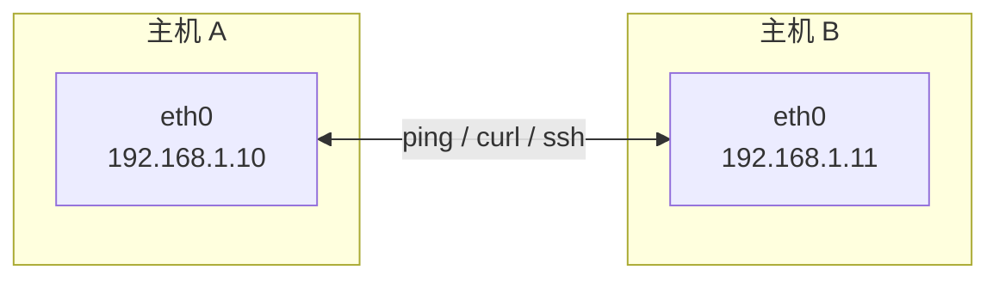

你能 `ping 192.168.1.11`，本质上就是：
- 内核根据**路由表**（`ip route`）决定"这个包往哪扔"
- 通过**网卡**（`eth0`）把包送上物理网络
- 对端收到后返回

K8s 网络做的事情，说白了就是：**在这个基础上，让每个"容器"也拥有自己的 eth0 和 IP，并确保它们能像两台主机一样直接互通。**

### 2. Network Namespace：Linux 自带的"网络小黑屋"

Linux 内核允许把网络栈**隔离成多个独立的"小世界"**，每个叫一个 **Network Namespace（netns）**。每个 netns 有自己独立的：

- 网卡列表
- IP 地址
- 路由表
- 防火墙规则

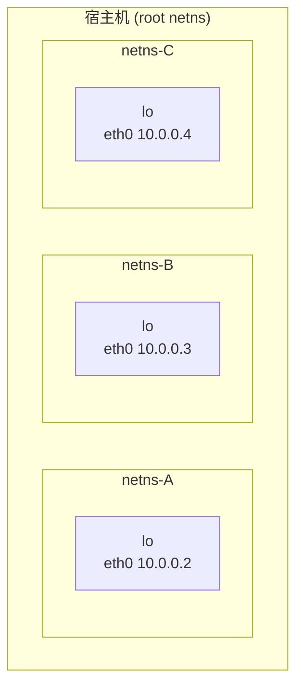

> 💡 **一句话**：**一个 Pod = 一个 Network Namespace**。Pod 里的容器都挤进同一个 netns，所以它们共用 IP、能用 `localhost` 聊天。

动手感受（需要 root）：

```bash
sudo ip netns add demo          # 创建一个 netns
sudo ip netns exec demo ip a    # 在这个 netns 里看网卡，只有 lo
sudo ip netns del demo
```

### 3. veth pair：连接"小黑屋"的网线

netns 互相是隔离的，怎么让它们通信？答：用 **veth pair（虚拟网线）**。

veth 总是**成对出现**，一端插在 A，一端插在 B，从一端进去的包会从另一端出来 —— 就像一根真实的网线。

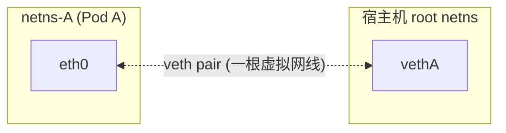

K8s 给每个 Pod 建 netns 时，**就是靠 veth pair 把 Pod 连出来**。

### 4. Linux Bridge：宿主机里的"虚拟交换机"

一个 Node 上有很多 Pod，难道要两两拉线？当然不是 —— 用 **Bridge（`cni0` / `docker0`）** 把所有 veth 的一端汇总起来，就是一台软件版的交换机。

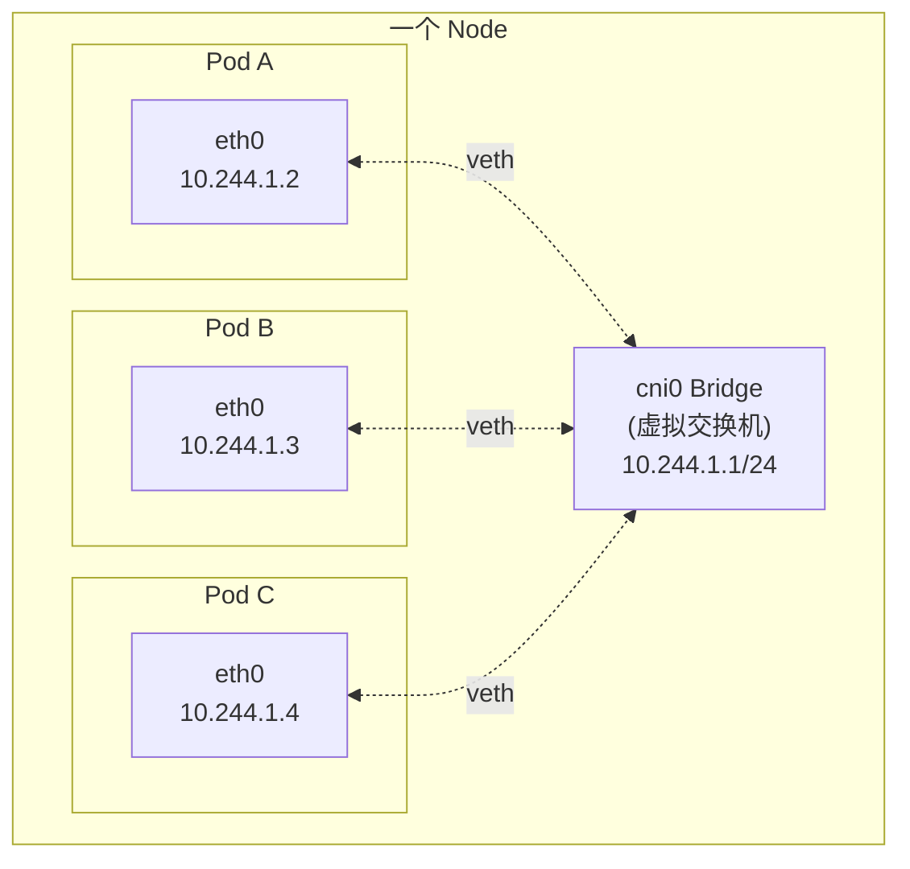

> 💡 同一个 Node 上的 Pod 互相通信，本质上就是**二层交换机转发**。

### 5. iptables 与 NAT：包的"变脸术"

**iptables** 是 Linux 内核自带的防火墙 / 包处理引擎，你可以用它来：
- 放行/拒绝流量
- **改写**数据包的源/目的地址（这就是 NAT）

K8s 里最常见的用法：

| 场景 | 技术 | 作用 |
| :--- | :--- | :--- |
| Pod → Service | **DNAT**（目的地址转换） | 把包的目的 IP 从 `ClusterIP` 改写成某个具体 Pod IP |
| Pod → 外网 | **SNAT**（源地址转换） | 把包的源 IP 改成 Node IP，避免回包丢失 |

#### 🎬 DNAT 演示：Pod 访问 Service 时，包是怎么"变脸"的

想象你给小区前台总机打电话 `2000`，前台帮你转到王阿姨家的分机 `2007`。**电话号码被改写了，但你这边毫无感知**。DNAT 就是这么回事。

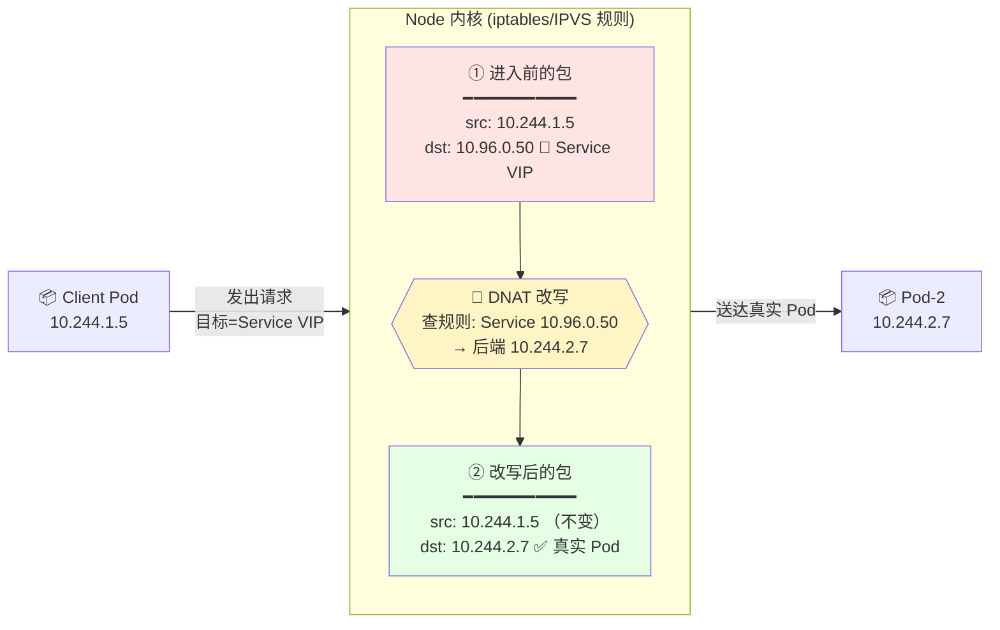

**关键点**：
- ✏️ **只改目的地址**（`dst`）：从虚拟的 Service IP → 真实的某个 Pod IP
- ✅ **源地址不变**：这样 Pod-2 能直接回包给 Client，`conntrack` 在回程路径上再自动把源 IP 改回 Service IP，**Client 以为自己一直在和 Service 对话**
- 🎛️ **规则来源**：`kube-proxy` 观察 Service/Endpoints 变化，实时把规则写进 iptables/IPVS

#### 🎬 SNAT 演示：Pod 访问外网时，包是怎么"伪装"的

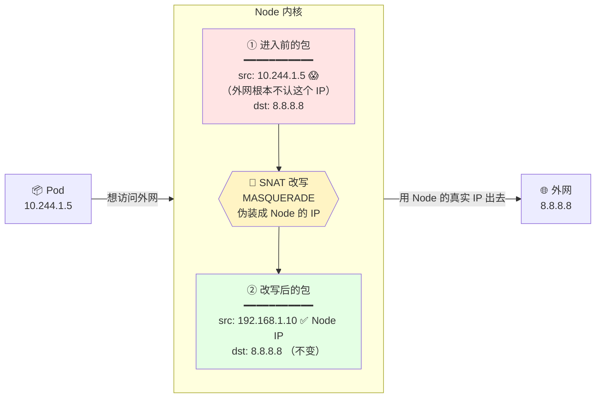

**为什么必须 SNAT？** Pod IP（`10.244.x.x`）是集群内部虚拟 IP，**外网的路由器根本不知道怎么回包给它**。所以出集群前要把源 IP 换成 Node 的真实 IP，回包到 Node 后再由内核（conntrack）改回 Pod IP。

#### 🧠 一张图记住 DNAT vs SNAT

| | **DNAT**（目的地址转换） | **SNAT**（源地址转换） |
| :--- | :--- | :--- |
| 改哪里 | ✏️ 改**目的** IP/端口 | ✏️ 改**源** IP/端口 |
| 典型场景 | Pod → Service<br/>外部 → NodePort | Pod → 外网<br/>（内网出公网） |
| 生活比喻 | ☎️ 前台**转分机** | 🎭 出门**戴口罩**（伪装身份） |
| 谁写规则 | `kube-proxy` | CNI / 内核 `MASQUERADE` |

> ⚠️ 记住这个口诀：**`kube-proxy` 不搬包，它只写规则；真正搬包的是内核里的 iptables/IPVS。**

### 🗺️ 从 Linux 概念到 K8s 概念的映射

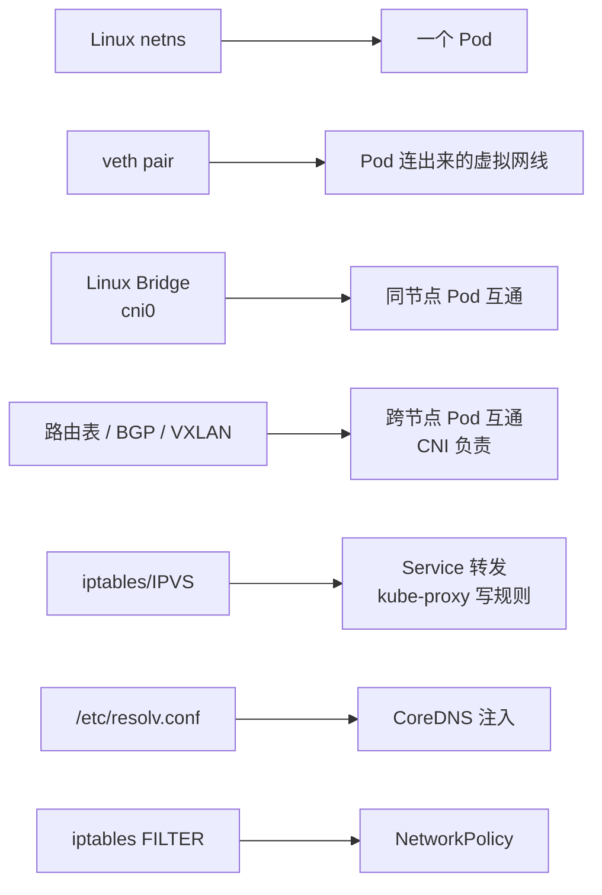

👉 看懂这张映射图，你其实已经懂 80% 了。剩下的只是「K8s 怎么把这些 Linux 原语编排起来」的细节。

### 📖 术语速查（遇到不认识的随时翻回来）

| 词 | 是什么 | 一句话理解 |
| :--- | :--- | :--- |
| **Node** | 集群里的一台机器 | 楼房 |
| **Pod** | 容器运行的最小单位 | 一套房 |
| **Container** | Pod 里真正跑代码的单元 | 住户 |
| **IP / ClusterIP** | 网络地址 / Service 的虚拟 IP | 门牌号 / 前台总机 |
| **CNI** | 容器网络接口（插件标准） | 谁负责布线 |
| **kube-proxy** | 每 Node 上写转发规则的组件 | 负责"前台转分机"的人 |
| **CoreDNS** | 集群内置 DNS | 广播找人的 |
| **Ingress** | L7 外部入口 | 小区大门 |
| **NetworkPolicy** | Pod 级防火墙 | 门禁卡 |
| **netns** | Linux 网络命名空间 | 一间独立网络小黑屋 |
| **veth pair** | 成对的虚拟网卡 | 一根虚拟网线 |
| **Bridge** | Linux 二层软交换机 | 虚拟交换机 |
| **NAT / DNAT / SNAT** | 地址转换 | 包的变脸术 |
| **VXLAN** | 一种隧道封装 | 套信封打包裹 |
| **BGP** | 一种路由协议 | 路由器之间互相"报路" |
| **eBPF** | 内核可编程字节码 | 在内核里插"热补丁" |

---

<!-- chunk: 📑 全景脑图 -->
## 📑 全景脑图

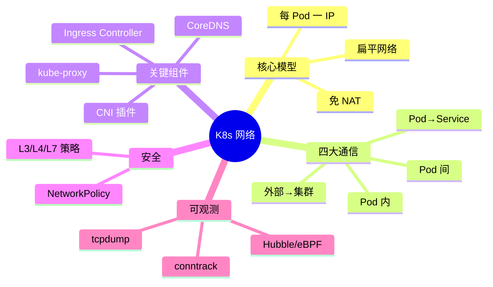

---

<!-- chunk: 📑 目录 -->
## 📑 目录

0. [写给 Linux 小白：5 分钟打好地基](#-写给-linux-小白5-分钟打好地基) 👶
1. [核心设计哲学](#-核心设计哲学扁平化网络)
2. [四大通信模型](#-四大通信模型必懂)
3. [关键组件分工](#-关键组件分工谁干什么)
4. [一次请求的完整旅程](#-一次请求的完整旅程从浏览器到-pod)
5. [主流 CNI 插件对比](#-主流-cni-插件对比选型参考)
6. [网络策略 NetworkPolicy](#️-网络策略-networkpolicy)
7. [服务发现与 DNS](#-服务发现coredns)
8. [kind 本地实战验证](#-kind-本地实战验证一次做完所有场景)
9. [常见陷阱与排障](#-常见陷阱与排障)

---

<!-- chunk: 🎯 核心设计哲学：扁平化网络 -->
## 🎯 核心设计哲学：扁平化网络

K8s 网络模型只有一条基本法，称为 **「扁平网络三原则」**：

| 原则 | 含义 |
| :--- | :--- |
| **Pod 唯一 IP** | 每个 Pod 拥有独立 IP，像一台独立主机 |
| **免 NAT 互通** | 所有 Pod、Node 之间直接通过 IP 通信，**不做地址转换** |
| **容器共享 Pod** | 同 Pod 内容器共享网络栈，通过 `localhost` 通信 |

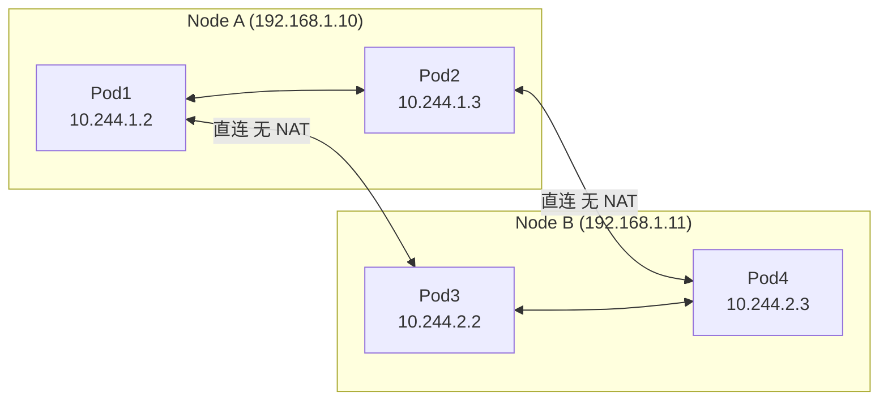

> 💡 **对比 Docker**：Docker 默认给容器私有 IP，跨主机需要端口映射。K8s 强制「全集群一张平坦大网」，极大降低应用开发者的心智负担。

---

<!-- chunk: 🧩 四大通信模型（必懂） -->
## 🧩 四大通信模型（必懂）

### 先用生活比喻秒懂

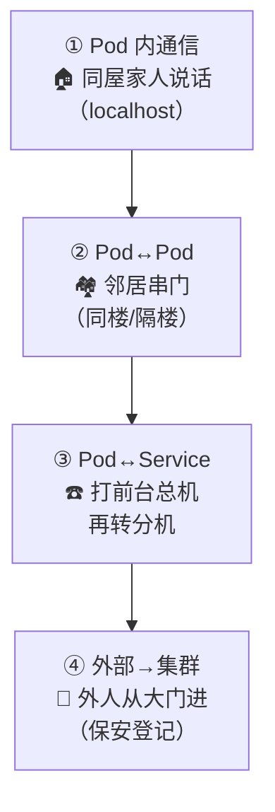

| 模型 | 场景 | 谁负责 | 技术底层 |
| :--- | :--- | :--- | :--- |
| ① Pod 内 | 同一个 Pod 的容器互相调用 | Linux 内核 | 共享 netns + localhost |
| ② Pod↔Pod | 任意两个 Pod 相互访问 | **CNI 插件** | veth+bridge / VXLAN / BGP |
| ③ Pod↔Service | Pod 通过稳定入口访问一组 Pod | **kube-proxy** | iptables/IPVS DNAT |
| ④ 外部→集群 | 外网/办公网访问集群里的服务 | **Ingress / LB** | L4/L7 反向代理 |

下面逐个展开。

### 模型 1：Pod 内部通信

Pod 内所有容器**共享同一个 Network Namespace**，共用网卡、IP、端口空间。

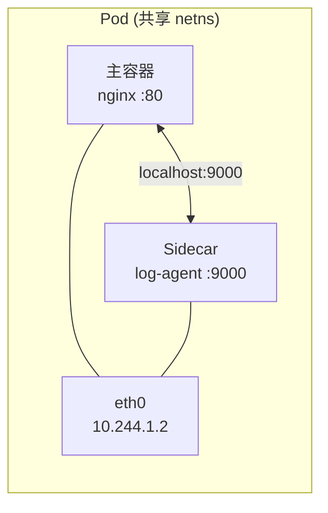

> ⚠️ 同 Pod 内容器**不能监听相同端口**（会冲突）。

### 模型 2：Pod ↔ Pod 通信（CNI 主战场）

#### ① 同节点：Linux Bridge + veth pair

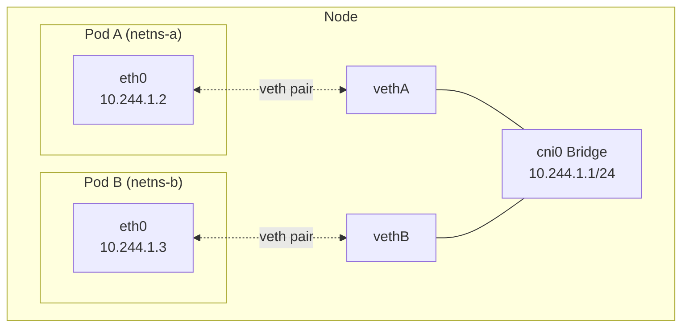

#### ② 跨节点：三种主流路线

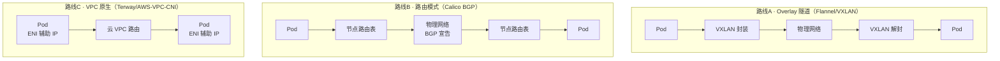

| 路线 | 原理 | 代表 | 性能 | 适用场景 |
| :--- | :--- | :--- | :--- | :--- |
| Overlay 隧道 | VXLAN/IPIP 再封一层 | Flannel、Calico(IPIP) | 中（封包开销） | 底层网络不可控 |
| 路由模式 | BGP 宣告 Pod 网段 | Calico(BGP) | 高 | 机房可配路由 |
| VPC 原生 | ENI / 辅助 IP 直挂 | AWS VPC CNI、**Terway**、Cilium ENI | 高 | 公有云托管集群 |

> 💡 **Terway 属于 VPC 原生（Underlay）**，不走 VXLAN；在「Overlay vs 路由」二分法里更偏向「路由/原生 IP」一侧。

### 模型 3：Pod ↔ Service 通信

**问题**：Pod IP 会随重建而变，不能作为稳定入口。**解决**：Service 提供稳定 VIP + DNS。

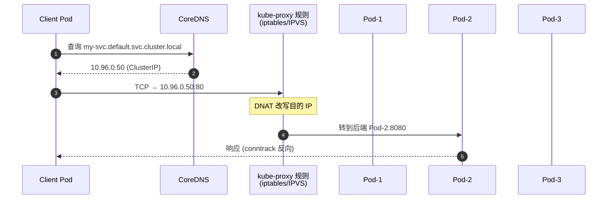

**三种转发模式**：

| 模式 | 机制 | 特点 | 何时用 |
| :--- | :--- | :--- | :--- |
| `iptables` | 规则链匹配 | 简单稳定，规则多时变慢 | 默认，中小集群 |
| `IPVS` | 内核哈希表 | O(1) 查找，多算法 | **大集群推荐** |
| `eBPF` | 字节码直挂内核 | 性能最高，可观测强 | Cilium |

### 模型 4：集群外部 → 集群内部

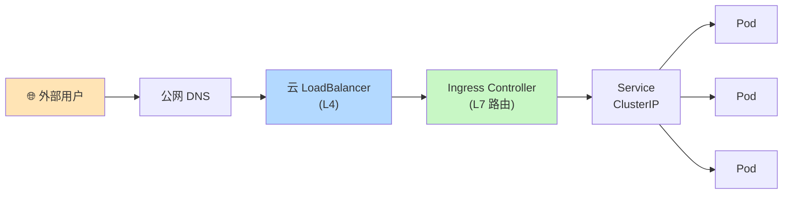

| 方式 | 层级 | 典型用途 |
| :--- | :--- | :--- |
| `hostNetwork` / `hostPort` | L3/L4 | 守护进程、调试 |
| `NodePort` | L4 | 裸机、测试 |
| `LoadBalancer` | L4 | 云上生产 |
| `Ingress` / `Gateway API` | L7 | **生产标准做法** |

---

<!-- chunk: 🔧 关键组件分工：谁干什么？ -->
## 🔧 关键组件分工：谁干什么？

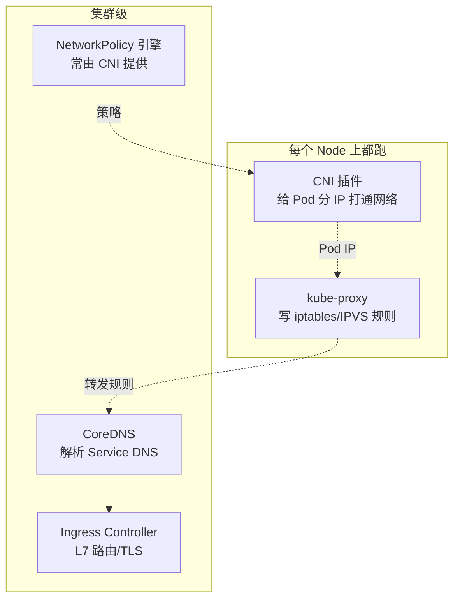

| 组件 | 职责 | 不做什么 |
| :--- | :--- | :--- |
| **CNI 插件** | 分配 Pod IP、打通 Pod 网络 | 不管 Service 转发 |
| **kube-proxy** | 把 Service VIP 流量转到 Pod | **不转发数据包**本身（只写规则） |
| **CoreDNS** | 解析 Service/Pod DNS | 不做转发 |
| **Ingress Controller** | L7 路由、TLS、限流 | 非默认组件 |
| **NetworkPolicy 引擎** | 执行 Pod 防火墙 | Flannel 原生不支持 |

> ⚠️ `kube-proxy` 名字带 proxy，**实际不搬数据包**，只是把规则写入 iptables/IPVS，真正搬包的是 Linux 内核。

---

<!-- chunk: 🚦 一次请求的完整旅程：从浏览器到 Pod -->
## 🚦 一次请求的完整旅程：从浏览器到 Pod

用一个真实例子：**你在浏览器输入 `https://api.example.com/users`，回车后会发生什么？**

先上全景图，再逐步拆解每一跳到底在干嘛。

### 📍 全景时序图（带"包的模样"标注）

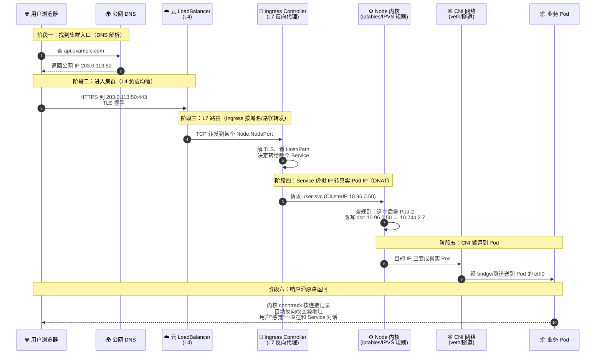

### 🔬 每一跳到底在干嘛？（逐阶段详解）

#### 阶段一：DNS 解析 —— "它家在哪？"

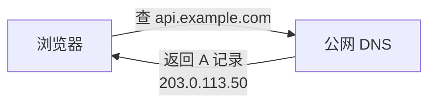

- **做什么**：把域名翻译成 IP。`api.example.com` → `203.0.113.50`（通常是云 LB 的公网 IP）。
- **关键概念**：这里走的是**公网 DNS**，和集群内 CoreDNS 无关。
- **容易踩的坑**：云厂商 LB 换 IP 后 DNS 缓存没刷新 → 用户连不上。

#### 阶段二：公网 → 云 LoadBalancer —— "过海关"

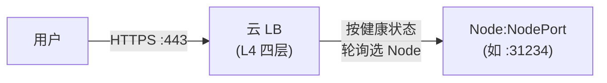

- **做什么**：云厂商 LB（AWS ELB / 阿里 SLB / GCP LB）把流量分发到任意一个健康的 Node。
- **为什么需要**：多个 Node 都能接流量，LB 提供**单一公网入口 + 健康检查 + 故障转移**。
- **L4 还是 L7**：大多数 `Service: LoadBalancer` 是 **L4**（只看 IP+端口，不解 HTTP）；TLS 一般在下游的 Ingress 终止。

#### 阶段三：Ingress Controller —— "小区前台分诊"

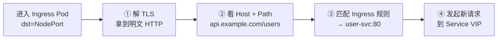

- **做什么**：Ingress Controller（如 Nginx、Traefik、Istio Gateway）是一个**反向代理 Pod**。它：
  1. **终止 TLS**（拿到明文才能看 URL）
  2. **按域名 + 路径**匹配你写的 `Ingress` 资源
  3. **转发到对应 Service**
- **关键概念**：
  - **L7**：能看懂 HTTP，才能按路径分发（`/users` vs `/orders` 分到不同 Service）
  - **反向代理**：它是一个 **新发起连接** 的客户端，对后端来说"请求来自 Ingress Pod"
- **容易踩的坑**：Ingress 规则里 Host 写错 / TLS 证书过期 → 404 或证书错误。

#### 阶段四：Service DNAT —— "前台转分机"⭐核心

```mermaid
flowchart LR
    P1["包进入 Node 内核<br/>━━━━━━━━<br/>src=Ingress IP<br/>dst=10.96.0.50 🎯 Service VIP"]
    P1 --> Q{iptables/IPVS<br/>查 Service 规则}
    Q --> Pick["随机挑一个<br/>健康的 Endpoint"]
    Pick --> P2["改写后的包<br/>━━━━━━━━<br/>src=Ingress IP (不变)<br/>dst=10.244.2.7 ✅ 真实 Pod"]

    style P1 fill:#ffe4e4
    style P2 fill:#e4ffe4
    style Q fill:#fff4c4
```

- **做什么**：Service 的 `ClusterIP`（`10.96.0.50`）是**虚拟 IP**，在任何网卡上都不存在。**内核按 `kube-proxy` 写的规则做 DNAT**，把目的 IP 从"虚"换成"实"。
- **关键概念**：
  - **ClusterIP**：集群内部有效的虚拟 IP，不出集群
  - **Endpoints**：Service 后面真实 Pod IP 的列表，由 K8s 自动维护
  - **kube-proxy**：后台观察 Service/Endpoints 变化，**把规则写进 iptables/IPVS**（它自己不搬包）
  - **conntrack**：内核的"连接追踪"，记住"这条连接改过地址"，回包时自动反向改回去
- **负载均衡**：iptables 模式用概率匹配多条规则；IPVS 模式用内核哈希表，大规模更快。

#### 阶段五：CNI 搬运到 Pod —— "小区内部送件"

```mermaid
flowchart TB
    Start["改写后的包<br/>dst=10.244.2.7"] --> Q{Pod 在哪台 Node?}
    Q -->|同 Node| L2["走 cni0 Bridge<br/>纯二层转发"]
    Q -->|跨 Node| L3["查路由表<br/>10.244.2.0/24 via flannel.1 或 其他节点"]
    L3 --> Tun["经 VXLAN/IPIP/BGP<br/>到对端 Node"]
    Tun --> L2b["对端 cni0 Bridge"]
    L2 --> Veth["veth pair<br/>穿进 Pod netns"]
    L2b --> Veth
    Veth --> PodEth["Pod 的 eth0<br/>(10.244.2.7)"]
```

- **做什么**：这是 **CNI 插件的主战场**。包进入 Node 内核后：
  - **同 Node**：cni0 Bridge（软件 L2 交换机）直接二层转发到目标 Pod 的 veth
  - **跨 Node**：查 Node 路由表 → 经 VXLAN 隧道 / BGP 路由 / VPC ENI 到对端 Node
- **关键概念**：
  - **veth pair**：一端在 Pod netns（叫 `eth0`），一端插在宿主机 Bridge 上
  - **Overlay vs Underlay**：前者在原包外再包一层（VXLAN）；后者在底层网络直接跑 Pod IP（BGP/VPC）
- **容易踩的坑**：MTU 配错（VXLAN 要比物理链路小 50 字节）→ 大包被默默丢弃。

#### 阶段六：响应回程 —— "原路折返" ⭐容易忽略

```mermaid
sequenceDiagram
    participant Pod
    participant CT as conntrack
    participant User as 用户

    Pod->>CT: 回包<br/>src=10.244.2.7<br/>dst=Ingress IP
    Note over CT: 查连接表<br/>发现来时做过 DNAT<br/>自动反向 SNAT
    CT->>User: src 改回 Service VIP<br/>用户感觉一直在和 Service 通信
```

- **关键概念 conntrack（连接追踪）**：内核维护一张"**谁和谁正在通信、来时改过什么地址**"的表。回包时自动按这张表**反向改地址**，让通信对双方透明。
- **为什么必须对称**：如果回包走了别的路径、跳过了 conntrack，**源地址不一致** → 客户端直接丢包（TCP 视为非法报文）。这也是为什么 `externalTrafficPolicy`、对称路由、NAT 对称性这些配置那么重要。

### 🧩 关键术语回顾表

| 术语 | 干什么 | 出现在哪个阶段 |
| :--- | :--- | :--- |
| **DNS** | 域名 → IP | 阶段一 |
| **LoadBalancer (L4)** | IP+端口层面的流量分发 | 阶段二 |
| **Ingress (L7)** | HTTP 层按 Host/Path 路由 | 阶段三 |
| **Service / ClusterIP** | 一组 Pod 的稳定虚拟入口 | 阶段四 |
| **Endpoints** | Service 背后真实的 Pod IP 列表 | 阶段四 |
| **kube-proxy** | 写 iptables/IPVS 规则的组件 | 阶段四 |
| **DNAT** | 改目的 IP（虚→实） | 阶段四 |
| **conntrack** | 连接追踪，回包自动反向改地址 | 阶段四 + 阶段六 |
| **CNI** | 负责 Pod 间连通（同/跨 Node） | 阶段五 |
| **veth pair / Bridge** | Pod 出 netns 的虚拟网线 + 软交换机 | 阶段五 |
| **Overlay/VXLAN** | 跨 Node 时的隧道封装 | 阶段五 |

### 🧯 对应的排障检查点

| 症状 | 卡在哪一阶段 | 快速验证 |
| :--- | :--- | :--- |
| 浏览器显示"域名找不到" | ① DNS | `nslookup api.example.com` |
| 连接超时、打不开 | ② LB 或安全组 | `curl -v https://api.example.com` / 云控制台看 LB 健康 |
| 证书错误 / 404 | ③ Ingress | `kubectl describe ingress` / Controller 日志 |
| 502 Bad Gateway | ④ Service 没后端 | `kubectl get endpoints <svc>`（若空 → 就绪探针） |
| 偶发超时、跨 Node 不通 | ⑤ CNI 或 MTU | Node 上 `ip route` / `tcpdump` |
| TCP 连接莫名 RST | ⑥ 非对称路由 / conntrack | 检查 `externalTrafficPolicy` 和 NAT 配置 |

> 🎯 **一句话总结**：
> **一次请求 = DNS 找路 → LB 进门 → Ingress 分诊 → Service 变脸(DNAT) → CNI 送件 → conntrack 保证回程**。
> **每一跳都是一道工序，也是一个可能的故障点** —— 这就是你排障的分层地图。

---

<!-- chunk: 🔌 主流 CNI 插件对比（选型参考） -->
## 🔌 主流 CNI 插件对比（选型参考）

```mermaid
quadrantChart
  title CNI 选型象限
  x-axis 简单 --> 复杂
  y-axis 基础功能 --> 高级功能
  quadrant-1 企业级强能力
  quadrant-2 现代化首选
  quadrant-3 入门友好
  quadrant-4 特殊场景
  Flannel: [0.15, 0.25]
  Calico: [0.55, 0.75]
  Cilium: [0.75, 0.95]
  Terway: [0.45, 0.70]
  WeaveNet: [0.30, 0.50]
```

| 维度 | **Flannel** | **Calico** | **Cilium** | **Terway** |
| :--- | :--- | :--- | :--- | :--- |
| 数据面 | VXLAN / host-gw | BGP / IPIP / VXLAN | **eBPF** | VPC ENI |
| 性能 | 中 | 高 | **极高** | 高 |
| NetworkPolicy | ❌ | ✅ 强 | ✅ **L3-L7** | ✅ |
| 可观测性 | 基础 | 中 | ✅ **Hubble** | 中 |
| 复杂度 | ⭐ | ⭐⭐⭐ | ⭐⭐⭐⭐ | ⭐⭐（托管） |
| 典型场景 | 入门/小集群 | 企业自建 | 现代化/Mesh | 阿里云 ACK |

> 💡 **选型建议**
> - 学习 / PoC：Flannel
> - 私有化 + 强安全：Calico
> - 极致性能和可观测：Cilium
> - 公有云托管：厂商原生 CNI

---

<!-- chunk: 🛡️ 网络策略 NetworkPolicy -->
## 🛡️ 网络策略 NetworkPolicy

**默认行为**：K8s 内所有 Pod 完全互通（默认「全放通」是常见安全隐患）。

```mermaid
flowchart LR
  subgraph Before["❌ 无策略：全互通"]
    W1["web"] --> D1["database"]
    A1["attacker"] --> D1
  end
  subgraph After["✅ 加策略后"]
    W2["web<br/>app=api"] --> D2["database<br/>app=db"]
    A2["attacker"] -. 拒绝 .-x D2
  end
```

```yaml
apiVersion: networking.k8s.io/v1
kind: NetworkPolicy
metadata:
  name: db-allow-api
spec:
  podSelector:
    matchLabels: { app: database }
  policyTypes: [Ingress]
  ingress:
    - from:
        - podSelector:
            matchLabels: { app: api }
      ports:
        - protocol: TCP
          port: 5432
```

> ⚠️ **要让策略生效，CNI 必须支持它**。Flannel 原生不支持，需要换 Calico / Cilium，或叠加 Calico Policy-Only 模式。

---

<!-- chunk: 🔎 服务发现：CoreDNS -->
## 🔎 服务发现：CoreDNS

```mermaid
flowchart LR
  Pod["业务 Pod<br/>resolv.conf"] -->|UDP 53| CoreDNS
  CoreDNS -->|查 etcd/API| APIServer["kube-apiserver"]
  CoreDNS -->|外部域名| UP["Upstream DNS"]
  CoreDNS -->|返回 ClusterIP| Pod
```

```
<service-name>.<namespace>.svc.cluster.local
```

| 查询对象 | 记录 |
| :--- | :--- |
| 同 ns Service | `my-svc`（自动补全） |
| 跨 ns Service | `my-svc.other-ns` |
| 完整 FQDN | `my-svc.other-ns.svc.cluster.local` |
| Headless 的每个 Pod | `pod-0.my-svc.default.svc.cluster.local` |

---

<!-- chunk: 🧪 kind 本地实战验证：一次做完所有场景 -->
## 🧪 kind 本地实战验证：一次做完所有场景

**kind**（Kubernetes IN Docker）把 K8s 节点跑成 Docker 容器，非常适合在笔记本上把上面每个模型都手动验证一遍。

### 🌱 零基础 10 行命令先爽一把（强烈建议先跑这个）

如果你此刻还没有任何 K8s 基础，**先花 3 分钟跑完下面这 10 行命令**，对"Pod / Service / 访问"有个直观感觉，再回头看概念会无比清晰。

```bash
# 1. 装工具（macOS，Linux 换成对应包管理器）
brew install kind kubectl

# 2. 起一个最小集群（单节点就够玩）
kind create cluster --name hello

# 3. 看一眼节点
kubectl get nodes

# 4. 跑一个 nginx
kubectl create deployment hello --image=nginx

# 5. 看 Pod 被调度起来
kubectl get pod -o wide

# 6. 给它套一个 Service
kubectl expose deployment hello --port=80

# 7. 看 Service（有了一个 ClusterIP）
kubectl get svc hello

# 8. 把 Service 的 80 端口映射到你笔记本的 8080
kubectl port-forward svc/hello 8080:80

# 9. 浏览器打开 http://localhost:8080  → 看到 nginx 欢迎页 🎉

# 10. 玩完清理
kind delete cluster --name hello
```

```mermaid
flowchart LR
  Browser["你的浏览器<br/>localhost:8080"] --> PF["kubectl port-forward<br/>(隧道)"]
  PF --> Svc["Service hello<br/>ClusterIP"]
  Svc --> Pod["nginx Pod"]
```

跑通之后，你已经不知不觉用到了：
- **Pod**（step 4-5）、**Service**（step 6-7）、**Pod↔Service 通信**（step 9）

剩下的就是"把这套放大 + 加入跨节点 / Ingress / 策略"，也就是下面完整版要做的事。

### 0. 准备环境

```bash
# macOS
brew install kind kubectl helm
# 或 Linux
# go install sigs.k8s.io/kind@latest

docker --version && kind --version && kubectl version --client
```

### 1. 创建一个多节点集群（1 control-plane + 2 worker）

新建 `kind-cluster.yaml`：

```yaml
kind: Cluster
apiVersion: kind.x-k8s.io/v1alpha4
name: net-lab
networking:
  disableDefaultCNI: true   # 关闭默认 kindnet，稍后手动装 CNI
  podSubnet: "10.244.0.0/16"
  serviceSubnet: "10.96.0.0/16"
nodes:
  - role: control-plane
    extraPortMappings:       # 把 Ingress 的 80/443 暴露到宿主机
      - containerPort: 80
        hostPort: 80
      - containerPort: 443
        hostPort: 443
  - role: worker
  - role: worker
```

启动：

```bash
kind create cluster --config kind-cluster.yaml
kubectl get nodes -o wide     # 节点此时是 NotReady（还没 CNI）
```

```mermaid
flowchart TB
  subgraph Docker["你的宿主机 Docker"]
    subgraph Kind["kind cluster: net-lab"]
      CP["control-plane<br/>Container"]
      W1["worker-1<br/>Container"]
      W2["worker-2<br/>Container"]
    end
  end
  Host["宿主机 :80/:443"] -. extraPortMappings .-> CP
```

### 2. 安装 CNI 并观察 Pod 恢复 Ready

先体验最简单的 Flannel：

```bash
kubectl apply -f https://raw.githubusercontent.com/flannel-io/flannel/master/Documentation/kube-flannel.yml
kubectl get nodes -w          # 逐个变 Ready
kubectl -n kube-system get pod -o wide
```

> 想体验 NetworkPolicy/eBPF？把 Flannel 换成 Calico 或 Cilium（见下面 §7）。

### 3. 验证「模型 ①+②」：Pod 内 & Pod↔Pod

```bash
# 起三个 Pod，分散到不同节点
kubectl create deploy web --image=nginx --replicas=3
kubectl get pod -o wide       # 记下每个 Pod 的 IP 和所在 Node

# Pod↔Pod（同节点 & 跨节点）
kubectl run tmp --rm -it --image=busybox:1.36 --restart=Never -- sh
# 在容器内:
#   wget -qO- <pod-ip-on-same-node>
#   wget -qO- <pod-ip-on-other-node>
#   ping <pod-ip>              # 应全部通
```

在宿主机抓包看真相（flannel VXLAN 端口 8472）：

```bash
docker exec -it net-lab-worker tcpdump -i any -nn udp port 8472 -c 5
```

### 4. 验证「模型 ③」：Pod ↔ Service

```bash
kubectl expose deploy web --port=80 --target-port=80

# 查看 kube-proxy 写入的规则
docker exec -it net-lab-worker iptables -t nat -L KUBE-SERVICES -n | grep web

# 通过 ClusterIP 和 DNS 访问
kubectl run tmp --rm -it --image=busybox:1.36 --restart=Never -- sh
#   wget -qO- web.default.svc.cluster.local
#   nslookup web.default.svc.cluster.local
```

### 5. 验证「模型 ④」：外部 → 集群

#### 5.1 NodePort（最朴素）

```bash
kubectl patch svc web -p '{"spec":{"type":"NodePort","ports":[{"port":80,"nodePort":30080}]}}'

# kind 节点是 docker 容器，要从宿主机直接到 NodePort，需要 extraPortMappings
# 或者用 kubectl port-forward 直接打穿:
kubectl port-forward svc/web 8080:80
curl http://localhost:8080
```

#### 5.2 Ingress（生产标准）

安装 ingress-nginx（已适配 kind）：

```bash
kubectl apply -f https://kind.sigs.k8s.io/examples/ingress/deploy-ingress-nginx.yaml
kubectl wait --namespace ingress-nginx \
  --for=condition=ready pod \
  --selector=app.kubernetes.io/component=controller \
  --timeout=120s
```

创建 Ingress：

```yaml
# web-ingress.yaml
apiVersion: networking.k8s.io/v1
kind: Ingress
metadata:
  name: web
spec:
  ingressClassName: nginx
  rules:
    - host: demo.localtest.me     # 该域名自动解析到 127.0.0.1
      http:
        paths:
          - path: /
            pathType: Prefix
            backend:
              service:
                name: web
                port:
                  number: 80
```

```bash
kubectl apply -f web-ingress.yaml
curl http://demo.localtest.me     # 因为 kind 已映射宿主机 80，这里直接通
```

完整链路：

```mermaid
flowchart LR
  Browser["宿主机 curl"] -->|80| Map["kind :80 映射"]
  Map --> ICPod["ingress-nginx Pod"]
  ICPod --> Svc["Service web"]
  Svc --> Pod1["nginx Pod"]
  Svc --> Pod2["nginx Pod"]
```

### 6. 验证 NetworkPolicy（需换 CNI）

Flannel 不支持策略，删集群换 Calico：

```bash
kind delete cluster --name net-lab
kind create cluster --config kind-cluster.yaml
kubectl create -f https://raw.githubusercontent.com/projectcalico/calico/v3.28.0/manifests/tigera-operator.yaml
kubectl create -f https://raw.githubusercontent.com/projectcalico/calico/v3.28.0/manifests/custom-resources.yaml
```

跑一个"默认拒绝"实验：

```yaml
# deny-all.yaml
apiVersion: networking.k8s.io/v1
kind: NetworkPolicy
metadata:
  name: default-deny
spec:
  podSelector: {}
  policyTypes: [Ingress]
```

```bash
kubectl apply -f deny-all.yaml
# 再去 curl Service，应全部超时
# 放行特定 label 后再次 curl，应恢复
```

### 7. 进阶：换 Cilium，体验 eBPF + Hubble 可视化

```bash
kind delete cluster --name net-lab
kind create cluster --config kind-cluster.yaml   # 注意 disableDefaultCNI: true

helm repo add cilium https://helm.cilium.io/
helm install cilium cilium/cilium \
  --namespace kube-system \
  --set image.pullPolicy=IfNotPresent \
  --set ipam.mode=kubernetes \
  --set hubble.relay.enabled=true \
  --set hubble.ui.enabled=true

cilium status --wait
cilium hubble port-forward &      # 打开 Hubble UI
```

```mermaid
flowchart LR
  Pods["业务 Pod 流量"] --> EBPF["eBPF 程序<br/>挂在网卡/veth"]
  EBPF --> Hubble["Hubble 收集"]
  Hubble --> UI["Hubble UI<br/>可视化调用链"]
```

### 8. 清理

```bash
kind delete cluster --name net-lab
```

### kind 实战路径总览

```mermaid
flowchart TB
  S1["1. kind create cluster<br/>多节点"] --> S2["2. 装 CNI<br/>Flannel"]
  S2 --> S3["3. Pod↔Pod 验证<br/>tcpdump 看 VXLAN"]
  S3 --> S4["4. Service + DNS<br/>看 iptables 规则"]
  S4 --> S5["5. Ingress<br/>宿主机直达 80"]
  S5 --> S6["6. 换 Calico<br/>NetworkPolicy"]
  S6 --> S7["7. 换 Cilium<br/>eBPF + Hubble"]
  S7 --> S8["8. kind delete cluster"]
```

---

<!-- chunk: 🧯 常见陷阱与排障 -->
## 🧯 常见陷阱与排障

```mermaid
flowchart TB
  Q{症状} --> Q1[Pod 间 ping 不通]
  Q --> Q2[Service 不可达]
  Q --> Q3[DNS 解析失败]
  Q --> Q4[Ingress 404]
  Q --> Q5[NetworkPolicy 无效]

  Q1 --> A1["检查 CNI / Node Ready<br/>ip route / ip a"]
  Q2 --> A2["kubectl get endpoints<br/>iptables -t nat -L"]
  Q3 --> A3["CoreDNS Pod 状态<br/>cat /etc/resolv.conf"]
  Q4 --> A4["describe ingress<br/>Controller 日志"]
  Q5 --> A5["确认 CNI 支持 Policy<br/>临时删策略验证"]
```

**三个最常见的坑：**

1. **`NodePort` 在防火墙后不通**：放行 30000-32767 / 云上安全组。
2. **Service 间歇性 502**：就绪探针没配好，未就绪 Pod 被加进 Endpoints。
3. **跨集群 / 跨 VPC 丢大包**：Overlay 的 MTU 要比物理链路小（VXLAN 通常减 50）。

---

<!-- chunk: 🧠 一句话总结 -->
## 🧠 一句话总结

```mermaid
flowchart LR
  A["扁平 Pod 网络<br/>(CNI)"] --> B["稳定 Service VIP<br/>(kube-proxy)"]
  B --> C["名字解析<br/>(CoreDNS)"]
  C --> D["外部入口<br/>(Ingress)"]
  D --> E["访问控制<br/>(NetworkPolicy)"]
```

> **K8s 网络 = 扁平 Pod 网络（CNI）+ 稳定 Service VIP（kube-proxy）+ DNS（CoreDNS）+ 外部入口（Ingress）+ 访问控制（NetworkPolicy）。**

掌握这张地图后，再深入任何细节（eBPF、BGP、Service Mesh）都会轻松很多。**别忘了把上面的 kind 步骤亲手跑一遍 —— 看得懂 ≠ 用得对，动过手才是你的。**

---

<!-- chunk: 📎 附录：路由表到底是什么？怎么查？ -->
## 📎 附录：路由表到底是什么？怎么查？

前文多次提到「内核根据**路由表**决定这个包往哪扔」。这是整个网络世界的核心机制之一，**K8s 网络本质上就是在给节点/Pod 的路由表做文章**（Flannel 改路由表、Calico 用 BGP 改路由表、Cilium 用 eBPF 跳过路由表）。本附录把它彻底讲清楚。

### 🤔 一句话：路由表是什么？

> **路由表 = 一张"目的地 → 下一步怎么走"的地图，内核每发一个数据包都要查一次。**

你可以把它想象成**导航 App**：

| 导航 App | Linux 路由表 |
| :--- | :--- |
| "我要去 XX 路 100 号" | 数据包的**目的 IP** |
| "走 X 路 → 再走 Y 路" | 下一跳（**gateway**）+ 出口（**dev**） |
| "如果查不到地址就走主干道" | **默认路由** `default` |

```mermaid
flowchart LR
  Pkt["一个数据包<br/>目的 IP = 8.8.8.8"] --> K["内核"]
  K --> RT["路由表<br/>(逐条匹配)"]
  RT -->|最长前缀匹配| Hit["命中条目<br/>via 192.168.1.1 dev eth0"]
  Hit --> Out["从 eth0 发出<br/>送给 192.168.1.1"]
```

### 🔎 怎么查？三条命令就够了

#### 1. `ip route`（首选，现代命令）

```bash
ip route
# 或简写
ip r
```

典型输出（一台普通 Linux）：

```
default via 192.168.1.1 dev eth0 proto dhcp metric 100
192.168.1.0/24 dev eth0 proto kernel scope link src 192.168.1.50
10.244.0.0/24 via 192.168.1.11 dev eth0          # ← K8s CNI 加的
10.244.1.0/24 dev cni0 proto kernel scope link src 10.244.1.1
169.254.0.0/16 dev eth0 scope link metric 1000
```

#### 2. 逐字段拆解（看懂上面这几行）

```mermaid
flowchart LR
  A["default"] --> A1["目的网段<br/>default = 0.0.0.0/0 兜底"]
  B["via 192.168.1.1"] --> B1["下一跳<br/>把包交给这个网关"]
  C["dev eth0"] --> C1["出口网卡"]
  D["proto dhcp"] --> D1["路由由谁加的<br/>dhcp/kernel/bird/bgp…"]
  E["scope link"] --> E1["作用域<br/>link=直连, host=本机"]
  F["src 192.168.1.50"] --> F1["出包时用的源 IP"]
  G["metric 100"] --> G1["优先级<br/>数字越小越优"]
```

| 字段 | 含义 | 小白记法 |
| :--- | :--- | :--- |
| `default` 或 `x.x.x.x/n` | 目的网段 | **"去哪里"** |
| `via <IP>` | 下一跳网关 | **"先交给谁"**（没有这个就是直连） |
| `dev <网卡>` | 从哪张网卡出去 | **"从哪个门出"** |
| `proto` | 路由来源 | dhcp=网络自动给的 / kernel=内核自己加的 / bgp=BGP 动态加的 |
| `scope link` | 同一局域网直达 | 不用找网关，喊一嗓子就能到 |
| `src` | 源 IP | 出包时填的回信地址 |
| `metric` | 优先级 | 有多条时选 metric 小的 |

#### 3. 匹配规则：最长前缀匹配（Longest Prefix Match）

内核查表时**不是从上往下**匹配，而是**谁的前缀最精确谁赢**：

```mermaid
flowchart TB
  Pkt["目的 IP = 10.244.1.7"]
  Pkt --> M1["条目1: 10.244.0.0/16 → via NodeB"]
  Pkt --> M2["条目2: 10.244.1.0/24 → dev cni0 ✅"]
  Pkt --> M3["条目3: default → via 192.168.1.1"]
  M2 --> Win["10.244.1.0/24 前缀更长<br/>选它！"]
```

### 🧪 查路由的其他姿势

```bash
# 只查某个目的地会走哪条路（最常用的排障命令！）
ip route get 8.8.8.8
ip route get 10.96.0.10       # 看去 Service ClusterIP 会走哪

# 看所有路由表（Linux 支持多张表）
ip rule                        # 哪张包走哪张表
ip route show table main
ip route show table local      # 本机地址
ip route show table all

# 老式命令（输出更"传统"，有些人更习惯）
route -n
netstat -rn
```

`ip route get` 示例输出：

```bash
$ ip route get 8.8.8.8
8.8.8.8 via 192.168.1.1 dev eth0 src 192.168.1.50 uid 1000
```

👉 这条命令等于问内核："**我想发包给 8.8.8.8，你会怎么处理？**" 是排障第一利器。

### 🎯 在 K8s 里看路由表的实战

#### 在宿主机（Node）上看

```bash
# 进入 kind 的 worker 节点
docker exec -it net-lab-worker bash
ip route
```

你会看到**比普通机器多几条**，这些都是 CNI 插件加的：

```
default via 172.18.0.1 dev eth0
10.244.0.0/24 via 10.244.0.0 dev flannel.1 onlink   # ← 其他节点的 Pod 网段
10.244.1.0/24 dev cni0 proto kernel scope link src 10.244.1.1   # ← 本节点 Pod
10.244.2.0/24 via 10.244.2.0 dev flannel.1 onlink   # ← 另一节点的 Pod 网段
172.18.0.0/16 dev eth0 proto kernel scope link src 172.18.0.3
```

```mermaid
flowchart TB
  Pkt["包从 Pod 发出<br/>dst=10.244.2.5"]
  Pkt --> RT["Node 路由表"]
  RT --> Pick["10.244.2.0/24 via flannel.1"]
  Pick --> VX["交给 flannel.1 网卡<br/>做 VXLAN 封装"]
  VX --> Out["发往对端 Node"]
```

这正是 **CNI 的核心工作：在每个节点上维护一张正确的路由表**，让 Pod 流量知道该去哪。

#### 在 Pod 里看

```bash
kubectl run tmp --rm -it --image=nicolaka/netshoot --restart=Never -- bash
# 容器里：
ip route
```

通常你会看到简单得多的一张表：

```
default via 10.244.1.1 dev eth0
10.244.1.0/24 dev eth0 proto kernel scope link src 10.244.1.5
```

含义：**Pod 里所有非本网段的流量都走默认路由，先交给 `cni0`（10.244.1.1），再由宿主机路由表接力**。

### 🧯 用路由表排障的典型套路

```mermaid
flowchart TB
  Start[某个 Pod 访问另一个 Pod/Service 不通]
  Start --> S1["1. kubectl exec 进 Pod<br/>ip route get <目标 IP>"]
  S1 --> S2{有下一跳?}
  S2 -->|没有/错误| FIX1[CNI 没装好或路由丢失]
  S2 -->|有| S3["2. 在 Node 上<br/>ip route get <目标 IP>"]
  S3 --> S4{指向正确网卡?}
  S4 -->|错了| FIX2[CNI 路由表坏了 重启 CNI Pod]
  S4 -->|对| S5[继续看 iptables/conntrack]
```

**记住三条最救命的命令**：

```bash
ip route                        # 看全貌
ip route get <目标IP>           # 看去某个 IP 怎么走（最常用）
ip neigh                        # 看 ARP（知道下一跳 MAC 有没有）
```

### 📝 小结

- **路由表 = 每个包"往哪扔"的说明书**，内核每发一个包都要查。
- **CNI 插件 = 路由表的编辑器**：给每个 Node 加上"其他节点的 Pod 网段该怎么走"。
- **查看用 `ip route`，排障用 `ip route get <IP>`**，比一切文档都直接。
- 当你能看懂 Node 上的那张路由表，你就真的理解了 K8s 跨节点网络是怎么工作的 —— **没有魔法，全是路由**。

---

<!-- chunk: 📎 附录：什么是"二层交换机"？ -->
## 📎 附录：什么是"二层交换机"？

前文提到「**同 Node 上 Pod 互通 = 二层交换机转发**」。如果你不是网络出身，看到"二层"可能一脸懵。本附录把它讲透。

### 🤔 先看一张网络分层速查图

```mermaid
flowchart TB
  L7["L7 应用层<br/>HTTP, DNS, Ingress"]
  L4["L4 传输层<br/>TCP/UDP 端口, Service"]
  L3["L3 网络层<br/>IP 地址, 路由, 跨网段"]
  L2["L2 数据链路层<br/>MAC 地址, 交换机, 同网段"]
  L1["L1 物理层<br/>网线, 光纤, 电信号"]
  L7 --> L4 --> L3 --> L2 --> L1
```

- **L2（二层）= 数据链路层**：用 **MAC 地址**通信，工作单位是**局域网**（同一网段）。
- **L3（三层）= 网络层**：用 **IP 地址**通信，能**跨网段**（靠路由器）。

一句话：**交换机在二层，路由器在三层。**

### 🏢 二层交换机 vs 三层路由器 —— 小区比喻

| | 二层交换机 (L2 Switch) | 三层路由器 (L3 Router) |
| :--- | :--- | :--- |
| 比喻 | 🏢 **一栋楼的门卫** | 🏘️ **小区大门的门卫** |
| 管辖范围 | 同一栋楼（同一局域网） | 不同楼之间（跨网段） |
| 靠什么认人 | **MAC 地址**（像身份证号） | **IP 地址**（像门牌号） |
| 怎么找人 | 查**MAC 地址表**（这 MAC 在哪个端口） | 查**路由表**（这 IP 往哪走） |
| 广播？ | 不认识就**广播问全楼** | 不广播，按表转发 |

```mermaid
flowchart LR
  subgraph LAN["同一个网段 (L2 的世界)"]
    H1["主机A<br/>MAC: aa:aa:aa"]
    H2["主机B<br/>MAC: bb:bb:bb"]
    H3["主机C<br/>MAC: cc:cc:cc"]
    SW["L2 交换机<br/>(MAC 地址表)"]
    H1 --- SW
    H2 --- SW
    H3 --- SW
  end
  SW --> R["L3 路由器"]
  R --> Internet["🌐 外部网络"]
```

### 🔍 二层交换机到底怎么工作？

**核心：它维护一张「MAC 地址表」，记录"某 MAC 地址从哪个端口进来过"。**

#### 第一步：学习（Learning）

收到一个包，记录"源 MAC + 进来的端口"：

```mermaid
flowchart LR
  H1["主机A<br/>MAC aa"] -->|从 Port1 进| SW["交换机"]
  SW -.写入.-> T["MAC 表<br/>aa → Port1"]
```

#### 第二步：转发（Forwarding）

再有包进来，查表：
- **表里有** → 从对应端口精准送出（单播）
- **表里没有** → 从**除进来外的所有端口都发一份**（泛洪/广播），同时等对方回包继续学习

```mermaid
flowchart TB
  Pkt["新包<br/>dst MAC = bb"] --> SW["交换机"]
  SW --> Q{MAC 表里有 bb 吗?}
  Q -->|有 → Port2| Uni["单播到 Port2 ✅"]
  Q -->|没有| Flood["泛洪到其他所有端口<br/>(等 bb 回一个包就学到了)"]
```

> 💡 用过 `arp` 或见过"ARP 广播"？那就是二层工作的典型场景。

### 🧪 动手：在你自己机器上看二层的痕迹

```bash
# 看自己网卡的 MAC 地址
ip link show
# 或
ip -br link

# 看本机 ARP 表（IP ↔ MAC 的对应关系）
ip neigh
# 输出示例：
# 192.168.1.1  dev eth0 lladdr 84:d8:1b:xx:xx:xx REACHABLE
# 192.168.1.20 dev eth0 lladdr a4:83:e7:yy:yy:yy STALE
```

`ip neigh` 这张表就是你电脑自己学出来的"**这个 IP 对应哪个 MAC**"的小本子。

### 🚀 回到 K8s：cni0 就是一台"软件二层交换机"

前文「§0.4」讲过的 **Linux Bridge（`cni0`）就是一个纯软件实现的二层交换机**。每个 Pod 的 `veth` 相当于插在这台交换机上的一个端口。

```mermaid
flowchart TB
  subgraph Node["一个 Node 内部"]
    subgraph PodA["Pod A"]
      EA["eth0<br/>MAC: aa<br/>IP: 10.244.1.2"]
    end
    subgraph PodB["Pod B"]
      EB["eth0<br/>MAC: bb<br/>IP: 10.244.1.3"]
    end
    subgraph PodC["Pod C"]
      EC["eth0<br/>MAC: cc<br/>IP: 10.244.1.4"]
    end
    BR["cni0 Bridge<br/>(软件 L2 交换机)<br/>MAC 表: aa→p1, bb→p2, cc→p3"]
    EA <-. veth p1 .-> BR
    EB <-. veth p2 .-> BR
    EC <-. veth p3 .-> BR
  end
```

**Pod A ping Pod B 的完整流程**（纯二层，不走路由）：

```mermaid
sequenceDiagram
  participant A as Pod A (10.244.1.2)
  participant Br as cni0 (L2 Switch)
  participant B as Pod B (10.244.1.3)

  A->>A: 目的 IP 10.244.1.3 在同网段<br/>不需要路由，直接查 ARP
  A->>Br: ARP 广播: "谁是 10.244.1.3？"
  Br->>B: 泛洪转发
  B-->>Br: ARP 回复: "我是，MAC=bb"
  Br-->>A: 学到 bb 的位置并转回
  A->>Br: 发 ICMP 包, dst MAC=bb
  Br->>B: 查 MAC 表直接送达 ✅
```

在 Node 上可以直接看这台"虚拟交换机"的 MAC 表：

```bash
# 看 bridge 和它挂了哪些端口
bridge link
ip link show type bridge

# 看 cni0 学到的 MAC 地址表（精华）
bridge fdb show br cni0
# 或
brctl showmacs cni0     # 老命令，需要 bridge-utils
```

输出示例：

```
aa:bb:cc:00:00:01 dev vethA vlan 1 master cni0
aa:bb:cc:00:00:02 dev vethB vlan 1 master cni0
```

看，**`cni0` 真的就是一台 L2 交换机**，只不过端口是 veth 而不是物理 RJ45。

### 🎯 为什么要区分 L2 和 L3？（在 K8s 里尤其重要）

```mermaid
flowchart LR
  subgraph SameNode["同 Node Pod 互通"]
    A1["Pod A"] -->|纯 L2<br/>MAC 直达| B1["Pod B"]
    note1["只过 cni0<br/>不查路由表"]
  end
  subgraph CrossNode["跨 Node Pod 互通"]
    A2["Pod A"] -->|L3<br/>要查路由| R["Node 路由表"]
    R -->|VXLAN/BGP/VPC| B2["Pod B"]
  end
```

| 场景 | 走几层 | 是否过路由表 | 性能 |
| :--- | :--- | :--- | :--- |
| **同 Node Pod 互通** | L2 | 否，交换机直达 | 最快 |
| **跨 Node Pod 互通** | L3（可能还有 L2 隧道） | 是 | 较慢 |
| **Pod → Service** | L3 + NAT | 是 + iptables | 中 |

👉 **这就是为什么"把有通信的 Pod 调度到同一个 Node"能提升性能** —— L2 比 L3 少了一次查路由和可能的封装开销。

### 📝 小结

- **二层 = 用 MAC 地址通信，管一个局域网；三层 = 用 IP 通信，能跨网段。**
- **二层交换机靠 MAC 地址表工作**：没见过就广播问，学到了就单播送。
- **Linux Bridge（`cni0` / `docker0`）= 软件版二层交换机**，每个 veth 是它的一个端口。
- **同 Node Pod 互通走纯 L2，不过路由**，这是最快的路径。
- 查 MAC 表用 `bridge fdb show`，查 ARP（IP↔MAC）用 `ip neigh`。

---

<!-- chunk: Obsidian 相关文档 -->
## Obsidian 相关文档

- [[domain-03-networking-traffic/MOC.md|domain-03-networking-traffic MOC]]
- [[domain-03-networking-traffic/README.md|Domain 5: Networking 网络]]
- [[domain-03-networking-traffic/00-open-source-projects-index.md|Domain-5 网络 — 开源项目索引]]
- [[domain-03-networking-traffic/01-network-architecture-overview-faq.md|FAQ 文档]]
- [[domain-03-networking-traffic/01-network-architecture-overview.md|网络核心组件]]
- [[domain-03-networking-traffic/02-cni-architecture-fundamentals.md|CNI 架构与核心原理]]
- [[domain-03-networking-traffic/03-cni-plugins-comparison.md|76 - CNI插件深度对比]]
- [[domain-03-networking-traffic/04-flannel-complete-guide.md|142 - Flannel 完整指南 (Flannel Complete Guide)]]
- [[domain-03-networking-traffic/04a-flannel-wireguard-backend.md|Flannel WireGuard 加密后端配置]]
- [[domain-03-networking-traffic/04b-flannel-ipv6-dual-stack.md|Flannel IPv6 Dual Stack 支持]]
- [[domain-03-networking-traffic/04c-flannel-windows-support.md|Flannel Windows 节点支持]]
- [[domain-03-networking-traffic/04d-flannel-multi-cluster.md|Flannel 多集群场景与子网冲突处理]]

## See Also

- [[domain-03-networking-traffic/46-terway-performance-tuning.md|46-terway-performance-tuning]]
- [[domain-03-networking-traffic/47-terway-troubleshooting-fta.md|47-terway-troubleshooting-fta]]
- [[domain-03-networking-traffic/01-network-architecture-overview-faq.md|01-network-architecture-overview-faq]]
- [[domain-03-networking-traffic/01-network-architecture-overview.md|01-network-architecture-overview]]

## Related

- [[domain-19-landscape-references/topic-index/terway-index|Terway 知识图谱索引]]
- [[domain-19-landscape-references/topic-index/network-index|Network 网络知识图谱索引]]
