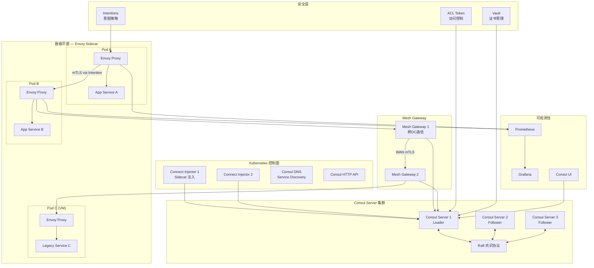

> **生产环境安全提示**
>
> 本文档包含可直接执行的运维命令。执行前请确认：当前目标集群与 Namespace 是否正确；是否具备足够的 RBAC 权限；是否已在非生产环境验证。命令风险等级标注：🔴 高风险（可能造成数据丢失或服务中断）、🟡 中风险（会修改集群状态，但通常可回滚）、🟢 低风险/只读（信息收集，无副作用）。


# Consul Connect 企业级服务网格管理

> **最后更新**: 2026-04-24 | **适用版本**: Consul v1.20+ / [[Helm|Helm]] Chart v1.6+ | **难度**: 高级

---

<!-- chunk: 概述 -->## 概述

Consul Connect 是 HashiCorp Consul 平台的服务网格扩展能力，将服务发现、健康检查、配置管理与服务网格功能统一在一个控制平面中。与 [[Istio|Istio]] 和 [[Linkerd|Linkerd]] 不同，Consul Connect 的核心差异化优势在于 HashiCorp 生态的深度集成——与 Terraform（基础设施即代码）、Vault（密钥管理）、Nomad（工作负载调度器）无缝协作，以及对 [[Kubernetes|Kubernetes]] 和虚拟机工作负载的统一管理能力。

Consul Connect 采用意图（Intentions）驱动的访问控制模型，通过声明式的白名单/黑名单策略管理服务间的通信权限，默认拒绝所有跨服务通信。数据平面基于 Envoy 代理，提供自动 mTLS 加密、L7 流量路由和分割能力。多数据中心（Multi-Datacenter）支持是 Consul 的传统强项，通过 Mesh Gateway 实现跨数据中心的加密通信。

本文档从企业级生产环境角度，全面覆盖 Consul Connect 的架构设计、Kubernetes 部署、意图配置、安全策略、可观测性集成和故障排查。

## Consul Connect 架构全景



---

<!-- chunk: 核心配置 — Helm 企业级部署 -->## 核心配置 — Helm 企业级部署

```yaml
apiVersion: v1
kind: Namespace
metadata:
  name: consul
  labels:
    name: consul
---
apiVersion: helm.cattle.io/v1
kind: HelmChart
metadata:
  name: consul
  namespace: consul
spec:
  repo: https://helm.releases.hashicorp.com
  chart: consul
  version: "1.6.0"
  targetNamespace: consul
  valuesContent: |
    global:
      name: consul
      datacenter: dc1
      image: hashicorp/consul:1.20.0
      tls:
        enabled: true
        enableAutoEncrypt: true
        serverAdditionalDNSSANs:
          - consul-server.consul.svc.cluster.local
        caCert:
          secretName: consul-ca-cert
          secretKey: tls.crt
        caKey:
          secretName: consul-ca-key
          secretKey: tls.key
      acls:
        manageSystemACLs: true
        createReplicationToken: true
      metrics:
        enabled: true
        enableAgentMetrics: true
        agentMetricsRetentionTime: "1m"
        prometheus:
          enabled: true

    server:
      replicas: 3
      bootstrapExpect: 3
      storage: 10Gi
      storageClass: gp3-enc
      resources:
        requests:
          memory: "256Mi"
          cpu: "250m"
        limits:
          memory: "1Gi"
          cpu: "1000m"
      disruptionBudget:
        enabled: true
        maxUnavailable: 1
      affinity:
        podAntiAffinity:
          requiredDuringSchedulingIgnoredDuringExecution:
            - labelSelector:
                matchLabels:
                  app: consul
                  component: server
              topologyKey: kubernetes.io/hostname

    client:
      enabled: true
      grpc: true
      resources:
        requests:
          memory: "100Mi"
          cpu: "100m"
        limits:
          memory: "512Mi"
          cpu: "500m"

    connectInject:
      enabled: true
      default: false
      replicas: 2
      resources:
        requests:
          memory: "100Mi"
          cpu: "100m"
        limits:
          memory: "256Mi"
          cpu: "500m"

    dns:
      enabled: true

    ui:
      enabled: true
      service:
        type: ClusterIP

    meshGateway:
      enabled: true
      replicas: 2
      service:
        type: LoadBalancer
      wanAddress:
        source: Service
      resources:
        requests:
          memory: "100Mi"
          cpu: "100m"
        limits:
          memory: "512Mi"
          cpu: "500m"

    ingressGateways:
      enabled: true
      gateways:
        - name: ingress-gateway
          replicas: 2
          service:
            type: LoadBalancer
          resources:
            requests:
              memory: "100Mi"
              cpu: "100m"
            limits:
              memory: "256Mi"
              cpu: "500m"

    terminatingGateways:
      enabled: true
      gateways:
        - name: terminating-gateway
          replicas: 2
```

## Consul Server 生产调优

```hcl
datacenter = "dc1"
data_dir = "/opt/consul/data"
log_level = "INFO"
server = true
bootstrap_expect = 3
ui = true

bind_addr = "0.0.0.0"
client_addr = "0.0.0.0"

ports:
  http = 8500
  https = 8501
  grpc = 8502
  dns = 8600
  serf_lan = 8301
  serf_wan = 8302
  server = 8300

performance:
  raft_multiplier = 1
  rpc_hold_timeout = "7s"

limits:
  http_max_conns_per_client = 500
  rpc_max_conns_per_client = 500

autopilot:
  cleanup_dead_servers = true
  last_contact_threshold = "200ms"
  max_trailing_logs = 250
  server_stabilization_time = "10s"
  redundancy_zone_tag = "zone"
  disable_upgrade_migration = false
  upgrade_version_tag = ""

encrypt = "consul-gossip-encryption-key"

retry_join = ["provider=aws tag_key=Consul tag_value=server"]

telemetry:
  prometheus_retention_time = "24h"
  disable_hostname = true
  enable_host_metrics = true
  statsd_address = "localhost:8125"

audit:
  enabled = true
  sink:
    type = "file"
    path = "/var/log/consul/audit.log"
    format = "json"
    rotate_duration = "24h"
    rotate_max_files = 30
    rotate_bytes = 1073741824
```

---

<!-- chunk: 流量管理实战 -->## 流量管理实战

## 服务注册与发现

```hcl
service {
  name = "web-service"
  id = "web-service-1"
  address = "10.0.1.10"
  port = 8080
  tags = ["primary", "v1.2.3", "production"]
  meta = {
    version = "1.2.3"
    environment = "production"
    team = "platform"
  }
  check {
    id = "web-service-health"
    name = "HTTP Health Check"
    http = "http://10.0.1.10:8080/health"
    interval = "10s"
    timeout = "3s"
    deregister_critical_service_after = "1m"
    tls_skip_verify = false
  }
  connect {
    sidecar_service {
      proxy {
        upstreams = [
          {
            destination_name = "database-service"
            local_bind_port = 9100
          },
          {
            destination_name = "cache-service"
            local_bind_port = 9200
          },
          {
            destination_name = "message-queue"
            local_bind_port = 9300
          }
        ]
        config {
          envoy_prometheus_bind_addr = "0.0.0.0:9102"
          envoy_tracing_json = jsonencode({
            tracing = {
              http = {
                name = "envoy.tracers.zipkin"
                config = {
                  collector_cluster = "jaeger_collector"
                  collector_endpoint = "/api/v2/spans"
                  trace_id_128bit = true
                  shared_span_context = false
                }
              }
            }
          })
        }
      }
    }
  }
}
```

## Kubernetes 服务注解

```yaml
apiVersion: v1
kind: Service
metadata:
  name: web-service
  namespace: production
  annotations:
    consul.hashicorp.com/connect-inject: "true"
    consul.hashicorp.com/connect-service-upstreams: "database-service:9100,cache-service:9200"
    consul.hashicorp.com/service-meta-version: "1.2.3"
    consul.hashicorp.com/service-tags: "primary,production"
spec:
  selector:
    app: web-service
  ports:
    - name: http
      port: 8080
      targetPort: 8080
---
apiVersion: apps/v1
kind: Deployment
metadata:
  name: web-service
  namespace: production
spec:
  replicas: 3
  selector:
    matchLabels:
      app: web-service
  template:
    metadata:
      labels:
        app: web-service
      annotations:
        consul.hashicorp.com/connect-inject: "true"
        consul.hashicorp.com/connect-service-upstreams: "database-service:9100"
        consul.hashicorp.com/sidecar-proxy-cpu-limit: "500m"
        consul.hashicorp.com/sidecar-proxy-memory-limit: "256Mi"
        consul.hashicorp.com/sidecar-proxy-cpu-request: "100m"
        consul.hashicorp.com/sidecar-proxy-memory-request: "64Mi"
    spec:
      serviceAccountName: web-service
      containers:
        - name: web-service
          image: company/web-service:1.2.3
          ports:
            - containerPort: 8080
          resources:
            requests:
              cpu: "200m"
              memory: "256Mi"
            limits:
              cpu: "1000m"
              memory: "1Gi"
```

## 意图配置 — 访问控制

```hcl
Kind = "service-intentions"
Name = "web-service"
Sources = [
  {
    Name = "api-gateway"
    Action = "allow"
    Type = "http"
    Description = "Allow API gateway full access"
  },
  {
    Name = "mobile-app"
    Action = "allow"
    Permissions = [
      {
        Action = "read"
        HTTP {
          PathExact = "/api/users"
          Methods = ["GET"]
        }
      },
      {
        Action = "write"
        HTTP {
          PathPrefix = "/api/users"
          Methods = ["POST", "PUT"]
        }
      }
    ]
    Description = "Mobile app: read user list, create/update users"
  },
  {
    Name = "admin-service"
    Action = "allow"
    Permissions = [
      {
        Action = "write"
        HTTP {
          PathPrefix = "/admin"
          Methods = ["GET", "POST", "PUT", "DELETE"]
        }
      }
    ]
    Description = "Admin service: full admin access"
  },
  {
    Name = "*"
    Action = "deny"
    Description = "Deny all other services by default"
  }
]
```

## 流量分割 — 金丝雀发布

```hcl
Kind = "service-splitter"
Name = "frontend-service"
Splits = [
  {
    Weight = 90
    Service = "frontend-v1"
    ServiceSubset = "stable"
  },
  {
    Weight = 10
    Service = "frontend-canary"
    ServiceSubset = "canary"
  }
]
---
Kind = "service-router"
Name = "api-service"
Routes = [
  {
    Match {
      HTTP {
        PathPrefix = "/v2/"
      }
    }
    Destination {
      Service = "api-v2"
      PrefixRewrite = "/"
    }
  },
  {
    Match {
      HTTP {
        Header = [
          {
            Name = "x-version"
            Exact = "beta"
          }
        ]
      }
    }
    Destination {
      Service = "api-beta"
    }
  }
]
---
Kind = "service-resolver"
Name = "backend-service"
DefaultSubset = "v1"
Subsets = {
  "v1" = {
    Filter = "Service.Meta.version == v1"
  }
  "v2" = {
    Filter = "Service.Meta.version == v2"
  }
  "canary" = {
    Filter = "Service.Meta.version == canary"
  }
}
```

## Ingress Gateway — 外部流量入口

```hcl
Kind = "ingress-gateway"
Name = "ingress-gateway"
TLS {
  TLSMinVersion = "TLSv1_2"
}
Listeners = [
  {
    Port = 8080
    Protocol = "http"
    Services = [
      {
        Name = "web-service"
        Hosts = ["web.example.com"]
      }
    ]
  },
  {
    Port = 8443
    Protocol = "https"
    TLS {
      Certificates = [
        {
          Kind = "secret"
          Name = "web-service-cert"
          Namespace = "default"
        }
      ]
    }
    Services = [
      {
        Name = "web-service"
        Hosts = ["web.example.com"]
      },
      {
        Name = "api-service"
        Hosts = ["api.example.com"]
      }
    ]
  }
]
```

---

<!-- chunk: 安全策略 -->## 安全策略

## mTLS 与证书管理

```hcl
Kind = "proxy-defaults"
Name = "global"
Config {
  protocol = "http"
  envoy_prometheus_bind_addr = "0.0.0.0:9102"
}
---
Kind = "mesh"
TransparentProxy {
  MeshDestinationsOnly = true
}
```

```yaml
apiVersion: v1
kind: Secret
metadata:
  name: consul-ca-cert
  namespace: consul
type: kubernetes.io/tls
data:
  tls.crt: BASE64_ENCODED_CA_CERT
  tls.key: BASE64_ENCODED_CA_KEY
```

## ACL 策略配置

```hcl
resource "consul_acl_policy" "service_mesh_policy" {
  name        = "service-mesh-policy"
  description = "Policy for service mesh operations"
  rules       = <<-RULE
    service_prefix "" {
      policy = "read"
    }
    service "consul" {
      policy = "write"
    }
    node_prefix "" {
      policy = "read"
    }
    agent_prefix "" {
      policy = "read"
    }
    session_prefix "" {
      policy = "read"
    }
    service_prefix "" {
      intentions = "read"
    }
    key_prefix "service-config/" {
      policy = "read"
    }
    key_prefix "service-health/" {
      policy = "write"
    }
  RULE
}

resource "consul_acl_token" "service_token" {
  description = "Token for service mesh applications"
  policies    = [consul_acl_policy.service_mesh_policy.name]
  local       = true
}
```

## Vault 集成 — 证书管理

```hcl
resource "vault_pki_secret_backend_role" "consul_intermediate" {
  backend          = vault_mount.pki_intermediate.path
  name             = "consul-intermediate"
  allowed_domains  = ["consul", "service.consul"]
  allow_subdomains = true
  max_ttl          = "720h"
  key_type         = "ec"
  key_bits         = 256
  server_flag      = true
  client_flag      = true
}

resource "consul_config_entry" "vault_ca" {
  kind = "ca-root"
  name = "vault-root-ca"
  config_json = jsonencode({
    Provider = "vault"
    Config = {
      address       = "https://vault.vault.svc.cluster.local:8200"
      token         = vault_token.consul_token.client_token
      root_cert_path = "pki-root/cert/ca"
      intermediate_cert_path = "pki-intermediate/cert/ca"
      private_key_path = "pki-intermediate/key/ca"
    }
  })
}
```

## 审计日志

```hcl
audit {
  enabled = true
  sink {
    type = "file"
    path = "/var/log/consul/audit.log"
    format = "json"
    rotate_duration = "24h"
    rotate_max_files = 30
    rotate_bytes = 1073741824
  }
}
```

---

<!-- chunk: 可观测性 — Prometheus, Grafana, Jaeger 集成 -->## 可观测性 — Prometheus, Grafana, Jaeger 集成

## Prometheus 配置

```yaml
scrape_configs:
  - job_name: "consul-connect"
    consul_sd_configs:
      - server: "consul-server.consul:8500"
        services: ["connect-proxy"]
        token: "{{ .Values.consulACLToken }}"
    relabel_configs:
      - source_labels: [__meta_consul_service]
        target_label: job
      - source_labels: [__meta_consul_service_metadata_connect_service]
        target_label: service
      - source_labels: [__meta_consul_service_metadata_connect_instance]
        target_label: instance
    metric_relabel_configs:
      - source_labels: [__name__]
        regex: "envoy_.*"
        action: keep

  - job_name: "consul-server"
    static_configs:
      - targets: ["consul-server.consul:8500"]
    metrics_path: "/v1/agent/metrics"
    params:
      format: ["prometheus"]
```

## 告警规则

```yaml
apiVersion: monitoring.coreos.com/v1
kind: PrometheusRule
metadata:
  name: consul-connect-alerts
  namespace: consul
spec:
  groups:
    - name: consul-connect.rules
      rules:
        - alert: ConsulConnectHighErrorRate
          expr: |
            rate(envoy_cluster_upstream_rq_5xx[5m]) /
            rate(envoy_cluster_upstream_rq_total[5m]) > 0.05
          for: 2m
          labels:
            severity: warning
          annotations:
            summary: "High error rate for {{ $labels.service }}"
            description: "The Consul Connect proxy for service {{ $labels.service }} is experiencing an error rate above 5%."

        - alert: ConsulConnectHighLatency
          expr: |
            histogram_quantile(0.99, rate(envoy_cluster_upstream_rq_time_bucket[5m])) > 1000
          for: 5m
          labels:
            severity: warning
          annotations:
            summary: "P99 latency above 1s for {{ $labels.service }}"
            description: "The 99th percentile latency for Consul Connect service {{ $labels.service }} has exceeded 1 second."

        - alert: ConsulClusterDegraded
          expr: consul_serf_lan_members != consul_autopilot_healthy_nodes
          for: 5m
          labels:
            severity: critical
          annotations:
            summary: "Consul cluster degraded"
            description: "The Consul cluster has unhealthy nodes. Check Raft leader election and server health."

        - alert: ConsulConnectProxyDown
          expr: up{job="consul-connect"} == 0
          for: 1m
          labels:
            severity: critical
          annotations:
            summary: "Consul Connect proxy {{ $labels.instance }} is down"
            description: "A Consul Connect Envoy proxy is unreachable. Check the pod status and sidecar injection."

        - alert: ConsulLeaderElection
          expr: consul_raft_leader_elections > 5
          for: 10m
          labels:
            severity: warning
          annotations:
            summary: "Frequent Raft leader elections detected"
            description: "The Consul cluster has had more than 5 leader elections. This may indicate network instability."
```

---

<!-- chunk: Consul 集群状态验证 -->## Consul 集群状态验证

## 集群状态命令输出示例

```bash
$ consul members
Node           Address            Status  Type    Build   Protocol  DC   Partition  Segment
consul-server-1  10.0.1.10:8301  alive   server  1.20.0  2         dc1  default    <all>
consul-server-2  10.0.1.11:8301  alive   server  1.20.0  2         dc1  default    <all>
consul-server-3  10.0.1.12:8301  alive   server  1.20.0  2         dc1  default    <all>
worker-node-1    10.0.2.10:8301  alive   client  1.20.0  2         dc1  default    <default>
worker-node-2    10.0.2.11:8301  alive   client  1.20.0  2         dc1  default    <default>
worker-node-3    10.0.2.12:8301  alive   client  1.20.0  2         dc1  default    <default>

$ consul operator raft list-peers
Node           ID                                    Address            State     Voter  RaftProtocol
consul-server-1  c3b3c3e1-5f3b-4e1b-b3c3-e1c3b3e1c3b3  10.0.1.10:8300  leader    true   3
consul-server-2  a1d2e3f4-5a6b-7c8d-9e0f-1a2b3c4d5e6f  10.0.1.11:8300  follower  true   3
consul-server-3  b2c3d4e5-6f7a-8b9c-0d1e-2f3a4b5c6d7e  10.0.1.12:8300  follower  true   3

$ consul intention list
Source         Destination   Action  Description
api-gateway    web-service   allow   Allow API gateway full access
mobile-app     web-service   allow   Mobile app: read user list, create/update users
admin-service  web-service   allow   Admin service: full admin access
*              web-service   deny    Deny all other services by default

$ consul catalog services -tags
consul
api-gateway [v1.0.0,production]
web-service [primary,v1.2.3,production]
database-service [primary,v5.7,production]
cache-service [primary,v7.2,production]
```

---

<!-- chunk: 性能调优 -->## 性能调优

## Envoy Sidecar 资源优化

```yaml
apiVersion: apps/v1
kind: Deployment
metadata:
  name: web-service
  namespace: production
spec:
  template:
    metadata:
      annotations:
        consul.hashicorp.com/sidecar-proxy-cpu-request: "100m"
        consul.hashicorp.com/sidecar-proxy-memory-request: "64Mi"
        consul.hashicorp.com/sidecar-proxy-cpu-limit: "500m"
        consul.hashicorp.com/sidecar-proxy-memory-limit: "256Mi"
```

## Consul Server 调优参数

| 参数 | 默认值 | 说明 | 推荐值 (生产) |
|:---|:---|:---|:---|
| performance.raft_multiplier | 1 | Raft 超时倍数 (0=最快) | 1 |
| performance.rpc_hold_timeout | 7s | RPC 保持超时 | 7s |
| limits.http_max_conns_per_client | 500 | HTTP 最大连接/客户端 | 500 |
| limits.rpc_max_conns_per_client | 500 | RPC 最大连接/客户端 | 500 |
| autopilot.cleanup_dead_servers | true | 自动清理死亡 Server | true |
| autopilot.last_contact_threshold | 200ms | 最后联系阈值 | 200ms |
| autopilot.max_trailing_logs | 250 | 最大拖尾日志 | 250 |
| autopilot.server_stabilization_time | 10s | Server 稳定时间 | 10s |
| telemetry.prometheus_retention_time | 0s | Prometheus 指标保留时间 | 24h |

---

<!-- chunk: 故障排查 -->## 故障排查

## 诊断脚本

> ⚠️ **🟡 中危变更** — 变更集群资源状态，建议先 --dry-run 或 diff 确认
> - `kubectl exec`：进入容器执行命令，可能改变容器状态

``` bash
# 🟡 中风险：会修改集群/资源状态，执行前请确认目标、影响范围与授权
#!/bin/bash

echo "=== 1. Consul 集群状态 ==="
consul members
consul operator raft list-peers
echo ""

echo "=== 2. Connect Injector 状态 ==="
kubectl get pods -n consul -l component=connect-injector
echo ""

echo "=== 3. 服务意图 ==="
consul intention list
consul intention check web-service database-service
echo ""

echo "=== 4. 证书状态 ==="
consul connect ca get-config
consul connect ca list -detailed
echo ""

echo "=== 5. 服务目录 ==="
consul catalog services -tags
consul catalog nodes -service web-service
echo ""

echo "=== 6. 健康检查 ==="
consul health checks web-service
echo ""

echo "=== 7. 代理配置 ==="
kubectl exec -n production deploy/web-service -c consul-connect-envoy-sidecar -- \
  curl -s http://localhost:19000/config_dump | jq '.configs[0].dynamic_active_configs'
echo ""

echo "=== 8. ACL 状态 ==="
consul acl token list
consul acl policy list
echo ""

echo "=== 9. 连通性测试 ==="
kubectl exec -n production deploy/web-service -- \
  curl -s http://localhost:9100/health
echo ""

echo "=== 10. 日志分析 ==="
kubectl logs -n consul -l component=connect-injector --tail=50 | grep -iE "error|warn"
```
## 常见问题速查

| 症状 | 可能原因 | 诊断命令 | 解决方案 |
|:---|:---|:---|:---|
| 服务无法通信 | 意图未配置 | `consul intention list` | 创建 allow intention |
| mTLS 失败 | CA 证书不匹配 | `consul connect ca get-config` | 检查 ca-cert secret，重新签发 |
| Sidecar 未注入 | 注解缺失或 injector 异常 | `kubectl get pod -o yaml` | 检查 annotation 和 injector Pod |
| 服务发现失败 | Consul DNS 异常 | `nslookup web-service.service.consul` | 检查 Consul DNS 服务和 CoreDNS 配置 |
| ACL 权限拒绝 | Token 权限不足 | `consul acl token read -id <token>` | 检查 ACL policy 绑定 |
| 证书过期 | CA 轮换异常 | `consul connect ca list -detailed` | `consul connect ca rotate` |
| 多DC 通信失败 | Mesh Gateway 异常 | `consul catalog services -wan` | 检查网关状态和 WAN 地址 |
| Envoy 配置不生效 | Config Entry 未注册 | `consul config list` | `consul config write` 重新写入 |
| Raft 选举频繁 | 网络延迟或资源不足 | `consul operator raft list-peers` | 检查节点网络和 CPU/内存 |
| 代理内存泄漏 | Envoy 连接泄漏 | `kubectl top pods -c consul-connect-envoy-sidecar` | 检查 idle_timeout 和连接池 |

---

<!-- chunk: 最佳实践 -->## 最佳实践

```yaml
部署最佳实践:
  1. Server 3-5 副本, 启用 PDB
  2. 启用 TLS + ACL (生产环境必须)
  3. Vault 集成证书管理
  4. Mesh Gateway 多副本

安全最佳实践:
  1. 默认 deny 所有意图
  2. 最小权限 ACL 策略
  3. 审计日志启用
  4. 证书自动轮换 (72h TTL)

可观测性最佳实践:
  1. Prometheus + Grafana 监控
  2. 关键告警配置
  3. Envoy 访问日志
  4. 分布式追踪集成

运维最佳实践:
  1. 定期证书轮换测试
  2. 多DC 同步检查
  3. 备份策略: consul snapshot save
  4. 滚动升级: 先升级 Client, 再升级 Server
```

---

<!-- chunk: Consul Connect 多数据中心配置 -->## Consul Connect 多数据中心配置

## 多数据中心架构概述

Consul Connect 的多数据中心能力是其核心差异化优势之一。与 Istio 的多集群方案不同，Consul 的多数据中心架构天然支持 WAN 级别互联，通过 Mesh Gateway 实现跨数据中心的加密通信。多数据中心部署需要两个关键前提：第一，每个数据中心必须有独立的 Consul Server 集群（3-5 节点），且通过 WAN gossip 协议互联；第二，Mesh Gateway 必须部署在每个数据中心，并配置正确的 WAN 地址，使跨数据中心流量能够穿越网络边界。以下是完整的多数据中心配置示例：

## 主数据中心配置

```hcl
datacenter = "dc1"
primary_datacenter = "dc1"
domain = "consul"
data_dir = "/opt/consul/data"

connect:
  enabled: true

mesh_gateway:
  mode: "local"

config_entries:
  bootstrap:
    - kind: "mesh"
      name: "mesh"
      config:
        transparent_proxy:
          mesh_destinations_only: true

acl:
  enabled: true
  default_policy: "deny"
  enable_token_persistence: true
  tokens:
    master: "master-token-for-dc1"

encrypt: "gossip-encryption-key-dc1"

retry_join_wan:
  - "provider=aws tag_key=ConsulWAN tag_value=dc2"

telemetry:
  prometheus_retention_time: "24h"
  disable_hostname: true
```

## 从数据中心配置

```hcl
datacenter = "dc2"
primary_datacenter = "dc1"
domain = "consul"
data_dir = "/opt/consul/data"

connect:
  enabled: true

mesh_gateway:
  mode: "local"

acl:
  enabled: true
  default_policy: "deny"
  enable_token_persistence: true

encrypt: "gossip-encryption-key-dc2"

retry_join_wan:
  - "provider=aws tag_key=ConsulWAN tag_value=dc1"
```

## 跨数据中心服务发现验证

```bash
$ consul members -wan
Node           Address            Status  Type    Build   DC
consul-dc1-1   10.0.1.10:8302    alive   server  1.20.0  dc1
consul-dc1-2   10.0.1.11:8302    alive   server  1.20.0  dc1
consul-dc1-3   10.0.1.12:8302    alive   server  1.20.0  dc1
consul-dc2-1   10.1.1.10:8302    alive   server  1.20.0  dc2
consul-dc2-2   10.1.1.11:8302    alive   server  1.20.0  dc2
consul-dc2-3   10.1.1.12:8302    alive   server  1.20.0  dc2

$ consul catalog services -datacenter dc2
consul
database-service
web-service
cache-service
payment-service

$ consul intention check -source web-service.dc1 -destination database-service.dc2
allowed
```

---

<!-- chunk: Consul Connect 故障注入测试 -->## Consul Connect 故障注入测试

## 故障注入配置

Consul Connect 支持通过 Envoy 过滤器实现服务故障注入，用于测试服务的弹性能力。以下配置展示了如何对一个目标服务注入延迟和中断问题，模拟网络抖动和上游服务不可用场景。在生产环境中进行故障注入测试时，建议从极小的问题比例（0.1%）开始，逐步增加，同时密切监控黄金指标（成功率、延迟、吞吐量），确保问题不会超出预期范围。

```hcl
Kind = "service-defaults"
Name = "web-service"
Protocol = "http"

EnvoyExtension:
  Name: "envoy.filters.http.fault"
  Required: true
  Type: "http-filter"
  Config: |
    {
      "delay": {
        "percentage": 1.0,
        "fixed_delay": "5s"
      },
      "abort": {
        "percentage": 0.5,
        "http_status": 503
      }
    }
```

---

<!-- chunk: Consul Connect 与 Kubernetes 原生服务发现集成 -->## Consul Connect 与 Kubernetes 原生服务发现集成

## Consul DNS 与 CoreDNS 集成

Consul Connect 在 Kubernetes 环境中通过 Consul DNS 服务提供服务发现能力。为了让集群内的应用能够同时解析 Kubernetes Service DNS（如 `user-service.production.svc.cluster.local`）和 Consul Service DNS（如 `user-service.service.consul`），需要配置 CoreDNS 的 stubDomains 将 `.consul` 域名请求转发到 Consul DNS 服务。此外，对于跨数据中心的服务发现场景，Consul DNS 支持 `service.service.consul` 和 `service.query.consul` 两种查询格式，后者支持 Prepared Query 功能，可以实现基于位置的就近路由和故障转移。

```yaml
apiVersion: v1
kind: ConfigMap
metadata:
  name: coredns-custom
  namespace: kube-system
data:
  consul.override: |
    . {
      errors
      health
      rewrite name regex (.*)\\.service\\.consul\\.$ ${1}.service.consul
      forward .consul 10.0.0.10:8600 10.0.0.11:8600 10.0.0.12:8600 {
        policy sequential
        health_check 10s
        max_concurrent 100
      }
      cache 30
      loop
      reload
      loadbalance
    }
```

## Consul Service Mesh 与 Kubernetes Service 的共存策略

在企业迁移过程中，Kubernetes 原生 Service 和 Consul Service Mesh 经常需要共存。推荐采用渐进式迁移策略：第一阶段，应用通过 Kubernetes Service DNS 通信，逐步为关键服务启用 Consul Connect 注入；第二阶段，将上游服务切换到 Consul DNS 解析，获得 Consul 的健康检查和流量路由能力；第三阶段，全面启用 Intentions 和 L7 路由策略。在共存期间，需要注意避免 DNS 解析冲突——同一个服务名称不能同时存在于 Kubernetes CoreDNS 和 Consul DNS 中，建议使用不同的域名后缀进行区分。

---

---

<!-- chunk: 十、Consul Connect 性能基准测试 -->## 十、Consul Connect 性能基准测试

## Sidecar 代理性能开销

在生产环境中部署 Consul Connect 时，了解 Sidecar 代理的性能开销至关重要。以下基准测试数据基于 Envoy 代理（Consul Connect 默认数据平面），测试环境为 AWS c5.xlarge 实例（4 vCPU / 8GB RAM），使用 fortio 和 wrk 进行压力测试。延迟数据为 P99 分位数，单位为毫秒。这些数据可以帮助团队制定容量规划和资源配额策略。

| 场景 | 无代理延迟 (ms) | Connect 代理延迟 (ms) | 开销百分比 | 吞吐量下降 | 内存增加 |
|:---|:---|:---|:---|:---|:---|
| HTTP/1.1 短连接 | 1.2 | 2.8 | +133% | ~25% | +80MB |
| HTTP/1.1 长连接 | 0.8 | 1.4 | +75% | ~15% | +80MB |
| HTTP/2 多路复用 | 0.6 | 1.1 | +83% | ~10% | +80MB |
| gRPC 流式 | 0.5 | 0.9 | +80% | ~8% | +80MB |
| TCP 直通 | 0.3 | 0.6 | +100% | ~5% | +60MB |

## 大规模部署性能建议

当 Consul Connect 部署规模超过 1000 个服务实例时，需要关注以下性能瓶颈和优化建议。第一，Consul Server 集群的 CPU 使用率会随着服务注册数量和健康检查频率线性增长，建议每个数据中心至少部署 5 个 Server 节点，并使用 Dedicated Consul Server 实例（不运行业务工作负载）。第二，Envoy 代理的内存使用量与配置的 Cluster 和 Listener 数量正相关，对于连接大量上游服务的"中心"服务（如 API 网关），建议将代理内存限制设置为 512MB 以上。第三，使用 Consul 的 Partition 功能将大型部署划分为多个逻辑分区，减少跨分区的状态同步开销。第四，对于超大规模部署（5000+ 实例），建议评估 Consul Enterprise 的性能优化特性，包括增强的 Raft 存储引擎和优化的 xDS 增量推送。

---

**文档版本**: v2.0
**最后更新**: 2026-04-24
**适用版本**: Consul v1.20+

---

<!-- chunk: Obsidian 相关文档 -->## Obsidian 相关文档

- domain-03-networking-traffic MOC
- [[domain-03-networking-traffic/README.md|Domain 03: 企业级服务网格与微服务治理 (Enterprise Service Mesh & Microser...]]
- Domain-26 服务网格与微服务 — 开源项目索引
- Istio 企业级服务网格架构与实践
- Linkerd 企业级服务网格深度实践
- Envoy Proxy 企业级服务网格数据平面深度实践
- Dapr (Distributed Application Runtime) Enterprise 深度实践
- Traefik Mesh Enterprise Service Mesh 深度实践
- 服务网格对比与选型决策指南
- Istio Ambient Mesh 与 L7 策略深度实践
- 微服务弹性模式深度实践 — Circuit Breaker, Retry, Timeout, Bulkhead, Rat...
- API 网关与服务网格集成深度实践

## See Also

- 01-istio-enterprise-service-mesh
- 02-linkerd-enterprise-service-mesh
- 04-envoy-proxy-enterprise
- 05-dapr-enterprise-distributed-runtime

## Related

- [[domain-19-landscape-references/topic-index/service-mesh-index.md|Service Mesh 服务网格知识图谱索引]]


<!-- risk-assessed -->
