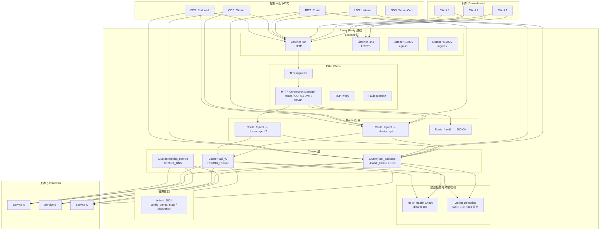

# [[Envoy|Envoy]] Proxy 企业级服务网格数据平面深度实践

> **最后更新**: 2026-04-24 | **适用版本**: Envoy v1.33+ | **难度**: 高级

---

<!-- chunk: 概述 -->## 概述

Envoy Proxy 是由 Lyft 开发的高性能 L3/L4/L7 网络代理，2017年成为 CNCF 项目，现已发展为云原生服务代理的事实标准。几乎所有主流服务网格（[[Istio|Istio]]、Consul Connect、[[Kuma|Kuma]]）和 API 网关（Emissary、[[Contour|Contour]]、Envoy Gateway）都以 Envoy 作为数据平面。Envoy 的核心优势在于其优秀的 xDS 动态配置 API、丰富的 L7 协议支持、高性能的 C++ 实现，以及可扩展的 WASM 过滤器机制。

本文档从企业级运维专家角度，深入探讨 Envoy 的核心架构、xDS 配置管理、HTTP 连接管理器、高级负载均衡、安全配置（mTLS/RBAC）、性能调优、监控告警和故障排查。所有配置均可直接应用于生产环境，既适用于独立 Envoy 部署，也为理解服务网格底层数据平面提供参考。

## Envoy 核心架构



---

<!-- chunk: 核心配置 — 生产级 Envoy 部署 -->## 核心配置 — 生产级 Envoy 部署

## 完整静态配置

```yaml
static_resources:
  listeners:
    - name: http_listener
      address:
        socket_address:
          address: 0.0.0.0
          port_value: 80
      filter_chains:
        - filters:
            - name: envoy.filters.network.http_connection_manager
              typed_config:
                "@type": type.googleapis.com/envoy.extensions.filters.network.http_connection_manager.v3.HttpConnectionManager
                stat_prefix: ingress_http
                route_config:
                  name: local_route
                  virtual_hosts:
                    - name: backend
                      domains: ["*"]
                      routes:
                        - matchers:
                          - prefix="/api/v1/"
                          - route=""
                          - cluster="api_backend"
                          - timeout="30s"
                          - retry_policy=""
                          - retry_on="5xx,gateway-error,connect-failure,refused-stream"
                          - num_retries="3"
                          - per_try_timeout="10s"
                          - retry_back_off=""
                          - base_interval="0.5s"
                          - max_interval="10s"
                        - matchers:
                          - prefix="/health"
                          - direct_response=""
                          - status="200"
                          - body=""
                          - inline_string="OK"
                http_filters:
                  - name: envoy.filters.http.fault
                    typed_config:
                      "@type": type.googleapis.com/envoy.extensions.filters.http.fault.v3.HTTPFault
                  - name: envoy.filters.http.cors
                    typed_config:
                      "@type": type.googleapis.com/envoy.extensions.filters.http.cors.v3.Cors
                  - name: envoy.filters.http.jwt_authn
                    typed_config:
                      "@type": type.googleapis.com/envoy.extensions.filters.http.jwt_authn.v3.JwtAuthentication
                      providers:
                        jwt_provider:
                          issuer: "https://auth.company.com"
                          audiences: ["api.company.com"]
                          remote_jwks:
                            http_uri:
                              uri: "https://auth.company.com/.well-known/jwks.json"
                              cluster: auth_service
                              timeout: 5s
                            cache_duration: 300s
                  - name: envoy.filters.http.rbac
                    typed_config:
                      "@type": type.googleapis.com/envoy.extensions.filters.http.rbac.v3.RBAC
                  - name: envoy.filters.http.router
                    typed_config:
                      "@type": type.googleapis.com/envoy.extensions.filters.http.router.v3.Router
                access_log:
                  - name: envoy.access_loggers.file
                    typed_config:
                      "@type": type.googleapis.com/envoy.extensions.access_loggers.file.v3.FileAccessLog
                      path: "/dev/stdout"
                      json_format:
                        timestamp: "%START_TIME%"
                        method: "%REQ(:METHOD)%"
                        path: "%REQ(X-ENVOY-ORIGINAL-PATH?:PATH)%"
                        protocol: "%PROTOCOL%"
                        response_code: "%RESPONSE_CODE%"
                        response_flags: "%RESPONSE_FLAGS%"
                        bytes_received: "%BYTES_RECEIVED%"
                        bytes_sent: "%BYTES_SENT%"
                        duration: "%DURATION%"
                        upstream_cluster: "%UPSTREAM_CLUSTER%"
                        upstream_host: "%UPSTREAM_HOST%"
                        user_agent: "%REQ(USER-AGENT)%"
                        request_id: "%REQ(X-REQUEST-ID)%"
                http_protocol_options:
                  header_key_format:
                    stateful_formatter:
                      name: case_sensitive
                stream_idle_timeout: 300s
                request_timeout: 60s
                drain_timeout: 45s

    - name: https_listener
      address:
        socket_address:
          address: 0.0.0.0
          port_value: 443
      filter_chains:
        - filter_chain_match:
            server_names: ["api.company.com"]
          transport_socket:
            name: envoy.transport_sockets.tls
            typed_config:
              "@type": type.googleapis.com/envoy.extensions.transport_sockets.tls.v3.DownstreamTlsContext
              common_tls_context:
                tls_certificates:
                  - certificate_chain:
                      filename: "/etc/envoy/certs/server.crt"
                    private_key:
                      filename: "/etc/envoy/certs/server.key"
                alpn_protocols: ["h2", "http/1.1"]
              require_client_certificate: false
          filters:
            - name: envoy.filters.network.http_connection_manager
              typed_config:
                "@type": type.googleapis.com/envoy.extensions.filters.network.http_connection_manager.v3.HttpConnectionManager
                stat_prefix: https_ingress
                route_config:
                  name: https_route
                  virtual_hosts:
                    - name: secure_backend
                      domains: ["api.company.com"]
                      routes:
                        - matchers:
                          - prefix="/"
                          - route=""
                          - cluster="api_backend"
                          - timeout="30s"
                http_filters:
                  - name: envoy.filters.http.router
                    typed_config:
                      "@type": type.googleapis.com/envoy.extensions.filters.http.router.v3.Router

  clusters:
    - name: api_backend
      connect_timeout: 5s
      type: EDS
      lb_policy: LEAST_REQUEST
      eds_cluster_config:
        eds_config:
          api_config_source:
            api_type: GRPC
            transport_api_version: V3
            grpc_services:
              - envoy_grpc:
                  cluster_name: xds_cluster
      health_checks:
        - timeout: 5s
          interval: 10s
          unhealthy_threshold: 3
          healthy_threshold: 2
          http_health_check:
            path: "/health"
            expected_statuses:
              - start: 200
                end: 299
      circuit_breakers:
        thresholds:
          - priority: DEFAULT
            max_connections: 2048
            max_pending_requests: 2048
            max_requests: 2048
            max_retries: 5
            retry_budget:
              budget_percent: 20
              min_retry_concurrency: 5
      outlier_detection:
        split_external_local_origin_errors: true
        consecutive_5xx: 5
        consecutive_gateway_failure: 3
        consecutive_local_origin_failure: 5
        base_ejection_time: 30s
        max_ejection_percent: 50
        enforcing_consecutive_5xx: 100
        enforcing_consecutive_gateway_failure: 100
        enforcing_consecutive_local_origin_failure: 100
      track_cluster_stats:
        request_response_sizes: true
        per_endpoint_stats: true

    - name: xds_cluster
      connect_timeout: 1s
      type: STATIC
      lb_policy: ROUND_ROBIN
      load_assignment:
        cluster_name: xds_cluster
        endpoints:
          - lb_endpoints:
              - endpoint:
                  address:
                    socket_address:
                      address: istiod.istio-system
                      port_value: 15012

    - name: auth_service
      connect_timeout: 5s
      type: STRICT_DNS
      lb_policy: ROUND_ROBIN
      load_assignment:
        cluster_name: auth_service
        endpoints:
          - lb_endpoints:
              - endpoint:
                  address:
                    socket_address:
                      address: auth.company.com
                      port_value: 443
      transport_socket:
        name: envoy.transport_sockets.tls
        typed_config:
          "@type": type.googleapis.com/envoy.extensions.transport_sockets.tls.v3.UpstreamTlsContext
          sni: auth.company.com

overload_manager:
  refresh_interval: 0.25s
  resource_monitors:
    - name: "envoy.resource_monitors.fixed_heap"
      typed_config:
        "@type": type.googleapis.com/envoy.extensions.resource_monitors.fixed_heap.v3.FixedHeapConfig
        max_heap_size_bytes: 2147483648
  actions:
    - name: "envoy.overload_actions.shrink_heap"
      triggers:
        - name: "envoy.resource_monitors.fixed_heap"
          threshold:
            value: 0.90
    - name: "envoy.overload_actions.stop_accepting_requests"
      triggers:
        - name: "envoy.resource_monitors.fixed_heap"
          threshold:
            value: 0.95

stats_config:
  use_all_default_tags: true
  stats_tags:
    - tag_name: "cluster_name"
      regex: "^cluster\\.((.+?)\\.)"
    - tag_name: "response_code"
      regex: "\\.response_code:(\\d{3})"
  histogram_bucket_settings:
    - matchers:
      - prefix="http."
      - buckets="[0.5, 1.0, 5.0, 10.0, 25.0, 50.0, 100.0, 250.0, 500.0, 1000.0]"
admin:
  access_log_path: /dev/null
  address:
    socket_address:
      address: 127.0.0.1
      port_value: 9901
```

---

<!-- chunk: 流量管理实战 -->## 流量管理实战

## 高级负载均衡

```yaml
clusters:
  - name: intelligent_lb_cluster
    connect_timeout: 1s
    type: EDS
    lb_policy: LEAST_REQUEST
    lb_subset_config:
      fallback_policy: ANY_ENDPOINT
      subset_selectors:
        - keys: ["version"]
        - keys: ["zone", "hardware"]
    ring_hash_lb_config:
      minimum_ring_size: 1024
      maximum_ring_size: 8192
    common_lb_config:
      locality_weighted_lb_config:
        locality_weight:
          - locality:
              region: us-west-2
              zone: us-west-2a
            weight: 50
          - locality:
              region: us-west-2
              zone: us-west-2b
            weight: 30
          - locality:
              region: us-east-1
              zone: us-east-1a
            weight: 20
    health_checks:
      - timeout: 5s
        interval: 10s
        unhealthy_threshold: 3
        healthy_threshold: 2
        http_health_check:
          path: "/health"
          expected_statuses:
            - start: 200
              end: 299
```

## mTLS 安全配置

```yaml
clusters:
  - name: secure_backend
    connect_timeout: 1s
    type: STRICT_DNS
    transport_socket:
      name: envoy.transport_sockets.tls
      typed_config:
        "@type": type.googleapis.com/envoy.extensions.transport_sockets.tls.v3.UpstreamTlsContext
        common_tls_context:
          tls_certificates:
            - certificate_chain:
                filename: "/etc/envoy/certs/client.crt"
              private_key:
                filename: "/etc/envoy/certs/client.key"
          validation_context:
            trusted_ca:
              filename: "/etc/envoy/certs/ca.crt"
            verify_subject_alt_name:
              - "backend.service.consul"
              - "backend.production.svc.cluster.local"
          alpn_protocols: ["h2", "http/1.1"]
        sni: "backend.service.consul"
```

## RBAC 访问控制

```yaml
http_filters:
  - name: envoy.filters.http.rbac
    typed_config:
      "@type": type.googleapis.com/envoy.extensions.filters.http.rbac.v3.RBAC
      rules:
        action: ALLOW
        policies:
          "admin-access":
            permissions:
              - header:
                  name: ":path"
                  prefix_match: "/admin"
            principals:
              - source_ip:
                  address_prefix: "10.0.0.0"
                  prefix_len: 8
          "api-access":
            permissions:
              - and_rules:
                  rules:
                    - header:
                        name: ":method"
                        exact_match: "POST"
                    - header:
                        name: ":path"
                        prefix_match: "/api/"
            principals:
              - authenticated:
                  principal_name:
                    exact: "api-client"
```

---

<!-- chunk: Envoy 关键配置参数参考 -->## Envoy 关键配置参数参考

## Listener 参数

| 参数 | 默认值 | 说明 | 推荐值 (生产) |
|:---|:---|:---|:---|
| per_connection_buffer_limit_bytes | 1MB | 每个连接的读/写缓冲区大小 | 1MB-16MB |
| connection_balance_config | - | 连接平衡策略 | exact_balance |
| tcp_fast_open_queue_length | 0 | TCP Fast Open 队列长度 | 256 (Linux) |
| socket_options.tcp_keepalive_time | - | TCP Keepalive 时间 | 60s |
| socket_options.tcp_keepalive_intvl | - | TCP Keepalive 间隔 | 15s |
| socket_options.tcp_keepalive_probes | - | TCP Keepalive 探测数 | 3 |

## HTTP Connection Manager 参数

| 参数 | 默认值 | 说明 | 推荐值 (生产) |
|:---|:---|:---|:---|
| request_timeout | 0 (无限制) | 请求总超时 | 60s |
| stream_idle_timeout | 5m | 流空闲超时 | 300s |
| drain_timeout | 5s | 排水超时 | 45s |
| max_request_headers_kb | 60 | 最大请求头大小 (KB) | 60-96 |
| max_requests_per_connection | 0 (无限制) | 每连接最大请求数 | 100-1000 |
| common_http_protocol_options.idle_timeout | 1h | 连接空闲超时 | 300s |
| common_http_protocol_options.max_connection_duration | 0 (无限制) | 连接最大持续时间 | 按需 |
| common_http_protocol_options.max_requests_per_connection | 0 (无限制) | 每连接最大请求数 | 1000 |

## Cluster 参数

| 参数 | 默认值 | 说明 | 推荐值 (生产) |
|:---|:---|:---|:---|
| connect_timeout | 5s | 连接超时 | 1s-5s |
| per_connection_buffer_limit_bytes | 1MB | 每个连接的缓冲区大小 | 1MB-16MB |
| max_requests_per_connection | 0 (无限制) | 每连接最大请求数 | 100-1000 |
| circuit_breakers.max_connections | 1024 | 熔断器最大连接数 | 1024-4096 |
| circuit_breakers.max_pending_requests | 1024 | 最大待处理请求数 | 1024-4096 |
| circuit_breakers.max_requests | 1024 | 最大并发请求数 | 1024-4096 |
| circuit_breakers.max_retries | 3 | 最大并发重试数 | 3-5 |
| outlier_detection.consecutive_5xx | 5 | 连续 5xx 触发异常检测 | 5 |
| outlier_detection.interval | 10s | 异常检测扫描间隔 | 10s-30s |
| outlier_detection.base_ejection_time | 30s | 基础驱逐时间 | 30s-60s |
| outlier_detection.max_ejection_percent | 10 | 最大驱逐百分比 | 50 |

---

<!-- chunk: 可观测性 — Prometheus, Jaeger, StatsD 集成 -->## 可观测性 — Prometheus, Jaeger, StatsD 集成

## Prometheus 指标导出

```yaml
stats_sinks:
  - name: envoy.stat_sinks.metrics_service
    typed_config:
      "@type": type.googleapis.com/envoy.config.metrics.v3.MetricsServiceConfig
      transport_api_version: V3
      grpc_service:
        envoy_grpc:
          cluster_name: metrics_service
```

## 分布式追踪配置

```yaml
tracing:
  provider:
    name: envoy.tracers.opentelemetry
    typed_config:
      "@type": type.googleapis.com/envoy.config.trace.v3.OpenTelemetryConfig
      grpc_service:
        envoy_grpc:
          cluster_name: otel_collector
      service_name: "envoy-proxy"
```

## 关键监控指标

```promql
envoy_cluster_upstream_rq_2xx_total / envoy_cluster_upstream_rq_total
histogram_quantile(0.99, rate(envoy_cluster_upstream_rq_time_bucket[5m]))
envoy_cluster_upstream_cx_active
rate(envoy_cluster_upstream_rq_pending_overflow[5m])
envoy_server_memory_allocated / envoy_server_memory_heap_size
rate(envoy_cluster_health_check_failure[5m]) / rate(envoy_cluster_health_check_attempt[5m])
```

## Prometheus 告警规则

```yaml
apiVersion: monitoring.coreos.com/v1
kind: PrometheusRule
metadata:
  name: envoy-alerts
  namespace: monitoring
spec:
  groups:
    - name: envoy.rules
      rules:
        - alert: EnvoyHighErrorRate
          expr: |
            sum(rate(envoy_cluster_upstream_rq{envoy_response_code_class="5"}[5m])) by (envoy_cluster_name) /
            sum(rate(envoy_cluster_upstream_rq[5m])) by (envoy_cluster_name) > 0.05
          for: 2m
          labels:
            severity: warning
          annotations:
            summary: "Envoy cluster {{ $labels.envoy_cluster_name }} error rate above 5%"
            description: "The upstream error rate for Envoy cluster {{ $labels.envoy_cluster_name }} has exceeded 5% for 2 minutes."

        - alert: EnvoyCircuitBreakerOpen
          expr: rate(envoy_cluster_upstream_rq_pending_overflow[5m]) > 0
          for: 1m
          labels:
            severity: critical
          annotations:
            summary: "Circuit breaker triggered for {{ $labels.envoy_cluster_name }}"
            description: "Requests are being rejected due to circuit breaker overflow in cluster {{ $labels.envoy_cluster_name }}."

        - alert: EnvoyHighMemory
          expr: envoy_server_memory_allocated / envoy_server_memory_heap_size > 0.9
          for: 5m
          labels:
            severity: warning
          annotations:
            summary: "Envoy memory usage above 90%"
            description: "Envoy proxy memory utilization is above 90% of heap size. Consider increasing memory limits or tuning connections."

        - alert: EnvoyHealthCheckFailure
          expr: rate(envoy_cluster_health_check_failure[5m]) > 0
          for: 5m
          labels:
            severity: warning
          annotations:
            summary: "Health check failures for {{ $labels.envoy_cluster_name }}"
            description: "Health check failures detected for cluster {{ $labels.envoy_cluster_name }}. Upstream hosts may be unhealthy."

        - alert: EnvoyUpstreamConnectionFailure
          expr: rate(envoy_cluster_upstream_cx_connect_fail[5m]) > 0
          for: 3m
          labels:
            severity: critical
          annotations:
            summary: "Connection failures to upstream cluster {{ $labels.envoy_cluster_name }}"
            description: "Envoy is failing to establish connections to upstream cluster {{ $labels.envoy_cluster_name }}. Check network connectivity and upstream health."

        - alert: EnvoyHighP99Latency
          expr: histogram_quantile(0.99, rate(envoy_cluster_upstream_rq_time_bucket[5m])) > 2000
          for: 5m
          labels:
            severity: warning
          annotations:
            summary: "P99 latency above 2 seconds for cluster {{ $labels.envoy_cluster_name }}"
            description: "The 99th percentile upstream request latency for cluster {{ $labels.envoy_cluster_name }} exceeds 2 seconds."
```

---

<!-- chunk: 性能调优 -->## 性能调优

## 连接和线程优化

```bash
#!/bin/bash
envoy \
  --config-path /etc/envoy/envoy.yaml \
  --log-level warning \
  --concurrency 4 \
  --disable-hot-restart \
  --cpuset-threads \
  --drain-time-s 60 \
  --parent-shutdown-time-s 90 \
  --max-stats 65536 \
  --max-obj-name-len 256
```

## 内核参数优化

> ⚠️ **🟠 高危操作** — 影响业务流量或节点状态，需变更工单+影响评估+计划回滚
> - `sysctl -w`：实时修改内核参数，全局生效

```bash
sysctl -w net.core.rmem_max=134217728
sysctl -w net.core.wmem_max=134217728
sysctl -w net.ipv4.tcp_rmem="4096 87380 134217728"
sysctl -w net.ipv4.tcp_wmem="4096 65536 134217728"
sysctl -w net.ipv4.tcp_congestion_control=bbr
sysctl -w net.core.somaxconn=65535
sysctl -w net.ipv4.tcp_max_syn_backlog=65535
ulimit -n 1048576
```

## Envoy Admin API 输出示例

```bash
$ curl -s http://localhost:9901/server_info | jq '.'
{
  "version": "1.33.0",
  "state": "LIVE",
  "uptime_current_epoch": "86400s",
  "uptime_all_epochs": "259200s",
  "hot_restart_version": "2024.04.24",
  "command_line_options": {
    "concurrency": 4,
    "config_path": "/etc/envoy/envoy.yaml",
    "log_level": "warning",
    "drain_time": 60
  }
}

$ curl -s http://localhost:9901/clusters | head -40
api_backend::observability_name::api_backend
api_backend::default_priority::max_connections::2048
api_backend::default_priority::max_pending_requests::2048
api_backend::default_priority::max_requests::2048
api_backend::default_priority::max_retries::5
api_backend::high_priority::max_connections::1024
api_backend::high_priority::max_pending_requests::1024
api_backend::high_priority::max_requests::1024
api_backend::high_priority::max_retries::3
api_backend::added_via_api::false
api_backend::10.0.1.10:8080::health_flags::healthy
api_backend::10.0.1.10:8080::weight::1
api_backend::10.0.1.10:8080::region::us-west-2
api_backend::10.0.1.11:8080::health_flags::healthy
api_backend::10.0.1.11:8080::weight::1
api_backend::10.0.1.12:8080::health_flags::/failed_outlier_check
api_backend::10.0.1.12:8080::weight::1

$ curl -s http://localhost:9901/memory | jq '.'
{
  "allocated": "52428800",
  "heap_size": "104857600",
  "pageheap_unmapped": "2097152",
  "pageheap_free": "4194304",
  "total_thread_cache": "10485760",
  "allocated_bytes": "52428800",
  "physical_bytes": "62914560"
}
```

---

<!-- chunk: 故障排查 -->## 故障排查

## 诊断脚本

```bash
#!/bin/bash
ADMIN_PORT=9901

echo "=== 1. 配置验证 ==="
envoy --mode validate --config-path /etc/envoy/envoy.yaml

echo "=== 2. 运行时状态 ==="
curl -s http://localhost:$ADMIN_PORT/server_info | jq '.'

echo "=== 3. 监听器状态 ==="
curl -s http://localhost:$ADMIN_PORT/listeners?format=json | jq '.listener_statuses[] | {name, local_address}'

echo "=== 4. 集群健康 ==="
curl -s http://localhost:$ADMIN_PORT/clusters?format=json | jq '.cluster_statuses[] | {name, healthy: .health_status.eds_health_status}'

echo "=== 5. 内存使用 ==="
curl -s http://localhost:$ADMIN_PORT/memory | jq '.'

echo "=== 6. 请求延迟分析 ==="
curl -s http://localhost:$ADMIN_PORT/stats/prometheus | grep "upstream_rq_time_bucket"

echo "=== 7. 连接分析 ==="
curl -s http://localhost:$ADMIN_PORT/stats/prometheus | grep "upstream_cx_active"

echo "=== 8. 错误率 ==="
curl -s http://localhost:$ADMIN_PORT/stats/prometheus | grep -E "upstream_rq_(2xx|3xx|4xx|5xx)"

echo "=== 9. 配置导出 ==="
curl -s http://localhost:$ADMIN_PORT/config_dump > /tmp/envoy_config_dump.json
```

## 常见问题速查

| 症状 | 可能原因 | 解决方案 |
|:---|:---|:---|
| 503 UH | 无健康上游 | 检查 health check、outlier detection |
| 连接超时 | 上游不可达 | 检查 DNS、网络策略、防火墙 |
| 熔断触发 | pending_overflow | 增加 max_connections/max_pending_requests |
| 内存持续增长 | 连接泄漏 | 检查 idle_timeout、stream_idle_timeout |
| 配置不更新 | xDS 推送失败 | 检查控制平面连接、版本兼容性 |
| TLS 握手失败 | 证书不匹配 | 检查 SAN、CA 证书、TLS 版本 |
| WASM 崩溃 | 过滤器异常 | 检查 WASM 日志、内存限制 |
| CPU 100% | 热连接循环 | 检查路由环路、重试配置 |
| 503 NR | 路由规则不匹配 | 检查 VirtualHost domains、route match |
| 响应延迟高 | 连接池耗尽 | 调整 max_connections 和 max_pending_requests |

---

<!-- chunk: 最佳实践 -->## 最佳实践

```yaml
部署最佳实践:
  1. 资源: requests 500m/512Mi, limits 2core/2Gi
  2. 并发: --concurrency 等于 CPU 核数
  3. 健康检查: 启动探针 /ready, 存活探针 /healthz
  4. overload_manager: 防止 OOM

安全最佳实践:
  1. mTLS 加密所有上游连接
  2. RBAC 最小权限
  3. JWT 验证外部请求
  4. 证书自动轮换

性能最佳实践:
  1. 连接池复用 (maxRequestsPerConnection)
  2. 异常检测避免级联问题
  3. overload_manager 防护
  4. 合理的 stats 前缀匹配
```

---

<!-- chunk: Kubernetes 部署实践 -->## Kubernetes 部署实践

## Envoy 作为独立网关

```yaml
apiVersion: apps/v1
kind: Deployment
metadata:
  name: envoy-gateway
  namespace: envoy-system
spec:
  replicas: 3
  selector:
    matchLabels:
      app: envoy-gateway
  template:
    metadata:
      labels:
        app: envoy-gateway
    spec:
      containers:
        - name: envoy
          image: envoyproxy/envoy:v1.33.0
          args:
            - "--config-path /etc/envoy/envoy.yaml"
            - "--log-level warning"
            - "--concurrency 4"
            - "--disable-hot-restart"
          ports:
            - name: http
              containerPort: 80
            - name: https
              containerPort: 443
            - name: admin
              containerPort: 9901
          resources:
            requests:
              cpu: "500m"
              memory: "512Mi"
            limits:
              cpu: "2000m"
              memory: "2Gi"
          readinessProbe:
            httpGet:
              path: /ready
              port: 9901
            initialDelaySeconds: 5
            periodSeconds: 5
          livenessProbe:
            httpGet:
              path: /healthz
              port: 9901
            initialDelaySeconds: 10
            periodSeconds: 10
          volumeMounts:
            - name: config
              mountPath: /etc/envoy
            - name: certs
              mountPath: /etc/envoy/certs
              readOnly: true
      volumes:
        - name: config
          configMap:
            name: envoy-config
        - name: certs
          secret:
            secretName: envoy-certs
---
apiVersion: v1
kind: Service
metadata:
  name: envoy-gateway
  namespace: envoy-system
spec:
  type: LoadBalancer
  selector:
    app: envoy-gateway
  ports:
    - name: http
      port: 80
      targetPort: 80
    - name: https
      port: 443
      targetPort: 443
```

## Envoy xDS 动态配置

```yaml
# 使用控制平面 (如 go-control-plane) 提供 xDS 动态配置
dynamic_resources:
  lds_config:
    api_config_source:
      api_type: GRPC
      transport_api_version: V3
      grpc_services:
        - envoy_grpc:
            cluster_name: xds_cluster
      set_node_on_first_message_only: true
  rds_config:
    api_config_source:
      api_type: GRPC
      transport_api_version: V3
      grpc_services:
        - envoy_grpc:
            cluster_name: xds_cluster
  cds_config:
    api_config_source:
      api_type: GRPC
      transport_api_version: V3
      grpc_services:
        - envoy_grpc:
            cluster_name: xds_cluster

static_resources:
  clusters:
    - name: xds_cluster
      connect_timeout: 1s
      type: STRICT_DNS
      lb_policy: ROUND_ROBIN
      load_assignment:
        cluster_name: xds_cluster
        endpoints:
          - lb_endpoints:
              - endpoint:
                  address:
                    socket_address:
                      address: xds-server.envoy-system
                      port_value: 18000
      transport_socket:
        name: envoy.transport_sockets.tls
        typed_config:
          "@type": type.googleapis.com/envoy.extensions.transport_sockets.tls.v3.UpstreamTlsContext
          sni: xds-server.envoy-system
```

## WASM 过滤器扩展

```yaml
http_filters:
  - name: envoy.filters.http.wasm
    typed_config:
      "@type": type.googleapis.com/envoy.extensions.filters.http.wasm.v3.Wasm
      config:
        name: "custom-rate-limiter"
        root_id: "rate_limiter_root"
        vm_config:
          vm_id: "rate_limiter_vm"
          runtime: "envoy.wasm.runtime.v8"
          code:
            local:
              filename: "/etc/envoy/wasm/rate_limiter.wasm"
          allow_precompiled: true
        configuration:
          "@type": "type.googleapis.com/google.protobuf.StringValue"
          value: |
            {
              "requests_per_second": 100,
              "burst_size": 50,
              "response_status": 429,
              "response_body": "Rate limit exceeded"
            }
```

---

<!-- chunk: 高级可观测性配置 -->## 高级可观测性配置

## Grafana Dashboard JSON (Envoy 代理概览)

```yaml
apiVersion: v1
kind: ConfigMap
metadata:
  name: envoy-grafana-dashboard
  namespace: monitoring
data:
  envoy-overview.json: |
    {
      "dashboard": {
        "title": "Envoy Proxy Overview",
        "panels": [
          {
            "title": "Request Rate",
            "targets": [{"expr": "sum(rate(envoy_cluster_upstream_rq_total[5m])) by (envoy_cluster_name)"}],
            "type": "timeseries"
          },
          {
            "title": "Error Rate",
            "targets": [{"expr": "sum(rate(envoy_cluster_upstream_rq{envoy_response_code_class=\"5\"}[5m])) by (envoy_cluster_name) / sum(rate(envoy_cluster_upstream_rq[5m])) by (envoy_cluster_name)"}],
            "type": "timeseries"
          },
          {
            "title": "P99 Latency",
            "targets": [{"expr": "histogram_quantile(0.99, sum(rate(envoy_cluster_upstream_rq_time_bucket[5m])) by (le, envoy_cluster_name))"}],
            "type": "timeseries"
          },
          {
            "title": "Active Connections",
            "targets": [{"expr": "envoy_cluster_upstream_cx_active"}],
            "type": "stat"
          },
          {
            "title": "Memory Usage",
            "targets": [{"expr": "envoy_server_memory_allocated / envoy_server_memory_heap_size * 100"}],
            "type": "gauge"
          }
        ]
      }
    }
```

---

<!-- chunk: Envoy 高级流量管理 — 请求路由与重写 -->## Envoy 高级流量管理 — 请求路由与重写

## 基于权重的流量分割

Envoy 支持多种高级流量分割策略，包括基于权重的流量分配、基于请求头的路由匹配、基于路径前缀的路由重写。以下配置展示了如何实现一个完整的蓝绿发布和金丝雀发布混合路由策略。其中稳定版本接收 90% 的流量，金丝雀版本接收 10% 的流量，同时内部测试用户的请求会被路由到金丝雀版本进行完整验证。

```yaml
static_resources:
  listeners:
    - name: http_listener
      address:
        socket_address:
          address: 0.0.0.0
          port_value: 80
      filter_chains:
        - filters:
            - name: envoy.filters.network.http_connection_manager
              typed_config:
                "@type": type.googleapis.com/envoy.extensions.filters.network.http_connection_manager.v3.HttpConnectionManager
                stat_prefix: ingress_http
                route_config:
                  name: weighted_routes
                  virtual_hosts:
                    - name: backend_services
                      domains: ["api.company.com"]
                      routes:
                        - matchers:
                          - headers=""
                          - - name="x-internal-test"
                          - exact_match="true"
                          - route=""
                          - cluster="api_canary"
                          - timeout="30s"
                        - matchers:
                          - prefix="/api/v2/"
                          - route=""
                          - cluster="api_v2"
                          - prefix_rewrite="/api/"
                          - timeout="30s"
                          - retry_policy=""
                          - retry_on="5xx,gateway-error,connect-failure"
                          - num_retries="3"
                          - per_try_timeout="10s"
                        - matchers:
                          - prefix="/"
                          - route=""
                          - weighted_clusters=""
                          - clusters=""
                          - - name="api_stable"
                          - weight="90"
                          - - name="api_canary"
                          - weight="10"
                          - timeout="30s"
                http_filters:
                  - name: envoy.filters.http.router
                    typed_config:
                      "@type": type.googleapis.com/envoy.extensions.filters.http.router.v3.Router
```

## Envoy 请求镜像（流量影子）

请求镜像是 Envoy 的一项强大功能，它将生产流量的副本发送到影子集群进行测试，而不影响原始请求的响应。这对于验证新版本的性能和正确性非常有用。镜像流量是"发后即忘"（fire-and-forget）的，镜像请求的响应会被丢弃，镜像集群的延迟和错误不会影响生产流量。建议在生产环境中使用 1-10% 的镜像比例，避免对影子集群造成过大压力。

```yaml
route_config:
  virtual_hosts:
    - name: shadow_backend
      domains: ["api.company.com"]
      routes:
        - matchers:
          - prefix="/api/"
          - route=""
          - cluster="api_production"
          - timeout="30s"
          - request_mirror_policies=""
          - - cluster="api_shadow"
          - runtime_fraction=""
          - default_value=""
          - numerator="10"
          - denominator="HUNDRED"
          - runtime_key="routing.request_mirror.api_shadow"
          - trace_sampled="true"
```

---

<!-- chunk: Envoy gRPC-JSON 转码配置 -->## Envoy gRPC-JSON 转码配置

## gRPC 到 REST 的透明转换

Envoy 的 gRPC-JSON 转码过滤器允许 RESTful JSON API 客户端直接访问 gRPC 后端服务，无需修改后端代码。这对于同时支持移动端（gRPC）和 Web 端（REST JSON）的 API 服务特别有用。转码器根据 Protocol Buffers 服务定义自动将 JSON 请求转换为 gRPC 调用，并将 gRPC 响应转回 JSON 格式。

```yaml
http_filters:
  - name: envoy.filters.http.grpc_json_transcoder
    typed_config:
      "@type": type.googleapis.com/envoy.extensions.filters.http.grpc_json_transcoder.v3.GrpcJsonTranscoder
      proto_descriptor: "/etc/envoy/proto/api.pb"
      services: ["api.company.v1.ApiService"]
      print_options:
        add_whitespace: true
        always_print_primitive_fields: true
        always_print_enums_as_ints: false
        preserve_proto_field_names: false
      auto_mapping: true
  - name: envoy.filters.http.router
    typed_config:
      "@type": type.googleapis.com/envoy.extensions.filters.http.router.v3.Router
```

---

<!-- chunk: Envoy 生产环境调优 — 内存与连接管理 -->## Envoy 生产环境调优 — 内存与连接管理

## 内存优化策略

Envoy 代理的内存使用量直接影响 Kubernetes 集群的总资源消耗。在 Sidecar 模式下，每个 Pod 都运行一个 Envoy 代理，1000 个 Pod 的集群意味着 1000 个 Envoy 实例。因此，每个代理节省 10MB 内存就能为整个集群节省约 10GB 内存。以下是经过生产验证的内存优化策略：第一，合理配置 stats 前缀匹配规则，只收集必要的指标；第二，使用 statsd 或 metrics_service 导出指标而非 Prometheus 直接抓取，减少内存中的指标缓存；第三，配置 overload_manager 防止 OOM Kill；第四，对于低流量服务，降低连接池参数以减少空闲连接占用的内存。

## 连接管理最佳实践

Envoy 的连接管理是影响性能和资源使用的核心因素。以下表格总结了关键参数的推荐值和调优建议：

| 参数 | 低流量场景 | 中流量场景 | 高流量场景 | 调优说明 |
|:---|:---|:---|:---|:---|
| maxConnections | 50 | 200 | 1000+ | 根据后端服务容量设置，避免耗尽 |
| maxPendingRequests | 50 | 200 | 1000+ | 排队请求过多会增大延迟 |
| maxRequests | 50 | 200 | 1000+ | HTTP/2 最大并发流数 |
| maxRetries | 2 | 3 | 5 | 重试过多可能放大流量 |
| idleTimeout | 300s | 120s | 60s | 高流量可缩短空闲超时回收连接 |
| connectTimeout | 1s | 3s | 5s | 跨集群调用建议 5s 以上 |

## Envoy 监控指标筛选

Envoy 默认导出数千个指标，在 Sidecar 模式下会消耗大量内存。通过 stats_config 的 stats_tags 和 histogram_bucket_settings 可以精确控制哪些指标被收集和导出。生产环境推荐只收集以下关键指标类别：cluster 级别的 upstream 请求和延迟指标、listener 级别的 downstream 连接指标、server 级别的内存和 CPU 指标。以下配置展示了如何通过 inclusion_regexps 过滤指标：

```yaml
stats_config:
  use_all_default_tags: false
  stats_tags:
    - tag_name: "cluster_name"
      regex: "^cluster\\.((.+?)\\.)"
    - tag_name: "listener_address"
      regex: "^listener\\.(.+?)\\."
    - tag_name: "response_code"
      regex: "\\.response_code:(\\d{3})"
  histogram_bucket_settings:
    - matchers:
      - prefix="cluster."
      - buckets="[1, 5, 10, 25, 50, 100, 250, 500, 1000, 5000]"
```

---

**文档版本**: v2.1
**最后更新**: 2026-04-25
**适用版本**: Envoy v1.33+

---

<!-- chunk: Envoy 高级流量管理 — 请求 mirroring 与 shadow 测试 -->## Envoy 高级流量管理 — 请求 mirroring 与 shadow 测试

## 请求镜像（Traffic Mirroring）

请求镜像（也称为 Shadow Traffic）是一种零风险的生产测试技术，它将生产流量实时复制到镜像服务，不影响原始请求的响应。镜像功能在以下场景中特别有价值：验证新版本服务的正确性，在真实流量下测试数据库查询性能，评估新架构的延迟表现，收集新系统在真实请求模式下的指标数据。Envoy 的请求镜像配置非常简单，只需要在路由级别添加 request_mirror_policies 即可。镜像请求的响应会被 Envoy 忽略，不会影响原始请求的延迟和结果。

```yaml
request_mirror_policies:
  - cluster: user-service-v2-mirror
    runtime_fraction:
      default_value:
        numerator: 10
        denominator: HUNDRED
      runtime_key: routing.mirror.user_service_v2
    trace_sampled: true
```

镜像百分比可以通过 runtime_key 动态调整，无需重启 Envoy。在上面的配置中，默认镜像 10% 的流量到 v2 版本。通过修改 runtime 配置（如 via xDS 动态配置或文件系统），可以将镜像比例从 0% 平滑调整到 100%。这在逐步验证新服务时非常有用：先镜像 1% 流量观察 10 分钟，然后逐步提升到 10%、50%，最终切换到金丝雀发布或全量发布。

## Shadow 测试最佳实践

使用请求镜像进行 Shadow 测试时，需要特别注意以下几点以避免对生产环境造成影响。首先，确保镜像目标服务使用独立的数据库或存储后端，避免镜像写入污染生产数据。对于数据库写操作，推荐使用镜像服务的独立 Schema 或 Namespace 隔离测试数据。其次，监控镜像服务的资源使用情况，确保镜像流量不会导致目标服务过载——设置连接池限制和熔断器保护镜像服务。第三，配置镜像服务的日志级别为 INFO 或 DEBUG，收集详细的请求处理日志用于后续分析。第四，对于包含敏感信息的请求（如支付、认证），确保镜像服务遵守相同的数据安全策略，或使用数据脱敏工具处理镜像请求中的敏感字段。

---

<!-- chunk: Obsidian 相关文档 -->## Obsidian 相关文档

- domain-03-networking-traffic MOC
- [[domain-03-networking-traffic/README.md|Domain 03: 企业级服务网格与微服务治理 (Enterprise Service Mesh & Microser...]]
- Domain-26 服务网格与微服务 — 开源项目索引
- Istio 企业级服务网格架构与实践
- Linkerd 企业级服务网格深度实践
- Consul Connect 企业级服务网格管理
- Dapr (Distributed Application Runtime) Enterprise 深度实践
- Traefik Mesh Enterprise Service Mesh 深度实践
- 服务网格对比与选型决策指南
- Istio Ambient Mesh 与 L7 策略深度实践
- 微服务弹性模式深度实践 — Circuit Breaker, Retry, Timeout, Bulkhead, Rat...
- API 网关与服务网格集成深度实践

## See Also

- 02-linkerd-enterprise-service-mesh
- 03-consul-connect-enterprise
- 05-dapr-enterprise-distributed-runtime
- 06-traefik-mesh-enterprise

## Related

- [[domain-19-landscape-references/topic-index/service-mesh-index.md|Service Mesh 服务网格知识图谱索引]]
