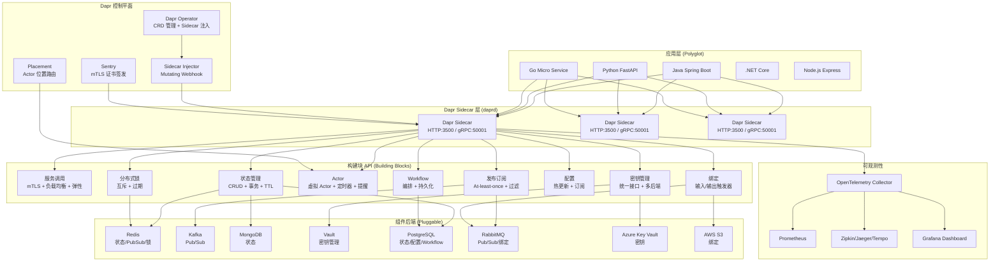

# [[Dapr|Dapr]] (Distributed Application Runtime) Enterprise 深度实践

> **最后更新**: 2026-04-24 | **适用版本**: Dapr v1.15+ | **难度**: 高级

---

<!-- chunk: 概述 -->## 概述

Dapr (Distributed Application Runtime) 是微软于2019年发起、2023年从 CNCF 毕业的分布式应用运行时项目。与传统的服务网格在网络层提供透明代理不同，Dapr 在应用层通过标准化的 HTTP/gRPC API 提供分布式系统的核心构建块（Building Blocks）——服务调用、状态管理、发布订阅、Actor 模型、绑定、密钥管理等。Dapr 通过 Sidecar 模式与业务应用同 Pod 部署，应用通过 HTTP/gRPC 调用 Dapr Sidecar 的标准 API 获得这些能力，无需引入特定的 SDK 或框架依赖。

Dapr 的核心价值在于"可移植的分布式系统能力抽象"——相同的业务代码可以运行在 [[Kubernetes|Kubernetes]]、虚拟机、边缘设备上，只需更换底层的组件配置（State Store、Pub/Sub Broker 等），即可适配不同的基础设施。这使得 Dapr 特别适合多云混合部署和供应商锁定规避的场景。2026年 Dapr 已经发展到 v1.15 版本，支持 Actor 状态 TTL、Pub/Sub 消息过滤、直接流式传输等高级特性，社区贡献的组件后端超过 100 种。

本文档从企业级生产环境角度，全面覆盖 Dapr 的架构设计、核心构建块配置、弹性模式、可观测性、安全策略、性能调优和故障排查。每个章节包含完整的 YAML 配置和可直接运行的代码示例。

#<!-- chunk: Dapr 企业架构全景 -->## Dapr 企业架构全景



---

<!-- chunk: 核心配置 — 控制平面高可用部署 -->## 核心配置 — 控制平面高可用部署

#<!-- chunk: 生产级 [[Helm|Helm]] 安装 -->## 生产级 Helm 安装

```bash
# 添加 Dapr Helm 仓库
helm repo add dapr https://dapr.github.io/helm-charts/
helm repo update

# HA 模式安装
helm install dapr dapr/dapr \
  --namespace dapr-system \
  --create-namespace \
  --set global.ha.enabled=true \
  --set global.mtls.enabled=true \
  --set global.logLevel=info \
  --set dapr_operator.replicaCount=3 \
  --set dapr_placement.replicaCount=3 \
  --set dapr_placement.maxActorAPILevel=20 \
  --set dapr_sentry.replicaCount=2 \
  --set dapr_sidecar_injector.replicaCount=2 \
  --set dapr_operator.resources.requests.cpu=200m \
  --set dapr_operator.resources.requests.memory=256Mi \
  --set dapr_operator.resources.limits.cpu=1000m \
  --set dapr_operator.resources.limits.memory=1Gi \
  --wait
```

#<!-- chunk: Dapr CLI 安装 -->## Dapr CLI 安装

```bash
# 安装 Dapr CLI
wget -q https://raw.githubusercontent.com/dapr/cli/master/install/install.sh -O - | /bin/bash

# 初始化 Dapr (Kubernetes)
dapr init -k --wait --timeout 600 \
  --set dapr_operator.replicaCount=3 \
  --set dapr_placement.replicaCount=3 \
  --set dapr_sentry.replicaCount=2 \
  --set dapr_sidecar_injector.replicaCount=2 \
  --set global.ha.enabled=true \
  --set global.mtls.enabled=true \
  --set global.logLevel=info

# 验证安装
dapr status -k
# NAME                   NAMESPACE    HEALTHY  STATUS   REPLICAS
# dapr-operator          dapr-system  True     Running  3
# dapr-placement         dapr-system  True     Running  3
# dapr-sentry            dapr-system  True     Running  2
# dapr-sidecar-injector  dapr-system  True     Running  2
```

#<!-- chunk: 生产环境配置 -->## 生产环境配置

```yaml
apiVersion: dapr.io/v1alpha1
kind: Configuration
metadata:
  name: production-config
  namespace: production
spec:
  mtls:
    enabled: true
    workloadCertTTL: "24h"
    allowedClockSkew: "15m"
  tracing:
    samplingRate: "1"
    otel:
      endpointAddress: "otel-collector.monitoring:4317"
      isSecure: false
      protocol: "grpc"
  metric:
    enabled: true
    rules:
      - name: "dapr_runtime_.*"
        enabled: true
      - name: "dapr_component_.*"
        enabled: true
      - name: "dapr_actor_.*"
        enabled: true
  features:
    - name: "ActorStateTTL"
      enabled: true
    - name: "PubSubFiltering"
      enabled: true
    - name: "DirectStreaming"
      enabled: true
    - name: "Workflow"
      enabled: true
    - name: "ServiceInvocationStreaming"
      enabled: true
  accessControl:
    defaultAction: deny
    trustDomain: "company.com"
    policies:
      - appId: order-service
        defaultAction: allow
        trustDomain: "company.com"
        namespace: "production"
        operations:
          - name: "/checkout"
            httpVerb: ["POST"]
            action: allow
          - name: "/cancel"
            httpVerb: ["POST"]
            action: allow
          - name: "/status"
            httpVerb: ["GET"]
            action: allow
      - appId: payment-service
        defaultAction: deny
        trustDomain: "company.com"
        namespace: "production"
        operations:
          - name: "/process"
            httpVerb: ["POST"]
            action: allow
          - name: "/refund"
            httpVerb: ["POST"]
            action: allow
  httpPipeline:
    handlers:
      - name: ratelimit
        type: middleware.http.ratelimit
  appHttpPipeline:
    handlers:
      - name: uppercase
        type: middleware.http.uppercase
```

---

<!-- chunk: 核心构建块配置 -->## 核心构建块配置

#<!-- chunk: 状态管理 — 多后端配置 -->## 状态管理 — 多后端配置

```yaml
apiVersion: dapr.io/v1alpha1
kind: Component
metadata:
  name: redis-statestore
  namespace: production
spec:
  type: state.redis
  version: v1
  metadata:
    - name: redisHost
      value: "redis-master.production:6379"
    - name: redisPassword
      secretKeyRef:
        name: redis-secret
        key: password
    - name: enableTLS
      value: "true"
    - name: failover
      value: "true"
    - name: sentinelMasterName
      value: "mymaster"
    - name: maxRetries
      value: "3"
    - name: maxRetryBackoff
      value: "5s"
    - name: ttlInSeconds
      value: "86400"
    - name: actorStateStore
      value: "true"
---
apiVersion: dapr.io/v1alpha1
kind: Component
metadata:
  name: postgres-statestore
  namespace: production
spec:
  type: state.postgresql
  version: v1
  metadata:
    - name: connectionString
      secretKeyRef:
        name: postgres-secret
        key: connection-string
    - name: tableName
      value: "dapr_state"
    - name: metadataTableName
      value: "dapr_metadata"
    - name: cleanupIntervalInSeconds
      value: "3600"
    - name: actorStateStore
      value: "false"
---
apiVersion: dapr.io/v1alpha1
kind: Component
metadata:
  name: mongodb-statestore
  namespace: production
spec:
  type: state.mongodb
  version: v1
  metadata:
    - name: host
      value: "mongodb-rs.production:27017"
    - name: username
      secretKeyRef:
        name: mongodb-secret
        key: username
    - name: password
      secretKeyRef:
        name: mongodb-secret
        key: password
    - name: databaseName
      value: "dapr_state_db"
    - name: collectionName
      value: "state_collection"
```

#<!-- chunk: 发布订阅 — Kafka 配置 -->## 发布订阅 — Kafka 配置

```yaml
apiVersion: dapr.io/v1alpha1
kind: Component
metadata:
  name: kafka-pubsub
  namespace: production
spec:
  type: pubsub.kafka
  version: v1
  metadata:
    - name: brokers
      value: "kafka-0.kafka.production:9092,kafka-1.kafka.production:9092,kafka-2.kafka.production:9092"
    - name: authType
      value: "sasl"
    - name: saslUsername
      secretKeyRef:
        name: kafka-secret
        key: username
    - name: saslPassword
      secretKeyRef:
        name: kafka-secret
        key: password
    - name: saslMechanism
      value: "SCRAM-SHA-512"
    - name: consumeRetryInterval
      value: "3s"
    - name: initialOffset
      value: "oldest"
    - name: maxMessageBytes
      value: "1048576"
    - name: clientID
      value: "dapr-consumer"
    - name: disableTls
      value: "false"
---
apiVersion: dapr.io/v1alpha1
kind: Subscription
metadata:
  name: order-created-sub
  namespace: production
spec:
  topic: order-created
  routes:
    default: /orders/process
    rules:
      - match: event.type == "priority"
        path: /orders/process-priority
  pubsubname: kafka-pubsub
  scopes:
    - order-service
    - inventory-service
---
apiVersion: dapr.io/v1alpha1
kind: Subscription
metadata:
  name: payment-completed-sub
  namespace: production
spec:
  topic: payment-completed
  routes:
    default: /notifications/send
  pubsubname: kafka-pubsub
  scopes:
    - notification-service
```

#<!-- chunk: 绑定 — 输入/输出触发器 -->## 绑定 — 输入/输出触发器

```yaml
apiVersion: dapr.io/v1alpha1
kind: Component
metadata:
  name: s3-binding
  namespace: production
spec:
  type: bindings.aws.s3
  version: v1
  metadata:
    - name: bucket
      value: "my-production-bucket"
    - name: region
      value: "us-west-2"
    - name: accessKey
      secretKeyRef:
        name: aws-secret
        key: access-key
    - name: secretKey
      secretKeyRef:
        name: aws-secret
        key: secret-key
    - name: decodeBase64
      value: "false"
    - name: encodeBase64
      value: "false"
---
apiVersion: dapr.io/v1alpha1
kind: Component
metadata:
  name: rabbitmq-binding
  namespace: production
spec:
  type: bindings.rabbitmq
  version: v1
  metadata:
    - name: queueName
      value: "task-queue"
    - name: host
      value: "amqp://rabbitmq.production:5672"
    - name: durable
      value: "true"
    - name: deleteWhenUnused
      value: "false"
    - name: ttlInSeconds
      value: "3600"
    - name: prefetchCount
      value: "10"
```

---

<!-- chunk: 流量管理实战 — 服务调用与弹性 -->## 流量管理实战 — 服务调用与弹性

#<!-- chunk: 弹性配置 -->## 弹性配置

```yaml
apiVersion: dapr.io/v1alpha1
kind: Resiliency
metadata:
  name: app-resiliency
  namespace: production
spec:
  policies:
    timeouts:
      general: 5s
      critical: 30s
      database: 10s
      quick: 2s
    retries:
      general:
        policy: constant
        duration: 1s
        maxRetries: 3
      exponential:
        policy: exponential
        maxInterval: 30s
        maxRetries: 5
        initialInterval: 1s
      aggressive:
        policy: exponential
        maxInterval: 60s
        maxRetries: 10
        initialInterval: 2s
    circuitBreakers:
      simpleCB:
        maxRequests: 1
        timeout: 60s
        trip: consecutiveFailures >= 5
      aggressiveCB:
        maxRequests: 3
        timeout: 30s
        trip: consecutiveFailures >= 3
      dataCB:
        maxRequests: 5
        timeout: 120s
        trip: consecutiveFailures >= 10
  targets:
    apps:
      inventory-service:
        timeout: general
        retry: exponential
        circuitBreaker: simpleCB
      payment-service:
        timeout: critical
        retry: general
        circuitBreaker: aggressiveCB
      notification-service:
        timeout: quick
        retry: general
      user-service:
        timeout: general
        retry: general
        circuitBreaker: simpleCB
      recommendation-service:
        timeout: general
        retry: general
    components:
      redis-statestore:
        outbound:
          timeout: database
          retry: exponential
          circuitBreaker: dataCB
      kafka-pubsub:
        outbound:
          timeout: general
          retry: general
      postgres-statestore:
        outbound:
          timeout: database
          retry: exponential
          circuitBreaker: dataCB
```

#<!-- chunk: 服务调用代码示例 -->## 服务调用代码示例

```go
package main

import (
    "context"
    "encoding/json"
    "log"
    "net/http"
    daprd "github.com/dapr/go-sdk/service/http"
    "github.com/dapr/go-sdk/client"
)

type Order struct {
    ID     string  `json:"id"`
    UserID string  `json:"userId"`
    Amount float64 `json:"amount"`
    Status string  `json:"status"`
}

type InventoryResponse struct {
    Available bool `json:"available"`
    Quantity  int  `json:"quantity"`
}

func main() {
    s := daprd.NewService(":8080")
    c, _ := client.NewClient()

    s.AddServiceInvocationHandler("/process-order", func(ctx context.Context, in *client.InvocationEvent) (*client.Content, error) {
        var order Order
        json.Unmarshal(in.Data, &order)

        inventoryReq, _ := json.Marshal(map[string]string{"productId": order.ID})
        resp, err := c.InvokeMethod(ctx, "inventory-service", "check-stock", "post",
            client.WithContent(&client.Content{
                ContentType: "application/json",
                Data:        inventoryReq,
            }),
        )
        if err != nil {
            log.Printf("Inventory check failed: %v", err)
            return &client.Content{
                Data:        []byte(`{"error": "inventory check failed"}`),
                ContentType: "application/json",
            }, err
        }

        var inventory InventoryResponse
        json.Unmarshal(resp, &inventory)

        if !inventory.Available {
            return &client.Content{
                Data:        []byte(`{"status": "rejected", "reason": "out of stock"}`),
                ContentType: "application/json",
            }, nil
        }

        paymentReq, _ := json.Marshal(map[string]interface{}{"orderId": order.ID, "amount": order.Amount})
        _, err = c.InvokeMethod(ctx, "payment-service", "charge", "post",
            client.WithContent(&client.Content{
                ContentType: "application/json",
                Data:        paymentReq,
            }),
        )
        if err != nil {
            log.Printf("Payment failed: %v", err)
            return &client.Content{
                Data:        []byte(`{"error": "payment failed"}`),
                ContentType: "application/json",
            }, err
        }

        order.Status = "confirmed"
        result, _ := json.Marshal(order)
        return &client.Content{
            Data:        result,
            ContentType: "application/json",
        }, nil
    })

    log.Fatal(s.Start())
}
```

#<!-- chunk: 状态管理代码示例 -->## 状态管理代码示例

```go
func saveOrderState(ctx context.Context, c client.Client, order Order) error {
    err := c.SaveState(ctx, "redis-statestore", order.ID, []byte(order.Status),
        map[string]string{
            "ttlInSeconds": "86400",
            "contentType":  "application/json",
        },
        nil,
    )
    if err != nil {
        return err
    }
    return nil
}

func getOrderState(ctx context.Context, c client.Client, orderID string) (string, error) {
    item, err := c.GetState(ctx, "redis-statestore", orderID, nil)
    if err != nil {
        return "", err
    }
    return string(item.Value), nil
}

func transactionalSave(ctx context.Context, c client.Client, orders []Order) error {
    ops := make([]*client.StateOperation, 0, len(orders))
    for _, order := range orders {
        data, _ := json.Marshal(order)
        ops = append(ops, client.StateOperation{
            OperationType: client.OperationUpsert,
            Key:           order.ID,
            Value:         data,
            Metadata:      map[string]string{"ttlInSeconds": "86400"},
        })
    }
    return c.ExecuteStateTransaction(ctx, "redis-statestore", nil, ops)
}
```

---

<!-- chunk: 安全策略 — mTLS 与访问控制 -->## 安全策略 — mTLS 与访问控制

#<!-- chunk: mTLS 配置 -->## mTLS 配置

```yaml
apiVersion: dapr.io/v1alpha1
kind: Configuration
metadata:
  name: security-config
  namespace: production
spec:
  mtls:
    enabled: true
    workloadCertTTL: "24h"
    allowedClockSkew: "15m"
  accessControl:
    defaultAction: deny
    trustDomain: "company.com"
    policies:
      - appId: order-service
        defaultAction: allow
        trustDomain: "company.com"
        namespace: "production"
        operations:
          - name: "/checkout"
            httpVerb: ["POST"]
            action: allow
          - name: "/cancel"
            httpVerb: ["POST"]
            action: allow
          - name: "/status"
            httpVerb: ["GET"]
            action: allow
      - appId: payment-service
        defaultAction: deny
        trustDomain: "company.com"
        namespace: "production"
        operations:
          - name: "/process"
            httpVerb: ["POST"]
            action: allow
            principals: ["order-service"]
          - name: "/refund"
            httpVerb: ["POST"]
            action: allow
            principals: ["order-service", "admin-service"]
      - appId: notification-service
        defaultAction: deny
        trustDomain: "company.com"
        namespace: "production"
        operations:
          - name: "/send"
            httpVerb: ["POST"]
            action: allow
            principals: ["*"]
```

#<!-- chunk: 密钥管理 -->## 密钥管理

```yaml
apiVersion: dapr.io/v1alpha1
kind: Component
metadata:
  name: production-secrets
  namespace: production
spec:
  type: secretstores.kubernetes
  version: v1
  metadata:
    - name: namespace
      value: "production"
---
apiVersion: dapr.io/v1alpha1
kind: Component
metadata:
  name: vault-secrets
  namespace: production
spec:
  type: secretstores.hashicorp.vault
  version: v1
  metadata:
    - name: vaultAddr
      value: "https://vault.company.com:8200"
    - name: skipVerify
      value: "false"
    - name: vaultToken
      secretKeyRef:
        name: vault-token
        key: token
    - name: vaultKVPrefix
      value: "dapr"
    - name: vaultKVUsePrefix
      value: "true"
    - name: skipTLS
      value: "false"
---
apiVersion: dapr.io/v1alpha1
kind: Component
metadata:
  name: azure-keyvault
  namespace: production
spec:
  type: secretstores.azure.keyvault
  version: v1
  metadata:
    - name: vaultName
      value: "mycompany-dapr-kv"
    - name: azureTenantId
      value: "tenant-id"
    - name: azureClientId
      value: "client-id"
    - name: azureClientSecret
      secretKeyRef:
        name: azure-sp-secret
        key: client-secret
```

---

<!-- chunk: 可观测性 — OpenTelemetry, Prometheus, [[Jaeger|Jaeger]] 集成 -->## 可观测性 — OpenTelemetry, Prometheus, Jaeger 集成

#<!-- chunk: 分布式追踪 -->## 分布式追踪

```yaml
apiVersion: dapr.io/v1alpha1
kind: Configuration
metadata:
  name: tracing-config
  namespace: production
spec:
  tracing:
    samplingRate: "1"
    otel:
      endpointAddress: "otel-collector.monitoring:4317"
      isSecure: false
      protocol: "grpc"
    stdout:
      enabled: true
```

#<!-- chunk: OpenTelemetry Collector 配置 -->## OpenTelemetry Collector 配置

```yaml
apiVersion: v1
kind: ConfigMap
metadata:
  name: otel-collector-config
  namespace: monitoring
data:
  otel-collector-config: |
    receivers:
      otlp:
        protocols:
          grpc:
            endpoint: 0.0.0.0:4317
          http:
            endpoint: 0.0.0.0:4318
    processors:
      batch:
        timeout: 5s
        send_batch_size: 1024
      memory_limiter:
        check_interval: 1s
        limit_mib: 512
    exporters:
      prometheus:
        endpoint: "0.0.0.0:8889"
        namespace: "dapr"
      jaeger:
        endpoint: "jaeger-collector.monitoring:14250"
        tls:
          insecure: true
      elasticsearch:
        endpoints:
          - "http://elasticsearch.monitoring:9200"
        logs_index: "dapr-logs"
    service:
      pipelines:
        metrics:
          receivers: [otlp]
          processors: [memory_limiter, batch]
          exporters: [prometheus]
        traces:
          receivers: [otlp]
          processors: [memory_limiter, batch]
          exporters: [jaeger]
        logs:
          receivers: [otlp]
          processors: [memory_limiter, batch]
          exporters: [elasticsearch]
```

#<!-- chunk: 自定义指标与 ServiceMonitor -->## 自定义指标与 ServiceMonitor

```yaml
apiVersion: dapr.io/v1alpha1
kind: Configuration
metadata:
  name: metrics-config
  namespace: production
spec:
  metric:
    enabled: true
    rules:
      - name: "dapr_runtime_.*"
        enabled: true
      - name: "dapr_component_.*"
        enabled: true
      - name: "dapr_actor_.*"
        enabled: true
---
apiVersion: monitoring.coreos.com/v1
kind: ServiceMonitor
metadata:
  name: dapr-sidecar
  namespace: production
spec:
  selector:
    matchLabels:
      dapr.io/sidecar: "true"
  namespaceSelector:
    any: true
  endpoints:
    - port: dapr-http
      path: /metrics
      interval: 15s
---
apiVersion: monitoring.coreos.com/v1
kind: ServiceMonitor
metadata:
  name: dapr-control-plane
  namespace: dapr-system
spec:
  selector:
    matchLabels:
      app.kubernetes.io/part-of: dapr
  namespaceSelector:
    matchNames:
      - dapr-system
  endpoints:
    - port: http
      path: /metrics
      interval: 15s
```

#<!-- chunk: 关键 PromQL 查询 -->## 关键 PromQL 查询

```promql
# Dapr Sidecar 运行时操作延迟
histogram_quantile(0.99, rate(dapr_runtime_latency_bucket[5m]))

# 状态操作成功率
sum(rate(dapr_runtime_state_operation_total{status="success"}[5m])) by (app_id, operation) /
sum(rate(dapr_runtime_state_operation_total[5m])) by (app_id, operation)

# Pub/Sub 消息处理延迟
histogram_quantile(0.99, rate(dapr_runtime_pubsub_latency_bucket[5m]))

# Actor 激活/停用次数
rate(dapr_runtime_actor_activated_total[5m])
rate(dapr_runtime_actor_deactivated_total[5m])

# 服务调用延迟
histogram_quantile(0.99, rate(dapr_runtime_service_invocation_latency_bucket[5m]))

# 组件初始化失败
dapr_runtime_component_init_total{status="error"}
```

#<!-- chunk: Prometheus 告警规则 -->## Prometheus 告警规则

```yaml
apiVersion: monitoring.coreos.com/v1
kind: PrometheusRule
metadata:
  name: dapr-alerts
  namespace: monitoring
spec:
  groups:
    - name: dapr.rules
      rules:
        - alert: DaprSidecarDown
          expr: up{job="dapr-sidecar"} == 0
          for: 1m
          labels:
            severity: critical
          annotations:
            summary: "Dapr sidecar {{ $labels.instance }} is down"

        - alert: DaprHighStateOperationErrorRate
          expr: |
            sum(rate(dapr_runtime_state_operation_total{status="error"}[5m])) by (app_id) /
            sum(rate(dapr_runtime_state_operation_total[5m])) by (app_id) > 0.05
          for: 2m
          labels:
            severity: warning
          annotations:
            summary: "Dapr state operation error rate above 5% for {{ $labels.app_id }}"

        - alert: DaprComponentInitFailed
          expr: dapr_runtime_component_init_total{status="error"} > 0
          for: 5m
          labels:
            severity: warning
          annotations:
            summary: "Dapr component {{ $labels.component_name }} init failed for {{ $labels.app_id }}"

        - alert: DaprHighPubSubLatency
          expr: |
            histogram_quantile(0.99, rate(dapr_runtime_pubsub_latency_bucket[5m])) > 5000
          for: 5m
          labels:
            severity: warning
          annotations:
            summary: "Dapr Pub/Sub P99 latency above 5s for {{ $labels.app_id }}"
```

---

<!-- chunk: 性能调优 -->## 性能调优

#<!-- chunk: Sidecar 资源优化 -->## Sidecar 资源优化

```yaml
apiVersion: apps/v1
kind: Deployment
metadata:
  name: optimized-service
  namespace: production
spec:
  replicas: 3
  selector:
    matchLabels:
      app: optimized-service
  template:
    metadata:
      labels:
        app: optimized-service
      annotations:
        dapr.io/enabled: "true"
        dapr.io/app-id: "optimized-service"
        dapr.io/config: "performance-config"
        dapr.io/app-port: "8080"
        dapr.io/app-protocol: "http"
        dapr.io/sidecar-cpu-limit: "200m"
        dapr.io/sidecar-memory-limit: "256Mi"
        dapr.io/sidecar-cpu-request: "50m"
        dapr.io/sidecar-memory-request: "64Mi"
        dapr.io/sidecar-readiness-probe-delay-seconds: "3"
        dapr.io/sidecar-readiness-probe-period-seconds: "5"
        dapr.io/sidecar-liveness-probe-delay-seconds: "10"
        dapr.io/sidecar-liveness-probe-period-seconds: "10"
        dapr.io/log-level: "info"
        dapr.io/graceful-shutdown-seconds: "30"
        dapr.io/block-shutdown-duration: "5s"
    spec:
      containers:
        - name: optimized-service
          image: optimized-service:v1.0.0
          ports:
            - containerPort: 8080
          resources:
            requests:
              cpu: "200m"
              memory: "256Mi"
            limits:
              cpu: "1000m"
              memory: "1Gi"
```

#<!-- chunk: Dapr 控制平面调优 -->## Dapr 控制平面调优

```yaml
apiVersion: apps/v1
kind: Deployment
metadata:
  name: dapr-operator
  namespace: dapr-system
spec:
  replicas: 3
  template:
    spec:
      containers:
        - name: dapr-operator
          resources:
            requests:
              cpu: "200m"
              memory: "256Mi"
            limits:
              cpu: "1000m"
              memory: "1Gi"
          env:
            - name: OPERATOR_WATCH_NAMESPACE
              value: ""
            - name: OPERATOR_MAX_WORKLOADS
              value: "10000"
---
apiVersion: apps/v1
kind: StatefulSet
metadata:
  name: dapr-placement
  namespace: dapr-system
spec:
  replicas: 3
  template:
    spec:
      containers:
        - name: dapr-placement
          resources:
            requests:
              cpu: "200m"
              memory: "256Mi"
            limits:
              cpu: "1000m"
              memory: "1Gi"
          env:
            - name: PLACEMENT_MAX_ACTORS
              value: "1000000"
            - name: PLACEMENT_RAFT_LOG_STORE
              value: "boltdb"
```

---

<!-- chunk: 故障排查 -->## 故障排查

#<!-- chunk: 完整诊断脚本 -->## 完整诊断脚本

```bash
#!/bin/bash

echo "=== 1. Dapr 控制平面状态 ==="
kubectl get pods -n dapr-system -o wide
dapr status -k

echo "=== 2. Sidecar 状态 ==="
kubectl get pods -n production -o jsonpath='{range .items[*]}{.metadata.name}{"\t"}{.spec.containers[*].name}{"\n"}{end}'

echo "=== 3. Dapr Dashboard ==="
echo "启动 Dashboard: dapr dashboard -k -n production -p 8080"

echo "=== 4. 组件状态 ==="
kubectl get components -n production -o wide
kubectl get components -n production -o yaml | grep -A5 "type:"

echo "=== 5. 健康检查 ==="
kubectl exec -n production deploy/order-service -c daprd -- \
  curl -s http://localhost:3500/v1.0/healthz
echo ""
kubectl exec -n production deploy/order-service -c daprd -- \
  curl -s http://localhost:3500/v1.0/healthz/outbound

echo "=== 6. 弹性配置 ==="
kubectl get resiliency -n production -o yaml

echo "=== 7. 配置检查 ==="
kubectl get configuration -n production -o yaml

echo "=== 8. Sidecar 日志 ==="
kubectl logs -n production deploy/order-service -c daprd --tail=100 | grep -iE "error|warn|fatal"

echo "=== 9. 指标 ==="
kubectl exec -n production deploy/order-service -c daprd -- \
  curl -s http://localhost:3500/metrics | head -50

echo "=== 10. 服务发现 ==="
kubectl exec -n production deploy/order-service -c daprd -- \
  curl -s http://localhost:3500/v1.0/metadata

echo "=== 11. 状态存储测试 ==="
kubectl exec -n production deploy/order-service -c daprd -- \
  curl -s -X POST http://localhost:3500/v1.0/state/redis-statestore \
  -H "Content-Type: application/json" \
  -d '[{"key":"test-key","value":"test-value"}]'
echo ""
kubectl exec -n production deploy/order-service -c daprd -- \
  curl -s http://localhost:3500/v1.0/state/redis-statestore/test-key

echo "=== 12. Pub/Sub 测试 ==="
kubectl exec -n production deploy/order-service -c daprd -- \
  curl -s -X POST http://localhost:3500/v1.0/publish/kafka-pubsub/order-events \
  -H "Content-Type: application/json" \
  -d '{"orderId":"test-123","status":"created"}'

echo "=== 13. 密钥访问测试 ==="
kubectl exec -n production deploy/order-service -c daprd -- \
  curl -s http://localhost:3500/v1.0/secrets/production-secrets/db-password

echo "=== 14. Actor 状态 (如适用) ==="
kubectl exec -n production deploy/order-service -c daprd -- \
  curl -s http://localhost:3500/v1.0/actors/order-actor/123/state
```

---

<!-- chunk: 最佳实践 -->## 最佳实践

#<!-- chunk: 部署最佳实践 -->## 部署最佳实践

```yaml
部署最佳实践清单:
  1. HA 模式: Operator 3副本, Placement 3副本 (Raft共识)
  2. 命名空间隔离: 每个环境独立配置和组件
  3. 组件密钥: 必须使用 secretKeyRef, 绝不使用明文
  4. 渐进式启用: 先启用服务调用, 再逐步启用其他构建块
  5. 资源限制: Sidecar 设置合理的 CPU/Memory 请求和限制
  6. 健康检查: 配置 readiness 和 liveness 探针
  7. 优雅关闭: 设置 grace-period 和 block-shutdown-duration
  8. 版本管理: 使用 Helm 管理控制平面, GitOps 管理组件配置
```

#<!-- chunk: 安全最佳实践 -->## 安全最佳实践

```yaml
安全最佳实践清单:
  1. mTLS 启用: 生产环境必须启用 mTLS
  2. 访问控制: 配置 accessControl defaultAction: deny
  3. 密钥后端: 生产环境使用 Vault 或云厂商 KMS
  4. 组件认证: 所有组件连接使用 TLS 加密
  5. 命名空间隔离: 不同环境的组件部署在不同命名空间
  6. 审计日志: 记录所有 API 调用和组件操作
  7. 证书轮换: 定期轮换 workload 证书
  8. 最小权限: ServiceAccount 仅授予必要的 RBAC 权限
```

#<!-- chunk: 性能最佳实践 -->## 性能最佳实践

```yaml
性能最佳实践清单:
  1. Sidecar 资源: CPU 50-200m, Memory 64-256Mi
  2. Resiliency: 避免过度重试, 合理设置超时
  3. Actor 状态存储: 使用高性能后端 (Redis)
  4. 采样率: 生产 10%, 测试 100%
  5. 连接池: 配置组件后端的连接池参数
  6. 批量操作: 使用事务批量写入状态
  7. 流式传输: 启用 DirectStreaming 减少跳数
  8. 组件选择: 根据场景选择最佳后端 (状态:Redis, PubSub:Kafka)
```

#<!-- chunk: 运维最佳实践 -->## 运维最佳实践

```yaml
运维最佳实践清单:
  1. Dapr Dashboard: 日常监控组件和 Sidecar 状态
  2. 关键告警: sidecar 状态, 组件初始化失败, 证书过期
  3. 组件后端: 监控后端服务健康 (Redis/Kafka/PostgreSQL)
  4. 版本升级: 先升级控制平面, 再逐命名空间重启 Sidecar
  5. 备份: 定期备份状态存储数据
  6. 压测: 上线前进行性能基准测试
  7. 日志: Sidecar 日志收集到集中式日志系统
  8. 文档: 维护组件依赖关系和配置文档
```

---

**文档版本**: v2.0
**最后更新**: 2026-04-24
**适用版本**: Dapr v1.15+

---

<!-- chunk: Obsidian 相关文档 -->## Obsidian 相关文档

- domain-03-networking-traffic MOC
- [[domain-03-networking-traffic/README.md|Domain 26: 企业级服务网格与微服务治理 (Enterprise Service Mesh & Microser...]]
- Domain-26 服务网格与微服务 — 开源项目索引
- Istio 企业级服务网格架构与实践
- Linkerd 企业级服务网格深度实践
- Consul Connect 企业级服务网格管理
- Envoy Proxy 企业级服务网格数据平面深度实践
- Traefik Mesh Enterprise Service Mesh 深度实践
- 服务网格对比与选型决策指南
- Istio Ambient Mesh 与 L7 策略深度实践
- 微服务弹性模式深度实践 — Circuit Breaker, Retry, Timeout, Bulkhead, Rat...
- API 网关与服务网格集成深度实践

## See Also

- 03-consul-connect-enterprise
- 04-envoy-proxy-enterprise
- 06-traefik-mesh-enterprise
- 07-service-mesh-comparison-selection

## Related

- [[domain-19-landscape-references/topic-index/service-mesh-index|Service Mesh 服务网格知识图谱索引]]
