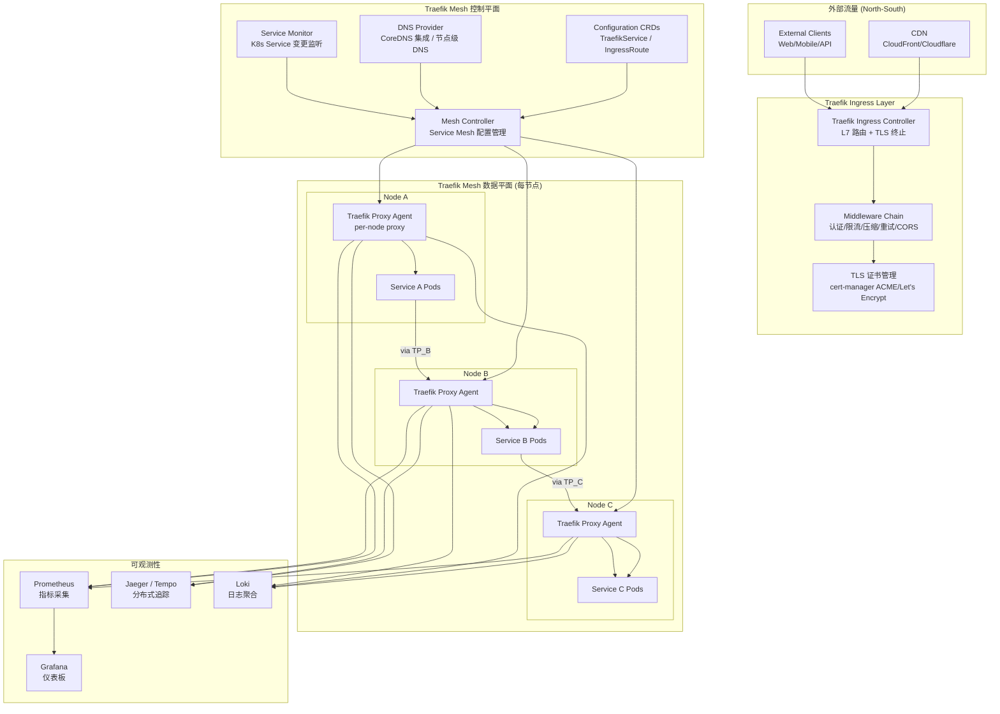

# Traefik Mesh Enterprise [[Service|Service]]Service Mesh）|Service Mesh]] 深度实践

> **最后更新**: 2026-04-24 | **适用版本**: Traefik Mesh v1.4+ / Traefik v3.x | **难度**: 中高级

---

<!-- chunk: 概述 -->## 概述

Traefik Mesh（原名 Maesh）是基于 Traefik Proxy 的轻量级 [[Kubernetes|Kubernetes]] 原生服务网格。与 [[Istio|Istio]] 和 [[Linkerd|Linkerd]] 的 Sidecar 模式不同，Traefik Mesh 采用"每节点代理"（per-node proxy）架构，通过修改 Kubernetes Service 的 Endpoint 来引导流量经过 Traefik 代理，而非在每个 Pod 中注入 Sidecar 容器。这种设计简化了部署和运维，但功能覆盖度相对有限。

Traefik Mesh 的核心优势在于与 Traefik 生态的无缝集成——如果您已经在使用 Traefik 作为 Ingress Controller，Traefik Mesh 提供了最自然的服务网格扩展路径。Go 语言编写的代理保证了良好的性能和低内存占用，Traefik 丰富的 Middleware 生态（限流、认证、重试、压缩等）可以直接应用于服务间通信。2026年 Traefik Mesh 的最新版本为 v1.4，与 Traefik v3.3 完全兼容，支持 ACL 模式、透明代理模式和丰富的 Middleware 链。

本文档从企业级生产环境角度，全面覆盖 Traefik Mesh 的架构设计、流量管理、安全配置、可观测性、多区域部署和故障排查。所有配置均基于生产环境最佳实践，可直接应用于实际项目。

## Traefik Mesh 架构全景



## Traefik Mesh vs Sidecar 模式对比

| 维度 | Traefik Mesh (每节点) | Istio/Linkerd (Sidecar) |
|:---|:---|:---|
| 代理部署 | 每节点一个 DaemonSet | 每个 Pod 一个 Sidecar |
| 资源开销 | 低 (~100MB/节点) | 高 (~100MB×Pod数) |
| Pod 启动延迟 | 无影响 | +3-8s (Sidecar注入) |
| 流量拦截 | DNS/Endpoint 修改 | iptables 规则 |
| 功能覆盖 | L7 路由 + Middleware | 完整 L3-L7 + WASM |
| 配置复杂度 | 简单 | 复杂 |
| 运维难度 | 低 | 中高 |
| 适用规模 | 中小规模 (<200服务) | 任意规模 |

---

<!-- chunk: 核心配置 — 企业级部署 -->## 核心配置 — 企业级部署

## 命名空间与 Helm 安装

```yaml
apiVersion: v1
kind: Namespace
metadata:
  name: traefik-mesh
  labels:
    name: traefik-mesh
    app.kubernetes.io/part-of: traefik-mesh
---
apiVersion: helm.cattle.io/v1
kind: HelmChart
metadata:
  name: traefik-mesh
  namespace: traefik-mesh
spec:
  repo: https://helm.traefik.io/mesh
  chart: traefik-mesh
  version: "1.4.0"
  targetNamespace: traefik-mesh
  valuesContent: |
    traefik:
      image: traefik:v3.3
      logging: INFO
      resources:
        requests:
          cpu: "100m"
          memory: "128Mi"
        limits:
          cpu: "500m"
          memory: "512Mi"

    mesh:
      controller:
        replicas: 2
        resources:
          requests:
            cpu: "100m"
            memory: "128Mi"
          limits:
            cpu: "500m"
            memory: "512Mi"
        affinity:
          podAntiAffinity:
            preferredDuringSchedulingIgnoredDuringExecution:
              - weight: 100
                podAffinityTerm:
                  labelSelector:
                    matchLabels:
                      app: traefik-mesh
                      component: controller
                  topologyKey: kubernetes.io/hostname

    defaultMode: transparent

    acl: true

    tracing:
      enabled: true
      jaeger:
        samplingServerURL: "http://jaeger-agent.monitoring:5778/sampling"
        localAgentHostPort: "jaeger-agent.monitoring:6831"

    metrics:
      prometheus:
        enabled: true
        addEntryPointsLabels: true
        addServicesLabels: true

    limits:
      http:
        maxConnections: 1024
        maxPendingRequests: 512
        maxRequestsPerConnection: 100
      tcp:
        maxConnections: 2048
```

## 生产级手动安装

> ⚠️ **🟡 中危变更** — 变更集群资源状态，建议先 --dry-run 或 diff 确认
> - `helm upgrade/install`：部署/升级 release

```bash
# 添加 Helm 仓库
helm repo add traefik-mesh https://helm.traefik.io/mesh
helm repo update

# 安装 Traefik Mesh
helm install traefik-mesh traefik-mesh/traefik-mesh \
  --namespace traefik-mesh \
  --create-namespace \
  --set traefik.image=traefik:v3.3 \
  --set traefik.logging=INFO \
  --set mesh.controller.replicas=2 \
  --set defaultMode=transparent \
  --set acl=true \
  --set tracing.enabled=true \
  --set tracing.jaeger.samplingServerURL=http://jaeger-agent.monitoring:5778/sampling \
  --set tracing.jaeger.localAgentHostPort=jaeger-agent.monitoring:6831 \
  --set metrics.prometheus.enabled=true \
  --wait

# 验证安装
kubectl get pods -n traefik-mesh -o wide
# NAME                                 READY   STATUS    RESTARTS   AGE
# traefik-mesh-controller-xxx          1/1     Running   0          2m
# traefik-mesh-proxy-xxxxx (DaemonSet) 1/1     Running   0          2m

# 检查 Traefik Mesh 状态
kubectl get meshes -A
kubectl get traefikservices -A
```

---

<!-- chunk: 流量管理实战 -->## 流量管理实战

## 金丝雀发布 — 流量分割

```yaml
apiVersion: traefik.io/v1alpha1
kind: TraefikService
metadata:
  name: user-service-canary
  namespace: production
spec:
  weighted:
    services:
      - name: user-service-v1
        port: 80
        weight: 90
      - name: user-service-v2
        port: 80
        weight: 10
    sticky:
      cookie:
        name: user-service-affinity
        httpOnly: true
        secure: true
        sameSite: strict
---
apiVersion: traefik.io/v1alpha1
kind: IngressRoute
metadata:
  name: user-service-route
  namespace: production
spec:
  entryPoints:
    - web
  routes:
    - match: Host(`api.company.com`) && PathPrefix(`/users`)
      kind: Rule
      services:
        - name: user-service-canary
          kind: TraefikService
      middlewares:
        - name: user-rate-limit
        - name: user-auth
        - name: request-id
---
apiVersion: apps/v1
kind: Deployment
metadata:
  name: user-service-v1
  namespace: production
spec:
  replicas: 5
  selector:
    matchLabels:
      app: user-service
      version: v1
  template:
    metadata:
      labels:
        app: user-service
        version: v1
    spec:
      containers:
        - name: user-service
          image: user-service:v1.0.0
          ports:
            - containerPort: 8080
          resources:
            requests:
              cpu: "100m"
              memory: "128Mi"
            limits:
              cpu: "500m"
              memory: "512Mi"
---
apiVersion: apps/v1
kind: Deployment
metadata:
  name: user-service-v2
  namespace: production
spec:
  replicas: 1
  selector:
    matchLabels:
      app: user-service
      version: v2
  template:
    metadata:
      labels:
        app: user-service
        version: v2
    spec:
      containers:
        - name: user-service
          image: user-service:v2.0.0
          ports:
            - containerPort: 8080
          resources:
            requests:
              cpu: "100m"
              memory: "128Mi"
            limits:
              cpu: "500m"
              memory: "512Mi"
```

## 高级路由规则

```yaml
apiVersion: traefik.io/v1alpha1
kind: IngressRoute
metadata:
  name: advanced-routing
  namespace: production
spec:
  entryPoints:
    - web
    - websecure
  routes:
    - match: Host(`api.company.com`) && Headers(`X-API-Version`, `v2`)
      kind: Rule
      services:
        - name: api-v2-service
          port: 80
      middlewares:
        - name: api-v2-rate-limit
        - name: cors-policy

    - match: Host(`api.company.com`) && Query(`format`, `json`)
      kind: Rule
      services:
        - name: json-api-service
          port: 80

    - match: Host(`app.company.com`) && HeadersRegexp(`Cookie`, `user-segment=premium`)
      kind: Rule
      services:
        - name: premium-service
          port: 80
      middlewares:
        - name: premium-auth

    - match: Host(`api.company.com`) && PathPrefix(`/admin`)
      kind: Rule
      services:
        - name: admin-service
          port: 80
      middlewares:
        - name: admin-ip-whitelist
        - name: admin-auth
        - name: admin-rate-limit

    - match: Host(`api.company.com`) && PathPrefix(`/ws`)
      kind: Rule
      services:
        - name: websocket-service
          port: 8081
  tls:
    secretName: api-tls
    options:
      name: tls-options
      namespace: production
```

## Middleware 配置链

```yaml
apiVersion: traefik.io/v1alpha1
kind: Middleware
metadata:
  name: user-rate-limit
  namespace: production
spec:
  rateLimit:
    average: 100
    burst: 50
    period: 1s
    sourceCriterion:
      requestHeaderName: "X-Forwarded-For"
---
apiVersion: traefik.io/v1alpha1
kind: Middleware
metadata:
  name: user-auth
  namespace: production
spec:
  forwardAuth:
    address: "http://auth-service.production:8080/auth"
    trustForwardHeader: true
    authResponseHeaders:
      - "X-Auth-User"
      - "X-Auth-Groups"
      - "X-Auth-Role"
      - "X-Auth-Email"
    authRequestHeaders:
      - "Authorization"
      - "Cookie"
---
apiVersion: traefik.io/v1alpha1
kind: Middleware
metadata:
  name: cors-policy
  namespace: production
spec:
  headers:
    accessControlAllowMethods:
      - GET
      - POST
      - PUT
      - DELETE
      - OPTIONS
    accessControlAllowOriginList:
      - "https://app.company.com"
      - "https://admin.company.com"
    accessControlMaxAge: 3600
    accessControlAllowHeaders:
      - "Authorization"
      - "Content-Type"
      - "X-Request-ID"
    accessControlExposeHeaders:
      - "X-Total-Count"
      - "X-Request-ID"
---
apiVersion: traefik.io/v1alpha1
kind: Middleware
metadata:
  name: admin-ip-whitelist
  namespace: production
spec:
  ipWhiteList:
    sourceRange:
      - "10.0.0.0/8"
      - "172.16.0.0/12"
      - "192.168.1.0/24"
---
apiVersion: traefik.io/v1alpha1
kind: Middleware
metadata:
  name: admin-auth
  namespace: production
spec:
  forwardAuth:
    address: "http://auth-service.production:8080/admin-auth"
    trustForwardHeader: true
    authResponseHeaders:
      - "X-Admin-User"
      - "X-Admin-Role"
---
apiVersion: traefik.io/v1alpha1
kind: Middleware
metadata:
  name: admin-rate-limit
  namespace: production
spec:
  rateLimit:
    average: 30
    burst: 10
    period: 1s
---
apiVersion: traefik.io/v1alpha1
kind: Middleware
metadata:
  name: retry-policy
  namespace: production
spec:
  retry:
    attempts: 3
    initialInterval: 500ms
---
apiVersion: traefik.io/v1alpha1
kind: Middleware
metadata:
  name: request-id
  namespace: production
spec:
  requestID:
    headerName: "X-Request-ID"
---
apiVersion: traefik.io/v1alpha1
kind: Middleware
metadata:
  name: compress
  namespace: production
spec:
  compress:
    excludedContentTypes:
      - "text/event-stream"
      - "application/grpc"
    minResponseBodyBytes: 1024
---
apiVersion: traefik.io/v1alpha1
kind: Middleware
metadata:
  name: strip-api-prefix
  namespace: production
spec:
  stripPrefix:
    prefixes:
      - "/api/v1"
      - "/api/v2"
    forceSlash: true
```

---

<!-- chunk: 安全策略 — mTLS 与访问控制 -->## 安全策略 — mTLS 与访问控制

## TLS 配置

```yaml
apiVersion: traefik.io/v1alpha1
kind: TLSOption
metadata:
  name: tls-options
  namespace: production
spec:
  minVersion: VersionTLS12
  maxVersion: VersionTLS13
  cipherSuites:
    - TLS_ECDHE_RSA_WITH_AES_128_GCM_SHA256
    - TLS_ECDHE_RSA_WITH_AES_256_GCM_SHA384
    - TLS_ECDHE_ECDSA_WITH_AES_128_GCM_SHA256
    - TLS_AES_128_GCM_SHA256
    - TLS_AES_256_GCM_SHA384
    - TLS_CHACHA20_POLY1305_SHA256
  curvePreferences:
    - CurveP521
    - CurveP384
  sniStrict: true
  clientAuth:
    caFiles:
      - /etc/traefik/certs/ca.crt
    clientAuthType: RequireAndVerifyClientCert
---
apiVersion: traefik.io/v1alpha1
kind: ServersTransport
metadata:
  name: secure-transport
  namespace: production
spec:
  serverName: "*.company.com"
  insecureSkipVerify: false
  rootCAsSecrets:
    - ca-certificates
  certificatesSecrets:
    - service-certificates
  maxIdleConnsPerHost: 100
  forwardingTimeouts:
    dialTimeout: "30s"
    responseHeaderTimeout: "60s"
    idleConnTimeout: "90s"
    readIdleTimeout: "60s"
    pingTimeout: "15s"
  disableHTTP2: false
  peerCertificate:
    - secret: peer-cert
---
apiVersion: traefik.io/v1alpha1
kind: TLSStore
metadata:
  name: default-tls-store
  namespace: production
spec:
  defaultCertificate:
    secretName: wildcard-company-com-tls
  certificates:
    - secretName: api-company-com-tls
      domains:
        - api.company.com
        - "*.api.company.com"
    - secretName: admin-company-com-tls
      domains:
        - admin.company.com
```

## OAuth2 认证

```yaml
apiVersion: traefik.io/v1alpha1
kind: Middleware
metadata:
  name: oauth2-proxy
  namespace: production
spec:
  forwardAuth:
    address: "http://oauth2-proxy.production:4180"
    trustForwardHeader: true
    authResponseHeaders:
      - "X-Forwarded-User"
      - "X-Forwarded-Email"
      - "X-Forwarded-Groups"
      - "Authorization"
---
apiVersion: apps/v1
kind: Deployment
metadata:
  name: oauth2-proxy
  namespace: production
spec:
  replicas: 2
  selector:
    matchLabels:
      app: oauth2-proxy
  template:
    metadata:
      labels:
        app: oauth2-proxy
    spec:
      containers:
        - name: oauth2-proxy
          image: quay.io/oauth2-proxy/oauth2-proxy:v7.8.0
          args:
            - --provider=google
            - --client-id=YOUR_CLIENT_ID
            - --client-secret=YOUR_CLIENT_SECRET
            - --cookie-secret=YOUR_COOKIE_SECRET
            - --cookie-secure=true
            - --cookie-domain=.company.com
            - --redirect-url=https://auth.company.com/oauth2/callback
            - --email-domain=company.com
            - --skip-provider-button=true
            - --set-authorization-header=true
            - --pass-access-token=true
          ports:
            - containerPort: 4180
          resources:
            requests:
              cpu: "50m"
              memory: "64Mi"
            limits:
              cpu: "200m"
              memory: "256Mi"
```

---

<!-- chunk: 可观测性 — Prometheus, Jaeger, Grafana 集成 -->## 可观测性 — Prometheus, Jaeger, Grafana 集成

## Prometheus ServiceMonitor

```yaml
apiVersion: monitoring.coreos.com/v1
kind: ServiceMonitor
metadata:
  name: traefik-mesh-metrics
  namespace: traefik-mesh
spec:
  selector:
    matchLabels:
      app: traefik-mesh
  endpoints:
    - port: metrics
      path: /metrics
      interval: 15s
---
apiVersion: monitoring.coreos.com/v1
kind: ServiceMonitor
metadata:
  name: traefik-mesh-controller
  namespace: traefik-mesh
spec:
  selector:
    matchLabels:
      app: traefik-mesh
      component: controller
  endpoints:
    - port: api
      path: /metrics
      interval: 15s
```

## Jaeger 追踪配置

```yaml
apiVersion: traefik.io/v1alpha1
kind: Tracing
metadata:
  name: production-tracing
  namespace: production
spec:
  serviceName: "traefik-mesh"
  spanNameLimit: 256
  jaeger:
    samplingServerURL: "http://jaeger-agent.monitoring:5778/sampling"
    samplingType: "const"
    samplingParam: 0.1
    localAgentHostPort: "jaeger-agent.monitoring:6831"
    propagation: "jaeger"
    gen128Bit: true
    traceContextHeaderName: "uber-trace-id"
---
apiVersion: traefik.io/v1alpha1
kind: Tracing
metadata:
  name: otlp-tracing
  namespace: production
spec:
  serviceName: "traefik-mesh"
  otlp:
    grpc:
      endpoint: "otel-collector.monitoring:4317"
      insecure: true
    http:
      endpoint: "http://otel-collector.monitoring:4318"
```

## 关键指标与告警

```yaml
apiVersion: monitoring.coreos.com/v1
kind: PrometheusRule
metadata:
  name: traefik-mesh-alerts
  namespace: traefik-mesh
spec:
  groups:
    - name: traefik-mesh.rules
      rules:
        - alert: TraefikMeshHighErrorRate
          expr: |
            sum(rate(traefik_service_requests_total{code=~"5.."}[5m])) by (service) /
            sum(rate(traefik_service_requests_total[5m])) by (service) > 0.05
          for: 2m
          labels:
            severity: warning
          annotations:
            summary: "Traefik Mesh error rate above 5% for {{ $labels.service }}"
            description: "Service {{ $labels.service }} is returning >5% 5xx errors"

        - alert: TraefikMeshHighLatency
          expr: |
            histogram_quantile(0.99, rate(traefik_service_request_duration_seconds_bucket[5m])) > 1.0
          for: 5m
          labels:
            severity: warning
          annotations:
            summary: "Traefik Mesh P99 latency above 1s for {{ $labels.service }}"

        - alert: TraefikMeshPodDown
          expr: up{job="traefik-mesh"} == 0
          for: 1m
          labels:
            severity: critical
          annotations:
            summary: "Traefik Mesh proxy {{ $labels.instance }} is down"

        - alert: TraefikMeshHighConnectionCount
          expr: traefik_entrypoint_open_connections > 10000
          for: 5m
          labels:
            severity: warning
          annotations:
            summary: "Traefik Mesh open connections > 10000 on {{ $labels.entrypoint }}"

        - alert: TraefikMeshTLSCertExpiringSoon
          expr: |
            traefik_tls_certificate_not_after - time() < 86400 * 14
          for: 1h
          labels:
            severity: warning
          annotations:
            summary: "TLS certificate expiring in less than 14 days"
```

## 关键 PromQL 查询

```promql
# 请求速率
sum(rate(traefik_service_requests_total[5m])) by (service)

# 错误率
sum(rate(traefik_service_requests_total{code=~"5.."}[5m])) by (service) /
sum(rate(traefik_service_requests_total[5m])) by (service)

# P99 延迟
histogram_quantile(0.99, sum(rate(traefik_service_request_duration_seconds_bucket[5m])) by (le, service))

# 活跃连接数
traefik_entrypoint_open_connections

# TLS 证书过期时间
traefik_tls_certificate_not_after - time()
```

---

<!-- chunk: 性能调优 -->## 性能调优

## 代理资源优化

```yaml
apiVersion: apps/v1
kind: DaemonSet
metadata:
  name: traefik-mesh-proxy
  namespace: traefik-mesh
spec:
  selector:
    matchLabels:
      app: traefik-mesh
      component: proxy
  template:
    metadata:
      labels:
        app: traefik-mesh
        component: proxy
    spec:
      serviceAccountName: traefik-mesh-proxy
      containers:
        - name: traefik
          image: traefik:v3.3
          args:
            - "--log.level=WARN"
            - "--accesslog=false"
            - "--metrics.prometheus=true"
            - "--metrics.prometheus.addEntryPointsLabels=true"
            - "--metrics.prometheus.addServicesLabels=true"
            - "--entryPoints.web.address=:80"
            - "--entryPoints.websecure.address=:443"
            - "--entryPoints.metrics.address=:9090"
            - "--providers.kubernetescrd"
            - "--providers.kubernetesingress"
          resources:
            requests:
              cpu: "200m"
              memory: "256Mi"
            limits:
              cpu: "1000m"
              memory: "512Mi"
          env:
            - name: TRAEFIK_LOG_LEVEL
              value: "WARN"
            - name: TRAEFIK_ACCESSLOG
              value: "false"
            - name: GOMAXPROCS
              value: "4"
            - name: GOMEMLIMIT
              value: "400MiB"
          ports:
            - name: web
              containerPort: 80
            - name: websecure
              containerPort: 443
            - name: metrics
              containerPort: 9090
```

## Traefik Mesh Controller 调优

```yaml
apiVersion: apps/v1
kind: Deployment
metadata:
  name: traefik-mesh-controller
  namespace: traefik-mesh
spec:
  replicas: 2
  template:
    spec:
      containers:
        - name: controller
          resources:
            requests:
              cpu: "100m"
              memory: "128Mi"
            limits:
              cpu: "500m"
              memory: "512Mi"
          env:
            - name: LOG_LEVEL
              value: "info"
            - name: RESYNC_INTERVAL
              value: "300s"
            - name: WATCH_NAMESPACES
              value: ""
```

---

<!-- chunk: 故障排查 -->## 故障排查

## 完整诊断脚本

> ⚠️ **🟡 中危变更** — 变更集群资源状态，建议先 --dry-run 或 diff 确认
> - `kubectl exec`：进入容器执行命令，可能改变容器状态

```bash
#!/bin/bash

echo "=== 1. Pod 状态 ==="
kubectl get pods -n traefik-mesh -o wide

echo "=== 2. Mesh 配置 ==="
kubectl get meshes -A -o yaml

echo "=== 3. 路由规则 ==="
kubectl get ingressroute -A
kubectl get traefikservice -A
kubectl get middleware -A
kubectl get tlsstore -A
kubectl get tlsoption -A
kubectl get serverstransport -A

echo "=== 4. 代理日志 ==="
kubectl logs -n traefik-mesh -l app=traefik-mesh,component=proxy --tail=100 | grep -iE "error|warn"

echo "=== 5. 控制器日志 ==="
kubectl logs -n traefik-mesh -l app=traefik-mesh,component=controller --tail=100

echo "=== 6. 连通性测试 ==="
kubectl exec -n traefik-mesh deploy/traefik-mesh-proxy -- \
  curl -s http://localhost:8082/ping
echo ""

echo "=== 7. 资源使用 ==="
kubectl top pods -n traefik-mesh

echo "=== 8. 证书检查 ==="
kubectl get certificate -A
kubectl get secret -A | grep tls
kubectl get order -A

echo "=== 9. 路由测试 ==="
LB_IP=$(kubectl get svc -n traefik-mesh traefik-mesh -o jsonpath='{.status.loadBalancer.ingress[0].ip}' 2>/dev/null || echo "pending")
if [ "$LB_IP" != "pending" ]; then
  curl -sS -o /dev/null -w "HTTP %{http_code}, Time: %{time_total}s\n" \
    -H "Host: api.company.com" http://$LB_IP/health
fi

echo "=== 10. 配置验证 ==="
kubectl describe ingressroute -n production
kubectl describe middleware -n production

echo "=== 11. 性能分析 ==="
kubectl exec -n traefik-mesh deploy/traefik-mesh-proxy -- \
  curl -s http://localhost:9090/metrics | grep -E "request_duration|open_connections|requests_total"

echo "=== 12. Endpoint 检查 ==="
kubectl get endpoints -n production
```

## 常见问题速查

| 症状 | 可能原因 | 解决方案 |
|:---|:---|:---|
| 503 Service Unavailable | 后端 Pod 不健康 | 检查 Pod readiness/liveness 探针 |
| 路由不生效 | IngressRoute hosts 不匹配 | 检查 match 规则和 Host 头 |
| TLS 握手失败 | 证书 Secret 不存在 | `kubectl get secret -A | grep tls` |
| Middleware 不生效 | 引用顺序或命名空间错误 | Middleware 必须与 IngressRoute 同命名空间 |
| 流量分割不生效 | TraefikService weight 错误 | 检查 weight 总和，确保后端服务存在 |
| 限流不生效 | sourceCriterion 配置错误 | 检查请求头名称或 IP 来源 |
| CORS 预检失败 | headers 中间件配置不全 | 确保 OPTIONS 方法被允许 |
| DNS 解析失败 | CoreDNS 未配置 Mesh DNS | 检查 CoreDNS 配置和 Mesh DNS Provider |
| 内存持续增长 | 连接泄漏 | 检查 idleTimeout、maxIdleConnsPerHost |
| 追踪断裂 | Jaeger agent 不可达 | 检查 tracing 配置中的地址 |

---

<!-- chunk: 最佳实践 -->## 最佳实践

## 部署最佳实践

```yaml
部署最佳实践清单:
  1. 高可用: Controller 2+ 副本, PDB 保护
  2. 资源合理: 代理 CPU 200m-1000m, 内存 256-512Mi
  3. 统一管理: 与 Traefik Ingress 共用 TraefikService 和 Middleware
  4. 使用 TraefikService: 流量分割和负载均衡必须通过 TraefikService
  5. 健康检查: 配置代理的 readiness/liveness 探针
  6. 日志策略: 生产环境关闭访问日志或仅记录错误
  7. TLS 证书: 使用 cert-manager 自动管理
```

## 安全最佳实践

```yaml
安全最佳实践清单:
  1. TLS 1.2+: 最低版本 TLS 1.2, 推荐 TLS 1.3
  2. ForwardAuth: 外部认证服务 (OAuth2/OIDC)
  3. IP 白名单: 管理接口限制 IP 范围
  4. 证书自动轮换: cert-manager + Let's Encrypt/内部CA
  5. mTLS: 服务间通信启用 mTLS (ACL 模式)
  6. CORS: 严格配置允许的来源和方法
  7. Rate Limiting: 全局和 API 级限流
  8. 审计日志: 记录管理操作和认证事件
```

## 可观测性最佳实践

```yaml
可观测性最佳实践清单:
  1. Prometheus 指标: 采集代理和控制器指标
  2. Jaeger 分布式追踪: 采样率 10%, 关键路径 100%
  3. 关键告警: 错误率 > 5%, P99 > 1s, 代理宕机
  4. 访问日志: JSON 格式, 按需开启
  5. Grafana Dashboard: 使用官方 Traefik Mesh 仪表板
  6. SLO 监控: 基于 Prometheus 指标定义 SLO
```

## 运维最佳实践

```yaml
运维最佳实践清单:
  1. GitOps: 所有 CRD 配置通过 Git 管理
  2. 定期备份: 备份 CRD 和 Secret
  3. 滚动升级: 先升级 Controller, 再逐节点升级 Proxy
  4. 多区域部署: 使用 TraefikService 跨区域流量分割
  5. 压测: 上线前进行性能基准测试
  6. 文档: 维护路由规则和 Middleware 链文档
  7. 变更审批: IngressRoute 变更需要 Code Review
```

---

**文档版本**: v2.0
**最后更新**: 2026-04-24
**适用版本**: Traefik Mesh v1.4+

---

<!-- chunk: Obsidian 相关文档 -->## Obsidian 相关文档

- domain-03-networking-traffic MOC
- [[domain-03-networking-traffic/README.md|Domain 03: 企业级服务网格与微服务治理 (Enterprise Service Mesh & Microser...]]
- Domain-26 服务网格与微服务 — 开源项目索引
- Istio 企业级服务网格架构与实践
- Linkerd 企业级服务网格深度实践
- Consul Connect 企业级服务网格管理
- Envoy Proxy 企业级服务网格数据平面深度实践
- Dapr (Distributed Application Runtime) Enterprise 深度实践
- 服务网格对比与选型决策指南
- Istio Ambient Mesh 与 L7 策略深度实践
- 微服务弹性模式深度实践 — Circuit Breaker, Retry, Timeout, Bulkhead, Rat...
- API 网关与服务网格集成深度实践

## See Also

- 04-envoy-proxy-enterprise
- 05-dapr-enterprise-distributed-runtime
- 07-service-mesh-comparison-selection
- 08-ambient-mesh-l7-policy

## Related

- [[domain-19-landscape-references/topic-index/service-mesh-index.md|Service Mesh 服务网格知识图谱索引]]
