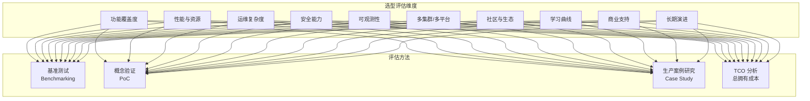
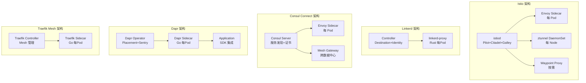
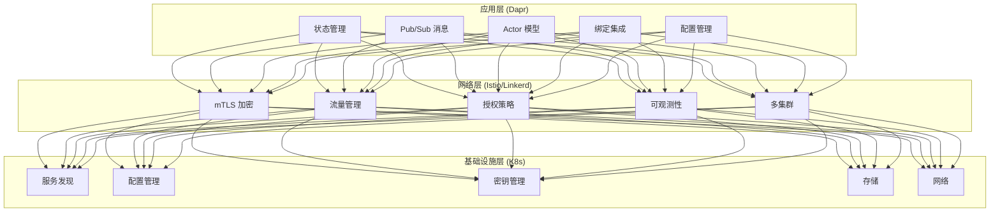

# 服务网格对比与选型决策指南

> **最后更新**: 2026-04-24
> **适用版本**: [[Istio|Istio]] v1.29 / [[Linkerd|Linkerd]] v2.18 / Consul v1.20 / [[Dapr|Dapr]] v1.15 / Traefik Mesh v1.4
> **难度**: 架构师级

---

<!-- chunk: 概述 -->## 概述

服务网格选型是微服务架构演进过程中最关键的基础设施决策之一。错误的选型不仅会导致资源浪费和运维复杂度激增，还可能在业务快速扩张时成为系统瓶颈。本文档从企业架构师的视角出发，对当前主流的五款服务网格/分布式运行时平台——Istio、Linkerd、Consul Connect、Dapr、Traefik Mesh——进行全面、客观、深度的横向对比分析，并提供场景化的选型矩阵和决策方法论。

服务网格市场在2026年已进入成熟期，各项目在功能边界、性能特征、运维复杂度上形成了明显的差异化定位。选型的核心不是寻找"最好"的服务网格，而是找到最适合企业当前阶段和未来演进方向的技术方案。本文档通过标准化的对比维度、量化的性能数据、真实的客户案例和清晰的决策流程，帮助架构团队在2-4周内完成服务网格的技术选型。

#<!-- chunk: 核心对比维度 -->## 核心对比维度



---

<!-- chunk: 一、架构哲学对比 -->## 一、架构哲学对比

#<!-- chunk: 1.1 设计理念差异 -->## 1.1 设计理念差异

五个项目在架构哲学上有根本性差异，理解这些差异是选型的第一步：

| 项目 | 设计哲学 | 架构模式 | 数据平面技术 | 核心取舍 |
|:---|:---|:---|:---|:---|
| **Istio** | 功能全面、企业级 | Sidecar + Ambient 双模式 | C++ ([[Envoy|Envoy]]) | 功能丰富 vs 运维复杂 |
| **Linkerd** | 极简主义、安全默认 | Sidecar only | Rust (自研) | 简洁 vs 功能限制 |
| **Consul Connect** | 生态集成、多平台 | Sidecar (Envoy) | C++ (Envoy) | HashiCorp 绑定 vs 统一管理 |
| **Dapr** | 应用级抽象、多运行时 | SDK + Sidecar | Go (自研) | 应用侵入 vs 丰富能力 |
| **Traefik Mesh** | Go 原生、云原生友好 | Sidecar (Traefik) | Go (Traefik) | 简单 vs 功能不够成熟 |

#<!-- chunk: 1.2 架构对比图 -->## 1.2 架构对比图



---

<!-- chunk: 二、功能覆盖度对比 -->## 二、功能覆盖度对比

#<!-- chunk: 2.1 核心功能矩阵 -->## 2.1 核心功能矩阵

| 功能 | Istio | Linkerd | Consul Connect | Dapr | Traefik Mesh |
|:---|:---|:---|:---|:---|:---|
| **自动 mTLS** | ✅ | ✅ (默认) | ✅ | ✅ | ⚠️ (手动) |
| **L4 流量管理** | ✅ | ✅ | ✅ | ✅ | ✅ |
| **L7 流量管理** | ✅ (丰富) | ✅ (基础) | ✅ (丰富) | ✅ (基础) | ✅ (中等) |
| **流量分割** | ✅ | ✅ (SMI) | ✅ | ✅ | ✅ |
| **故障注入** | ✅ | ✅ | ❌ | ❌ | ❌ |
| **流量镜像** | ✅ | ❌ | ❌ | ❌ | ❌ |
| **超时/重试** | ✅ | ✅ | ✅ | ✅ | ✅ |
| **熔断** | ✅ (Envoy) | ⚠️ (基础) | ✅ (Envoy) | ✅ | ✅ |
| **速率限制** | ✅ | ⚠️ (基础) | ✅ | ✅ | ✅ |
| **WASM 扩展** | ✅ | ❌ | ✅ (Envoy) | ❌ | ❌ |
| **JWT 认证** | ✅ | ❌ | ❌ | ❌ | ✅ (ForwardAuth) |
| **授权策略** | ✅ (丰富) | ✅ (基础) | ✅ (意图) | ✅ | ⚠️ |
| **多集群** | ✅ (成熟) | ✅ (基础) | ✅ (多DC) | ⚠️ | ❌ |
| **VM 工作负载** | ✅ | ⚠️ | ✅ | ⚠️ | ❌ |
| **Gateway API** | ✅ | ✅ | ⚠️ | ❌ | ✅ |
| **状态管理** | ❌ | ❌ | ❌ | ✅ | ❌ |
| **Pub/Sub** | ❌ | ❌ | ❌ | ✅ | ❌ |
| **Actor 模型** | ❌ | ❌ | ❌ | ✅ | ❌ |
| **绑定** | ❌ | ❌ | ❌ | ✅ | ❌ |
| **无 Sidecar 模式** | ✅ (Ambient) | ❌ | ❌ | ❌ | ❌ |

#<!-- chunk: 2.2 流量管理能力对比 -->## 2.2 流量管理能力对比

```yaml
Istio 流量管理:
  路由: VirtualService (权重/条件/Header/Cookie/Query)
  目标: DestinationRule (子集/连接池/异常检测)
  网关: Gateway + Gateway API 双模式
  高级: 流量镜像、故障注入、TCP/UDP 路由
  协议: HTTP/1.1, HTTP/2, gRPC, TCP, WebSocket

Linkerd 流量管理:
  路由: HTTPRoute (Gateway API) + ServiceProfile
  分割: TrafficSplit (SMI 标准)
  高级: 故障注入 (FaultInjection)
  协议: HTTP/1.1, HTTP/2, gRPC, TCP

Consul Connect 流量管理:
  路由: ServiceRouter (配置条目)
  分割: ServiceSplitter
  解析: ServiceResolver (子集)
  协议: HTTP/1.1, HTTP/2, gRPC, TCP

Dapr 流量管理:
  路由: 服务调用 API (HTTP/gRPC)
  重试: Resiliency 配置
  熔断: Resiliency circuitBreaker
  协议: HTTP/1.1, gRPC

Traefik Mesh 流量管理:
  路由: IngressRoute (Traefik CRD)
  分割: TraefikService (加权)
  中间件: Middleware (限流/认证/重试)
  协议: HTTP/1.1, HTTP/2, TCP
```

---

<!-- chunk: 三、性能与资源对比 -->## 三、性能与资源对比

#<!-- chunk: 3.1 控制平面资源消耗 -->## 3.1 控制平面资源消耗

| 资源维度 | Istio (istiod) | Linkerd Controller | Consul Server | Dapr Control Plane | Traefik Controller |
|:---|:---|:---|:---|:---|:---|
| **内存 (典型)** | 512MB-2GB | 128-512MB | 256MB-1GB (per node) | 256MB-1GB | 128-256MB |
| **CPU (典型)** | 200m-1 core | 100-500m | 100-500m | 100-500m | 100-300m |
| **副本数 (HA)** | 3 | 3 | 3-5 | 2-3 | 2 |
| **总控制面开销** | ~2-6GB | ~0.5-1.5GB | ~1-5GB | ~1-3GB | ~0.5GB |

#<!-- chunk: 3.2 数据平面资源消耗 (每 Pod) -->## 3.2 数据平面资源消耗 (每 Pod)

| 资源维度 | Istio Sidecar | Linkerd Proxy | Consul Sidecar | Dapr Sidecar | Traefik Sidecar |
|:---|:---|:---|:---|:---|:---|
| **内存 (请求/限制)** | 128Mi / 1Gi | 20Mi / 50Mi | 50Mi / 200Mi | 128Mi / 512Mi | 64Mi / 256Mi |
| **CPU (请求/限制)** | 100m / 2 | 10m / 100m | 50m / 200m | 50m / 200m | 50m / 200m |
| **额外延迟 (P50)** | 1-2ms | 0.3-0.8ms | 1-2ms | 0.5-1.5ms | 0.8-1.5ms |
| **额外延迟 (P99)** | 2-5ms | 0.5-1.5ms | 2-5ms | 1-3ms | 1-3ms |
| **启动时间** | 3-8s | 1-3s | 3-5s | 2-5s | 2-4s |

#<!-- chunk: 3.3 规模化性能 -->## 3.3 规模化性能

| 维度 | Istio | Linkerd | Consul Connect | Dapr | Traefik Mesh |
|:---|:---|:---|:---|:---|:---|
| **支持服务数** | 5000+ | 2000+ | 10000+ | 3000+ | 1000+ |
| **支持 Sidecar 数** | 50000+ | 20000+ | 30000+ | 15000+ | 5000+ |
| **配置推送延迟** | 1-5s | < 1s | 1-3s | 1-3s | 1-2s |
| **大规模生产案例** | 多家 >1000 服务 | 多家 >500 服务 | 多家 >2000 服务 | 多家 >500 服务 | 有限 |

#<!-- chunk: 3.4 Ambient Mesh 资源对比 (Istio 特有) -->## 3.4 Ambient Mesh 资源对比 (Istio 特有)

```yaml
Sidecar 模式 (1000 个 Pod):
  总内存: ~100GB (100MB × 1000)
  总CPU请求: ~100 cores (100m × 1000)

Ambient 模式 (1000 个 Pod, 50 节点):
  ztunnel 总内存: ~1GB (20MB × 50 节点)
  waypoint 总内存: ~5GB (5 个 waypoint × 1GB)
  总CPU请求: ~10 cores
  资源节省: 约 85-90%
```

---

<!-- chunk: 四、安全能力对比 -->## 四、安全能力对比

#<!-- chunk: 4.1 安全功能矩阵 -->## 4.1 安全功能矩阵

| 安全能力 | Istio | Linkerd | Consul Connect | Dapr | Traefik Mesh |
|:---|:---|:---|:---|:---|:---|
| **自动 mTLS** | ✅ | ✅ (默认) | ✅ | ✅ | ⚠️ |
| **证书轮换** | ✅ (自动, 24h) | ✅ (自动, 24h) | ✅ (自动) | ✅ (自动) | ⚠️ (手动) |
| **外部 CA 集成** | ✅ (Vault/cert-manager) | ✅ (cert-manager) | ✅ (Vault) | ✅ (Vault/K8s) | ⚠️ |
| **授权策略** | ✅ (RBAC, ABAC) | ✅ (Server+Authorization) | ✅ (Intentions) | ✅ (AccessControl) | ⚠️ (Middleware) |
| **JWT 验证** | ✅ (RequestAuthentication) | ❌ | ❌ | ❌ | ✅ (ForwardAuth) |
| **网络策略** | ✅ (AuthorizationPolicy) | ✅ (NetworkPolicy) | ✅ (Intention) | ⚠️ | ✅ (IP白名单) |
| **审计日志** | ✅ | ⚠️ | ✅ | ⚠️ | ⚠️ |
| **SPIFFE/SPIRE** | ✅ | ✅ | ⚠️ | ✅ | ❌ |
| **零信任默认** | ✅ (deny-all) | ✅ (默认安全) | ✅ (deny by default) | ⚠️ | ❌ |

#<!-- chunk: 4.2 安全最佳实践对比 -->## 4.2 安全最佳实践对比

```yaml
Istio 安全最佳实践:
  步骤1: 启用全局 STRICT mTLS
  步骤2: 部署 deny-all 默认策略
  步骤3: 逐步添加 ALLOW 规则
  步骤4: 启用 JWT 验证 (如需要)
  步骤5: 配置审计日志

Linkerd 安全最佳实践:
  步骤1: 安装即自动 mTLS
  步骤2: 定义 Server 资源
  步骤3: 添加 Authorization 策略
  步骤4: 集成外部 CA (生产环境)

Consul Connect 安全最佳实践:
  步骤1: 启用 TLS 和 ACL
  步骤2: 定义 Intentions (默认拒绝)
  步骤3: 集成 Vault 证书管理
  步骤4: 启用审计日志
```

---

<!-- chunk: 五、可观测性对比 -->## 五、可观测性对比

#<!-- chunk: 5.1 可观测性能力矩阵 -->## 5.1 可观测性能力矩阵

| 可观测性 | Istio | Linkerd | Consul Connect | Dapr | Traefik Mesh |
|:---|:---|:---|:---|:---|:---|
| **指标 (Prometheus)** | ✅ (丰富) | ✅ (黄金指标) | ✅ (Envoy指标) | ✅ | ✅ |
| **分布式追踪** | ✅ (多后端) | ✅ (基础) | ✅ (Envoy原生) | ✅ (OTel) | ✅ (Jaeger) |
| **访问日志** | ✅ (可定制) | ✅ | ✅ | ✅ | ✅ |
| **服务拓扑** | ✅ (Kiali) | ✅ (viz) | ✅ (Consul UI) | ⚠️ | ⚠️ |
| **实时流量** | ✅ (Kiali) | ✅ (tap) | ⚠️ | ❌ | ❌ |
| **仪表板** | ✅ (Kiali/Grafana) | ✅ (viz/Grafana) | ✅ (Consul UI) | ✅ (Dashboard) | ⚠️ |

#<!-- chunk: 5.2 监控集成配置对比 -->## 5.2 监控集成配置对比

```yaml
Istio 监控栈:
  指标: Prometheus + Grafana (自动采集)
  拓扑: Kiali (服务图、流量动画)
  追踪: Jaeger / Tempo / Zipkin
  日志: Fluentd / Loki
  安装: kubectl apply -f samples/addons/

Linkerd 监控栈:
  指标: Prometheus + Grafana (viz 扩展)
  拓扑: Linkerd Dashboard (viz)
  追踪: Jaeger (Linkerd-Jaeger 扩展)
  实时: linkerd viz tap (命令行)
  安装: linkerd viz install

Consul Connect 监控栈:
  指标: Prometheus (Envoy stats)
  拓扑: Consul UI (内置)
  追踪: Envoy 原生追踪配置
  日志: Consul audit log

Dapr 监控栈:
  指标: Prometheus (Dapr metrics)
  追踪: OpenTelemetry Collector
  仪表板: Dapr Dashboard
  安装: 内置于 sidecar
```

---

<!-- chunk: 六、运维复杂度对比 -->## 六、运维复杂度对比

#<!-- chunk: 6.1 安装与升级 -->## 6.1 安装与升级

| 运维维度 | Istio | Linkerd | Consul Connect | Dapr | Traefik Mesh |
|:---|:---|:---|:---|:---|:---|
| **安装方式** | istioctl/Helm/Gateway | CLI/Helm | Helm/Terraform | CLI/Helm | Helm |
| **安装时间** | 5-15 分钟 | 2-5 分钟 | 10-30 分钟 | 5-10 分钟 | 5 分钟 |
| **升级复杂度** | 中等 (金丝雀升级) | 简单 (滚动更新) | 中等 | 简单 | 简单 |
| **配置验证** | istioctl analyze | linkerd check | consul validate | dapr run --config | 手动验证 |
| **排错工具** | istioctl (丰富) | linkerd viz (简洁) | consul debug | dapr dashboard | kubectl logs |
| **CRD 数量** | ~50+ | ~15 | ~20 | ~20 | ~10 |

#<!-- chunk: 6.2 日常运维工作量 -->## 6.2 日常运维工作量

```yaml
Istio 运维:
  每日: 检查 istiod 状态、证书有效期、流量异常
  每周: 审查 AuthorizationPolicy、分析延迟趋势
  每月: 版本升级评估、性能基准测试、配置审计
  估计人力: 0.5-1 FTE (100+ 服务)

Linkerd 运维:
  每日: linkerd check、成功率监控
  每周: 证书轮换检查、资源使用分析
  每月: 版本升级、扩展评估
  估计人力: 0.2-0.5 FTE (100+ 服务)

Consul Connect 运维:
  每日: consul members、意图验证
  每周: ACL token 审计、证书管理
  每月: 多数据中心同步检查、版本升级
  估计人力: 0.5-1 FTE

Dapr 运维:
  每日: Dapr sidecar 健康检查、组件状态
  每周: Resiliency 配置审查、状态存储健康
  每月: Dapr 版本升级、Placement 服务维护
  估计人力: 0.3-0.5 FTE

Traefik Mesh 运维:
  每日: Pod 状态检查、路由验证
  每周: 中间件配置审查、证书检查
  每月: 版本升级、备份恢复测试
  估计人力: 0.2-0.3 FTE
```

---

<!-- chunk: 七、选型决策矩阵 -->## 七、选型决策矩阵

#<!-- chunk: 7.1 按企业规模选型 -->## 7.1 按企业规模选型

| 企业规模 | 服务数量 | 推荐方案 | 备选方案 | 关键考虑 |
|:---|:---|:---|:---|:---|
| 初创 (< 30人) | < 20 | Linkerd | 无 (K8s 原生) | 最快落地、最低成本 |
| 中型 (30-200人) | 20-100 | Istio 或 Linkerd | Consul Connect | 平衡功能与复杂度 |
| 大型 (200-2000人) | 100-1000 | Istio | Consul Connect | 功能全面、可扩展 |
| 超大型 (> 2000人) | > 1000 | Istio + Dapr | Consul + Dapr | 多层治理、多集群 |

#<!-- chunk: 7.2 按技术场景选型 -->## 7.2 按技术场景选型

| 技术场景 | 首选 | 次选 | 原因 |
|:---|:---|:---|:---|
| 纯 mTLS + 可观测性 | Linkerd | Istio | Linkerd 开箱即用 |
| 复杂流量管理 | Istio | Consul Connect | Istio 功能最丰富 |
| 金丝雀/蓝绿部署 | Istio | Linkerd | Istio 流量分割更精细 |
| 多集群互连 | Istio | Consul Connect | Istio 多拓扑支持 |
| VM + K8s 混合 | Consul Connect | Istio | Consul 原生多平台 |
| 边缘/IoT 部署 | Linkerd | Istio Ambient | 资源占用最低 |
| 应用级状态/消息 | Dapr | - | Dapr 独有能力 |
| API 网关需求 | Istio + Gateway API | Traefik Mesh | Gateway API 标准化 |
| 已有 Kong 生态 | Kuma | Consul Connect | 统一管理 |
| 已有 HashiCorp 生态 | Consul Connect | Istio | 最小摩擦集成 |
| eBPF 优先 | Cilium | Istio Ambient | 内核级性能 |
| 无 Sidecar 需求 | Istio Ambient | Cilium | 生产就绪 |

#<!-- chunk: 7.3 选型评分卡 -->## 7.3 选型评分卡

```yaml
评估维度权重:
  功能覆盖度: 25%
  性能与资源: 20%
  运维复杂度: 20%
  安全能力: 15%
  社区生态: 10%
  学习曲线: 10%

评分标准 (1-5):
  5: 行业领先
  4: 优于平均
  3: 满足需求
  2: 部分缺失
  1: 明显不足

Istio 评分:
  功能覆盖度: 5
  性能与资源: 3
  运维复杂度: 2
  安全能力: 5
  社区生态: 5
  学习曲线: 2
  加权总分: 3.85

Linkerd 评分:
  功能覆盖度: 3
  性能与资源: 5
  运维复杂度: 5
  安全能力: 4
  社区生态: 4
  学习曲线: 5
  加权总分: 4.30

Consul Connect 评分:
  功能覆盖度: 4
  性能与资源: 3
  运维复杂度: 3
  安全能力: 4
  社区生态: 3
  学习曲线: 3
  加权总分: 3.40

Dapr 评分:
  功能覆盖度: 4 (不同维度)
  性能与资源: 3
  运维复杂度: 3
  安全能力: 3
  社区生态: 4
  学习曲线: 3
  加权总分: 3.35

Traefik Mesh 评分:
  功能覆盖度: 2
  性能与资源: 3
  运维复杂度: 4
  安全能力: 2
  社区生态: 3
  学习曲线: 4
  加权总分: 2.85
```

---

<!-- chunk: 八、混合架构方案 -->## 八、混合架构方案

#<!-- chunk: 8.1 服务网格 + Dapr 组合方案 -->## 8.1 服务网格 + Dapr 组合方案

在大型企业场景中，单一方案往往无法满足所有需求。最推荐的混合架构是"网络层服务网格 + 应用层 Dapr 运行时"：



#<!-- chunk: 8.2 分层治理原则 -->## 8.2 分层治理原则

```yaml
Istio/Linkerd 负责的网络层治理:
  - mTLS: 服务间加密 (透明)
  - 流量分割: 金丝雀/蓝绿发布 (声明式)
  - 授权策略: 网络级访问控制
  - 可观测性: 网络级指标和追踪
  - 重试/超时: 网络级弹性

Dapr 负责的应用层治理:
  - 状态管理: 统一状态接口
  - 消息传递: Pub/Sub 抽象
  - Actor: 虚拟 Actor 模型
  - 弹性: 应用级重试/熔断
  - 绑定: 外部系统集成

避免重叠:
  - 重试: 选择一层 (推荐 Istio/Linkerd)
  - mTLS: 选择一层 (推荐 Istio/Linkerd)
  - 可观测性: 两层互补 (网络级 + 应用级)
```

---

<!-- chunk: 九、选型执行计划 -->## 九、选型执行计划

#<!-- chunk: 9.1 PoC 验证清单 -->## 9.1 PoC 验证清单

```yaml
第一阶段 (Week 1): 基础功能验证
  - 安装部署验证
  - 自动 mTLS 验证
  - 基础流量路由验证
  - 指标采集验证

第二阶段 (Week 2): 高级功能验证
  - 流量分割 (金丝雀发布)
  - 授权策略
  - 重试/超时/熔断
  - 分布式追踪

第三阶段 (Week 3): 性能与规模验证
  - 基准性能测试 (wrk/fortio)
  - 资源消耗测量
  - 大规模服务模拟
  - 故障恢复测试

第四阶段 (Week 4): 运维验证
  - 升级流程测试
  - 故障排查工具评估
  - 监控告警配置
  - 文档完整性评估
```

#<!-- chunk: 9.2 TCO 分析模板 -->## 9.2 TCO 分析模板

```yaml
年度总拥有成本 (TCO):
  基础设施成本:
    控制平面: 节点数 × 单价 × 12月
    数据平面: Sidecar数 × (CPU+内存) 单价 × 12月

  人力成本:
    学习培训: 人数 × 培训天数 × 日薪
    日常运维: FTE × 年薪
    故障处理: 预估小时 × 小时成本

  商业支持 (可选):
    企业许可: 年度许可费
    咨询服务: 咨询天数 × 日费

  风险成本:
    锁定风险: 迁移成本 × 概率
    性能风险: 业务损失 × 概率
    安全风险: 安全事件成本 × 概率
```

---

<!-- chunk: 十、结论与推荐 -->## 十、结论与推荐

#<!-- chunk: 10.1 推荐决策 -->## 10.1 推荐决策

| 企业画像 | 推荐方案 | 置信度 |
|:---|:---|:---|
| 中小型团队，快速落地 | Linkerd | 高 |
| 大型企业，复杂场景 | Istio | 高 |
| 已有 HashiCorp 投资的企业 | Consul Connect | 高 |
| 需要应用级分布式能力 | Dapr + Istio/Linkerd | 中高 |
| 边缘计算/IoT 场景 | Linkerd 或 Istio Ambient | 高 |
| 新项目，标准化优先 | Istio + Gateway API | 高 |

#<!-- chunk: 10.2 避坑指南 -->## 10.2 避坑指南

```yaml
常见选型错误:
  错误1: 追求功能最全而选择复杂方案
    → 建议: 从 Linkerd 开始，按需迁移到 Istio

  错误2: 忽视运维成本只看功能列表
    → 建议: TCO 分析纳入运维人力成本

  错误3: 服务网格替代所有应用级治理
    → 建议: 网络层网格 + 应用层框架互补

  错误4: 跳过 PoC 直接大规模部署
    → 建议: 至少4周 PoC 验证

  错误5: 忽略团队学习曲线
    → 建议: 评估团队现有技能和培训需求

  错误6: 同时引入多个网格
    → 建议: 统一技术栈，降低认知负担
```

---

<!-- chunk: 参考链接 -->## 参考链接

- [Istio 官方文档](https://istio.io/latest/docs/)
- [Linkerd 官方文档](https://linkerd.io/2/overview/)
- [Consul 官方文档](https://developer.hashicorp.com/consul)
- [Dapr 官方文档](https://docs.dapr.io/)
- [CNCF 服务网格白皮书](https://github.com/cncf/tag-network/blob/main/service-mesh-whitepaper.md)
- [Service Mesh Performance](https://smp-spec.io/)
- [Istio vs Linkerd 基准测试](https://linkerd.io/2021/05/27/linkerd-vs-istio-benchmarks/)

---

<!-- chunk: Obsidian 相关文档 -->## Obsidian 相关文档

- domain-03-networking-traffic MOC
- [[domain-03-networking-traffic/README|Domain 26: 企业级服务网格与微服务治理 (Enterprise Service Mesh & Microser...]]
- Domain-26 服务网格与微服务 — 开源项目索引
- Istio 企业级服务网格架构与实践
- Linkerd 企业级服务网格深度实践
- Consul Connect 企业级服务网格管理
- Envoy Proxy 企业级服务网格数据平面深度实践
- Dapr (Distributed Application Runtime) Enterprise 深度实践
- Traefik Mesh Enterprise Service Mesh 深度实践
- Istio Ambient Mesh 与 L7 策略深度实践
- 微服务弹性模式深度实践 — Circuit Breaker, Retry, Timeout, Bulkhead, Rat...
- API 网关与服务网格集成深度实践

## See Also

- 05-dapr-enterprise-distributed-runtime
- 06-traefik-mesh-enterprise
- 08-ambient-mesh-l7-policy
- 09-microservice-resilience-patterns
