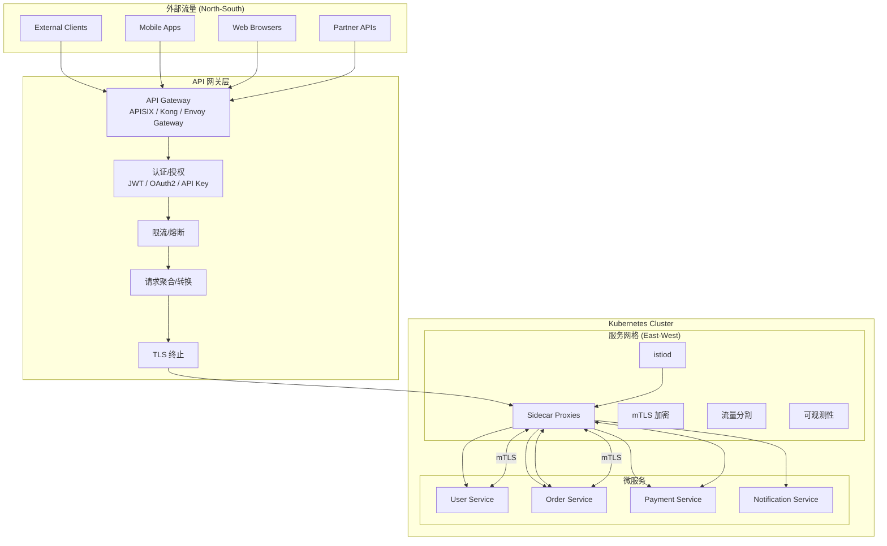
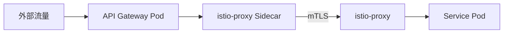
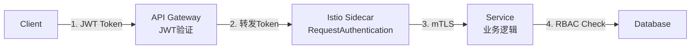

# API 网关与服务网格集成深度实践

> **最后更新**: 2026-04-24
> **适用版本**: APISIX 3.x / Kong 3.x / [[Istio|Istio]] v1.29 / Gateway API v1.2
> **难度**: 高级

---

<!-- chunk: 概述 -->## 概述

在微服务架构中，API 网关（南北向流量）和服务网格（东西向流量）共同构成了完整的流量治理体系。API 网关负责处理从外部客户端到集群内部服务的入口流量，包括认证、限流、协议转换、请求聚合等；服务网格则负责集群内部服务间的通信治理，包括 mTLS、流量分割、可观测性等。两者的有效集成是实现端到端流量治理的关键。

本文档从生产环境架构师的视角，深入探讨 API 网关（以 Apache APISIX 和 Kong 为代表）与服务网格（以 Istio 为代表）的集成模式、配置实践和最佳实践。覆盖三种主流集成模式：边车注入模式、独立网关模式、Gateway API 统一模式，以及认证/授权、限流、可观测性等关键能力的端到端配置。

## API 网关与服务网格定位



---

<!-- chunk: 一、集成架构模式 -->## 一、集成架构模式

## 1.1 模式一：边车注入网关

将 API 网关 Pod 纳入 Istio 服务网格，网关本身拥有 Sidecar 代理。这种模式的优点是网关与网格之间自动获得 mTLS 加密和统一可观测性，缺点是增加了网关的资源开销和配置复杂度。



```yaml
apiVersion: apps/v1
kind: Deployment
metadata:
  name: apisix-gateway
  namespace: ingress-apisix
  annotations:
    sidecar.istio.io/inject: "true"
spec:
  replicas: 3
  selector:
    matchLabels:
      app: apisix-gateway
  template:
    metadata:
      annotations:
        sidecar.istio.io/inject: "true"
        traffic.sidecar.istio.io/includeInboundPorts: "9080,9443"
        traffic.sidecar.istio.io/excludeOutboundPorts: "15020"
        proxy.istio.io/config: |
          proxyStatsMatcher:
            inclusionRegexps:
              - ".*upstream.*"
    spec:
      serviceAccountName: apisix-gateway
      containers:
        - name: apisix
          image: apache/apisix:3.11.0-debian
          ports:
            - name: http
              containerPort: 9080
            - name: https
              containerPort: 9443
            - name: admin
              containerPort: 9180
          resources:
            requests:
              cpu: "200m"
              memory: "256Mi"
            limits:
              cpu: "1000m"
              memory: "1Gi"
```

## 1.2 模式二：独立网关 + Istio ServiceEntry

API 网关不加入服务网格，通过 Istio ServiceEntry 将网关注册为外部流量源，然后在 AuthorizationPolicy 中控制网关到服务的访问权限。这种模式的优点是网关独立部署、运维简单，缺点是需要额外管理认证和证书。

```yaml
apiVersion: networking.istio.io/v1
kind: ServiceEntry
metadata:
  name: apisix-gateway-entry
  namespace: production
spec:
  hosts:
    - apisix-gateway.ingress-apisix.svc.cluster.local
  location: MESH_EXTERNAL
  ports:
    - name: http
      number: 9080
      protocol: HTTP
  resolution: DNS
---
apiVersion: security.istio.io/v1beta1
kind: AuthorizationPolicy
metadata:
  name: allow-from-gateway
  namespace: production
spec:
  action: ALLOW
  rules:
    - from:
        - source:
            namespaces: ["ingress-apisix"]
      to:
        - operation:
            methods: ["GET", "POST", "PUT", "DELETE"]
            paths: ["/api/*"]
```

## 1.3 模式三：Gateway API 统一管理 (推荐)

使用 Kubernetes Gateway API 作为统一接口，同时管理南北向和东西向流量。这是2026年最推荐的集成模式，提供标准化的 API 和多实现兼容性。

```yaml
apiVersion: gateway.networking.k8s.io/v1
kind: GatewayClass
metadata:
  name: istio-gateway-class
spec:
  controllerName: istio.io/gateway-controller
---
apiVersion: gateway.networking.k8s.io/v1
kind: Gateway
metadata:
  name: main-gateway
  namespace: production
  annotations:
    cert-manager.io/issuer: letsencrypt-prod
spec:
  gatewayClassName: istio-gateway-class
  listeners:
    - name: https
      protocol: HTTPS
      port: 443
      tls:
        mode: Terminate
        certificateRefs:
          - name: example-cert
      allowedRoutes:
        namespaces:
          from: All
    - name: http
      protocol: HTTP
      port: 80
      allowedRoutes:
        namespaces:
          from: All
---
apiVersion: gateway.networking.k8s.io/v1
kind: HTTPRoute
metadata:
  name: api-routes
  namespace: production
spec:
  parentRefs:
    - name: main-gateway
  hostnames:
    - "api.example.com"
  rules:
    - matches:
        - path:
            type: PathPrefix
            value: /api/users
      backendRefs:
        - name: user-service
          port: 8080
          weight: 90
        - name: user-service-canary
          port: 8080
          weight: 10
      filters:
        - type: RequestHeaderModifier
          requestHeaderModifier:
            add:
              - name: X-Gateway-Source
                value: "gateway-api"
    - matches:
        - path:
            type: PathPrefix
            value: /api/orders
      backendRefs:
        - name: order-service
          port: 8080
    - matches:
        - path:
            type: PathPrefix
            value: /api/payments
      backendRefs:
        - name: payment-service
          port: 8080
```

---

<!-- chunk: 二、Apache APISIX + Istio 集成 -->## 二、Apache APISIX + Istio 集成

## 2.1 APISIX 网关部署

```yaml
apiVersion: v1
kind: ConfigMap
metadata:
  name: apisix-config
  namespace: ingress-apisix
data:
  config.yaml: |
    apisix:
      node_listen: 9080
      ssl:
        listen: 9443
      enable_admin: true
      admin_key:
        - name: admin
          key: "secure-admin-key-change-me"
          role: admin
    etcd:
      host:
        - "http://apisix-etcd.ingress-apisix:2379"
      prefix: "/apisix"
    nginx_config:
      worker_processes: auto
      worker_rlimit_nofile: 65535
      event:
        worker_connections: 10620
      http:
        access_log: off
        lua_shared_dict:
          prometheus-metrics: 15m
    plugins:
      - jwt-auth
      - key-auth
      - basic-auth
      - consumer-restriction
      - limit-count
      - limit-req
      - limit-conn
      - proxy-cache
      - response-rewrite
      - grpc-transcode
      - ip-restriction
      - ua-restriction
      - referer-restriction
      - cors
      - request-id
      - zipkin
      - opentelemetry
      - prometheus
      - echo
      - fault-injection
    plugin_attr:
      prometheus:
        export_addr:
          ip: "0.0.0.0"
          port: 9091
      zipkin:
        endpoint: "http://zipkin.istio-system:9411/api/v2/spans"
        sample_ratio: 0.1
      opentelemetry:
        resource:
          service.name: "apisix-gateway"
        collector:
          address: "otel-collector.monitoring:4317"
          request_headers:
            Authorization: "Bearer token"
---
apiVersion: apps/v1
kind: Deployment
metadata:
  name: apisix
  namespace: ingress-apisix
spec:
  replicas: 3
  selector:
    matchLabels:
      app: apisix
  template:
    metadata:
      labels:
        app: apisix
      annotations:
        sidecar.istio.io/inject: "true"
    spec:
      containers:
        - name: apisix
          image: apache/apisix:3.11.0-debian
          volumeMounts:
            - name: config
              mountPath: /usr/local/apisix/conf/config.yaml
              subPath: config.yaml
          ports:
            - name: http
              containerPort: 9080
            - name: https
              containerPort: 9443
            - name: metrics
              containerPort: 9091
          resources:
            requests:
              cpu: "200m"
              memory: "256Mi"
            limits:
              cpu: "1000m"
              memory: "1Gi"
          livenessProbe:
            httpGet:
              path: /healthz
              port: 9091
            initialDelaySeconds: 15
            periodSeconds: 10
          readinessProbe:
            httpGet:
              path: /healthz
              port: 9091
            initialDelaySeconds: 5
            periodSeconds: 5
      volumes:
        - name: config
          configMap:
            name: apisix-config
```

## 2.2 APISIX 路由与插件配置

```yaml
apiVersion: apisix.apache.org/v2
kind: ApisixRoute
metadata:
  name: api-routes
  namespace: production
spec:
  http:
    - name: user-service-route
      match:
        paths:
          - /api/users/*
        methods:
          - GET
          - POST
          - PUT
          - DELETE
      backends:
        - serviceName: user-service
          servicePort: 8080
      plugins:
        - name: jwt-auth
          enable: true
        - name: limit-count
          enable: true
          config:
            count: 100
            time_window: 60
            key_type: var
            key: "remote_addr"
            rejected_code: 429
        - name: cors
          enable: true
          config:
            allow_origins: "https://app.example.com"
            allow_methods: "GET,POST,PUT,DELETE"
            allow_headers: "Authorization,Content-Type"
            max_age: 3600
        - name: proxy-rewrite
          enable: true
          config:
            headers:
              add:
                X-Source: "apisix-gateway"
                X-Request-ID: "$request_id"
    - name: order-service-route
      match:
        paths:
          - /api/orders/*
      backends:
        - serviceName: order-service
          servicePort: 8080
      plugins:
        - name: key-auth
          enable: true
        - name: limit-req
          enable: true
          config:
            rate: 50
            burst: 100
            key: "remote_addr"
            rejected_code: 429
```

## 2.3 APISIX 与 Istio mTLS 集成

```yaml
apiVersion: security.istio.io/v1beta1
kind: PeerAuthentication
metadata:
  name: apisix-mtls
  namespace: ingress-apisix
spec:
  selector:
    matchLabels:
      app: apisix
  mtls:
    mode: STRICT
  portLevelMtls:
    9080:
      mode: PERMISSIVE
    9443:
      mode: PERMISSIVE
---
apiVersion: networking.istio.io/v1
kind: DestinationRule
metadata:
  name: production-services
  namespace: production
spec:
  host: "*.production.svc.cluster.local"
  trafficPolicy:
    tls:
      mode: ISTIO_MUTUAL
```

---

<!-- chunk: 三、Kong Gateway + Istio 集成 -->## 三、Kong Gateway + Istio 集成

## 3.1 Kong 网关部署

```yaml
apiVersion: apps/v1
kind: Deployment
metadata:
  name: kong-gateway
  namespace: kong
  annotations:
    sidecar.istio.io/inject: "true"
spec:
  replicas: 3
  selector:
    matchLabels:
      app: kong-gateway
  template:
    metadata:
      annotations:
        sidecar.istio.io/inject: "true"
        traffic.sidecar.istio.io/includeInboundPorts: "8000,8443"
      labels:
        app: kong-gateway
    spec:
      containers:
        - name: kong
          image: kong:3.9
          env:
            - name: KONG_DATABASE
              value: "postgres"
            - name: KONG_PG_HOST
              value: "kong-postgres.kong"
            - name: KONG_PG_PASSWORD
              valueFrom:
                secretKeyRef:
                  name: kong-db-secret
                  key: password
            - name: KONG_PROXY_LISTEN
              value: "0.0.0.0:8000, 0.0.0.0:8443 ssl"
            - name: KONG_ADMIN_LISTEN
              value: "0.0.0.0:8001"
            - name: KONG_PLUGINS
              value: "bundled,jwt,rate-limiting,cors,request-transformer"
            - name: KONG_TRACING_INSTRUMENTATIONS
              value: "off"
          ports:
            - name: proxy
              containerPort: 8000
            - name: proxy-ssl
              containerPort: 8443
            - name: admin
              containerPort: 8001
          resources:
            requests:
              cpu: "500m"
              memory: "512Mi"
            limits:
              cpu: "2000m"
              memory: "2Gi"
```

## 3.2 Kong 服务与路由配置

```bash
curl -X POST http://kong-admin:8001/services \
  -d "name=user-service" \
  -d "url=http://user-service.production.svc.cluster.local:8080" \
  -d "connect_timeout=5000" \
  -d "write_timeout=5000" \
  -d "read_timeout=5000" \
  -d "retries=3"

curl -X POST http://kong-admin:8001/services/user-service/routes \
  -d "name=user-route" \
  -d "paths[]=/api/users" \
  -d "strip_path=false"

curl -X POST http://kong-admin:8001/services/user-service/plugins \
  -d "name=rate-limiting" \
  -d "config.minute=100" \
  -d "config.hour=5000" \
  -d "config.policy=redis" \
  -d "config.redis_host=redis.kong"

curl -X POST http://kong-admin:8001/services/user-service/plugins \
  -d "name=jwt" \
  -d "config.uri_param_names=jwt" \
  -d "config.claims_to_verify=exp"

curl -X POST http://kong-admin:8001/services/user-service/plugins \
  -d "name=cors" \
  -d "config.origins=https://app.example.com" \
  -d "config.methods=GET,POST,PUT,DELETE" \
  -d "config.headers=Authorization,Content-Type"
```

## 3.3 Kong + Istio 授权策略

```yaml
apiVersion: security.istio.io/v1beta1
kind: AuthorizationPolicy
metadata:
  name: allow-kong-gateway
  namespace: production
spec:
  action: ALLOW
  rules:
    - from:
        - source:
            principals: ["cluster.local/ns/kong/sa/kong-gateway"]
      to:
        - operation:
            methods: ["GET", "POST", "PUT", "DELETE"]
            paths: ["/api/*"]
---
apiVersion: security.istio.io/v1beta1
kind: AuthorizationPolicy
metadata:
  name: deny-direct-access
  namespace: production
spec:
  action: DENY
  rules:
    - from:
        - source:
            notNamespaces: ["kong", "istio-system", "production"]
```

---

<!-- chunk: 四、认证/授权端到端集成 -->## 四、认证/授权端到端集成

## 4.1 JWT 认证链路



## 4.2 端到端认证配置

```yaml
apiVersion: security.istio.io/v1beta1
kind: RequestAuthentication
metadata:
  name: jwt-authentication
  namespace: production
spec:
  selector:
    matchLabels:
      istio-injection: enabled
  jwtRules:
    - issuer: "https://auth.example.com"
      jwksUri: "https://auth.example.com/.well-known/jwks.json"
      audiences:
        - "api.example.com"
      forwardOriginalToken: true
---
apiVersion: security.istio.io/v1beta1
kind: AuthorizationPolicy
metadata:
  name: require-jwt-and-gateway
  namespace: production
spec:
  action: ALLOW
  rules:
    - from:
        - source:
            namespaces: ["kong"]
            requestPrincipals: ["*"]
      to:
        - operation:
            methods: ["GET", "POST", "PUT", "DELETE"]
```

---

<!-- chunk: 五、可观测性集成 -->## 五、可观测性集成

## 5.1 端到端追踪配置

```yaml
apiVersion: telemetry.istio.io/v1alpha1
kind: Telemetry
metadata:
  name: default-tracing
  namespace: istio-system
spec:
  tracing:
    - providers:
        - name: otel-collector
      randomSamplingPercentage: 10.0
  accessLogging:
    - providers:
        - name: otel-collector
---
apiVersion: apisix.apache.org/v2
kind: ApisixRoute
metadata:
  name: tracing-route
spec:
  http:
    - name: traced-route
      match:
        paths:
          - /api/*
      backends:
        - serviceName: user-service
          servicePort: 8080
      plugins:
        - name: opentelemetry
          enable: true
          config:
            sampler:
              name: "always_on"
            resource:
              service.name: "apisix-gateway"
```

## 5.2 统一监控面板

```yaml
apiVersion: monitoring.coreos.com/v1
kind: ServiceMonitor
metadata:
  name: apisix-metrics
  namespace: ingress-apisix
spec:
  selector:
    matchLabels:
      app: apisix
  endpoints:
    - port: metrics
      path: /apisix/prometheus/metrics
      interval: 15s
---
apiVersion: monitoring.coreos.com/v1
kind: ServiceMonitor
metadata:
  name: istio-proxy-metrics
  namespace: istio-system
spec:
  selector:
    matchLabels:
      istio.io/rev: default
  namespaceSelector:
    any: true
  endpoints:
    - port: http-envoy-prom
      path: /stats/prometheus
      interval: 15s
```

## 5.3 关键集成指标

```promql
rate(apisix_http_requests_total[1m])
rate(istio_requests_total{source_app="apisix-gateway"}[1m])
histogram_quantile(0.99, rate(istio_request_duration_milliseconds_bucket{source_app="apisix-gateway"}[1m]))
sum(apisix_nginx_http_current_connections{state="active"})
rate(apisix_http_requests_total{status=~"5.."}[1m]) / rate(apisix_http_requests_total[1m])
```

## 5.4 集成告警规则

```yaml
apiVersion: monitoring.coreos.com/v1
kind: PrometheusRule
metadata:
  name: gateway-mesh-integration-alerts
  namespace: monitoring
spec:
  groups:
    - name: gateway-mesh.rules
      rules:
        - alert: GatewayHighErrorRate
          expr: |
            rate(apisix_http_requests_total{status=~"5.."}[5m]) /
            rate(apisix_http_requests_total[5m]) > 0.05
          for: 3m
          labels:
            severity: warning
          annotations:
            summary: "API gateway error rate above 5%"
            description: "The API gateway (APISIX) is returning 5xx errors at a rate above 5%. Check upstream service health and gateway logs."

        - alert: GatewayToMeshLatencyHigh
          expr: |
            histogram_quantile(0.99, rate(istio_request_duration_milliseconds_bucket{source_app="apisix-gateway"}[5m])) > 2000
          for: 5m
          labels:
            severity: warning
          annotations:
            summary: "High latency from API gateway to mesh services"
            description: "The P99 latency from API gateway to backend services exceeds 2 seconds. Check for upstream service degradation."

        - alert: GatewayConnectionPoolExhaustion
          expr: |
            sum(apisix_nginx_http_current_connections{state="waiting"}) > 5000
          for: 3m
          labels:
            severity: critical
          annotations:
            summary: "API gateway connection pool near exhaustion"
            description: "The API gateway has more than 5000 waiting connections. Consider scaling the gateway deployment."

        - alert: MeshSidecarInjectionMissing
          expr: |
            sum by (namespace) (kube_pod_container_info{container="istio-proxy"}) /
            sum by (namespace) (kube_pod_info{namespace=~"production|staging"}) < 0.9
          for: 10m
          labels:
            severity: warning
          annotations:
            summary: "Some pods in {{ $labels.namespace }} are missing Istio sidecar injection"
            description: "Less than 90% of pods in namespace {{ $labels.namespace }} have the Istio sidecar proxy. Check injection labels."
```

---

<!-- chunk: 六、限流端到端集成 -->## 六、限流端到端集成

## 6.1 分层限流策略

```yaml
限流分层:
  第一层 - API 网关 (APISIX/Kong):
    - 全局限流: 保护整个系统
    - 用户级限流: 保护免滥用
    - API 级限流: 保护后端服务
    - 配置: 插件级别, 易于调整

  第二层 - 服务网格 (Istio):
    - 服务级限流: 保护单个服务
    - 连接池限制: 防止资源耗尽
    - 配置: DestinationRule 级别

  第三层 - 应用层 (Resilience4j):
    - 方法级限流: 精细控制
    - 业务逻辑限流: 业务感知
    - 配置: 代码/配置级别

配置原则:
  - 外层限流阈值 > 内层
  - 错误码统一: 429 Too Many Requests
  - 限流响应包含 Retry-After 头
  - 监控三层限流触发情况
```

## 6.2 限流阈值设计参考表

| 层级 | 范围 | 阈值参考 | 实现方式 |
|:---|:---|:---|:---|
| API Gateway 全局 | 集群入口 | 10000 req/s | APISIX limit-count / Kong rate-limiting |
| API Gateway 用户级 | 每用户/IP | 100 req/min | APISIX limit-req / Kong rate-limiting |
| API Gateway API级 | 每API端点 | 500 req/s | APISIX limit-count per-route |
| Istio 服务级 | 每服务 | 2000 req/s | EnvoyFilter + rate-limit service |
| Istio 连接池 | 每实例 | 100 connections | DestinationRule connectionPool |
| Resilience4j 方法级 | 每方法 | 100 req/s | @RateLimiter annotation |
| Resilience4j 外部API | 每外部API | 10 req/s | @RateLimiter external-api instance |

---

<!-- chunk: 七、故障排查 -->## 七、故障排查

## 7.1 集成故障排查命令

> ⚠️ **🟡 中危变更** — 变更集群资源状态，建议先 --dry-run 或 diff 确认
> - `kubectl exec`：进入容器执行命令，可能改变容器状态

```bash
#!/bin/bash

echo "=== API 网关健康检查 ==="
kubectl get pods -n ingress-apisix -o wide
kubectl logs -n ingress-apisix deploy/apisix --tail=50 | grep -i error

echo "=== Istio Sidecar 检查 ==="
istioctl proxy-status
istioctl proxy-config cluster deploy/apisix -n ingress-apisix

echo "=== 连通性测试 ==="
kubectl exec -n ingress-apisix deploy/apisix -- curl -s http://user-service.production:8080/health

echo "=== mTLS 验证 ==="
istioctl analyze -n production

echo "=== 认证策略检查 ==="
kubectl get requestauthentication -A
kubectl get authorizationpolicy -A

echo "=== 证书检查 ==="
kubectl get secrets -n istio-system | grep cacerts

echo "=== 流量追踪 ==="
kubectl exec -n production deploy/sleep -- curl -v http://user-service:8080/health
```

## 7.2 网关日志分析输出

```bash
$ kubectl logs -n ingress-apisix deploy/apisix --tail=10

2026/04/24 10:00:01 [info] 42#42: *123456 client 10.0.1.5 connected to 0.0.0.0:9080
2026/04/24 10:00:01 [info] 42#42: *123456 [lua] jwt-auth.lua:241: phase_func(): jwt auth validated successfully for user user-123
2026/04/24 10:00:01 [warn] 42#42: *123457 [lua] limit-count.lua:146: phase_func(): request rejected, limit count exceeded for key 10.0.1.5, limit: 100, window: 60
2026/04/24 10:00:02 [error] 42#42: *123458 [lua] proxy.lua:310: pass(): failed to connect to upstream user-service.production:8080, error: connection refused
2026/04/24 10:00:03 [info] 42#42: *123459 client sent HTTP/2 request with headers: method=GET, path=/api/users/123, host=api.example.com
2026/04/24 10:00:03 [info] 42#42: *123459 upstream response: status=200, bytes=2048, time=0.015
2026/04/24 10:00:05 [warn] 42#42: *123460 [lua] cors.lua:89: phase_func(): CORS origin not allowed: https://evil.example.com
2026/04/24 10:00:06 [info] 42#42: *123461 opentelemetry trace propagated: trace_id=abc123, span_id=def456
```

## 7.3 常见问题

| 问题 | 原因 | 解决 |
|:---|:---|:---|
| 网关 503 | 网关无法连接后端 | 检查 Sidecar 注入和 mTLS 模式 |
| 双重认证 | 网关和 Istio 都验证 JWT | 只在一层验证，另一层透传 |
| 追踪断裂 | 追踪头未透传 | 确保网关配置 trace 透传 |
| 限流冲突 | 网关和网格都限流 | 分层限流，阈值外大内小 |
| mTLS 失败 | 网关未注入 Sidecar | 注入 Sidecar 或使用 PERMISSIVE |
| 延迟过高 | Sidecar 嵌套 | 考虑独立网关模式 |
| 网关内存泄漏 | 连接泄漏 | 检查 keepalive_timeout 和 upstream 配置 |
| 路由不匹配 | APISIX route 配置错误 | 检查 ApisixRoute 的 paths 和 methods |

---

<!-- chunk: 八、最佳实践 -->## 八、最佳实践

## 8.1 集成选型建议

```yaml
小团队 (< 30 服务):
  推荐: Istio Ingress Gateway (内置)
  原因: 最简架构，无需额外组件

中型团队 (30-100 服务):
  推荐: APISIX + Istio (模式一或三)
  原因: APISIX 性能优异、插件丰富

大型团队 (> 100 服务):
  推荐: Kong + Istio (模式二或三)
  原因: Kong 企业功能完善、API 管理成熟

新项目:
  推荐: Gateway API 统一模式 (模式三)
  原因: 标准化、可移植、面向未来
```

## 8.2 安全最佳实践

```yaml
安全检查清单:
  - [ ] 网关到服务间启用 mTLS
  - [ ] 外部流量仅通过网关进入
  - [ ] AuthorizationPolicy 限制直接访问
  - [ ] JWT 验证在网关或 Istio 层执行 (二选一)
  - [ ] 限流策略端到端配置
  - [ ] 证书自动轮换已启用
  - [ ] 审计日志已启用
  - [ ] 敏感路径 (admin/debug) 已屏蔽
```

---

<!-- chunk: 九、APISIX 高级插件配置 -->## 九、APISIX 高级插件配置

## 9.1 认证插件组合

在 API 网关层实现多层认证策略是保护后端微服务的关键。以下配置展示了如何在 APISIX 中组合使用 JWT 认证、API Key 认证和 IP 白名单，实现细粒度的访问控制。对于公开 API（如移动端接口），使用 JWT 认证验证用户身份；对于内部服务间调用，使用 API Key 认证；对于管理接口，同时要求 IP 白名单和 API Key 双重验证。

```yaml
apiVersion: apisix.apache.org/v2
kind: ApisixRoute
metadata:
  name: auth-routes
  namespace: production
spec:
  http:
    - name: public-api-route
      match:
        paths:
          - /api/v1/public/*
        methods:
          - GET
      backends:
        - serviceName: public-service
          servicePort: 8080
      plugins:
        - name: jwt-auth
          enable: true
          config:
            key: "user-key"
            secret: "your-jwt-secret-key-here"
            algorithm: "HS256"
        - name: limit-count
          enable: true
          config:
            count: 200
            time_window: 60
            key_type: var
            key: "consumer_name"
            rejected_code: 429
            rejected_msg: "Rate limit exceeded. Please retry after a moment."

    - name: internal-api-route
      match:
        paths:
          - /api/v1/internal/*
        methods:
          - GET
          - POST
      backends:
        - serviceName: internal-service
          servicePort: 8080
      plugins:
        - name: key-auth
          enable: true
          config:
            header: "X-API-Key"
            query: "api_key"
        - name: ip-restriction
          enable: true
          config:
            allowlist:
              - "10.0.0.0/8"
              - "172.16.0.0/12"
              - "192.168.0.0/16"

    - name: admin-api-route
      match:
        paths:
          - /api/v1/admin/*
        methods:
          - GET
          - POST
          - PUT
          - DELETE
      backends:
        - serviceName: admin-service
          servicePort: 8080
      plugins:
        - name: key-auth
          enable: true
        - name: ip-restriction
          enable: true
          config:
            allowlist:
              - "10.0.1.0/24"
              - "10.0.2.0/24"
        - name: response-rewrite
          enable: true
          config:
            headers:
              remove:
                - "X-Powered-By"
                - "Server"
```

## 9.2 gRPC 协议转码

APISIX 支持通过 grpc-transcode 插件将 RESTful JSON 请求转码为 gRPC 调用，使得后端 gRPC 服务可以同时为 Web 和移动端提供服务。以下配置展示了如何将 REST API 路径映射到 gRPC 方法，并自动进行 JSON ↔ Protobuf 的转换。

```yaml
apiVersion: apisix.apache.org/v2
kind: ApisixRoute
metadata:
  name: grpc-transcode-route
  namespace: production
spec:
  http:
    - name: grpc-user-service
      match:
        paths:
          - /grpc/users/*
      backends:
        - serviceName: grpc-user-service
          servicePort: 9090
      plugins:
        - name: grpc-transcode
          enable: true
          config:
            proto_id: "user-service-proto"
            service: "user.UserService"
            method: "GetUser"
            deadline: 10
```

---

<!-- chunk: 十、端到端流量追踪验证 -->## 十、端到端流量追踪验证

## 10.1 追踪链路完整性测试

确保从客户端到 API 网关、经过 Istio Sidecar、再到后端微服务的完整追踪链路不中断是端到端可观测性的关键。以下脚本通过发送测试请求并检查 [[Jaeger|Jaeger]]/Tempo 中的追踪数据，验证各层的 trace context 传播是否正确。

```bash
#!/bin/bash
echo "=== 端到端追踪验证 ==="

TRACE_ID="test-trace-$(date +%s)"

echo "--- Step 1: 发送带 trace header 的请求 ---"
curl -s -X GET http://api.example.com/api/users/1 \
  -H "traceparent: 00-${TRACE_ID}-1234567890abcdef-01" \
  -H "Authorization: Bearer test-jwt-token" \
  -w "\nHTTP Status: %{http_code}, Time: %{time_total}s\n"

echo "--- Step 2: 查询 Jaeger 中的追踪数据 ---"
JAEGER_RESPONSE=$(curl -s "http://jaeger.istio-system:16686/api/traces/${TRACE_ID}")
SPAN_COUNT=$(echo "$JAEGER_RESPONSE" | jq '.data[0].spans | length')
echo "Trace spans found: $SPAN_COUNT (expected >= 4: gateway, sidecar-in, sidecar-out, service)"

echo "--- Step 3: 验证各层 span 是否存在 ---"
SERVICES=$(echo "$JAEGER_RESPONSE" | jq -r '.data[0].spans[].serviceName' | sort -u)
echo "Services in trace chain:"
echo "$SERVICES"

for svc in "apisix-gateway" "istio-proxy" "user-service"; do
  if echo "$SERVICES" | grep -q "$svc"; then
    echo "PASS: $svc found in trace"
  else
    echo "FAIL: $svc NOT found in trace (possible trace context propagation issue)"
  fi
done

echo "--- Step 4: 验证 span 间的父子关系 ---"
echo "$JAEGER_RESPONSE" | jq '.data[0].spans[] | {name: .operationName, service: .serviceName, parentID: .parentSpanID}' | head -20

echo "Trace verification completed"
```

---

<!-- chunk: 参考链接 -->## 参考链接

- [Apache APISIX 官方文档](https://apisix.apache.org/docs/)
- [Kong 官方文档](https://docs.konghq.com/)
- [Istio Gateway API 集成](https://istio.io/latest/docs/tasks/traffic-management/ingress/gateway-api/)
- [Gateway API 规范](https://gateway-api.sigs.k8s.io/)
- [Envoy Gateway 项目](https://gateway.envoyproxy.io/)

---

<!-- chunk: 十一、API 网关高可用部署策略 -->## 十一、API 网关高可用部署策略

## APISIX 高可用架构

在生产环境中，API 网关是所有外部流量的入口点，其可用性直接影响整个系统的可用性。APISIX 的高可用架构包含以下关键设计：第一，部署 3 个或更多 APISIX 网关副本，通过 Kubernetes Service 的 LoadBalancer 类型暴露服务，云厂商的负载均衡器会自动进行健康检查和流量分配；第二，使用 etcd 集群（至少 3 节点）作为配置存储，确保配置数据的强一致性和高可用性；第三，配置 Pod 反亲和性规则，确保网关副本分布在不同节点上，防止单节点问题导致所有网关实例不可用；第四，配置 HPA 自动扩缩容，基于 CPU 和内存指标动态调整网关副本数量。

## Kong 高可用架构

Kong Gateway 的高可用部署与 APISIX 类似，但有一些特有差异。Kong 支持两种数据库模式：传统的 PostgreSQL 模式（适合需要完整 API 管理功能的场景）和 DB-less 声明式模式（适合追求极致性能和简化的场景）。在 PostgreSQL 模式下，需要确保数据库的高可用性——推荐使用 Patroni 或 CloudSQL 等托管数据库服务。在 DB-less 模式下，Kong 的配置通过 Kubernetes CRD 或声明式 YAML 文件管理，不依赖外部数据库，适合 GitOps 驱动的部署流程。

## 网关健康检查配置

```yaml
apiVersion: v1
kind: Service
metadata:
  name: apisix-gateway
  namespace: ingress-apisix
  annotations:
    service.beta.kubernetes.io/aws-load-balancer-type: "nlb"
    service.beta.kubernetes.io/aws-load-balancer-healthcheck-protocol: "HTTP"
    service.beta.kubernetes.io/aws-load-balancer-healthcheck-port: "9091"
    service.beta.kubernetes.io/aws-load-balancer-healthcheck-path: "/healthz"
    service.beta.kubernetes.io/aws-load-balancer-healthcheck-interval: "10"
    service.beta.kubernetes.io/aws-load-balancer-healthcheck-healthy-threshold: "2"
    service.beta.kubernetes.io/aws-load-balancer-healthcheck-unhealthy-threshold: "3"
spec:
  type: LoadBalancer
  selector:
    app: apisix
  ports:
    - name: http
      port: 80
      targetPort: 9080
    - name: https
      port: 443
      targetPort: 9443
```

## 网关自动扩缩容配置

```yaml
apiVersion: autoscaling/v2
kind: HorizontalPodAutoscaler
metadata:
  name: apisix-hpa
  namespace: ingress-apisix
spec:
  scaleTargetRef:
    apiVersion: apps/v1
    kind: Deployment
    name: apisix
  minReplicas: 3
  maxReplicas: 20
  metrics:
    - type: Resource
      resource:
        name: cpu
        target:
          type: Utilization
          averageUtilization: 60
    - type: Resource
      resource:
        name: memory
        target:
          type: Utilization
          averageUtilization: 70
    - type: Pods
      pods:
        metric:
          name: apisix_http_requests_per_second
        target:
          type: AverageValue
          averageValue: "5000"
  behavior:
    scaleUp:
      stabilizationWindowSeconds: 60
      policies:
        - type: Pods
          value: 2
          periodSeconds: 60
    scaleDown:
      stabilizationWindowSeconds: 300
      policies:
        - type: Pods
          value: 1
          periodSeconds: 120
```

---

<!-- chunk: 十二、Gateway API 多团队协作模式 -->## 十二、Gateway API 多团队协作模式

## 多团队 Gateway 管理策略

在大型企业中，API 网关和服务网格的配置通常涉及多个团队：平台团队负责管理 Gateway 基础设施，应用团队负责配置路由和后端服务。Gateway API 通过 RBAC 和 ReferenceGrant 机制实现了多团队安全协作。平台团队可以创建和配置 Gateway 资源，应用团队可以在自己的命名空间中创建 HTTPRoute 资源并附加到共享 Gateway 上。ReferenceGrant 资源用于控制跨命名空间引用的权限，确保应用团队只能将路由附加到被授权的 Gateway 上。

```yaml
apiVersion: gateway.networking.k8s.io/v1beta1
kind: ReferenceGrant
metadata:
  name: allow-team-alpha-to-gateway
  namespace: production
spec:
  from:
    - group: gateway.networking.k8s.io
      kind: HTTPRoute
      namespace: team-alpha
  to:
    - group: gateway.networking.k8s.io
      kind: Gateway
      name: main-gateway
---
apiVersion: gateway.networking.k8s.io/v1beta1
kind: ReferenceGrant
metadata:
  name: allow-team-beta-to-gateway
  namespace: production
spec:
  from:
    - group: gateway.networking.k8s.io
      kind: HTTPRoute
      namespace: team-beta
  to:
    - group: gateway.networking.k8s.io
      kind: Gateway
      name: main-gateway
```

---

<!-- chunk: Obsidian 相关文档 -->## Obsidian 相关文档

- domain-03-networking-traffic MOC
- [[domain-03-networking-traffic/README.md|Domain 03: 企业级服务网格与微服务治理 (Enterprise Service Mesh & Microser...]]
- Domain-26 服务网格与微服务 — 开源项目索引
- Istio 企业级服务网格架构与实践
- Linkerd 企业级服务网格深度实践
- Consul Connect 企业级服务网格管理
- Envoy Proxy 企业级服务网格数据平面深度实践
- Dapr (Distributed Application Runtime) Enterprise 深度实践
- Traefik Mesh Enterprise Service Mesh 深度实践
- 服务网格对比与选型决策指南
- Istio Ambient Mesh 与 L7 策略深度实践
- 微服务弹性模式深度实践 — Circuit Breaker, Retry, Timeout, Bulkhead, Rat...

## See Also

- 08-ambient-mesh-l7-policy
- 09-microservice-resilience-patterns
- 99-istio-service-mesh-guide
- 99-linkerd-service-mesh-guide
