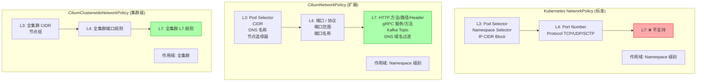
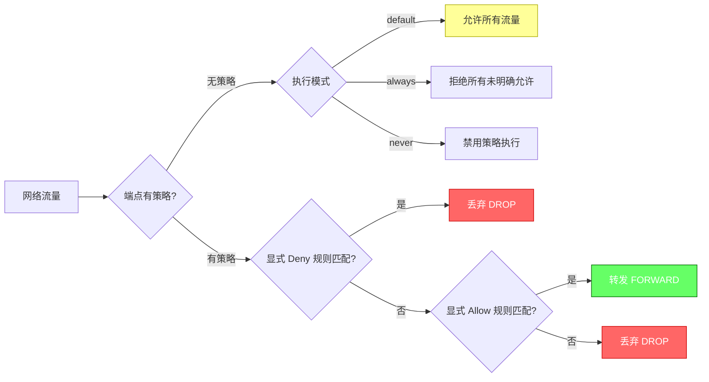
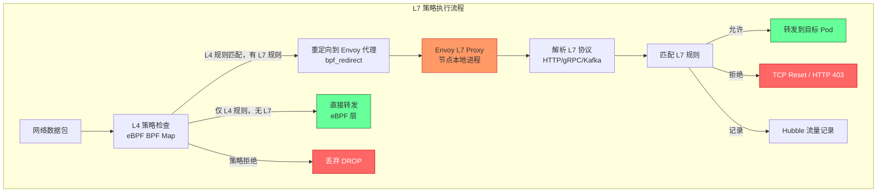
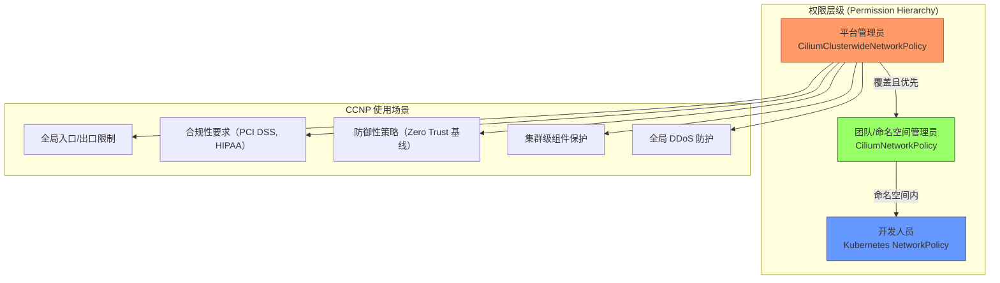
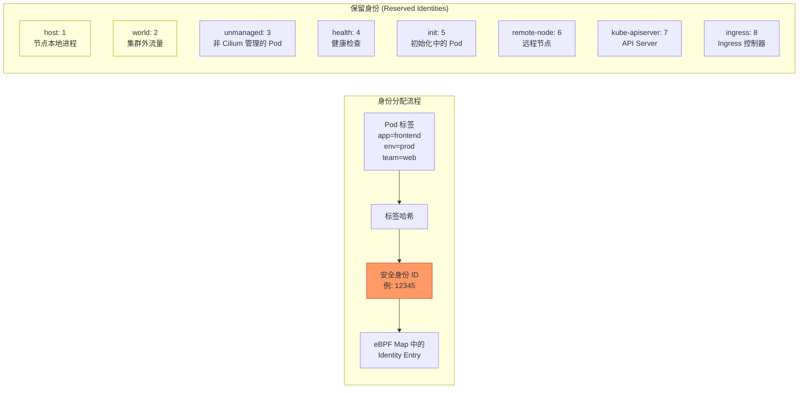
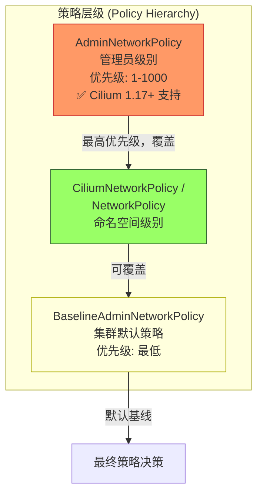
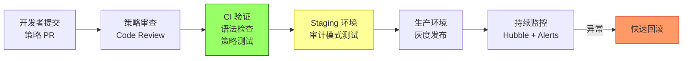
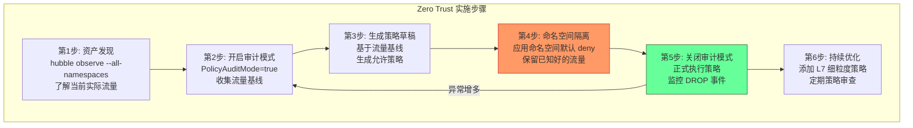

title: [[Cilium|Cilium]] 网络策略 L3/L4/L7 (Cilium Network Policy L3/L4/L7)
description: '# Cilium 网络策略 L3/L4/L7 (Cilium Network Policy L3/L4/L7)'
category: ebpf-technology
tags:
- k8s
- ebpf
- cilium
- networking
- observability
- [[etcd|etcd]]
- apiserver
- kubelet
- prometheus
- envoy
last_updated: 2026-05
difficulty: expert
reading_level: expert
audience:
- SRE
- 网络工程师
- 内核工程师
estimated_read_time: 5min
intent_queries:
- Cilium 网络策略 L3/L4/L7 (Cilium Network Policy L3/L4/L7) 是什么
- 如何 Cilium 网络策略 L3/L4/L7 (Cilium Network Policy L3/L4/L7)
- Kubernetes 35 ebpf technology 最佳实践
trigger_keywords:
- Cilium
- 网络策略
- L3
- L4
- L7
- Cilium
- Network
- Policy
cross_refs:
- type: fta
  path: ../domain-10-troubleshooting-diagnostics/topic-fta/list/cilium-fta.md
  label: '故障树: cilium'
authors:
- name: KUDIG Team
  role: contributor
k8s_versions:
- '1.28'
- '1.29'
- '1.30'
- '1.31'
- '1.32'
---

# Cilium 网络策略 L3/L4/L7 (Cilium Network Policy L3/L4/L7)

> **文档版本**: v1.0 | **适用版本**: Cilium 1.15/1.16/1.17 | **更新时间**: 2026-03  
> **策略层级**: L3 (IP/CIDR) → L4 (Port/Protocol) → L7 (HTTP/gRPC/Kafka/DNS)

---

<!-- chunk: 目录 (Table of Contents) -->## 目录 (Table of Contents)

1. [Kubernetes NetworkPolicy vs CiliumNetworkPolicy](#1-kubernetes-networkpolicy-vs-ciliumnetworkpolicy)
2. [L3 策略 - IP/CIDR 规则](#2-l3-策略---ipcidr-规则)
3. [L4 策略 - 端口/协议规则](#3-l4-策略---端口协议规则)
4. [L7 策略详解](#4-l7-策略详解)
5. [CiliumClusterwideNetworkPolicy](#5-ciliumclusterwidenetworkpolicy)
6. [基于身份 (Identity) 的策略](#6-基于身份-identity-的策略)
7. [策略可视化与审计](#7-策略可视化与审计)
8. [AdminNetworkPolicy 集成](#8-adminnetworkpolicy-集成)
9. [策略优先级与冲突处理](#9-策略优先级与冲突处理)
10. [企业级策略管理最佳实践](#10-企业级策略管理最佳实践)

---

<!-- chunk: 1. Kubernetes NetworkPolicy vs CiliumNetworkPolicy -->## 1. Kubernetes NetworkPolicy vs CiliumNetworkPolicy

## 1.1 策略能力对比 (Policy Capability Comparison)



## 1.2 策略模型的核心差异 (Core Differences)

| 特性 | Kubernetes NetworkPolicy | CiliumNetworkPolicy |
|------|--------------------------|---------------------|
| L7 策略支持 | ❌ 不支持 | ✅ HTTP/gRPC/Kafka/DNS |
| 策略作用域 | Namespace 内 | Namespace 或全集群 |
| 基于 DNS 的规则 | ❌ | ✅ FQDN 匹配 |
| 端口范围 | ❌ (只能单端口) | ✅ 支持范围 |
| 拒绝规则 (Deny) | ❌ (只有白名单) | ✅ 显式 deny |
| 节点访问控制 | ❌ | ✅ Node Selector |
| 策略追踪调试 | ❌ | ✅ cilium policy trace |
| 跨集群策略 | ❌ | ✅ Cluster Mesh |

## 1.3 CiliumNetworkPolicy CRD 结构 (CRD Structure)

```yaml
apiVersion: "cilium.io/v2"
kind: CiliumNetworkPolicy
metadata:
  name: example-policy
  namespace: default
spec:
  # 选择这个策略的目标端点（Pod 选择器）
  endpointSelector:
    matchLabels:
      app: backend
    matchExpressions:
    - key: version
      operator: In
      values: ["v1", "v2"]
  
  # 入站规则（Ingress）：谁可以访问此 Pod
  ingress:
  - fromEndpoints:    # 来自哪些 Pod
    - matchLabels:
        app: frontend
    fromCIDR:         # 来自哪些 CIDR
    - "10.0.0.0/8"
    fromCIDRSet:      # 来自 CIDR（可排除子网）
    - cidr: "172.16.0.0/12"
      except:
      - "172.16.0.0/16"
    fromEntities:     # 来自特殊实体
    - world            # 来自集群外
    - host             # 来自节点
    fromRequires:     # AND 条件（所有 from 条件都需满足）
    - matchLabels:
        env: production
    toPorts:          # 允许的端口
    - ports:
      - port: "8080"
        protocol: TCP
      rules:          # L7 规则（可选）
        http:
        - method: GET
          path: "/api/.*"
  
  # 出站规则（Egress）：此 Pod 可以访问哪里
  egress:
  - toEndpoints:
    - matchLabels:
        app: database
    toPorts:
    - ports:
      - port: "5432"
        protocol: TCP
  
  # 入站拒绝规则（优先级高于 ingress）
  ingressDeny:
  - fromEndpoints:
    - matchLabels:
        malicious: "true"
  
  # 出站拒绝规则
  egressDeny:
  - toEndpoints:
    - matchLabels:
        app: restricted
```

## 1.4 策略执行模型 (Policy Enforcement Model)



```bash
# 查看当前策略执行模式
cilium config | grep PolicyEnforcement

# 修改执行模式
cilium config PolicyEnforcement=always   # 强制执行所有策略
cilium config PolicyEnforcement=default  # 有策略才执行
cilium config PolicyEnforcement=never    # 禁用
```

---

<!-- chunk: 2. L3 策略 - IP/CIDR 规则 -->## 2. L3 策略 - IP/CIDR 规则

## 2.1 基于 Pod 标签的 L3 规则 (Pod Selector Rules)

```yaml
# 场景：只允许 frontend Pod 访问 backend Pod

apiVersion: "cilium.io/v2"
kind: CiliumNetworkPolicy
metadata:
  name: backend-access-policy
  namespace: production
spec:
  endpointSelector:
    matchLabels:
      app: backend
      tier: api
  
  ingress:
  # 规则 1: 允许同 namespace 的 frontend Pod 访问
  - fromEndpoints:
    - matchLabels:
        app: frontend
  
  # 规则 2: 允许 monitoring namespace 的 prometheus 访问（scrape metrics）
  - fromEndpoints:
    - matchLabels:
        app: prometheus
      # 注意: fromEndpoints 的 matchLabels 在 Cilium 中默认包含 namespace 标签
      # 如果要跨 namespace，需要添加 namespace selector
    
  # 规则 3: 来自同一 namespace 标签选择
  - fromEndpoints:
    - matchExpressions:
      - key: "io.kubernetes.pod.namespace"
        operator: In
        values:
        - monitoring
        - observability
      matchLabels:
        app: prometheus
```

## 2.2 基于 Namespace 的 L3 规则

```yaml
# 场景：允许特定 namespace 的所有 Pod 访问

apiVersion: "cilium.io/v2"
kind: CiliumNetworkPolicy
metadata:
  name: cross-namespace-policy
  namespace: backend
spec:
  endpointSelector:
    matchLabels:
      app: api-server
  
  ingress:
  # 允许来自 frontend namespace 的所有 Pod
  - fromEndpoints:
    - matchLabels:
        io.kubernetes.pod.namespace: frontend
  
  # 允许来自有特定标签的 namespace（通过 namespace 标签）
  - fromEndpoints:
    - matchLabels:
        io.kubernetes.pod.namespace.labels.team: platform
  
  # 允许来自 kube-system 的健康检查
  - fromEndpoints:
    - matchLabels:
        io.kubernetes.pod.namespace: kube-system
        k8s-app: kube-proxy
```

## 2.3 基于 CIDR 的 L3 规则

```yaml
# 场景 1: 只允许特定 IP 段访问（外部访问控制）

apiVersion: "cilium.io/v2"
kind: CiliumNetworkPolicy
metadata:
  name: cidr-ingress-policy
  namespace: default
spec:
  endpointSelector:
    matchLabels:
      app: internal-api
  
  ingress:
  # 允许公司内网访问
  - fromCIDR:
    - "10.0.0.0/8"      # 内网
    - "172.16.0.0/12"   # VPN
    - "192.168.0.0/16"  # 本地
  
  # 允许特定外部 IP（如 CI/CD 系统）
  - fromCIDR:
    - "203.0.113.10/32"   # Jenkins
    - "203.0.113.20/32"   # GitHub Actions runner
---
# 场景 2: 外出访问限制（防止 SSRF，数据外泄）

apiVersion: "cilium.io/v2"
kind: CiliumNetworkPolicy
metadata:
  name: cidr-egress-policy
  namespace: default
spec:
  endpointSelector:
    matchLabels:
      app: user-service
  
  egress:
  # 允许访问内部服务
  - toCIDR:
    - "10.0.0.0/8"
  
  # 允许访问特定外部服务 IP（如支付 API）
  - toCIDR:
    - "54.239.28.0/24"  # payment-provider.com IP 段
  
  # 允许 DNS 查询
  - toEndpoints:
    - matchLabels:
        io.kubernetes.pod.namespace: kube-system
        k8s-app: kube-dns
    toPorts:
    - ports:
      - port: "53"
        protocol: UDP
---
# 场景 3: CIDR 排除（允许大段但排除特定子网）

apiVersion: "cilium.io/v2"
kind: CiliumNetworkPolicy
metadata:
  name: cidr-except-policy
  namespace: default
spec:
  endpointSelector:
    matchLabels:
      app: web-scraper
  
  egress:
  - toCIDRSet:
    - cidr: "0.0.0.0/0"    # 允许访问所有 IP
      except:
      - "10.0.0.0/8"        # 但排除内网
      - "172.16.0.0/12"     # 排除 VPN
      - "192.168.0.0/16"    # 排除本地
      - "169.254.0.0/16"    # 排除链路本地（防 SSRF）
      - "100.64.0.0/10"     # 排除共享地址
```

## 2.4 基于节点的 L3 规则 (Node Selector Rules)

```yaml
# 允许来自特定节点的流量（用于系统级 DaemonSet）

apiVersion: "cilium.io/v2"
kind: CiliumNetworkPolicy
metadata:
  name: node-selector-policy
  namespace: monitoring
spec:
  endpointSelector:
    matchLabels:
      app: node-metrics-receiver
  
  ingress:
  # 允许来自特定节点标签的流量
  - fromNodes:
    - matchLabels:
        node-role.kubernetes.io/worker: ""
  
  # 允许来自 host 网络（节点进程）
  - fromEntities:
    - host
```

---

<!-- chunk: 3. L4 策略 - 端口/协议规则 -->## 3. L4 策略 - 端口/协议规则

## 3.1 基础端口规则 (Basic Port Rules)

```yaml
# 完整的 L4 策略示例

apiVersion: "cilium.io/v2"
kind: CiliumNetworkPolicy
metadata:
  name: l4-comprehensive-policy
  namespace: production
spec:
  endpointSelector:
    matchLabels:
      app: multi-port-service
  
  ingress:
  # 规则 1: 允许 HTTP/HTTPS
  - fromEndpoints:
    - matchLabels:
        role: frontend
    toPorts:
    - ports:
      - port: "80"
        protocol: TCP
      - port: "443"
        protocol: TCP
  
  # 规则 2: 允许指定端口范围
  - fromEndpoints:
    - matchLabels:
        role: internal-service
    toPorts:
    - ports:
      - port: "8000"   # 范围起始
        protocol: TCP
      - port: "8080"
        protocol: TCP
      - port: "8443"
        protocol: TCP
  
  # 规则 3: 允许 UDP（如 DNS、statsd）
  - fromEndpoints:
    - matchLabels:
        app: metrics-collector
    toPorts:
    - ports:
      - port: "8125"   # statsd
        protocol: UDP
      - port: "9999"   # custom UDP
        protocol: UDP
  
  # 规则 4: 允许 SCTP（如电信信令）
  - fromEndpoints:
    - matchLabels:
        app: telecom-gateway
    toPorts:
    - ports:
      - port: "3868"   # Diameter
        protocol: SCTP
  
  egress:
  # 允许访问数据库
  - toEndpoints:
    - matchLabels:
        app: postgres
    toPorts:
    - ports:
      - port: "5432"
        protocol: TCP
  
  # 允许访问 Redis（多个端口：主从）
  - toEndpoints:
    - matchLabels:
        app: redis
    toPorts:
    - ports:
      - port: "6379"   # Redis 主
        protocol: TCP
      - port: "6380"   # Redis 副本
        protocol: TCP
      - port: "26379"  # Redis Sentinel
        protocol: TCP
```

## 3.2 命名端口规则 (Named Port Rules)

```yaml
# 使用端口名称而非端口号（推荐，更易维护）

# 先在 Service/Pod 中定义命名端口
apiVersion: v1
kind: Service
metadata:
  name: my-service
  namespace: production
spec:
  selector:
    app: my-app
  ports:
  - name: http-api      # 命名端口
    port: 80
    targetPort: 8080
  - name: grpc          # gRPC 端口
    port: 9090
    targetPort: 9090
  - name: metrics       # Prometheus 指标
    port: 9091
    targetPort: 9091
---
# 在策略中引用命名端口
apiVersion: "cilium.io/v2"
kind: CiliumNetworkPolicy
metadata:
  name: named-port-policy
  namespace: production
spec:
  endpointSelector:
    matchLabels:
      app: my-app
  
  ingress:
  - fromEndpoints:
    - matchLabels:
        role: api-consumer
    toPorts:
    - ports:
      - port: "http-api"    # 引用命名端口
        protocol: TCP
      - port: "grpc"        # gRPC 命名端口
        protocol: TCP
  
  - fromEndpoints:
    - matchLabels:
        app: prometheus
    toPorts:
    - ports:
      - port: "metrics"     # 只允许 metrics 端口
        protocol: TCP
```

## 3.3 协议限制示例 (Protocol Restriction Examples)

```yaml
# 场景: 强制只允许 TCP（防止 UDP 隧道绕过）

apiVersion: "cilium.io/v2"
kind: CiliumNetworkPolicy
metadata:
  name: tcp-only-policy
  namespace: secure-zone
spec:
  endpointSelector:
    matchLabels:
      security-zone: high
  
  ingress:
  - fromEndpoints:
    - matchLabels:
        io.kubernetes.pod.namespace: production
    toPorts:
    - ports:
      - port: "443"
        protocol: TCP
      # 注意：不允许 UDP 443 (QUIC/HTTP3)
      # 如需允许 QUIC，需要额外添加 UDP 443
  
  egress:
  # 仅允许 TCP 出站
  - toCIDR:
    - "10.0.0.0/8"
    toPorts:
    - ports:
      - port: "1-65535"  # Cilium 1.16+ 支持端口范围
        protocol: TCP
  
  # 允许 DNS（UDP）
  - toEndpoints:
    - matchLabels:
        io.kubernetes.pod.namespace: kube-system
    toPorts:
    - ports:
      - port: "53"
        protocol: UDP
      - port: "53"
        protocol: TCP  # DNS over TCP（大响应）
```

---

<!-- chunk: 4. L7 策略详解 -->## 4. L7 策略详解

## 4.1 L7 策略工作原理 (How L7 Policy Works)



## 4.2 HTTP L7 策略 (HTTP L7 Policy)

## 4.2.1 HTTP 方法和路径匹配

```yaml
# HTTP REST API 精细化控制

apiVersion: "cilium.io/v2"
kind: CiliumNetworkPolicy
metadata:
  name: http-l7-policy
  namespace: production
spec:
  endpointSelector:
    matchLabels:
      app: api-server
  
  ingress:
  # 允许前端 Pod 进行 GET/POST 操作（有路径限制）
  - fromEndpoints:
    - matchLabels:
        app: frontend
    toPorts:
    - ports:
      - port: "8080"
        protocol: TCP
      rules:
        http:
        # 允许 GET /api/products 和子路径
        - method: "GET"
          path: "/api/products.*"
        # 允许 POST /api/orders
        - method: "POST"
          path: "/api/orders"
        # 允许 GET /health（健康检查）
        - method: "GET"
          path: "/health"
        - method: "GET"
          path: "/ready"
  
  # 允许管理后台做所有操作（但限制路径）
  - fromEndpoints:
    - matchLabels:
        app: admin-service
    toPorts:
    - ports:
      - port: "8080"
        protocol: TCP
      rules:
        http:
        # 管理接口（全方法）
        - path: "/admin/.*"
        # 所有 API（不限方法）
        - path: "/api/.*"
  
  # 允许 Prometheus 抓取指标（只允许 GET /metrics）
  - fromEndpoints:
    - matchLabels:
        app: prometheus
        io.kubernetes.pod.namespace: monitoring
    toPorts:
    - ports:
      - port: "9091"
        protocol: TCP
      rules:
        http:
        - method: "GET"
          path: "/metrics"
```

## 4.2.2 HTTP Header 匹配

```yaml
# 基于 HTTP Header 的访问控制

apiVersion: "cilium.io/v2"
kind: CiliumNetworkPolicy
metadata:
  name: http-header-policy
  namespace: production
spec:
  endpointSelector:
    matchLabels:
      app: api-gateway
  
  ingress:
  - fromEntities:
    - world  # 来自外部
    toPorts:
    - ports:
      - port: "443"
        protocol: TCP
      rules:
        http:
        # 要求必须有 Authorization Header（强制鉴权）
        - headers:
          - "Authorization: Bearer .*"
          method: ".*"
          path: "/api/private/.*"
        
        # 允许特定 API 版本
        - headers:
          - "X-API-Version: v2"
          method: "GET"
          path: "/api/.*"
        
        # 内部服务使用 Header 来标识
        - headers:
          - "X-Internal-Service: .*"
          - "X-Request-ID: .*"
          method: "POST"
          path: "/internal/.*"
        
        # 公开路径（无需 Header）
        - method: "GET"
          path: "/api/public/.*"
        - method: "GET"
          path: "/health"
```

## 4.2.3 HTTP 综合示例 - 微服务 API 保护

```yaml
# 完整的微服务 API 保护策略

---
# 用户服务策略
apiVersion: "cilium.io/v2"
kind: CiliumNetworkPolicy
metadata:
  name: user-service-policy
  namespace: ecommerce
spec:
  endpointSelector:
    matchLabels:
      app: user-service
  ingress:
  # API Gateway 可以做所有操作
  - fromEndpoints:
    - matchLabels:
        app: api-gateway
    toPorts:
    - ports:
      - port: "8080"
        protocol: TCP
      rules:
        http:
        - method: "GET"
          path: "/users/.*"
        - method: "POST"
          path: "/users"
        - method: "PUT"
          path: "/users/[0-9]+"
        - method: "DELETE"
          path: "/users/[0-9]+"
        - method: "GET"
          path: "/health"
  
  # Order Service 只能读取用户信息
  - fromEndpoints:
    - matchLabels:
        app: order-service
    toPorts:
    - ports:
      - port: "8080"
        protocol: TCP
      rules:
        http:
        - method: "GET"
          path: "/users/[0-9]+"
        - method: "GET"
          path: "/users/[0-9]+/addresses"
  
  # Notification Service 只能读取通知设置
  - fromEndpoints:
    - matchLabels:
        app: notification-service
    toPorts:
    - ports:
      - port: "8080"
        protocol: TCP
      rules:
        http:
        - method: "GET"
          path: "/users/[0-9]+/preferences"
  
  egress:
  # 访问数据库
  - toEndpoints:
    - matchLabels:
        app: user-db
    toPorts:
    - ports:
      - port: "5432"
        protocol: TCP
  
  # 访问 Redis 缓存
  - toEndpoints:
    - matchLabels:
        app: redis-cache
    toPorts:
    - ports:
      - port: "6379"
        protocol: TCP
  
  # DNS
  - toEndpoints:
    - matchLabels:
        io.kubernetes.pod.namespace: kube-system
        k8s-app: kube-dns
    toPorts:
    - ports:
      - port: "53"
        protocol: UDP
```

## 4.3 gRPC 策略 (gRPC Policy)

## 4.3.1 gRPC 服务和方法过滤

```yaml
# gRPC 服务粒度访问控制

apiVersion: "cilium.io/v2"
kind: CiliumNetworkPolicy
metadata:
  name: grpc-policy
  namespace: microservices
spec:
  endpointSelector:
    matchLabels:
      app: grpc-server
  
  ingress:
  # 允许客户端调用特定 gRPC 服务
  - fromEndpoints:
    - matchLabels:
        app: grpc-client
    toPorts:
    - ports:
      - port: "9090"
        protocol: TCP
      rules:
        # gRPC 规则（基于 HTTP/2 路径 /<ServiceFQDN>/<Method>）
        http:
        # 允许 ProductService 的所有方法
        - path: "/mycompany.ProductService/.*"
          method: POST  # gRPC 使用 HTTP POST
        
        # 只允许 OrderService 的 CreateOrder 和 GetOrder
        - path: "/mycompany.OrderService/CreateOrder"
          method: POST
        - path: "/mycompany.OrderService/GetOrder"
          method: POST
        
        # 允许 HealthCheck（gRPC 健康检查协议）
        - path: "/grpc.health.v1.Health/Check"
          method: POST
        - path: "/grpc.health.v1.Health/Watch"
          method: POST
  
  # 内部管理服务可以访问所有 gRPC 服务
  - fromEndpoints:
    - matchLabels:
        role: internal-admin
    toPorts:
    - ports:
      - port: "9090"
        protocol: TCP
      rules:
        http:
        - path: "/.*"
          method: POST
```

## 4.3.2 gRPC 跨命名空间策略

```yaml
# 场景：前端命名空间中的服务调用后端 gRPC 服务

apiVersion: "cilium.io/v2"
kind: CiliumNetworkPolicy
metadata:
  name: cross-ns-grpc-policy
  namespace: backend  # 策略应用在 backend namespace
spec:
  endpointSelector:
    matchLabels:
      app: inventory-grpc-service
  
  ingress:
  # 来自 frontend namespace 的 BFF 服务
  - fromEndpoints:
    - matchLabels:
        app: bff-service
        io.kubernetes.pod.namespace: frontend
    toPorts:
    - ports:
      - port: "9090"
        protocol: TCP
      rules:
        http:
        # BFF 只能查询库存，不能修改
        - path: "/inventory.InventoryService/GetItem"
          method: POST
        - path: "/inventory.InventoryService/ListItems"
          method: POST
        - path: "/inventory.InventoryService/CheckAvailability"
          method: POST
  
  # 来自 order namespace 的订单服务
  - fromEndpoints:
    - matchLabels:
        app: order-processor
        io.kubernetes.pod.namespace: order
    toPorts:
    - ports:
      - port: "9090"
        protocol: TCP
      rules:
        http:
        # 订单服务可以修改库存
        - path: "/inventory.InventoryService/ReserveItem"
          method: POST
        - path: "/inventory.InventoryService/ReleaseItem"
          method: POST
        - path: "/inventory.InventoryService/DeductItem"
          method: POST
```

## 4.4 Kafka 策略 (Kafka Policy)

## 4.4.1 Kafka Topic 和 ClientID 策略

```yaml
# Kafka 访问控制 - Topic 级别

apiVersion: "cilium.io/v2"
kind: CiliumNetworkPolicy
metadata:
  name: kafka-policy
  namespace: data-platform
spec:
  endpointSelector:
    matchLabels:
      app: kafka-broker
  
  ingress:
  # 生产者：只能写入特定 Topic
  - fromEndpoints:
    - matchLabels:
        role: kafka-producer
    toPorts:
    - ports:
      - port: "9092"
        protocol: TCP
      rules:
        kafka:
        # 允许生产消息到 orders 相关 topic
        - role: "produce"
          topic: "orders"
        - role: "produce"
          topic: "orders-dlq"
        - role: "produce"
          topic: "order-events"
  
  # 消费者组：只能读取特定 Topic
  - fromEndpoints:
    - matchLabels:
        role: kafka-consumer
        consumer-group: "order-processor"
    toPorts:
    - ports:
      - port: "9092"
        protocol: TCP
      rules:
        kafka:
        # 只能消费 orders topic
        - role: "consume"
          topic: "orders"
        # 可以访问 consumer group 管理 API
        - apiKey: 0   # Produce
        - apiKey: 1   # Fetch
        - apiKey: 2   # ListOffsets
        - apiKey: 3   # Metadata
        - apiKey: 8   # OffsetCommit
        - apiKey: 9   # OffsetFetch
        - apiKey: 10  # FindCoordinator
        - apiKey: 11  # JoinGroup
        - apiKey: 12  # Heartbeat
        - apiKey: 13  # LeaveGroup
        - apiKey: 14  # SyncGroup
  
  # 管理工具：可以操作 Topic 管理
  - fromEndpoints:
    - matchLabels:
        app: kafka-admin
    toPorts:
    - ports:
      - port: "9092"
        protocol: TCP
      rules:
        kafka:
        # 允许创建/删除 Topic
        - apiKey: 19  # CreateTopics
        - apiKey: 20  # DeleteTopics
        - apiKey: 3   # Metadata
        - apiKey: 17  # AlterConfigs
        - apiKey: 32  # DescribeConfigs
  
  # Analytics 服务：只读特定业务 Topic
  - fromEndpoints:
    - matchLabels:
        team: analytics
    toPorts:
    - ports:
      - port: "9092"
        protocol: TCP
      rules:
        kafka:
        - role: "consume"
          topic: "user-events"
        - role: "consume"
          topic: "page-views"
        - role: "consume"
          topic: "purchase-events"
```

## 4.4.2 Kafka clientID 过滤

```yaml
# 基于 Kafka clientID 的精细控制

apiVersion: "cilium.io/v2"
kind: CiliumNetworkPolicy
metadata:
  name: kafka-clientid-policy
  namespace: data-platform
spec:
  endpointSelector:
    matchLabels:
      app: kafka-broker
  
  ingress:
  # 允许特定 clientID 模式的生产者
  - fromEndpoints:
    - matchLabels:
        app: payment-service
    toPorts:
    - ports:
      - port: "9092"
        protocol: TCP
      rules:
        kafka:
        - role: "produce"
          topic: "payment-events"
          clientID: "payment-producer-.*"  # 支持正则
```

## 4.5 DNS 策略 (DNS Policy)

## 4.5.1 FQDN 过滤（DNS 出站策略）

```yaml
# 场景：限制 Pod 只能访问特定域名（防数据外泄）

apiVersion: "cilium.io/v2"
kind: CiliumNetworkPolicy
metadata:
  name: dns-egress-policy
  namespace: production
spec:
  endpointSelector:
    matchLabels:
      app: payment-service
  
  egress:
  # 1. 首先允许 DNS 查询（必须在前面）
  - toEndpoints:
    - matchLabels:
        io.kubernetes.pod.namespace: kube-system
        k8s-app: kube-dns
    toPorts:
    - ports:
      - port: "53"
        protocol: UDP
      - port: "53"
        protocol: TCP
      rules:
        # DNS 解析 L7 过滤
        dns:
        - matchName: "payment-api.example.com"
        - matchName: "stripe.com"
        - matchName: "api.stripe.com"
        - matchPattern: "*.stripe.com"  # 通配符
        - matchName: "paypal.com"
        - matchPattern: "*.paypal.com"
        # 内部服务
        - matchPattern: "*.svc.cluster.local"
        - matchPattern: "*.production.svc.cluster.local"
  
  # 2. 允许访问 DNS 已解析的 IP（基于 FQDN）
  - toFQDNs:
    - matchName: "payment-api.example.com"
    - matchName: "api.stripe.com"
    - matchPattern: "*.stripe.com"
    toPorts:
    - ports:
      - port: "443"
        protocol: TCP
  
  # 3. 允许访问 Kubernetes 内部服务
  - toEndpoints:
    - matchLabels:
        io.kubernetes.pod.namespace: database
        app: postgres
    toPorts:
    - ports:
      - port: "5432"
        protocol: TCP
---
# 更严格的 DNS 策略：完全 DNS 白名单

apiVersion: "cilium.io/v2"
kind: CiliumNetworkPolicy
metadata:
  name: strict-dns-policy
  namespace: secure-ns
spec:
  endpointSelector:
    matchLabels:
      security: restricted
  
  egress:
  # 只允许解析白名单域名
  - toEndpoints:
    - matchLabels:
        io.kubernetes.pod.namespace: kube-system
    toPorts:
    - ports:
      - port: "53"
        protocol: UDP
      rules:
        dns:
        # 只允许查询以下域名（其他全部拒绝）
        - matchPattern: "*.svc.cluster.local"
        - matchPattern: "*.cluster.local"
        - matchName: "api.trusted-vendor.com"
  
  # 允许访问白名单域名对应的 IP
  - toFQDNs:
    - matchPattern: "*.svc.cluster.local"
    - matchName: "api.trusted-vendor.com"
    toPorts:
    - ports:
      - port: "443"
        protocol: TCP
      - port: "80"
        protocol: TCP
```

## 4.5.2 DNS 策略调试

```bash
# 查看 DNS 策略缓存（已解析的 FQDN -> IP 映射）
cilium fqdn cache list

# 清除 FQDN 缓存（用于调试）
cilium fqdn cache clean --endpoint <endpoint-id>

# 查看 DNS 代理状态
cilium dns proxy list

# Hubble 观察 DNS 流量
hubble observe --protocol dns
hubble observe --fqdn "*.stripe.com"
```

---

<!-- chunk: 5. CiliumClusterwideNetworkPolicy -->## 5. CiliumClusterwideNetworkPolicy

## 5.1 集群级策略概述 (Cluster-Wide Policy Overview)

`CiliumClusterwideNetworkPolicy` (CCNP) 是不受 Namespace 限制的**集群级策略**，通常由集群管理员使用，用于设置全局安全基线。



## 5.2 集群级基线策略 (Cluster Baseline Policies)

```yaml
# ============================================================
# 基线策略 1: 拒绝访问 Kubernetes API 元数据服务（防 SSRF）
# ============================================================

apiVersion: "cilium.io/v2"
kind: CiliumClusterwideNetworkPolicy
metadata:
  name: deny-metadata-service
spec:
  description: "禁止 Pod 访问云提供商元数据服务（防止凭证窃取）"
  
  endpointSelector:
    matchExpressions:
    # 排除系统命名空间中的 Pod
    - key: "io.kubernetes.pod.namespace"
      operator: NotIn
      values:
      - kube-system
      - cilium-system
  
  egressDeny:
  # 阻止访问 AWS/GCP/Azure 元数据服务
  - toCIDR:
    - "169.254.169.254/32"  # AWS/GCP 元数据
    - "100.100.100.200/32"  # 阿里云元数据
  
  # 阻止访问链路本地地址
  - toCIDR:
    - "169.254.0.0/16"
---
# ============================================================
# 基线策略 2: 禁止 Pod 直接访问 etcd
# ============================================================

apiVersion: "cilium.io/v2"
kind: CiliumClusterwideNetworkPolicy
metadata:
  name: deny-direct-etcd-access
spec:
  description: "只有 kube-apiserver 可以直接访问 etcd"
  
  endpointSelector:
    matchExpressions:
    - key: "io.kubernetes.pod.namespace"
      operator: NotIn
      values:
      - kube-system
  
  egressDeny:
  - toCIDR:
    - "10.0.0.0/8"  # 根据你的 etcd IP 段调整
    toPorts:
    - ports:
      - port: "2379"
        protocol: TCP
      - port: "2380"
        protocol: TCP
---
# ============================================================
# 基线策略 3: 强制命名空间隔离
# ============================================================

apiVersion: "cilium.io/v2"
kind: CiliumClusterwideNetworkPolicy
metadata:
  name: enforce-namespace-isolation
spec:
  description: "默认拒绝跨命名空间通信，除非显式允许"
  
  endpointSelector: {}  # 匹配所有 Pod
  
  ingress:
  # 允许来自同一命名空间的访问（通过 namespace 标签）
  - fromEndpoints:
    - matchExpressions:
      - key: "io.kubernetes.pod.namespace"
        operator: In
        values: []  # 注意：这里需要动态处理，通常通过每命名空间策略实现
  
  # 允许来自系统命名空间
  - fromEndpoints:
    - matchLabels:
        io.kubernetes.pod.namespace: kube-system
  - fromEntities:
    - host
    - health
---
# ============================================================
# 基线策略 4: 保护 Kubernetes API Server
# ============================================================

apiVersion: "cilium.io/v2"
kind: CiliumClusterwideNetworkPolicy
metadata:
  name: protect-api-server
spec:
  description: "只允许已知来源访问 API Server"
  
  nodeSelector:
    matchLabels:
      node-role.kubernetes.io/control-plane: ""
  
  ingress:
  # 允许其他控制平面节点
  - fromNodes:
    - matchLabels:
        node-role.kubernetes.io/control-plane: ""
    toPorts:
    - ports:
      - port: "6443"
        protocol: TCP
  
  # 允许工作节点（kubelet 通信）
  - fromNodes:
    - matchLabels:
        node-role.kubernetes.io/worker: ""
    toPorts:
    - ports:
      - port: "6443"
        protocol: TCP
  
  # 允许 CI/CD 系统 IP
  - fromCIDR:
    - "203.0.113.0/24"  # Jenkins/GitLab Runner IP 段
    toPorts:
    - ports:
      - port: "6443"
        protocol: TCP
```

## 5.3 合规性策略 (Compliance Policies)

```yaml
# PCI DSS 合规：支付数据隔离

apiVersion: "cilium.io/v2"
kind: CiliumClusterwideNetworkPolicy
metadata:
  name: pci-dss-cardholder-isolation
  labels:
    compliance: pci-dss
    version: "4.0"
spec:
  description: "PCI DSS v4.0: 持卡人数据环境（CDE）隔离"
  
  # 保护 CDE 命名空间中的所有 Pod
  endpointSelector:
    matchLabels:
      io.kubernetes.pod.namespace.labels.pci-scope: "in-scope"
  
  ingress:
  # 只允许经过认证的支付服务访问
  - fromEndpoints:
    - matchLabels:
        app: payment-gateway
        compliance/pci: "true"
    toPorts:
    - ports:
      - port: "443"
        protocol: TCP
  
  # 拒绝所有其他入站（显式，优先级高）
  ingressDeny:
  - fromEndpoints:
    - matchExpressions:
      - key: "compliance/pci"
        operator: DoesNotExist
  
  egress:
  # 允许访问支付处理网络
  - toFQDNs:
    - matchPattern: "*.visa.com"
    - matchPattern: "*.mastercard.com"
    - matchName: "api.stripe.com"
    toPorts:
    - ports:
      - port: "443"
        protocol: TCP
  
  # 允许内部数据库
  - toEndpoints:
    - matchLabels:
        app: payment-db
        compliance/pci: "true"
    toPorts:
    - ports:
      - port: "5432"
        protocol: TCP
  
  # DNS
  - toEndpoints:
    - matchLabels:
        io.kubernetes.pod.namespace: kube-system
    toPorts:
    - ports:
      - port: "53"
        protocol: UDP
```

---

<!-- chunk: 6. 基于身份 (Identity) 的策略 -->## 6. 基于身份 (Identity) 的策略

## 6.1 安全身份机制 (Security Identity Mechanism)



## 6.2 使用保留身份的策略 (Reserved Identity Policies)

```yaml
# 使用保留身份控制特殊流量

apiVersion: "cilium.io/v2"
kind: CiliumNetworkPolicy
metadata:
  name: reserved-identity-policy
  namespace: production
spec:
  endpointSelector:
    matchLabels:
      app: web-server
  
  ingress:
  # 允许来自集群外（互联网）的 HTTP/HTTPS
  - fromEntities:
    - world
    toPorts:
    - ports:
      - port: "80"
        protocol: TCP
      - port: "443"
        protocol: TCP
  
  # 允许节点健康检查（kubelet）
  - fromEntities:
    - host
    toPorts:
    - ports:
      - port: "8080"
        protocol: TCP
  
  # 允许同集群中所有 Pod（但不包括外部）
  - fromEntities:
    - cluster
    toPorts:
    - ports:
      - port: "8080"
        protocol: TCP
  
  egress:
  # 允许访问集群外部
  - toEntities:
    - world
    toPorts:
    - ports:
      - port: "443"
        protocol: TCP
  
  # 允许访问 Kubernetes API Server
  - toEntities:
    - kube-apiserver
    toPorts:
    - ports:
      - port: "443"
        protocol: TCP
      - port: "6443"
        protocol: TCP
```

## 6.3 跨集群身份策略 (Cross-Cluster Identity Policy)

```yaml
# Cluster Mesh 场景下的跨集群策略

apiVersion: "cilium.io/v2"
kind: CiliumNetworkPolicy
metadata:
  name: cross-cluster-policy
  namespace: production
spec:
  endpointSelector:
    matchLabels:
      app: shared-service
  
  ingress:
  # 允许来自 cluster-1 的 frontend Pod
  - fromEndpoints:
    - matchLabels:
        app: frontend
        io.cilium.k8s.policy.cluster: cluster-1
  
  # 允许来自 cluster-2 的 frontend Pod
  - fromEndpoints:
    - matchLabels:
        app: frontend
        io.cilium.k8s.policy.cluster: cluster-2
  
  # 拒绝来自 cluster-3（不受信任的集群）
  ingressDeny:
  - fromEndpoints:
    - matchLabels:
        io.cilium.k8s.policy.cluster: cluster-3
```

## 6.4 身份感知的负载均衡 (Identity-Aware Load Balancing)

```yaml
# 为不同来源提供不同服务级别

apiVersion: "cilium.io/v2"
kind: CiliumNetworkPolicy
metadata:
  name: tiered-access-policy
  namespace: api
spec:
  endpointSelector:
    matchLabels:
      app: rate-limited-api
  
  ingress:
  # 高优先级：内部服务（无速率限制端点）
  - fromEndpoints:
    - matchLabels:
        tier: internal
    toPorts:
    - ports:
      - port: "8080"
        protocol: TCP
      rules:
        http:
        - path: "/api/.*"
          method: ".*"
  
  # 标准访问：外部合作伙伴
  - fromEndpoints:
    - matchLabels:
        tier: partner
    toPorts:
    - ports:
      - port: "8080"
        protocol: TCP
      rules:
        http:
        - path: "/api/v2/.*"
          method: "GET"
        - path: "/api/v2/.*"
          method: "POST"
          headers:
          - "X-Partner-ID: .*"
  
  # 受限访问：公共 API 消费者
  - fromEntities:
    - world
    toPorts:
    - ports:
      - port: "8080"
        protocol: TCP
      rules:
        http:
        - path: "/api/v1/public/.*"
          method: "GET"
```

---

<!-- chunk: 7. 策略可视化与审计 -->## 7. 策略可视化与审计

## 7.1 Hubble 策略可视化 (Hubble Policy Visualization)

```bash
# ============================================
# 实时流量观测
# ============================================

# 查看所有被丢弃的流量（策略违规）
hubble observe --verdict DROPPED

# 查看特定命名空间的流量
hubble observe \
  --namespace production \
  --output json | jq '
    .flow | {
      src: .source.pod_name,
      dst: .destination.pod_name,
      port: .destination.port,
      verdict: .verdict,
      reason: .drop_reason_desc
    }
  '

# 查看 HTTP L7 事件
hubble observe \
  --namespace production \
  --protocol http \
  --output json | jq '
    .flow | {
      src: .source.pod_name,
      dst: .destination.pod_name,
      method: .l7.http.method,
      url: .l7.http.url,
      status: .l7.http.code,
      verdict: .verdict
    }
  '

# 统计 DROP 事件（找出频繁被阻断的流量）
hubble observe \
  --verdict DROPPED \
  --output json | \
  jq -r '[.flow.source.pod_name, .flow.destination.pod_name, 
          (.flow.destination.port|tostring)] | join(" -> ")' | \
  sort | uniq -c | sort -rn | head -20
```

## 7.2 策略追踪 (Policy Tracing)

```bash
# ============================================
# 策略追踪与分析
# ============================================

# 检查从 frontend 到 backend 的连通性（策略视角）
cilium policy trace \
  --src-k8s-pod default/frontend-7d9f4b8-xxx \
  --dst-k8s-pod default/backend-5c9d6f7-yyy \
  --dport 8080 \
  --verbose

# 输出示例:
# Resolving ingress policy for identity [app=backend]
# * Rule {"matchLabels":{"app":"backend"}}: selected
#   Allows from labels {"app":"frontend"}: port 8080/TCP ✓
# Policy verdict: ALLOWED

# 检查基于标签的策略
cilium policy trace \
  --src-identity 12345 \
  --dst-identity 67890 \
  --dport 443/TCP

# 检查从外部 CIDR 到 Pod 的访问
cilium policy trace \
  --src-cidr "203.0.113.0/24" \
  --dst-k8s-pod production/web-server-xxx \
  --dport 443

# 批量验证策略（导出为 JSON 分析）
cilium endpoint list --output json | \
  jq -r '.[] | [.id, .labels["k8s:app"], .policy["realized"]["allowed-ingress-identities"]] | @tsv'
```

## 7.3 策略审计模式 (Policy Audit Mode)

```bash
# 开启审计模式（不实际阻断，只记录）
cilium config PolicyAuditMode=true

# 或在 Helm values 中配置
# policyAuditMode: true

# 审计模式下观察"将会被阻断"的流量
hubble observe \
  --verdict AUDIT \
  --output json | jq '
    .flow | {
      src: .source.pod_name,
      dst: .destination.pod_name,
      port: .destination.port,
      verdict: .verdict,
      reason: .drop_reason_desc
    }
  '

# 统计审计违规（帮助在正式启用前验证策略）
hubble observe --verdict AUDIT --output json | \
  jq -r '.flow | "\(.source.namespace)/\(.source.pod_name) -> \(.destination.namespace)/\(.destination.pod_name):\(.destination.port)"' | \
  sort | uniq -c | sort -rn
```

## 7.4 生成策略报告 (Generate Policy Reports)

```bash
# 导出所有 CiliumNetworkPolicy
kubectl get ciliumnetworkpolicies --all-namespaces -o yaml > all-cnp-backup.yaml

# 导出所有 CiliumClusterwideNetworkPolicy
kubectl get ciliumclusterwidenetworkpolicies -o yaml > all-ccnp-backup.yaml

# 统计每个命名空间的策略数量
kubectl get ciliumnetworkpolicies --all-namespaces | \
  awk 'NR>1 {count[$1]++} END {for (ns in count) print count[ns], ns}' | \
  sort -rn

# 验证所有端点的策略状态
cilium endpoint list --output json | jq '
  .[] | {
    id: .id,
    pod: "\(.labels["io.kubernetes.pod.namespace"])/\(.labels["io.kubernetes.pod.name"])",
    policy_enabled: .policy["realized"]["policy-enabled"],
    allowed_ingress: (.policy["realized"]["allowed-ingress-identities"] | length),
    allowed_egress: (.policy["realized"]["allowed-egress-identities"] | length)
  }
'

# 查找没有策略保护的端点（高风险）
cilium endpoint list --output json | jq '
  .[] | select(.policy["realized"]["policy-enabled"] == "none") | {
    id: .id,
    pod: "\(.labels["io.kubernetes.pod.namespace"])/\(.labels["io.kubernetes.pod.name"])"
  }
'
```

---

<!-- chunk: 8. AdminNetworkPolicy 集成 -->## 8. AdminNetworkPolicy 集成

## 8.1 AdminNetworkPolicy 概述 (ANP Overview)

`AdminNetworkPolicy` (ANP) 是 Kubernetes SIG Network 定义的新标准 API（beta in K8s 1.32），提供**集群管理员级别**的网络策略，Cilium 1.17+ 完整支持。



## 8.2 AdminNetworkPolicy 示例

```yaml
# 平台级 AdminNetworkPolicy：强制全局安全规则

apiVersion: policy.networking.k8s.io/v1alpha1
kind: AdminNetworkPolicy
metadata:
  name: platform-security-baseline
spec:
  # 优先级（数字越小越先匹配，范围 1-1000）
  priority: 10
  
  # 作用于所有 Pod
  subject:
    pods: {}  # 匹配所有命名空间的所有 Pod
  
  ingress:
  # 规则 1: 允许系统组件访问（Pass = 传给下一层策略）
  - name: "allow-system-components"
    action: Allow
    from:
    - namespaces:
        matchLabels:
          kubernetes.io/metadata.name: kube-system
  
  # 规则 2: 拒绝来自隔离区的访问
  - name: "deny-from-quarantine"
    action: Deny
    from:
    - namespaces:
        matchLabels:
          security/quarantine: "true"
  
  egress:
  # 规则 1: 允许所有 Pod 访问 DNS
  - name: "allow-dns"
    action: Allow
    to:
    - namespaces:
        matchLabels:
          kubernetes.io/metadata.name: kube-system
    ports:
    - portNumber:
        protocol: UDP
        port: 53
    - portNumber:
        protocol: TCP
        port: 53
  
  # 规则 2: 拒绝访问云元数据服务
  - name: "deny-cloud-metadata"
    action: Deny
    to:
    - networks:
      - cidr: "169.254.169.254/32"
---
# BaselineAdminNetworkPolicy：当没有其他策略时的默认行为

apiVersion: policy.networking.k8s.io/v1alpha1
kind: BaselineAdminNetworkPolicy
metadata:
  name: default
spec:
  subject:
    pods: {}  # 匹配所有 Pod
  
  ingress:
  # 默认：允许同命名空间通信
  - name: "default-allow-same-namespace"
    action: Allow
    from:
    - sameNamespace: {}
  
  # 默认：拒绝跨命名空间（由 NetworkPolicy 显式允许）
  - name: "default-deny-cross-namespace"
    action: Deny
    from:
    - namespaces:
        matchExpressions:
        - key: kubernetes.io/metadata.name
          operator: Exists
  
  egress:
  # 默认：允许同命名空间出站
  - name: "default-allow-same-namespace-egress"
    action: Allow
    to:
    - sameNamespace: {}
```

## 8.3 ANP 与 CiliumNetworkPolicy 协同使用

```yaml
# 场景：ANP 设置基线，CNP 允许额外访问

# Step 1: 平台管理员设置 ANP（拒绝跨命名空间默认）
apiVersion: policy.networking.k8s.io/v1alpha1
kind: AdminNetworkPolicy
metadata:
  name: deny-cross-namespace-default
spec:
  priority: 100
  subject:
    pods: {}
  ingress:
  - name: "allow-intra-namespace"
    action: Allow
    from:
    - sameNamespace: {}
  - name: "deny-cross-namespace"
    action: Deny
    from:
    - namespaces:
        matchExpressions:
        - key: kubernetes.io/metadata.name
          operator: Exists
---
# Step 2: 团队在 CNP 中显式允许需要的跨命名空间通信
# （ANP 的 Pass 动作允许下层策略生效）
apiVersion: "cilium.io/v2"
kind: CiliumNetworkPolicy
metadata:
  name: allow-monitoring
  namespace: production
spec:
  endpointSelector:
    matchLabels:
      app: my-service
  ingress:
  - fromEndpoints:
    - matchLabels:
        app: prometheus
        io.kubernetes.pod.namespace: monitoring
    toPorts:
    - ports:
      - port: "9091"
        protocol: TCP
```

---

<!-- chunk: 9. 策略优先级与冲突处理 -->## 9. 策略优先级与冲突处理

## 9.1 策略优先级规则 (Policy Priority Rules)

```mermaid
flowchart TD
    PACKET[数据包到达] --> ANP_CHECK{AdminNetworkPolicy<br/>规则匹配?}
    
    ANP_CHECK -->|Deny| DROP1[❌ 丢弃]
    ANP_CHECK -->|Allow| ALLOW1[✅ 允许]
    ANP_CHECK -->|Pass| CNP_CHECK{CiliumNetworkPolicy /<br/>NetworkPolicy<br/>规则匹配?}
    ANP_CHECK -->|无匹配| BANP_CHECK{BaselineAdminNetworkPolicy<br/>规则匹配?}
    
    CNP_CHECK -->|Deny (显式)| DROP2[❌ 丢弃]
    CNP_CHECK -->|Allow| L7_CHECK{有 L7 规则?}
    CNP_CHECK -->|无匹配| BANP_CHECK
    
    L7_CHECK -->|是| ENVOY[Envoy L7 检查]
    L7_CHECK -->|否| ALLOW2[✅ 允许]
    
    ENVOY -->|L7 匹配| ALLOW3[✅ 允许]
    ENVOY -->|L7 不匹配| DROP3[❌ 丢弃]
    
    BANP_CHECK -->|Deny| DROP4[❌ 丢弃]
    BANP_CHECK -->|Allow| ALLOW4[✅ 允许]
    BANP_CHECK -->|无匹配| DEFAULT{默认策略}
    
    DEFAULT -->|always 模式| DROP5[❌ 丢弃]
    DEFAULT -->|default 模式| ALLOW5[✅ 允许]
    
    style DROP1 fill:#f66,stroke:#c00,color:#fff
    style DROP2 fill:#f66,stroke:#c00,color:#fff
    style DROP3 fill:#f66,stroke:#c00,color:#fff
    style DROP4 fill:#f66,stroke:#c00,color:#fff
    style DROP5 fill:#f66,stroke:#c00,color:#fff
    style ALLOW1 fill:#6f6,stroke:#060,color:#fff
    style ALLOW2 fill:#6f6,stroke:#060,color:#fff
    style ALLOW3 fill:#6f6,stroke:#060,color:#fff
    style ALLOW4 fill:#6f6,stroke:#060,color:#fff
    style ALLOW5 fill:#6f6,stroke:#060,color:#fff
```

## 9.2 同一端点多条策略的合并 (Policy Merging)

```yaml
# 示例：同一 Pod 有多个 CiliumNetworkPolicy，规则取并集

# 策略 A（由团队 A 创建）
apiVersion: "cilium.io/v2"
kind: CiliumNetworkPolicy
metadata:
  name: allow-frontend-access
  namespace: production
spec:
  endpointSelector:
    matchLabels:
      app: shared-api
  ingress:
  - fromEndpoints:
    - matchLabels:
        app: frontend
    toPorts:
    - ports:
      - port: "8080"
---
# 策略 B（由团队 B 创建）
apiVersion: "cilium.io/v2"
kind: CiliumNetworkPolicy
metadata:
  name: allow-monitoring-access
  namespace: production
spec:
  endpointSelector:
    matchLabels:
      app: shared-api
  ingress:
  - fromEndpoints:
    - matchLabels:
        app: prometheus
    toPorts:
    - ports:
      - port: "9091"

# 结果：shared-api Pod 的有效策略 = 策略 A ∪ 策略 B
# - frontend 可以访问 :8080 ✅
# - prometheus 可以访问 :9091 ✅
# - 其他来源 → DENY ❌（因为存在策略）
```

## 9.3 Deny 规则的优先级 (Deny Rule Priority)

```yaml
# 重要：ingressDeny/egressDeny 优先级高于 ingress/egress

apiVersion: "cilium.io/v2"
kind: CiliumNetworkPolicy
metadata:
  name: deny-takes-precedence
  namespace: production
spec:
  endpointSelector:
    matchLabels:
      app: sensitive-service
  
  # 先检查 Deny 规则
  ingressDeny:
  - fromEndpoints:
    - matchLabels:
        compromised: "true"  # 被标记为被攻陷的 Pod
  
  # 再检查 Allow 规则
  ingress:
  - fromEndpoints:
    - matchLabels:
        app: frontend
    toPorts:
    - ports:
      - port: "8080"

# 注意: 如果 frontend Pod 被标记了 compromised=true
# 即使 ingress 规则允许，ingressDeny 会优先拒绝
```

## 9.4 策略调试最佳实践 (Policy Debugging Best Practices)

> ⚠️ **🟡 中危变更** — 变更集群资源状态，建议先 --dry-run 或 diff 确认
> - `kubectl apply/create/replace`：创建/变更集群资源

```bash
# ============================================
# 1. 先用审计模式验证策略
# ============================================
cilium config PolicyAuditMode=true
# 观察 2-24 小时，收集所有预期流量
hubble observe --verdict AUDIT 2>&1 | tee audit-log.txt
# 分析后再关闭审计模式
cilium config PolicyAuditMode=false

# ============================================
# 2. 逐步收紧策略（不要一次性全部 deny）
# ============================================
# 第一步：部署策略但保留宽泛的 allow-all
# 第二步：观察 Hubble 了解实际流量模式
# 第三步：逐步缩小 allow 范围
# 第四步：添加 deny 规则

# ============================================
# 3. 使用 policy trace 验证策略意图
# ============================================
# 对每个关键流量路径运行 policy trace
for src_pod in $(kubectl get pods -n production -l app=frontend -o name); do
  for dst_pod in $(kubectl get pods -n production -l app=backend -o name); do
    echo "Checking: $src_pod -> $dst_pod"
    cilium policy trace \
      --src-k8s-pod "production/${src_pod#pod/}" \
      --dst-k8s-pod "production/${dst_pod#pod/}" \
      --dport 8080
  done
done

# ============================================
# 4. 监控策略变更的影响
# ============================================
# 应用新策略前后对比 DROP 数量
before=$(hubble observe --verdict DROPPED --namespace production 2>&1 | wc -l)
kubectl apply -f new-policy.yaml
sleep 60
after=$(hubble observe --verdict DROPPED --namespace production 2>&1 | wc -l)
echo "DROP count change: $before -> $after"
```

---

<!-- chunk: 10. 企业级策略管理最佳实践 -->## 10. 企业级策略管理最佳实践

## 10.1 策略即代码 (Policy as Code)



## GitOps 策略管理结构

```
network-policies/
├── README.md
├── base/                           # 基础策略（所有环境）
│   ├── kustomization.yaml
│   ├── deny-metadata-service.yaml   # 阻止云元数据访问
│   ├── deny-etcd-direct.yaml        # 阻止 etcd 直接访问
│   └── allow-dns.yaml               # 允许 DNS
├── environments/
│   ├── staging/
│   │   ├── kustomization.yaml       # 引用 base + 覆盖
│   │   └── audit-mode-patch.yaml    # Staging 启用审计模式
│   └── production/
│       ├── kustomization.yaml
│       └── strict-policy-patch.yaml # 生产严格模式
├── namespaces/
│   ├── frontend/
│   │   ├── ingress-policy.yaml
│   │   └── egress-policy.yaml
│   ├── backend/
│   │   ├── api-policy.yaml
│   │   └── db-egress-policy.yaml
│   └── data-platform/
│       └── kafka-policy.yaml
└── compliance/
    ├── pci-dss-policies.yaml        # PCI 合规策略
    └── hipaa-policies.yaml          # HIPAA 合规策略
```

## 10.2 策略模板与复用 (Policy Templates)

```yaml
# 通用微服务策略模板（Kustomize 基础）

# base/microservice-policy-template.yaml
apiVersion: "cilium.io/v2"
kind: CiliumNetworkPolicy
metadata:
  name: REPLACE_APP_NAME-policy
  namespace: REPLACE_NAMESPACE
spec:
  endpointSelector:
    matchLabels:
      app: REPLACE_APP_NAME
  
  ingress:
  # 允许同命名空间服务访问
  - fromEndpoints:
    - matchLabels:
        io.kubernetes.pod.namespace: REPLACE_NAMESPACE
    toPorts:
    - ports:
      - port: "REPLACE_HTTP_PORT"
        protocol: TCP
  
  # 允许监控访问
  - fromEndpoints:
    - matchLabels:
        app: prometheus
        io.kubernetes.pod.namespace: monitoring
    toPorts:
    - ports:
      - port: "REPLACE_METRICS_PORT"
        protocol: TCP
  
  egress:
  # 允许 DNS
  - toEndpoints:
    - matchLabels:
        io.kubernetes.pod.namespace: kube-system
        k8s-app: kube-dns
    toPorts:
    - ports:
      - port: "53"
        protocol: UDP
  
  # 允许访问数据库（如有）
  - toEndpoints:
    - matchLabels:
        app: REPLACE_DB_NAME
        io.kubernetes.pod.namespace: REPLACE_NAMESPACE
    toPorts:
    - ports:
      - port: "REPLACE_DB_PORT"
        protocol: TCP
---
# 使用 Helm 模板化策略

# templates/cilium-network-policy.yaml
{{- if .Values.networkPolicy.enabled }}
apiVersion: "cilium.io/v2"
kind: CiliumNetworkPolicy
metadata:
  name: {{ include "app.fullname" . }}-policy
  namespace: {{ .Release.Namespace }}
  labels:
    {{- include "app.labels" . | nindent 4 }}
spec:
  endpointSelector:
    matchLabels:
      {{- include "app.selectorLabels" . | nindent 6 }}
  
  ingress:
  {{- range .Values.networkPolicy.ingress }}
  - fromEndpoints:
    - matchLabels:
        {{- toYaml .fromLabels | nindent 8 }}
    toPorts:
    - ports:
      - port: {{ .port | quote }}
        protocol: {{ .protocol | default "TCP" }}
    {{- if .httpRules }}
      rules:
        http:
        {{- toYaml .httpRules | nindent 8 }}
    {{- end }}
  {{- end }}
  
  egress:
  # 始终允许 DNS
  - toEndpoints:
    - matchLabels:
        io.kubernetes.pod.namespace: kube-system
        k8s-app: kube-dns
    toPorts:
    - ports:
      - port: "53"
        protocol: UDP
  {{- range .Values.networkPolicy.egress }}
  - toEndpoints:
    - matchLabels:
        {{- toYaml .toLabels | nindent 8 }}
    toPorts:
    - ports:
      - port: {{ .port | quote }}
        protocol: {{ .protocol | default "TCP" }}
  {{- end }}
{{- end }}
```

## 10.3 策略测试框架 (Policy Testing Framework)

```yaml
# 使用 Cilium 连通性测试验证策略

# connectivity-test-config.yaml
apiVersion: v1
kind: ConfigMap
metadata:
  name: policy-test-scenarios
  namespace: cilium-test
data:
  scenarios.yaml: |
    # 定义预期允许的连接
    allowed:
    - from: "production/frontend"
      to: "production/backend"
      port: 8080
      protocol: TCP
    - from: "monitoring/prometheus"
      to: "production/backend"
      port: 9091
      protocol: TCP
    
    # 定义预期拒绝的连接
    denied:
    - from: "production/backend"
      to: "production/database"
      port: 22
      protocol: TCP
    - from: "test/attacker"
      to: "production/backend"
      port: 8080
      protocol: TCP
```

```bash
# 自动化策略验证脚本

#!/bin/bash
# validate-policies.sh

NAMESPACE=${1:-production}
FAILED=0

echo "=== 策略验证 ===="

# 测试预期允许的连接
echo "测试允许的连接..."
FRONTEND_POD=$(kubectl get pod -n $NAMESPACE -l app=frontend -o jsonpath='{.items[0].metadata.name}')
BACKEND_POD=$(kubectl get pod -n $NAMESPACE -l app=backend -o jsonpath='{.items[0].metadata.name}')

# 检查 policy trace
RESULT=$(cilium policy trace \
  --src-k8s-pod "$NAMESPACE/$FRONTEND_POD" \
  --dst-k8s-pod "$NAMESPACE/$BACKEND_POD" \
  --dport 8080 2>&1)

if echo "$RESULT" | grep -q "ALLOWED"; then
  echo "✅ frontend -> backend:8080 ALLOWED (expected)"
else
  echo "❌ frontend -> backend:8080 should be ALLOWED but is not!"
  FAILED=$((FAILED+1))
fi

# 测试预期拒绝的连接
echo "测试拒绝的连接..."
RESULT=$(cilium policy trace \
  --src-k8s-pod "$NAMESPACE/$FRONTEND_POD" \
  --dst-k8s-pod "$NAMESPACE/$BACKEND_POD" \
  --dport 22 2>&1)

if echo "$RESULT" | grep -q "DENIED"; then
  echo "✅ frontend -> backend:22 DENIED (expected)"
else
  echo "❌ frontend -> backend:22 should be DENIED but is not!"
  FAILED=$((FAILED+1))
fi

echo ""
if [ $FAILED -eq 0 ]; then
  echo "✅ 所有策略验证通过!"
  exit 0
else
  echo "❌ $FAILED 个策略验证失败!"
  exit 1
fi
```

## 10.4 Prometheus 告警规则 (Prometheus Alerting Rules)

```yaml
# prometheus-cilium-policy-alerts.yaml
apiVersion: monitoring.coreos.com/v1
kind: PrometheusRule
metadata:
  name: cilium-network-policy-alerts
  namespace: monitoring
spec:
  groups:
  - name: cilium-policy
    interval: 30s
    rules:
    
    # 告警：策略 DROP 率突然升高
    - alert: CiliumHighPolicyDropRate
      expr: |
        rate(hubble_drop_total{
          namespace=~"production|staging"
        }[5m]) > 10
      for: 2m
      labels:
        severity: warning
        team: platform
      annotations:
        summary: "命名空间 {{ $labels.namespace }} 中策略 DROP 率升高"
        description: |
          命名空间 {{ $labels.namespace }} 中 {{ $labels.reason }} 原因导致的 
          DROP 速率为 {{ $value }}/s，超过阈值 10/s
        runbook_url: "https://wiki.example.com/cilium-policy-drops"
    
    # 告警：关键服务 L7 错误率高
    - alert: CiliumL7HighErrorRate
      expr: |
        rate(hubble_http_responses_total{
          http_status=~"4..|5..",
          destination_namespace="production"
        }[5m]) > 5
      for: 5m
      labels:
        severity: critical
      annotations:
        summary: "L7 策略导致 {{ $labels.destination }} 错误率高"
        description: "{{ $labels.destination }} 服务 L7 错误率 {{ $value }}/s"
    
    # 告警：DNS 策略拦截
    - alert: CiliumDNSPolicyDrop
      expr: |
        rate(hubble_drop_total{
          reason="POLICY_DENIED",
          l4_protocol="UDP",
          destination_port="53"
        }[5m]) > 1
      for: 1m
      labels:
        severity: warning
      annotations:
        summary: "DNS 查询被策略拒绝（可能导致服务发现失败）"
        description: "DNS DROP 速率: {{ $value }}/s，检查 DNS 出站策略"
    
    # 记录规则：策略覆盖率
    - record: cilium:endpoint_with_policy:ratio
      expr: |
        count(cilium_endpoint_state{status="ready",policy_enabled="true"}) /
        count(cilium_endpoint_state{status="ready"})
    
    # 告警：策略覆盖率低
    - alert: CiliumLowPolicyCoverage
      expr: cilium:endpoint_with_policy:ratio < 0.8
      for: 10m
      labels:
        severity: warning
      annotations:
        summary: "只有 {{ $value | humanizePercentage }} 的端点受策略保护"
        description: "建议检查无策略保护的端点并应用适当的网络策略"
```

## 10.5 Zero Trust 网络架构实施指南



> ⚠️ **🟡 中危变更** — 变更集群资源状态，建议先 --dry-run 或 diff 确认
> - `kubectl apply/create/replace`：创建/变更集群资源

```bash
# ============================================
# Zero Trust 实施脚本
# ============================================

# 步骤 1: 发现所有流量
echo "=== 步骤 1: 流量发现 ==="
hubble observe \
  --all-namespaces \
  --output json \
  --last 1h 2>/dev/null | \
  jq -r '.flow | 
    select(.verdict == "FORWARDED") |
    "\(.source.namespace)/\(.source.pod_name) -> \(.destination.namespace)/\(.destination.pod_name):\(.destination.port)"
  ' | sort -u > /tmp/observed-flows.txt

echo "发现 $(wc -l < /tmp/observed-flows.txt) 条唯一流量路径"
cat /tmp/observed-flows.txt

# 步骤 2: 开启审计模式
echo "=== 步骤 2: 开启审计模式 ==="
cilium config PolicyAuditMode=true
kubectl apply -f - <<EOF
apiVersion: "cilium.io/v2"
kind: CiliumClusterwideNetworkPolicy
metadata:
  name: default-deny-all
spec:
  endpointSelector: {}
  ingress:
  - fromEntities:
    - host
    - health
  egress:
  - toEndpoints:
    - matchLabels:
        io.kubernetes.pod.namespace: kube-system
    toPorts:
    - ports:
      - port: "53"
        protocol: UDP
EOF

echo "审计模式已开启，等待 24 小时收集数据..."

# 步骤 5: 在测试完成后启用严格模式
echo "=== 步骤 5: 启用严格模式 ==="
cilium config PolicyAuditMode=false
echo "策略现在严格执行，监控 DROP 事件..."
hubble observe --verdict DROPPED --follow &
```

## 10.6 多租户策略架构 (Multi-Tenant Policy Architecture)

```yaml
# 多租户环境：平台团队管理基线，租户团队管理自己的策略

# ============================================================
# 1. 平台团队：集群级基线策略（CCNP）
# ============================================================
apiVersion: "cilium.io/v2"
kind: CiliumClusterwideNetworkPolicy
metadata:
  name: platform-deny-lateral-movement
  labels:
    managed-by: platform-team
spec:
  description: "阻止租户间横向移动"
  endpointSelector:
    matchExpressions:
    # 匹配所有租户命名空间（有 tenant 标签的）
    - key: "io.kubernetes.pod.namespace.labels.tenant"
      operator: Exists
  
  ingressDeny:
  # 禁止来自其他租户的访问
  - fromEndpoints:
    - matchExpressions:
      - key: "io.kubernetes.pod.namespace.labels.tenant"
        operator: Exists
      - key: "io.kubernetes.pod.namespace.labels.tenant"
        operator: NotIn
        values: []  # 由控制器动态填充当前租户值
---
# ============================================================
# 2. 租户团队：命名空间内策略（CNP）
# ============================================================
# 每个租户只能管理自己命名空间内的策略
apiVersion: "cilium.io/v2"
kind: CiliumNetworkPolicy
metadata:
  name: tenant-internal-policy
  namespace: tenant-alpha  # 租户 A 的命名空间
  labels:
    managed-by: tenant-alpha-team
    tenant: alpha
spec:
  endpointSelector:
    matchLabels:
      app: tenant-service
  
  ingress:
  # 租户 A 内部允许自由通信
  - fromEndpoints:
    - matchLabels:
        io.kubernetes.pod.namespace: tenant-alpha
  
  # 允许通过共享 API Gateway 访问
  - fromEndpoints:
    - matchLabels:
        app: shared-api-gateway
        io.kubernetes.pod.namespace: platform
    toPorts:
    - ports:
      - port: "8080"
        protocol: TCP
```

---

<!-- chunk: 附录 A: 常见策略模式速查 (Common Policy Patterns) -->## 附录 A: 常见策略模式速查 (Common Policy Patterns)

## A.1 默认拒绝 + 白名单模式

```yaml
# 最常用的安全模式：明确拒绝所有，然后逐一放行
apiVersion: "cilium.io/v2"
kind: CiliumNetworkPolicy
metadata:
  name: default-deny-with-allowlist
  namespace: production
spec:
  endpointSelector:
    matchLabels:
      app: my-app
  # 有了 ingress/egress 规则后，
  # Cilium 自动拒绝所有未列出的流量
  ingress:
  - fromEndpoints:
    - matchLabels:
        app: allowed-client
    toPorts:
    - ports:
      - port: "8080"
  egress:
  - toEndpoints:
    - matchLabels:
        app: my-database
    toPorts:
    - ports:
      - port: "5432"
  # DNS 必须显式允许
  - toEndpoints:
    - matchLabels:
        io.kubernetes.pod.namespace: kube-system
        k8s-app: kube-dns
    toPorts:
    - ports:
      - port: "53"
        protocol: UDP
```

## A.2 常用 Entity 引用

```yaml
# 各种 Entity 类型参考
spec:
  ingress:
  - fromEntities:
    - world           # 集群外部所有流量
    - cluster         # 集群内所有 Pod
    - host            # 节点本身进程
    - health          # Cilium 健康检查
    - remote-node     # 其他 K8s 节点
    - kube-apiserver  # K8s API Server
    - init            # 初始化中的容器
    - unmanaged       # 非 Cilium 管理的端点
    - ingress         # Ingress 控制器流量
    - all             # 所有流量（包含上述所有）
```

## A.3 L7 HTTP 规则匹配语法

```yaml
# HTTP L7 规则完整语法参考
rules:
  http:
  # 匹配所有（任何请求）
  - {}
  
  # 仅匹配特定方法
  - method: "GET"
  
  # 方法 + 路径（正则表达式）
  - method: "GET"
    path: "/api/v[0-9]+/.*"
  
  # 路径前缀匹配
  - path: "/api/.*"
  
  # 带 Header 匹配（AND 条件）
  - method: "POST"
    path: "/secure/.*"
    headers:
    - "Authorization: Bearer .*"
    - "X-Request-ID: .*"
  
  # Host 匹配
  - headers:
    - "Host: api.example.com"
```

---

<!-- chunk: 附录 B: 策略 CRD 字段速查 -->## 附录 B: 策略 CRD 字段速查

| 字段 | 类型 | 描述 |
|------|------|------|
| `endpointSelector` | LabelSelector | 目标 Pod 选择器 |
| `ingress[].fromEndpoints` | []LabelSelector | 允许来源 Pod |
| `ingress[].fromCIDR` | []CIDR | 允许来源 CIDR |
| `ingress[].fromCIDRSet` | []CIDRRule | 允许 CIDR（含排除） |
| `ingress[].fromEntities` | []Entity | 允许来源实体 |
| `ingress[].fromNodes` | []LabelSelector | 允许来源节点 |
| `ingress[].fromRequires` | []LabelSelector | AND 条件限制 |
| `ingress[].toPorts` | []PortRule | 允许端口和 L7 规则 |
| `ingressDeny[].fromEndpoints` | []LabelSelector | 显式拒绝来源 Pod |
| `egress[].toEndpoints` | []LabelSelector | 允许目标 Pod |
| `egress[].toCIDR` | []CIDR | 允许目标 CIDR |
| `egress[].toFQDNs` | []FQDNSelector | 允许目标 FQDN |
| `egress[].toEntities` | []Entity | 允许目标实体 |
| `egress[].toNodes` | []LabelSelector | 允许目标节点 |
| `egress[].toPorts` | []PortRule | 允许端口和 L7 规则 |
| `egressDeny[].toEndpoints` | []LabelSelector | 显式拒绝目标 Pod |

---

<!-- chunk: 附录 C: Hubble 过滤器速查 -->## 附录 C: Hubble 过滤器速查

```bash
# Hubble CLI 常用过滤器
hubble observe \
  --namespace <ns>              # 过滤命名空间
  --pod <pod-name>              # 过滤 Pod（src 或 dst）
  --from-pod <pod-name>         # 过滤来源 Pod
  --to-pod <pod-name>           # 过滤目标 Pod
  --verdict <FORWARDED|DROPPED|AUDIT|ERROR>  # 过滤判决结果
  --protocol <dns|http|tcp|udp> # 过滤协议
  --port <port>                 # 过滤端口
  --fqdn <name>                 # 过滤 FQDN
  --http-method <GET|POST|...>  # 过滤 HTTP 方法
  --http-path <path>            # 过滤 HTTP 路径
  --http-status <code>          # 过滤 HTTP 状态码
  --label <k=v>                 # 过滤 Label
  --type <drop|trace|l7>        # 过滤事件类型
  --last <duration>             # 最近 N 时间（如 1h, 30m）
  --output <json|table|dict>    # 输出格式
  --follow                      # 实时跟踪（类似 -f）
```

---

*文档维护: kudig.io 技术团队 | 参考: Cilium 网络策略文档 docs.cilium.io/en/stable/network/kubernetes/policy/ | 最后更新: 2026-03*

---

<!-- chunk: Obsidian 相关文档 -->## Obsidian 相关文档

- domain-35-ebpf-technology MOC
- [[domain-03-networking-traffic/README.md|Domain 03: eBPF 技术体系 (eBPF Technology Stack)]]
- Domain-35 eBPF 技术 — 开源项目索引
- eBPF 架构基础与程序类型 (eBPF Architecture Fundamentals and Program T...
- eBPF Map 类型与数据结构 (eBPF Map Types and Data Structures)
- Cilium CNI 架构与部署 (Cilium CNI Architecture and Deployment)
- Cilium Service Mesh 无 Sidecar 架构 (Cilium Service Mesh Sideca...
- Tetragon 运行时安全 (Tetragon Runtime Security)
- Hubble 网络可观测性 (Hubble Network Observability)
- bcc 与 bpftrace 工具链 (bcc and bpftrace Tools)
- eBPF 性能优化实践 (eBPF Performance Optimization Practice)
- eBPF 安全应用案例 (eBPF Security Applications and Use Cases)

## See Also

- 02-ebpf-map-types-data-structures
- 03-cilium-cni-architecture
- 05-cilium-service-mesh
- 06-tetragon-runtime-security
