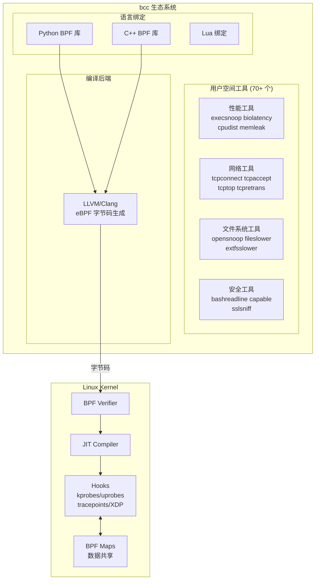
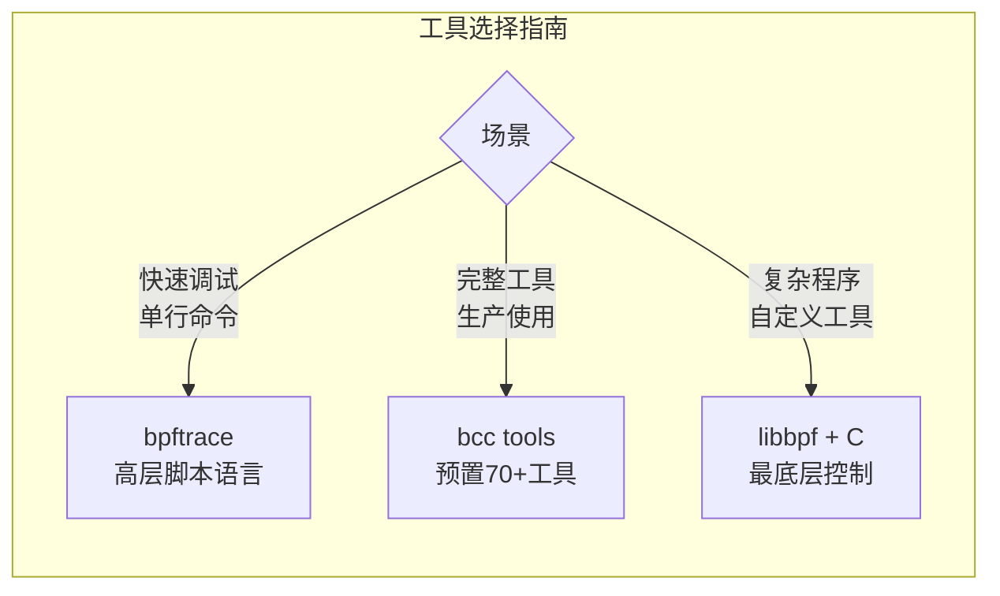
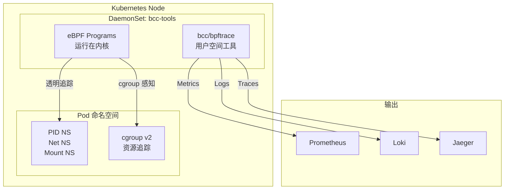
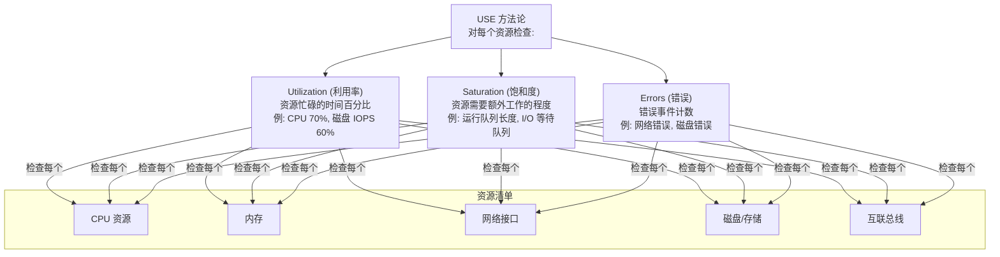
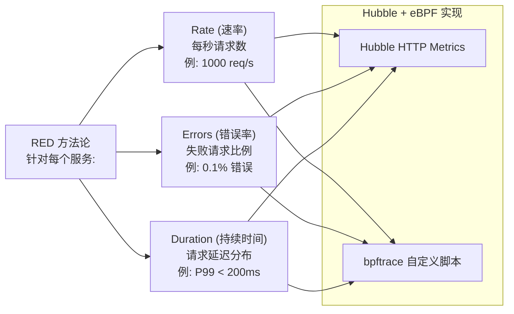
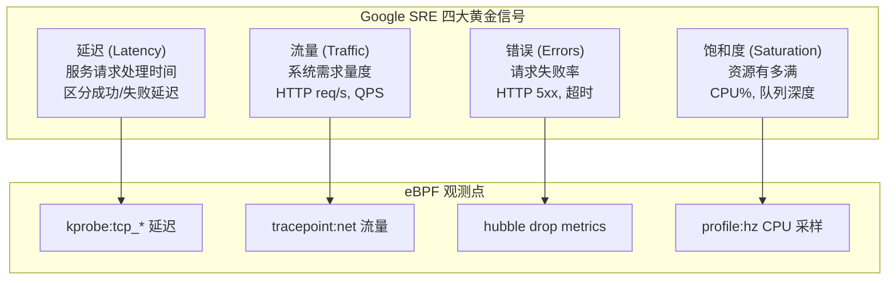
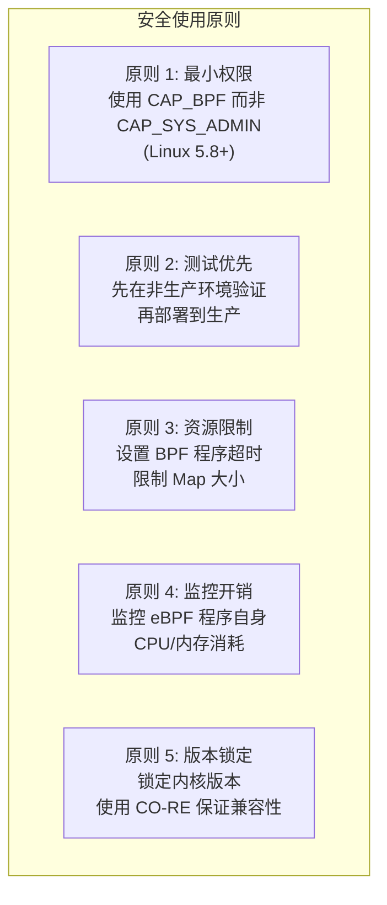

# bcc 与 bpftrace 工具链 (bcc and bpftrace Tools)

> bcc (BPF Compiler Collection) 和 bpftrace 是两个最重要的 eBPF 用户空间工具链，为 Linux 系统提供了强大的动态追踪、性能分析和调试能力，是现代云原生可观测性体系的基础工具。

---

<!-- chunk: 目录 -->## 目录

1. [bcc 项目概述与安装](#1-bcc-项目概述与安装)
2. [bcc 常用工具详解](#2-bcc-常用工具详解)
3. [bpftrace 语言基础](#3-bpftrace-语言基础)
4. [bpftrace 单行脚本示例](#4-bpftrace-单行脚本示例)
5. [复杂 bpftrace 脚本开发](#5-复杂-bpftrace-脚本开发)
6. [[entities/kubernetes|Kubernetes]] 环境中的 eBPF 性能分析](#6-kubernetes-环境中的-ebpf-性能分析)
7. [容器感知的 eBPF 工具](#7-容器感知的-ebpf-工具)
8. [自定义 bcc/bpftrace 工具开发](#8-自定义-bccbpftrace-工具开发)
9. [性能分析方法论 (USE/RED)](#9-性能分析方法论-usered)
10. [生产环境最佳实践](#10-生产环境最佳实践)

---

<!-- chunk: 1. bcc 项目概述与安装 -->## 1. bcc 项目概述与安装

#<!-- chunk: 1.1 bcc 生态系统全景 (bcc Ecosystem Overview) -->## 1.1 bcc 生态系统全景 (bcc Ecosystem Overview)

bcc (BPF Compiler Collection) 是一个基于 LLVM/Clang 的 eBPF 程序开发工具集，提供了 Python 和 C++ 绑定，以及大量预置的性能分析工具。



#<!-- chunk: 1.2 bcc vs bpftrace 对比 (bcc vs bpftrace) -->## 1.2 bcc vs bpftrace 对比 (bcc vs bpftrace)



| 维度 | bcc | bpftrace |
|------|-----|---------|
| **定位** | 工具集合 + 开发框架 | 高级脚本语言 |
| **语言** | Python/C++ 绑定 | awk-like 脚本语言 |
| **学习曲线** | 中等 | 低 |
| **适用场景** | 预置工具使用/自定义工具开发 | 快速单行诊断/小脚本 |
| **性能开销** | 中 | 低 |
| **内核要求** | 4.1+ | 4.9+ (推荐 5.8+) |
| **CO-RE 支持** | 部分 | 是 (bpftrace 0.16+) |
| **依赖** | LLVM/Clang 运行时 | 无额外依赖 (BTF 模式) |

#<!-- chunk: 1.3 安装 bcc (Installing bcc) -->## 1.3 安装 bcc (Installing bcc)

**Ubuntu/Debian:**

```bash
# Ubuntu 20.04+
sudo apt-get install -y \
  bpfcc-tools \
  libbpfcc \
  libbpfcc-dev \
  linux-headers-$(uname -r) \
  python3-bpfcc

# 验证安装
sudo execsnoop-bpfcc --help

# 安装最新版本 (源码编译)
sudo apt-get install -y \
  cmake \
  flex \
  bison \
  libelf-dev \
  libfl-dev \
  libllvm14 \
  llvm-14-dev \
  libclang-14-dev \
  zlib1g-dev \
  libluajit-5.1-dev

git clone https://github.com/iovisor/bcc.git
mkdir bcc/build && cd bcc/build
cmake .. -DCMAKE_BUILD_TYPE=Release -DCMAKE_INSTALL_PREFIX=/usr
make -j$(nproc)
sudo make install
```

**RHEL/CentOS/Rocky Linux:**

```bash
# RHEL 8/9
sudo dnf install -y \
  bcc \
  bcc-tools \
  bcc-devel \
  python3-bcc \
  kernel-devel-$(uname -r)

# 工具位置
ls /usr/share/bcc/tools/

# CentOS 7 (需要内核升级)
sudo yum install -y \
  kernel-devel-$(uname -r) \
  bcc-tools
```

**容器环境安装：**

```bash
# 在特权容器中使用 bcc
docker run --rm -it \
  --privileged \
  --pid=host \
  --net=host \
  -v /sys:/sys:ro \
  -v /lib/modules:/lib/modules:ro \
  -v /usr/src:/usr/src:ro \
  quay.io/iovisor/bcc:latest \
  /bin/bash

# Kubernetes DaemonSet 方式部署 bcc 工具
# (详见第6章)
```

#<!-- chunk: 1.4 安装 bpftrace (Installing bpftrace) -->## 1.4 安装 bpftrace (Installing bpftrace)

```bash
# Ubuntu 20.04+
sudo apt-get install -y bpftrace

# 从包管理器安装最新版
sudo snap install bpftrace

# 源码编译 (获取最新特性)
sudo apt-get install -y \
  cmake \
  libelf-dev \
  zlib1g-dev \
  libfl-dev \
  libclang-dev \
  llvm-dev \
  libgtest-dev

git clone https://github.com/iovisor/bpftrace.git
mkdir bpftrace/build && cd bpftrace/build
cmake .. -DCMAKE_BUILD_TYPE=Release
make -j$(nproc)
sudo make install

# 验证安装
bpftrace --version
# bpftrace v0.21.0

# 列出所有可用的 probe 类型
sudo bpftrace -l 'tracepoint:syscalls:*' | head -20
```

#<!-- chunk: 1.5 环境验证 (Environment Verification) -->## 1.5 环境验证 (Environment Verification)

```bash
# 验证内核支持
uname -r  # 应该 >= 4.9

# 验证 BTF 支持 (强烈推荐)
ls /sys/kernel/btf/vmlinux

# 验证 bpf 系统调用可用
cat /proc/version

# 检查 eBPF 程序限制
cat /proc/sys/kernel/bpf_jit_limit
cat /proc/sys/net/core/bpf_jit_harden

# 列出已加载的 BPF 程序
sudo bpftool prog list

# 列出 BPF Maps
sudo bpftool map list
```

---

<!-- chunk: 2. bcc 常用工具详解 -->## 2. bcc 常用工具详解

#<!-- chunk: 2.1 工具全景图 (Tools Overview) -->## 2.1 工具全景图 (Tools Overview)


#<!-- chunk: 2.2 execsnoop - 进程执行追踪 -->## 2.2 execsnoop - 进程执行追踪

execsnoop 追踪系统中所有新进程的创建，对于发现异常进程、调试应用启动问题极为有用。

```bash
# 基本用法 - 追踪所有新进程
sudo execsnoop

# 典型输出:
# PCOMM            PID    PPID   RET ARGS
# ls               12345  1234     0 /usr/bin/ls -la
# sh               12346  12345    0 /bin/sh -c echo hello
# curl             12347  1234     0 /usr/bin/curl https://example.com

# 只追踪特定命令
sudo execsnoop -n curl
sudo execsnoop -n "python|node|java"

# 追踪失败的 exec (RET != 0)
sudo execsnoop -f

# 追踪特定 UID 的进程
sudo execsnoop -u 1000

# 追踪特定进程组
sudo execsnoop -P 12345

# 输出时间戳
sudo execsnoop -t

# JSON 输出
sudo execsnoop --json

# 在 Kubernetes Pod 中使用
kubectl exec -n kube-system ds/node-exporter -- \
  /usr/share/bcc/tools/execsnoop
```

**execsnoop 高级用法 - 检测异常进程：**

```bash
# 监控潜在的恶意进程创建 (持续监控)
sudo execsnoop -t 2>/dev/null | \
  awk '
    /nc |netcat |ncat / {print "[ALERT] 可疑网络工具: " $0}
    /wget |curl / && /[0-9]{1,3}\.[0-9]{1,3}/ {print "[ALERT] 可疑下载: " $0}
    /python.*-c |perl.*-e |ruby.*-e / {print "[ALERT] 可疑解释器命令: " $0}
  '

# 统计最频繁启动的进程 (1 分钟)
sudo execsnoop -t 2>/dev/null | \
  awk 'NR>1 {print $1}' | \
  timeout 60 sort | uniq -c | sort -rn | head -10
```

#<!-- chunk: 2.3 opensnoop - 文件打开追踪 -->## 2.3 opensnoop - 文件打开追踪

```bash
# 追踪所有文件打开操作
sudo opensnoop

# 典型输出:
# PID    COMM               FD ERR PATH
# 1234   nginx              5   0  /etc/nginx/nginx.conf
# 5678   java              12   0  /app/config/application.yml
# 9012   python3            3  -1  /tmp/nonexistent.txt (ENOENT)

# 追踪失败的 open 调用 (查找缺失文件)
sudo opensnoop -x

# 追踪特定进程
sudo opensnoop -p 1234

# 追踪特定命令
sudo opensnoop -n nginx

# 追踪特定文件路径 (正则)
sudo opensnoop -f "/etc/.*\.conf$"

# 输出时间戳 + 进程信息
sudo opensnoop -Te

# 统计哪些文件被频繁打开
sudo opensnoop 2>/dev/null | \
  awk 'NR>1 && $3>=0 {print $NF}' | \
  sort | uniq -c | sort -rn | head -20
```

**诊断场景: 找出应用读取的配置文件：**

```bash
# 追踪 nginx 启动时读取的所有文件
sudo opensnoop -n nginx | grep -v "ENOENT" 

# 输出示例:
# 1234   nginx              5   0  /etc/nginx/nginx.conf
# 1234   nginx              5   0  /etc/nginx/mime.types
# 1234   nginx              5   0  /etc/nginx/conf.d/default.conf
# 1234   nginx              5   0  /var/log/nginx/access.log
# 1234   nginx              5   0  /var/log/nginx/error.log
```

#<!-- chunk: 2.4 tcpconnect / tcpaccept - TCP 连接追踪 -->## 2.4 tcpconnect / tcpaccept - TCP 连接追踪

```bash
# 追踪所有出站 TCP 连接
sudo tcpconnect

# 典型输出:
# PID    COMM         IP SADDR            DADDR            DPORT
# 1234   curl          4 10.0.0.1         93.184.216.34    443
# 5678   java          4 10.0.0.2         10.0.1.100       5432
# 9012   python3       6 ::1              ::1              8080

# 追踪入站 TCP 连接
sudo tcpaccept

# 典型输出:
# PID    COMM         IP RADDR            RPORT LADDR            LPORT
# 1234   nginx         4 192.168.1.100    54321 10.0.0.1         80

# 只追踪特定端口
sudo tcpconnect -P 443,5432,6379

# 追踪特定进程
sudo tcpconnect -p 1234

# 追踪并解析 DNS
sudo tcpconnect -D

# 追踪 IPv4 only
sudo tcpconnect -4

# 带时间戳输出
sudo tcpconnect -t

# 统计连接最多的目标 (排查连接泄漏)
sudo tcpconnect 2>/dev/null | \
  awk 'NR>1 {print $5 ":" $6}' | \
  sort | uniq -c | sort -rn | head -10
```

**追踪 TCP 重传 (排查网络质量问题)：**

```bash
# tcpretrans: 追踪 TCP 重传
sudo tcpretrans

# 典型输出:
# TIME     PID    IP LADDR:LPORT          T> RADDR:RPORT          STATE
# 10:00:01 0       4 10.0.0.1:80         R> 192.168.1.100:54321   ESTABLISHED

# T 列含义:
# R = 重传
# L = TLP (tail loss probe)
# F = Fast Retransmit

# 统计重传 Top IP
sudo tcpretrans 2>/dev/null | \
  awk 'NR>1 {print $6}' | \
  cut -d: -f1 | \
  sort | uniq -c | sort -rn
```

#<!-- chunk: 2.5 biolatency - 块 I/O 延迟分析 -->## 2.5 biolatency - 块 I/O 延迟分析

biolatency 是分析磁盘 I/O 性能的利器，以直方图形式展示延迟分布。

```bash
# 显示 I/O 延迟直方图 (10秒统计)
sudo biolatency 10

# 典型输出:
#      usecs           : count     distribution
#          0 -> 1      : 0        |                    |
#          2 -> 3      : 10       |*                   |
#          4 -> 7      : 156      |***********         |
#          8 -> 15     : 89       |*******             |
#         16 -> 31     : 23       |**                  |
#         32 -> 63     : 5        |                    |
#         64 -> 127    : 2        |                    |
#        128 -> 255    : 1        |                    |
#       4096 -> 8191   : 0        |                    |

# 按磁盘分组显示
sudo biolatency -D 10

# 按 I/O 类型分组 (读/写)
sudo biolatency -F 10

# 追踪特定磁盘
sudo biolatency -d sdb 10

# 使用毫秒单位 (大延迟场景)
sudo biolatency -m 10

# 以队列延迟为准 (包含排队时间)
sudo biolatency -Q 10
```

**biosnoop - 追踪每个 I/O 请求：**

```bash
# 追踪所有块 I/O 请求
sudo biosnoop

# 典型输出:
# TIME(s)  COMM           PID    DISK    T  SECTOR    BYTES  LAT(ms)
# 0.000004 java           1234   sda     R  12345678  4096   0.28
# 0.001234 postgres       5678   sdb     W  87654321  8192   1.23

# 只追踪延迟超过阈值的 I/O
sudo biosnoop -Q 10  # 延迟 > 10ms

# 追踪特定进程
sudo biosnoop -P 1234

# 实时排行: biotop
sudo biotop  # 类似 top，按 I/O 排序

# 典型 biotop 输出:
# Tracing... Output every 1 secs. Hit Ctrl-C to end
#
# 10:00:01 loadavg: 0.52 0.47 0.35
# PID    COMM             D MAJ MIN  I/Os  Kbytes  AVGms
# 5678   postgres         W 8   16   47    376     1.23
# 1234   java             R 8   0    23    184     0.45
```

#<!-- chunk: 2.6 funccount / funclatency - 函数调用分析 -->## 2.6 funccount / funclatency - 函数调用分析

```bash
# 统计内核函数调用次数 (5秒)
sudo funccount 'tcp_*' 5

# 典型输出:
# Tracing 47 functions for "tcp_*"... Hit Ctrl-C to end.
# FUNC                          COUNT
# tcp_sendmsg                   8234
# tcp_recvmsg                   7891
# tcp_cleanup_rbuf              7891
# tcp_rcv_established           7234
# tcp_v4_do_rcv                 7123

# 统计 vfs 层函数调用
sudo funccount 'vfs_*' 5

# 统计用户空间函数 (libc)
sudo funccount 'c:malloc' 5

# 函数延迟分析
sudo funclatency do_sys_open 10

# 典型输出:
#      nsecs               : count     distribution
#        256 -> 511        : 0        |                    |
#        512 -> 1023       : 45       |****                |
#       1024 -> 2047       : 276      |***************************|
#       2048 -> 4095       : 134      |*************       |
#       4096 -> 8191       : 23       |**                  |
#       8192 -> 16383      : 5        |                    |

# 分析 Python 函数延迟
sudo funclatency -l py:/* /usr/bin/python3 10

# 追踪 Java 方法延迟 (需要 USDT probes)
sudo funclatency 'java:java.net.Socket:connect' 10
```

#<!-- chunk: 2.7 其他重要工具 (Other Important Tools) -->## 2.7 其他重要工具 (Other Important Tools)

**CPU 性能分析：**

```bash
# profile: CPU 采样分析 (火焰图基础)
sudo profile -F 99 30  # 99Hz 采样，持续 30 秒
sudo profile -F 99 30 -a  # 包含内核栈

# 生成火焰图
sudo profile -F 99 30 -f > /tmp/cpu-stacks.txt
flamegraph.pl /tmp/cpu-stacks.txt > /tmp/cpu-flamegraph.svg

# cpudist: CPU on/off 时间分布
sudo cpudist 10

# runqslower: 追踪调度延迟 > 阈值的任务
sudo runqslower 10000  # 调度延迟 > 10ms

# offcputime: 统计进程 off-CPU 时间 (阻塞分析)
sudo offcputime -p 1234 30
```

**内存分析：**

```bash
# memleak: 检测内存泄漏
sudo memleak -p 1234 5  # 5秒内存增长分析

# 典型输出:
# [10:00:05] Top 5 stacks with outstanding allocations:
#   576 bytes in 6 allocations from stack:
#     alloc [/usr/lib/libc.so.6]
#     myapp [/opt/app/myapp]
#     main [/opt/app/myapp]

# oomkill: 追踪 OOM Killer 事件
sudo oomkill

# shmsnoop: 共享内存操作追踪
sudo shmsnoop
```

**安全审计：**

```bash
# capable: 追踪 Linux capability 使用
sudo capable
# 输出: 哪个进程请求了什么 capability

# bashreadline: 追踪 bash 命令历史
sudo bashreadline

# sslsniff: 追踪 SSL/TLS 明文 (调试用)
sudo sslsniff -p 1234

# trace: 通用追踪框架
sudo trace 'sys_read (args->count > 4096) "large read: %d", args->count'
```

---

<!-- chunk: 3. bpftrace 语言基础 -->## 3. bpftrace 语言基础

#<!-- chunk: 3.1 bpftrace 语言架构 (Language Architecture) -->## 3.1 bpftrace 语言架构 (Language Architecture)

```mermaid
graph TB
    subgraph "bpftrace 程序结构"
        HEADER["probe_type:target:function\n探针规格说明"]
        FILTER["/ filter_expression /\n可选过滤条件"]
        ACTION["{ action_block }\n动作代码块"]
    end
    
    subgraph "数据类型"
        INT[整型\nint/uint 8/16/32/64]
        STR[字符串\nchar *]
        MAP[Map 类型\n@ = count()]
        HIST[直方图\n@h = hist(value)]
    end
    
    subgraph "内置变量"
        PID[pid: 进程ID]
        TID[tid: 线程ID]
        COMM[comm: 进程名]
        NS[nsecs: 纳秒时间戳]
        ARGS[args: 探针参数]
        RETVAL[retval: 返回值]
        KSTACK[kstack: 内核栈]
        USTACK[ustack: 用户栈]
    end
    
    HEADER --> FILTER --> ACTION
```

#<!-- chunk: 3.2 探针类型 (Probe Types) -->## 3.2 探针类型 (Probe Types)

```
探针类型总览:

kprobe:function_name       - 内核函数入口
kretprobe:function_name    - 内核函数返回
uprobe:binary:function     - 用户空间函数入口
uretprobe:binary:function  - 用户空间函数返回
tracepoint:subsys:name     - 内核 tracepoint
usdt:binary:provider:name  - 用户空间静态追踪点
profile:hz:freq            - 定时采样
interval:s:N               - 定时间隔触发
software:event:count       - 软件性能事件
hardware:event:count       - 硬件性能计数器
BEGIN                      - 脚本启动
END                        - 脚本结束
```

```bash
# 列出所有可用 tracepoints
sudo bpftrace -l 'tracepoint:*' | wc -l

# 列出系统调用 tracepoints
sudo bpftrace -l 'tracepoint:syscalls:*' | head -20

# 查看 tracepoint 参数结构
sudo bpftrace -lv 'tracepoint:syscalls:sys_enter_openat'
# tracepoint:syscalls:sys_enter_openat
#     int __syscall_nr
#     int dfd
#     const char * filename
#     int flags
#     unsigned short mode

# 列出可用的 kprobes
sudo bpftrace -l 'kprobe:tcp_*' | head -20

# 列出 uprobe 目标
sudo bpftrace -l 'uprobe:/usr/bin/python3:*' | head -10
```

#<!-- chunk: 3.3 基础语法 (Basic Syntax) -->## 3.3 基础语法 (Basic Syntax)

```bpftrace
// 单行注释
/* 多行注释 */

// 基本结构示例: 追踪 open 系统调用
tracepoint:syscalls:sys_enter_openat
{
    // 内置变量
    printf("pid: %d, comm: %s, file: %s\n",
           pid, comm, str(args->filename));
}

// 带过滤器: 只追踪特定进程
tracepoint:syscalls:sys_enter_openat
/ comm == "nginx" /
{
    printf("nginx opened: %s\n", str(args->filename));
}

// 函数返回值追踪
kretprobe:do_sys_openat2
{
    printf("fd = %d\n", retval);
}

// Map 操作: 统计调用次数
kprobe:tcp_sendmsg
{
    @[comm] = count();
}

// 直方图统计延迟
kprobe:vfs_read
{
    @start[tid] = nsecs;
}

kretprobe:vfs_read
/ @start[tid] /
{
    @latency = hist(nsecs - @start[tid]);
    delete(@start[tid]);
}
```

#<!-- chunk: 3.4 内置函数 (Built-in Functions) -->## 3.4 内置函数 (Built-in Functions)

```bpftrace
// 字符串函数
str(ptr)           // C 字符串指针转 bpftrace 字符串
substr(str, start) // 子字符串
strcontains(str, needle) // 字符串包含检测

// 类型转换
(int32)expr        // 类型转换

// 打印函数
printf(fmt, ...)   // 格式化输出
print(@map)        // 打印 Map
print(@map, top_n) // 打印 Top N
clear(@map)        // 清空 Map

// 时间函数
nsecs              // 纳秒时间戳
elapsed            // 脚本启动后经过的纳秒数
ktime              // 内核时间 (纳秒)

// 进程信息
pid   tid   uid   gid   comm   curtask

// 内核/用户栈
kstack  kstack(N)  // 内核栈 (N 层)
ustack  ustack(N)  // 用户栈 (N 层)

// 内存访问
*(addr)            // 解引用内核地址
*((datatype *)addr)// 类型化解引用

// 聚合函数 (Map Actions)
count()            // 计数
sum(expr)          // 求和
avg(expr)          // 平均值
min(expr)          // 最小值
max(expr)          // 最大值
hist(expr)         // 2次幂直方图
lhist(expr, min, max, step) // 线性直方图
stats(expr)        // count/avg/total 统计

// 控制流
if (cond) { } else { }
unroll(N) { }      // 编译时展开循环
```

#<!-- chunk: 3.5 Map 操作详解 (Map Operations) -->## 3.5 Map 操作详解 (Map Operations)

```bpftrace
// Map 声明 (自动创建)
@map_name                    // 全局 Map
@map_name[key]               // 以 key 为索引的 Map
@map_name[key1, key2]        // 多维 key Map

// Map 类型示例:

// 1. 计数器 Map
kprobe:tcp_sendmsg {
    @sends[comm] = count();
}

// 2. 直方图 Map
kprobe:vfs_read {
    @size_hist = hist(args->count);
}

// 3. 时间测量 Map
kprobe:sys_read {
    @ts[tid] = nsecs;
}
kretprobe:sys_read {
    @lat_ns = hist(nsecs - @ts[tid]);
    delete(@ts[tid]);
}

// END 块中打印结果
END {
    print(@sends);
    print(@lat_ns);
    clear(@ts);  // 清理临时 Map
}
```

---

<!-- chunk: 4. bpftrace 单行脚本示例 -->## 4. bpftrace 单行脚本示例

#<!-- chunk: 4.1 系统调用分析 (Syscall Analysis) -->## 4.1 系统调用分析 (Syscall Analysis)

```bash
# 统计所有系统调用次数 (按进程名)
sudo bpftrace -e '
tracepoint:raw_syscalls:sys_enter 
{ @[comm] = count(); }'

# 统计 top 系统调用类型
sudo bpftrace -e '
tracepoint:raw_syscalls:sys_enter 
{ @[args->id] = count(); } 
END 
{ print(@, 10); }'

# 追踪 read 调用读取字节数分布
sudo bpftrace -e '
tracepoint:syscalls:sys_exit_read 
/ args->ret > 0 / 
{ @bytes = hist(args->ret); }'

# 追踪 write 调用大小
sudo bpftrace -e '
tracepoint:syscalls:sys_enter_write 
{ @bytes_written[comm] = sum(args->count); }'

# 追踪特定进程的系统调用
sudo bpftrace -e '
tracepoint:raw_syscalls:sys_enter 
/ pid == 1234 / 
{ @[args->id] = count(); }'
```

#<!-- chunk: 4.2 文件系统分析 (Filesystem Analysis) -->## 4.2 文件系统分析 (Filesystem Analysis)

```bash
# 追踪所有文件打开 (类似 opensnoop)
sudo bpftrace -e '
tracepoint:syscalls:sys_enter_openat 
{ printf("%s %s\n", comm, str(args->filename)); }'

# 统计文件读取延迟
sudo bpftrace -e '
kprobe:vfs_read { @start[tid] = nsecs; }
kretprobe:vfs_read / @start[tid] / {
    @us = hist((nsecs - @start[tid]) / 1000);
    delete(@start[tid]);
}'

# 追踪大文件读取 (> 1MB)
sudo bpftrace -e '
tracepoint:syscalls:sys_enter_read 
/ args->count > 1048576 / 
{ printf("LARGE READ: %s %d bytes\n", comm, args->count); }'

# 统计访问最多的目录
sudo bpftrace -e '
tracepoint:syscalls:sys_enter_openat
{ 
    $file = str(args->filename);
    if (strcontains($file, "/")) {
        @[comm] = count();
    }
}'

# 追踪文件删除
sudo bpftrace -e '
tracepoint:syscalls:sys_enter_unlinkat 
{ printf("%s deleted: %s\n", comm, str(args->pathname)); }'
```

#<!-- chunk: 4.3 网络分析 (Network Analysis) -->## 4.3 网络分析 (Network Analysis)

```bash
# 追踪 TCP 连接建立
sudo bpftrace -e '
kprobe:tcp_connect 
{ 
    $sk = (struct sock *)arg0;
    printf("connect: %s -> %s:%d\n", 
           comm,
           ntop($sk->__sk_common.skc_daddr),
           $sk->__sk_common.skc_dport >> 8);
}'

# 统计 TCP 发送字节 (按进程)
sudo bpftrace -e '
kprobe:tcp_sendmsg 
{ @bytes[comm] = sum(arg2); }'

# 追踪 UDP 数据包
sudo bpftrace -e '
tracepoint:net:net_dev_xmit 
{ @pkts[comm] = count(); }'

# 追踪 DNS 查询 (UDP port 53)
sudo bpftrace -e '
kprobe:udp_sendmsg
{
    $sk = (struct sock *)arg0;
    $dport = $sk->__sk_common.skc_dport;
    if (($dport >> 8 | $dport << 8) == 53) {
        printf("DNS query from: %s (pid: %d)\n", comm, pid);
    }
}'

# 统计每秒网络包数
sudo bpftrace -e '
tracepoint:net:netif_receive_skb { @rx = count(); }
tracepoint:net:net_dev_xmit { @tx = count(); }
interval:s:1 {
    printf("RX: %d/s, TX: %d/s\n", @rx, @tx);
    clear(@rx); clear(@tx);
}'
```

#<!-- chunk: 4.4 CPU 和调度分析 (CPU & Scheduling) -->## 4.4 CPU 和调度分析 (CPU & Scheduling)

```bash
# CPU 采样分析 (每秒 99 次，运行 10 秒)
sudo bpftrace -e '
profile:hz:99 
{ @[kstack] = count(); }
interval:s:10 { exit(); }'

# 追踪上下文切换
sudo bpftrace -e '
tracepoint:sched:sched_switch 
{ @[args->prev_comm, args->next_comm] = count(); }'

# 统计进程调度延迟
sudo bpftrace -e '
tracepoint:sched:sched_wakeup 
{ @ts[args->pid] = nsecs; }
tracepoint:sched:sched_switch 
/ @ts[args->next_pid] / {
    @sched_lat_us = hist((nsecs - @ts[args->next_pid]) / 1000);
    delete(@ts[args->next_pid]);
}'

# 追踪 CPU 迁移事件
sudo bpftrace -e '
tracepoint:sched:sched_migrate_task 
{ 
    printf("%s migrated from CPU%d to CPU%d\n",
           args->comm, args->orig_cpu, args->dest_cpu); 
}'

# 统计进程 off-CPU 时间 (阻塞分析)
sudo bpftrace -e '
tracepoint:sched:sched_switch 
/ args->prev_state / {
    @off_start[args->prev_pid] = nsecs;
}
tracepoint:sched:sched_switch 
/ @off_start[args->next_pid] / {
    @off_time_ms[args->next_comm] = 
        sum((nsecs - @off_start[args->next_pid]) / 1000000);
    delete(@off_start[args->next_pid]);
}'
```

#<!-- chunk: 4.5 内存分析 (Memory Analysis) -->## 4.5 内存分析 (Memory Analysis)

```bash
# 统计 malloc 调用大小分布
sudo bpftrace -e '
uprobe:/lib/x86_64-linux-gnu/libc.so.6:malloc 
{ @alloc_size = hist(arg0); }'

# 追踪内存映射
sudo bpftrace -e '
tracepoint:syscalls:sys_enter_mmap 
{ @mmap_size[comm] = sum(args->len); }'

# 追踪 OOM 事件
sudo bpftrace -e '
kprobe:oom_kill_process 
{ 
    printf("OOM killing: %s (pid: %d)\n", 
           ((struct task_struct *)arg1)->comm, 
           ((struct task_struct *)arg1)->pid); 
}'

# 追踪 page fault
sudo bpftrace -e '
tracepoint:exceptions:page_fault_user 
{ @faults[comm] = count(); }
interval:s:5 { print(@faults); clear(@faults); }'
```

---

<!-- chunk: 5. 复杂 bpftrace 脚本开发 -->## 5. 复杂 bpftrace 脚本开发

#<!-- chunk: 5.1 HTTP 请求延迟追踪器 (HTTP Latency Tracer) -->## 5.1 HTTP 请求延迟追踪器 (HTTP Latency Tracer)

```bpftrace
#!/usr/bin/env bpftrace
// http-latency.bt: 追踪 HTTP 服务器请求延迟
// 用法: sudo bpftrace http-latency.bt

// 追踪 accept4 系统调用 (HTTP 服务器接受连接)
tracepoint:syscalls:sys_enter_accept4
/ comm == "nginx" || comm == "httpd" || comm == "node" /
{
    @accept_ts[tid] = nsecs;
}

// 追踪 sendfile 或 write (响应发送)
tracepoint:syscalls:sys_enter_sendfile64
/ @accept_ts[tid] /
{
    $latency_ms = (nsecs - @accept_ts[tid]) / 1000000;
    @http_latency_ms = hist($latency_ms);
    @http_latency_by_proc[comm] = hist($latency_ms);
    
    if ($latency_ms > 100) {
        printf("[SLOW] %s: %d ms (tid: %d)\n", 
               comm, $latency_ms, tid);
    }
    
    delete(@accept_ts[tid]);
}

END
{
    printf("\n=== HTTP 请求延迟分布 (ms) ===\n");
    print(@http_latency_ms);
    printf("\n=== 按进程分组 ===\n");
    print(@http_latency_by_proc);
}
```

#<!-- chunk: 5.2 数据库查询追踪器 (Database Query Tracer) -->## 5.2 数据库查询追踪器 (Database Query Tracer)

```bpftrace
#!/usr/bin/env bpftrace
// db-query-tracer.bt: 追踪 PostgreSQL/MySQL 查询延迟
// 使用 USDT probes (需要数据库启用 DTrace 支持)

// PostgreSQL USDT probes
usdt:/usr/lib/postgresql/14/bin/postgres:postgresql:query__start
{
    @query_start[pid] = nsecs;
    printf("PG QUERY START [pid:%d]: %.100s\n", pid, str(arg0));
}

usdt:/usr/lib/postgresql/14/bin/postgres:postgresql:query__done
/ @query_start[pid] /
{
    $duration_ms = (nsecs - @query_start[pid]) / 1000000;
    @pg_query_latency_ms = hist($duration_ms);
    
    if ($duration_ms > 1000) {
        printf("[SLOW QUERY] pid:%d duration:%dms query:%.100s\n",
               pid, $duration_ms, str(arg0));
    }
    
    delete(@query_start[pid]);
}

// MySQL USDT probes (如果可用)
usdt:/usr/sbin/mysqld:mysql:query__start
{
    @mysql_start[pid] = nsecs;
}

usdt:/usr/sbin/mysqld:mysql:query__done
/ @mysql_start[pid] /
{
    @mysql_latency = hist((nsecs - @mysql_start[pid]) / 1000000);
    delete(@mysql_start[pid]);
}

interval:s:30
{
    printf("\n=== PostgreSQL 查询延迟 (30s) ===\n");
    print(@pg_query_latency_ms);
    clear(@pg_query_latency_ms);
    
    printf("\n=== MySQL 查询延迟 (30s) ===\n");
    print(@mysql_latency);
    clear(@mysql_latency);
}
```

#<!-- chunk: 5.3 TCP 连接全生命周期追踪器 (TCP Lifecycle Tracer) -->## 5.3 TCP 连接全生命周期追踪器 (TCP Lifecycle Tracer)

```bpftrace
#!/usr/bin/env bpftrace
// tcp-lifecycle.bt: 完整追踪 TCP 连接生命周期

#include <net/tcp_states.h>
#include <linux/tcp.h>

// TCP 连接建立
kprobe:tcp_v4_connect
{
    $sk = (struct sock *)arg0;
    @tcp_start[tid] = nsecs;
    @tcp_sk[tid] = arg0;
}

kretprobe:tcp_v4_connect
/ retval == 0 && @tcp_start[tid] /
{
    $sk = (struct sock *)@tcp_sk[tid];
    $daddr = ntop($sk->__sk_common.skc_daddr);
    $dport = ($sk->__sk_common.skc_dport >> 8) | 
             (($sk->__sk_common.skc_dport & 0xFF) << 8);
    
    printf("CONNECT: %s (pid:%d) -> %s:%d [%d us]\n",
           comm, pid, $daddr, $dport,
           (nsecs - @tcp_start[tid]) / 1000);
    
    @connect_time[$daddr, $dport] = nsecs;
    delete(@tcp_start[tid]);
    delete(@tcp_sk[tid]);
}

// TCP 连接关闭
kprobe:tcp_close
{
    $sk = (struct sock *)arg0;
    $daddr = ntop($sk->__sk_common.skc_daddr);
    $dport = ($sk->__sk_common.skc_dport >> 8) | 
             (($sk->__sk_common.skc_dport & 0xFF) << 8);
    
    if (@connect_time[$daddr, $dport]) {
        $duration_ms = (nsecs - @connect_time[$daddr, $dport]) / 1000000;
        printf("CLOSE: %s (pid:%d) -> %s:%d [connection lived %dms]\n",
               comm, pid, $daddr, $dport, $duration_ms);
        @conn_duration_ms = hist($duration_ms);
        delete(@connect_time[$daddr, $dport]);
    }
}

// TCP 重传
kprobe:tcp_retransmit_skb
{
    $sk = (struct sock *)arg0;
    $daddr = ntop($sk->__sk_common.skc_daddr);
    @retrans[$daddr] = count();
    printf("RETRANSMIT: %s -> %s\n", comm, $daddr);
}

END
{
    printf("\n=== TCP 连接持续时间分布 (ms) ===\n");
    print(@conn_duration_ms);
    printf("\n=== 重传次数 by 目标 IP ===\n");
    print(@retrans);
}
```

#<!-- chunk: 5.4 内存泄漏探测器 (Memory Leak Detector) -->## 5.4 内存泄漏探测器 (Memory Leak Detector)

```bpftrace
#!/usr/bin/env bpftrace
// memleak-detect.bt: 检测用户空间内存泄漏

uprobe:/lib/x86_64-linux-gnu/libc.so.6:malloc
/ pid == $1 /  // $1 为目标 PID 参数
{
    @alloc_size[tid] = arg0;
    @alloc_stack[tid] = ustack;
}

uretprobe:/lib/x86_64-linux-gnu/libc.so.6:malloc
/ @alloc_size[tid] /
{
    if (retval != 0) {
        @outstanding[retval] = @alloc_size[tid];
        @stacks[ustack] = sum(@alloc_size[tid]);
    }
    delete(@alloc_size[tid]);
    delete(@alloc_stack[tid]);
}

uprobe:/lib/x86_64-linux-gnu/libc.so.6:free
/ pid == $1 /
{
    $ptr = arg0;
    if (@outstanding[$ptr]) {
        delete(@outstanding[$ptr]);
    }
}

interval:s:10
{
    $total = 0;
    // 计算未释放内存总量
    printf("\n=== 10s 内未释放内存 Top 10 调用栈 ===\n");
    print(@stacks, 10);
    printf("\n总未释放分配次数: %d\n", count(@outstanding));
}
```

#<!-- chunk: 5.5 系统调用延迟追踪器 (Syscall Latency Tracer) -->## 5.5 系统调用延迟追踪器 (Syscall Latency Tracer)

```bpftrace
#!/usr/bin/env bpftrace
// syscall-latency.bt: 系统调用延迟分布分析

BEGIN
{
    printf("追踪系统调用延迟... 按 Ctrl-C 停止\n");
    
    // 系统调用名称映射 (常用)
    @syscall_name[0] = "read";
    @syscall_name[1] = "write";
    @syscall_name[2] = "open";
    @syscall_name[3] = "close";
    @syscall_name[8] = "lseek";
    @syscall_name[9] = "mmap";
    @syscall_name[21] = "access";
    @syscall_name[41] = "socket";
    @syscall_name[42] = "connect";
    @syscall_name[43] = "accept";
    @syscall_name[44] = "sendto";
    @syscall_name[45] = "recvfrom";
    @syscall_name[232] = "epoll_wait";
}

tracepoint:raw_syscalls:sys_enter
/ comm == str($1) /  // $1 为目标进程名
{
    @sys_start[tid, args->id] = nsecs;
}

tracepoint:raw_syscalls:sys_exit
/ @sys_start[tid, args->id] /
{
    $id = args->id;
    $lat = (nsecs - @sys_start[tid, args->id]) / 1000;
    
    // 记录延迟分布
    @latency_us[$id] = hist($lat);
    
    // 记录慢系统调用
    if ($lat > 10000) {  // > 10ms
        printf("[SLOW SYSCALL] %s syscall#%d: %d us\n",
               comm, $id, $lat);
    }
    
    delete(@sys_start[tid, args->id]);
}

interval:s:30
{
    printf("\n=== 系统调用延迟分布 (微秒) ===\n");
    
    // 打印各系统调用的延迟直方图
    print(@latency_us);
    
    printf("\n--- 下一个 30 秒统计周期 ---\n");
    clear(@latency_us);
}
```

---

<!-- chunk: 6. Kubernetes 环境中的 eBPF 性能分析 -->## 6. Kubernetes 环境中的 eBPF 性能分析

#<!-- chunk: 6.1 K8s eBPF 分析架构 (K8s eBPF Analysis Architecture) -->## 6.1 K8s eBPF 分析架构 (K8s eBPF Analysis Architecture)



#<!-- chunk: 6.2 部署 eBPF 分析工具 DaemonSet -->## 6.2 部署 eBPF 分析工具 DaemonSet

```yaml
# ebpf-tools-daemonset.yaml
apiVersion: apps/v1
kind: DaemonSet
metadata:
  name: ebpf-tools
  namespace: monitoring
  labels:
    app: ebpf-tools
spec:
  selector:
    matchLabels:
      app: ebpf-tools
  template:
    metadata:
      labels:
        app: ebpf-tools
    spec:
      hostPID: true    # 访问宿主机 PID 命名空间
      hostNetwork: true # 访问宿主机网络
      
      tolerations:
      - effect: NoSchedule
        operator: Exists
      - effect: NoExecute
        operator: Exists
      
      containers:
      - name: ebpf-tools
        image: quay.io/iovisor/bcc:latest
        
        securityContext:
          privileged: true  # eBPF 需要特权
          capabilities:
            add:
            - SYS_ADMIN
            - SYS_PTRACE
            - NET_ADMIN
            - SYS_RESOURCE
        
        volumeMounts:
        - name: sys
          mountPath: /sys
          readOnly: true
        - name: modules
          mountPath: /lib/modules
          readOnly: true
        - name: src
          mountPath: /usr/src
          readOnly: true
        - name: debug
          mountPath: /sys/kernel/debug
        - name: bpffs
          mountPath: /sys/fs/bpf
        
        resources:
          requests:
            cpu: 100m
            memory: 128Mi
          limits:
            cpu: 2000m
            memory: 2Gi
        
        command: ["/bin/bash", "-c", "while true; do sleep 3600; done"]
      
      volumes:
      - name: sys
        hostPath:
          path: /sys
      - name: modules
        hostPath:
          path: /lib/modules
      - name: src
        hostPath:
          path: /usr/src
      - name: debug
        hostPath:
          path: /sys/kernel/debug
      - name: bpffs
        hostPath:
          path: /sys/fs/bpf
          type: DirectoryOrCreate
```

#<!-- chunk: 6.3 容器感知的 eBPF 追踪 (Container-Aware eBPF) -->## 6.3 容器感知的 eBPF 追踪 (Container-Aware eBPF)

```bash
# 找到容器在宿主机上的 PID
CONTAINER_ID=$(kubectl get pod frontend-xxx -o jsonpath='{.status.containerStatuses[0].containerID}' | cut -d/ -f3)

# 方式 1: 通过 docker/containerd 获取 PID
HOST_PID=$(docker inspect --format '{{.State.Pid}}' $CONTAINER_ID 2>/dev/null || \
           crictl inspect --output json $CONTAINER_ID | jq '.info.pid')

echo "容器在宿主机上的 PID: $HOST_PID"

# 方式 2: 通过 /proc 文件系统
POD_UID=$(kubectl get pod frontend-xxx -o jsonpath='{.metadata.uid}')
find /proc -name "cgroup" 2>/dev/null | \
  xargs grep -l "$POD_UID" 2>/dev/null | \
  head -1 | cut -d/ -f3
```

```bash
# 在宿主机上追踪特定容器内的系统调用
# 先在 ebpf-tools DaemonSet Pod 中执行
kubectl exec -n monitoring ds/ebpf-tools -- \
  /usr/share/bcc/tools/opensnoop -p $HOST_PID

# 追踪特定容器的网络连接
kubectl exec -n monitoring ds/ebpf-tools -- \
  /usr/share/bcc/tools/tcpconnect -p $HOST_PID

# 追踪特定容器的 CPU 使用
kubectl exec -n monitoring ds/ebpf-tools -- \
  /usr/share/bcc/tools/profile -p $HOST_PID 30
```

#<!-- chunk: 6.4 cgroup 级别性能分析 (cgroup-Level Analysis) -->## 6.4 cgroup 级别性能分析 (cgroup-Level Analysis)

```bpftrace
#!/usr/bin/env bpftrace
// k8s-container-io.bt: 按 cgroup 追踪容器 I/O

// cgroup v2 path 格式:
// /sys/fs/cgroup/kubepods/pod<uid>/<container_id>/...

kprobe:vfs_read
{
    $cgrp = cgroupid("/sys/fs/cgroup");  // 获取当前进程 cgroup ID
    @read_bytes[$cgrp, comm] = sum(arg2);
}

kprobe:vfs_write
{
    $cgrp = cgroupid("/sys/fs/cgroup");
    @write_bytes[$cgrp, comm] = sum(arg2);
}

interval:s:5
{
    printf("\n=== 容器 I/O 统计 (5s) ===\n");
    printf("READ:\n");
    print(@read_bytes, 10);
    printf("WRITE:\n");
    print(@write_bytes, 10);
    clear(@read_bytes);
    clear(@write_bytes);
}
```

```bash
# 追踪特定 Kubernetes Pod 的网络延迟
# Step 1: 获取 Pod 的网络命名空间
POD_NS=$(kubectl get pod frontend-xxx -n production \
  -o jsonpath='{.metadata.uid}')

# Step 2: 使用 nsenter 进入网络命名空间
NODE=$(kubectl get pod frontend-xxx -o jsonpath='{.spec.nodeName}')
kubectl debug node/$NODE -it --image=ubuntu -- \
  nsenter -t $HOST_PID -n -- \
  /usr/sbin/tcpdump -i any -nn 'port 8080' -c 100
```

#<!-- chunk: 6.5 Kubernetes 节点性能诊断脚本 -->## 6.5 Kubernetes 节点性能诊断脚本

```bash
#!/bin/bash
# k8s-node-profile.sh: Kubernetes 节点性能快速诊断

NODE=${1:-$(kubectl get nodes -o jsonpath='{.items[0].metadata.name}')}
DURATION=${2:-30}

echo "=== Kubernetes 节点 $NODE 性能分析 ($DURATION 秒) ==="

# 在节点上运行 bpftrace
kubectl debug node/$NODE -it --image=quay.io/iovisor/bcc:latest -- \
  bash -c "
  echo '--- CPU 使用 Top 进程 ---'
  timeout $DURATION /usr/share/bcc/tools/profile -F 99 $DURATION 2>/dev/null | \
    head -30
    
  echo '--- I/O 延迟分布 ---'
  timeout $DURATION /usr/share/bcc/tools/biolatency $DURATION 2>/dev/null
  
  echo '--- TCP 连接统计 ---'
  timeout $DURATION /usr/share/bcc/tools/tcpconnect 2>/dev/null | \
    awk '{print \$5 \":\" \$6}' | sort | uniq -c | sort -rn | head -20
  
  echo '--- 系统调用延迟 ---'
  timeout $DURATION /usr/share/bcc/tools/syscount -L 2>/dev/null | head -20
  "
```

---

<!-- chunk: 7. 容器感知的 eBPF 工具 -->## 7. 容器感知的 eBPF 工具

#<!-- chunk: 7.1 kubectl-trace 插件 (kubectl-trace Plugin) -->## 7.1 kubectl-trace 插件 (kubectl-trace Plugin)

kubectl-trace 是一个 kubectl 插件，可以直接在 Kubernetes 节点上运行 bpftrace 脚本。

```bash
# 安装 kubectl-trace
kubectl krew install trace

# 在特定节点上运行 bpftrace 脚本
kubectl trace run node/node-1 -e "
kprobe:do_sys_open { printf(\"%s: %s\n\", comm, str(arg1)); }
"

# 运行脚本文件
kubectl trace run node/node-1 -f ./my-trace.bt

# 在特定 Pod 中运行
kubectl trace run pod/frontend-xxx -e "
uprobe:/proc/\$container_pid/root/usr/bin/python3:PyEval_EvalFrameEx {
    printf(\"Python frame: %s\n\", comm);
}"

# 列出正在运行的 trace
kubectl trace get

# 停止 trace
kubectl trace delete my-trace-xxx

# 查看 trace 输出
kubectl trace logs my-trace-xxx
```

#<!-- chunk: 7.2 Inspektor Gadget (容器原生 eBPF 工具集) -->## 7.2 Inspektor Gadget (容器原生 eBPF 工具集)

```bash
# 安装 Inspektor Gadget
kubectl krew install gadget
kubectl gadget deploy

# 追踪特定命名空间的进程执行
kubectl gadget trace exec --namespace production

# 追踪特定 Pod 的打开文件
kubectl gadget trace open --namespace production --podname frontend-xxx

# 追踪 TCP 连接
kubectl gadget trace tcp --namespace production

# 追踪 DNS 查询
kubectl gadget trace dns --namespace production

# 网络策略建议 (基于实际流量)
kubectl gadget advise network-policy --namespace production

# 性能分析: top 进程 (CPU)
kubectl gadget top file --namespace production

# top 进程 (I/O)
kubectl gadget top block-io --namespace production

# 块 I/O 延迟直方图
kubectl gadget histogram block-io --namespace production
```

#<!-- chunk: 7.3 容器感知的网络追踪 (Container-Aware Network Tracing) -->## 7.3 容器感知的网络追踪 (Container-Aware Network Tracing)

```bpftrace
#!/usr/bin/env bpftrace
// container-net-trace.bt: 容器感知的网络追踪脚本
// 能区分来自不同 Pod/容器的网络流量

#include <linux/socket.h>
#include <linux/net.h>

// 通过 cgroup 识别容器
kprobe:tcp_sendmsg
{
    $sk = (struct sock *)arg0;
    $daddr = ntop($sk->__sk_common.skc_daddr);
    $dport = ($sk->__sk_common.skc_dport >> 8) | 
             (($sk->__sk_common.skc_dport & 0xFF) << 8);
    $len = arg2;
    
    // cgroup path 包含 Pod UID
    // 通过 cgroup 层级识别容器
    @bytes_by_container[cgroup, comm, $daddr, $dport] = sum($len);
}

kprobe:tcp_recvmsg
{
    @recv_bytes[cgroup, comm] = sum(arg3);
}

interval:s:10
{
    printf("\n=== 容器网络 I/O (10s) ===\n");
    printf("发送字节 (cgroup, comm, daddr, dport):\n");
    print(@bytes_by_container, 10);
    printf("\n接收字节 (cgroup, comm):\n");
    print(@recv_bytes, 10);
    clear(@bytes_by_container);
    clear(@recv_bytes);
}
```

#<!-- chunk: 7.4 Pixie - Kubernetes 原生 eBPF 可观测性 -->## 7.4 Pixie - Kubernetes 原生 eBPF 可观测性

```bash
# 安装 Pixie (自动化 Kubernetes eBPF 可观测性)
# 需要 Kubernetes 1.16+ 和 Linux 4.14+
bash -c "$(curl -fsSL https://withpixie.ai/install.sh)"

# 查看 HTTP 请求 (自动 L7 解析，无需代码修改)
px run px/http_data -- \
  -start_time '-5m' \
  -namespace production

# 查看服务延迟
px run px/service_stats -- \
  -start_time '-10m' \
  -namespace production

# 查看 MySQL 查询
px run px/mysql_data -- \
  -start_time '-5m'

# 查看 pod 网络流量
px run px/pod_network_stats -- \
  -start_time '-5m' \
  -namespace production \
  -pod frontend-xxx

# 自定义 PxL 脚本 (Pixie Query Language)
cat <<'EOF' > my-query.pxl
import px

df = px.DataFrame(table='http_events', start_time='-5m')
df = df[df.namespace == 'production']
df = df.groupby(['service', 'status_code']).agg(
    count=('latency_ns', px.count),
    p99_latency=('latency_ns', px.percentile(0.99)),
)
px.display(df)
EOF

px run -f my-query.pxl
```

---

<!-- chunk: 8. 自定义 bcc/bpftrace 工具开发 -->## 8. 自定义 bcc/bpftrace 工具开发

#<!-- chunk: 8.1 bcc Python 工具开发框架 (bcc Python Development) -->## 8.1 bcc Python 工具开发框架 (bcc Python Development)

```python
#!/usr/bin/env python3
"""
custom-http-tracer.py: 自定义 HTTP 请求延迟追踪工具
使用 bcc Python API
"""

from bcc import BPF
import ctypes
import time
import signal
import sys

# eBPF C 程序
bpf_program = """
#include <uapi/linux/ptrace.h>
#include <net/sock.h>
#include <bcc/proto.h>

// 数据结构定义
struct http_event_t {
    u32 pid;
    u64 latency_ns;
    char comm[16];
    char method[8];
    char path[128];
    u32 status_code;
};

// BPF Maps
BPF_HASH(start_time, u64, u64);
BPF_PERF_OUTPUT(http_events);

// 追踪 socket write (HTTP 请求开始)
int trace_write_entry(struct pt_regs *ctx, 
                       struct socket *sock,
                       struct msghdr *msg, 
                       size_t size) {
    u64 tid = bpf_get_current_pid_tgid();
    u64 ts = bpf_ktime_get_ns();
    start_time.update(&tid, &ts);
    return 0;
}

// 追踪 socket read (HTTP 响应结束)
int trace_read_return(struct pt_regs *ctx) {
    u64 tid = bpf_get_current_pid_tgid();
    u64 *start_ts = start_time.lookup(&tid);
    
    if (!start_ts) return 0;
    
    struct http_event_t event = {};
    event.pid = tid >> 32;
    event.latency_ns = bpf_ktime_get_ns() - *start_ts;
    bpf_get_current_comm(&event.comm, sizeof(event.comm));
    
    http_events.perf_submit(ctx, &event, sizeof(event));
    start_time.delete(&tid);
    
    return 0;
}
"""


class HTTPTracer:
    def __init__(self, comm_filter=None, threshold_ms=0):
        self.comm_filter = comm_filter
        self.threshold_ms = threshold_ms
        self.count = 0
        self.total_latency = 0
        
    def start(self):
        # 加载 eBPF 程序
        self.b = BPF(text=bpf_program)
        
        # 附加 kprobes
        self.b.attach_kprobe(
            event="sock_sendmsg",
            fn_name="trace_write_entry"
        )
        self.b.attach_kretprobe(
            event="sock_recvmsg",
            fn_name="trace_read_return"
        )
        
        # 设置 perf event 回调
        self.b["http_events"].open_perf_buffer(self.handle_event)
        
        print(f"追踪 HTTP 延迟... (阈值: {self.threshold_ms}ms)")
        print(f"{'TIME':10} {'PID':6} {'COMM':16} {'LAT(ms)':10}")
        print("-" * 50)
        
        # 主循环
        while True:
            try:
                self.b.perf_buffer_poll(timeout=100)
            except KeyboardInterrupt:
                self.print_summary()
                break
    
    def handle_event(self, cpu, data, size):
        event = self.b["http_events"].event(data)
        
        if self.comm_filter and \
           event.comm.decode('utf-8', 'replace') != self.comm_filter:
            return
        
        latency_ms = event.latency_ns / 1_000_000
        
        if latency_ms < self.threshold_ms:
            return
        
        self.count += 1
        self.total_latency += latency_ms
        
        ts = time.strftime("%H:%M:%S")
        comm = event.comm.decode('utf-8', 'replace')
        
        print(f"{ts:10} {event.pid:6} {comm:16} {latency_ms:10.2f}")
    
    def print_summary(self):
        print("\n=== 统计摘要 ===")
        print(f"追踪事件总数: {self.count}")
        if self.count > 0:
            print(f"平均延迟: {self.total_latency / self.count:.2f}ms")


if __name__ == "__main__":
    import argparse
    
    parser = argparse.ArgumentParser(
        description='HTTP 请求延迟追踪工具 (基于 bcc)'
    )
    parser.add_argument('-c', '--comm', 
                       help='过滤进程名')
    parser.add_argument('-m', '--min-ms',
                       type=float,
                       default=0,
                       help='最小延迟阈值 (ms)')
    
    args = parser.parse_args()
    
    tracer = HTTPTracer(
        comm_filter=args.comm,
        threshold_ms=args.min_ms
    )
    tracer.start()
```

#<!-- chunk: 8.2 bpftrace 工具开发最佳实践 (bpftrace Development Best Practices) -->## 8.2 bpftrace 工具开发最佳实践 (bpftrace Development Best Practices)

```bpftrace
#!/usr/bin/env bpftrace
// 最佳实践示例: 生产级 bpftrace 脚本模板

// 1. 始终使用 BEGIN 块初始化和打印帮助
BEGIN
{
    printf("=== 磁盘 I/O 性能分析工具 ===\n");
    printf("监控时间: %d 秒\n", $1 > 0 ? $1 : 30);
    printf("追踪磁盘: %s\n", str($2) != "" ? str($2) : "所有");
    printf("\n按 Ctrl-C 停止并查看结果\n\n");
}

// 2. 使用过滤器减少开销
kprobe:blk_account_io_start
{
    // 仅追踪有效请求
    @start[arg0] = nsecs;
}

kprobe:blk_account_io_done
/ @start[arg0] /
{
    $lat_us = (nsecs - @start[arg0]) / 1000;
    
    // 3. 使用直方图而非每事件打印
    @latency_us = hist($lat_us);
    @latency_by_comm[comm] = hist($lat_us);
    
    // 4. 记录异常值但不过度打印
    if ($lat_us > 10000) {  // > 10ms
        @slow_ios[comm] = count();
    }
    
    delete(@start[arg0]);
}

// 5. 使用 interval 定期报告
interval:s:10
{
    printf("\n--- 10 秒统计 ---\n");
    printf("I/O 延迟分布 (us):\n");
    print(@latency_us);
    printf("慢 I/O (>10ms) by 进程:\n");
    print(@slow_ios);
    
    // 6. 清理临时数据防止内存增长
    clear(@latency_us);
    clear(@slow_ios);
}

// 7. END 块打印最终结果
END
{
    printf("\n\n=== 最终分析结果 ===\n");
    printf("I/O 延迟分布 (by 进程):\n");
    print(@latency_by_comm);
    
    printf("\n未完成的请求 (可能的问题):\n");
    print(@start);
    
    // 8. 清理所有 Maps
    clear(@start);
    clear(@latency_by_comm);
}
```

#<!-- chunk: 8.3 eBPF CO-RE 工具开发 (CO-RE Development) -->## 8.3 eBPF CO-RE 工具开发 (CO-RE Development)

```c
/* libbpf CO-RE 程序示例: tcp_monitor.c */
/* 支持跨内核版本运行，无需在目标机器上安装 LLVM */

#include <vmlinux.h>
#include <bpf/bpf_helpers.h>
#include <bpf/bpf_tracing.h>
#include <bpf/bpf_core_read.h>

/* 事件结构 */
struct tcp_event {
    __u32 pid;
    __u32 saddr;
    __u32 daddr;
    __u16 sport;
    __u16 dport;
    __u8  tcpflags;
    char  comm[16];
};

/* Ring Buffer */
struct {
    __uint(type, BPF_MAP_TYPE_RINGBUF);
    __uint(max_entries, 256 * 1024);  // 256KB ring buffer
} tcp_events SEC(".maps");

/* 追踪 TCP connect */
SEC("kprobe/tcp_v4_connect")
int BPF_KPROBE(trace_connect, struct sock *sk)
{
    struct tcp_event *event;
    
    event = bpf_ringbuf_reserve(&tcp_events, 
                                 sizeof(*event), 0);
    if (!event)
        return 0;
    
    /* CO-RE 安全读取: 自动处理不同内核版本的结构偏移 */
    event->pid = bpf_get_current_pid_tgid() >> 32;
    event->saddr = BPF_CORE_READ(sk, __sk_common.skc_rcv_saddr);
    event->daddr = BPF_CORE_READ(sk, __sk_common.skc_daddr);
    event->sport = BPF_CORE_READ(sk, __sk_common.skc_num);
    event->dport = BPF_CORE_READ(sk, __sk_common.skc_dport);
    bpf_get_current_comm(&event->comm, sizeof(event->comm));
    
    bpf_ringbuf_submit(event, 0);
    return 0;
}

char LICENSE[] SEC("license") = "GPL";
```

---

<!-- chunk: 9. 性能分析方法论 (USE/RED) -->## 9. 性能分析方法论 (USE/RED)

#<!-- chunk: 9.1 USE 方法论 (USE Method) -->## 9.1 USE 方法论 (USE Method)

USE (Utilization, Saturation, Errors) 方法论由 Brendan Gregg 提出，是系统性能分析的标准框架。



**USE 方法的 eBPF 实现：**

```bash
# CPU Utilization
sudo bpftrace -e '
profile:hz:99 { @u[cpu] = count(); }
interval:s:1 {
    printf("CPU usage samples:\n");
    print(@u); clear(@u);
}'

# CPU Saturation (运行队列长度)
sudo bpftrace -e '
tracepoint:sched:sched_wakeup { @queue_depth = count(); }
interval:s:1 { print(@queue_depth); clear(@queue_depth); }'

# Memory Saturation (内存换页)
sudo bpftrace -e '
tracepoint:vmscan:mm_vmscan_direct_reclaim_begin {
    @reclaim[comm] = count();
}
interval:s:5 { print(@reclaim); clear(@reclaim); }'

# Disk I/O Utilization
sudo biolatency -m 10  # 毫秒级直方图，10秒统计

# Disk Saturation (I/O 队列深度)
sudo bpftrace -e '
kprobe:blk_mq_dispatch_rq_list { @queue = hist(arg1); }'

# Network Errors
sudo bpftrace -e '
tracepoint:net:net_dev_xmit_timeout { @net_errors[comm] = count(); }'
```

#<!-- chunk: 9.2 RED 方法论 (RED Method) -->## 9.2 RED 方法论 (RED Method)

RED (Rate, Errors, Duration) 方法论专注于服务/微服务层面的性能分析。



**RED 方法的 eBPF + Hubble 实现：**

```bash
# Rate: 每秒 HTTP 请求数
# (通过 Hubble metrics)
# hubble_http_requests_total rate

# Errors: HTTP 错误率
# sum(rate(hubble_http_requests_total{status=~"5.."}[1m])) 
# / sum(rate(hubble_http_requests_total[1m]))

# Duration: 请求延迟
# histogram_quantile(0.99, 
#   sum(rate(hubble_http_request_duration_seconds_bucket[5m])) by (le))

# bpftrace 实现 RED 监控
sudo bpftrace -e '
tracepoint:syscalls:sys_enter_write / comm == "nginx" / {
    @requests = count();
    @req_start[tid] = nsecs;
}
tracepoint:syscalls:sys_exit_write / @req_start[tid] / {
    @duration_us = hist((nsecs - @req_start[tid]) / 1000);
    delete(@req_start[tid]);
}
interval:s:1 {
    printf("Rate: %d req/s\n", @requests);
    clear(@requests);
}'
```

#<!-- chunk: 9.3 四大黄金信号 (Four Golden Signals) -->## 9.3 四大黄金信号 (Four Golden Signals)



#<!-- chunk: 9.4 性能分析检查表 (Performance Analysis Checklist) -->## 9.4 性能分析检查表 (Performance Analysis Checklist)

```bash
#!/bin/bash
# perf-checklist.sh: 快速性能分析检查表

echo "=== 系统性能快速检查 ==="

echo ""
echo "--- 1. CPU 状态 ---"
# uptime 负载
uptime

# CPU 使用率分布 (5秒采样)
sudo bpftrace -e '
profile:hz:99 { @cpu[cpu] = count(); }
interval:s:5 { print(@cpu); exit(); }' 2>/dev/null

echo ""
echo "--- 2. 内存状态 ---"
free -h
# 检查内存换页
sudo bpftrace -e '
tracepoint:vmscan:mm_vmscan_direct_reclaim_begin { @reclaim = count(); }
interval:s:5 { printf("内存直接回收事件: %d\n", @reclaim); exit(); }' 2>/dev/null

echo ""
echo "--- 3. 磁盘 I/O ---"
# I/O 延迟分布
sudo biolatency -m 5 2>/dev/null

echo ""
echo "--- 4. 网络状态 ---"
# TCP 重传
sudo bpftrace -e '
kprobe:tcp_retransmit_skb { @retrans = count(); }
interval:s:5 { printf("TCP 重传: %d/5s\n", @retrans); exit(); }' 2>/dev/null

echo ""
echo "--- 5. 进程状态 ---"
# 调度延迟
sudo runqslower 5000 & # > 5ms 调度延迟
RUNQ_PID=$!
sleep 5
kill $RUNQ_PID 2>/dev/null

echo ""
echo "=== 检查完成 ==="
```

---

<!-- chunk: 10. 生产环境最佳实践 -->## 10. 生产环境最佳实践

#<!-- chunk: 10.1 安全使用 eBPF (Safe eBPF Usage) -->## 10.1 安全使用 eBPF (Safe eBPF Usage)



```bash
# 使用最小权限 (Linux 5.8+)
# 授予 CAP_BPF 而非完整 CAP_SYS_ADMIN
sudo setcap cap_bpf,cap_perfmon+eip /usr/bin/bpftrace

# 运行 bpftrace 不需要 root (有 CAP_BPF 即可)
bpftrace -e 'tracepoint:syscalls:sys_enter_open { @[comm] = count(); }'

# 在容器中使用最小权限
securityContext:
  capabilities:
    add:
    - BPF        # Linux 5.8+ 新增
    - PERFMON    # 性能监控
    # 不需要 SYS_ADMIN!
    drop:
    - ALL
```

#<!-- chunk: 10.2 性能开销控制 (Performance Overhead Control) -->## 10.2 性能开销控制 (Performance Overhead Control)

```bash
# 测量 bpftrace 脚本的 CPU 开销
# 方法 1: perf stat
sudo perf stat -p $(pgrep bpftrace) -e cycles,instructions sleep 10

# 方法 2: top 监控
top -p $(pgrep bpftrace)

# 方法 3: bpftool 查看程序运行时间
sudo bpftool prog list
sudo bpftool prog show id <prog_id>
# 输出包含 run_time_ns (总运行时间) 和 run_cnt (运行次数)

# 降低采样频率减少开销
# 高频 (99Hz, ~1% CPU)
sudo bpftrace -e 'profile:hz:99 { @[kstack] = count(); }'

# 低频 (9Hz, ~0.1% CPU, 精度降低)
sudo bpftrace -e 'profile:hz:9 { @[kstack] = count(); }'

# 限制追踪时间
sudo bpftrace -e '
profile:hz:99 { @[comm] = count(); }
interval:s:10 { print(@); exit(); }'
# 只运行 10 秒自动退出

# 使用高效的聚合而非每事件打印
# ❌ 低效 (每次事件都打印)
sudo bpftrace -e '
kprobe:tcp_sendmsg { 
    printf("%s sent data\n", comm); 
}'

# ✅ 高效 (聚合后打印)
sudo bpftrace -e '
kprobe:tcp_sendmsg { @[comm] = count(); }
interval:s:1 { print(@); clear(@); }'
```

#<!-- chunk: 10.3 常见陷阱与规避 (Common Pitfalls) -->## 10.3 常见陷阱与规避 (Common Pitfalls)

```bash
# 陷阱 1: Map 内存无限增长
# ❌ 错误: 永远不清理 Map
bpftrace -e 'kprobe:do_sys_open { @ts[tid] = nsecs; }'
# @ts Map 会持续增长，因为不是所有进程都会触发 kretprobe

# ✅ 正确: 在 kretprobe 中清理
bpftrace -e '
kprobe:do_sys_open { @ts[tid] = nsecs; }
kretprobe:do_sys_open {
    if (@ts[tid]) {
        $lat = nsecs - @ts[tid];
        @hist = hist($lat);
        delete(@ts[tid]);  // 必须清理！
    }
}'

# 陷阱 2: 追踪高频函数 (如网络收发包)
# ❌ 危险: 追踪 net_rx_action (每收一个包触发)
bpftrace -e 'kprobe:net_rx_action { printf("rx\n"); }'
# 每秒可能触发数百万次，printf 开销极大!

# ✅ 安全: 使用聚合计数
bpftrace -e '
kprobe:net_rx_action { @rx_count = count(); }
interval:s:1 { printf("RX: %d/s\n", @rx_count); clear(@rx_count); }'

# 陷阱 3: 字符串读取安全
# ❌ 不安全: 直接读取用户空间指针
bpftrace -e 'kprobe:sys_open { printf("%s\n", arg0); }'

# ✅ 安全: 使用 str() 函数
bpftrace -e 'kprobe:sys_open { printf("%s\n", str(arg0)); }'

# 陷阱 4: 竞态条件
# ❌ 可能丢失数据
bpftrace -e '
kprobe:do_sys_open { @ts[pid] = nsecs; }  // 用 pid 而非 tid
kretprobe:do_sys_open { @ = nsecs - @ts[pid]; delete(@ts[pid]); }'
# 同一进程的多线程会相互干扰!

# ✅ 使用 tid (线程 ID)
bpftrace -e '
kprobe:do_sys_open { @ts[tid] = nsecs; }  // tid 是线程唯一的
kretprobe:do_sys_open { @ = nsecs - @ts[tid]; delete(@ts[tid]); }'
```

#<!-- chunk: 10.4 生产级工具部署方案 (Production Deployment) -->## 10.4 生产级工具部署方案 (Production Deployment)

```yaml
# 生产级 eBPF 监控 DaemonSet
apiVersion: apps/v1
kind: DaemonSet
metadata:
  name: ebpf-monitor
  namespace: monitoring
spec:
  selector:
    matchLabels:
      app: ebpf-monitor
  template:
    metadata:
      labels:
        app: ebpf-monitor
      annotations:
        prometheus.io/scrape: "true"
        prometheus.io/port: "9090"
    spec:
      hostPID: true
      hostNetwork: true
      priorityClassName: system-node-critical  # 高优先级
      
      tolerations:
      - operator: Exists  # 在所有节点运行，包括 master
      
      containers:
      - name: ebpf-exporter
        # ebpf_exporter: 将 bcc/bpftrace 输出转为 Prometheus metrics
        image: cloudflare/ebpf_exporter:v2.3.0
        
        args:
        - --config.dir=/etc/ebpf-exporter
        - --web.listen-address=:9090
        
        securityContext:
          privileged: false
          capabilities:
            add:
            - BPF
            - PERFMON
            - SYS_RESOURCE  # setrlimit for BPF
        
        ports:
        - containerPort: 9090
          name: metrics
        
        volumeMounts:
        - name: config
          mountPath: /etc/ebpf-exporter
        - name: sys-kernel-debug
          mountPath: /sys/kernel/debug
        - name: sys-fs-bpf
          mountPath: /sys/fs/bpf
        
        resources:
          requests:
            cpu: 50m
            memory: 64Mi
          limits:
            cpu: 500m
            memory: 512Mi
      
      volumes:
      - name: config
        configMap:
          name: ebpf-exporter-config
      - name: sys-kernel-debug
        hostPath:
          path: /sys/kernel/debug
      - name: sys-fs-bpf
        hostPath:
          path: /sys/fs/bpf
```

```yaml
# ebpf_exporter 配置 (将 bpf 数据转为 Prometheus metrics)
apiVersion: v1
kind: ConfigMap
metadata:
  name: ebpf-exporter-config
  namespace: monitoring
data:
  bio-latency.yaml: |
    programs:
    - name: biolatency
      metrics:
        histograms:
        - name: bio_latency_seconds
          help: Block I/O latency histogram
          table: io_latency
          bucket_type: exp2
          bucket_min: 0
          bucket_max: 26
          bucket_multiplier: 0.000001  # 微秒转秒
          labels:
          - name: device
            size: 32
            decoders:
            - name: string
          - name: operation
            size: 8
            decoders:
            - name: string
      code: |
        #include <uapi/linux/ptrace.h>
        #include <linux/blkdev.h>
        
        BPF_HASH(start, struct request *);
        BPF_HISTOGRAM(io_latency, u64, 27);
        
        void on_start(struct pt_regs *ctx, struct request *req) {
            u64 ts = bpf_ktime_get_ns();
            start.update(&req, &ts);
        }
        
        void on_done(struct pt_regs *ctx, struct request *req) {
            u64 *tsp = start.lookup(&req);
            if (!tsp) return;
            
            u64 lat = (bpf_ktime_get_ns() - *tsp) / 1000;
            io_latency.increment(bpf_log2l(lat));
            start.delete(&req);
        }
      kprobes:
        blk_account_io_start: on_start
        blk_account_io_done: on_done
```

#<!-- chunk: 10.5 eBPF 工具性能基准测试 (Performance Benchmarks) -->## 10.5 eBPF 工具性能基准测试 (Performance Benchmarks)

```bash
# 测试 bpftrace 各类探针的开销
echo "=== eBPF 探针开销基准测试 ==="

# 1. kprobe 开销 (~100ns per event)
echo "测试 kprobe 开销..."
sudo bpftrace -e '
kprobe:__x64_sys_getpid { @count = count(); }
interval:s:1 { 
    printf("kprobe events/s: %d\n", @count); 
    clear(@count); 
}
interval:s:10 { exit(); }' 

# 2. tracepoint 开销 (~50ns per event, 比 kprobe 快)
echo "测试 tracepoint 开销..."
sudo bpftrace -e '
tracepoint:raw_syscalls:sys_enter { @count = count(); }
interval:s:1 { 
    printf("tracepoint events/s: %d\n", @count); 
    clear(@count); 
}
interval:s:10 { exit(); }'

# 3. uprobe 开销 (~300ns per event, 最慢)
echo "测试 uprobe 开销..."
sudo bpftrace -e '
uprobe:/lib/x86_64-linux-gnu/libc.so.6:malloc { @count = count(); }
interval:s:1 { 
    printf("uprobe events/s: %d\n", @count); 
    clear(@count); 
}
interval:s:10 { exit(); }'

# 开销对比总结:
# tracepoint: ~50-100ns/event (最快, 推荐)
# kprobe:     ~100-200ns/event (常用)
# uprobe:     ~200-500ns/event (最慢, 谨慎使用在高频函数)
```

#<!-- chunk: 10.6 故障排查案例集 (Troubleshooting Case Studies) -->## 10.6 故障排查案例集 (Troubleshooting Case Studies)

**案例 1: CPU 使用率突增排查**

```bash
# 症状: 某节点 CPU 99%，无明显进程

# Step 1: 找到热点函数
sudo profile -F 99 30 2>/dev/null | head -50

# Step 2: 确认是内核还是用户空间
sudo bpftrace -e '
profile:hz:99 {
    if (curtask->flags & PF_KTHREAD) {
        @kernel[kstack] = count();
    } else {
        @user[ustack, comm] = count();
    }
}
interval:s:10 { 
    printf("内核热点:\n"); print(@kernel, 5);
    printf("\n用户热点:\n"); print(@user, 5);
    exit();
}'

# Step 3: 追踪高 CPU 进程的系统调用
HIGH_CPU_PID=$(ps aux --sort=-%cpu | awk 'NR==2{print $2}')
sudo syscount -p $HIGH_CPU_PID -i 1 5
```

**案例 2: 应用延迟偶发性升高**

```bash
# 症状: P99 延迟时常超过 SLO

# Step 1: 确认是否与 GC 相关 (Java)
sudo bpftrace -e '
usdt:/usr/lib/jvm/java-17/lib/server/libjvm.so:hotspot:gc__begin {
    @gc_start[tid] = nsecs;
    printf("[GC] 开始: %s (pid:%d)\n", comm, pid);
}
usdt:/usr/lib/jvm/java-17/lib/server/libjvm.so:hotspot:gc__end /
@gc_start[tid] / {
    $dur = (nsecs - @gc_start[tid]) / 1000000;
    printf("[GC] 完成: %dms\n", $dur);
    @gc_duration_ms = hist($dur);
    delete(@gc_start[tid]);
}
END { print(@gc_duration_ms); }'

# Step 2: 检查是否与调度延迟相关
sudo runqslower 5  # 调度延迟 > 5ms

# Step 3: 检查磁盘 I/O 延迟
sudo biolatency -m 1 60  # 毫秒级，60秒
```

**案例 3: 网络连接泄漏**

```bash
# 症状: 随时间推移连接数持续增加，不释放

# Step 1: 追踪 TCP 连接/关闭
sudo bpftrace -e '
kprobe:tcp_v4_connect {
    @connects = count();
}
kprobe:tcp_close {
    @closes = count();
}
interval:s:5 {
    printf("连接: %d, 关闭: %d, 差值: %d\n", 
           @connects, @closes, @connects - @closes);
    clear(@connects); clear(@closes);
}'

# Step 2: 找出泄漏的进程
sudo bpftrace -e '
kprobe:tcp_v4_connect { @connect_by_proc[comm] = count(); }
kprobe:tcp_close { @close_by_proc[comm] = count(); }
interval:s:30 {
    printf("\n打开的连接:\n"); print(@connect_by_proc);
    printf("\n关闭的连接:\n"); print(@close_by_proc);
    clear(@connect_by_proc); clear(@close_by_proc);
}'

# Step 3: 查看具体 socket 状态
ss -s  # socket 统计
ss -tnp | awk '{print $1}' | sort | uniq -c  # 按状态统计
```

#<!-- chunk: 10.7 bcc/bpftrace 参考速查表 (Quick Reference) -->## 10.7 bcc/bpftrace 参考速查表 (Quick Reference)

| 任务 | bcc 工具 | bpftrace 单行 |
|------|---------|-------------|
| 追踪进程创建 | `execsnoop` | `tracepoint:syscalls:sys_enter_execve { printf(...) }` |
| 追踪文件打开 | `opensnoop` | `tracepoint:syscalls:sys_enter_openat { ... }` |
| TCP 连接追踪 | `tcpconnect` | `kprobe:tcp_v4_connect { ... }` |
| 块 I/O 延迟 | `biolatency` | `kprobe:blk_account_io_start/@/kretprobe:... { hist }` |
| CPU 火焰图 | `profile -F 99` | `profile:hz:99 { @[kstack] = count(); }` |
| 内存泄漏 | `memleak` | `uprobe:libc:malloc/@/uretprobe:libc:free` |
| 函数调用计数 | `funccount 'tcp_*'` | `kprobe:tcp_* { @[probe] = count(); }` |
| 函数延迟 | `funclatency vfs_read` | `kprobe/kretprobe 组合` |
| 调度延迟 | `runqslower` | `tracepoint:sched:sched_wakeup/switch 组合` |
| 系统调用统计 | `syscount` | `tracepoint:raw_syscalls:sys_enter { @[args->id] = count(); }` |
| SSL 流量解密 | `sslsniff` | `uprobe:libssl:SSL_write { str(arg1) }` |
| DNS 追踪 | `--` | `kprobe:udp_sendmsg with port 53 filter` |

---

<!-- chunk: 参考资料 (References) -->## 参考资料 (References)

| 资源 | 链接 |
|------|------|
| bcc 官方文档 | https://github.com/iovisor/bcc |
| bpftrace 参考指南 | https://github.com/iovisor/bpftrace/blob/master/docs/reference_guide.md |
| BPF Performance Tools (书籍) | Brendan Gregg, Addison-Wesley, 2019 |
| Systems Performance 2nd Ed | Brendan Gregg, Addison-Wesley, 2020 |
| Linux eBPF 文档 | https://ebpf.io/what-is-ebpf/ |
| bpftrace 教程 | https://github.com/iovisor/bpftrace/blob/master/docs/tutorial_one_liners.md |
| Inspektor Gadget | https://www.inspektor-gadget.io/ |
| Pixie 官方文档 | https://docs.px.dev/ |
| ebpf_exporter | https://github.com/cloudflare/ebpf_exporter |
| kubectl-trace | https://github.com/iovisor/kubectl-trace |

---

*文档版本: v1.0 | 适用 Linux Kernel >= 5.4 | bcc >= 0.24 | bpftrace >= 0.16 | 最后更新: 2026-03-03*

---

<!-- chunk: Obsidian 相关文档 -->## Obsidian 相关文档

- domain-35-ebpf-technology MOC
- [[domain-03-networking-traffic/README|Domain 35: eBPF 技术体系 (eBPF Technology Stack)]]
- Domain-35 eBPF 技术 — 开源项目索引
- eBPF 架构基础与程序类型 (eBPF Architecture Fundamentals and Program T...
- eBPF Map 类型与数据结构 (eBPF Map Types and Data Structures)
- Cilium CNI 架构与部署 (Cilium CNI Architecture and Deployment)
- Cilium 网络策略 L3/L4/L7 (Cilium Network Policy L3/L4/L7)
- Cilium Service Mesh 无 Sidecar 架构 (Cilium Service Mesh Sideca...
- Tetragon 运行时安全 (Tetragon Runtime Security)
- Hubble 网络可观测性 (Hubble Network Observability)
- eBPF 性能优化实践 (eBPF Performance Optimization Practice)
- eBPF 安全应用案例 (eBPF Security Applications and Use Cases)

## See Also

- 06-tetragon-runtime-security
- 07-hubble-network-observability
- 09-ebpf-performance-optimization
- 10-ebpf-security-applications
