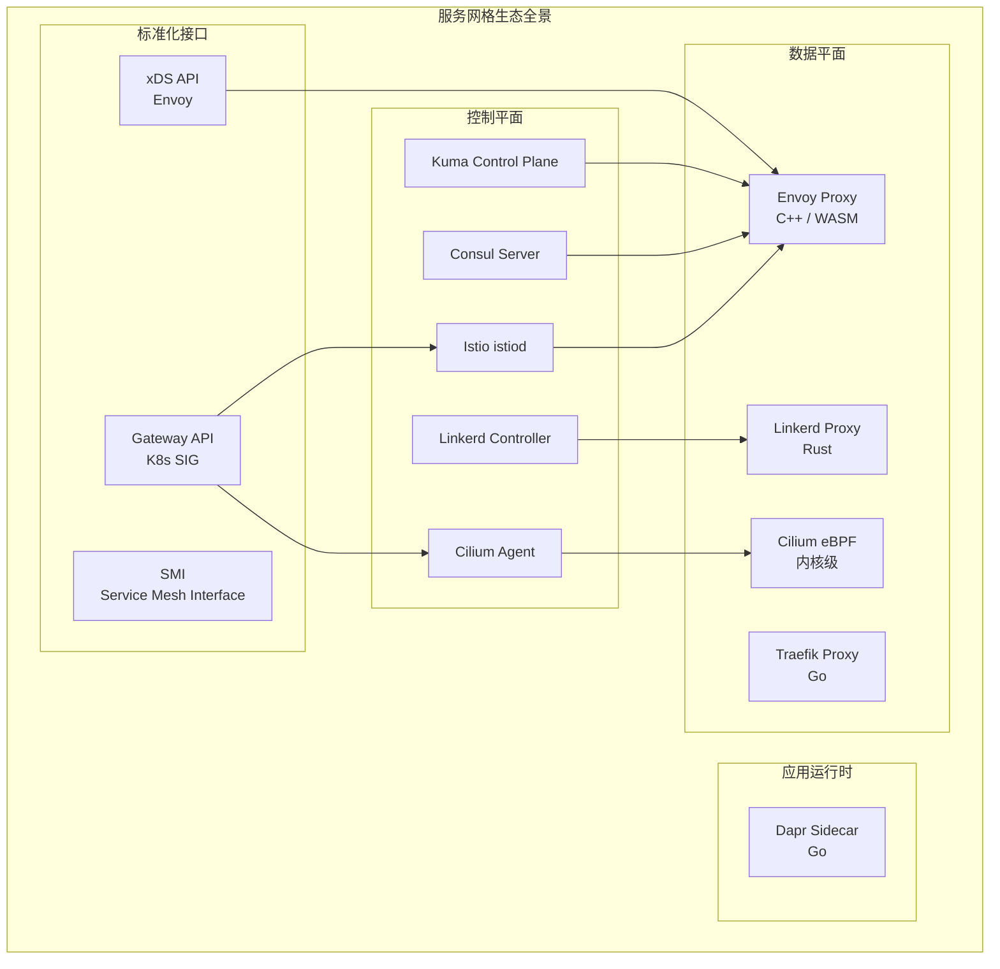
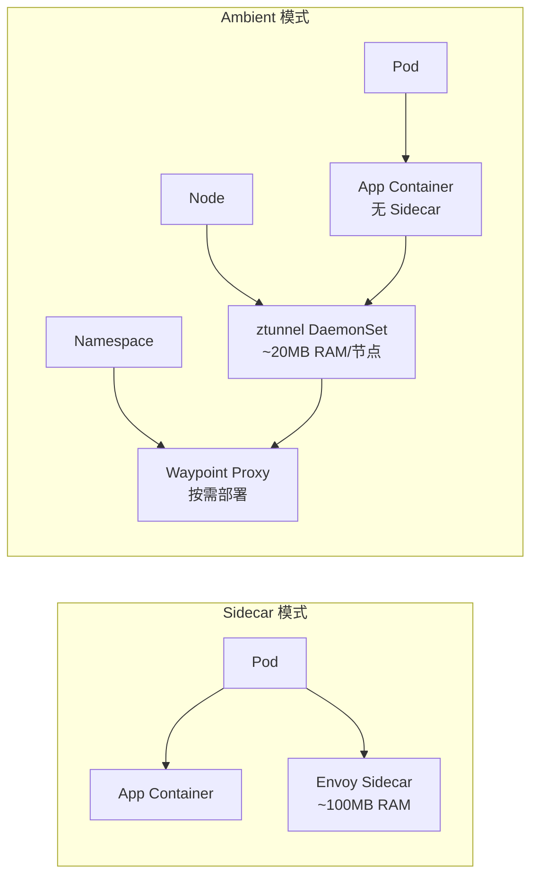
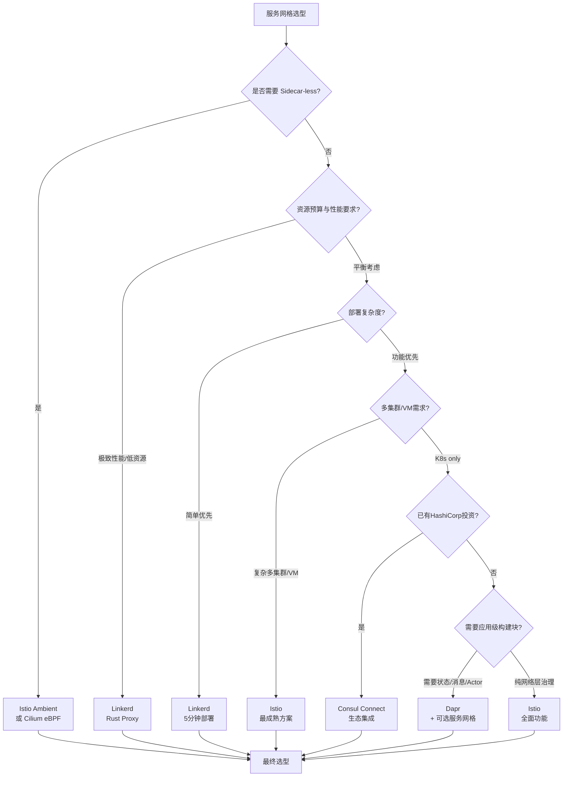

---
tags:
- mesh
- microservices
- istio
intent_queries:
- open-source-projects-index是什么？
- open-source-projects-index的使用方法
- open-source-projects-index的最佳实践

tier: peripheral---
title: Domain-26 服务网格与微服务 — 开源项目索引
description: '<!-- chunk: 概述' -->## 概述'
category: service-mesh-microservices
tags:
- k8s
- service-mesh
- istio
- envoy
- microservices
- etcd
- prometheus
- jaeger
- cilium
- helm
last_updated: 2026-05
difficulty: advanced
reading_level: advanced
audience:
- 架构师
- SRE
- 开发工程师
estimated_read_time: 10min
intent_queries:
- Domain-26 服务网格与微服务 — 开源项目索引 是什么
- 如何 Domain-26 服务网格与微服务 — 开源项目索引
- Kubernetes 26 service mesh microservices 最佳实践
trigger_keywords:
- Domain-26
- 服务网格与微服务
- 开源项目索引
- service
- mesh
- microservices
cross_refs:
- type: domain
  path: ../domain-03-networking-traffic/
  label: '相关知识域: domain-03-networking-traffic'
- type: domain
  path: ../domain-05-security-compliance/
  label: '相关知识域: domain-05-security-compliance'
authors:
- name: KUDIG Team
  role: contributor
k8s_versions:
- '1.28'
- '1.29'
- '1.30'
- '1.31'
- '1.32'
---

# Domain-26 服务网格与微服务 — 开源项目索引

> **最后更新**: 2026-04-24
> **适用版本**: Istio v1.29 / Linkerd v2.18 / Consul v1.20 / Envoy v1.33 / Dapr v1.15 / Cilium v1.17

---

<!-- chunk: 概述 -->## 概述

服务网格（Service Mesh）作为云原生微服务架构的核心基础设施层，在2026年已经从早期的概念验证阶段全面进入企业生产环境的主流部署阶段。随着微服务数量的指数级增长，传统基于代码库的治理方式已无法满足大规模分布式系统的流量管理、安全通信、可观测性等核心需求。服务网格通过将通信逻辑从应用代码中剥离，以基础设施层的形式透明地提供这些能力，使得开发团队能够专注于业务逻辑的实现。

本索引文档全面梳理了当前服务网格与微服务领域的核心开源项目生态，包括CNCF毕业项目（Istio、Linkerd、Envoy、Dapr）、HashiCorp生态的Consul Connect、新兴的基于eBPF的Cilium Service Mesh，以及Gateway API等标准化工作。每个项目从架构设计、核心特性、版本兼容性、适用场景等维度进行深度分析，并提供详尽的选型决策指南，帮助企业在纷繁复杂的技术栈中做出合理的技术决策。

2026年服务网格领域最显著的技术趋势包括：Istio Ambient Mesh（无Sidecar模式）的生产就绪、eBPF原生服务网格的崛起、Gateway API作为Kubernetes流量管理新标准的广泛采用，以及多运行时（Multi-Runtime）架构模式下Dapr等项目的蓬勃发展。这些趋势正在重塑企业级微服务架构的技术选型和实践方式。

---

<!-- chunk: 核心项目总览 -->## 核心项目总览

| 项目 | 定位 | CNCF 状态 | 最新版本 | Stars | License | 数据平面语言 |
|:---|:---|:---|:---|:---|:---|:---|
| **Istio** | 全功能服务网格 | Graduated | v1.29.0 | 36k+ | Apache-2.0 | C++ (Envoy) |
| **Linkerd** | 轻量级服务网格 | Graduated | v2.18.0 | 10k+ | Apache-2.0 | Rust |
| **Cilium** | eBPF 网络+服务网格 | Graduated | v1.17.0 | 21k+ | Apache-2.0 | eBPF/Go |
| **Envoy** | L7 代理与网关 | Graduated | v1.33.0 | 25k+ | Apache-2.0 | C++ |
| **Dapr** | 分布式应用运行时 | Graduated | v1.15.0 | 25k+ | Apache-2.0 | Go |
| **Kuma** | Envoy 服务网格 | Sandbox | v2.10.0 | 3k+ | Apache-2.0 | C++ (Envoy) |
| **Consul Connect** | HashiCorp 服务网格 | - | v1.20.0 | 28k+ | BSL-1.1 | C++ (Envoy) |
| **Gateway API** | K8s 流量管理标准 | K8s SIG | v1.2.0 | - | Apache-2.0 | - |
| **[[entities/emissary-ingress.md|emissary-ingress]]** | API 网关 | Incubating | v3.10.0 | 4.5k+ | Apache-2.0 | C++ (Envoy) |
| **Contour** | Envoy Ingress | Incubating | v1.30.0 | 3.5k+ | Apache-2.0 | C++ (Envoy) |
| **Traefik** | 云原生代理/网关 | - | v3.3 | 54k+ | MIT | Go |



---

<!-- chunk: Istio (CNCF Graduated) -->## Istio (CNCF Graduated)

## 核心架构

Istio 自2017年由Google、IBM、Lyft联合推出以来，已发展成为功能最全面、社区最活跃的服务网格平台。2023年从CNCF毕业后，Istio 持续在企业级场景中占据主导地位。

```yaml
架构分层:
  数据平面:
    - Envoy Proxy: 以 Sidecar 或 Ambient 模式部署
    - 职责: 流量拦截、负载均衡、TLS终止、可观测性数据采集

  控制平面 (istiod 单体架构):
    - Pilot: 服务发现与配置下发 (xDS API)
    - Citadel: 证书管理与自动轮换
    - Galley: 配置验证与转换
    - 优势: 简化部署、降低资源消耗、减少组件间通信开销
```

## 关键特性详解

| 特性 | 说明 | 生产级配置要点 |
|:---|:---|:---|
| 流量管理 | VirtualService、DestinationRule、流量分割、超时重试、故障注入 | 合理设置连接池、异常检测阈值避免级联问题 |
| 安全 | mTLS (STRICT/PERMISSIVE)、AuthorizationPolicy、RequestAuthentication、JWT | 生产环境必须启用 STRICT 模式 mTLS |
| 可观测性 | 自动指标、分布式追踪、访问日志、Kiali 拓扑 | 设置合理采样率避免开销过大 |
| 多集群 | 单网络/多网络多集群、外部控制平面、跨集群故障转移 | 确保网络连通性和时钟同步 |
| VM 扩展 | WorkloadEntry 将非 K8s 工作负载纳入网格 | 注意证书分发和健康检查配置 |
| Ambient Mesh | 无 Sidecar 模式 (ztunnel + waypoints) | 适合资源敏感场景和新部署 |
| Gateway API | 原生支持 K8s Gateway API 标准 | 推荐用于新项目替代 Ingress |

## Ambient Mesh (无 Sidecar 模式)

Istio Ambient Mesh 是服务网格架构演进的重要里程碑，通过消除每个 Pod 的 Sidecar 代理，大幅降低资源开销和运维复杂度：

- **ztunnel**: 每个节点部署一个 DaemonSet，负责 L4 层的 mTLS 加密和流量路由，基于 Rust 实现的高性能节点级代理
- **waypoint proxy**: 按需部署的 L7 层代理（基于 Envoy），仅对需要 L7 策略（如流量分割、授权策略）的命名空间或服务启用
- **架构优势**: Pod 启动不再依赖 Sidecar 注入、资源占用降低50%以上、运维复杂度显著降低、支持增量式从 Sidecar 迁移
- **生产状态**: Istio v1.29 中 Ambient 模式功能完善，已具备生产可用能力



## 版本支持策略

Istio 采用N-3版本支持策略，每个版本维护约6个月：

| 版本 | 发布日期 | 支持终止 | K8s 兼容 | 核心特性 |
|:---|:---|:---|:---|:---|
| v1.29 | 2026.02 | ~2026.08 | 1.31-1.35 | Ambient GA、Gateway API增强 |
| v1.28 | 2025.11 | ~2026.05 | 1.30-1.34 | Ambient Beta、多集群优化 |
| v1.27 | 2025.08 | 2026.04 | 1.29-1.33 | Ambient Alpha |
| v1.26 | 2025.05 | 2025.12 | 1.29-1.33 | Waypoint增强 |

**GitHub**: https://github.com/istio/istio
**文档**: https://istio.io/latest/docs/

---

<!-- chunk: Linkerd (CNCF Graduated) -->## Linkerd (CNCF Graduated)

## 核心哲学与设计理念

Linkerd 诞生于2016年，是最早的服务网格项目（最初基于 Finagle/Scala，后以 Rust 重写数据平面），于2021年成为第二个CNCF毕业的服务网格项目。Linkerd 坚守"极简主义"设计哲学，在功能覆盖度和运维简洁性之间做出了明确的取舍：

```yaml
设计原则:
  极简主义:
    - 最小配置集: 核心功能开箱即用
    - 最快安装: 单条命令完成部署
    - 最少组件: 控制平面仅4个组件

  性能优先:
    - Rust 编写数据平面: 零成本抽象、无GC暂停
    - 亚毫秒级延迟增加: 典型场景 P99 增加 < 1ms
    - 极低内存占用: 每代理 ~20MB（对比 Envoy ~100MB+）

  安全默认:
    - 自动 mTLS: 安装即启用，零配置
    - SPIFFE/SPIRE 身份: 标准 workload identity
    - Vault/cert-manager 集成: 外部 CA 支持

  可观测性内置:
    - 黄金指标: 成功率、延迟、吞吐量自动采集
    - 无需额外配置: Prometheus 指标自动导出
    - viz 扩展: 一键安装仪表板和监控
```

## 架构组件

| 组件 | 作用 | 资源建议 |
|:---|:---|:---|
| linkerd-proxy (Rust) | 超轻量级 sidecar，透明代理 | CPU: 10-100m, Memory: 20-50Mi |
| destination controller | 服务发现、端点解析 | CPU: 50-200m, Memory: 50-128Mi |
| identity controller | 证书签发（基于 trust anchor） | CPU: 50-100m, Memory: 50-128Mi |
| proxy-injector | Sidecar 自动注入 Webhook | CPU: 50-100m, Memory: 50-128Mi |
| tap / viz | 流量观察与仪表板 | CPU: 50-200m, Memory: 50-256Mi |

## 与 Istio 核心差异对比

| 维度 | Istio | Linkerd |
|:---|:---|:---|
| 资源占用 (每Pod) | 较高 (Envoy ~100MB+ RAM) | 极低 (Rust proxy ~20MB RAM) |
| 功能丰富度 | 极高 (L4-L7全覆盖) | 核心功能覆盖 (L4 + 基础L7) |
| 学习曲线 | 陡峭 (大量CRD和概念) | 平缓 (最小API面) |
| 多集群 | 成熟 (多种拓扑) | 基础支持 (gateway镜像) |
| VM 扩展 | 成熟 (WorkloadEntry) | 有限 |
| Ambient/Sidecar-less | Ambient (ztunnel + waypoint) | 仅 Sidecar |
| WASM 扩展 | 支持 | 不支持 |
| 社区规模 | 极大 (36000+ stars) | 大 (10000+ stars) |
| 企业支持 | Solo.io / Tetrate | Buoyant |
| 适用场景 | 大型企业复杂场景 | 中小型团队、性能敏感 |

**GitHub**: https://github.com/linkerd/linkerd2
**文档**: https://linkerd.io/2/overview/

---

<!-- chunk: Cilium Service Mesh -->## Cilium Service Mesh

## eBPF 原生服务网格

Cilium 基于 eBPF（Extended Berkeley Packet Filter）技术实现了内核级的服务网格能力，代表了服务网格技术演进的下一个方向。与传统的用户空间代理模式不同，Cilium 将网络和安全处理逻辑直接嵌入 Linux 内核，消除了用户态/内核态切换的开销。

```yaml
核心特性:
  内核级实现:
    - eBPF 程序挂载在内核网络栈关键节点
    - 无需 Sidecar 代理
    - 无 iptables 规则开销
    - 与 Cilium CNI 深度集成

  兼容性:
    - 兼容 Istio API (VirtualService, DestinationRule)
    - 兼容 Gateway API
    - 基于 Envoy 的 L7 代理 (仅需要时启用)

  安全策略:
    - 三层/四层/七层网络策略统一
    - 基于 Identity 的安全模型
    - 与 K8s NetworkPolicy 兼容

  性能:
    - 无 iptables 开销
    - 连接跟踪在内核态完成
    - 服务转发延迟低于 Sidecar 模式
```

## 三种服务模式

| 模式 | 描述 | 性能 | 适用场景 |
|:---|:---|:---|:---|
| LoadBalancer + Network Policy | L4 负载均衡 + 安全策略 | 最优 (内核级) | 基础服务发现与安全 |
| Envoy Extension (per-node) | 节点级 L7 代理 | 优秀 | L7 流量管理需求 |
| Sidecar (per-pod) | 传统 Sidecar 模式 | 标准 | 兼容性要求最高 |

**GitHub**: https://github.com/cilium/cilium
**文档**: https://docs.cilium.io/en/stable/service-mesh/

---

<!-- chunk: Envoy 与网关生态 -->## Envoy 与网关生态

## Envoy (CNCF Graduated)

Envoy 是由 Lyft 开发的高性能 L3/L4/L7 代理，自2017年加入CNCF后迅速成为云原生服务代理的事实标准。几乎所有主流服务网格（Istio、Consul Connect、Kuma）和API网关（Emissary、Contour、Envoy Gateway）都选择 Envoy 作为数据平面：

```yaml
核心能力:
  代理协议:
    - HTTP/1.1, HTTP/2, HTTP/3 (QUIC)
    - gRPC, TCP, UDP, WebSocket
    - Thrift, Redis, MongoDB, MySQL, PostgreSQL (部分L7)

  动态配置:
    - xDS API (LDS/RDS/CDS/EDS/VHDS)
    - 增量 xDS (Delta xDS) 减少配置推送量
    - ADS (Aggregated Discovery Service) 保证配置一致性

  高级流量管理:
    - 多种负载均衡算法 (Round Robin, Weighted, Ring Hash, Maglev, Least Request)
    - 熔断器、异常检测
    - 重试、超时、速率限制
    - 故障注入

  可扩展性:
    - WASM (WebAssembly) 过滤器
    - Lua 脚本
    - 自定义 HTTP/TCP 过滤器

  可观测性:
    - 丰富的指标输出 (Statsd, Prometheus, DogStatsD)
    - 分布式追踪 (Zipkin, Jaeger, Datadog, Lightstep)
    - 详细访问日志
    - 管理接口 (Runtime 配置、调试端点)
```

## Gateway API (K8s SIG)

Gateway API 是 Kubernetes 社区推动的新一代流量管理标准，旨在取代传统的 Ingress 资源：

```yaml
资源模型层次:
  GatewayClass:
    - 定义网关基础设施类型 (类似 StorageClass)
    - 由基础设施团队管理

  Gateway:
    - 定义网关实例 (监听端口、TLS、协议)
    - 由平台团队管理

  Route (HTTPRoute/TCPRoute/GRPCRoute/UDPRoute/TLSRoute):
    - 定义具体路由规则
    - 由应用团队管理

核心优势:
  - 多角色模型: 基础设施/平台/应用团队职责分离
  - 多租户: 支持跨命名空间路由、共享网关
  - 可扩展: 支持策略附件 (PolicyAttachment)
  - 可移植: 标准 API，多家实现兼容

已支持实现:
  - Istio (v1.22+)
  - Envoy Gateway (官方)
  - Cilium
  - Kong
  - Traefik
  - NGINX
  - HAProxy
```

## 网关实现对比

| 项目 | 基于 | 特点 | Gateway API | 适用场景 |
|:---|:---|:---|:---|:---|
| Emissary-Ingress | Envoy | 声明式 API 网关、K8s 原生 | 支持 | 微服务 API 网关 |
| Contour | Envoy | Heptio/VMware 背景、轻量 | 支持 | Envoy Ingress 首选 |
| Envoy Gateway | Envoy | 官方 K8s 集成、Gateway API 优先 | 原生 | 新项目推荐 |
| Kong Gateway | NGINX/OpenResty | API 管理丰富、插件生态 | 支持 | API 管理需求强 |
| Traefik | Go 原生 | 云原生友好、自动发现 | 支持 | 简单快速部署 |
| Higress | Envoy | 阿里云开源、WASM插件 | 支持 | 企业级 API 网关 |

---

<!-- chunk: Dapr 分布式应用运行时 -->## Dapr 分布式应用运行时

## 定位与价值

Dapr (Distributed Application Runtime) 是微软发起的分布式应用运行时项目，与传统的服务网格有着本质区别。Dapr 不在网络层提供透明代理，而是在应用层通过标准化的 HTTP/gRPC API 提供分布式系统能力的构建块（Building Blocks）。这种定位使得 Dapr 与服务网格互补而非竞争：

```yaml
构建块 (Building Blocks):
  服务调用:
    - Service-to-service invocation: mTLS + 重试 + 负载均衡
    - 名称解析: K8s DNS / Consul / mDNS

  状态管理:
    - 多后端支持: Redis / MongoDB / PostgreSQL / Azure Cosmos DB / AWS DynamoDB
    - 支持 CRUD、事务、ETag 并发控制
    - Actor 状态存储专用接口

  发布订阅:
    - 多 Broker 支持: Kafka / RabbitMQ / NATS / Azure Service Bus / AWS SNS/SQS
    - At-least-once 语义、死信队列

  绑定:
    - 外部系统触发: HTTP / gRPC / Cron / Kafka / MQTT / AWS S3 / Azure Blob
    - 输入/输出绑定抽象

  Actor:
    - 虚拟 Actor 模型: 自动激活/停用
    - 定时器/提醒器
    - 状态管理集成

  可观测性:
    - 自动分布式追踪 (OpenTelemetry / Zipkin)
    - 指标导出 (Prometheus)
    - 日志关联

  配置:
    - 动态配置热更新
    - 多后端: K8s ConfigMap / Redis / Azure App Configuration

  密钥管理:
    - 统一密钥访问接口
    - 多后端: K8s Secrets / Azure Key Vault / AWS Secrets Manager / HashiCorp Vault

  分布式锁:
    - 跨实例互斥
    - 多后端: Redis / etcd
```

## 与服务网格协同关系

| 维度 | Dapr | 服务网格 (Istio/Linkerd) |
|:---|:---|:---|
| 抽象层 | 应用层 (HTTP/gRPC SDK) | 网络层 (透明代理) |
| 服务发现 | 通过 Dapr sidecar (应用级) | 通过数据平面 (网络级) |
| 可观测性 | 应用级指标与追踪 | 网络级指标与追踪 |
| 状态管理 | 内置多种后端 | 不涉及 |
| 消息传递 | 内置 pub/sub | 不涉及 |
| Actor 模型 | 内置虚拟 Actor | 不涉及 |
| 配置管理 | 内置动态配置 | 不涉及 |
| 可以共存 | 推荐与 Istio 一起使用 | 推荐 |
| 部署方式 | SDK + Sidecar | Sidecar / Ambient |

**最佳实践**: 在大规模微服务场景中，Dapr 负责应用级能力（状态、消息、Actor），服务网格负责网络级能力（mTLS、流量管理、网络策略），两者协同工作形成完整的微服务治理体系。

**GitHub**: https://github.com/dapr/dapr
**文档**: https://docs.dapr.io/

---

<!-- chunk: Consul Connect (HashiCorp) -->## Consul Connect (HashiCorp)

## 企业级服务网格与 HashiCorp 生态集成

Consul Connect 是 HashiCorp Consul 的服务网格扩展，将服务发现、配置管理、服务网格能力统一在一个平台中。其核心差异化优势在于与 HashiCorp 生态（Terraform、Vault、Nomad）的深度集成，以及对 Kubernetes 和虚拟机工作负载的统一管理能力：

```yaml
核心特性:
  服务发现:
    - 原生 Consul DNS 和 HTTP API
    - 健康检查驱动的服务注册
    - 多数据中心支持

  服务网格:
    - 意图 (Intentions) 驱动的访问控制
    - 自动 mTLS 加密
    - Envoy 代理数据平面
    - Mesh Gateway 跨数据中心通信

  配置管理:
    - KV 存储动态配置
    - 配置条目 (Config Entries) 管理网格行为

  安全:
    - ACL (Access Control List) 细粒度权限
    - Vault 集成证书管理
    - TLS 加密所有通信

  多平台:
    - Kubernetes: Helm 部署 + CRD 管理
    - Nomad: 原生支持
    - 虚拟机: 传统 Consul Agent

  License:
    - BSL-1.1 (Business Source License)
    - 社区版功能完整
    - Enterprise: 多集群联邦、高级分区、RBAC
```

**GitHub**: https://github.com/hashicorp/consul
**文档**: https://developer.hashicorp.com/consul

---

<!-- chunk: 其他服务网格项目 -->## 其他服务网格项目

## Kuma (Kong)

Kuma 是 Kong 公司开源的基于 Envoy 的服务网格平台，提供 Universal 和 Kubernetes 两种部署模式。其核心特色在于与 Kong Gateway 的天然集成和 Multi-Zone 多区域管理能力：

```yaml
特性:
  数据平面: Envoy 代理
  部署模式:
    - Kubernetes: 原生 CRD 管理
    - Universal: 支持虚拟机和裸金属
  Multi-Zone: 跨集群/区域的服务发现和策略同步
  策略系统: Mesh-wide 默认策略 + Namespace/Service 覆盖
  Kong 集成: 与 Kong Gateway 统一 API 管理和服务网格
  CNCF 状态: Sandbox
```

**GitHub**: https://github.com/kumahq/kuma

---

<!-- chunk: 版本兼容矩阵 -->## 版本兼容矩阵

| 组件 | K8s v1.31 | v1.32 | v1.33 | 备注 |
|:---|:---|:---|:---|:---|
| Istio v1.29 | ✅ | ✅ | ✅ | Ambient GA、推荐升级 |
| Linkerd v2.18 | ✅ | ✅ | ✅ | 稳定版 |
| Cilium v1.17 | ✅ | ✅ | ✅ | Service Mesh + Network |
| Envoy v1.33 | ✅ | ✅ | ✅ | 独立代理 |
| Dapr v1.15 | ✅ | ✅ | ✅ | Graduated |
| Gateway API v1.2 | ✅ | ✅ | ✅ | K8s 原生标准 |
| Kuma v2.10 | ✅ | ✅ | ✅ | Kong 生态 |
| Consul v1.20 | ✅ | ✅ | ✅ | HashiCorp 生态 |

---

<!-- chunk: 服务网格选型决策指南 -->## 服务网格选型决策指南

## 选型决策树



## 场景化选型推荐

| 企业场景 | 推荐方案 | 理由 |
|:---|:---|:---|
| 初创/小团队 (<10人) | Linkerd | 零学习成本、最低资源 |
| 大型企业 (>100服务) | Istio | 功能最全、社区最大 |
| 资源敏感 (边缘/IoT) | Linkerd 或 Ambient | 最小内存/CPU开销 |
| 已有 HashiCorp 全家桶 | Consul Connect | 生态集成、统一管理 |
| 多运行时架构 | Dapr + Istio | 应用层 + 网络层互补 |
| 追求极致性能 | Cilium (eBPF) | 内核级、无用户态开销 |
| 已有 Kong 网关投资 | Kuma | 与 Kong Gateway 统一 |
| K8s 新项目、标准化优先 | Istio + Gateway API | 长期标准、社区驱动 |
| 需要应用级重试/熔断 | Resilience4j + Istio | 应用层+网格层双保险 |

---

<!-- chunk: 参考链接 -->## 参考链接

- [Istio 官方文档](https://istio.io/latest/docs/)
- [Linkerd 官方文档](https://linkerd.io/2/overview/)
- [Cilium Service Mesh](https://docs.cilium.io/en/stable/service-mesh/)
- [Dapr 官方文档](https://docs.dapr.io/)
- [Gateway API 官方](https://gateway-api.sigs.k8s.io/)
- [Envoy 官方文档](https://www.envoyproxy.io/docs/)
- [Consul 官方文档](https://developer.hashicorp.com/consul)
- [Kuma 官方文档](https://kuma.io/docs/)
- [CNCF 服务网格白皮书](https://github.com/cncf/tag-network/blob/main/service-mesh-whitepaper.md)
- [Service Mesh Interface (SMI)](https://smi-spec.io/)

---

<!-- chunk: Obsidian 相关文档 -->## Obsidian 相关文档

- domain-03-networking-traffic MOC
- [[domain-03-networking-traffic/README.md|Domain 03: 企业级服务网格与微服务治理 (Enterprise Service Mesh & Microser...]]
- Istio 企业级服务网格架构与实践
- Linkerd 企业级服务网格深度实践
- Consul Connect 企业级服务网格管理
- Envoy Proxy 企业级服务网格数据平面深度实践
- Dapr (Distributed Application Runtime) Enterprise 深度实践
- Traefik Mesh Enterprise Service Mesh 深度实践
- 服务网格对比与选型决策指南
- Istio Ambient Mesh 与 L7 策略深度实践
- 微服务弹性模式深度实践 — Circuit Breaker, Retry, Timeout, Bulkhead, Rat...
- API 网关与服务网格集成深度实践
