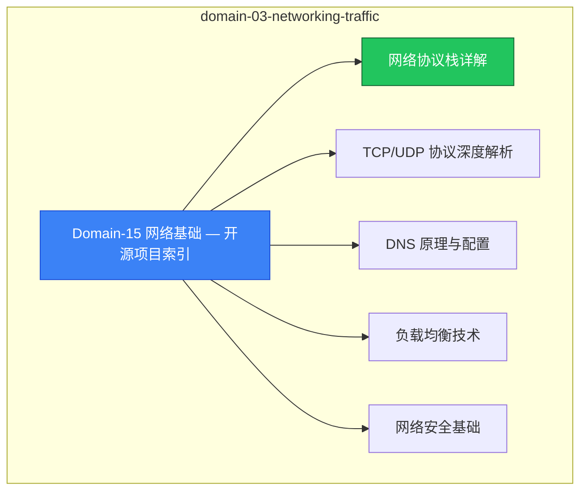

# domain-03-networking-traffic MOC

> **MOC 版本**: 1.0
> **知识域**: domain-03-networking-traffic
> **文档数量**: 8 篇
> **最后更新**: 2026-05-21
> **用途**: 本知识域的导航入口，汇总所有相关文档、关联领域、和场景入口

---

## 领域概述

网络基础 — TCP/IP、HTTP、DNS、负载均衡原理

### 知识域定位

| 维度 | 说明 |
|---|---|
| **知识域** | domain-03-networking-traffic |
| **文档数量** | 8 篇 |
| **难度分布** | 入门 0 / 进阶 0 / 高级 0 / 专家 0 |

---

## 文档清单

| # | 文档 | 难度 | 标签 | 估计阅读时间 |
|---|---|---|---|---|
| 1 | Domain-15 网络基础 — 开源项目索引 |  | networking, fundamentals |  |
| 2 | 网络协议栈详解 |  | networking, fundamentals |  |
| 3 | TCP/UDP 协议深度解析 |  | networking, fundamentals |  |
| 4 | DNS 原理与配置 |  | networking, fundamentals, configuration |  |
| 5 | 负载均衡技术 |  | networking, fundamentals |  |
| 6 | 网络安全基础 |  | networking, fundamentals, security |  |
| 7 | SDN 与网络虚拟化 |  | networking, fundamentals |  |
| 8 | Cilium eBPF 网络与安全实践指南 |  | networking, fundamentals, guide |  |

---

## 知识图谱

---

## 关联入口

| 入口 | 说明 |
|---|---|
| FTA 故障树 | domain-03-networking-traffic 相关故障树分析 |
| Skills 技能 | domain-03-networking-traffic 相关操作技能 |
| 深度研究入口 | 语料库索引与向量检索 |

---

## 统计信息

| 指标 | 数值 |
|---|---|
| 文档总数 | 8 |
| 覆盖 K8s 版本 | v1.25 - v1.32 |

---

*本文档由 scripts/generate-mocs.py 自动生成，最后更新 2026-05-21。*
