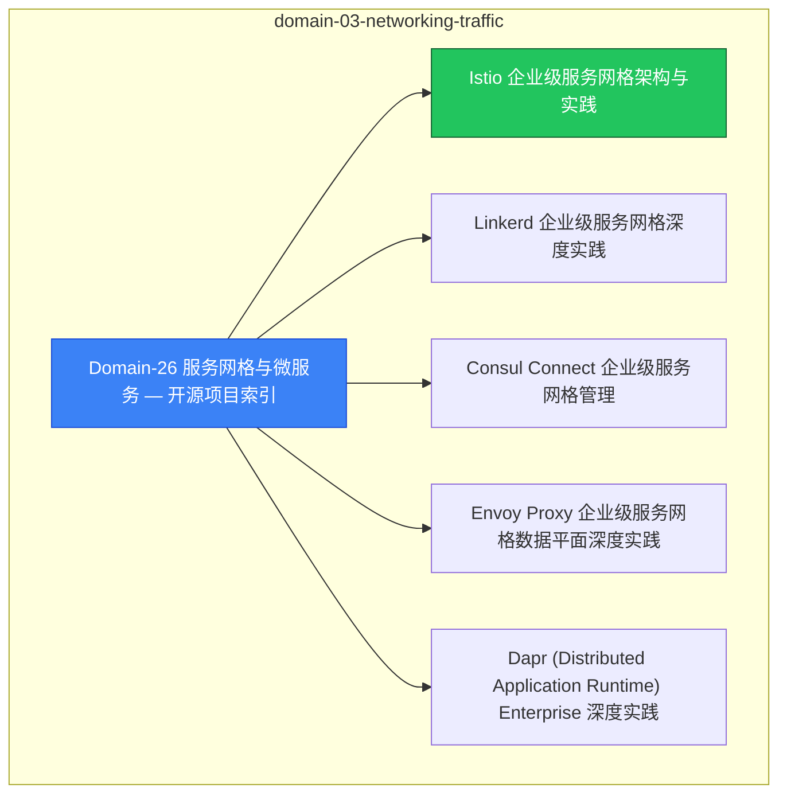

# domain-03-networking-traffic [[MOC]]

> **MOC 版本**: 1.0
> **知识域**: domain-03-networking-traffic
> **文档数量**: 14 篇
> **最后更新**: 2026-05-21
> **用途**: 本知识域的导航入口，汇总所有相关文档、关联领域、和场景入口

---

## 领域概述

Service Mesh 与微服务 — Istio、Envoy、微服务架构

### 知识域定位

| 维度 | 说明 |
|---|---|
| **知识域** | domain-03-networking-traffic |
| **文档数量** | 14 篇 |
| **难度分布** | 入门 0 / 进阶 0 / 高级 0 / 专家 0 |

---

## 文档清单

| # | 文档 | 难度 | 标签 | 估计阅读时间 |
|---|---|---|---|---|
| 1 | [[domain-03-networking-traffic/00-open-source-projects-index.md|Domain-26 服务网格与微服务 — 开源项目索引]] |  | mesh, microservices, istio |  |
| 2 | [[domain-03-networking-traffic/01-istio-enterprise-service-mesh.md|Istio 企业级服务网格架构与实践]] |  | mesh, microservices, istio |  |
| 3 | [[domain-03-networking-traffic/02-linkerd-enterprise-service-mesh.md|Linkerd 企业级服务网格深度实践]] |  | mesh, microservices, istio |  |
| 4 | [[domain-03-networking-traffic/03-consul-connect-enterprise.md|Consul Connect 企业级服务网格管理]] |  | mesh, microservices, istio |  |
| 5 | [[domain-03-networking-traffic/04-envoy-proxy-enterprise.md|Envoy Proxy 企业级服务网格数据平面深度实践]] |  | mesh, microservices, istio |  |
| 6 | [[domain-03-networking-traffic/05-dapr-enterprise-distributed-runtime.md|Dapr (Distributed Application Runtime) Enterprise 深度实践]] |  | mesh, microservices, istio |  |
| 7 | [[domain-03-networking-traffic/06-traefik-mesh-enterprise.md|Traefik Mesh Enterprise Service Mesh 深度实践]] |  | mesh, microservices, istio |  |
| 8 | [[domain-03-networking-traffic/07-service-mesh-comparison-selection.md|服务网格对比与选型决策指南]] |  | mesh, microservices, istio |  |
| 9 | [[domain-03-networking-traffic/08-ambient-mesh-l7-policy.md|Istio Ambient Mesh 与 L7 策略深度实践]] |  | mesh, microservices, istio |  |
| 10 | [[domain-03-networking-traffic/09-microservice-resilience-patterns.md|微服务弹性模式深度实践 — Circuit Breaker, Retry, Timeout, Bulkhead, Rate Limiting]] |  | mesh, microservices, istio |  |
| 11 | [[domain-03-networking-traffic/10-api-gateway-service-mesh-integration.md|API 网关与服务网格集成深度实践]] |  | mesh, microservices, istio |  |
| 12 | [[domain-03-networking-traffic/99-istio-service-mesh-guide.md|Istio 企业级服务网格入门指南]] |  | mesh, microservices, istio |  |
| 13 | [[domain-03-networking-traffic/99-linkerd-service-mesh-guide.md|Linkerd 轻量级服务网格实践指南]] |  | mesh, microservices, istio |  |
| 14 | [[domain-03-networking-traffic/99-spring-cloud-kubernetes-service-mesh-guide.md|Spring Cloud Kubernetes 与服务网格集成指南]] |  | mesh, microservices, istio |  |

---

## 知识图谱

---

## 关联入口

| 入口 | 说明 |
|---|---|
| [[../domain-10-troubleshooting-diagnostics/topic-fta/MOC.md|FTA 故障树]] | domain-03-networking-traffic 相关故障树分析 |
| [[../domain-10-troubleshooting-diagnostics/topic-skills/MOC.md|Skills 技能]] | domain-03-networking-traffic 相关操作技能 |
| [[../domain-19-landscape-references/topic-index/README.md|深度研究入口]] | 语料库索引与向量检索 |

---

## 统计信息

| 指标 | 数值 |
|---|---|
| 文档总数 | 14 |
| 覆盖 K8s 版本 | v1.25 - v1.32 |

---

*本文档由 scripts/generate-mocs.py 自动生成，最后更新 2026-05-21。*

## Related

- [[README]]
- [[README]]
- [[MOC]]

- [[domain-07-platform-engineering/topic-code-analysis/MOC.md|topic-functions MOC]]