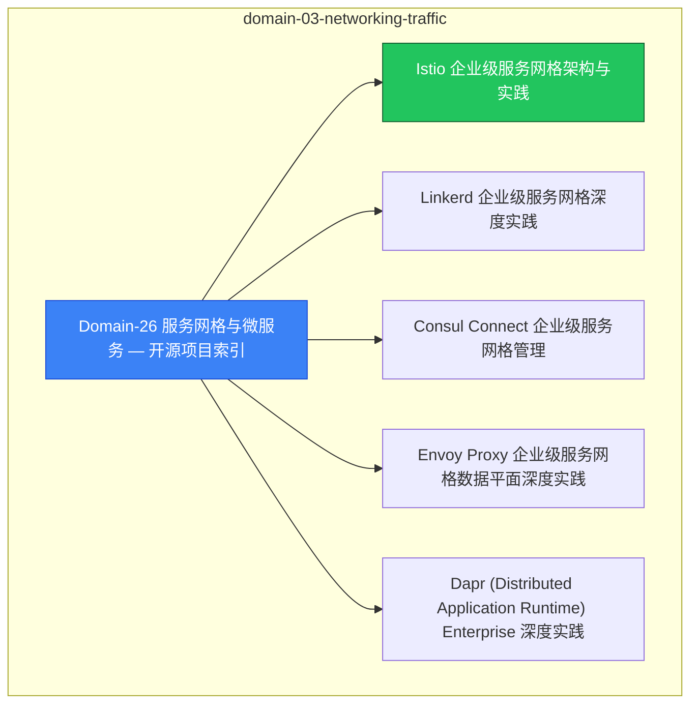

# domain-03-networking-traffic [[MOC]]

> **MOC 版本**: 1.0
> **知识域**: domain-03-networking-traffic
> **文档数量**: 14 篇
> **最后更新**: 2026-05-21
> **用途**: 本知识域的导航入口，汇总所有相关文档、关联领域、和场景入口

---

## 领域概述

Service Mesh 与微服务 — Istio、Envoy、微服务架构

### 知识域定位

| 维度 | 说明 |
|---|---|
| **知识域** | domain-03-networking-traffic |
| **文档数量** | 14 篇 |
| **难度分布** | 入门 0 / 进阶 0 / 高级 0 / 专家 0 |

---

## 文档清单

| # | 文档 | 难度 | 标签 | 估计阅读时间 |
|---|---|---|---|---|
| 1 | Domain-26 服务网格与微服务 — 开源项目索引 |  | mesh, microservices, istio |  |
| 2 | Istio 企业级服务网格架构与实践 |  | mesh, microservices, istio |  |
| 3 | Linkerd 企业级服务网格深度实践 |  | mesh, microservices, istio |  |
| 4 | Consul Connect 企业级服务网格管理 |  | mesh, microservices, istio |  |
| 5 | Envoy Proxy 企业级服务网格数据平面深度实践 |  | mesh, microservices, istio |  |
| 6 | Dapr (Distributed Application Runtime) Enterprise 深度实践 |  | mesh, microservices, istio |  |
| 7 | Traefik Mesh Enterprise Service Mesh 深度实践 |  | mesh, microservices, istio |  |
| 8 | 服务网格对比与选型决策指南 |  | mesh, microservices, istio |  |
| 9 | Istio Ambient Mesh 与 L7 策略深度实践 |  | mesh, microservices, istio |  |
| 10 | 微服务弹性模式深度实践 — Circuit Breaker, Retry, Timeout, Bulkhead, Rate Limiting |  | mesh, microservices, istio |  |
| 11 | API 网关与服务网格集成深度实践 |  | mesh, microservices, istio |  |
| 12 | Istio 企业级服务网格入门指南 |  | mesh, microservices, istio |  |
| 13 | Linkerd 轻量级服务网格实践指南 |  | mesh, microservices, istio |  |
| 14 | Spring Cloud Kubernetes 与服务网格集成指南 |  | mesh, microservices, istio |  |

---

## 知识图谱

---

## 关联入口

| 入口 | 说明 |
|---|---|
| FTA 故障树 | domain-03-networking-traffic 相关故障树分析 |
| Skills 技能 | domain-03-networking-traffic 相关操作技能 |
| 深度研究入口 | 语料库索引与向量检索 |

---

## 统计信息

| 指标 | 数值 |
|---|---|
| 文档总数 | 14 |
| 覆盖 K8s 版本 | v1.25 - v1.32 |

---

*本文档由 scripts/generate-mocs.py 自动生成，最后更新 2026-05-21。*

## Related

- [[README]]
- [[README]]
- [[MOC]]

- [[domain-07-platform-engineering/topic-code-analysis/MOC.md|topic-functions MOC]]