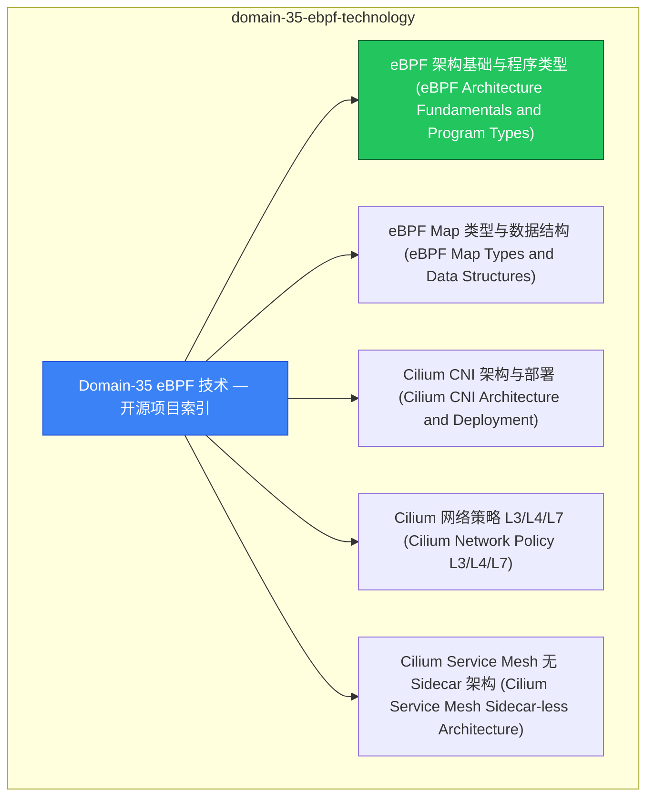

# domain-35-ebpf-technology MOC

> **MOC 版本**: 1.0
> **知识域**: domain-35-ebpf-technology
> **文档数量**: 11 篇
> **最后更新**: 2026-05-21
> **用途**: 本知识域的导航入口，汇总所有相关文档、关联领域、和场景入口

---

## 领域概述

eBPF 技术 — eBPF 原理、Cilium、网络/安全可观测性

### 知识域定位

| 维度 | 说明 |
|---|---|
| **知识域** | domain-35-ebpf-technology |
| **文档数量** | 11 篇 |
| **难度分布** | 入门 0 / 进阶 0 / 高级 0 / 专家 0 |

---

## 文档清单

| # | 文档 | 难度 | 标签 | 估计阅读时间 |
|---|---|---|---|---|
| 1 | Domain-35 eBPF 技术 — 开源项目索引 |  | ebpf, cilium |  |
| 2 | eBPF 架构基础与程序类型 (eBPF Architecture Fundamentals and Program Types) |  | ebpf, cilium, architecture |  |
| 3 | eBPF Map 类型与数据结构 (eBPF Map Types and Data Structures) |  | ebpf, cilium |  |
| 4 | Cilium CNI 架构与部署 (Cilium CNI Architecture and Deployment) |  | ebpf, cilium, architecture |  |
| 5 | Cilium 网络策略 L3/L4/L7 (Cilium Network Policy L3/L4/L7) |  | ebpf, cilium, networking |  |
| 6 | Cilium Service Mesh 无 Sidecar 架构 (Cilium Service Mesh Sidecar-less Architecture) |  | ebpf, cilium |  |
| 7 | Tetragon 运行时安全 (Tetragon Runtime Security) |  | ebpf, cilium, security |  |
| 8 | Hubble 网络可观测性 (Hubble Network Observability) |  | ebpf, cilium, observability |  |
| 9 | bcc 与 bpftrace 工具链 (bcc and bpftrace Tools) |  | ebpf, cilium |  |
| 10 | eBPF 性能优化实践 (eBPF Performance Optimization Practice) |  | ebpf, cilium, performance |  |
| 11 | eBPF 安全应用案例 (eBPF Security Applications and Use Cases) |  | ebpf, cilium, security |  |

---

## 知识图谱

---

## 关联入口

| 入口 | 说明 |
|---|---|
| FTA 故障树 | domain-35-ebpf-technology 相关故障树分析 |
| Skills 技能 | domain-35-ebpf-technology 相关操作技能 |
| 深度研究入口 | 语料库索引与向量检索 |

---

## 统计信息

| 指标 | 数值 |
|---|---|
| 文档总数 | 11 |
| 覆盖 K8s 版本 | v1.25 - v1.32 |

---

*本文档由 scripts/generate-mocs.py 自动生成，最后更新 2026-05-21。*
