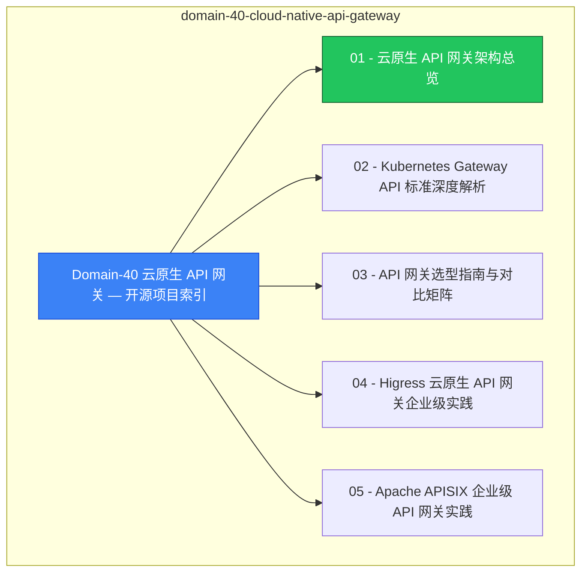

# domain-40-cloud-native-api-gateway MOC

> **MOC 版本**: 1.0
> **知识域**: domain-40-cloud-native-api-gateway
> **文档数量**: 16 篇
> **最后更新**: 2026-05-21
> **用途**: 本知识域的导航入口，汇总所有相关文档、关联领域、和场景入口

---

## 领域概述

云原生 API 网关 — Higress、Envoy Gateway、Kong

### 知识域定位

| 维度 | 说明 |
|---|---|
| **知识域** | domain-40-cloud-native-api-gateway |
| **文档数量** | 16 篇 |
| **难度分布** | 入门 0 / 进阶 0 / 高级 0 / 专家 0 |

---

## 文档清单

| # | 文档 | 难度 | 标签 | 估计阅读时间 |
|---|---|---|---|---|
| 1 | [[domain-03-networking-traffic/00-open-source-projects-index.md|Domain-40 云原生 API 网关 — 开源项目索引]] |  | gateway, api |  |
| 2 | [[domain-03-networking-traffic/01-api-gateway-architecture-overview.md|01 - 云原生 API 网关架构总览]] |  | gateway, api, deep-dive |  |
| 3 | [[domain-03-networking-traffic/02-kubernetes-gateway-api-deep-dive.md|02 - Kubernetes Gateway API 标准深度解析]] |  | gateway, api |  |
| 4 | [[domain-03-networking-traffic/03-api-gateway-selection-guide.md|03 - API 网关选型指南与对比矩阵]] |  | gateway, api, guide |  |
| 5 | [[domain-03-networking-traffic/04-higress-enterprise-gateway.md|04 - Higress 云原生 API 网关企业级实践]] |  | gateway, api |  |
| 6 | [[domain-03-networking-traffic/05-apisix-enterprise-gateway.md|05 - Apache APISIX 企业级 API 网关实践]] |  | gateway, api |  |
| 7 | [[domain-03-networking-traffic/06-kong-enterprise-gateway.md|06 - Kong API 网关企业级实践]] |  | gateway, api |  |
| 8 | [[domain-03-networking-traffic/07-envoy-gateway-enterprise.md|07 - Envoy Gateway 企业级实践]] |  | gateway, api |  |
| 9 | [[domain-03-networking-traffic/08-traefik-enterprise-gateway.md|08 - Traefik API 网关企业级实践]] |  | gateway, api |  |
| 10 | [[domain-03-networking-traffic/09-nginx-ingress-migration-guide.md|09 - 传统 Ingress 控制器向云原生 API 网关迁移]] |  | gateway, api, migration |  |
| 11 | [[domain-03-networking-traffic/10-wasm-plugin-ecosystem.md|10 - Wasm 插件生态与开发实践]] |  | gateway, api |  |
| 12 | [[domain-03-networking-traffic/11-api-gateway-security-practices.md|11 - API 网关安全体系：认证、鉴权与 WAF]] |  | gateway, api, security |  |
| 13 | [[domain-03-networking-traffic/12-api-gateway-observability.md|12 - API 网关可观测性：指标、日志与链路追踪]] |  | gateway, api, observability |  |
| 14 | [[domain-03-networking-traffic/13-api-gateway-performance-benchmarks.md|13 - API 网关性能基准测试与调优]] |  | gateway, api, performance |  |
| 15 | [[domain-03-networking-traffic/14-api-gateway-production-operations.md|14 - API 网关生产运维最佳实践]] |  | gateway, api, production |  |
| 16 | [[domain-03-networking-traffic/99-envoy-gateway-enterprise-guide.md|Envoy Gateway 企业级 API Gateway 实践指南]] |  | gateway, api, guide |  |

---

## 知识图谱

---

## 关联入口

| 入口 | 说明 |
|---|---|
| [[../domain-10-troubleshooting-diagnostics/topic-fta/MOC.md|FTA 故障树]] | domain-40-cloud-native-api-gateway 相关故障树分析 |
| [[../domain-10-troubleshooting-diagnostics/topic-skills/MOC.md|Skills 技能]] | domain-40-cloud-native-api-gateway 相关操作技能 |
| [[../domain-19-landscape-references/topic-index/README.md|深度研究入口]] | 语料库索引与向量检索 |

---

## 统计信息

| 指标 | 数值 |
|---|---|
| 文档总数 | 16 |
| 覆盖 K8s 版本 | v1.25 - v1.32 |

---

*本文档由 scripts/generate-mocs.py 自动生成，最后更新 2026-05-21。*
