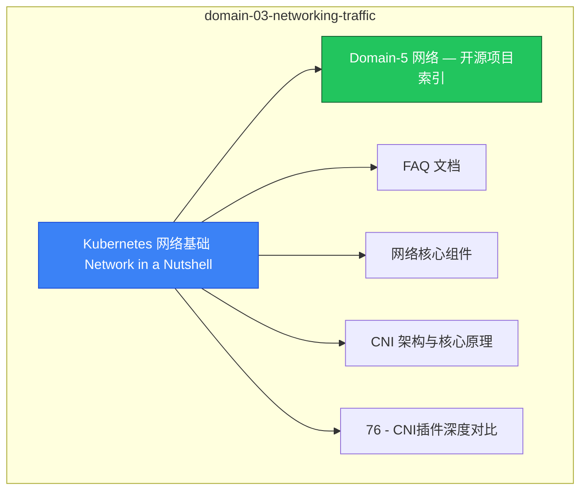

# domain-03-networking-traffic MOC

> **MOC 版本**: 1.0
> **知识域**: domain-03-networking-traffic
> **文档数量**: 55 篇
> **最后更新**: 2026-05-21
> **用途**: 本知识域的导航入口，汇总所有相关文档、关联领域、和场景入口

---

## 领域概述

网络 — Service、Ingress、CNI、网络策略、DNS、负载均衡

### 知识域定位

| 维度 | 说明 |
|---|---|
| **知识域** | domain-03-networking-traffic |
| **文档数量** | 55 篇 |
| **难度分布** | 入门 0 / 进阶 1 / 高级 1 / 专家 0 |

---

## 文档清单

| # | 文档 | 难度 | 标签 | 估计阅读时间 |
|---|---|---|---|---|
| 1 | Kubernetes 网络基础 Network in a Nutshell |  | k8s, networking, service |  |
| 2 | Domain-5 网络 — 开源项目索引 |  | k8s, networking, service |  |
| 3 | FAQ 文档 |  | k8s, networking, service |  |
| 4 | 网络核心组件 |  | k8s, networking, service |  |
| 5 | CNI 架构与核心原理 | 高级 | k8s, cni, network | 5min |
| 6 | 76 - CNI插件深度对比 |  | k8s, networking, service |  |
| 7 | 142 - Flannel 完整指南 (Flannel Complete Guide) |  | k8s, networking, service |  |
| 8 | Flannel WireGuard 加密后端配置 |  | k8s, networking, service |  |
| 9 | Flannel IPv6 Dual Stack 支持 |  | k8s, networking, service |  |
| 10 | Flannel Windows 节点支持 |  | k8s, networking, service |  |
| 11 | Flannel 多集群场景与子网冲突处理 |  | k8s, networking, service |  |
| 12 | flanneld 启动参数详解 |  | k8s, networking, service |  |
| 13 | 143 - Terway 高级指南 (Terway Advanced Guide) |  | k8s, networking, service |  |
| 14 | Kubernetes Service 核心概念与类型深度解析 | 进阶 | k8s, service, clusterip | 10min |
| 15 | 77 - Service实现机制 |  | k8s, networking, service |  |
| 16 | 72 - 服务拓扑与端点切片 |  | k8s, networking, service |  |
| 17 | Kube-proxy 实现模式与性能优化 (Kube-proxy Modes & Performance) |  | k8s, networking, service |  |
| 18 | Service 高级特性与应用案例 (Service Advanced Features) |  | k8s, networking, service |  |
| 19 | 04 - DNS 服务发现与 CoreDNS 调优 |  | k8s, networking, service |  |
| 20 | 33 - 服务发现与 DNS 配置 (Service Discovery & DNS) |  | k8s, networking, service |  |
| 21 | 53 - CoreDNS 架构与核心原理 (Architecture & Principles) |  | k8s, networking, service |  |
| 22 | 54 - CoreDNS Corefile 配置详解 (Corefile Configuration) |  | k8s, networking, service |  |
| 23 | 55 - CoreDNS 插件完整参考 (Plugins Reference) |  | k8s, networking, service |  |
| 24 | 01 - NetworkPolicy 深度实践指南 |  | k8s, networking, service |  |
| 25 | 78 - NetworkPolicy高级配置 |  | k8s, networking, service |  |
| 26 | 83 - 网络加密与mTLS |  | k8s, networking, service |  |
| 27 | Kubernetes Ingress 基础概念与核心原理 (Ingress Fundamentals) |  | k8s, networking, service |  |
| 28 | 128 - Ingress Controller 深入剖析 |  | k8s, networking, service |  |
| 29 | 129 - NGINX Ingress 完整配置指南 |  | k8s, networking, service |  |
| 30 | 130 - Ingress TLS 与证书管理 |  | k8s, networking, service |  |
| 31 | 131 - Ingress 高级路由与流量管理 |  | k8s, networking, service |  |
| 32 | 132 - Ingress 安全加固与防护 |  | k8s, networking, service |  |
| 33 | 133 - Ingress 监控与故障排查 |  | k8s, networking, service |  |
| 34 | 134 - Ingress 生产最佳实践 |  | k8s, networking, service |  |
| 35 | 144 - CNI 故障排查与优化 (CNI Troubleshooting & Optimization) |  | k8s, networking, service |  |
| 36 | 56 - CoreDNS 故障排查与性能优化 (Troubleshooting & Optimization) |  | k8s, networking, service |  |
| 37 | 59 - Egress流量管理 |  | k8s, networking, service |  |
| 38 | 02 - Service Mesh 深度解析与生产实践 |  | k8s, networking, service |  |
| 39 | 03 - 多集群网络联邦与跨集群通信 |  | k8s, networking, service |  |
| 40 | 80 - 多集群网络互联 |  | k8s, networking, service |  |
| 41 | 33 - 网络故障诊断与链路排查 (Network Troubleshooting & Data Path Diagnosis) |  | k8s, networking, service |  |
| 42 | 84 - 网络性能调优 |  | k8s, networking, service |  |
| 43 | 71 - Gateway API配置 |  | k8s, networking, service |  |
| 44 | 38 - Ingress和API Gateway对比表 |  | k8s, networking, service |  |
| 45 | 37 - Terway 实例 CRUD 操作指南 (Terway Resources CRUD Operations) |  | k8s, networking, service |  |
| 46 | 38 - Terway GC (垃圾回收) 机制详解 (Terway Garbage Collection Mechanism) |  | k8s, networking, service |  |
| 47 | CSI / CNI 版本兼容矩阵 |  | k8s, networking, service |  |
| 48 | 01 - Terway 产品概览 (Product Overview) |  | terway, networking, cni |  |
| 49 | 02 - Terway 架构原理 (Architecture Deep Dive) |  | terway, networking, cni |  |
| 50 | 03 - Terway 使用指南 (Usage Guide) |  | terway, networking, cni |  |
| 51 | 03b - Terway CRD 深度操作指南 (CRD Operations Deep Dive) |  | terway, networking, cni |  |
| 52 | 04 - Terway 运维手册 (Operations Manual) |  | terway, networking, cni |  |
| 53 | 05 - Terway 测试验证 (Testing & Validation) |  | terway, networking, cni |  |
| 54 | 06 - Terway 性能调优 (Performance Tuning) |  | terway, networking, cni |  |
| 55 | 07 - Terway 故障树速查 (FTA Troubleshooting Quick Reference) |  | terway, networking, cni |  |

---

## 知识图谱

---

## 关联入口

| 入口 | 说明 |
|---|---|
| FTA 故障树 | domain-03-networking-traffic 相关故障树分析 |
| Skills 技能 | domain-03-networking-traffic 相关操作技能 |
| 深度研究入口 | 语料库索引与向量检索 |

---

## 统计信息

| 指标 | 数值 |
|---|---|
| 文档总数 | 55 |
| 覆盖 K8s 版本 | v1.25 - v1.32 |

---

*本文档由 scripts/generate-mocs.py 自动生成，最后更新 2026-05-21。*
