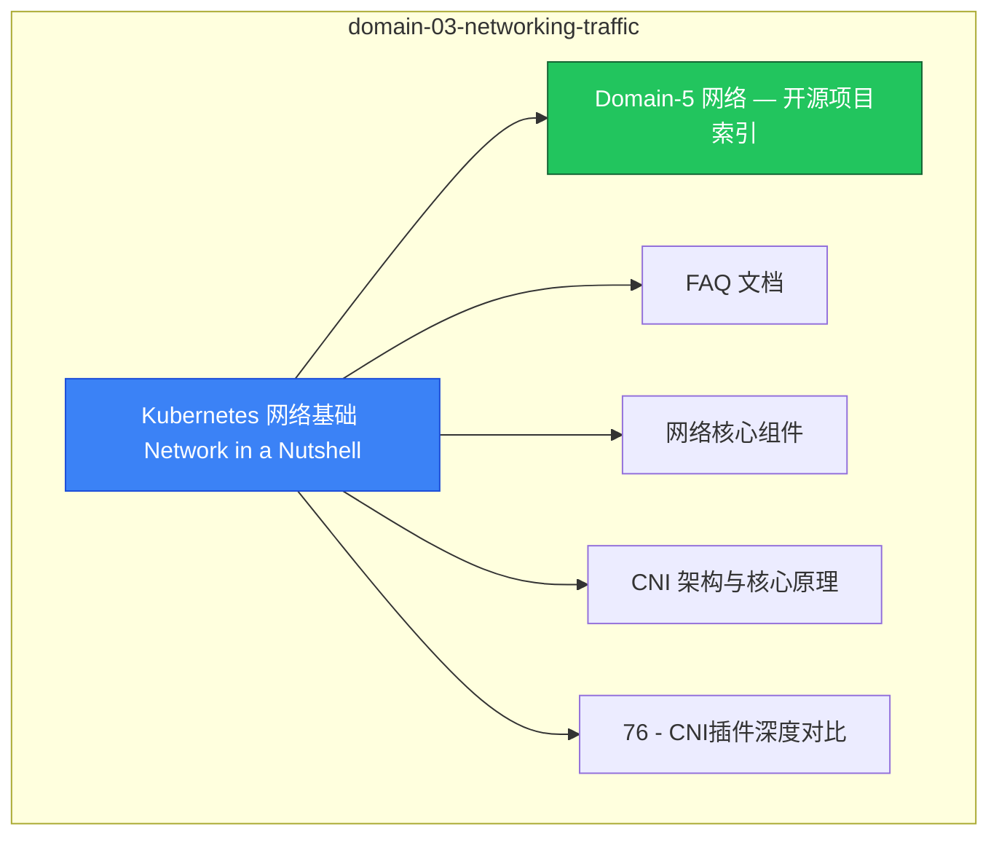

# domain-03-networking-traffic MOC

> **MOC 版本**: 1.0
> **知识域**: domain-03-networking-traffic
> **文档数量**: 55 篇
> **最后更新**: 2026-05-21
> **用途**: 本知识域的导航入口，汇总所有相关文档、关联领域、和场景入口

---

## 领域概述

网络 — Service、Ingress、CNI、网络策略、DNS、负载均衡

### 知识域定位

| 维度 | 说明 |
|---|---|
| **知识域** | domain-03-networking-traffic |
| **文档数量** | 55 篇 |
| **难度分布** | 入门 0 / 进阶 1 / 高级 1 / 专家 0 |

---

## 文档清单

| # | 文档 | 难度 | 标签 | 估计阅读时间 |
|---|---|---|---|---|
| 1 | [[domain-03-networking-traffic/00-network-in-nutshell.md|Kubernetes 网络基础 Network in a Nutshell]] |  | k8s, networking, service |  |
| 2 | [[domain-03-networking-traffic/00-open-source-projects-index.md|Domain-5 网络 — 开源项目索引]] |  | k8s, networking, service |  |
| 3 | [[domain-03-networking-traffic/01-network-architecture-overview-faq.md|FAQ 文档]] |  | k8s, networking, service |  |
| 4 | [[domain-03-networking-traffic/01-network-architecture-overview.md|网络核心组件]] |  | k8s, networking, service |  |
| 5 | [[domain-03-networking-traffic/02-cni-architecture-fundamentals.md|CNI 架构与核心原理]] | 高级 | k8s, cni, network | 5min |
| 6 | [[domain-03-networking-traffic/03-cni-plugins-comparison.md|76 - CNI插件深度对比]] |  | k8s, networking, service |  |
| 7 | [[domain-03-networking-traffic/04-flannel-complete-guide.md|142 - Flannel 完整指南 (Flannel Complete Guide)]] |  | k8s, networking, service |  |
| 8 | [[domain-03-networking-traffic/04a-flannel-wireguard-backend.md|Flannel WireGuard 加密后端配置]] |  | k8s, networking, service |  |
| 9 | [[domain-03-networking-traffic/04b-flannel-ipv6-dual-stack.md|Flannel IPv6 Dual Stack 支持]] |  | k8s, networking, service |  |
| 10 | [[domain-03-networking-traffic/04c-flannel-windows-support.md|Flannel Windows 节点支持]] |  | k8s, networking, service |  |
| 11 | [[domain-03-networking-traffic/04d-flannel-multi-cluster.md|Flannel 多集群场景与子网冲突处理]] |  | k8s, networking, service |  |
| 12 | [[domain-03-networking-traffic/04e-flannel-command-reference.md|flanneld 启动参数详解]] |  | k8s, networking, service |  |
| 13 | [[domain-03-networking-traffic/05-terway-advanced-guide.md|143 - Terway 高级指南 (Terway Advanced Guide)]] |  | k8s, networking, service |  |
| 14 | [[domain-03-networking-traffic/06-service-concepts-types.md|Kubernetes Service 核心概念与类型深度解析]] | 进阶 | k8s, service, clusterip | 10min |
| 15 | [[domain-03-networking-traffic/07-service-implementation-details.md|77 - Service实现机制]] |  | k8s, networking, service |  |
| 16 | [[domain-03-networking-traffic/08-service-topology-aware.md|72 - 服务拓扑与端点切片]] |  | k8s, networking, service |  |
| 17 | [[domain-03-networking-traffic/09-kube-proxy-modes-performance.md|Kube-proxy 实现模式与性能优化 (Kube-proxy Modes & Performance)]] |  | k8s, networking, service |  |
| 18 | [[domain-03-networking-traffic/10-service-advanced-features.md|Service 高级特性与应用案例 (Service Advanced Features)]] |  | k8s, networking, service |  |
| 19 | [[domain-03-networking-traffic/11-dns-service-discovery-coredns.md|04 - DNS 服务发现与 CoreDNS 调优]] |  | k8s, networking, service |  |
| 20 | [[domain-03-networking-traffic/12-dns-service-discovery.md|33 - 服务发现与 DNS 配置 (Service Discovery & DNS)]] |  | k8s, networking, service |  |
| 21 | [[domain-03-networking-traffic/13-coredns-architecture-principles.md|53 - CoreDNS 架构与核心原理 (Architecture & Principles)]] |  | k8s, networking, service |  |
| 22 | [[domain-03-networking-traffic/14-coredns-configuration-corefile.md|54 - CoreDNS Corefile 配置详解 (Corefile Configuration)]] |  | k8s, networking, service |  |
| 23 | [[domain-03-networking-traffic/15-coredns-plugins-reference.md|55 - CoreDNS 插件完整参考 (Plugins Reference)]] |  | k8s, networking, service |  |
| 24 | [[domain-03-networking-traffic/16-networkpolicy-deep-practice.md|01 - NetworkPolicy 深度实践指南]] |  | k8s, networking, service |  |
| 25 | [[domain-03-networking-traffic/17-network-policy-advanced.md|78 - NetworkPolicy高级配置]] |  | k8s, networking, service |  |
| 26 | [[domain-03-networking-traffic/18-network-encryption-mtls.md|83 - 网络加密与mTLS]] |  | k8s, networking, service |  |
| 27 | [[domain-03-networking-traffic/19-ingress-fundamentals.md|Kubernetes Ingress 基础概念与核心原理 (Ingress Fundamentals)]] |  | k8s, networking, service |  |
| 28 | [[domain-03-networking-traffic/20-ingress-controller-deep-dive.md|128 - Ingress Controller 深入剖析]] |  | k8s, networking, service |  |
| 29 | [[domain-03-networking-traffic/21-nginx-ingress-complete-guide.md|129 - NGINX Ingress 完整配置指南]] |  | k8s, networking, service |  |
| 30 | [[domain-03-networking-traffic/22-ingress-tls-certificate.md|130 - Ingress TLS 与证书管理]] |  | k8s, networking, service |  |
| 31 | [[domain-03-networking-traffic/23-ingress-advanced-routing.md|131 - Ingress 高级路由与流量管理]] |  | k8s, networking, service |  |
| 32 | [[domain-03-networking-traffic/24-ingress-security-hardening.md|132 - Ingress 安全加固与防护]] |  | k8s, networking, service |  |
| 33 | [[domain-03-networking-traffic/25-ingress-monitoring-troubleshooting.md|133 - Ingress 监控与故障排查]] |  | k8s, networking, service |  |
| 34 | [[domain-03-networking-traffic/26-ingress-production-best-practices.md|134 - Ingress 生产最佳实践]] |  | k8s, networking, service |  |
| 35 | [[domain-03-networking-traffic/27-cni-troubleshooting-optimization.md|144 - CNI 故障排查与优化 (CNI Troubleshooting & Optimization)]] |  | k8s, networking, service |  |
| 36 | [[domain-03-networking-traffic/28-coredns-troubleshooting-optimization.md|56 - CoreDNS 故障排查与性能优化 (Troubleshooting & Optimization)]] |  | k8s, networking, service |  |
| 37 | [[domain-03-networking-traffic/29-egress-traffic-management.md|59 - Egress流量管理]] |  | k8s, networking, service |  |
| 38 | [[domain-03-networking-traffic/30-service-mesh-deep-dive.md|02 - Service Mesh 深度解析与生产实践]] |  | k8s, networking, service |  |
| 39 | [[domain-03-networking-traffic/31-multi-cluster-federation.md|03 - 多集群网络联邦与跨集群通信]] |  | k8s, networking, service |  |
| 40 | [[domain-03-networking-traffic/32-multi-cluster-networking.md|80 - 多集群网络互联]] |  | k8s, networking, service |  |
| 41 | [[domain-03-networking-traffic/33-network-troubleshooting.md|33 - 网络故障诊断与链路排查 (Network Troubleshooting & Data Path Diagnosis)]] |  | k8s, networking, service |  |
| 42 | [[domain-03-networking-traffic/34-network-performance-tuning.md|84 - 网络性能调优]] |  | k8s, networking, service |  |
| 43 | [[domain-03-networking-traffic/35-gateway-api-overview.md|71 - Gateway API配置]] |  | k8s, networking, service |  |
| 44 | [[domain-03-networking-traffic/36-api-gateway-patterns.md|38 - Ingress和API Gateway对比表]] |  | k8s, networking, service |  |
| 45 | [[domain-03-networking-traffic/37-terway-resources-crud-operations.md|37 - Terway 实例 CRUD 操作指南 (Terway Resources CRUD Operations)]] |  | k8s, networking, service |  |
| 46 | [[domain-03-networking-traffic/38-terway-gc-mechanism.md|38 - Terway GC (垃圾回收) 机制详解 (Terway Garbage Collection Mechanism)]] |  | k8s, networking, service |  |
| 47 | [[domain-03-networking-traffic/39-csi-cni-version-matrix.md|CSI / CNI 版本兼容矩阵]] |  | k8s, networking, service |  |
| 48 | [[domain-03-networking-traffic/40-terway-product-overview.md|01 - Terway 产品概览 (Product Overview)]] |  | terway, networking, cni |  |
| 49 | [[domain-03-networking-traffic/41-terway-architecture-deep-dive.md|02 - Terway 架构原理 (Architecture Deep Dive)]] |  | terway, networking, cni |  |
| 50 | [[domain-03-networking-traffic/42-terway-usage-guide.md|03 - Terway 使用指南 (Usage Guide)]] |  | terway, networking, cni |  |
| 51 | [[domain-03-networking-traffic/43-terway-crd-operations.md|03b - Terway CRD 深度操作指南 (CRD Operations Deep Dive)]] |  | terway, networking, cni |  |
| 52 | [[domain-03-networking-traffic/44-terway-operations-manual.md|04 - Terway 运维手册 (Operations Manual)]] |  | terway, networking, cni |  |
| 53 | [[domain-03-networking-traffic/45-terway-testing-validation.md|05 - Terway 测试验证 (Testing & Validation)]] |  | terway, networking, cni |  |
| 54 | [[domain-03-networking-traffic/46-terway-performance-tuning.md|06 - Terway 性能调优 (Performance Tuning)]] |  | terway, networking, cni |  |
| 55 | [[domain-03-networking-traffic/47-terway-troubleshooting-fta.md|07 - Terway 故障树速查 (FTA Troubleshooting Quick Reference)]] |  | terway, networking, cni |  |

---

## 知识图谱

---

## 关联入口

| 入口 | 说明 |
|---|---|
| [[../domain-10-troubleshooting-diagnostics/topic-fta/MOC.md|FTA 故障树]] | domain-03-networking-traffic 相关故障树分析 |
| [[../domain-10-troubleshooting-diagnostics/topic-skills/MOC.md|Skills 技能]] | domain-03-networking-traffic 相关操作技能 |
| [[../domain-19-landscape-references/topic-index/README.md|深度研究入口]] | 语料库索引与向量检索 |

---

## 统计信息

| 指标 | 数值 |
|---|---|
| 文档总数 | 55 |
| 覆盖 K8s 版本 | v1.25 - v1.32 |

---

*本文档由 scripts/generate-mocs.py 自动生成，最后更新 2026-05-21。*
