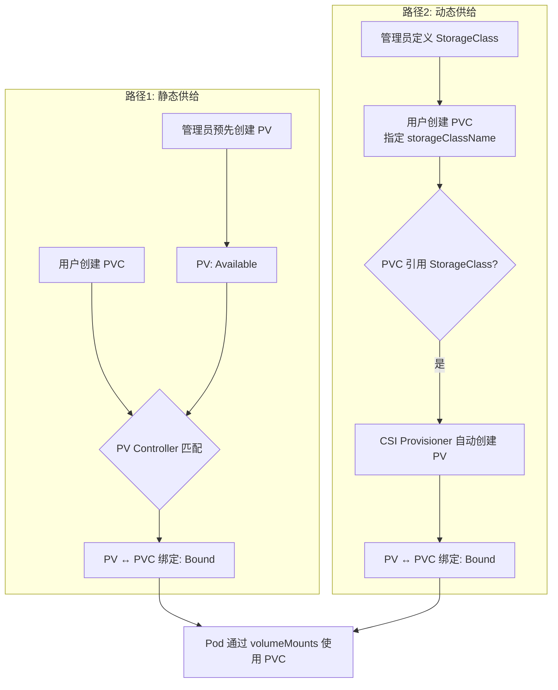
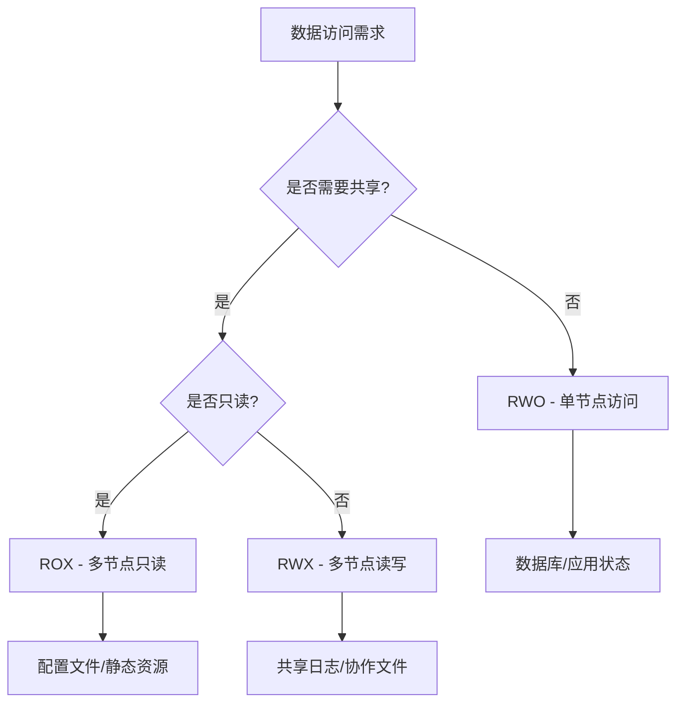

# 06 - 存储基础概念详解

> **适用版本**: v1.25 - v1.32 | **最后更新**: 2026-02 | **运维重点**: 存储抽象、生命周期、访问模式

<!-- chunk: 目录 -->
## 目录

1. [存储基本概念](#存储基本概念)
2. [PV/PVC工作机制](#pvpvc工作机制)
3. [存储类与动态供给](#存储类与动态供给)
4. [访问模式详解](#访问模式详解)
5. [回收策略机制](#回收策略机制)
6. [存储生命周期管理](#存储生命周期管理)
7. [运维最佳实践](#运维最佳实践)

---

<!-- chunk: PV/PVC/StorageClass 三者关系全景图 -->
## PV/PVC/StorageClass 三者关系全景图

### 一句话理解

| 概念 | 一句话 | 类比 |
|------|--------|------|
| **PV** | 集群中的一块存储，独立于 Pod 存在 | 一块插在集群上的硬盘 |
| **PVC** | 用户对存储的声明（"我要多少、怎么用"） | 向 IT 部门提交的硬盘申请单 |
| **StorageClass** | 存储的"工厂模板"，按需自动造 PV | 硬盘的自动化生产线 |

### 为什么需要三层抽象？

```
问题: Volume 的局限性
├── Volume 生命周期与 Pod 绑定 → Pod 删除，存储丢失
├── Volume 无法在 Pod 间共享（同一 PVC 除外）
└── 管理员无法统一管理存储资源

解决: 三层抽象
├── PV = 管理员视角: 集群有一块 500Gi 的 ESSD 云盘
├── PVC = 开发者视角: "我需要 100Gi，读写，高性能"
└── StorageClass = 自动化: PVC 来了，按模板自动创建 PV
```

### 两条绑定路径（核心机制）



### 静态供给 vs 动态供给对比

| 维度 | 静态供给 | 动态供给 |
|------|---------|---------|
| **流程** | 管理员创建 PV → 用户创建 PVC → 自动匹配 | 用户创建 PVC（指定 SC）→ 自动创建 PV → 自动绑定 |
| **谁创建 PV** | 管理员手动 | StorageClass + CSI 驱动自动 |
| **适用场景** | 固定存储、预留存储、本地存储 | 云盘、NAS、按需分配 |
| **灵活性** | 低（需提前规划容量） | 高（按需创建） |
| **运维成本** | 高（手动管理 PV 生命周期） | 低（自动化管理） |
| **推荐程度** | 特定场景（Local PV、预留盘） | **生产环境首选** |

### 完整交互时序

```
管理员                          Kubernetes                     存储后端
  │                               │                             │
  │  创建 StorageClass            │                             │
  │──────────────────────────────▶│                             │
  │                               │                             │
  │                               │  用户创建 PVC               │
  │                               │◀────────── 用户              │
  │                               │                             │
  │                               │  检查 StorageClass          │
  │                               │  ───┐                       │
  │                               │     │ 匹配到 SC              │
  │                               │  ◀──┘                       │
  │                               │                             │
  │                               │  CSI Provisioner            │
  │                               │────────────────────────────▶│
  │                               │  CreateVolume               │
  │                               │◀────────────────────────────│
  │                               │  Volume Created             │
  │                               │                             │
  │                               │  自动创建 PV 对象           │
  │                               │  PVC 状态: Pending → Bound  │
  │                               │                             │
  │                               │  用户创建 Pod（引用 PVC）    │
  │                               │◀────────── 用户              │
  │                               │                             │
  │                               │  CSI Node Plugin            │
  │                               │────────────────────────────▶│
  │                               │  Attach + Mount             │
  │                               │◀────────────────────────────│
  │                               │  Pod Running ✓              │
```

---

<!-- chunk: 存储基本概念 -->
## 存储基本概念

### Kubernetes存储抽象层次

```
应用层 (Containers)
    ↓
Volume (卷) - Pod级别的存储抽象
    ↓
PersistentVolumeClaim (PVC) - 命名空间级声明
    ↓
PersistentVolume (PV) - 集群级资源
    ↓
StorageClass - 存储类型模板
    ↓
CSI Driver - 存储插件接口
    ↓
底层存储系统 (云盘/NAS/Ceph/Local)
```

### 核心组件职责划分

| 组件 | 职责 | 运维关注点 |
|------|------|-----------|
| **Volume** | Pod内容器间共享存储 | 生命周期与Pod绑定 |
| **PVC** | 用户存储需求声明 | 命名空间隔离，资源申请 |
| **PV** | 实际存储资源实例 | 集群全局可见，持久化 |
| **StorageClass** | 存储类型定义模板 | 动态供给策略 |
| **CSI Driver** | 存储系统对接接口 | 插件化扩展 |

### 存储类型分类体系

| 存储类型 | 特点 | 适用场景 | 运维复杂度 |
|---------|------|---------|-----------|
| **块存储 (Block)** | 高性能，独占访问 | 数据库，高性能应用 | 中 |
| **文件存储 (File)** | 共享访问，标准文件接口 | 共享文件，日志存储 | 低 |
| **对象存储 (Object)** | 海量存储，REST API | 静态资源，备份归档 | 低 |
| **本地存储 (Local)** | 最高性能，节点绑定 | 缓存，临时数据 | 高 |

---

<!-- chunk: PV/PVC工作机制 -->
## PV/PVC工作机制

### PVC创建到绑定完整流程

```
用户创建PVC
    ↓
1. PVC进入Pending状态
    ↓
2. PV Controller匹配合适PV
   ├─ 静态匹配：查找已有PV
   └─ 动态供给：创建新PV
    ↓
3. PV状态变为Bound
    ↓
4. PVC状态变为Bound
    ↓
5. Pod可以使用PVC
```

### 静态供给 vs 动态供给

#### 静态供给 (Static Provisioning)

```yaml
# 管理员预先创建PV
apiVersion: v1
kind: PersistentVolume
metadata:
  name: static-pv-01
spec:
  capacity:
    storage: 100Gi
  accessModes:
    - ReadWriteOnce
  persistentVolumeReclaimPolicy: Retain
  storageClassName: manual
  hostPath:
    path: /mnt/data/pv01

---
# 用户创建PVC引用现有PV
apiVersion: v1
kind: PersistentVolumeClaim
metadata:
  name: my-pvc
spec:
  accessModes:
    - ReadWriteOnce
  storageClassName: manual  # 必须匹配PV的StorageClass
  resources:
    requests:
      storage: 50Gi
  selector:
    matchLabels:
      type: static-pv
```

**运维要点：**
- 需要预先规划存储容量
- 手动管理PV生命周期
- 适用于固定存储需求场景

#### 动态供给 (Dynamic Provisioning)

```yaml
# StorageClass定义自动供给策略
apiVersion: storage.k8s.io/v1
kind: StorageClass
metadata:
  name: fast-ssd
provisioner: diskplugin.csi.alibabacloud.com
parameters:
  type: cloud_essd
  performanceLevel: PL1
reclaimPolicy: Delete
volumeBindingMode: WaitForFirstConsumer
allowVolumeExpansion: true

---
# 用户只需创建PVC
apiVersion: v1
kind: PersistentVolumeClaim
metadata:
  name: dynamic-pvc
spec:
  accessModes:
    - ReadWriteOnce
  storageClassName: fast-ssd  # 引用StorageClass
  resources:
    requests:
      storage: 100Gi
```

**运维优势：**
- 按需自动创建存储
- 减少人工干预
- 更好的资源利用率

### 绑定匹配条件

PVC与PV成功绑定必须满足以下所有条件：

```yaml
# 匹配检查清单
checks:
  - storage_size: PV.capacity >= PVC.request  # 容量足够
  - access_modes: PV.modes ⊇ PVC.modes        # 访问模式兼容
  - storage_class: PV.class == PVC.class      # StorageClass匹配
  - selector: PV.labels 匹配 PVC.selector     # 标签选择器
  - volume_mode: PV.mode == PVC.mode          # Filesystem/Block一致
```

---

<!-- chunk: 存储类与动态供给 -->
## 存储类与动态供给

### StorageClass核心参数详解

```yaml
apiVersion: storage.k8s.io/v1
kind: StorageClass
metadata:
  name: production-storage
  annotations:
    storageclass.kubernetes.io/is-default-class: "false"
provisioner: diskplugin.csi.alibabacloud.com  # 存储供给器
parameters:  # 传递给CSI驱动的参数
  type: cloud_essd
  performanceLevel: PL2
  encrypted: "true"
  kmsKeyId: "kms-key-123"
reclaimPolicy: Delete  # Delete/Retain/Recycle
volumeBindingMode: WaitForFirstConsumer  # Immediate/WaitForFirstConsumer
allowVolumeExpansion: true  # 是否允许扩容
mountOptions:  # 挂载选项
  - noatime
  - discard
allowedTopologies:  # 拓扑约束
  - matchLabelExpressions:
      - key: topology.kubernetes.io/zone
        values: ["cn-hangzhou-a", "cn-hangzhou-b"]
```

### VolumeBindingMode对比分析

| 模式 | 行为 | 优点 | 缺点 | 适用场景 |
|-----|------|------|------|---------|
| **Immediate** | PVC创建后立即绑定 | 快速响应 | 可能跨可用区 | 无地域要求的应用 |
| **WaitForFirstConsumer** | 等待Pod调度后再绑定 | 确保地域亲和 | 首次启动稍慢 | 多可用区部署 |

### 多StorageClass策略管理

```yaml
# 存储分级策略
storage_tiers:
  tier_fast:
    name: fast-ssd-pl3
    type: ESSD
    performance: PL3
    iops: 1000000
    cost: 高
    usage: 核心数据库
    
  tier_standard:
    name: standard-ssd-pl1
    type: ESSD
    performance: PL1
    iops: 50000
    cost: 中
    usage: 一般应用
    
  tier_economy:
    name: economy-ssd-pl0
    type: ESSD
    performance: PL0
    iops: 10000
    cost: 低
    usage: 开发测试
```

---

<!-- chunk: 访问模式详解 -->
## 访问模式详解

### 四种访问模式详细说明

| 模式 | 缩写 | 描述 | 支持存储类型 | 典型应用场景 |
|-----|------|------|------------|-------------|
| **ReadWriteOnce** | RWO | 单节点读写 | 块存储，本地盘 | 数据库，应用状态存储 |
| **ReadOnlyMany** | ROX | 多节点只读 | 文件存储，对象存储 | 配置文件，静态资源 |
| **ReadWriteMany** | RWX | 多节点读写 | NAS，分布式文件系统 | 共享日志，媒体文件 |
| **ReadWriteOncePod** | RWOP | 单Pod独占(v1.22+) | 块存储 | 严格单写场景 |

### 访问模式兼容性矩阵

```yaml
# 各存储类型的访问模式支持情况
storage_compatibility:
  aliyun_disk:
    RWO: ✓
    ROX: ✗
    RWX: ✗
    RWOP: ✓ (v1.27+)
    
  aliyun_nas:
    RWO: ✓
    ROX: ✓
    RWX: ✓
    RWOP: ✓ (v1.27+)
    
  ceph_rbd:
    RWO: ✓
    ROX: ✗
    RWX: ✗
    RWOP: ✓ (v1.27+)
    
  local_path:
    RWO: ✓
    ROX: ✗
    RWX: ✗
    RWOP: ✓ (v1.27+)
```

### 访问模式选择指南



---

<!-- chunk: 回收策略机制 -->
## 回收策略机制

### 三种回收策略对比

| 策略 | 行为 | 数据安全性 | 适用场景 | 运维复杂度 |
|-----|------|----------|---------|-----------|
| **Retain** | 保留PV和底层数据 | 高 | 生产环境关键数据 | 需要手动清理 |
| **Delete** | 删除PV和底层存储 | 低 | 临时数据，开发测试 | 自动清理 |
| **Recycle** | 清空数据后重用(已废弃) | 不推荐 | 不再使用 | 不推荐 |

### 生产环境回收策略配置

```yaml
# 推荐的生产环境配置
apiVersion: storage.k8s.io/v1
kind: StorageClass
metadata:
  name: production-disk
provisioner: diskplugin.csi.alibabacloud.com
reclaimPolicy: Retain  # 生产环境必须Retain
parameters:
  type: cloud_essd
  performanceLevel: PL2

---
# 重要数据PVC额外保护
apiVersion: v1
kind: PersistentVolumeClaim
metadata:
  name: critical-data-pvc
  annotations:
    pv.kubernetes.io/bind-completed: "yes"
    pv.kubernetes.io/bound-by-controller: "yes"
spec:
  accessModes:
    - ReadWriteOnce
  storageClassName: production-disk
  resources:
    requests:
      storage: 1Ti
```

### 回收策略运维操作

```bash
# 1. 查看当前回收策略
kubectl get sc -o custom-columns=NAME:.metadata.name,POLICY:.reclaimPolicy

# 2. 修改已有PV的回收策略
kubectl patch pv <pv-name> -p '{"spec":{"persistentVolumeReclaimPolicy":"Retain"}}'

# 3. 手动清理Released状态的PV
# 检查PV状态
kubectl get pv --field-selector=status.phase=Released

# 备份重要数据后删除PV
kubectl delete pv <pv-name>

# 4. 重新使用已释放的PV
# 修改回收策略为Retain
kubectl patch pv <pv-name> -p '{"spec":{"persistentVolumeReclaimPolicy":"Retain"}}'

# 清理claimRef引用
kubectl patch pv <pv-name> -p '{"spec":{"claimRef": null}}'

# PV变回Available状态，可重新绑定
```

---

<!-- chunk: 存储生命周期管理 -->
## 存储生命周期管理

### 完整生命周期状态流转

```
[PVC Lifecycle]
Pending → Bound → Lost
    ↑              ↓
    └──────←───────┘

[PV Lifecycle]
Available → Bound → Released → (Retain/Delete) → Available/Removed
```

### 关键状态转换触发条件

| 状态转换 | 触发条件 | 运维关注点 |
|---------|---------|-----------|
| **Pending→Bound** | 找到匹配PV或动态创建 | 绑定时间，成功率 |
| **Bound→Lost** | 关联PV被删除 | 数据风险预警 |
| **Bound→Released** | PVC被删除 | 回收策略执行 |
| **Released→Available** | Retain策略清理完成 | 手动干预需求 |

### 生命周期监控指标

```yaml
# 关键监控指标
lifecycle_metrics:
  pvc_pending_duration:  # PVC Pending时长
    threshold: 300s
    alert: PVC绑定超时
    
  pv_released_count:  # Released状态PV数量
    threshold: 5
    alert: 需要手动清理的PV过多
    
  binding_success_rate:  # 绑定成功率
    threshold: 95%
    alert: 存储供给异常
    
  reclaim_failure_rate:  # 回收失败率
    threshold: 5%
    alert: 存储回收异常
```

---

<!-- chunk: 运维最佳实践 -->
## 运维最佳实践

### 存储资源配置规范

```yaml
# 生产环境推荐配置模板
production_storage_config:
  # StorageClass配置
  storage_class:
    reclaim_policy: Retain
    volume_binding_mode: WaitForFirstConsumer
    allow_expansion: true
    mount_options:
      - noatime
      - discard
      
  # PVC配置
  pvc_template:
    access_modes: [ReadWriteOnce]
    storage_request_buffer: 20%  # 预留20%空间
    backup_enabled: true
    
  # 监控告警
  monitoring:
    pvc_usage_threshold: 85%
    pv_health_check_interval: 300s
```

### 常见配置错误及预防

| 错误类型 | 原因 | 预防措施 |
|---------|------|---------|
| **PVC Pending** | StorageClass不存在 | 统一管理StorageClass |
| **绑定失败** | 参数不匹配 | 标准化PVC模板 |
| **数据丢失** | Delete策略误用 | 生产环境强制Retain |
| **性能问题** | 访问模式不当 | 明确应用需求 |

### 运维检查清单

```markdown
<!-- chunk: 存储健康检查清单 -->
## 存储健康检查清单

### 每日检查
- [ ] PVC Pending状态数量 < 5
- [ ] PV Released状态数量 = 0
- [ ] StorageClass配置一致性检查
- [ ] CSI Driver运行状态正常

### 每周检查
- [ ] 存储使用率统计分析
- [ ] 回收策略合规性审计
- [ ] 备份策略执行情况检查
- [ ] 性能指标趋势分析

### 每月检查
- [ ] 存储成本分析优化
- [ ] 容量规划和扩容准备
- [ ] 灾备演练执行
- [ ] 安全合规性评估
```

---

<!-- chunk: 存储诊断工具集 -->
## 存储诊断工具集

### PVC 全链路诊断脚本

```bash
#!/bin/bash
# pvc-diagnostic.sh - PVC 存储全链路诊断工具
# 用法: ./pvc-diagnostic.sh <namespace> <pvc-name>

NAMESPACE="${1:-default}"
PVC_NAME="$2"

if [ -z "$PVC_NAME" ]; then
  echo "用法: $0 <namespace> <pvc-name>"
  exit 1
fi

echo "=========================================="
echo "PVC 诊断报告: ${NAMESPACE}/${PVC_NAME}"
echo "时间: $(date)"
echo "=========================================="

# 1. PVC 状态检查
echo ""
echo "## 1. PVC 状态"
PVC_PHASE=$(kubectl get pvc "$PVC_NAME" -n "$NAMESPACE" -o jsonpath='{.status.phase}' 2>/dev/null)
if [ -z "$PVC_PHASE" ]; then
  echo "❌ PVC 不存在: ${NAMESPACE}/${PVC_NAME}"
  exit 1
fi
echo "   状态: $PVC_PHASE"
echo "   容量: $(kubectl get pvc "$PVC_NAME" -n "$NAMESPACE" -o jsonpath='{.spec.resources.requests.storage}')"
echo "   访问模式: $(kubectl get pvc "$PVC_NAME" -n "$NAMESPACE" -o jsonpath='{.spec.accessModes[*]}')"
echo "   StorageClass: $(kubectl get pvc "$PVC_NAME" -n "$NAMESPACE" -o jsonpath='{.spec.storageClassName}')"

# 2. 绑定 PV 检查
PV_NAME=$(kubectl get pvc "$PVC_NAME" -n "$NAMESPACE" -o jsonpath='{.spec.volumeName}' 2>/dev/null)
if [ -n "$PV_NAME" ]; then
  echo ""
  echo "## 2. 绑定 PV: $PV_NAME"
  echo "   回收策略: $(kubectl get pv "$PV_NAME" -o jsonpath='{.spec.persistentVolumeReclaimPolicy}')"
  echo "   存储类型: $(kubectl get pv "$PV_NAME" -o jsonpath='{.spec.csi.driver}' 2>/dev/null || kubectl get pv "$PV_NAME" -o jsonpath='{.spec.nfs.server}' 2>/dev/null || echo "unknown")"
else
  echo ""
  echo "## 2. ❌ 未绑定 PV (PVC 处于 Pending 状态)"
  SC_NAME=$(kubectl get pvc "$PVC_NAME" -n "$NAMESPACE" -o jsonpath='{.spec.storageClassName}')
  if [ "$SC_NAME" != "" ] && [ "$SC_NAME" != "null" ]; then
    echo "   检查 StorageClass: $SC_NAME"
    kubectl get storageclass "$SC_NAME" -o wide 2>/dev/null || echo "   StorageClass 不存在!"
    echo "   Events:"
    kubectl get pvc "$PVC_NAME" -n "$NAMESPACE" -o jsonpath='{.status.conditions[*].message}' 2>/dev/null
    kubectl describe pvc "$PVC_NAME" -n "$NAMESPACE" 2>/dev/null | grep -A 20 "Events:" | tail -20
  fi
fi

# 3. 使用此 PVC 的 Pod 检查
echo ""
echo "## 3. 使用此 PVC 的 Pod"
PODS=$(kubectl get pods -n "$NAMESPACE" -o json | jq -r ".items[] | select(.spec.volumes[]?.persistentVolumeClaim?.claimName == \"$PVC_NAME\") | .metadata.name" 2>/dev/null)
if [ -n "$PODS" ]; then
  for POD in $PODS; do
    POD_STATUS=$(kubectl get pod "$POD" -n "$NAMESPACE" -o jsonpath='{.status.phase}')
    NODE=$(kubectl get pod "$POD" -n "$NAMESPACE" -o jsonpath='{.spec.nodeName}')
    echo "   Pod: $POD | 状态: $POD_STATUS | 节点: $NODE"
  done
else
  echo "   ⚠️ 无 Pod 使用此 PVC"
fi

# 4. CSI 驱动状态
echo ""
echo "## 4. CSI 驱动状态"
CSI_PODS=$(kubectl get pods -n kube-system -l app=csi-plugin -o wide --no-headers 2>/dev/null || kubectl get pods -n kube-system -l app=csi-nodeplugin --no-headers 2>/dev/null)
if [ -n "$CSI_PODS" ]; then
  echo "$CSI_PODS" | head -5
else
  echo "   ⚠️ 未发现 CSI 插件 Pod"
fi

# 5. 事件检查
echo ""
echo "## 5. 最近事件"
kubectl get events -n "$NAMESPACE" --field-selector involvedObject.name="$PVC_NAME" --sort-by='.lastTimestamp' 2>/dev/null | tail -10

echo ""
echo "=========================================="
echo "诊断完成"
echo "=========================================="
```

### 存储容量巡检脚本

```bash
#!/bin/bash
# storage-capacity-check.sh - 存储容量巡检工具
# 用法: ./storage-capacity-check.sh [--namespace <ns>] [--threshold 80]

NAMESPACE="all"
THRESHOLD=80

while $# -gt 0; do
  case $1 in
    --namespace) NAMESPACE="$2"; shift 2 ;;
    --threshold) THRESHOLD="$2"; shift 2 ;;
    *) echo "未知参数: $1"; exit 1 ;;
  esac
done

echo "=========================================="
echo "存储容量巡检报告"
echo "时间: $(date)"
echo "阈值: ${THRESHOLD}%"
echo "=========================================="

# 1. PVC 使用统计
echo ""
echo "## PVC 状态分布"
if [ "$NAMESPACE" = "all" ]; then
  PVC_LIST=$(kubectl get pvc --all-namespaces -o json)
else
  PVC_LIST=$(kubectl get pvc -n "$NAMESPACE" -o json)
fi

TOTAL_PVC=$(echo "$PVC_LIST" | jq '.items | length')
PENDING_PVC=$(echo "$PVC_LIST" | jq '[.items[] | select(.status.phase=="Pending")] | length')
BOUND_PVC=$(echo "$PVC_LIST" | jq '[.items[] | select(.status.phase=="Bound")] | length')
LOST_PVC=$(echo "$PVC_LIST" | jq '[.items[] | select(.status.phase=="Lost")] | length')

echo "   总计: $TOTAL_PVC | Bound: $BOUND_PVC | Pending: $PENDING_PVC | Lost: $LOST_PVC"

# 2. StorageClass 使用分析
echo ""
echo "## StorageClass 使用分布"
echo "$PVC_LIST" | jq -r '.items[] | .spec.storageClassName // "none"' | sort | uniq -c | sort -rn

# 3. 总存储申请量
echo ""
echo "## 总存储申请量"
TOTAL_GI=$(echo "$PVC_LIST" | jq -r '[.items[].spec.resources.requests.storage | rtrimstr("Gi") | tonumber] | add // 0' 2>/dev/null)
echo "   ${TOTAL_GI} GiB (仅统计 Gi 单位 PVC)"

# 4. PV 回收策略审计
echo ""
echo "## PV 回收策略审计"
kubectl get pv -o json | jq -r '.items[] | "\(.metadata.name) \(.spec.persistentVolumeReclaimPolicy) \(.status.phase)"' | \
  awk '{policy[$2]++} END {for(p in policy) print "   " p ": " policy[p]}'

# 5. 异常 PVC 告警
echo ""
echo "## 异常 PVC (Pending/Lost)"
echo "$PVC_LIST" | jq -r '.items[] | select(.status.phase=="Pending" or .status.phase=="Lost") | "   [\(.status.phase)] \(.metadata.namespace)/\(.metadata.name) - SC: \(.spec.storageClassName // "none")"' | head -20

echo ""
echo "=========================================="
echo "巡检完成"
echo "=========================================="
```

---

<!-- chunk: 端到端快速入门（SC → PVC → Pod 三步走） -->
## 端到端快速入门（SC → PVC → Pod 三步走）

以下是从零开始创建存储并挂载到 Pod 的最简完整流程：

### 第 1 步: 创建 StorageClass

```yaml
apiVersion: storage.k8s.io/v1
kind: StorageClass
metadata:
  name: quick-start-sc
provisioner: diskplugin.csi.alibabacloud.com
parameters:
  type: cloud_essd
  performanceLevel: PL1
reclaimPolicy: Retain
volumeBindingMode: WaitForFirstConsumer
allowVolumeExpansion: true
```

```bash
kubectl apply -f storageclass.yaml
kubectl get sc quick-start-sc
```

### 第 2 步: 创建 PVC（引用 StorageClass）

```yaml
apiVersion: v1
kind: PersistentVolumeClaim
metadata:
  name: quick-start-pvc
spec:
  accessModes: [ReadWriteOnce]
  storageClassName: quick-start-sc
  resources:
    requests:
      storage: 20Gi
```

```bash
kubectl apply -f pvc.yaml
kubectl get pvc quick-start-pvc
# 注意: 使用 WaitForFirstConsumer 时 PVC 会保持 Pending 直到 Pod 调度
```

### 第 3 步: 创建 Pod（引用 PVC）

```yaml
apiVersion: v1
kind: Pod
metadata:
  name: quick-start-pod
spec:
  containers:
  - name: app
    image: nginx:alpine
    volumeMounts:
    - name: data
      mountPath: /usr/share/nginx/html
  volumes:
  - name: data
    persistentVolumeClaim:
      claimName: quick-start-pvc
```

```bash
kubectl apply -f pod.yaml

# 验证：PVC 应该已绑定
kubectl get pvc quick-start-pvc

# 验证：Pod 应该在运行
kubectl get pod quick-start-pod

# 验证：存储已挂载
kubectl exec quick-start-pod -- df -h /usr/share/nginx/html

# 写入测试数据
kubectl exec quick-start-pod -- sh -c 'echo "Hello from PVC!" > /usr/share/nginx/html/index.html'
kubectl exec quick-start-pod -- cat /usr/share/nginx/html/index.html
```

### 清理

```bash
kubectl delete pod quick-start-pod
kubectl delete pvc quick-start-pvc
kubectl delete sc quick-start-sc
```

> **CSI parameters 传递机制**: StorageClass 的 `parameters` 字段通过 CSI Sidecar（`external-provisioner`）传递给 CSI 驱动的 `CreateVolume` [[gRPC|gRPC]] 调用。每个 CSI 驱动定义自己支持的参数（如阿里云的 `type`/`performanceLevel`、AWS 的 `type`/`iopsPerGB`）。参数不匹配时，CSI 驱动会返回错误，PVC 会保持 Pending。

---

<!-- chunk: 实操练习 -->
## 实操练习

### 练习 1: 静态供给与动态供给对比

**目标**: 分别通过静态和动态方式创建 PVC，并验证绑定过程。

```bash
# 1. 创建静态 PV
cat <<EOF | kubectl apply -f -
apiVersion: v1
kind: PersistentVolume
metadata:
  name: lab-static-pv
spec:
  capacity:
    storage: 5Gi
  accessModes:
    - ReadWriteOnce
  persistentVolumeReclaimPolicy: Retain
  storageClassName: lab-manual
  hostPath:
    path: /tmp/lab-static-pv
EOF

# 2. 创建使用静态 PV 的 PVC
cat <<EOF | kubectl apply -f -
apiVersion: v1
kind: PersistentVolumeClaim
metadata:
  name: lab-static-pvc
spec:
  accessModes:
    - ReadWriteOnce
  storageClassName: lab-manual
  resources:
    requests:
      storage: 3Gi
EOF

# 3. 验证绑定
kubectl get pv lab-static-pv -o jsonpath='{.status.phase}'
kubectl get pvc lab-static-pvc -o jsonpath='{.status.phase}'

# 4. 清理
kubectl delete pvc lab-static-pvc
kubectl delete pv lab-static-pv
```

### 练习 2: 访问模式验证

**目标**: 验证 RWO 卷的多节点挂载限制。

```bash
# 创建 PVC (RWO)
cat <<EOF | kubectl apply -f -
apiVersion: v1
kind: PersistentVolumeClaim
metadata:
  name: lab-rwo-pvc
spec:
  accessModes:
    - ReadWriteOnce
  storageClassName: standard
  resources:
    requests:
      storage: 1Gi
EOF

# 创建 Pod A 使用该 PVC
cat <<EOF | kubectl apply -f -
apiVersion: v1
kind: Pod
metadata:
  name: lab-pod-a
spec:
  containers:
  - name: app
    image: busybox
    command: ["sleep", "3600"]
    volumeMounts:
    - name: data
      mountPath: /data
  volumes:
  - name: data
    persistentVolumeClaim:
      claimName: lab-rwo-pvc
EOF

# 观察 Pod A 运行状态后清理
kubectl delete pod lab-pod-a --force
kubectl delete pvc lab-rwo-pvc
```

### 练习 3: 回收策略行为验证

**目标**: 对比 Retain 和 Delete 策略在 PVC 删除后的行为差异。

```bash
# 1. 创建两种 StorageClass
cat <<EOF | kubectl apply -f -
apiVersion: storage.k8s.io/v1
kind: StorageClass
metadata:
  name: lab-retain
provisioner: kubernetes.io/no-provisioner
reclaimPolicy: Retain
---
apiVersion: storage.k8s.io/v1
kind: StorageClass
metadata:
  name: lab-delete
provisioner: kubernetes.io/no-provisioner
reclaimPolicy: Delete
EOF

# 2. 分别创建 PVC 并绑定
# 3. 删除 PVC，观察 PV 状态差异
# Retain: PV 进入 Released 状态
# Delete: PV 被自动删除

# 清理
kubectl delete sc lab-retain lab-delete
```

---

<!-- chunk: 常见问题速查表 -->
## 常见问题速查表

| 症状 | 可能原因 | 快速诊断命令 | 解决方案 |
|------|---------|-------------|---------|
| PVC 一直 Pending | StorageClass 不存在 | `kubectl get sc` | 创建或修正 StorageClass 名称 |
| PVC 一直 Pending | 无可用 PV（静态供给） | `kubectl get pv` | 创建匹配的 PV 或切换动态供给 |
| PVC 一直 Pending | 云商配额不足 | 检查云商控制台 | 申请提升配额或释放闲置资源 |
| PVC 一直 Pending | 拓扑不匹配 | `kubectl describe pvc` 查看 events | 检查 allowedTopologies 和节点标签 |
| Pod ContainerCreating | 卷挂载失败 | `kubectl describe pod` 查看 events | 检查 CSI 驱动状态和节点磁盘 |
| Pod Multi-Attach 错误 | RWO 卷被多节点挂载 | `kubectl get pv -o wide` | 确保同 PVC 的 Pod 调度到同一节点 |
| PV Released 不回收 | Retain 策略 | `kubectl get pv` | 手动清理 claimRef 或删除 PV |
| PVC Lost | 底层 PV 被删除 | `kubectl get pv` | 重建 PV 或恢复存储后端 |
| 卷扩容失败 | StorageClass 未开启 | `kubectl get sc -o yaml` | 设置 `allowVolumeExpansion: true` |
| 数据写入慢 | 存储性能不足 | `iostat -xz 1` | 升级存储规格或优化 I/O 模式 |

---

<!-- chunk: 相关文档 -->
## 相关文档

- [01 - 存储架构概览](./01-storage-architecture-overview.md) - 存储架构与核心组件
- [02 - PV 架构基础](./02-pv-architecture-fundamentals.md) - PV 生命周期与状态机
- [04 - StorageClass 动态供给](./04-storageclass-dynamic-provisioning.md) - 动态供给深度配置
- [09 - PV/PVC 故障排查](./09-pv-pvc-troubleshooting.md) - 故障诊断与排查

---
**表格底部标记**: Kusheet Project | 作者: Allen Galler (allengaller@gmail.com)

## See Also

- 04-storageclass-dynamic-provisioning
- 05-csi-drivers-integration
- 07-storage-daily-operations
- 08-storage-performance-tuning

## Related

- index/storage-index|Storage 存储知识图谱索引]]
- [[domain-19-landscape-references/topic-index/csi-index|[[CSI (Container Storage Interface) 知识图谱索引|CSI (Container Storage Interface) 知识图谱索引]]]]
