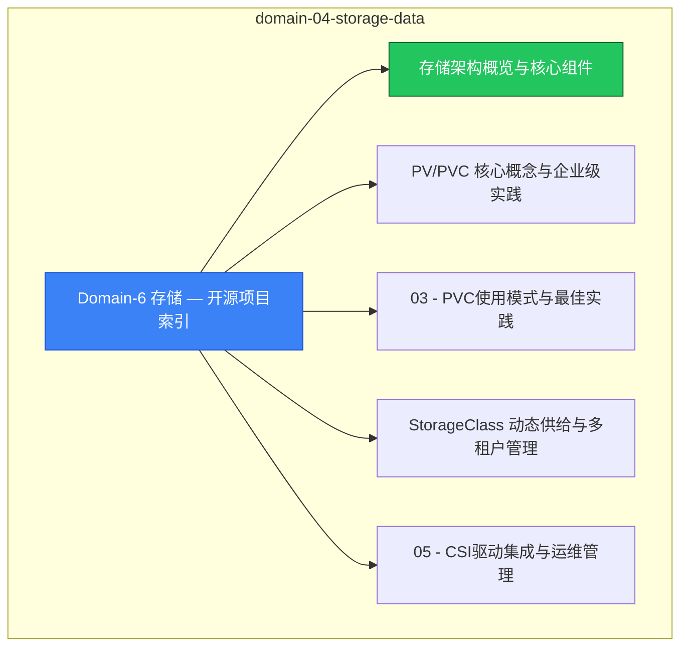

# domain-04-storage-data MOC

> **MOC 版本**: 1.0
> **知识域**: domain-04-storage-data
> **文档数量**: 19 篇
> **最后更新**: 2026-05-21
> **用途**: 本知识域的导航入口，汇总所有相关文档、关联领域、和场景入口

---

## 领域概述

存储 — PV、PVC、StorageClass、CSI、持久化存储

### 知识域定位

| 维度 | 说明 |
|---|---|
| **知识域** | domain-04-storage-data |
| **文档数量** | 19 篇 |
| **难度分布** | 入门 0 / 进阶 3 / 高级 0 / 专家 0 |

---

## 文档清单

| # | 文档 | 难度 | 标签 | 估计阅读时间 |
|---|---|---|---|---|
| 1 | Domain-6 存储 — 开源项目索引 |  | k8s, storage, pv |  |
| 2 | 存储架构概览与核心组件 | 进阶 | k8s, storage, csi | 5min |
| 3 | PV/PVC 核心概念与企业级实践 | 进阶 | k8s, pv, pvc | 5min |
| 4 | 03 - PVC使用模式与最佳实践 |  | k8s, storage, pv |  |
| 5 | StorageClass 动态供给与多租户管理 | 进阶 | k8s, storageclass, provisioner | 5min |
| 6 | 05 - CSI驱动集成与运维管理 |  | k8s, storage, pv |  |
| 7 | 06 - 存储基础概念详解 |  | k8s, storage, pv |  |
| 8 | 07 - 存储日常运维操作手册 |  | k8s, storage, pv |  |
| 9 | 08 - 存储性能调优与优化策略 |  | k8s, storage, pv |  |
| 10 | 09 - PV/PVC故障排查与解决方案 |  | k8s, storage, pv |  |
| 11 | 10 - 存储备份与灾难恢复 |  | k8s, storage, pv |  |
| 12 | 11 - 存储高级特性与优化策略 |  | k8s, storage, pv |  |
| 13 | 12 - 存储监控告警与性能调优 |  | k8s, storage, pv |  |
| 14 | 13 - 存储安全与合规管理 |  | k8s, storage, pv |  |
| 15 | 14 - 云原生存储与多云策略 |  | k8s, storage, pv |  |
| 16 | 15 - 存储灾备与迁移策略 |  | k8s, storage, pv |  |
| 17 | 16 - CSI 迁移：从 In-Tree 存储插件到 CSI |  | k8s, storage, pv |  |
| 18 | Domain-6 存储知识库查漏补缺完成报告 |  | k8s, storage, pv |  |
| 19 | Domain-6 存储知识库质量检查报告 |  | k8s, storage, pv |  |

---

## 知识图谱

---

## 关联入口

| 入口 | 说明 |
|---|---|
| FTA 故障树 | domain-04-storage-data 相关故障树分析 |
| Skills 技能 | domain-04-storage-data 相关操作技能 |
| 深度研究入口 | 语料库索引与向量检索 |

---

## 统计信息

| 指标 | 数值 |
|---|---|
| 文档总数 | 19 |
| 覆盖 K8s 版本 | v1.25 - v1.32 |

---

*本文档由 scripts/generate-mocs.py 自动生成，最后更新 2026-05-21。*
