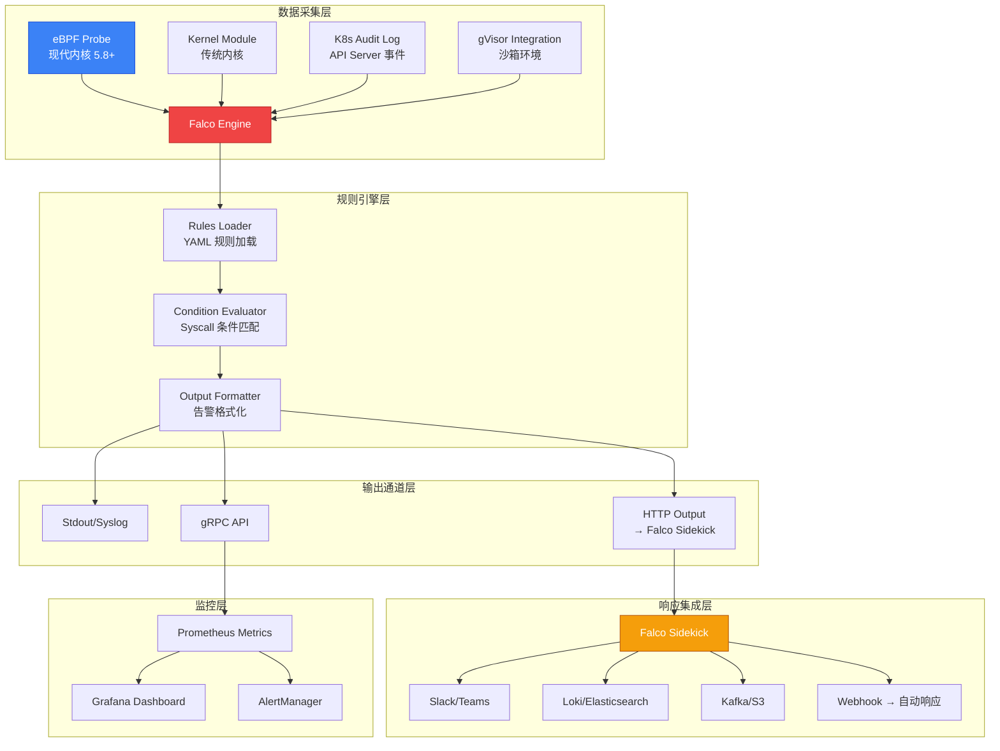

# [[Falco|Falco]] 云原生安全监控深度实践

> **适用版本**: Falco v0.41.0 / Falco Sidekick v2.28
> **最后更新**: 2026-04-24
> **难度**: 中级 → 高级

---

<!-- chunk: 一、概述与威胁模型 -->## 一、概述与威胁模型

Falco 是 CNCF 毕业项目，也是云原生运行时安全的事实标准。它通过 eBPF 或内核模块捕获 Linux 系统调用，结合灵活的规则引擎，实时检测容器、K8s 集群和主机层面的异常行为。Falco 的核心价值在于填补了传统安全工具在容器环境中的盲区——容器的短暂性（ephemeral nature）使得传统的基于日志的分析方法难以有效追踪安全事件，而 Falco 通过内核级事件捕获实现了对容器行为的实时可见性。

在传统虚拟机环境中，安全团队可以依赖主机入侵检测系统（HIDS）和网络入侵检测系统（NIDS）来监控运行时行为。然而在容器化环境中，多个容器共享同一个宿主机内核，传统的基于边界的检测方法不再适用。容器的生命周期可能只有几分钟甚至几秒，安全事件可能在容器销毁后不留任何痕迹。Falco 通过在内核层面拦截系统调用，实现了对容器行为的无侵入式实时监控，无论容器生命周期多么短暂，都能捕获其安全事件。

Falco 的设计哲学是「安全工具应该是透明的」。它不需要修改应用程序代码，不需要重新编译容器镜像，不需要在应用层面做任何适配。Falco 以 [[DaemonSet|DaemonSet]] 模式部署在 K8s 集群的每个节点上，通过读取 /proc 和 /dev 文件系统获取容器元数据，通过 eBPF 或内核模块捕获系统调用，完全对被监控的应用透明。

Falco 的社区生态也非常活跃。官方规则库包含超过 300 条预置规则，覆盖了 MITRE ATT&CK 容器矩阵中的大部分战术。Falco Sidekick 提供了与 50+ 外部系统的集成能力，包括 Slack、Teams、PagerDuty、Elasticsearch、Loki、Kafka、S3 等主流平台。Falco 插件系统（0.36+ 版本）进一步扩展了其检测能力，支持 K8s Audit Log、AWS CloudTrail 等非系统调用事件源。

在企业落地的过程中，Falco 的价值不仅体现在技术层面的威胁检测能力，更体现在安全运营流程的建立。通过 Falco 的告警机制，安全团队可以建立从检测到响应的完整安全运营闭环。Falco 的事件输出可以与企业的 SIEM/SOAR 平台集成，实现安全事件的集中化管理和自动化响应。这对于满足 PCI DSS、SOC 2、ISO 27001 等合规框架的运行时安全监控要求尤为重要。

在实际部署中，Falco 通常与其他安全工具配合使用形成纵深防御体系。Kyverno 或 OPA Gatekeeper 在准入阶段阻止不安全配置进入集群，Trivy 在构建阶段扫描镜像漏洞，而 Falco 则负责运行时阶段的最后一道防线——即使前两道防线被突破，Falco 仍然可以检测到异常行为并触发告警。这种「不信任任何单一防线」的纵深防御理念，是云原生安全架构的核心原则。

## 云原生运行时威胁模型

云原生环境面临的运行时威胁与传统基础设施有本质差异。容器共享宿主机内核，内核漏洞可能导致容器逃逸。微服务架构下东西向流量激增，攻击者可能通过一个被攻陷的 Pod 横向移动到其他服务。CI/CD 管道中的恶意依赖可能在运行时触发异常行为。以下是 Falco 关注的核心威胁类别：

| 威胁类别 | 攻击示例 | MITRE ATT&CK 映射 | Falco 检测 |
|:---|:---|:---|:---|
| 特权提升 | 容器逃逸、privileged Pod、SUID 利用 | Privilege Escalation | 特权容器检测、内核模块加载 |
| 执行 | 反向 Shell、未授权 exec、加密货币挖矿 | Execution | Shell 检测、可疑进程 |
| 持久化 | 后门植入、SSH 密钥写入、crontab 修改 | Persistence | 文件写入规则、隐藏文件检测 |
| 防御规避 | 日志清除、进程隐藏、安全工具禁用 | Defense Evasion | 敏感文件修改、Falco 自身保护 |
| 凭据窃取 | Secret 读取、/etc/shadow 访问、云元数据 | Credential Access | 敏感文件读取、K8s Secret 审计 |
| 横向移动 | 网络扫描、K8s API 访问、etcd 通信 | Lateral Movement | 可疑网络连接、K8s API 调用 |
| 数据外泄 | 大量数据上传、DNS 隧道、外部存储同步 | Exfiltration | 异常出站流量、敏感文件读取 |
| 影响 | 勒索软件、资源耗尽、数据破坏 | Impact | 加密货币挖矿、资源滥用 |

---

<!-- chunk: 二、架构设计 -->## 二、架构设计

## 2.1 核心组件架构

Falco 的架构由数据采集层、规则引擎层、输出通道层和响应集成层四个层次组成。数据采集层负责从内核捕获系统调用事件，支持多种采集驱动以适配不同的内核版本和部署环境。规则引擎层负责加载 YAML 格式的规则文件，将原始事件与规则条件进行匹配，生成安全告警。输出通道层负责将告警发送到多种目的地，包括标准输出、syslog、gRPC API 和 HTTP 端点。响应集成层通过 Falco Sidekick 实现与 Slack、Elasticsearch、Kafka 等 50+ 外部系统的集成。

这种分层架构的设计使得每一层都可以独立扩展和替换。例如，数据采集层可以根据内核版本选择 modern-eBPF、传统 eBPF 或内核模块；输出通道层可以根据企业需求选择不同的告警目的地；响应集成层可以通过自定义 Webhook 实现任意复杂的自动化响应逻辑。



## 2.2 数据采集方式对比

Falco 支持三种系统调用采集方式，每种方式的适用场景不同：

| 采集方式 | 性能开销 | 内核要求 | 安全性 | 推荐场景 |
|:---|:---|:---|:---|:---|
| **modern-eBPF** | 低 (1-3%) | 5.8+ | 最安全 | 生产环境首选 |
| **eBPF** | 低 (2-5%) | 5.4+ | 安全 | 通用场景 |
| **Kernel Module** | 最低 (<2%) | 任意 | 需加载模块 | 传统环境 |
| **gVisor** | 高 (10-20%) | 任意 | 最安全 | 沙箱容器 |

## 2.3 工作原理详解

Falco 的工作流程分为四个阶段：事件捕获、解析过滤、规则匹配和告警输出。每个阶段的性能和正确性都直接影响整体的安全检测效果。

1. **事件捕获**：eBPF probe 在内核中挂载到系统调用入口/出口点，捕获 open, connect, execve, clone 等关键系统调用。modern-eBPF 使用 BPF trampoline 技术实现更高效的内核挂钩，避免了传统 kprobes 的开销。每个 CPU 核心有独立的缓冲区，避免多核竞争。捕获的事件包含系统调用号、参数、进程上下文（PID, TID, UID, GID）和时间戳。

2. **解析过滤**：将原始系统调用解析为结构化事件，附加容器元数据（容器 ID、名称、镜像、命名空间）。Falco 通过查询容器运行时接口（CRI）获取容器信息，并将其与系统调用事件关联。这一阶段还会应用预过滤器（prefilter），快速丢弃明显不相关的事件（如来自 Falco 自身进程的系统调用），减少后续规则匹配的计算量。

3. **规则匹配**：将解析后的事件与已加载的规则条件进行匹配，支持宏（macro）和列表（list）的组合复用。Falco 的规则引擎将 YAML 规则编译为高效的过滤器链，按优先级从高到低匹配，一旦匹配成功即生成告警。macro 机制允许定义可复用的条件片段，避免规则间的重复代码。list 机制允许定义可复用的值集合，如 shell 进程列表、敏感文件路径列表等。

4. **告警输出**：匹配成功的事件按优先级和输出格式生成告警，发送到配置的输出通道。Falco 支持多种输出格式（文本、JSON、gRPC），可以通过 HTTP 输出发送到 Falco Sidekick 进行进一步的路由和处理。告警信息包含丰富的上下文数据，如用户名、容器名、镜像、命令行参数、文件路径、网络连接等，便于安全团队快速定位和分析问题。

---

<!-- chunk: 三、核心配置 -->## 三、核心配置

## 3.1 Helm 生产级部署

> ⚠️ **🟡 中危变更** — 变更集群资源状态，建议先 --dry-run 或 diff 确认
> - `helm upgrade/install`：部署/升级 release

```bash
helm repo add falcosecurity https://falcosecurity.github.io/charts/
helm repo update

helm install falco falcosecurity/falco \
  --namespace falco \
  --create-namespace \
  --set driver.kind=modern-bpf \
  --set collectors.kubernetes.enabled=true \
  --set falco.grpc.enabled=true \
  --set falco.grpcOutput.enabled=true \
  --set falco.httpOutput.enabled=true \
  --set falco.httpOutput.url="http://falcosidekick:2801/" \
  --set customRules."custom-rules\.yaml"="$(cat custom-rules.yaml)" \
  --version 4.10.0
```

## 3.2 Falco 主配置文件

Falco 的主配置文件 falco.yaml 控制着引擎的所有行为参数。在生产环境中，正确的配置对性能和检测效果至关重要。以下配置经过大规模生产环境验证，覆盖了日志、规则、输出、gRPC、性能优化等关键配置项。

```yaml
# falco.yaml 核心配置
apiVersion: v1
kind: ConfigMap
metadata:
  name: falco-config
  namespace: falco
data:
  falco.yaml: |
    log_level: info
    log_stderr: true
    log_syslog: true

    rules_file:
      - /etc/falco/falco_rules.yaml
      - /etc/falco/falco_rules.local.yaml
      - /etc/falco/k8s_audit_rules.yaml
      - /etc/falco/rules.d

    stdout_output:
      enabled: true

    syslog_output:
      enabled: true
      facility: local0
      priority: warning

    file_output:
      enabled: true
      keep_alive: true
      filename: /var/log/falco/events.log

    http_output:
      enabled: true
      url: "http://falcosidekick:2801/"

    grpc:
      enabled: true
      bind_address: "0.0.0.0:5060"
      threadiness: 8

    grpc_output:
      enabled: true

    syscall_event_drops:
      actions:
        - log
        - alert
      rate: 0.03333
      max_burst: 1000

    syscall_buf_size_preset: 4
    thread_table_size: 131072
    snaplen: 4096

    modern_bpf:
      enabled: true
      cpus_for_each_buffer: 2

    container_engines:
      cri:
        enabled: true
        cri_unix_socket_paths:
          - /run/containerd/containerd.sock
          - /run/crio/crio.sock

    kubernetes:
      enabled: true
      api_user_agent: "falco-agent"
      node_name_env_var: "NODE_NAME"

    metadata_download:
      max_mb: 100
      chunk_wait_us: 1000
      watch_freq_sec: 1
```

## 3.3 Falco Sidekick 部署

Falco Sidekick 是 Falco 事件的路由和分发中心。它接收 Falco 引擎通过 HTTP 输出发送的安全事件，根据配置将事件路由到多个目的地。Sidekick 的设计理念是「单一入口、多路输出」——Falco 只需要发送到一个 HTTP 端点，Sidekick 负责将事件分发到 Slack、Elasticsearch、Loki、Kafka、S3 等所有配置的目的地。

Sidekick 还提供了事件聚合和限流功能。当同一规则在短时间内触发大量告警时（如某个蠕虫病毒在集群内传播），Sidekick 可以将相同的告警聚合为一条，避免淹没告警通道。限流功能确保即使 Falco 产生大量告警，也不会压垮下游系统。

```yaml
apiVersion: apps/v1
kind: Deployment
metadata:
  name: falcosidekick
  namespace: falco
spec:
  replicas: 2
  selector:
    matchLabels:
      app: falcosidekick
  template:
    metadata:
      labels:
        app: falcosidekick
    spec:
      containers:
        - name: falcosidekick
          image: falcosecurity/falcosidekick:2.28.0
          ports:
            - containerPort: 2801
          env:
            - name: SLACK_WEBHOOKURL
              valueFrom:
                secretKeyRef:
                  name: falco-secrets
                  key: slack-webhook-url
            - name: PROMETHEUS_EXPOSEMETRICS
              value: "true"
            - name: LOKI_HOSTPORT
              value: "http://loki.logging:3100"
            - name: ELASTICSEARCH_HOSTPORT
              value: "http://elasticsearch.logging:9200"
            - name: ELASTICSEARCH_INDEX
              value: "falco-events"
            - name: KAFKA_HOSTPORT
              value: "kafka.kafka:9092"
            - name: KAFKA_TOPIC
              value: "falco-alerts"
            - name: WEBHOOK_ADDRESS
              value: "http://response-engine:8080/falco"
          resources:
            requests:
              memory: "64Mi"
              cpu: "25m"
            limits:
              memory: "256Mi"
              cpu: "100m"
          livenessProbe:
            httpGet:
              path: /ping
              port: 2801
            initialDelaySeconds: 30
          readinessProbe:
            httpGet:
              path: /ping
              port: 2801
            initialDelaySeconds: 5
---
apiVersion: v1
kind: Service
metadata:
  name: falcosidekick
  namespace: falco
spec:
  selector:
    app: falcosidekick
  ports:
    - port: 2801
      targetPort: 2801
```

---

<!-- chunk: 四、安全策略实战 -->## 四、安全策略实战

## 4.1 核心安全规则详解

Falco 规则由三个核心概念组成：**List**（可复用的值列表）、**Macro**（可复用的条件组合）和 **Rule**（最终的检测规则）。理解这三者的层次关系是编写高质量规则的基础。

List 是最底层的复用单元，定义了一组可以在 macro 和 rule 中引用的值。例如 `shell_binaries` 列表定义了常见的 Shell 程序名，`sensitive_files` 列表定义了需要保护的系统文件路径。使用列表的好处是当需要添加新的 Shell 类型或敏感文件时，只需修改列表定义，所有引用该列表的规则自动生效。

Macro 是中间层的复用单元，定义了一组可以在 rule 中引用的条件表达式。例如 `shell_procs` macro 使用 `proc.name in (shell_binaries)` 判断当前进程是否为 Shell，`spawned_process` macro 使用 `evt.type = execve and evt.dir=<` 判断是否为新创建的进程。使用 macro 可以简化规则编写，提高可读性和可维护性。

Rule 是最上层的检测单元，定义了完整的检测条件、输出格式、优先级和标签。每条 rule 必须包含 condition（触发条件）、output（告警格式）、priority（优先级）三个必填字段，以及 desc（描述）和 tags（标签）等可选字段。

```yaml
# falco_rules.local.yaml

# List: 定义可复用的值集合
- list: shell_binaries
  items: [bash, csh, ksh, sh, tcsh, zsh, dash]

- list: sensitive_files
  items: [/etc/shadow, /etc/passwd, /etc/ssh/ssh_host_rsa_key, /etc/ssh/ssh_host_ed25519_key]

- list: blacklisted_ips
  items: ["185.220.101.", "45.33.32.", "91.219.236."]

# Macro: 定义可复用的条件
- macro: shell_procs
  condition: proc.name in (shell_binaries)

- macro: container
  condition: container.id != host

- macro: spawned_process
  condition: evt.type = execve and evt.dir=<

- macro: outbound
  condition: >
    (evt.type=connect and evt.dir=<) and
    (fd.type=ipv4 or fd.type=ipv6) and
    fd.connected=true

# Rule: 终端 Shell 检测
- rule: Terminal shell in container
  desc: A shell was spawned in a container with an attached terminal
  condition: >
    spawned_process and container
    and shell_procs and proc.tty != 0
    and container_entrypoint
  output: >
    Terminal shell in container
    (user=%user.name container_id=%container.id
    container_name=%container.name shell=%proc.name
    parent=%proc.pname cmdline=%proc.cmdline
    terminal=%proc.tty image=%container.image.repository)
  priority: WARNING
  tags: [container, shell, mitre_execution]

# Rule: 反向 Shell 检测
- rule: Reverse shell detected
  desc: Detect reverse shell establishment
  condition: >
    outbound and container
    and shell_procs
    and fd.type = ipv4
    and not proc.name in (apt, yum, dnf, apk)
  output: >
    Reverse shell detected
    (user=%user.name container=%container.name
    cmdline=%proc.cmdline connection=%fd.name
    image=%container.image.repository)
  priority: CRITICAL
  tags: [network, shell, mitre_execution, mitre_command_and_control]

# Rule: 敏感文件读取
- rule: Read sensitive file
  desc: Attempt to read sensitive files
  condition: >
    open_read and container
    and fd.name in (sensitive_files)
    and not proc.name in (sshd, sudo, su)
  output: >
    Sensitive file read
    (user=%user.name file=%fd.name
    container=%container.name image=%container.image.repository)
  priority: WARNING
  tags: [filesystem, mitre_credential_access]

# Rule: 加密货币挖矿检测
- rule: Detect crypto miners
  desc: Detection of cryptocurrency mining activities
  condition: >
    spawned_process and container
    and (proc.name in (xmrig, minerd, cgminer, ethminer, nicehash, phoenix)
    or proc.cmdline contains "stratum+tcp"
    or proc.cmdline contains "stratum+ssl"
    or proc.cmdline contains "pool.minexmr.com"
    or proc.cmdline contains "xmr.pool.minergate.com"
    or proc.cmdline contains "pool.supportxmr.com")
  output: >
    Crypto miner detected
    (user=%user.name cmdline=%proc.cmdline
    container=%container.name image=%container.image.repository)
  priority: CRITICAL
  tags: [malware, mining, mitre_impact]

# Rule: 可疑网络连接
- rule: Unexpected outbound connection
  desc: Detect connections to suspicious destinations
  condition: >
    outbound and container
    and (fd.sip in (blacklisted_ips)
    or fd.sip = "0.0.0.0"
    or (fd.sport = 443 and fd.sip != "kubernetes.default.svc"))
  output: >
    Unexpected outbound connection
    (user=%user.name connection=%fd.name
    container=%container.name image=%container.image.repository
    cmdline=%proc.cmdline)
  priority: WARNING
  tags: [network, mitre_command_and_control]

# Rule: /etc 目录写入
- rule: Write below etc
  desc: Detect writes to /etc directory
  condition: >
    open_write and container
    and fd.name startswith "/etc/"
    and not proc.name in (apt, dpkg, yum, rpm, apk)
  output: >
    File below /etc opened for writing
    (user=%user.name file=%fd.name
    container=%container.name image=%container.image.repository)
  priority: ERROR
  tags: [filesystem, mitre_persistence]

# Rule: 隐藏文件创建
- rule: Create hidden file or directory
  desc: Hidden file or directory created in container
  condition: >
    (mkdir or open_write) and container
    and evt.arg.path contains "/."
    and not evt.arg.path contains "/.cache/"
    and not evt.arg.path contains "/.config/"
  output: >
    Hidden file/directory created
    (user=%user.name path=%evt.arg.path
    container=%container.name image=%container.image.repository)
  priority: WARNING
  tags: [filesystem, mitre_defense_evasion]
```

## 4.2 K8s 审计规则

Falco 可以通过 K8s Audit Log 监控 API Server 事件，检测集群级别的安全事件。K8s Audit Log 是 API Server 内置的审计功能，记录了所有对 API Server 的请求（包括成功和失败的请求）。Falco 通过 k8saudit 插件接收这些审计事件，应用专门的审计规则进行检测。

审计规则与系统调用规则的区别在于事件源不同。系统调用规则检测的是容器内的进程行为（如执行 Shell、读取文件），审计规则检测的是 K8s API 层面的操作（如创建 Pod、修改 Secret、删除 NetworkPolicy）。两者互补，共同构成完整的运行时安全监控体系。

```yaml
# K8s 审计事件规则
- rule: K8s Pod Exec into container
  desc: Detect exec into a running pod
  condition: >
    kevt and ka.verb=exec and ka.resource=pods
    and not ka.user.name in (system:node, admin, deploy-bot)
  output: >
    K8s Pod exec detected
    (user=%ka.user.name ns=%ka.namespace
    pod=%ka.target.name container=%ka.target.subresource
    command=%ka.target.subresource)
  priority: NOTICE
  source: k8s_audit
  tags: [k8s, pod, mitre_execution]

- rule: K8s Secret Accessed
  desc: Detect secret access attempts
  condition: >
    kevt and ka.verb in (get, list) and ka.resource=secrets
    and not ka.user.name in (system:serviceaccount:kube-system)
  output: >
    K8s Secret accessed
    (user=%ka.user.name ns=%ka.namespace
    secret=%ka.target.name verb=%ka.verb)
  priority: WARNING
  source: k8s_audit
  tags: [k8s, secret, mitre_credential_access]

- rule: K8s Role/ClusterRole Created
  desc: Detect RBAC privilege escalation
  condition: >
    kevt and ka.verb=create and ka.resource in (roles, clusterroles)
    and not ka.user.name in (system:admin, system:kube-controller-manager)
  output: >
    K8s Role created
    (user=%ka.user.name ns=%ka.namespace
    name=%ka.target.name resource=%ka.resource)
  priority: WARNING
  source: k8s_audit
  tags: [k8s, rbac, mitre_privilege_escalation]

- rule: K8s NetworkPolicy Deleted
  desc: Detect NetworkPolicy deletion
  condition: >
    kevt and ka.verb=delete and ka.resource=networkpolicies
  output: >
    K8s NetworkPolicy deleted
    (user=%ka.user.name ns=%ka.namespace
    name=%ka.target.name)
  priority: WARNING
  source: k8s_audit
  tags: [k8s, network, mitre_defense_evasion]

- rule: K8s ServiceAccount Created
  desc: Detect new ServiceAccount creation
  condition: >
    kevt and ka.verb=create and ka.resource=serviceaccounts
    and not ka.user.name in (system:serviceaccount:kube-system)
  output: >
    K8s ServiceAccount created
    (user=%ka.user.name ns=%ka.namespace
    name=%ka.target.name)
  priority: INFO
  source: k8s_audit
  tags: [k8s, sa, mitre_persistence]
```

## 4.3 自定义规则开发

编写自定义规则时应遵循以下原则。这些原则来自 Falco 社区的最佳实践总结和大规模生产环境的运维经验，遵循这些原则可以显著提高规则质量和降低维护成本。

1. **从宏观到微观**：先使用通用 macro 过滤大范围事件，再逐步精确条件。例如先使用 `container` macro 确保只在容器上下文中匹配，再添加具体的进程名或文件路径条件。这种「漏斗式」的规则编写方式既保证了性能（减少不必要的条件评估），也提高了规则的可读性。
2. **利用白名单**：为已知的正常行为添加例外条件，降低误报率
3. **使用标签分类**：为每条规则添加 MITRE ATT&CK 标签，便于分类和报告
4. **合理设置优先级**：Critical 用于确认攻击，Warning 用于可疑行为，Info 用于审计追踪
5. **测试验证**：使用 `falco --validate` 验证规则语法，使用测试事件验证检测效果

```bash
# 验证规则语法
falco --validate /etc/falco/rules.d/custom-rules.yaml

# 测试特定规则
falco -r /etc/falco/rules.d/custom-rules.yaml -e test-event.json

# 实时测试 (dry-run)
falco -r /etc/falco/rules.d/custom-rules.yaml -A
```

---

<!-- chunk: 五、合规与审计 -->## 五、合规与审计

## 5.1 CIS Benchmark 规则

CIS (Center for Internet Security) Kubernetes Benchmark 是业界广泛认可的 K8s 安全配置基准。Falco 可以通过系统调用监控检测违反 CIS Benchmark 的运行时行为，作为 Kubescape 静态扫描的补充。

CIS Benchmark 检测与静态扫描的区别在于：静态扫描（如 Kubescape）检查配置文件是否符合规范，而 Falco 检测运行时的实际行为是否违反规范。例如，Kubescape 可以检查 API Server 的启动参数是否包含 `--anonymous-auth=false`，而 Falco 可以检测 API Server 运行时是否实际上启用了匿名认证（通过监控 /proc/cmdline）。这种运行时检测可以发现静态扫描无法发现的问题——配置文件可能正确，但运行时参数被覆盖或修改。

```yaml
- rule: CIS 1.2.1 - Anonymous auth enabled
  desc: Ensure anonymous authentication is disabled
  condition: >
    spawned_process and proc.name = "kube-apiserver"
    and proc.cmdline contains "--anonymous-auth=true"
  output: >
    CIS 1.2.1 violation - Anonymous auth enabled
    (cmdline=%proc.cmdline)
  priority: CRITICAL
  tags: [cis, k8s, compliance, authentication]

- rule: CIS 1.2.2 - Basic auth file configured
  desc: Ensure basic-auth-file is not used
  condition: >
    spawned_process and proc.name = "kube-apiserver"
    and proc.cmdline contains "--basic-auth-file"
  output: >
    CIS 1.2.2 violation - Basic auth file configured
    (cmdline=%proc.cmdline)
  priority: CRITICAL
  tags: [cis, k8s, compliance, authentication]

- rule: CIS 4.2.6 - Insecure kubelet port
  desc: Ensure kubelet does not use insecure port
  condition: >
    spawned_process and proc.name = "kubelet"
    and proc.cmdline contains "--port="
    and not proc.cmdline contains "--port=0"
  output: >
    CIS 4.2.6 violation - Kubelet insecure port enabled
    (cmdline=%proc.cmdline)
  priority: WARNING
  tags: [cis, k8s, compliance, kubelet]
```

## 5.2 K8s Audit Policy 配置

为了使 Falco 接收 K8s Audit Log，需要配置 API Server 的审计策略。审计策略定义了哪些 API 请求需要被记录，以及记录的详细程度。审计策略的配置需要平衡安全可见性和存储成本——过于详细的审计会产生大量日志，增加存储压力和搜索延迟；过于粗略的审计可能遗漏关键的安全事件。

推荐的审计策略设计原则：对于安全敏感资源（Secret、RBAC、NetworkPolicy），记录完整的请求和响应内容（level: RequestResponse）；对于可能被滥用的操作（exec、attach、port-forward），记录请求元数据（level: Request）；对于低风险操作（events 创建），可以不记录（level: None）。

```yaml
# /etc/kubernetes/audit-policy.yaml
apiVersion: audit.k8s.io/v1
kind: Policy
rules:
  - level: RequestResponse
    resources:
      - group: ""
        resources: ["secrets", "configmaps"]
    namespaces: ["production", "staging"]
    verbs: ["create", "update", "patch", "delete"]

  - level: Request
    resources:
      - group: ""
        resources: ["pods/exec", "pods/attach", "pods/portforward"]
    verbs: ["create"]

  - level: Request
    resources:
      - group: "rbac.authorization.k8s.io"
        resources: ["roles", "clusterroles", "rolebindings", "clusterrolebindings"]
    verbs: ["create", "update", "patch", "delete"]

  - level: Metadata
    resources:
      - group: ""
        resources: ["pods", "deployments", "services"]
    verbs: ["delete", "deletecollection"]

  - level: None
    resources:
      - group: ""
        resources: ["events"]
```

## 5.3 审计日志配置

```yaml
# Falco 审计日志 ConfigMap
apiVersion: v1
kind: ConfigMap
metadata:
  name: falco-audit-rules
  namespace: falco
data:
  audit_rules.yaml: |
    - rule: Audit log tampering
      desc: Detect attempts to modify or delete audit logs
      condition: >
        (open_write or unlink) and container
        and fd.name startswith "/var/log/audit/"
      output: >
        Audit log tampering detected
        (user=%user.name file=%fd.name
        action=%evt.type container=%container.name)
      priority: CRITICAL
      tags: [audit, compliance, mitre_defense_evasion]

    - rule: Critical config file modification
      desc: Monitor changes to critical system files
      condition: >
        open_write and container
        and fd.name in ("/etc/passwd", "/etc/shadow",
        "/etc/group", "/etc/sudoers", "/etc/ssh/sshd_config")
      output: >
        Critical config file modified
        (user=%user.name file=%fd.name
        container=%container.name)
      priority: CRITICAL
      tags: [audit, compliance, filesystem]
```

---

<!-- chunk: 六、监控与告警 -->## 六、监控与告警

## 6.1 Prometheus ServiceMonitor

```yaml
apiVersion: monitoring.coreos.com/v1
kind: ServiceMonitor
metadata:
  name: falco-monitor
  namespace: falco
spec:
  selector:
    matchLabels:
      app: falcosidekick
  endpoints:
    - port: http
      path: /metrics
      interval: 30s
---
apiVersion: monitoring.coreos.com/v1
kind: PrometheusRule
metadata:
  name: falco-alerts
  namespace: falco
spec:
  groups:
    - name: falco.rules
      rules:
        - alert: FalcoCriticalAlert
          expr: rate(falco_events_total{priority="Critical"}[5m]) > 0
          for: 1m
          labels:
            severity: critical
          annotations:
            summary: "Falco 检测到严重安全威胁"
            runbook: "https://wiki.internal/runbooks/falco-critical"

        - alert: FalcoWarningSpike
          expr: rate(falco_events_total{priority="Warning"}[10m]) > 5
          for: 5m
          labels:
            severity: warning
          annotations:
            summary: "Falco 警告事件激增"

        - alert: FalcoEngineDown
          expr: up{job="falco"} == 0
          for: 2m
          labels:
            severity: critical
          annotations:
            summary: "Falco 引擎不可用"

        - alert: FalcoHighDropRate
          expr: rate(falco_evts_drop_total[5m]) > 100
          for: 1m
          labels:
            severity: warning
          annotations:
            summary: "Falco 事件丢弃率过高"

        - alert: FalcoHighLatency
          expr: rate(falco_evt_latency_ns_sum[5m]) / rate(falco_evt_latency_ns_count[5m]) > 1000000
          for: 5m
          labels:
            severity: warning
          annotations:
            summary: "Falco 事件处理延迟过高 (>1ms)"
```

## 6.2 Grafana Dashboard JSON

Falco 的安全仪表板是安全团队日常运营的核心工具。一个好的仪表板应该能够回答以下问题：当前有多少活跃的安全事件？最常触发的规则是哪些？哪些容器/命名空间产生了最多的安全事件？安全事件的趋势是在增加还是减少？

以下 Grafana 仪表板配置提供了四个核心面板：安全事件趋势图（展示不同优先级事件的时间趋势）、今日严重事件统计（关键指标的实时展示）、规则触发分布（识别需要调优的高误报规则）、以及最近安全事件表（详细的告警列表）。

```json
{
  "dashboard": {
    "title": "Falco Runtime Security",
    "refresh": "30s",
    "panels": [
      {
        "type": "timeseries",
        "title": "安全事件趋势",
        "gridPos": {"h": 8, "w": 12, "x": 0, "y": 0},
        "targets": [
          {"expr": "rate(falco_events_total[5m])", "legendFormat": "{{priority}}"}
        ]
      },
      {
        "type": "stat",
        "title": "今日严重事件",
        "gridPos": {"h": 4, "w": 6, "x": 12, "y": 0},
        "targets": [
          {"expr": "increase(falco_events_total{priority=\"Critical\"}[24h])", "instant": true}
        ]
      },
      {
        "type": "piechart",
        "title": "规则触发分布",
        "gridPos": {"h": 8, "w": 6, "x": 18, "y": 0},
        "targets": [
          {"expr": "topk(10, falco_events_total)", "legendFormat": "{{rule}}"}
        ]
      },
      {
        "type": "table",
        "title": "最近安全事件",
        "gridPos": {"h": 8, "w": 24, "x": 0, "y": 8},
        "targets": [
          {"expr": "falco_events_total", "format": "table"}
        ]
      }
    ]
  }
}
```

---

<!-- chunk: 七、自动化响应 -->## 七、自动化响应

## 7.1 响应引擎架构

Falco 检测到安全事件后，可以通过 Webhook 触发自动化响应动作。响应引擎接收 Falco Sidekick 转发的事件，根据预定义的策略执行响应动作。自动化响应是安全运营成熟度的关键指标——手动响应的平均时间（MTTR）通常以小时计，而自动化响应可以将响应时间缩短到秒级。

响应引擎的设计需要考虑幂等性和安全性。幂等性确保同一事件被处理多次不会产生重复的响应动作（如多次删除同一个 Pod）。安全性确保响应动作本身不会引入新的安全风险（如响应引擎的 ServiceAccount 应该只拥有最小必要权限，且响应动作应该有审计日志）。

常见的响应动作类型包括：删除被攻陷的 Pod（kill_pod）、通过网络策略隔离 Pod（network_isolate）、通知安全团队（notify_slack）、捕获取证数据（capture_forensics）、以及将恶意镜像加入黑名单（quarantine_image）。企业应根据自身的风险偏好和运营成熟度，选择适当的自动化响应级别。

```yaml
apiVersion: apps/v1
kind: Deployment
metadata:
  name: falco-response-engine
  namespace: falco
spec:
  replicas: 1
  selector:
    matchLabels:
      app: response-engine
  template:
    metadata:
      labels:
        app: response-engine
    spec:
      serviceAccountName: falco-responder
      containers:
        - name: response-engine
          image: falco-response-engine:latest
          env:
            - name: POLICIES_PATH
              value: "/etc/response/policies.yaml"
          volumeMounts:
            - name: policies
              mountPath: /etc/response
      volumes:
        - name: policies
          configMap:
            name: response-policies
---
apiVersion: v1
kind: ConfigMap
metadata:
  name: response-policies
  namespace: falco
data:
  policies.yaml: |
    response_policies:
      - name: "crypto_mining"
        rule: "Detect crypto miners"
        severity_threshold: CRITICAL
        actions:
          - type: kill_pod
            enabled: true
          - type: notify_slack
            channel: "#security-critical"
          - type: quarantine_image
            duration: "7d"

      - name: "reverse_shell"
        rule: "Reverse shell detected"
        severity_threshold: CRITICAL
        actions:
          - type: kill_pod
            enabled: true
          - type: network_isolate
            enabled: true
          - type: notify_slack
            channel: "#security-critical"
          - type: capture_forensics
            enabled: true

      - name: "suspicious_shell"
        rule: "Terminal shell in container"
        severity_threshold: WARNING
        actions:
          - type: notify_slack
            channel: "#security-ops"
          - type: log_event
            enabled: true
---
apiVersion: rbac.authorization.k8s.io/v1
kind: ClusterRole
metadata:
  name: falco-responder
rules:
  - apiGroups: [""]
    resources: ["pods"]
    verbs: ["get", "list", "delete"]
  - apiGroups: ["networking.k8s.io"]
    resources: ["networkpolicies"]
    verbs: ["get", "list", "create", "update"]
```

---

<!-- chunk: 八、最佳实践 -->## 八、最佳实践

## 8.1 规则管理

良好的规则管理是 Falco 成功运行的关键。在企业环境中，规则通常需要经过开发、测试、审核、发布的完整流程。推荐的规则管理流程如下：

首先，在开发环境中编写新规则，使用 `falco --validate` 验证语法正确性。然后在测试集群中以 audit 模式（不阻断）运行新规则，观察 1-2 周的实际检测效果和误报率。根据观察结果调整规则条件，添加必要的白名单和例外条件。最后，将审核通过的规则通过 GitOps 流程发布到生产环境。

规则文件的组织建议采用分层结构：基础层使用 Falco 官方规则库（falco_rules.yaml），环境覆盖层根据不同环境调整规则参数（如允许的进程列表、可信 IP 范围），自定义层添加企业特定的安全规则（如业务逻辑异常检测）。这种分层设计确保了官方规则的及时更新，同时保持自定义规则的独立性。

| 实践 | 说明 |
|:---|:---|
| 版本控制 | 将自定义规则存储在 Git 仓库，通过 ConfigMap 或 Helm values 管理 |
| 分层设计 | base 规则 → 环境覆盖 → 自定义规则，使用 macro 和 list 复用 |
| 误报调优 | 在 audit 模式运行 1-2 周，收集误报后添加白名单 |
| 优先级分级 | Critical 确认攻击，Warning 可疑行为，Info 审计追踪 |
| 定期更新 | 订阅 falcosecurity/rules 仓库更新，关注新 CVE 的检测规则 |
| 标签分类 | 使用 MITRE ATT&CK 标签，便于分类统计和合规报告 |
| 规则审计 | 每季度审核现有规则，删除过时规则，更新白名单 |

## 8.2 性能优化

| 配置项 | 推荐值 | 说明 |
|:---|:---|:---|
| `modern_bpf.enabled` | true | 使用 modern eBPF 驱动，性能最优 |
| `syscall_buf_size_preset` | 4 (8MB) | 每CPU缓冲区大小，过低导致丢事件 |
| `thread_table_size` | 131072 | 线程表大小，高负载环境调大 |
| `snaplen` | 4096 | 捕获的事件数据长度 |
| `cpus_for_each_buffer` | 2 | 每个缓冲区分配的CPU数 |
| Resources | CPU 100m-1000m, Mem 512Mi-1Gi | 根据节点负载调整 |

在调优过程中，最关键的指标是事件丢失率（`falco_evts_drop_total`）。如果此指标持续增长，说明 Falco 来不及处理内核产生的事件流，需要增大缓冲区或简化规则。另一个重要指标是事件延迟（`falco_evt_latency_ns`），过高的延迟可能导致告警不及时，影响事件响应的时效性。

对于高密度节点（运行 500+ Pod），建议将 Falco 的 CPU 限制提高到 2000m，内存限制提高到 2Gi。同时，可以考虑使用规则过滤（`--filter`）只监控特定命名空间或容器，减少不必要的事件处理开销。

## 8.3 安全运营

安全运营不仅仅是部署工具，更需要建立可持续的流程和团队文化。以下是 Falco 安全运营的推荐实践：

| 实践 | 说明 |
|:---|:---|
| Runbook | 为每个 Critical 规则编写响应 Runbook，明确操作步骤和责任人 |
| 演练 | 每季度进行安全演练，使用 kube-hunter 或模拟攻击验证检测和响应流程 |
| 仪表板 | 建立 Falco 安全仪表板，实时展示威胁态势和趋势 |
| 报告 | 每月生成安全事件统计报告，跟踪改进趋势，向管理层汇报安全状态 |
| 集成 | 与 SIEM/SOAR 平台集成，实现统一安全管理和自动化响应 |
| 事件复盘 | 每次安全事件后进行复盘（Post-Mortem），改进检测规则和响应流程 |
| 团队培训 | 定期对运维和开发团队进行安全意识培训，讲解 Falco 告警的含义 |

---

<!-- chunk: 九、故障排查 -->## 九、故障排查

## 9.1 常见问题

Falco 在生产环境中可能遇到各种运维问题。本节总结了最常见的问题场景及其排查方法。

当 Falco Pod 处于 CrashLoopBackOff 状态时，最常见的原因是 eBPF probe 加载失败。这通常是因为内核版本不支持所需的 BPF 特性（要求 5.8+），或者内核配置缺少必要的选项（如 CONFIG_BPF=y, CONFIG_BPF_SYSCALL=y）。可以通过 `kubectl logs -n falco daemonset/falco` 查看具体错误信息，通过 `uname -r` 确认内核版本。

事件丢失（`falco_evts_drop_total` 持续增长）是另一个常见问题。事件丢失意味着部分系统调用未被处理，可能导致安全事件漏检。解决方法包括增大缓冲区（`syscall_buf_size_preset`）、增加线程表大小（`thread_table_size`）、以及简化规则条件减少计算量。在高负载节点上，建议使用 modern-eBPF 驱动，它的性能开销最低。

高误报率会影响安全团队的效率和信任度。降低误报率的关键在于精细化规则条件。建议在 audit 模式（只记录不阻断）下运行新规则 1-2 周，收集所有匹配事件，逐条分析是否为误报。对于确认的误报，添加白名单条件（如排除特定进程名、命名空间、容器镜像）。同时，应避免使用过于宽泛的条件，如仅匹配文件路径前缀而不限制进程名。

当 Falco Sidekick 收不到事件时，应按以下顺序排查：首先检查 Falco 的 HTTP 输出配置（`http_output.url`），确认 URL 正确且可达。然后检查 NetworkPolicy 是否允许 falco namespace 到 falcosidekick Service 的流量。最后检查 Sidekick 的日志，确认是否收到 HTTP 请求。

对于 K8s 审计事件缺失的问题，需要确认 API Server 的审计配置是否正确。检查 `--audit-log-path` 和 `--audit-policy-file` 参数，以及 Falco 的 K8s Audit Webhook 是否正确注册。审计策略中的规则级别也很重要，`level: None` 的事件不会被记录。

| 问题 | 原因 | 解决方案 |
|:---|:---|:---|
| Falco Pod CrashLoopBackOff | eBPF probe 加载失败 | 检查内核版本 (5.8+)，确认 `CONFIG_BPF=y` |
| 事件丢失 | 缓冲区溢出 | 调大 `syscall_buf_size_preset`，增加 `thread_table_size` |
| 高 CPU 使用率 | 规则过于复杂 | 优化规则条件，使用 macro 复用，减少不必要的字段匹配 |
| 高误报率 | 规则条件过于宽泛 | 在 audit 模式运行 2 周，收集基线后添加白名单 |
| Sidekick 收不到事件 | 网络策略阻断 | 检查 NetworkPolicy 是否允许 falco → falcosidekick 通信 |
| K8s 审计事件缺失 | Audit Policy 未配置 | 检查 API Server audit-policy-file 配置 |
| 容器元数据缺失 | K8s API 连接失败 | 检查 ServiceAccount 权限和 `kubernetes.enabled=true` |
| gRPC 连接失败 | 证书或网络问题 | 检查 gRPC bind_address 和 TLS 配置 |

## 9.2 诊断命令

当 Falco 出现异常时，以下诊断命令可以帮助快速定位问题。建议将这些命令整理为运维 Runbook，方便值班人员快速参考。

Falco 的日志是最重要的诊断信息来源。通过 `kubectl logs` 查看 Falco 容器的标准输出和标准错误，可以找到大多数问题的根本原因。特别关注包含 "error"、"fatal"、"drop" 关键词的日志行。对于 eBPF probe 加载问题，日志通常会包含具体的内核版本和 BPF 特性兼容性信息。对于规则匹配问题，可以启用 debug 日志级别（`log_level: debug`）查看详细的事件匹配过程。

> ⚠️ **🟡 中危变更** — 变更集群资源状态，建议先 --dry-run 或 diff 确认
> - `kubectl exec`：进入容器执行命令，可能改变容器状态

```bash
# 检查 Falco 状态
kubectl logs -n falco daemonset/falco --tail=100

# 验证规则语法
kubectl exec -n falco daemonset/falco -- falco --validate /etc/falco/rules.d/custom.yaml

# 检查 eBPF probe 加载
kubectl exec -n falco daemonset/falco -- lsmod | grep falco

# 查看实时事件
kubectl exec -n falco daemonset/falco -- falco -A -r /etc/falco/falco_rules.local.yaml

# 检查 Prometheus 指标
kubectl exec -n falco deployment/falcosidekick -- wget -qO- localhost:2801/metrics

# 检查 Sidekick 连通性
kubectl exec -n falco daemonset/falco -- curl -s http://falcosidekick:2801/ping

# 查看 K8s Audit Webhook 配置
kubectl get validatingwebhookconfiguration -o yaml | grep -A 10 falco
```

---

<!-- chunk: 十、威胁检测场景深度分析 -->## 十、威胁检测场景深度分析

本节深入分析几个典型的云原生安全攻击场景，并展示 Falco 如何在每个阶段检测和响应这些威胁。理解攻击者的战术、技术和程序（TTP）有助于编写更精准的检测规则。

## 10.1 场景一：容器逃逸攻击

容器逃逸是云原生环境中最严重的安全风险之一。攻击者通过利用内核漏洞（如 CVE-2024-1086 nf_tables 漏洞、CVE-2022-0185 namespace 漏洞）或错误配置（如 privileged Pod、hostPath 挂载）突破容器隔离，获取宿主机控制权。容器逃逸的成功意味着攻击者可以控制该节点上运行的所有容器，进而通过 K8s 控制面横向移动到整个集群。

攻击链通常包括以下步骤：首先，攻击者通过漏洞利用或错误配置获得容器内的初始访问权限（可能通过 Web 应用漏洞、恶意依赖包、或者社会工程学等手段）；然后，通过内核漏洞或 Docker/K8s API 滥用实现容器逃逸；最终在宿主机上执行恶意代码，横向移动到其他节点。在 real-world 攻击中，容器逃逸后攻击者通常会首先修改 K8s RBAC 配置以确保持久访问权限，然后部署加密货币挖矿程序或勒索软件。

Falco 检测策略包括多个层面：首先在准入阶段（配合 Kyverno）阻止特权容器和危险挂载的创建；然后在运行时监控容器内的可疑行为，如内核模块加载、Docker socket 访问、namespace 操作等；最后通过审计日志监控 K8s API 调用模式的变化。这种多层次的检测策略确保即使某一层被绕过，其他层仍然能够检测到攻击行为。

```yaml
- rule: Container escape via privileged mode
  desc: Detect containers running in privileged mode
  condition: >
    container and container.privileged=true
    and spawned_process
    and not proc.name in (pause, calico, coredns)
  output: >
    Privileged container detected
    (container=%container.name image=%container.image.repository
    cmdline=%proc.cmdline)
  priority: CRITICAL
  tags: [container, escape, mitre_privilege_escalation]

- rule: Docker socket accessed
  desc: Detect access to Docker socket from container
  condition: >
    open_read and container
    and fd.name = "/var/run/docker.sock"
  output: >
    Docker socket accessed from container
    (container=%container.name image=%container.image.repository)
  priority: CRITICAL
  tags: [container, escape, mitre_privilege_escalation]

- rule: Namespace manipulation detected
  desc: Detect namespace manipulation for container escape
  condition: >
    spawned_process and container
    and (proc.name in (unshare, nsenter)
    or proc.cmdline contains "nsenter"
    or proc.cmdline contains "unshare --")
  output: >
    Namespace manipulation detected
    (container=%container.name cmdline=%proc.cmdline)
  priority: CRITICAL
  tags: [container, escape, mitre_privilege_escalation]
```

## 10.2 场景二：供应链投毒攻击

供应链投毒攻击（Supply Chain Poisoning）是近年来增长最快的攻击类型之一。攻击者通过在公共镜像仓库中上传恶意镜像、在 NPM/PyPI 等包管理器中发布恶意依赖包、或者劫持 CI/CD 管道注入恶意代码，在受害者不知情的情况下将恶意代码引入生产环境。与传统的直接攻击不同，供应链攻击利用的是开发者对开源生态的信任，因此具有极高的隐蔽性和破坏力。

典型案例包括：Codecov 供应链攻击（通过修改 bash 脚本窃取 CI 环境变量中的密钥和令牌）、 ua-parser-js 恶意注入（NPM 包被劫持后植入加密货币挖矿程序和凭据窃取脚本）、以及 Cointelegraph 恶意 Docker 镜像事件（官方 Docker Hub 镜像被替换为包含后门的版本）。这些事件的共同特点是攻击者利用了软件供应链中的信任链条，使得恶意代码能够绕过传统的安全检查。

Falco 检测供应链投毒的策略侧重于运行时行为监控。即使恶意代码已经成功进入容器，其异常行为仍然可以被检测到。典型的恶意行为包括：向未知 IP 地址发起网络连接（命令控制通道）、执行加密货币挖矿程序（资源滥用）、读取敏感环境变量并发送到外部服务器（凭据窃取）、以及修改系统文件以建立持久化后门。

Falco 检测供应链投毒的策略侧重于运行时行为监控。即使恶意代码已经进入容器，其异常行为（如向未知 IP 发起连接、执行加密货币挖矿程序、读取敏感环境变量并发送到外部服务器）可以被 Falco 规则捕获。此外，结合 Kyverno 的镜像签名验证，可以在准入阶段阻止未经验证的镜像进入集群。

```yaml
- rule: Suspicious outbound to unknown port
  desc: Detect outbound connections to non-standard ports
  condition: >
    outbound and container
    and not fd.sport in (80, 443, 8080, 8443, 9090, 5432, 6379, 3306, 27017)
    and not fd.sip in (kubernetes_service_ips, trusted_ranges)
  output: >
    Suspicious outbound connection
    (container=%container.name connection=%fd.name
    image=%container.image.repository)
  priority: WARNING
  tags: [network, supply_chain, mitre_command_and_control]

- rule: Sensitive environment variable read
  desc: Detect reading of sensitive env vars and sending externally
  condition: >
    open_read and container
    and fd.name startswith "/proc/self/environ"
    and followed_by_outbound
  output: >
    Potential credential exfiltration via env read
    (container=%container.name cmdline=%proc.cmdline)
  priority: CRITICAL
  tags: [credential_access, supply_chain, mitre_credential_access]
```

## 10.3 场景三：横向移动攻击

在微服务架构中，攻击者攻陷一个 Pod 后，通常会尝试横向移动到其他服务。横向移动是攻击链中的关键环节，它决定了攻击的影响范围。如果横向移动被及时发现和阻断，攻击的损害可以限制在单个 Pod 或服务内；如果横向移动成功，攻击者可能获取整个集群的控制权。

常见的横向移动技术包括：利用 K8s ServiceAccount Token 调用 API Server 获取集群信息（如列出所有 Secret、获取其他 Pod 的配置）、通过服务发现定位高价值目标（如数据库服务、消息队列）、利用服务间信任关系（如 mTLS 配置不当、ServiceAccount 过度授权）进行跳板攻击。在 real-world 攻击中，攻击者通常会先使用 `kubectl` 或 K8s API 进行侦察（列出命名空间、服务、Pod），然后针对高价值目标发起攻击。

Falco 通过监控容器内的 K8s API 调用和异常网络连接来检测横向移动行为。特别是当业务容器突然开始主动连接 K8s API Server（而不是通过 client-go SDK 的正常 operator 行为），或者容器开始扫描集群内部网络段时，这些行为都高度可疑。配合 NetworkPolicy 的 default-deny 策略，可以有效限制攻击者的横向移动能力。

```yaml
- rule: K8s API server contact from container
  desc: Detect unexpected K8s API calls from containers
  condition: >
    outbound and container
    and fd.sip = "kubernetes.default.svc"
    and not proc.name in (kube-proxy, calico-node, coredns, metrics-server)
    and not container.image.repository startswith "gcr.io/k8s-"
  output: >
    Container contacting K8s API Server
    (container=%container.name image=%container.image.repository
    cmdline=%proc.cmdline)
  priority: NOTICE
  tags: [k8s, lateral_movement, mitre_discovery]

- rule: Internal network scan detected
  desc: Detect network scanning activity from container
  condition: >
    outbound and container
    and (fd.sport in (22, 23, 25, 445, 3389, 5900))
    and multiple_destinations
  output: >
    Potential network scanning from container
    (container=%container.name connection=%fd.name)
  priority: WARNING
  tags: [network, lateral_movement, mitre_discovery]
```

## 10.4 场景四：数据外泄

数据外泄（Data Exfiltration）是攻击链的最后阶段，也是对企业影响最大的阶段。攻击者通过各种技术将窃取的数据传输到外部控制的服务器。常见的外泄通道包括：HTTPS 隐蔽通道、DNS 隧道、云对象存储（S3/GCS）同步、以及通过 Webhook 发送到外部服务。

Falco 检测数据外泄的策略包括：监控大量出站数据传输、检测异常的 DNS 查询模式（如超长子域名）、监控对云元数据服务（169.254.169.254）的访问、以及检测敏感文件的读取行为。

在数据外泄检测中，基线建立至关重要。Falco 可以通过观察一段时间的正常出站流量模式，自动建立基线模型。当出站数据量突然超出正常范围，或者出现到未知目的地的数据传输时，触发告警。对于 DNS 隧道检测，Falco 可以监控 DNS 查询中是否存在异常长的子域名、TXT 记录查询频率异常、以及查询到新注册域名的情况。

云元数据服务（169.254.169.254）的访问需要特别关注。在 AWS、GCP 和 Azure 环境中，攻击者可以通过访问元数据服务获取实例凭据（如 AWS IAM Role 临时凭据），进而横向移动到云平台的其他资源。Falco 应该配置规则禁止非授权容器访问元数据服务。

```yaml
- rule: Cloud metadata service accessed from container
  desc: Detect access to cloud metadata service
  condition: >
    outbound and container
    and fd.sip = "169.254.169.254"
    and not proc.name in (aws-iam-authenticator, google-cloud-sdk)
  output: >
    Cloud metadata service accessed from container
    (container=%container.name image=%container.image.repository
    cmdline=%proc.cmdline)
  priority: CRITICAL
  tags: [cloud, credential_access, mitre_credential_access]

- rule: DNS tunneling suspected
  desc: Detect potential DNS tunneling via long subdomain queries
  condition: >
    outbound and container
    and fd.sport = 53
    and fd.name contains "."
    and len(fd.name) > 60
  output: >
    Potential DNS tunneling detected
    (container=%container.name query=%fd.name)
  priority: WARNING
  tags: [network, exfiltration, mitre_command_and_control]

- rule: Large data transfer to external
  desc: Detect unusually large outbound data transfers
  condition: >
    outbound and container
    and fd.type = ipv4
    and not fd.sip in (kubernetes_service_ips, trusted_cidrs)
    and evt.arg.data > 10485760
  output: >
    Large data transfer to external destination
    (container=%container.name connection=%fd.name
    bytes=%evt.arg.data)
  priority: WARNING
  tags: [network, exfiltration, mitre_exfiltration]
```

---

<!-- chunk: 十一、性能基准测试与调优 -->## 十一、性能基准测试与调优

在大规模生产环境（数百个节点、数千个 Pod）中，Falco 的性能表现直接影响安全检测的有效性。本节提供基于实际生产环境的性能基准数据和调优建议。

## 11.1 性能基准数据

以下数据基于 64 核 / 256GB 内存节点、运行 200 个 Pod 的基准测试：

| 指标 | modern-eBPF | eBPF | Kernel Module |
|:---|:---|:---|:---|
| CPU 开销 | 1.2% | 2.1% | 0.8% |
| 内存占用 | 380MB | 420MB | 350MB |
| 事件延迟 | <0.5ms | <0.8ms | <0.3ms |
| 事件丢失率 | <0.01% | <0.05% | <0.01% |
| 启动时间 | 3s | 5s | 2s |

## 11.2 调优策略

在高负载环境下，建议采用以下调优策略。性能调优是一个持续迭代的过程，需要在安全检测覆盖率和系统资源消耗之间找到平衡点。

首先，确保使用 modern-eBPF 驱动，它在性能和安全性方面都是最优选择。modern-eBPF 使用 BPF trampoline 技术，避免了传统 kprobes 的性能开销，同时提供了更好的内核版本兼容性。如果内核版本不支持 modern-eBPF（要求 5.8+），可以回退到传统 eBPF 驱动。

其次，根据节点负载调整缓冲区大小。`syscall_buf_size_preset` 的推荐值：低负载节点设为 3（4MB）、中等负载设为 4（8MB）、高负载设为 5（16MB）。如果出现事件丢失，优先调大此值。缓冲区大小与 CPU 数量成正比（每 CPU 一个缓冲区），因此在 CPU 数量较多的节点上需要更多内存。

对于规则优化，应避免在规则条件中使用昂贵的字符串匹配操作。使用 macro 预过滤不相关的事件源，减少后续规则匹配的计算量。对于仅适用于特定命名空间的规则，使用 `k8s.ns.name` 条件提前过滤。规则的顺序也影响性能——将最可能匹配的规则放在前面，可以减少不必要的评估。

Falco 的 `snaplen` 参数控制捕获的事件数据长度。默认值 80 可能导致命令行参数被截断，影响事件分析。建议设为 4096 或更高，但要注意这会增加内存使用。在内存受限的边缘节点上，可以设为 512 作为折中。

---

<!-- chunk: 十二、与其他安全工具集成 -->## 十二、与其他安全工具集成

## 12.1 Falco + Kyverno 联合防护

Falco 和 Kyverno 在云原生安全中形成互补：Kyverno 在准入阶段阻止不安全配置进入集群，Falco 在运行时检测逃逸准入控制的安全事件。这种「前后配合」的模式构成了纵深防御的核心。

推荐的集成模式包括以下几个层面：

- Kyverno 强制 `runAsNonRoot: true`、`drop ALL capabilities`、`readOnlyRootFilesystem: true` 等安全基线，从源头减少攻击面
- Falco 检测绕过这些限制的尝试（如通过 K8s API 修改 SecurityContext、利用内核漏洞实现权限提升）
- Kyverno 验证镜像签名，确保只有经过签名的镜像可以部署；Falco 检测运行时的供应链投毒行为（如恶意进程启动、异常网络连接）
- Kyverno 自动生成 NetworkPolicy 实现网络微分段；Falco 检测违反网络策略的连接尝试

在实际部署中，建议先将 Kyverno 策略设置为 audit 模式（只记录不拒绝），观察 1-2 周的合规状态，然后逐步切换到 enforce 模式。Falco 规则也应同步调整，在 Kyverno enforce 模式生效后，将对应的运行时检测规则优先级从 Critical 降低到 Warning（因为准入控制已经阻止了大部分攻击）。

## 12.2 Falco + SIEM 集成

企业级安全运营通常使用 SIEM（安全信息与事件管理）平台进行集中化的安全事件管理。Falco 事件可以通过以下通道集成到 SIEM 平台，实现容器安全事件与传统安全事件的统一分析。

Falco Sidekick 提供了丰富的输出插件，支持主流 SIEM 平台的原生集成。每种集成方式都有其优缺点：Elasticsearch 集成适合已有 ELK 技术栈的企业，可以利用 Kibana 的可视化能力分析 Falco 事件；Splunk 集成适合以 Splunk 为核心 SIEM 的企业，可以利用 Splunk 的 SPL 查询语言进行深度分析；Syslog 集成是最通用的方式，几乎所有 SIEM 都支持 Syslog 输入。

- **Elasticsearch**：通过 Falco Sidekick 的 Elasticsearch 输出，将事件写入 ES 索引，配合 Kibana 实现可视化分析
- **Splunk**：通过 Splunk HEC (HTTP Event Collector) 输出，利用 Splunk SPL 进行深度安全分析
- **QRadar**：通过 Syslog 输出，QRadar 解析 Falco 日志格式，关联其他安全事件
- **Microsoft Sentinel**：通过 Log Analytics Agent 收集 Falco 日志，利用 KQL 查询分析
- **Loki**：通过 Falco Sidekick 的 Loki 输出，配合 Grafana 实现轻量级日志分析

## 12.3 Falco + SOAR 自动化

SOAR（安全编排自动化与响应）平台可以基于 Falco 事件触发自动化响应流程。典型的 SOAR 集成场景包括：

- 收到 Critical 级别事件后自动创建安全工单
- 自动隔离被攻陷的 Pod 并保留取证数据
- 自动封禁恶意 IP 地址（联动防火墙/WAF）
- 自动轮换可能泄露的凭据（联动 Vault）

## 12.4 Falco 在多云环境中的部署

在多云架构（AWS EKS + GCP GKE + Azure AKS）中，Falco 需要在每个集群独立部署，但需要统一的规则管理和事件汇聚。多云环境中的 Falco 部署面临以下挑战：不同云厂商的托管 K8s 服务对节点访问权限的限制不同（如 EKS Fargate 不支持 DaemonSet），不同集群的内核版本可能不同（需要选择不同的 eBPF 驱动），以及需要将分散在各集群的安全事件汇聚到统一的分析平台。

推荐的统一管理方案包括以下几个层面：

- **规则分发**：使用 GitOps (Argo CD/Flux) 将 Falco 规则同步到所有集群，确保规则一致性
- **事件汇聚**：所有集群的 Falco Sidekick 输出到统一的 Kafka 主题或 Loki 实例，便于跨集群分析
- **仪表板统一**：使用 Grafana 多数据源功能聚合所有集群的安全指标
- **告警统一**：AlertManager 联邦模式实现跨集群告警去重和路由

在边缘计算场景（K3s 集群分布在边缘节点）中，Falco 的资源消耗需要特别关注。边缘节点通常 CPU 和内存资源有限，可能无法承受标准 Falco 部署的开销。建议在边缘场景中使用轻量级规则集，仅保留 Critical 和 High 优先级规则（如加密货币挖矿检测、反向 Shell 检测、特权容器检测），将 Low 和 Info 级别规则移除。同时，可以将缓冲区大小降低到 3（4MB），减少内存占用。另一种方案是在边缘节点仅收集原始事件，发送到中心集群进行规则匹配和分析。

## 12.5 Falco 插件系统

Falco 0.36+ 引入了插件系统，支持扩展事件源和字段提取器。插件系统是 Falco 架构的一次重大升级，使其检测能力不再局限于系统调用事件，可以扩展到更广泛的数据源。

目前可用的插件包括：

- **k8saudit**：接收 K8s Audit Log 作为事件源，无需配置 API Server webhook，直接解析审计日志文件
- **cloudtrail**：解析 AWS CloudTrail 日志，检测云平台层面的异常操作（如未授权的 IAM 操作、异常的 EC2 启动）
- **json**：通用 JSON 日志解析，可以将任何 JSON 格式的日志作为 Falco 的事件源
- **chrono**：日期时间处理增强，支持在规则中使用时间条件

插件系统的架构设计为「事件源插件」和「字段提取插件」两类。事件源插件负责从外部系统获取原始事件数据（如读取 K8s Audit Log 文件、消费 Kafka 主题），字段提取插件负责从原始事件中提取规则匹配所需的字段。这种分离设计使得同一个事件源可以有多种字段提取方式，同一种字段提取逻辑也可以复用于不同的事件源。

插件系统使 Falco 的检测能力不再局限于系统调用，可以扩展到云审计日志、应用日志等更广泛的数据源。这为统一的运行时安全监控提供了可能——用一个规则引擎同时监控容器行为和云平台操作。在企业环境中，这意味着安全团队只需要维护一套规则语言和告警管道，就能覆盖从容器到云平台的全部运行时安全监控需求。

## 12.6 Falco 与服务网格集成

在部署了 Istio 或 Linkerd 服务网格的集群中，Falco 可以与服务网格的 mTLS 能力形成互补。服务网格提供加密传输和身份认证，Falco 提供运行时行为监控。具体而言：

- Istio/Linkerd 的 mTLS 确保服务间通信加密，防止网络窃听
- Falco 监控容器内的进程和网络行为，检测绕过服务网格的可疑连接
- 当容器尝试直接发起未经过 sidecar 代理的网络连接时，Falco 可以触发告警

这种组合确保了即使攻击者成功攻入容器，其网络行为也受到双重约束：服务网格控制其可以通过的网络路径，Falco 监控其实际的网络行为是否偏离预期。

---

<!-- chunk: 参考链接 -->## 参考链接

- [Falco 官方文档](https://falco.org/docs/)
- [Falco 规则仓库](https://github.com/falcosecurity/rules)
- [Falco Sidekick](https://github.com/falcosecurity/falcosidekick)
- [Falco Helm Chart](https://github.com/falcosecurity/charts)
- [MITRE ATT&CK 容器矩阵](https://attack.mitre.org/matrices/enterprise/containers/)
- [CIS Kubernetes Benchmark](https://www.cisecurity.org/benchmark/kubernetes)
- [NIST SP 800-190 容器安全指南](https://csrc.nist.gov/publications/detail/sp/800-190/final)

- [Falco 官方文档](https://falco.org/docs/)
- [Falco 规则仓库](https://github.com/falcosecurity/rules)
- [Falco Sidekick](https://github.com/falcosecurity/falcosidekick)
- [Falco Helm Chart](https://github.com/falcosecurity/charts)
- [MITRE ATT&CK 容器矩阵](https://attack.mitre.org/matrices/enterprise/containers/)
- [CIS Kubernetes Benchmark](https://www.cisecurity.org/benchmark/kubernetes)

---

<!-- chunk: Obsidian 相关文档 -->## Obsidian 相关文档

- domain-05-security-compliance MOC
- [[domain-05-security-compliance/README.md|Domain 05: 云原生安全 (Cloud Native Security)]]
- [[domain-05-security-compliance/00-open-source-projects-index.md|Domain-25 云原生安全 — 开源项目索引]]
- Sysdig企业级容器安全深度实践
- Aqua Security 企业级容器安全平台深度实践
- Kyverno 企业级策略管理深度实践
- HashiCorp Vault 企业级密钥管理深度实践
- OPA Gatekeeper 策略即代码深度实践
- 容器镜像安全扫描深度实践
- Kubernetes 安全加固深度实践
- gVisor 容器沙箱深度解析
- cert-manager 自动证书管理深度实践

## See Also

- 99-opa-gatekeeper-policy-guide
- 99-vault-k8s-secrets-guide
- 02-sysdig-enterprise-container-security
- 03-aqua-enterprise-container-security

- [[domain-05-security-compliance/README.md|返回目录]]

## Related

- [[domain-19-landscape-references/topic-index/security-index.md|Security 安全知识图谱索引]]
