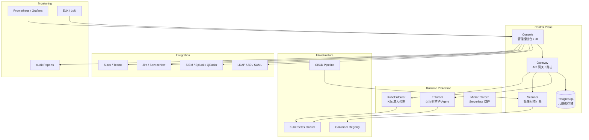

# Aqua Security 企业级容器安全平台深度实践

> **Author**: Container Security Architect | **Version**: v1.0 | **Update Time**: 2026-05-18
> **Scenario**: Enterprise container security platform deployment and operations | **Complexity**: ⭐⭐⭐⭐⭐

<!-- chunk: 概述 -->## 概述

Aqua Security 是企业级容器和云原生安全平台，提供从镜像构建到运行时的全生命周期安全防护。Aqua 平台的核心能力包括镜像漏洞扫描、运行时防护、网络微隔离、合规检查和容器漂移检测。与开源工具相比，Aqua 提供了更完整的商业支持、企业级管理控制台、高级威胁检测引擎和合规报告自动化功能。

本文详细探讨 Aqua 企业级部署架构、安全策略管理、运行时防护、合规检查和 CI/CD 集成，帮助企业在生产环境中构建全面的容器安全防护体系。涵盖 Console、Gateway、Enforcer、Scanner、KubeEnforcer 等核心组件的部署配置和安全策略定义。

#<!-- chunk: 威胁模型分析 -->## 威胁模型分析

**已知漏洞利用**：容器镜像中的操作系统包和应用依赖包含大量已知 CVE。攻击者通过公开漏洞数据库匹配目标环境中的漏洞，利用远程代码执行（RCE）、权限提升等漏洞实现初始访问和横向移动。Aqua 的镜像扫描引擎在构建和部署阶段检测漏洞，配合准入控制阻止高风险镜像部署。

**运行时攻击**：即使镜像在构建时是安全的，运行时仍可能遭受攻击。攻击者通过应用漏洞注入恶意代码、执行加密货币挖矿程序、建立反向 Shell 或窃取数据。Aqua Enforcer 通过行为学习建立应用基线，检测偏离基线的异常行为并自动响应。

**容器漂移**：攻击者在运行中的容器内安装新软件或修改二进制文件（容器漂移），用于持久化后门或执行恶意操作。Aqua 的容器漂移检测监控容器文件系统的变化，在发现未授权的二进制执行时触发告警或阻断。

**配置违规**：特权容器、主机命名空间共享、不安全的 capabilities 等配置为攻击者提供了容器逃逸的途径。Aqua KubeEnforcer 通过 [[Kubernetes|Kubernetes]] 准入控制在部署阶段拦截不安全配置。

<!-- chunk: 架构设计 -->## 架构设计

#<!-- chunk: 企业级架构 -->## 企业级架构



#<!-- chunk: 部署配置 -->## 部署配置

```yaml
# Aqua Namespace
apiVersion: v1
kind: Namespace
metadata:
  name: aqua-system
  labels:
    name: aqua-system
    pod-security.kubernetes.io/enforce: privileged
---
# Aqua Platform ConfigMap
apiVersion: v1
kind: ConfigMap
metadata:
  name: aqua-config
  namespace: aqua-system
data:
  aqua.conf: |
    {
      "version": "6.5",
      "console": {
        "port": 443,
        "tls": true,
        "certificate": "/etc/aqua/certs/tls.crt",
        "key": "/etc/aqua/certs/tls.key"
      },
      "database": {
        "type": "postgres",
        "host": "postgresql-aqua.aqua-system.svc.cluster.local",
        "port": 5432,
        "name": "aqua",
        "username": "aqua",
        "sslmode": "require"
      },
      "gateway": {
        "port": 8443,
        "tls": true
      },
      "enforcer": {
        "image_assurance": true,
        "runtime_protection": true,
        "network_protection": true,
        "host_protection": true,
        "container_drift_prevention": true,
        "block_admitted_images": false
      },
      "scanner": {
        "concurrent_scans": 5,
        "scan_timeout": 3600,
        "vulnerability_feed_url": "https://updates.aquasec.com/security-feed",
        "scan_layers": true,
        "scan_secrets": true,
        "scan_malware": true
      }
    }
```

#<!-- chunk: Console 部署 -->## Console 部署

```yaml
apiVersion: apps/v1
kind: StatefulSet
metadata:
  name: aqua-console
  namespace: aqua-system
spec:
  serviceName: aqua-console
  replicas: 1
  selector:
    matchLabels:
      app: aqua-console
  template:
    metadata:
      labels:
        app: aqua-console
    spec:
      containers:
        - name: console
          image: registry.aquasec.com/console:6.5.21032
          env:
            - name: SCALOCK_DBUSER
              value: "aqua"
            - name: SCALOCK_DBPASSWORD
              valueFrom:
                secretKeyRef:
                  name: aqua-db-secret
                  key: password
            - name: SCALOCK_DBNAME
              value: "aqua"
            - name: SCALOCK_DBHOST
              value: "postgresql-aqua.aqua-system.svc.cluster.local"
            - name: SCALOCK_DBPORT
              value: "5432"
            - name: ADMIN_PASSWORD
              valueFrom:
                secretKeyRef:
                  name: aqua-admin-secret
                  key: password
            - name: BATCH_INSTALL_GATEWAY
              value: "true"
            - name: BATCH_INSTALL_ENFORCER
              value: "true"
            - name: AQUA_SECURE_MODE
              value: "true"
            - name: AQUA_CLUSTER_NAME
              value: "production-cluster"
          ports:
            - containerPort: 443
              name: https
            - containerPort: 8080
              name: http
          volumeMounts:
            - name: config
              mountPath: /etc/aqua
            - name: certs
              mountPath: /etc/aqua/certs
            - name: logs
              mountPath: /var/log/aqua
          readinessProbe:
            httpGet:
              path: /healthz
              port: 8080
            initialDelaySeconds: 60
            periodSeconds: 10
          livenessProbe:
            httpGet:
              path: /healthz
              port: 8080
            initialDelaySeconds: 120
            periodSeconds: 30
          resources:
            requests:
              cpu: "1"
              memory: "2Gi"
            limits:
              cpu: "2"
              memory: "4Gi"
      volumes:
        - name: config
          configMap:
            name: aqua-config
        - name: certs
          secret:
            secretName: aqua-console-certs
        - name: logs
          emptyDir: {}
---
# PostgreSQL Database
apiVersion: apps/v1
kind: StatefulSet
metadata:
  name: postgresql-aqua
  namespace: aqua-system
spec:
  serviceName: postgresql-aqua
  replicas: 1
  selector:
    matchLabels:
      app: postgresql-aqua
  template:
    metadata:
      labels:
        app: postgresql-aqua
    spec:
      containers:
        - name: postgresql
          image: postgres:13.4
          env:
            - name: POSTGRES_DB
              value: "aqua"
            - name: POSTGRES_USER
              value: "aqua"
            - name: POSTGRES_PASSWORD
              valueFrom:
                secretKeyRef:
                  name: aqua-db-secret
                  key: password
          ports:
            - containerPort: 5432
          volumeMounts:
            - name: data
              mountPath: /var/lib/postgresql/data
          resources:
            requests:
              cpu: "500m"
              memory: "1Gi"
            limits:
              cpu: "1"
              memory: "2Gi"
  volumeClaimTemplates:
    - metadata:
        name: data
      spec:
        accessModes: ["ReadWriteOnce"]
        storageClassName: fast-ssd
        resources:
          requests:
            storage: 50Gi
```

#<!-- chunk: Enforcer [[DaemonSet|DaemonSet]] -->## Enforcer DaemonSet

```yaml
apiVersion: apps/v1
kind: DaemonSet
metadata:
  name: aqua-enforcer
  namespace: aqua-system
spec:
  selector:
    matchLabels:
      app: aqua-enforcer
  template:
    metadata:
      labels:
        app: aqua-enforcer
    spec:
      hostPID: true
      hostIPC: true
      hostNetwork: true
      dnsPolicy: ClusterFirstWithHostNet
      tolerations:
        - effect: NoSchedule
          operator: Exists
        - effect: NoExecute
          operator: Exists
      containers:
        - name: enforcer
          image: registry.aquasec.com/enforcer:6.5.21032
          env:
            - name: AQUA_TOKEN
              valueFrom:
                secretKeyRef:
                  name: aqua-enforcer-token
                  key: token
            - name: AQUA_SERVER
              value: "aqua-gateway.aqua-system.svc.cluster.local:8443"
            - name: AQUA_TLS_VERIFY
              value: "true"
            - name: AQUA_INSTALLED_SENSORS
              value: "fim,net,drift"
            - name: AQUA_ENABLE_HOST_ENFORCEMENT
              value: "true"
            - name: AQUA_LOG_LEVEL
              value: "info"
          securityContext:
            privileged: true
          volumeMounts:
            - name: var-run
              mountPath: /var/run
            - name: dev
              mountPath: /dev
            - name: sys
              mountPath: /sys
            - name: etc
              mountPath: /etc
            - name: aqua-tmp
              mountPath: /tmp/aqua
            - name: aqua-data
              mountPath: /data
            - name: log
              mountPath: /var/log
          resources:
            requests:
              cpu: "100m"
              memory: "256Mi"
            limits:
              cpu: "500m"
              memory: "1Gi"
      volumes:
        - name: var-run
          hostPath:
            path: /var/run
        - name: dev
          hostPath:
            path: /dev
        - name: sys
          hostPath:
            path: /sys
        - name: etc
          hostPath:
            path: /etc
        - name: aqua-tmp
          hostPath:
            path: /tmp/aqua
            type: DirectoryOrCreate
        - name: aqua-data
          hostPath:
            path: /var/lib/aqua
            type: DirectoryOrCreate
        - name: log
          hostPath:
            path: /var/log
```

#<!-- chunk: KubeEnforcer 准入控制 -->## KubeEnforcer 准入控制

```yaml
apiVersion: admissionregistration.k8s.io/v1
kind: ValidatingWebhookConfiguration
metadata:
  name: aqua-kubeenforcer
webhooks:
  - name: imageassurance.aquasec.com
    clientConfig:
      service:
        name: aqua-kubeenforcer
        namespace: aqua-system
        path: "/validate"
      caBundle: ${CA_BUNDLE}
    rules:
      - apiGroups: [""]
        apiVersions: ["v1"]
        operations: ["CREATE", "UPDATE"]
        resources: ["pods"]
      - apiGroups: ["apps"]
        apiVersions: ["v1"]
        operations: ["CREATE", "UPDATE"]
        resources: ["deployments", "statefulsets", "daemonsets"]
    admissionReviewVersions: ["v1", "v1beta1"]
    sideEffects: None
    timeoutSeconds: 30
    failurePolicy: Fail
---
apiVersion: apps/v1
kind: Deployment
metadata:
  name: aqua-kubeenforcer
  namespace: aqua-system
spec:
  replicas: 2
  selector:
    matchLabels:
      app: aqua-kubeenforcer
  template:
    metadata:
      labels:
        app: aqua-kubeenforcer
    spec:
      containers:
        - name: kube-enforcer
          image: registry.aquasec.com/kube-enforcer:6.5.21032
          env:
            - name: AQUA_TOKEN
              valueFrom:
                secretKeyRef:
                  name: aqua-kubeenforcer-token
                  key: token
            - name: AQUA_SERVER
              value: "aqua-gateway.aqua-system.svc.cluster.local:8443"
            - name: AQUA_TLS_VERIFY
              value: "true"
            - name: AQUA_KUBEENFORCER_LOG_LEVEL
              value: "info"
          ports:
            - containerPort: 8443
          volumeMounts:
            - name: certs
              mountPath: /etc/aqua/certs
          resources:
            requests:
              cpu: "200m"
              memory: "512Mi"
            limits:
              cpu: "1"
              memory: "2Gi"
      volumes:
        - name: certs
          secret:
            secretName: aqua-kubeenforcer-certs
```

<!-- chunk: 安全策略实战 -->## 安全策略实战

#<!-- chunk: 镜像安全策略 -->## 镜像安全策略

```yaml
apiVersion: v1
kind: ConfigMap
metadata:
  name: image-security-policies
  namespace: aqua-system
data:
  critical-vulnerabilities.yaml: |
    name: "Block Critical Vulnerabilities"
    description: "Block images with critical vulnerabilities"
    enabled: true
    enforcement_action: "block"
    criteria:
      - type: vulnerability
        severity: CRITICAL
        action: block
        max_age: 30d
        max_count: 0

  high-vulnerabilities.yaml: |
    name: "Alert High Vulnerabilities"
    description: "Alert on images with high severity vulnerabilities"
    enabled: true
    enforcement_action: "alert"
    criteria:
      - type: vulnerability
        severity: HIGH
        action: alert
        max_count: 5

  malware-detection.yaml: |
    name: "Malware Detection"
    description: "Detect and block malicious content"
    enabled: true
    enforcement_action: "block"
    criteria:
      - type: malware
        action: block

  license-compliance.yaml: |
    name: "License Compliance"
    description: "Check for prohibited licenses"
    enabled: true
    enforcement_action: "alert"
    criteria:
      - type: license
        prohibited:
          - GPL-3.0
          - AGPL-3.0
          - SSPL-1.0
        action: alert

  base-image-validation.yaml: |
    name: "Approved Base Images Only"
    description: "Ensure only approved base images are used"
    enabled: true
    enforcement_action: "block"
    criteria:
      - type: base_image
        approved_images:
          - alpine:3.19
          - ubuntu:22.04
          - redhat/ubi9:latest
          - gcr.io/distroless/java21
          - gcr.io/distroless/static
        action: block

  sensitive-data-detection.yaml: |
    name: "Sensitive Data Detection"
    description: "Detect secrets, keys, and passwords in images"
    enabled: true
    enforcement_action: "block"
    criteria:
      - type: sensitive_data
        patterns:
          - "private_key"
          - "aws_access_key"
          - "password"
          - "api_key"
          - "connection_string"
        action: block
```

#<!-- chunk: 运行时安全策略 -->## 运行时安全策略

```yaml
# Runtime security policies
runtime_policies:
  container_escape_prevention:
    name: "Prevent Container Escapes"
    enabled: true
    enforcement: block
    rules:
      - name: "Block Privileged Containers"
        condition: "container.privileged == true"
        action: "block"
        severity: "critical"
        message: "Privileged containers are not allowed"

      - name: "Block Host PID Namespace"
        condition: "container.host_pid == true"
        action: "block"
        severity: "critical"

      - name: "Block Host Network Access"
        condition: "container.host_network == true"
        action: "block"
        severity: "critical"

      - name: "Restrict Capabilities"
        condition: "container.capabilities.add contains 'SYS_ADMIN'"
        action: "block"
        severity: "critical"

      - name: "Block Host Path Mounts"
        condition: "container.mount.source startswith '/' and not container.mount.source in ['/dev/null', '/proc', '/sys']"
        action: "block"
        severity: "high"

  container_drift_prevention:
    name: "Prevent Container Drift"
    enabled: true
    enforcement: block
    rules:
      - name: "Block Binary Execution Drift"
        condition: "file.operation == 'execute' and file.path startswith '/tmp/' or file.path startswith '/dev/shm/'"
        action: "block"
        severity: "high"
        message: "Execution of new binaries detected - potential container drift"

      - name: "Block File Write in Read-only Paths"
        condition: "file.operation == 'write' and file.path startswith '/usr/' or file.path startswith '/bin/'"
        action: "block"
        severity: "critical"
        message: "Write to system directory detected - potential backdoor"

      - name: "Block Package Installation"
        condition: "process.name in ('apt', 'yum', 'apk', 'dnf', 'pip', 'npm', 'gem')"
        action: "block"
        severity: "high"
        message: "Package manager execution in container detected"

  network_security:
    name: "Network Security Controls"
    enabled: true
    rules:
      - name: "Block External Connections from Databases"
        condition: "container.label.app in ('postgres', 'mysql', 'redis', 'mongodb') and network.destination.ip not in ['10.0.0.0/8', '172.16.0.0/12', '192.168.0.0/16']"
        action: "block"
        severity: "critical"

      - name: "Monitor DNS Queries"
        condition: "dns.query contains any(['malicious-domain.com', 'crypto-pool.com', 'exfil-server.net'])"
        action: "block"
        severity: "critical"

      - name: "Block Tor Network"
        condition: "network.destination.port in [9001, 9030, 9050, 9051]"
        action: "block"
        severity: "high"

  file_system_protection:
    name: "File System Protection"
    enabled: true
    rules:
      - name: "Protect SSH Keys"
        condition: "file.path startswith '/root/.ssh/' or file.path startswith '/home/.ssh/'"
        action: "block"
        severity: "critical"

      - name: "Protect /etc/shadow"
        condition: "file.path == '/etc/shadow' and file.operation != 'read'"
        action: "block"
        severity: "critical"

      - name: "Protect Kubernetes Service Account Tokens"
        condition: "file.path contains '/var/run/secrets/kubernetes.io/serviceaccount/'"
        action: "alert"
        severity: "high"
```

#<!-- chunk: 行为学习与基线 -->## 行为学习与基线

```yaml
behavioral_learning:
  profiles:
    - name: "web-application-profile"
      application: "web-server"
      learning_period: "7d"
      monitored_activities:
        - file_operations:
            paths: ["/var/www", "/tmp", "/app"]
            operations: ["read", "write", "execute"]

        - network_connections:
            ports: [80, 443, 8080, 8443]
            protocols: ["tcp"]
            allowed_destinations:
              - "10.0.0.0/8"
              - "api.stripe.com"
              - "api.sendgrid.com"

        - process_execution:
            allowed_processes:
              - "/usr/sbin/nginx"
              - "/usr/bin/node"
              - "/usr/local/bin/python"
            denied_processes:
              - "/bin/sh"
              - "/bin/bash"
              - "/usr/bin/wget"
              - "/usr/bin/curl"

      anomalies:
        - name: "Unexpected File Access"
          condition: "file.path not in learned_paths"
          severity: "medium"
          action: "alert"

        - name: "Suspicious Network Connection"
          condition: "network.destination.port not in learned_ports"
          severity: "high"
          action: "block"

        - name: "Unauthorized Process"
          condition: "process.name not in learned_processes"
          severity: "high"
          action: "block"
```

<!-- chunk: 合规与审计 -->## 合规与审计

#<!-- chunk: 合规框架检查 -->## 合规框架检查

```yaml
compliance_frameworks:
  cis_docker_benchmark:
    name: "CIS Docker Benchmark"
    version: "1.6.0"
    enabled: true
    schedule: "daily"
    checks:
      - id: "1.1.1"
        description: "Separate partition for /var/lib/docker"
        severity: "high"
        remediation: "Create LVM partition for /var/lib/docker"
      - id: "2.1"
        description: "Restrict inter-container communication"
        severity: "medium"
        remediation: "Configure iptables rules"
      - id: "4.1"
        description: "Create non-root user in container"
        severity: "high"
        remediation: "Add USER directive in Dockerfile"
      - id: "4.6"
        description: "Enable HEALTHCHECK in Dockerfile"
        severity: "medium"
        remediation: "Add HEALTHCHECK instruction"
      - id: "4.7"
        description: "Do not use ADD instruction"
        severity: "low"
        remediation: "Use COPY instead of ADD"

  nist_csf:
    name: "NIST Cybersecurity Framework"
    version: "1.1"
    enabled: true
    schedule: "weekly"
    controls:
      - id: "PR.AC-3"
        description: "Control network access to privileged functions"
        implementation: "Aqua network controls"
      - id: "DE.CM-1"
        description: "Detection capabilities established"
        implementation: "Aqua runtime monitoring"
      - id: "RS.AN-1"
        description: "Notifications from detection systems investigated"
        implementation: "Aqua alert integration"

  pci_dss:
    name: "PCI DSS"
    version: "4.0"
    enabled: true
    schedule: "monthly"
    requirements:
      - id: "2.2"
        description: "Configuration standards for system components"
        implementation: "Aqua security policies and baselines"
      - id: "6.2"
        description: "System components protected by patches"
        implementation: "Aqua vulnerability scanning"
      - id: "10.2"
        description: "Automated audit trails"
        implementation: "Aqua logging and monitoring"
      - id: "11.5"
        description: "File integrity monitoring"
        implementation: "Aqua FIM capabilities"
```

#<!-- chunk: 合规报告自动化 -->## 合规报告自动化

```python
#!/usr/bin/env python3
"""Aqua Security compliance report generator."""

import json
from datetime import datetime, timedelta
from typing import Dict, List, Any

class AquaComplianceReporter:
    def __init__(self, aqua_client):
        self.client = aqua_client
        self.report_period = timedelta(days=30)

    def generate_compliance_report(self, framework: str) -> Dict[str, Any]:
        """Generate compliance report for a specific framework."""
        report = {
            "framework": framework,
            "generated_at": datetime.now().isoformat(),
            "period_start": (datetime.now() - self.report_period).isoformat(),
            "period_end": datetime.now().isoformat(),
            "summary": {},
            "details": {},
            "recommendations": []
        }

        compliance_stats = self.client.get_compliance_statistics(framework)
        report["summary"] = {
            "total_checks": compliance_stats["total"],
            "passed_checks": compliance_stats["passed"],
            "failed_checks": compliance_stats["failed"],
            "compliance_percentage": compliance_stats["percentage"]
        }

        detailed_results = self.client.get_compliance_details(framework)
        report["details"] = detailed_results

        report["recommendations"] = self._generate_recommendations(detailed_results)
        return report

    def _generate_recommendations(self, compliance_results: Dict) -> List[str]:
        """Generate recommendations based on compliance results."""
        recommendations = []
        failed_checks = [
            check for check in compliance_results.get("checks", [])
            if check["status"] == "failed"
        ]

        severity_order = {"critical": 0, "high": 1, "medium": 2, "low": 3}
        failed_checks.sort(key=lambda x: severity_order.get(x.get("severity", "low"), 3))

        for check in failed_checks[:10]:
            severity = check.get("severity", "medium")
            desc = check.get("description", "")
            remediation = check.get("remediation", "")

            if severity == "critical":
                recommendations.append(f"[CRITICAL] 立即修复: {desc}. 修复方案: {remediation}")
            elif severity == "high":
                recommendations.append(f"[HIGH] 优先处理: {desc}. 修复方案: {remediation}")
            else:
                recommendations.append(f"[{severity.upper()}] 建议修复: {desc}")

        return recommendations

    def export_report(self, report: Dict[str, Any], format: str = "json") -> str:
        """Export report in specified format."""
        if format.lower() == "json":
            return json.dumps(report, indent=2, ensure_ascii=False)
        elif format.lower() == "html":
            return self._generate_html_report(report)
        else:
            raise ValueError(f"Unsupported format: {format}")

    def _generate_html_report(self, report: Dict) -> str:
        """Generate HTML report."""
        summary = report["summary"]
        html = f"""
        <html>
        <head><title>Aqua Compliance Report - {report['framework']}</title></head>
        <body>
        <h1>Aqua Compliance Report</h1>
        <h2>{report['framework']}</h2>
        <p>Generated: {report['generated_at']}</p>
        <h3>Summary</h3>
        <table border="1">
            <tr><td>Total Checks</td><td>{summary['total_checks']}</td></tr>
            <tr><td>Passed</td><td>{summary['passed_checks']}</td></tr>
            <tr><td>Failed</td><td>{summary['failed_checks']}</td></tr>
            <tr><td>Compliance %</td><td>{summary['compliance_percentage']}%</td></tr>
        </table>
        <h3>Recommendations</h3>
        <ul>
        """
        for rec in report.get("recommendations", []):
            html += f"<li>{rec}</li>"
        html += "</ul></body></html>"
        return html
```

<!-- chunk: 监控与告警 -->## 监控与告警

#<!-- chunk: Prometheus 告警规则 -->## Prometheus 告警规则

```yaml
apiVersion: monitoring.coreos.com/v1
kind: PrometheusRule
metadata:
  name: aqua-security-alerts
  namespace: aqua-system
spec:
  groups:
    - name: aqua-security.rules
      rules:
        - alert: AquaCriticalVulnerabilities
          expr: aqua_vulnerabilities_total{severity="critical"} > 0
          for: 5m
          labels:
            severity: critical
          annotations:
            summary: "Critical vulnerabilities in scanned images"
            description: "Found {{ $value }} critical vulnerabilities"

        - alert: AquaRuntimeAttacks
          expr: increase(aqua_runtime_attacks_total[5m]) > 0
          for: 1m
          labels:
            severity: critical
          annotations:
            summary: "Runtime attacks detected"
            description: "Detected {{ $value }} runtime attacks in 5 minutes"

        - alert: AquaContainerDrift
          expr: increase(aqua_container_drift_events_total[10m]) > 0
          for: 2m
          labels:
            severity: warning
          annotations:
            summary: "Container drift detected"
            description: "{{ $value }} containers modified at runtime"

        - alert: AquaEnforcerDown
          expr: up{job="aqua-enforcer"} == 0
          for: 5m
          labels:
            severity: critical
          annotations:
            summary: "Aqua Enforcer down on {{ $labels.instance }}"

        - alert: AquaConsoleDown
          expr: up{job="aqua-console"} == 0
          for: 5m
          labels:
            severity: critical
          annotations:
            summary: "Aqua Console is unavailable"

        - alert: AquaScanQueueBacklog
          expr: aqua_scan_queue_length > 50
          for: 15m
          labels:
            severity: warning
          annotations:
            summary: "Scan queue backlog: {{ $value }} pending"

        - alert: AquaComplianceViolations
          expr: aqua_compliance_violations_total > 0
          for: 10m
          labels:
            severity: warning
          annotations:
            summary: "Compliance violations: {{ $value }}"

        - alert: AquaHighDeniedRequests
          expr: rate(aqua_admission_denied_total[5m]) > 5
          for: 5m
          labels:
            severity: info
          annotations:
            summary: "High admission denial rate: {{ $value }}/s"
```

#<!-- chunk: CI/CD 集成 -->## CI/CD 集成

```groovy
// Jenkinsfile - Aqua Security Pipeline
pipeline {
    agent any

    environment {
        AQUA_SERVER = 'https://aqua-console.example.com'
        AQUA_USER = credentials('aqua-username')
        AQUA_PASSWORD = credentials('aqua-password')
        IMAGE = "registry.company.com/myapp:${BUILD_NUMBER}"
    }

    stages {
        stage('Build') {
            steps {
                sh 'docker build -t ${IMAGE} .'
            }
        }

        stage('Aqua Security Scan') {
            steps {
                script {
                    // Trigger Aqua image scan
                    sh """
                    curl -u ${AQUA_USER}:${AQUA_PASSWORD} \
                      -X POST "${AQUA_SERVER}/api/v2/images" \
                      -H "Content-Type: application/json" \
                      -d '{
                        "registry": "docker.io",
                        "repository": "myapp",
                        "tag": "${BUILD_NUMBER}"
                      }'
                    """

                    // Wait for scan completion
                    def scanStatus = 'pending'
                    def timeout = 0
                    while (scanStatus != 'pass' && scanStatus != 'fail' && timeout < 30) {
                        sleep(10)
                        timeout++
                        scanStatus = sh(
                            script: """
                            curl -s -u ${AQUA_USER}:${AQUA_PASSWORD} \
                              "${AQUA_SERVER}/api/v2/images/myapp:${BUILD_NUMBER}" | \
                            jq -r '.scan_status'
                            """,
                            returnStdout: true
                        ).trim()
                    }

                    if (scanStatus != 'pass') {
                        error "Security scan failed: ${scanStatus}"
                    }
                }
            }
        }

        stage('Deploy') {
            when {
                branch 'main'
            }
            steps {
                sh 'kubectl set image deployment/myapp myapp=${IMAGE}'
            }
        }
    }

    post {
        always {
            archiveArtifacts artifacts: 'aqua-report.json', allowEmptyArchive: true
        }
    }
}
```

<!-- chunk: 最佳实践 -->## 最佳实践

#<!-- chunk: 安全部署最佳实践 -->## 安全部署最佳实践

**网络隔离**：将 Aqua 组件部署在独立的命名空间中，使用 [[NetworkPolicy|NetworkPolicy]] 限制访问。Console 仅允许管理员网络访问，Gateway 仅允许 Enforcer 和 KubeEnforcer 连接，PostgreSQL 仅允许 Console 和 Gateway 访问。

**资源管理**：为每个 Aqua 组件设置合理的资源请求和限制。Console 和 Scanner 是资源密集型组件，需要充足的 CPU 和内存。Enforcer 以 DaemonSet 运行在每个节点上，需要限制其资源使用以避免影响工作负载。

**密钥管理**：所有敏感配置（数据库密码、管理员密码、Token）使用 Kubernetes Secret 存储。定期轮换 Token 和密码。启用 TLS 加密所有组件间通信。

**备份策略**：定期备份 PostgreSQL 数据库和 Aqua 配置。使用 `pg_dump` 进行完整备份，至少每天一次。备份文件加密后存储在异地位置。

#<!-- chunk: 问题排除 -->## 问题排除

```bash
#!/bin/bash
# aqua_diagnostics.sh

echo "=== Aqua System Health Check ==="
kubectl get pods -n aqua-system -o wide
echo ""

echo "=== Component Status ==="
echo "Console:"
kubectl get pods -n aqua-system -l app=aqua-console
echo "Gateway:"
kubectl get pods -n aqua-system -l app=aqua-gateway
echo "Enforcer:"
kubectl get daemonsets -n aqua-system aqua-enforcer
echo "Scanner:"
kubectl get pods -n aqua-system -l app=aqua-scanner
echo "KubeEnforcer:"
kubectl get deployments -n aqua-system aqua-kubeenforcer
echo ""

echo "=== Database Connection ==="
kubectl exec -n aqua-system sts/postgresql-aqua -- pg_isready -h localhost -p 5432
echo ""

echo "=== Enforcer Health ==="
kubectl logs -n aqua-system -l app=aqua-enforcer --tail=10
echo ""

echo "=== Recent Security Events ==="
kubectl logs -n aqua-system -l app=aqua-console --since=1h | \
  grep -i "security\|vulnerability\|attack\|drift" | tail -20
echo ""

echo "=== Scan Queue Status ==="
kubectl exec -n aqua-system deploy/aqua-console -- \
  curl -s "http://localhost:8080/api/v1/scans/queue" | jq '.length'
echo ""

echo "=== Resource Usage ==="
kubectl top pods -n aqua-system
```

---

*本文档基于 Aqua Security 企业级容器安全平台实践经验编写，持续更新最新技术和最佳实践。*

---

<!-- chunk: Obsidian 相关文档 -->## Obsidian 相关文档

- domain-05-security-compliance KUDIG Database — Global MOC
- [[domain-05-security-compliance/README|Domain 25: 云原生安全 (Cloud Native Security)]]
- [[domain-05-security-compliance/00-open-source-projects-index|Domain-25 云原生安全 — 开源项目索引]]
- Falco 云原生安全监控深度实践
- Sysdig企业级容器安全深度实践
- Kyverno 企业级策略管理深度实践
- HashiCorp Vault 企业级密钥管理深度实践
- OPA Gatekeeper 策略即代码深度实践
- 容器镜像安全扫描深度实践
- Kubernetes 安全加固深度实践
- gVisor 容器沙箱深度解析
- cert-manager 自动证书管理深度实践

## See Also

- 01-falco-cloud-native-security
- 02-sysdig-enterprise-container-security
- 04-kyverno-enterprise-policy-management
- 05-vault-enterprise-secrets-management

- [[domain-05-security-compliance/README|返回目录]]