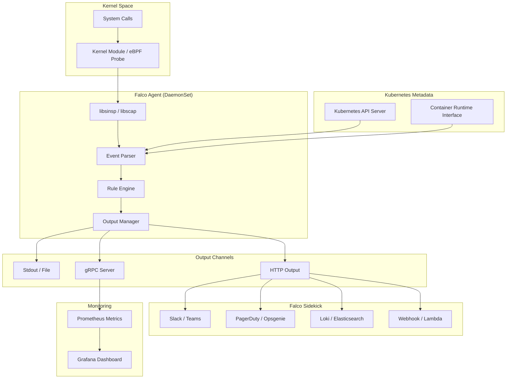

# [[Falco|Falco]] 运行时安全监控深度实践

> **Author**: Cloud Native Security Architect | **Version**: v1.0 | **Update Time**: 2026-05-18
> **Scenario**: Runtime security monitoring with Falco and Falco Sidekick | **Complexity**: ⭐⭐⭐⭐

<!-- chunk: 概述 -->## 概述

Falco 是 CNCF 毕业项目，是云原生运行时安全的行业标准工具。它通过内核模块或 eBPF 探针捕获系统调用，结合容器感知和 [[Kubernetes|Kubernetes]] 元数据，使用灵活的规则引擎实时检测异常行为。Falco 能够检测容器逃逸、权限提升、文件完整性违规、网络异常、加密货币挖矿等多种安全威胁，是企业构建运行时安全防线的核心组件。

## 威胁模型分析

运行时安全威胁是容器环境中最具挑战性的防护领域。与构建时和部署时的预防性控制不同，运行时威胁发生在应用已部署并运行之后，需要实时检测和响应能力。

**容器逃逸**：攻击者通过漏洞利用或配置缺陷突破容器隔离，获取宿主机访问权限。常见的逃逸手段包括利用特权容器的 CAP_SYS_ADMIN 能力、通过 cgroup 挂载逃逸、利用内核漏洞等。Falco 通过监控系统调用序列，检测 mount、pivot_root、创建新 cgroup 等逃逸相关行为。

**权限提升**：攻击者在容器内尝试获取更高权限，例如执行 sudo、设置 setuid 位、利用内核漏洞提权等。Falco 规则可以检测这些异常的权限操作，包括监控 setuid/setgid 调用和异常的 capabilities 操作。

**数据泄露**：攻击者将敏感数据通过异常的网络连接外传。Falco 监控容器的网络连接行为，检测到非预期的出站连接、大数据量传输或与已知恶意 IP 的通信时触发告警。

**加密货币挖矿**：攻击者利用被入侵的容器资源进行加密货币挖矿。Falco 检测已知的挖矿进程名称、异常的 CPU 使用模式和与矿池的连接行为。

**文件完整性违规**：运行中的容器文件系统被修改（容器漂移），可能表明攻击者正在植入后门或修改配置。Falco 监控容器的文件写入和执行行为，检测未授权的二进制文件执行。

<!-- chunk: 架构设计 -->## 架构设计

## Falco 核心架构



## 部署架构

Falco 以 DaemonSet 形式部署在每个 Kubernetes 节点上，通过内核模块或 eBPF 探针捕获系统调用。推荐使用 eBPF 模式，因为它不需要编译内核模块，兼容性更好且安全性更高。Falco Sidekick 作为告警聚合和分发组件，支持将安全事件发送到多种通知渠道和日志系统。

```yaml
# values-falco-production.yaml
driver:
  kind: ebpf
  ebpf:
    leastPrivileged: true

tty: false

collectors:
  enabled: true
  docker:
    enabled: false
  containerd:
    enabled: true
    socket: /run/containerd/containerd.sock
  crio:
    enabled: false

falco:
  rules_file:
    - /etc/falco/falco_rules.yaml
    - /etc/falco/falco_rules.local.yaml
    - /etc/falco/rules.d

  json_output: true
  json_include_tags_property: true

  http_output:
    enabled: true
    url: "http://falco-falcosidekick:2801"

  http_server:
    enabled: true
    listen_port: 8765
    k8s_healthz_endpoint: /healthz

  grpc:
    enabled: true
    bind_address: "0.0.0.0"
    threadiness: 4

  grpc_output:
    enabled: true

  log_level: info
  libs_logger:
    enabled: false

resources:
  requests:
    cpu: 100m
    memory: 512Mi
  limits:
    cpu: 1000m
    memory: 1Gi

extra:
  env:
    - name: FALCO_BUFSIZE
      value: "8388608"
    - name: FALCO_USERSPACE_BUFSIZE
      value: "4194304"
```

> ⚠️ **🟡 中危变更** — 变更集群资源状态，建议先 --dry-run 或 diff 确认
> - `helm upgrade/install`：部署/升级 release

```bash
# 部署 Falco
helm repo add falcosecurity https://falcosecurity.github.io/charts
helm repo update

helm install falco falcosecurity/falco \
  --namespace falco \
  --create-namespace \
  --values values-falco-production.yaml \
  --version 4.21.0

# 部署 Falco Sidekick
helm install falcosidekick falcosecurity/falcosidekick \
  --namespace falco \
  --set config.debug=false \
  --set config.slack.webhookurl="https://hooks.slack.com/services/XXX" \
  --set config.slack.minimumpriority="critical" \
  --set config.loki.hostport="http://loki.monitoring:3100" \
  --set config.elasticsearch.hostport="https://es.example.com:9200"
```

<!-- chunk: 核心配置 -->## 核心配置

## 自定义安全规则

Falco 规则由三个核心元素组成：Macro（宏）定义可复用的条件组合，List（列表）定义可复用的值集合，Rule（规则）定义检测条件和输出格式。以下规则覆盖了常见的运行时安全场景：

```yaml
apiVersion: v1
kind: ConfigMap
metadata:
  name: falco-custom-rules
  namespace: falco
  labels:
    app.kubernetes.io/name: falco
    role: rules
data:
  custom_rules.yaml: |
    # === 宏定义 ===

    - macro: container_started
      condition: evt.type = container and evt.dir = >

    - macro: production_namespace
      condition: k8s.ns.name in (production, api-production, payment)

    - macro: trusted_images
      condition: >
        (container.image.repository in (
          gcr.io/company/base,
          registry.company.com/app,
          registry.company.com/infra
        ))

    - macro: database_pods
      condition: k8s.pod.label.app in (postgres, mysql, redis, mongodb)

    - macro: shell_procs
      condition: proc.name in (bash, sh, zsh, dash, fish)

    - macro: sensitive_files
      condition: >
        (fd.name startswith "/etc/shadow" or
         fd.name startswith "/etc/passwd" or
         fd.name startswith "/etc/ssh/ssh_host_" or
         fd.name startswith "/root/.ssh/" or
         fd.name startswith "/var/lib/kubelet/")

    # === 列表定义 ===

    - list: crypto_mining_binaries
      items: [minerd, xmrig, cgminer, ethminer, cryptonight, nbminer]

    - list: known_mining_pools
      items: ["xmr.pool.minergate.com", "pool.supportxmr.com", "stratum+tcp"]

    - list: allowed_admin_images
      items: [gcr.io/company/admin-tool, registry.company.com/debug]

    # === 容器逃逸检测 ===

    - rule: Detect Privileged Container
      desc: 检测特权容器启动
      condition: >
        container_started and
        container.privileged = true and
        not trusted_images
      output: >
        Privileged container started
        user=%user.name command=%proc.cmdline
        container=%container.name image=%container.image.repository
        namespace=%k8s.ns.name pod=%k8s.pod.name
      priority: CRITICAL
      tags: [container, privilege_escalation, mitre_T1611]

    - rule: Container Escape via cgroup
      desc: 检测通过 cgroup 进行的容器逃逸尝试
      condition: >
        evt.type in (mount, umount2) and
        container and
        proc.args contains "cgroup" and
        not proc.name in (docker, containerd, kubelet)
      output: >
        Potential container escape via cgroup mount
        user=%user.name command=%proc.cmdline
        container=%container.name namespace=%k8s.ns.name
      priority: CRITICAL
      tags: [container, escape, mitre_T1611]

    - rule: Read Sensitive File in Container
      desc: 检测容器内读取敏感文件
      condition: >
        open_read and
        container and
        sensitive_files and
        not trusted_images
      output: >
        Sensitive file read in container
        user=%user.name file=%fd.name
        container=%container.name image=%container.image.repository
        pod=%k8s.pod.name namespace=%k8s.ns.name
      priority: WARNING
      tags: [filesystem, sensitive_data, mitre_T1005]

    - rule: Write Below Binary Dir
      desc: 检测在二进制目录下写入文件
      condition: >
        evt.type in (write, close) and
        fd.directory = "/usr/bin" and
        container and
        not trusted_images
      output: >
        File written below binary dir
        user=%user.name file=%fd.name command=%proc.cmdline
        container=%container.name
      priority: WARNING
      tags: [filesystem, integrity, mitre_T1059]

    # === 权限提升检测 ===

    - rule: Change Thread Namespace
      desc: 检测命名空间切换（setns）
      condition: >
        evt.type = setns and
        container and
        not proc.name in (docker, containerd, kubelet, runc)
      output: >
        Namespace change detected (potential escape)
        user=%user.name command=%proc.cmdline
        container=%container.name pod=%k8s.pod.name
      priority: CRITICAL
      tags: [namespace, privilege_escalation, mitre_T1611]

    - rule: Set Setuid or Setgid Bit
      desc: 检测设置 setuid/setgid 位
      condition: >
        evt.type = fchmod and
        evt.arg.mode contains "S_ISUID" or evt.arg.mode contains "S_ISGID"
        and container
      output: >
        Setuid/setgid bit set
        user=%user.name file=%evt.arg.path mode=%evt.arg.mode
        container=%container.name
      priority: WARNING
      tags: [privilege_escalation, mitre_T1548]

    # === 加密货币挖矿检测 ===

    - rule: Detect Crypto Mining Process
      desc: 检测加密货币挖矿进程
      condition: >
        spawned_process and
        proc.name in (crypto_mining_binaries) and
        container
      output: >
        Crypto mining process detected
        user=%user.name process=%proc.name command=%proc.cmdline
        container=%container.name image=%container.image.repository
        pod=%k8s.pod.name namespace=%k8s.ns.name
      priority: CRITICAL
      tags: [crypto_mining, malware, mitre_T1496]

    - rule: Detect Crypto Mining Network Connection
      desc: 检测与矿池的网络连接
      condition: >
        evt.type in (connect, accept) and
        container and
        (fd.sip in (known_mining_pools) or
         fd.sport in (3333, 4444, 5555, 8888, 14433, 45560))
      output: >
        Crypto mining network connection detected
        connection=%fd.name process=%proc.name
        container=%container.name pod=%k8s.pod.name
      priority: CRITICAL
      tags: [crypto_mining, network, mitre_T1496]

    # === Shell 活动检测 ===

    - rule: Terminal Shell in Production
      desc: 检测生产环境中的终端 Shell
      condition: >
        spawned_process and
        shell_procs and
        proc.tty != 0 and
        container and
        production_namespace and
        not container.image.repository in (allowed_admin_images)
      output: >
        Terminal shell spawned in production
        user=%user.name shell=%proc.name tty=%proc.tty
        container=%container.name pod=%k8s.pod.name
        namespace=%k8s.ns.name
      priority: WARNING
      tags: [shell, compliance, mitre_T1059]

    - rule: Reverse Shell Detected
      desc: 检测反向 Shell 连接
      condition: >
        evt.type = connect and
        shell_procs and
        container and
        fd.type = ipv4 and
        not fd.sip in (10.0.0.0/8, 172.16.0.0/12, 192.168.0.0/16)
      output: >
        Potential reverse shell detected
        user=%user.name shell=%proc.name connection=%fd.name
        container=%container.name pod=%k8s.pod.name
      priority: CRITICAL
      tags: [shell, network, mitre_T1059]

    # === 网络异常检测 ===

    - rule: Unexpected Outbound Connection from Database
      desc: 数据库 Pod 不应有外部出站连接
      condition: >
        outbound and
        container and
        database_pods and
        not (fd.sip in (10.0.0.0/8, 172.16.0.0/12, 192.168.0.0/16))
      output: >
        Unexpected outbound connection from database pod
        connection=%fd.name process=%proc.name
        pod=%k8s.pod.name namespace=%k8s.ns.name
      priority: WARNING
      tags: [network, database, anomaly]

    - rule: Contact Cloud Instance Metadata
      desc: 检测容器访问云实例元数据服务
      condition: >
        evt.type = connect and
        container and
        fd.sip = "169.254.169.254" and
        not trusted_images
      output: >
        Container contacting cloud instance metadata
        connection=%fd.name process=%proc.name
        container=%container.name pod=%k8s.pod.name
      priority: WARNING
      tags: [network, cloud, mitre_T1552]

    # === 容器漂移检测 ===

    - rule: Container Drift Detected
      desc: 检测容器文件系统被修改
      condition: >
        evt.type in (write, close) and
        container and
        not trusted_images and
        fd.directory startswith "/usr" and
        fd.type = file
      output: >
        Container drift detected - binary directory modified
        user=%user.name file=%fd.name command=%proc.cmdline
        container=%container.name image=%container.image.repository
      priority: WARNING
      tags: [drift, integrity, mitre_T1059]

    - rule: New Binary Executed in Container
      desc: 检测容器内执行新二进制文件
      condition: >
        spawned_process and
        container and
        not trusted_images and
        proc.exe startswith "/tmp/"
      output: >
        New binary executed from /tmp in container
        user=%user.name binary=%proc.exe command=%proc.cmdline
        container=%container.name pod=%k8s.pod.name
      priority: WARNING
      tags: [execution, drift, mitre_T1059]
```

## Kubernetes 审计日志集成

Falco 可以消费 Kubernetes API Server 的审计日志，检测基于 API 的安全事件，如未授权访问、RBAC 变更、Secret 读取等：

```yaml
# values 中启用 K8s 审计日志
falco:
  webserver:
    enabled: true
    listen_port: 8765
    k8s_audit_endpoint: /k8s-audit
```

```yaml
# /etc/kubernetes/audit-webhook.yaml
apiVersion: v1
kind: Config
clusters:
  - name: falco
    cluster:
      server: http://falco.falco.svc.cluster.local:8765/k8s-audit
contexts:
  - context:
      cluster: falco
      user: ""
    name: default-context
current-context: default-context
preferences: {}
users: []
```

```yaml
# K8s 审计规则（添加到 custom_rules.yaml）
data:
  k8s_audit_rules.yaml: |
    - rule: K8s Secret Accessed
      desc: 检测 Secret 被读取
      condition: >
        jevt.value[/verb] = get and
        jevt.value[/objectRef/resource] = secrets and
        not jevt.value[/user/username] startswith "system:"
      output: >
        K8s Secret accessed
        user=%jevt.value[/user/username] verb=%jevt.value[/verb]
        namespace=%jevt.value[/objectRef/namespace]
        secret=%jevt.value[/objectRef/name]
      priority: NOTICE
      tags: [k8s, secrets, compliance]

    - rule: K8s Pod Created in Kube-system
      desc: 检测在 kube-system 中创建 Pod
      condition: >
        jevt.value[/verb] = create and
        jevt.value[/objectRef/resource] = pods and
        jevt.value[/objectRef/namespace] = kube-system and
        not jevt.value[/user/username] startswith "system:"
      output: >
        Pod created in kube-system by non-system user
        user=%jevt.value[/user/username] pod=%jevt.value[/objectRef/name]
      priority: WARNING
      tags: [k8s, privilege_escalation]

    - rule: K8s RBAC Change
      desc: 检测 RBAC 配置变更
      condition: >
        jevt.value[/verb] in (create, update, delete, patch) and
        jevt.value[/objectRef/resource] in (roles, rolebindings, clusterroles, clusterrolebindings)
      output: >
        K8s RBAC change detected
        user=%jevt.value[/user/username] verb=%jevt.value[/verb]
        resource=%jevt.value[/objectRef/resource]
        name=%jevt.value[/objectRef/name]
      priority: WARNING
      tags: [k8s, rbac, mitre_T1098]
```

<!-- chunk: 安全策略实战 -->## 安全策略实战

## Falco Sidekick 多通道告警

```yaml
# values-falcosidekick.yaml
config:
  debug: false

  slack:
    webhookurl: "https://hooks.slack.com/services/XXX"
    minimumpriority: "critical"
    messageformat: |
      :rotating_light: *Falco Alert*
      *Priority*: {{ .Priority }}
      *Rule*: {{ .Rule }}
      *Output*: {{ .Output }}
      *Namespace*: {{ .OutputFields.K8SNsName }}
      *Pod*: {{ .OutputFields.K8SPodName }}
      *Time*: {{ .Time }}

  teams:
    webhookurl: "https://outlook.office.com/webhook/..."
    minimumpriority: "critical"

  pagerduty:
    routingkey: "<integration-key>"
    minimumpriority: "critical"

  elasticsearch:
    hostport: "https://es.example.com:9200"
    index: "falco-logs"
    type: "event"
    minimumpriority: ""
    username: "elastic"
    password: "${ES_PASSWORD}"

  loki:
    hostport: "http://loki.monitoring:3100"
    minimumpriority: ""

  webhook:
    address: "https://security-automation.example.com/falco"
    minimumpriority: "warning"
    checkcert: true

  aws:
    region: "us-east-1"
    sqs:
      url: "https://sqs.us-east-1.amazonaws.com/123456789/falco-alerts"
      minimumpriority: "warning"
    sns:
      topicarn: "arn:aws:sns:us-east-1:123456789:falco-alerts"
      minimumpriority: "critical"
```

## 自动响应 Webhook

```python
#!/usr/bin/env python3
# falco_webhook_handler.py

import json
import logging
from flask import Flask, request, jsonify
import kubernetes
from kubernetes import client as k8s_client

app = Flask(__name__)
logging.basicConfig(level=logging.INFO)
logger = logging.getLogger(__name__)

RESPONSE_ACTIONS = {
    "Crypto Mining Process Detected": "isolate_pod",
    "Crypto Mining Network Connection Detected": "isolate_pod",
    "Reverse Shell Detected": "kill_pod",
    "Container Escape via cgroup": "isolate_node",
    "Detect Privileged Container": "alert_only",
}

def isolate_pod(namespace, pod_name):
    """隔离 Pod 网络"""
    try:
        networking_v1 = k8s_client.NetworkingV1Api()
        policy = k8s_client.V1NetworkPolicy(
            metadata=k8s_client.V1ObjectMeta(
                name=f"quarantine-{pod_name}",
                namespace=namespace
            ),
            spec=k8s_client.V1NetworkPolicySpec(
                pod_selector=k8s_client.V1LabelSelector(
                    match_labels={"app": pod_name}
                ),
                policy_types=["Ingress", "Egress"],
                ingress=[],
                egress=[]
            )
        )
        networking_v1.create_namespaced_network_policy(namespace, policy)
        logger.info(f"Isolated pod {namespace}/{pod_name}")
    except Exception as e:
        logger.error(f"Failed to isolate pod: {e}")

def kill_pod(namespace, pod_name):
    """终止 Pod"""
    try:
        core_v1 = k8s_client.CoreV1Api()
        core_v1.delete_namespaced_pod(pod_name, namespace)
        logger.info(f"Killed pod {namespace}/{pod_name}")
    except Exception as e:
        logger.error(f"Failed to kill pod: {e}")

@app.route("/falco", methods=["POST"])
def handle_falco_alert():
    data = request.json
    rule = data.get("rule", "")
    priority = data.get("priority", "")
    output_fields = data.get("output_fields", {})

    namespace = output_fields.get("k8s.ns.name", "")
    pod_name = output_fields.get("k8s.pod.name", "")

    logger.info(f"Falco alert: {rule} priority={priority} ns={namespace} pod={pod_name}")

    action = RESPONSE_ACTIONS.get(rule, "alert_only")

    if action == "isolate_pod" and namespace and pod_name:
        isolate_pod(namespace, pod_name)
    elif action == "kill_pod" and namespace and pod_name:
        kill_pod(namespace, pod_name)

    return jsonify({"status": "ok"}), 200

if __name__ == "__main__":
    kubernetes.config.load_incluster_config()
    app.run(host="0.0.0.0", port=8080)
```

<!-- chunk: 合规与审计 -->## 合规与审计

## Falco 合规规则集

Falco 内置了针对 CIS Docker Benchmark 和 NIST 网络安全框架的合规规则集。以下补充规则覆盖常见的合规要求：

```yaml
data:
  compliance_rules.yaml: |
    # CIS Docker Benchmark 合规
    - rule: Container Running as Root
      desc: CIS 4.1 - 容器不应以 root 运行
      condition: >
        container_started and
        user.uid = 0 and
        not proc.name in (docker-init, dumb-init, tini)
      output: >
        Container running as root (CIS 4.1 violation)
        container=%container.name image=%container.image.repository
        user=%user.name uid=%user.uid
      priority: WARNING
      tags: [cis, docker, compliance, cis_4.1]

    - rule: Container with CAP_SYS_ADMIN
      desc: CIS 5.3 - 容器不应有 CAP_SYS_ADMIN
      condition: >
        container_started and
        container.cap_effective contains "CAP_SYS_ADMIN"
      output: >
        Container with CAP_SYS_ADMIN capability (CIS 5.3 violation)
        container=%container.name capabilities=%container.cap_effective
      priority: WARNING
      tags: [cis, capabilities, compliance, cis_5.3]

    - rule: Container Mounting Docker Socket
      desc: 检测挂载 Docker Socket 的容器
      condition: >
        container_started and
        (fd.name startswith "/var/run/docker.sock" or
         container.mount.dest contains "/var/run/docker.sock")
      output: >
        Container mounting Docker socket
        container=%container.name pod=%k8s.pod.name
      priority: CRITICAL
      tags: [cis, docker, compliance]

    - rule: Container Mounting Host Path
      desc: 检测挂载宿主机路径的容器
      condition: >
        container_started and
        container.mount.source startswith "/" and
        not container.mount.source in (/dev/null, /proc, /sys)
      output: >
        Container mounting host path
        container=%container.name mount_source=%container.mount.source
        mount_dest=%container.mount.dest
      priority: NOTICE
      tags: [cis, host_mount, compliance]
```

## 合规报告生成

```bash
#!/bin/bash
# falco_compliance_report.sh

LOKI_URL="http://loki.monitoring:3100"
REPORT_DIR="/tmp/falco-compliance"
DATE=$(date +%Y%m%d)
mkdir -p "$REPORT_DIR/$DATE"

echo "# Falco Compliance Report - $(date)" > "$REPORT_DIR/$DATE/report.md"
echo "" >> "$REPORT_DIR/$DATE/report.md"

# 按 tag 分组统计告警
for tag in cis docker compliance privilege_escalation crypto_mining; do
    echo "<!-- chunk: Tag: $tag" >> "$REPORT_DIR/$DATE/report.md" -->## Tag: $tag" >> "$REPORT_DIR/$DATE/report.md"
    echo "" >> "$REPORT_DIR/$DATE/report.md"

    curl -s "$LOKI_URL/loki/api/v1/query_range" \
      --data-urlencode "query={app=\"falco\"} | json | line_format \"{{.rule}}\" | labels" \
      --data-urlencode "start=$(date -d '24 hours ago' +%s)000000000" \
      --data-urlencode "end=$(date +%s)000000000" \
      --data-urlencode "limit=1000" | \
      jq -r '.data.result[].values[][1]' | \
      grep -i "$tag" | \
      sort | uniq -c | sort -rn >> "$REPORT_DIR/$DATE/report.md"

    echo "" >> "$REPORT_DIR/$DATE/report.md"
done

echo "Report generated: $REPORT_DIR/$DATE/report.md"
```

<!-- chunk: 监控与告警 -->## 监控与告警

## Prometheus 集成

```yaml
apiVersion: monitoring.coreos.com/v1
kind: ServiceMonitor
metadata:
  name: falco-metrics
  namespace: falco
spec:
  selector:
    matchLabels:
      app.kubernetes.io/name: falco
  endpoints:
    - port: metrics
      interval: 30s
      path: /metrics
---
apiVersion: monitoring.coreos.com/v1
kind: PrometheusRule
metadata:
  name: falco-alerts
  namespace: falco
spec:
  groups:
    - name: falco.rules
      rules:
        - alert: FalcoAgentDown
          expr: up{job="falco"} == 0
          for: 3m
          labels:
            severity: critical
          annotations:
            summary: "Falco Agent 不可用"
            description: "节点 {{ $labels.instance }} 上的 Falco Agent 已停止"

        - alert: FalcoHighEventDropRate
          expr: rate(falcosecurity_falco_drops_total[5m]) > 100
          for: 5m
          labels:
            severity: warning
          annotations:
            summary: "Falco 事件丢失率过高"
            description: "节点 {{ $labels.instance }} 每秒丢弃 {{ $value }} 个事件，可能存在性能瓶颈"

        - alert: FalcoCriticalAlert
          expr: rate(falcosecurity_falco_events_total{priority="Critical"}[5m]) > 0
          for: 1m
          labels:
            severity: critical
          annotations:
            summary: "Falco 检测到严重安全事件"
            description: "节点 {{ $labels.instance }} 在最近 5 分钟内检测到严重安全事件"

        - alert: FalcoHighAlertRate
          expr: rate(falcosecurity_falco_events_total[5m]) > 50
          for: 5m
          labels:
            severity: warning
          annotations:
            summary: "Falco 告警率异常"
            description: "节点 {{ $labels.instance }} 每秒产生 {{ $value }} 个告警，可能存在攻击或规则误报"

        - alert: FalcoRulesLoadError
          expr: falcosecurity_falco_errors_total{type="rules_load"} > 0
          for: 1m
          labels:
            severity: critical
          annotations:
            summary: "Falco 规则加载失败"
            description: "节点 {{ $labels.instance }} 上的 Falco 规则加载出现错误"
```

## Grafana Dashboard

```json
{
  "dashboard": {
    "title": "Falco Runtime Security Dashboard",
    "panels": [
      {
        "title": "Security Events by Priority",
        "type": "graph",
        "gridPos": {"h": 8, "w": 12, "x": 0, "y": 0},
        "targets": [
          {
            "expr": "rate(falcosecurity_falco_events_total[5m])",
            "legendFormat": "{{priority}}"
          }
        ]
      },
      {
        "title": "Events per Second by Node",
        "type": "graph",
        "gridPos": {"h": 8, "w": 12, "x": 12, "y": 0},
        "targets": [
          {
            "expr": "rate(falcosecurity_scap_events_total[5m])",
            "legendFormat": "{{instance}}"
          }
        ]
      },
      {
        "title": "Event Drop Rate",
        "type": "graph",
        "gridPos": {"h": 8, "w": 12, "x": 0, "y": 8},
        "targets": [
          {
            "expr": "rate(falcosecurity_falco_drops_total[5m])",
            "legendFormat": "{{instance}}"
          }
        ]
      },
      {
        "title": "Top Triggered Rules",
        "type": "barchart",
        "gridPos": {"h": 8, "w": 12, "x": 12, "y": 8},
        "targets": [
          {
            "expr": "topk(10, sum by (rule) (rate(falcosecurity_falco_events_total[1h])))",
            "legendFormat": "{{rule}}"
          }
        ]
      }
    ]
  }
}
```

<!-- chunk: 最佳实践 -->## 最佳实践

## 规则开发流程

Falco 规则开发应遵循渐进式流程。首先在 Audit 模式下部署新规则，仅记录不阻断，观察告警结果。分析误报原因，通过添加白名单 Macro 或调整条件来优化规则。误报率降低到可接受水平后，再考虑与自动响应动作集成。

## 白名单管理

合理使用白名单减少误报是 Falco 运维的关键。白名单应基于镜像仓库、命名空间、进程名称等维度建立。使用独立的 ConfigMap 管理白名单，避免频繁修改主规则文件。定期审查白名单的有效性，确保不会过度放宽检测范围。

## 性能优化

在高负载节点上，Falco 可能消耗较多资源。通过调整 `FALCO_BUFSIZE` 增大缓冲区、降低规则复杂度、减少不必要的系统调用捕获范围来优化性能。使用 eBPF 模式替代内核模块以获得更好的性能和兼容性。

<!-- chunk: 故障排查 -->## 故障排查

## 常见问题

| 问题 | 原因 | 解决方案 |
|:---|:---|:---|
| Falco 无法启动 | 内核不支持 eBPF | 检查内核版本 >= 4.14，使用 `falco-driver-loader` 日志排查 |
| 事件丢失 (drops) | 缓冲区不足 | 增大 `FALCO_BUFSIZE` 至 32MB+，降低规则复杂度 |
| 无 K8s 元数据 | 未启用 collectors | 启用 containerd 收集器，确认 socket 路径正确 |
| Sidekick 未收到事件 | 网络不通 | 检查 Service DNS 和网络策略，测试 HTTP 连通性 |
| 规则不生效 | 语法错误 | 检查 ConfigMap 是否挂载，使用 `falco -V` 验证规则语法 |

> ⚠️ **🟡 中危变更** — 变更集群资源状态，建议先 --dry-run 或 diff 确认
> - `kubectl exec`：进入容器执行命令，可能改变容器状态

```bash
#!/bin/bash
# falco_diagnostics.sh

echo "=== Falco Pod Status ==="
kubectl get pods -n falco -o wide
echo ""

echo "=== Falco Agent Health ==="
for pod in $(kubectl get pods -n falco -l app.kubernetes.io/name=falco -o name); do
    echo "--- $pod ---"
    kubectl exec -n falco "$pod" -- falco --version
    kubectl exec -n falco "$pod" -- curl -s http://localhost:8765/healthz
    echo ""
done

echo "=== Recent Alerts ==="
kubectl logs -n falco -l app.kubernetes.io/name=falco --tail=30 | grep -i "alert|warning|critical"
echo ""

echo "=== Event Drop Statistics ==="
kubectl exec -n falco -l app.kubernetes.io/name=falco -- \
  curl -s http://localhost:8765/metrics 2>/dev/null | grep falco_drops
echo ""

echo "=== Sidekick Status ==="
kubectl get pods -n falco -l app.kubernetes.io/name=falcosidekick
kubectl logs -n falco -l app.kubernetes.io/name=falcosidekick --tail=10
```

---

*本文档基于 Falco 运行时安全监控实践经验编写，持续更新最新技术和最佳实践。*

---

<!-- chunk: Obsidian 相关文档 -->## Obsidian 相关文档

- domain-05-security-compliance MOC
- [[domain-05-security-compliance/README.md|Domain 05: 云原生安全 (Cloud Native Security)]]
- [[domain-05-security-compliance/00-open-source-projects-index.md|Domain-25 云原生安全 — 开源项目索引]]
- Falco 云原生安全监控深度实践
- Sysdig企业级容器安全深度实践
- Aqua Security 企业级容器安全平台深度实践
- Kyverno 企业级策略管理深度实践
- HashiCorp Vault 企业级密钥管理深度实践
- OPA Gatekeeper 策略即代码深度实践
- 容器镜像安全扫描深度实践
- Kubernetes 安全加固深度实践
- gVisor 容器沙箱深度解析

## See Also

- 17-gvisor-container-sandbox
- 99-cert-manager-tls-guide
- 99-java-security-kubernetes-guide
- 99-kyverno-policy-guide

- [[domain-05-security-compliance/README.md|返回目录]]