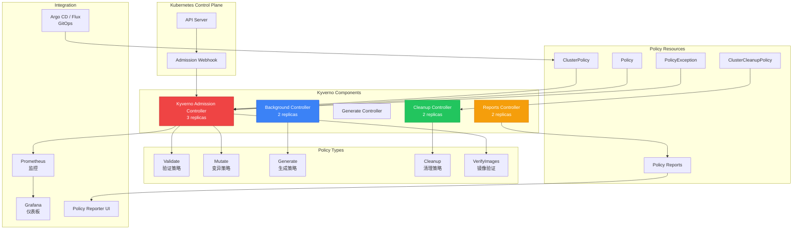

# [[Kyverno|Kyverno]] 企业级策略管理深度实践

> **Author**: Cloud Native Security Architect | **Version**: v1.0 | **Update Time**: 2026-05-18
> **Scenario**: Enterprise-grade [[Kubernetes|Kubernetes]] policy management and security enforcement | **Complexity**: ⭐⭐⭐⭐

<!-- chunk: 概述 -->## 概述

Kyverno 是专为 Kubernetes 设计的策略引擎，以原生 YAML 语法定义策略规则，无需学习新的策略语言。作为 Kubernetes 准入控制器，Kyverno 支持验证（Validate）、变异（Mutate）、生成（Generate）、清理（Cleanup）和镜像验证（VerifyImages）五种策略类型，通过声明式 API 实现安全基线强制、资源配置标准化和供应链安全验证。Kyverno 的设计哲学是"Kubernetes 原生"，策略定义与标准 Kubernetes 资源格式一致，运维人员可以快速上手并集成到现有的 GitOps 工作流中。

Kyverno 的核心优势在于其低学习成本和高表达能力。策略使用标准 K8s YAML 定义，与 Deployment、Service 等资源的 YAML 格式完全一致。策略匹配使用 Kubernetes 标签选择器、资源类型和命名空间过滤，语法与 Kubernetes 原生的选择器语法一致。策略验证使用 JSON Patch 风格的模式匹配，支持通配符、条件表达式和变量引用。这种"Kubernetes 原生"的设计使得运维人员无需学习新的语言（如 Rego）就可以定义复杂的策略。

## 威胁模型分析

在无策略管控的 Kubernetes 集群中，多种安全威胁可能通过配置缺陷被利用。Kyverno 在准入控制层面拦截这些威胁，确保所有部署的工作负载符合安全基线。

**特权容器逃逸**：允许特权容器的集群面临严重的容器逃逸风险。攻击者可通过特权模式访问宿主机设备、加载内核模块、修改内核参数。在实际攻击中，攻击者可以在特权容器内使用 `nsenter` 命令进入宿主机的 PID 命名空间，获取宿主机的完全控制权。或者通过挂载宿主机的文件系统（如 `/` 目录），读取宿主机上的敏感文件（如 `/etc/shadow`、SSH 私钥）或写入恶意文件（如 cron 任务、systemd 服务）。Kyverno 的验证策略强制禁止特权容器，并自动丢弃危险 Linux Capabilities。

**不受信任的镜像**：从任意 Registry 拉取镜像增加了供应链攻击面。攻击者可通过在公共 Registry 发布恶意镜像，通过依赖混淆等方式诱导开发者使用。在缺乏镜像来源限制的集群中，开发人员可以从 Docker Hub 拉取任意镜像，这些镜像可能包含已知的或未知的漏洞、恶意后门或挖矿程序。Kyverno 的镜像验证策略确保所有镜像来自受信任的 Registry，并通过 Cosign/Sigstore 验证镜像签名。

**配置漂移**：在多团队协作的集群中，不同团队可能使用不同的安全配置标准，导致配置不一致和潜在安全风险。例如团队 A 的所有工作负载都配置了 SecurityContext，但团队 B 的工作负载以 root 运行且没有资源限制。这种配置不一致不仅增加了安全风险，还使得合规审计变得困难。Kyverno 的变异策略自动注入标准安全上下文，确保所有工作负载具有统一的安全基线。

**资源耗尽**：未设置资源限制的 Pod 可能消耗过多节点资源，影响同节点其他工作负载。Java 应用如果没有设置堆内存限制（`-Xmx` 或 `-XX:MaxRAMPercentage`），JVM 可能消耗大量内存导致 OOMKilled。更危险的是，被入侵的容器可能故意消耗大量 CPU 和内存，实施拒绝服务攻击。Kyverno 验证策略强制要求所有 Pod 设置资源请求和限制。

**密钥泄露**：将数据库密码、API Key 等敏感信息以明文形式写入环境变量、ConfigMap 或代码中，会导致凭据泄露。攻击者通过容器逃逸、API Server 访问或日志系统获取这些明文密钥后，可以直接访问数据库、第三方 API 等关键资源。Kyverno 可以检测并拒绝包含明文密钥的环境变量配置，强制要求使用 Secret 资源或外部密钥管理系统。

**攻击向量与 Kyverno 防御矩阵**：

| 攻击向量 | 风险等级 | Kyverno 策略类型 | 策略名称 |
|:---|:---|:---|:---|
| 特权容器逃逸 | Critical | Validate | disallow-privileged |
| Root 用户运行 | High | Validate + Mutate | require-non-root / inject-security-context |
| 危险 Capabilities | High | Validate | drop-all-capabilities |
| 未授权镜像源 | High | Validate | restrict-image-registries |
| 未签名镜像 | Critical | VerifyImages | verify-image-signatures |
| 配置漂移 | Medium | Mutate | inject-security-context |
| 资源耗尽 | Medium | Validate | require-resource-limits |
| HostPath 挂载 | High | Validate | restrict-host-path-mounts |
| 主机命名空间 | Critical | Validate | disallow-host-namespaces |
| 缺少标签 | Low | Validate | require-labels |
| 无网络策略 | Medium | Generate | generate-networkpolicy |
| 密钥明文暴露 | High | Validate | disallow-secrets-in-env |
| 调试资源遗留 | Low | Cleanup | cleanup-old-jobs |

<!-- chunk: 架构设计 -->## 架构设计

## 核心组件架构



## 企业级部署

```yaml
# values-kyverno-enterprise.yaml
admissionController:
  replicas: 3
  resources:
    requests:
      cpu: 100m
      memory: 256Mi
    limits:
      cpu: "1"
      memory: 1Gi
  topologySpreadConstraints:
    - maxSkew: 1
      topologyKey: topology.kubernetes.io/zone
      whenUnsatisfiable: DoNotSchedule
    - maxSkew: 1
      topologyKey: kubernetes.io/hostname
      whenUnsatisfiable: DoNotSchedule
  podDisruptionBudget:
    minAvailable: 2

backgroundController:
  replicas: 2
  resources:
    requests:
      cpu: 100m
      memory: 128Mi
    limits:
      cpu: 500m
      memory: 512Mi

cleanupController:
  replicas: 2
  resources:
    requests:
      cpu: 100m
      memory: 64Mi
    limits:
      cpu: 500m
      memory: 256Mi

reportsController:
  replicas: 2
  resources:
    requests:
      cpu: 100m
      memory: 128Mi
    limits:
      cpu: 500m
      memory: 512Mi

configuration:
  enablePolicyException: true
  enableReporting: true
  backgroundScan: true
  backgroundScanInterval: "1h"
  admissionReports: true
  aggregateReports: true
  webhooks:
    timeoutSeconds: 10
    failurePolicy: Fail
    matchPolicy: Equivalent
  resourceFilters:
    - '[*,"*","kyverno"]'
    - '[*,"*","kube-system"]'
    - '[*,"*","kube-public"]'
    - '[*,"*","kube-node-lease"]'

features:
  admissionReports:
    enabled: true
  aggregateReports:
    enabled: true
  policyReports:
    enabled: true
  cleanupReports:
    enabled: true

serviceMonitor:
  enabled: true
  interval: "30s"
```

> ⚠️ **🟡 中危变更** — 变更集群资源状态，建议先 --dry-run 或 diff 确认
> - `helm upgrade/install`：部署/升级 release

```bash
helm repo add kyverno https://kyverno.github.io/kyverno/
helm repo update

helm install kyverno kyverno/kyverno \
  --namespace kyverno \
  --create-namespace \
  --values values-kyverno-enterprise.yaml \
  --version v3.3.0
```

<!-- chunk: 核心配置 -->## 核心配置

## 验证策略（Validate）

验证策略是最常用的策略类型，用于检查资源是否符合指定的规则。当资源不匹配时，可以拒绝请求（Enforce 模式）或仅记录违规（Audit 模式）。生产环境中建议先以 Audit 模式运行策略 2-3 周，观察违规情况并调整规则，确认无误后再切换到 Enforce 模式。

```yaml
# 限制镜像来源 Registry
apiVersion: kyverno.io/v1
kind: ClusterPolicy
metadata:
  name: restrict-image-registries
  annotations:
    policies.kyverno.io/title: Restrict Image Registries
    policies.kyverno.io/category: Security
    policies.kyverno.io/severity: high
    policies.kyverno.io/subject: Pod
spec:
  validationFailureAction: Enforce
  background: true
  rules:
    - name: validate-registries
      match:
        any:
          - resources:
              kinds:
                - Pod
      validate:
        message: "镜像必须来自受信任的 Registry: registry.company.com, harbor.company.com, gcr.io/company"
        foreach:
          - list: request.object.spec.containers
            element: container
            deny:
              conditions:
                any:
                  - key: "{{ regex_replace_all_literal('^([^/]+).*', '{{container.image}}', '$1') }}"
                    operator: AnyNotIn
                    value:
                      - registry.company.com
                      - harbor.company.com
                      - gcr.io/company
                      - ghcr.io/company
---
# 强制资源限制
apiVersion: kyverno.io/v1
kind: ClusterPolicy
metadata:
  name: require-resource-limits
  annotations:
    policies.kyverno.io/title: Require Resource Limits
    policies.kyverno.io/category: Best Practices
    policies.kyverno.io/severity: medium
spec:
  validationFailureAction: Enforce
  background: true
  rules:
    - name: validate-resources
      match:
        any:
          - resources:
              kinds:
                - Pod
      validate:
        message: "所有容器必须设置 CPU 和内存的 requests 和 limits"
        pattern:
          spec:
            containers:
              - resources:
                  requests:
                    memory: "?*"
                    cpu: "?*"
                  limits:
                    memory: "?*"
                    cpu: "?*"
---
# 禁止特权容器
apiVersion: kyverno.io/v1
kind: ClusterPolicy
metadata:
  name: disallow-privileged
  annotations:
    policies.kyverno.io/title: Disallow Privileged Containers
    policies.kyverno.io/category: Pod Security Standards (Baseline)
    policies.kyverno.io/severity: critical
spec:
  validationFailureAction: Enforce
  background: true
  rules:
    - name: privileged-containers
      match:
        any:
          - resources:
              kinds:
                - Pod
      validate:
        message: "禁止创建特权容器"
        pattern:
          spec:
            containers:
              - securityContext:
                  privileged: false
---
# 禁止主机命名空间共享
apiVersion: kyverno.io/v1
kind: ClusterPolicy
metadata:
  name: disallow-host-namespaces
  annotations:
    policies.kyverno.io/title: Disallow Host Namespaces
    policies.kyverno.io/category: Pod Security Standards (Baseline)
    policies.kyverno.io/severity: high
spec:
  validationFailureAction: Enforce
  background: true
  rules:
    - name: host-namespaces
      match:
        any:
          - resources:
              kinds:
                - Pod
      validate:
        message: "禁止使用 hostPID、hostIPC、hostNetwork"
        pattern:
          spec:
            =(hostPID): "false"
            =(hostIPC): "false"
            =(hostNetwork): "false"
---
# 强制健康检查探针
apiVersion: kyverno.io/v1
kind: ClusterPolicy
metadata:
  name: require-probes
  annotations:
    policies.kyverno.io/title: Require Pod Probes
    policies.kyverno.io/category: Best Practices
    policies.kyverno.io/severity: medium
spec:
  validationFailureAction: Audit
  background: true
  rules:
    - name: validate-probes
      match:
        any:
          - resources:
              kinds:
                - Pod
              namespaces:
                - production
                - staging
      validate:
        message: "生产环境 Pod 必须配置 liveness 和 readiness 探针"
        pattern:
          spec:
            containers:
              - livenessProbe:
                  periodSeconds: ">0"
                readinessProbe:
                  periodSeconds: ">0"
---
# 禁止 HostPath 挂载
apiVersion: kyverno.io/v1
kind: ClusterPolicy
metadata:
  name: restrict-host-path-mounts
  annotations:
    policies.kyverno.io/title: Restrict HostPath Mounts
    policies.kyverno.io/category: Pod Security Standards (Baseline)
    policies.kyverno.io/severity: high
spec:
  validationFailureAction: Enforce
  background: true
  rules:
    - name: host-path
      match:
        any:
          - resources:
              kinds:
                - Pod
      validate:
        message: "禁止使用 HostPath 卷挂载"
        pattern:
          spec:
            =(volumes):
              - X(hostPath): "null"
---
# 禁止 :latest 标签
apiVersion: kyverno.io/v1
kind: ClusterPolicy
metadata:
  name: disallow-latest-tag
  annotations:
    policies.kyverno.io/title: Disallow Latest Tag
    policies.kyverno.io/category: Supply Chain
    policies.kyverno.io/severity: medium
spec:
  validationFailureAction: Enforce
  background: true
  rules:
    - name: validate-image-tags
      match:
        any:
          - resources:
              kinds:
                - Pod
      validate:
        message: "禁止使用 :latest 镜像标签，必须指定具体版本"
        foreach:
          - list: request.object.spec.[initContainers, ephemeralContainers, containers][]
            element: container
            deny:
              conditions:
                any:
                  - key: "{{ endsWith(container.image, ':latest') || !contains(container.image, ':') }}"
                    operator: Equals
                    value: true
---
# 禁止明文密钥环境变量
apiVersion: kyverno.io/v1
kind: ClusterPolicy
metadata:
  name: disallow-secrets-in-env
  annotations:
    policies.kyverno.io/title: Disallow Secrets in Environment Variables
    policies.kyverno.io/category: Security
    policies.kyverno.io/severity: high
spec:
  validationFailureAction: Enforce
  background: true
  rules:
    - name: use-secret-ref-instead
      match:
        any:
          - resources:
              kinds:
                - Pod
      validate:
        message: "禁止在 env 中直接使用明文密钥，请使用 secretKeyRef 或 Vault 注入"
        pattern:
          spec:
            containers:
              - (name): "*"
                ~(env):
                  - value: "*password*|*secret*|*token*|*api_key*|*credential*"
```

## 变异策略（Mutate）

变异策略在资源创建时自动修改配置，无需开发人员手动添加安全字段。这降低了人为遗漏的风险，确保所有工作负载自动获得标准安全配置。变异策略使用 `+(field)` 语法表示仅在字段不存在时添加，不会覆盖用户已设置的值。

```yaml
# 自动注入安全上下文
apiVersion: kyverno.io/v1
kind: ClusterPolicy
metadata:
  name: inject-security-context
  annotations:
    policies.kyverno.io/title: Inject Security Context
    policies.kyverno.io/category: Security
    policies.kyverno.io/severity: medium
spec:
  rules:
    - name: add-default-security-context
      match:
        any:
          - resources:
              kinds:
                - Pod
      mutate:
        patchStrategicMerge:
          spec:
            securityContext:
              +(runAsNonRoot): true
              +(runAsUser): 1001
              +(runAsGroup): 1001
              +(fsGroup): 1001
              +(seccompProfile):
                +(type): RuntimeDefault
            containers:
              - (name): "?*"
                securityContext:
                  +(allowPrivilegeEscalation): false
                  +(capabilities):
                    +(drop):
                      - ALL
---
# 自动注入标签
apiVersion: kyverno.io/v1
kind: ClusterPolicy
metadata:
  name: add-standard-labels
  annotations:
    policies.kyverno.io/title: Add Standard Labels
    policies.kyverno.io/category: Metadata
spec:
  rules:
    - name: add-team-label
      match:
        any:
          - resources:
              kinds:
                - Deployment
                - StatefulSet
                - DaemonSet
      mutate:
        patchStrategicMerge:
          metadata:
            labels:
              +(team): "{{request.object.metadata.namespace}}"
              +(managed-by): "kyverno"
              +(environment): "{{request.object.metadata.namespace}}"
---
# 自动设置镜像摘要
apiVersion: kyverno.io/v1
kind: ClusterPolicy
metadata:
  name: mutate-image-digest
  annotations:
    policies.kyverno.io/title: Mutate Image Digest
    policies.kyverno.io/category: Supply Chain
spec:
  rules:
    - name: ensure-digest
      match:
        any:
          - resources:
              kinds:
                - Pod
      verifyImages:
        - imageReferences:
            - "registry.company.com/*"
          mutateDigest: true
```

## 镜像验证策略（VerifyImages）

```yaml
apiVersion: kyverno.io/v1
kind: ClusterPolicy
metadata:
  name: verify-image-signatures
  annotations:
    policies.kyverno.io/title: Verify Image Signatures
    policies.kyverno.io/category: Supply Chain Security
    policies.kyverno.io/severity: critical
spec:
  validationFailureAction: Enforce
  background: false
  webhookTimeoutSeconds: 30
  failurePolicy: Fail
  rules:
    - name: verify-company-images
      match:
        any:
          - resources:
              kinds:
                - Pod
      verifyImages:
        - imageReferences:
            - "registry.company.com/*"
          mutateDigest: true
          attestors:
            - entries:
                - keyless:
                    subject: "https://github.com/company/*"
                    issuer: "https://token.actions.githubusercontent.com"
                    rekor:
                      url: https://rekor.sigstore.dev
        - imageReferences:
            - "harbor.company.com/*"
          mutateDigest: true
          attestors:
            - entries:
                - keys:
                    publicKeys: |-
                      -----BEGIN PUBLIC KEY-----
                      MFkwEwYHKoZIzj0CAQYIKoZIzj0DAQcDQgAE...
                      -----END PUBLIC KEY-----
    - name: verify-attestations
      match:
        any:
          - resources:
              kinds:
                - Pod
      verifyImages:
        - imageReferences:
            - "registry.company.com/production/*"
          attestations:
            - type: https://example.com/vulns
              conditions:
                - all:
                    - key: "{{ critical }}"
                      operator: Equals
                      value: 0
```

## 生成策略（Generate）

```yaml
apiVersion: kyverno.io/v1
kind: ClusterPolicy
metadata:
  name: generate-networkpolicy
  annotations:
    policies.kyverno.io/title: Generate Default NetworkPolicy
    policies.kyverno.io/category: Networking
spec:
  rules:
    - name: generate-default-deny
      match:
        any:
          - resources:
              kinds:
                - Namespace
      exclude:
        any:
          - resources:
              namespaces:
                - kube-system
                - kyverno
                - gatekeeper-system
      generate:
        apiVersion: networking.k8s.io/v1
        kind: NetworkPolicy
        name: default-deny-all
        namespace: "{{request.object.metadata.name}}"
        synchronize: true
        data:
          spec:
            podSelector: {}
            policyTypes:
              - Ingress
              - Egress
---
apiVersion: kyverno.io/v1
kind: ClusterPolicy
metadata:
  name: generate-resourcequota
  annotations:
    policies.kyverno.io/title: Generate ResourceQuota
    policies.kyverno.io/category: Resource Management
spec:
  rules:
    - name: generate-quota
      match:
        any:
          - resources:
              kinds:
                - Namespace
      exclude:
        any:
          - resources:
              namespaces:
                - kube-system
                - kyverno
                - gatekeeper-system
      generate:
        apiVersion: v1
        kind: ResourceQuota
        name: default-quota
        namespace: "{{request.object.metadata.name}}"
        synchronize: true
        data:
          spec:
            hard:
              requests.cpu: "100"
              requests.memory: 200Gi
              limits.cpu: "200"
              limits.memory: 400Gi
              pods: "500"
---
# 生成 SA 和 RBAC
apiVersion: kyverno.io/v1
kind: ClusterPolicy
metadata:
  name: generate-default-rbac
  annotations:
    policies.kyverno.io/title: Generate Default RBAC
    policies.kyverno.io/category: Security
spec:
  rules:
    - name: generate-viewer-role
      match:
        any:
          - resources:
              kinds:
                - Namespace
      exclude:
        any:
          - resources:
              namespaces:
                - kube-system
                - kyverno
      generate:
        apiVersion: rbac.authorization.k8s.io/v1
        kind: RoleBinding
        name: namespace-viewer
        namespace: "{{request.object.metadata.name}}"
        synchronize: true
        data:
          subjects:
            - kind: Group
              name: devops@example.com
              apiGroup: rbac.authorization.k8s.io
          roleRef:
            kind: ClusterRole
            name: view
            apiGroup: rbac.authorization.k8s.io
```

<!-- chunk: 安全策略实战 -->## 安全策略实战

## Pod Security Standards 实施策略集

以下策略集实现了 Kubernetes Pod Security Standards 的 Restricted 级别，提供最严格的安全基线。建议在所有生产命名空间启用 Restricted 配置文件，在开发命名空间可以使用 Baseline 配置文件。

```yaml
# PSS Restricted: 禁止所有危险配置
apiVersion: kyverno.io/v1
kind: ClusterPolicy
metadata:
  name: pod-security-restricted
  annotations:
    policies.kyverno.io/title: Pod Security Standards Restricted
    policies.kyverno.io/category: Pod Security
    policies.kyverno.io/severity: critical
spec:
  validationFailureAction: Enforce
  background: true
  rules:
    - name: restrict-capabilities
      match:
        any:
          - resources:
              kinds:
                - Pod
      validate:
        message: "必须丢弃所有 capabilities，仅允许添加 NET_BIND_SERVICE"
        foreach:
          - list: request.object.spec.[initContainers, ephemeralContainers, containers][]
            deny:
              conditions:
                any:
                  - key: "{{ element.securityContext.capabilities.drop[] }}"
                    operator: NotEquals
                    value: ALL
    - name: require-non-root
      match:
        any:
          - resources:
              kinds:
                - Pod
      validate:
        message: "必须以非 root 用户运行 (runAsNonRoot: true)"
        pattern:
          spec:
            securityContext:
              runAsNonRoot: true
    - name: disallow-privilege-escalation
      match:
        any:
          - resources:
              kinds:
                - Pod
      validate:
        message: "必须禁止权限提升 (allowPrivilegeEscalation: false)"
        pattern:
          spec:
            containers:
              - securityContext:
                  allowPrivilegeEscalation: false
    - name: require-seccomp
      match:
        any:
          - resources:
              kinds:
                - Pod
      validate:
        message: "必须配置 seccompProfile"
        pattern:
          spec:
            securityContext:
              seccompProfile:
                type: "RuntimeDefault | Localhost"
```

## 合规策略集

```yaml
# PCI-DSS 合规策略
apiVersion: kyverno.io/v1
kind: ClusterPolicy
metadata:
  name: pci-dss-compliance
  annotations:
    policies.kyverno.io/title: PCI DSS Compliance
    policies.kyverno.io/category: Compliance
    policies.kyverno.io/severity: high
spec:
  validationFailureAction: Audit
  background: true
  rules:
    - name: require-network-policies
      match:
        any:
          - resources:
              kinds:
                - Namespace
      validate:
        message: "PCI DSS 要求每个命名空间必须有 NetworkPolicy"
        deny:
          conditions:
            all:
              - key: "{{ request.object.metadata.name }}"
                operator: NotEquals
                value: "kube-system"
              - key: "{{ request.object.metadata.name }}"
                operator: NotEquals
                value: "kyverno"
    - name: require-resource-limits-pci
      match:
        any:
          - resources:
              kinds:
                - Pod
              namespaces:
                - pci-scope
      validate:
        message: "PCI DSS 范围内的 Pod 必须设置资源限制"
        pattern:
          spec:
            containers:
              - resources:
                  limits:
                    memory: "?*"
                    cpu: "?*"
---
# HIPAA 合规策略
apiVersion: kyverno.io/v1
kind: ClusterPolicy
metadata:
  name: hipaa-compliance
  annotations:
    policies.kyverno.io/title: HIPAA Compliance
    policies.kyverno.io/category: Compliance
    policies.kyverno.io/severity: high
spec:
  validationFailureAction: Enforce
  background: true
  rules:
    - name: encrypt-secrets-at-rest
      match:
        any:
          - resources:
              kinds:
                - Secret
              namespaces:
                - hipaa-scope
      validate:
        message: "Secrets 必须标记为已加密存储"
        pattern:
          metadata:
            annotations:
              encryption-at-rest: "enabled"
    - name: disallow-latest-tag
      match:
        any:
          - resources:
              kinds:
                - Pod
              namespaces:
                - hipaa-scope
      validate:
        message: "HIPAA 合规要求禁止使用 :latest 镜像标签"
        pattern:
          spec:
            containers:
              - image: "!*:latest"
    - name: require-probes-hipaa
      match:
        any:
          - resources:
              kinds:
                - Pod
              namespaces:
                - hipaa-scope
      validate:
        message: "HIPAA 范围内的 Pod 必须配置健康检查"
        pattern:
          spec:
            containers:
              - livenessProbe:
                  periodSeconds: ">0"
                readinessProbe:
                  periodSeconds: ">0"
```

<!-- chunk: 合规与审计 -->## 合规与审计

## 策略报告

Kyverno 自动生成 PolicyReport 和 ClusterPolicyReport 资源，记录所有策略的审计结果。每个命名空间一个 PolicyReport，集群级策略由 ClusterPolicyReport 记录。

```bash
# 查看集群级策略报告
kubectl get clusterpolicyreport -o yaml

# 查看命名空间级策略报告
kubectl get policyreport -n production -o yaml

# 查看违规详情
kubectl get policyreport -n production -o json | \
  jq '.results[] | select(.result == "fail") |
    {policy: .policy, rule: .rule, resource: .resource, message: .message}'

# 统计合规率
kubectl get policyreport -A -o json | \
  jq -r '.items[] | {ns: .metadata.namespace, pass: ([.results[] | select(.result=="pass")] | length), fail: ([.results[] | select(.result=="fail")] | length)} | "\(.ns): pass=\(.pass) fail=\(.fail)"'
```

## Policy Reporter UI

> ⚠️ **🟡 中危变更** — 变更集群资源状态，建议先 --dry-run 或 diff 确认
> - `helm upgrade/install`：部署/升级 release

```bash
helm repo add policy-reporter https://kyverno.github.io/policy-reporter
helm repo update

helm install policy-reporter policy-reporter/policy-reporter \
  --namespace kyverno \
  --set ui.enabled=true \
  --set monitoring.enabled=true \
  --set kyvernoPlugin.enabled=true \
  --set grafana.dashboard.enabled=true
```

## 合规报告自动化

```bash
#!/bin/bash
# kyverno_compliance_report.sh

REPORT_DIR="/tmp/kyverno-reports"
DATE=$(date +%Y%m%d_%H%M%S)
mkdir -p "$REPORT_DIR/$DATE"

echo "# Kyverno Policy Compliance Report" > "$REPORT_DIR/$DATE/report.md"
echo "**Date**: $(date)" >> "$REPORT_DIR/$DATE/report.md"
echo "**Cluster**: $(kubectl config current-context)" >> "$REPORT_DIR/$DATE/report.md"
echo "" >> "$REPORT_DIR/$DATE/report.md"

echo "<!-- chunk: Summary" >> "$REPORT_DIR/$DATE/report.md" -->## Summary" >> "$REPORT_DIR/$DATE/report.md"
TOTAL_POLICIES=$(kubectl get clusterpolicies --no-headers | wc -l)
ENFORCED=$(kubectl get clusterpolicies -o json | jq '[.items[] | select(.spec.validationFailureAction=="Enforce")] | length')
AUDIT_MODE=$(kubectl get clusterpolicies -o json | jq '[.items[] | select(.spec.validationFailureAction=="Audit")] | length')
echo "- Total Policies: $TOTAL_POLICIES" >> "$REPORT_DIR/$DATE/report.md"
echo "- Enforced: $ENFORCED" >> "$REPORT_DIR/$DATE/report.md"
echo "- Audit: $AUDIT_MODE" >> "$REPORT_DIR/$DATE/report.md"
echo "" >> "$REPORT_DIR/$DATE/report.md"

echo "<!-- chunk: Cluster-level Violations" >> "$REPORT_DIR/$DATE/report.md" -->## Cluster-level Violations" >> "$REPORT_DIR/$DATE/report.md"
echo "| Policy | Rule | Resource | Message |" >> "$REPORT_DIR/$DATE/report.md"
echo "|:---|:---|:---|:---|" >> "$REPORT_DIR/$DATE/report.md"
kubectl get clusterpolicyreport -o json | \
  jq -r '.results[] | select(.result == "fail") |
    "| \(.policy) | \(.rule) | \(.resource.kind)/\(.resource.name) | \(.message) |"' \
  >> "$REPORT_DIR/$DATE/report.md"

echo "" >> "$REPORT_DIR/$DATE/report.md"
echo "<!-- chunk: Namespace-level Violations" >> "$REPORT_DIR/$DATE/report.md" -->## Namespace-level Violations" >> "$REPORT_DIR/$DATE/report.md"
for ns in $(kubectl get namespaces -o jsonpath='{.items[*].metadata.name}'); do
  violations=$(kubectl get policyreport -n "$ns" -o json 2>/dev/null | \
    jq -r '.results[] | select(.result == "fail")')
  if [ -n "$violations" ]; then
    echo "#<!-- chunk: Namespace: $ns" >> "$REPORT_DIR/$DATE/report.md" -->## Namespace: $ns" >> "$REPORT_DIR/$DATE/report.md"
    echo "| Policy | Rule | Resource | Message |" >> "$REPORT_DIR/$DATE/report.md"
    echo "|:---|:---|:---|:---|" >> "$REPORT_DIR/$DATE/report.md"
    echo "$violations" | \
      jq -r '"| \(.policy) | \(.rule) | \(.resource.kind)/\(.resource.name) | \(.message) |"' \
      >> "$REPORT_DIR/$DATE/report.md"
    echo "" >> "$REPORT_DIR/$DATE/report.md"
  fi
done

echo "<!-- chunk: Policy Exceptions" >> "$REPORT_DIR/$DATE/report.md" -->## Policy Exceptions" >> "$REPORT_DIR/$DATE/report.md"
kubectl get policyexception -A -o json | \
  jq -r '.items[] | "#<!-- chunk: \(.metadata.name)\n- Policies: \(.spec.exceptions[].policyName)\n- Rules: \(.spec.exceptions[].ruleNames)\n- Namespaces: \(.spec.match[].resources[].namespaces[])"' \ -->## \(.metadata.name)\n- Policies: \(.spec.exceptions[].policyName)\n- Rules: \(.spec.exceptions[].ruleNames)\n- Namespaces: \(.spec.match[].resources[].namespaces[])"' \
  >> "$REPORT_DIR/$DATE/report.md"

echo "Report: $REPORT_DIR/$DATE/report.md"
```

<!-- chunk: 监控与告警 -->## 监控与告警

```yaml
apiVersion: monitoring.coreos.com/v1
kind: ServiceMonitor
metadata:
  name: kyverno-metrics
  namespace: kyverno
spec:
  selector:
    matchLabels:
      app.kubernetes.io/name: kyverno
  endpoints:
    - port: metrics
      interval: 30s
      path: /metrics
---
apiVersion: monitoring.coreos.com/v1
kind: PrometheusRule
metadata:
  name: kyverno-alerts
  namespace: kyverno
spec:
  groups:
    - name: kyverno.rules
      rules:
        - alert: KyvernoControllerDown
          expr: up{job="kyverno"} == 0
          for: 5m
          labels:
            severity: critical
          annotations:
            summary: "Kyverno 控制器不可用"
            description: "Kyverno 已停止响应，策略执行中断"

        - alert: HighPolicyViolationRate
          expr: rate(kyverno_policy_results_total{result="fail"}[5m]) > 10
          for: 2m
          labels:
            severity: warning
          annotations:
            summary: "策略违规率过高: {{ $value }}/s"
            description: "可能存在大量不合规的部署尝试"

        - alert: KyvernoWebhookLatencyHigh
          expr: |
            histogram_quantile(0.95,
              rate(kyverno_admission_review_duration_seconds_bucket[5m])
            ) > 2
          for: 5m
          labels:
            severity: warning
          annotations:
            summary: "Kyverno Webhook P95 延迟超过 2 秒"
            description: "延迟过高可能影响集群部署性能"

        - alert: PolicyExceptionCount
          expr: count(kyverno_policy_exception) > 10
          for: 10m
          labels:
            severity: info
          annotations:
            summary: "策略例外数量过多: {{ $value }}"
            description: "过多的策略例外可能削弱安全防护，请定期审查"

        - alert: KyvernoAdmissionErrorRate
          expr: rate(kyverno_admission_review_duration_seconds_count{error="true"}[5m]) > 0
          for: 5m
          labels:
            severity: warning
          annotations:
            summary: "Kyverno 准入审查错误率异常"
            description: "准入审查错误率 {{ $value }}/s"

        - alert: KyvernoHighMemoryUsage
          expr: |
            container_memory_working_set_bytes{namespace="kyverno",container!="",container!="POD"}
            / container_spec_memory_limit_bytes > 0.85
          for: 10m
          labels:
            severity: warning
          annotations:
            summary: "Kyverno 内存使用率超过 85%"
```

<!-- chunk: 最佳实践 -->## 最佳实践

## 策略开发流程

建议采用渐进式策略部署。新建的策略首先以 Audit 模式运行，观察违规情况并调整规则。确认无误后在非关键命名空间切换为 Enforce 模式。稳定后逐步扩展到所有命名空间。所有策略变更通过 GitOps 流程管理，使用 Argo CD 或 Flux 自动同步。

| 阶段 | 模式 | 持续时间 | 操作 |
|:---|:---|:---|:---|
| 开发 | 本地测试 | - | `kyverno test` / `kyverno apply` |
| 测试 | Audit | 2-3 周 | 观察违规、调整规则 |
| 预发布 | Enforce (非关键 NS) | 1-2 周 | 确认无误报 |
| 生产 | Enforce (所有 NS) | 持续 | 监控告警 |

## GitOps 集成

```yaml
apiVersion: argoproj.io/v1alpha1
kind: Application
metadata:
  name: kyverno-policies
  namespace: argocd
spec:
  project: security
  source:
    repoURL: https://github.com/company/kubernetes-policies.git
    targetRevision: HEAD
    path: policies/kyverno
    directory:
      recurse: true
  destination:
    server: https://kubernetes.default.svc
    namespace: kyverno
  syncPolicy:
    automated:
      prune: true
      selfHeal: true
    syncOptions:
      - CreateNamespace=true
      - ApplyOutOfSyncOnly=true
  ignoreDifferences:
    - group: kyverno.io
      kind: ClusterPolicyReport
      jsonPointers:
        - /status
```

## 策略测试

```bash
# 使用 Kyverno CLI 测试策略
kyverno validate policies/
kyverno test policies/test/ --manifests policies/test/resources/

# CI/CD 集成
helm template mychart | kyverno apply policies/ --resource -

# 策略效果预览
kyverno apply policies/ --resource manifests/deployment.yaml --policy-report
```

## 策略命名规范

| 前缀 | 类别 | 示例 |
|:---|:---|:---|
| `disallow-*` | 禁止特定配置 | disallow-privileged |
| `require-*` | 要求特定配置 | require-resource-limits |
| `restrict-*` | 限制特定范围 | restrict-image-registries |
| `generate-*` | 自动生成资源 | generate-networkpolicy |
| `inject-*` | 自动注入配置 | inject-security-context |
| `verify-*` | 验证特定属性 | verify-image-signatures |
| `cleanup-*` | 清理过期资源 | cleanup-old-jobs |

<!-- chunk: 事件响应流程 -->## 事件响应流程

| 事件类型 | 严重程度 | 响应时间 | 操作 |
|:---|:---|:---|:---|
| 特权容器部署被拒 | High | < 1h | 检查部署来源，确认是否为攻击 |
| 策略违规率飙升 | Medium | < 4h | 分析违规模式，通知相关团队 |
| Kyverno 不可用 | Critical | < 15min | 紧急恢复 Webhook 配置 |
| 大量 PolicyException | Low | < 1 周 | 审查豁免的必要性 |
| Webhook 延迟过高 | Medium | < 2h | 优化策略或增加资源 |

<!-- chunk: 故障排查 -->## 故障排查

## 完整诊断脚本

```bash
#!/bin/bash
# kyverno_diagnostics.sh

echo "=== Kyverno Pods ==="
kubectl get pods -n kyverno -o wide
echo ""

echo "=== Resource Usage ==="
kubectl top pods -n kyverno
echo ""

echo "=== Policy Status ==="
kubectl get clusterpolicies -o custom-columns=NAME:.metadata.name,ACTION:.spec.validationFailureAction,READY:.status.ready,RULES:.spec.rules[*].name
echo ""

echo "=== Recent Violations ==="
kubectl get clusterpolicyreport -o json | \
  jq -r '.results[] | select(.result == "fail") | "\(.policy)/\(.rule): \(.resource.kind)/\(.resource.name) - \(.message)"' | tail -20
echo ""

echo "=== Policy Exceptions ==="
kubectl get policyexception -A -o wide
echo ""

echo "=== Webhook Configuration ==="
kubectl get validatingwebhookconfiguration -l app.kubernetes.io/name=kyverno -o yaml | grep -A10 "failurePolicy|timeoutSeconds|namespaceSelector"
echo ""

echo "=== Controller Logs (last 30 lines) ==="
kubectl logs -n kyverno -l app.kubernetes.io/name=kyverno --tail=30
echo ""

echo "=== Cleanup Policies ==="
kubectl get clustercleanuppolicy -o wide
echo ""

echo "=== Policy Reports Summary ==="
for ns in $(kubectl get namespaces -o jsonpath='{.items[*].metadata.name}'); do
  fails=$(kubectl get policyreport -n "$ns" -o json 2>/dev/null | jq '[.results[] | select(.result=="fail")] | length')
  if [ "$fails" != "0" ] && [ "$fails" != "null" ]; then
    echo "$ns: $fails violations"
  fi
done
```

## 紧急恢复

> ⚠️ **🟡 中危变更** — 变更集群资源状态，建议先 --dry-run 或 diff 确认
> - `kubectl edit/patch`：修改运行中的资源

```bash
# 紧急恢复：将 Webhook failurePolicy 改为 Ignore
kubectl patch validatingwebhookconfiguration kyverno-resource-validating-webhook-cfg \
  --type json -p='[{"op":"replace","path":"/webhooks/0/failurePolicy","value":"Ignore"}]'
kubectl patch mutatingwebhookconfiguration kyverno-resource-mutating-webhook-cfg \
  --type json -p='[{"op":"replace","path":"/webhooks/0/failurePolicy","value":"Ignore"}]'

# 恢复 Fail 策略
kubectl patch validatingwebhookconfiguration kyverno-resource-validating-webhook-cfg \
  --type json -p='[{"op":"replace","path":"/webhooks/0/failurePolicy","value":"Fail"}]'
kubectl patch mutatingwebhookconfiguration kyverno-resource-mutating-webhook-cfg \
  --type json -p='[{"op":"replace","path":"/webhooks/0/failurePolicy","value":"Fail"}]'
```

---

*本文档基于企业级 Kyverno 策略管理实践经验编写，持续更新最新技术和最佳实践。*

---

<!-- chunk: Obsidian 相关文档 -->## Obsidian 相关文档

- domain-05-security-compliance MOC
- [[domain-05-security-compliance/README.md|Domain 05: 云原生安全 (Cloud Native Security)]]
- [[domain-05-security-compliance/00-open-source-projects-index.md|Domain-25 云原生安全 — 开源项目索引]]
- Falco 云原生安全监控深度实践
- Sysdig企业级容器安全深度实践
- Aqua Security 企业级容器安全平台深度实践
- HashiCorp Vault 企业级密钥管理深度实践
- OPA Gatekeeper 策略即代码深度实践
- 容器镜像安全扫描深度实践
- Kubernetes 安全加固深度实践
- gVisor 容器沙箱深度解析
- cert-manager 自动证书管理深度实践

## See Also

- 02-sysdig-enterprise-container-security
- 03-aqua-enterprise-container-security
- 05-vault-enterprise-secrets-management
- 09-opa-gatekeeper-policy

- [[domain-05-security-compliance/README.md|返回目录]]

## Related

- [[domain-19-landscape-references/topic-index/security-index.md|Security 安全知识图谱索引]]
