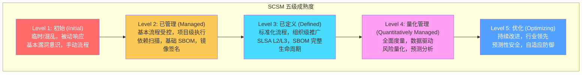
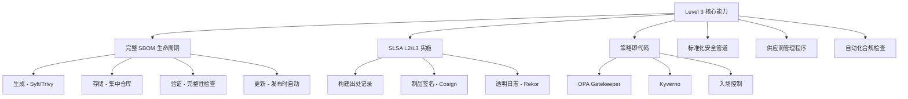
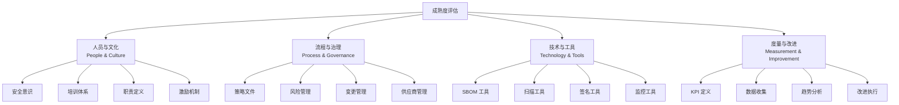
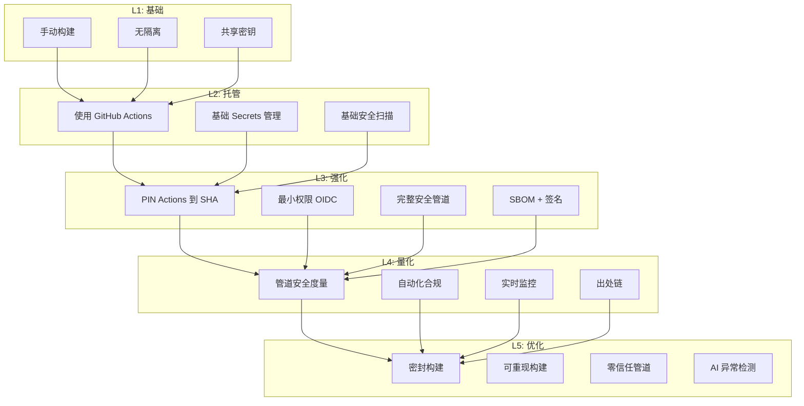
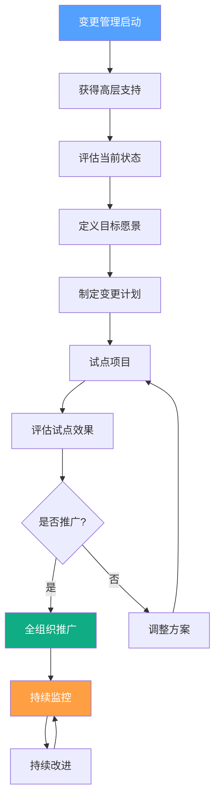
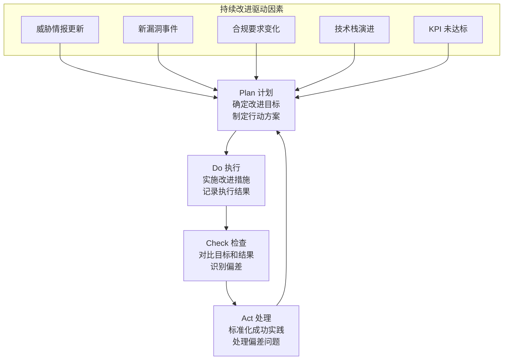

> **生产环境安全提示**
>
> 本文档包含可直接执行的运维命令。执行前请确认：当前目标集群与 Namespace 是否正确；是否具备足够的 RBAC 权限；是否已在非生产环境验证。命令风险等级标注：🔴 高风险（可能造成数据丢失或服务中断）、🟡 中风险（会修改集群状态，但通常可回滚）、🟢 低风险/只读（信息收集，无副作用）。


# 供应链安全成熟度模型 (Supply Chain Security Maturity Model)

> 建立系统化的供应链安全成熟度评估和改进框架，帮助组织科学地规划和推进安全能力建设。

---

<!-- chunk: 目录 (Table of Contents) -->## 目录 (Table of Contents)

1. [成熟度模型概述](#1-成熟度模型概述)
2. [SCSM 成熟度级别 L1-L5](#2-scsm-成熟度级别-l1-l5)
3. [评估框架与方法论](#3-评估框架与方法论)
4. [能力域详细评估](#4-能力域详细评估)
5. [改进路线图](#5-改进路线图)
6. [合规性映射](#6-合规性映射)
7. [组织能力建设](#7-组织能力建设)
8. [度量与 KPI](#8-度量与-kpi)
9. [技术实施指南](#9-技术实施指南)
10. [行业最佳实践案例](#10-行业最佳实践案例)
11. [持续改进机制](#11-持续改进机制)
12. [成熟度评估工具](#12-成熟度评估工具)

---

<!-- chunk: 1. 成熟度模型概述 -->## 1. 成熟度模型概述

## 1.1 模型设计理念

供应链安全成熟度模型（Supply Chain Security Maturity Model, SCSM）参考了 CMMI（能力成熟度模型集成）和 BSIMM（软件安全构建成熟度模型）的设计思想，专注于软件供应链安全领域。

```
成熟度模型的核心价值:

当前状态评估 ──→ 差距识别 ──→ 优先级排序 ──→ 改进执行 ──→ 持续监控
      │                                                          │
      └──────────────────── 反馈循环 ──────────────────────────┘

关键原则:
1. 可测量性 - 每个级别有明确可量化的指标
2. 渐进性   - 级别间有清晰的进阶路径
3. 实用性   - 基于行业最佳实践，可落地执行
4. 全面性   - 覆盖供应链全生命周期
5. 适应性   - 适用于不同规模和行业的组织
```

## 1.2 成熟度模型总览



## 1.3 与主要框架的关系

| 成熟度级别 | SLSA 对应 | NIST CSF | OpenSSF Scorecard | BSIMM |
|-----------|----------|----------|-------------------|-------|
| L1 初始   | SLSA L0  | Identify | 0-3分 | SR 1.1-1.2 |
| L2 已管理 | SLSA L1  | Protect  | 3-5分 | SR 2.x |
| L3 已定义 | SLSA L2/L3 | Detect | 5-7分 | SR 3.x |
| L4 量化管理 | SLSA L3 | Respond | 7-9分 | SR 3.x+ |
| L5 优化   | SLSA L4  | Recover  | 9-10分 | SR 3.x++ |

---

<!-- chunk: 2. SCSM 成熟度级别 L1-L5 -->## 2. SCSM 成熟度级别 L1-L5

## 2.1 Level 1 - 初始级 (Initial)

**特征描述：** 供应链安全实践是临时的、被动的，缺乏系统化管理。

```
Level 1 组织特征:

能力特征:
├── 无正式的软件物料清单 (SBOM)
├── 依赖管理以手动方式进行
├── 仅在出现问题后才进行漏洞响应
├── 开发工具和环境缺乏标准化
├── 无供应链安全培训计划
└── 缺乏代码签名或制品完整性验证

风险特征:
├── 使用未知的或过期的依赖
├── 无法快速响应供应链攻击
├── 合规性风险高
└── 对第三方组件的可见性极低

典型组织: 
- 早期创业公司
- 传统企业数字化转型初期
- 小型开源项目
```

**Level 1 现状诊断问题：**

```yaml
L1 评估问题集:
  依赖管理:
    Q1: "您是否知道您的应用程序使用了哪些第三方依赖？"
    Q2: "您上次更新依赖是什么时候？"
    Q3: "您是否知道您的依赖存在哪些已知漏洞？"
    
  构建和部署:
    Q4: "您的构建过程是否有文档记录？"
    Q5: "您是否能重现3个月前的构建？"
    Q6: "谁有权限推送代码到主分支？"
    
  监控和响应:
    Q7: "上次发现安全漏洞是多久之前？如何发现的？"
    Q8: "如果发生供应链攻击，您的响应时间是多久？"
    Q9: "您是否订阅了 CVE 通知？"
```

## 2.2 Level 2 - 已管理级 (Managed)

**特征描述：** 基本的供应链安全实践已建立，以项目为单位执行，但不一致。

```
Level 2 能力要求:

必要能力 (Must Have):
☑ 使用依赖锁定文件 (lock files)
☑ 配置自动化依赖更新工具 (Dependabot/Renovate)
☑ 集成基础漏洞扫描 (SCA 扫描)
☑ 容器镜像漏洞扫描
☑ 基础 SBOM 生成
☑ 代码仓库分支保护

增强能力 (Should Have):
☐ CI/CD 管道安全扫描
☐ 密钥和凭据扫描
☐ 容器镜像签名
☐ 依赖许可证合规检查

关键指标:
- 95%+ 的项目使用依赖锁定
- 已知高危漏洞 < 30天修复
- 100% 的容器镜像经过扫描
- SBOM 生成率 > 80%
```

**Level 2 实施清单：**

``` bash
# 🟢 低风险：只读/信息收集，通常无副作用
# L2 实施 - Dependabot 配置
cat > .github/dependabot.yml << 'EOF'
version: 2
updates:
  # npm 依赖
  - package-ecosystem: "npm"
    directory: "/"
    schedule:
      interval: "weekly"
      day: "monday"
      time: "09:00"
      timezone: "Asia/Shanghai"
    open-pull-requests-limit: 10
    reviewers:
      - "security-team"
    labels:
      - "dependencies"
      - "security"
    ignore:
      - dependency-name: "*"
        update-types: ["version-update:semver-major"]
    
  # Go 依赖
  - package-ecosystem: "gomod"
    directory: "/"
    schedule:
      interval: "weekly"
    
  # Docker 基础镜像
  - package-ecosystem: "docker"
    directory: "/"
    schedule:
      interval: "weekly"
      
  # GitHub Actions
  - package-ecosystem: "github-actions"
    directory: "/"
    schedule:
      interval: "weekly"
EOF

# L2 实施 - 基础漏洞扫描 CI
cat > .github/workflows/security-scan.yml << 'EOF'
name: Security Scan
on:
  push:
    branches: [main, develop]
  pull_request:
    branches: [main]
  schedule:
    - cron: '0 8 * * *'  # 每天早上8点

jobs:
  sca-scan:
    runs-on: ubuntu-latest
    steps:
      - uses: actions/checkout@v4
      
      - name: Run Trivy vulnerability scanner
        uses: aquasecurity/trivy-action@master
        with:
          scan-type: 'fs'
          scan-ref: '.'
          format: 'table'
          severity: 'CRITICAL,HIGH'
          exit-code: '1'
EOF
```
## 2.3 Level 3 - 已定义级 (Defined)

**特征描述：** 供应链安全实践标准化，在整个组织推广，有明确的流程文档和培训。



**Level 3 关键流程文档：**

```yaml
# 供应链安全标准操作程序 (SOP)
供应链安全-SOP-v1.0:

  1. 新依赖引入流程:
    触发条件: 任何引入新第三方依赖的 PR
    步骤:
      1.1: 开发者提交包含新依赖的 PR
      1.2: 自动化工具扫描依赖漏洞和许可证
      1.3: 安全团队审查扫描报告
      1.4: 如存在高危漏洞，自动阻断合并
      1.5: 许可证不兼容时，发送告警给法务团队
      1.6: 通过审查后，更新内部批准依赖列表
    责任人: 开发团队 + 安全团队
    SLA: PR 审查时间 < 2个工作日
    
  2. SBOM 生成和维护流程:
    触发条件: 每次发布或重要变更
    步骤:
      2.1: CI/CD 管道自动生成 SBOM (Syft)
      2.2: SBOM 以 SPDX 和 CycloneDX 格式存储
      2.3: SBOM 附加到容器镜像元数据
      2.4: SBOM 存档到制品仓库
      2.5: 每季度审查 SBOM 完整性
    格式: SPDX 2.3 和 CycloneDX 1.4
    存储: Harbor 镜像仓库 + S3 存档
    
  3. 漏洞响应流程:
    CVSS >= 9.0 (Critical): 24小时响应，72小时修复
    CVSS 7.0-8.9 (High): 72小时响应，14天修复
    CVSS 4.0-6.9 (Medium): 1周响应，90天修复
    CVSS < 4.0 (Low): 月度批量处理
```

## 2.4 Level 4 - 量化管理级 (Quantitatively Managed)

**特征描述：** 使用度量指标量化管理供应链安全，数据驱动决策，可预测风险。

```python
# Level 4 度量体系示例

class SupplyChainMetrics:
    """供应链安全度量框架"""
    
    # 关键性能指标 (KPI)
    KPIs = {
        "sbom_coverage": {
            "description": "SBOM 覆盖率",
            "target": 100,
            "unit": "%",
            "measurement": "有 SBOM 的制品数 / 总制品数 * 100"
        },
        "vulnerability_mttr": {
            "description": "漏洞平均修复时间 (MTTR)",
            "target": {"critical": 24, "high": 168, "medium": 720},
            "unit": "小时",
            "measurement": "漏洞发现时间到修复部署时间的平均差值"
        },
        "dependency_freshness": {
            "description": "依赖新鲜度指数",
            "target": 85,
            "unit": "%",
            "measurement": "使用最新版本依赖的比例（允许N-1版本）"
        },
        "signed_artifact_rate": {
            "description": "签名制品比率",
            "target": 100,
            "unit": "%",
            "measurement": "已签名的生产制品 / 总生产制品"
        },
        "slsa_level_compliance": {
            "description": "SLSA 级别合规率",
            "target": {"l2": 100, "l3": 80},
            "unit": "%",
            "measurement": "达到指定 SLSA 级别的制品比率"
        },
        "false_positive_rate": {
            "description": "漏洞扫描误报率",
            "target": 10,
            "unit": "%",
            "measurement": "已标记为误报的告警 / 总告警数"
        },
        "policy_violation_rate": {
            "description": "策略违规率",
            "target": 0,
            "unit": "次/周",
            "measurement": "每周被准入控制阻断的违规部署次数"
        }
    }
    
    def calculate_risk_score(self, component: dict) -> float:
        """
        计算组件风险分数
        分数范围: 0-100 (100 = 最高风险)
        """
        score = 0.0
        
        # 漏洞加权
        vuln_weights = {
            "critical": 40,
            "high": 25,
            "medium": 15,
            "low": 5
        }
        for severity, weight in vuln_weights.items():
            count = component.get(f"{severity}_vulns", 0)
            score += min(count * weight, weight * 2)  # 上限 2x 权重
        
        # 维护状态
        if component.get("is_abandoned", False):
            score += 15
        elif component.get("last_commit_days", 0) > 365:
            score += 10
        elif component.get("last_commit_days", 0) > 180:
            score += 5
        
        # 版本滞后
        version_lag = component.get("versions_behind", 0)
        score += min(version_lag * 3, 15)
        
        # 使用深度（传递依赖越深风险越低，因为通常更稳定）
        depth = component.get("dependency_depth", 1)
        if depth == 1:  # 直接依赖
            score *= 1.2
        
        return min(score, 100)
```

**Level 4 数据仪表盘配置：**

```yaml
# Grafana 仪表盘配置 (供应链安全度量)
apiVersion: v1
kind: ConfigMap
metadata:
  name: supply-chain-dashboard
data:
  dashboard.json: |
    {
      "title": "Supply Chain Security Dashboard",
      "panels": [
        {
          "title": "SBOM Coverage Rate",
          "type": "gauge",
          "targets": [{
            "expr": "sbom_coverage_ratio * 100",
            "legendFormat": "Coverage %"
          }],
          "thresholds": {
            "steps": [
              {"color": "red", "value": 0},
              {"color": "yellow", "value": 80},
              {"color": "green", "value": 95}
            ]
          }
        },
        {
          "title": "Vulnerability MTTR by Severity",
          "type": "bargauge",
          "targets": [
            {
              "expr": "avg(vuln_mttr_hours{severity='critical'})",
              "legendFormat": "Critical"
            },
            {
              "expr": "avg(vuln_mttr_hours{severity='high'})",
              "legendFormat": "High"
            }
          ]
        },
        {
          "title": "Open Vulnerabilities Trend",
          "type": "timeseries",
          "targets": [
            {
              "expr": "sum(open_vulnerabilities) by (severity)",
              "legendFormat": "{{severity}}"
            }
          ]
        },
        {
          "title": "SLSA Level Distribution",
          "type": "piechart",
          "targets": [{
            "expr": "count(artifacts_info) by (slsa_level)",
            "legendFormat": "SLSA {{slsa_level}}"
          }]
        }
      ]
    }
```

## 2.5 Level 5 - 优化级 (Optimizing)

**特征描述：** 持续改进，行业领先，预测性安全，供应链安全已完全融入企业文化。

```
Level 5 核心特征:

预测性能力:
├── 使用机器学习预测新漏洞影响
├── 自动风险预测和缓解建议
├── 供应链攻击模式识别和预警
└── 基于历史数据的安全决策

自适应防御:
├── 自动化策略调整（基于威胁情报）
├── 零摩擦安全（安全内嵌而非附加）
├── 全自动化漏洞修复流程
└── 供应链攻击实时响应

行业影响:
├── 向开源社区贡献安全实践
├── 参与标准制定（SLSA, OpenSSF等）
├── 与同行共享威胁情报
└── 引领行业最佳实践

度量目标:
├── SBOM 覆盖率: 100%
├── Critical 漏洞 MTTR: < 4小时
├── 自动化修复率: > 60%
├── SLSA L3+ 覆盖率: 100%
└── 误报率: < 5%
```

---

<!-- chunk: 3. 评估框架与方法论 -->## 3. 评估框架与方法论

## 3.1 评估维度框架



## 3.2 评估问卷

```markdown
<!-- chunk: 供应链安全成熟度评估问卷 v2.0 -->## 供应链安全成熟度评估问卷 v2.0

## 维度 A: 依赖管理 (Dependency Management)

## A1. 依赖清单与追踪
| 问题 | L1 | L2 | L3 | L4 | L5 |
|-----|----|----|----|----|-----|
| 是否有所有依赖的完整清单？ | 无 | 部分 | 完整手动 | 自动维护 | AI辅助预测 |
| 依赖清单更新频率？ | 从不 | 手动 | 每次发布 | 实时更新 | 预测性更新 |
| 传递依赖是否追踪？ | 否 | 部分 | 是 | 完整图谱 | 动态分析 |

## A2. 版本管理
| 实践 | 评分 (1-5) | 证据 |
|-----|-----------|------|
| 使用依赖锁定文件 | ___ | ___ |
| 版本固定到特定版本 | ___ | ___ |
| 有版本升级策略 | ___ | ___ |
| 自动化版本更新工具 | ___ | ___ |

## A3. 漏洞管理
| 实践 | 是/否 | 工具 | SLA |
|-----|------|------|-----|
| 持续漏洞扫描 | ___ | ___ | ___ |
| 漏洞优先级排序 | ___ | ___ | ___ |
| 自动化修复流程 | ___ | ___ | ___ |
| 例外管理流程 | ___ | ___ | ___ |

## 维度 B: 构建安全 (Build Security)

## B1. 构建环境
- [ ] L1: 开发者本地构建，无隔离
- [ ] L2: 使用共享 CI/CD 系统，无隔离
- [ ] L3: 使用托管构建服务，有基本隔离
- [ ] L4: 短暂隔离构建环境，不可变基础设施
- [ ] L5: 完全密封构建，可重现，有出处

## B2. 构建出处
| 要素 | 已实施 | 覆盖率 |
|-----|-------|-------|
| 构建参数记录 | ___ | ___% |
| 源代码引用（commit hash） | ___ | ___% |
| 构建工具版本记录 | ___ | ___% |
| 依赖列表记录 | ___ | ___% |
| 构建者身份记录 | ___ | ___% |
| 签名出处 | ___ | ___% |
| SLSA 出处格式 | ___ | ___% |

## 维度 C: 制品安全 (Artifact Security)

## C1. SBOM 实践
| 指标 | 当前状态 | 目标 |
|-----|---------|-----|
| SBOM 生成覆盖率 | ___% | 100% |
| SBOM 格式（SPDX/CycloneDX） | ___ | 双格式 |
| SBOM 存储位置 | ___ | 集中管理 |
| SBOM 与制品关联 | ___ | 自动关联 |

## C2. 签名与验证
| 实践 | 实施状态 |
|-----|---------|
| 容器镜像签名 | ___ |
| Git 提交签名 | ___ |
| 发布包签名 | ___ |
| 签名验证策略 | ___ |
| 透明日志记录 | ___ |

## 维度 D: 运行时安全 (Runtime Security)

## D1. 准入控制
| 控制 | 实施状态 | 强制程度 |
|-----|---------|---------|
| 镜像签名验证 | ___ | 审计/强制 |
| SLSA 级别要求 | ___ | 最低级别 |
| 已知漏洞阻断 | ___ | 阈值 |
| 受信任仓库限制 | ___ | 白名单 |

## 评分计算

总分计算公式:
Score = (Dependency × 0.25) + (Build × 0.25) + 
        (Artifact × 0.25) + (Runtime × 0.25)

成熟度级别:
- 1.0 - 1.9: Level 1 (初始)
- 2.0 - 2.9: Level 2 (已管理)
- 3.0 - 3.9: Level 3 (已定义)
- 4.0 - 4.9: Level 4 (量化管理)
- 5.0:       Level 5 (优化)
```

## 3.3 差距分析工具

```python
#!/usr/bin/env python3
"""
供应链安全成熟度差距分析工具
Usage: python gap_analysis.py --assessment results.yaml --target L3
"""

import yaml
import argparse
from typing import Dict, List

# 各级别能力要求定义
MATURITY_REQUIREMENTS = {
    "L2": {
        "dependency_lock_files": True,
        "automated_dependency_updates": True,
        "basic_vuln_scanning": True,
        "container_scanning": True,
        "basic_sbom_generation": True,
        "branch_protection": True,
    },
    "L3": {
        "complete_sbom_lifecycle": True,
        "slsa_l2_compliance": True,
        "artifact_signing": True,
        "policy_as_code": True,
        "standardized_pipeline": True,
        "vendor_management": True,
        "automated_compliance": True,
        "incident_response_plan": True,
    },
    "L4": {
        "comprehensive_metrics": True,
        "risk_quantification": True,
        "slsa_l3_compliance": True,
        "predictive_analytics": True,
        "automated_remediation_workflow": True,
        "threat_intelligence_integration": True,
    },
    "L5": {
        "ml_powered_risk_prediction": True,
        "zero_touch_remediation": True,
        "adaptive_security": True,
        "industry_contribution": True,
        "full_supply_chain_transparency": True,
    }
}

def load_assessment(file_path: str) -> Dict:
    """加载评估结果"""
    with open(file_path, 'r') as f:
        return yaml.safe_load(f)

def calculate_gap(assessment: Dict, target_level: str) -> List[Dict]:
    """计算差距"""
    gaps = []
    
    # 获取目标级别及以下所有要求
    levels_order = ["L2", "L3", "L4", "L5"]
    target_idx = levels_order.index(target_level)
    required_levels = levels_order[:target_idx + 1]
    
    for level in required_levels:
        requirements = MATURITY_REQUIREMENTS.get(level, {})
        for req, required in requirements.items():
            current = assessment.get("capabilities", {}).get(req, False)
            if required and not current:
                gaps.append({
                    "requirement": req,
                    "required_level": level,
                    "current_state": current,
                    "priority": "HIGH" if level in ["L2", "L3"] else "MEDIUM"
                })
    
    return gaps

def generate_roadmap(gaps: List[Dict]) -> str:
    """生成改进路线图"""
    output = ["# 供应链安全改进路线图\n"]
    
    # 按优先级分组
    high_priority = [g for g in gaps if g["priority"] == "HIGH"]
    medium_priority = [g for g in gaps if g["priority"] == "MEDIUM"]
    
    if high_priority:
        output.append("<!-- chunk: 高优先级 (0-3个月)\n") -->## 高优先级 (0-3个月)\n")
        for gap in high_priority:
            output.append(f"- [ ] 实施 {gap['requirement']} (目标: {gap['required_level']})")
    
    if medium_priority:
        output.append("\n<!-- chunk: 中优先级 (3-6个月)\n") -->## 中优先级 (3-6个月)\n")
        for gap in medium_priority:
            output.append(f"- [ ] 实施 {gap['requirement']} (目标: {gap['required_level']})")
    
    return "\n".join(output)

if __name__ == "__main__":
    parser = argparse.ArgumentParser()
    parser.add_argument("--assessment", required=True)
    parser.add_argument("--target", default="L3")
    args = parser.parse_args()
    
    assessment = load_assessment(args.assessment)
    gaps = calculate_gap(assessment, args.target)
    roadmap = generate_roadmap(gaps)
    print(roadmap)
```

---

<!-- chunk: 4. 能力域详细评估 -->## 4. 能力域详细评估

## 4.1 源代码安全能力域

```
源代码安全成熟度矩阵:

┌─────────────────────┬────────┬────────┬────────┬────────┬────────┐
│ 能力                │  L1    │  L2    │  L3    │  L4    │  L5    │
├─────────────────────┼────────┼────────┼────────┼────────┼────────┤
│ 访问控制            │ 密码   │ MFA    │ 强MFA  │ 零信任 │ 上下文 │
│                     │        │        │ +审计  │        │ 感知   │
├─────────────────────┼────────┼────────┼────────┼────────┼────────┤
│ 提交签名            │ 无     │ 可选   │ 强制   │ 强制+  │ 链接   │
│                     │        │        │        │ 验证   │ 证明   │
├─────────────────────┼────────┼────────┼────────┼────────┼────────┤
│ 代码审查            │ 无/    │ 要求   │ 规则化 │ 自动化 │ AI辅助 │
│                     │ 随意   │ 审查   │ 审查   │ 检查   │ 审查   │
├─────────────────────┼────────┼────────┼────────┼────────┼────────┤
│ SAST                │ 无     │ 基础   │ 集成到 │ 定制   │ 持续   │
│                     │        │ 扫描   │ CI     │ 规则   │ 学习   │
├─────────────────────┼────────┼────────┼────────┼────────┼────────┤
│ 密钥扫描            │ 无     │ Pre-   │ CI集成 │ 实时   │ AI识别 │
│                     │        │ commit │ +告警  │ 检测   │ 预防   │
└─────────────────────┴────────┴────────┴────────┴────────┴────────┘
```

## 4.2 依赖管理能力域详细评估

```yaml
# 依赖管理成熟度评估框架

L1_特征:
  依赖清单:
    - 无正式清单，依赖散落在各代码库
    - 版本约束宽松（如 "*" 或 "^"）
  更新策略:
    - 无定期更新计划
    - 仅在需要新功能时更新
  漏洞管理:
    - 无自动化扫描
    - 仅在漏洞被广泛报道后才响应

L2_特征:
  依赖清单:
    - 使用 lock 文件记录精确版本
    - 有基础的依赖文档
  更新策略:
    - 配置 Dependabot 或 Renovate
    - 有版本升级计划（月度）
  漏洞管理:
    - 集成 GitHub Security Advisories
    - CI 中运行 npm audit/pip audit
    - 高危漏洞 30 天内修复

L3_特征:
  依赖清单:
    - 完整的传递依赖追踪
    - 依赖图可视化
    - SBOM 随每次构建更新
  更新策略:
    - 自动化 PR 创建和测试
    - 依赖版本策略文档化
    - 许可证合规自动检查
  漏洞管理:
    - 集中化漏洞追踪平台
    - VEX 文档化（误报标记）
    - SLA 强制执行

L4_特征:
  依赖清单:
    - 实时依赖图谱
    - 跨项目依赖分析
    - 风险评分量化
  更新策略:
    - 自动化测试和部署安全更新
    - 变更影响预测
    - 回归风险评估
  漏洞管理:
    - EPSS 评分优先级
    - 自动化修复工作流
    - 漏洞趋势预测

L5_特征:
  依赖清单:
    - AI 驱动的依赖健康预测
    - 供应商安全风险画像
    - 行业威胁情报整合
  更新策略:
    - 零摩擦依赖更新
    - 预测性安全更新
  漏洞管理:
    - 漏洞利用概率预测
    - 自适应补丁优先级
    - 贡献上游修复
```

## 4.3 CI/CD 安全能力域



**L3 CI/CD 安全配置模板：**

```yaml
# L3 级别的标准安全管道模板
name: L3 Secure Build Pipeline

on:
  push:
    branches: [main]
    tags: ['v*']
  pull_request:
    branches: [main]

# 最小权限原则
permissions:
  contents: read

jobs:
  # ========== 阶段 1: 源码安全 ==========
  source-security:
    runs-on: ubuntu-latest
    permissions:
      security-events: write
    steps:
      - uses: actions/checkout@b4ffde65f46336ab88eb53be808477a3936bae11  # v4.1.1 - PIN
      
      - name: CodeQL Setup
        uses: github/codeql-action/init@cdcdbb579706841c47f7063dda365e292e5cad7a
        with:
          languages: go
          
      - name: Autobuild
        uses: github/codeql-action/autobuild@cdcdbb579706841c47f7063dda365e292e5cad7a
        
      - name: Perform CodeQL Analysis
        uses: github/codeql-action/analyze@cdcdbb579706841c47f7063dda365e292e5cad7a

  # ========== 阶段 2: 依赖安全 ==========
  dependency-security:
    runs-on: ubuntu-latest
    needs: source-security
    permissions:
      security-events: write
      pull-requests: write
    steps:
      - uses: actions/checkout@b4ffde65f46336ab88eb53be808477a3936bae11
      
      - name: Dependency Review (for PRs)
        if: github.event_name == 'pull_request'
        uses: actions/dependency-review-action@9129d7d40b8c12c1ed0f60400d00c92d437adfd0
        with:
          fail-on-severity: high
          allow-licenses: MIT, Apache-2.0, BSD-2-Clause, BSD-3-Clause, ISC
          
      - name: Run Trivy SCA
        uses: aquasecurity/trivy-action@2b6a709cf9c4025c5438138008beaddbb02086f0
        with:
          scan-type: fs
          format: sarif
          output: dependency-results.sarif
          
      - name: Upload SCA Results
        uses: github/codeql-action/upload-sarif@cdcdbb579706841c47f7063dda365e292e5cad7a
        with:
          sarif_file: dependency-results.sarif
          category: "dependency-scan"

  # ========== 阶段 3: 构建 ==========
  build:
    runs-on: ubuntu-latest
    needs: dependency-security
    if: github.event_name == 'push'
    permissions:
      contents: read
      packages: write
      id-token: write  # OIDC 无密钥签名
    outputs:
      digest: ${{ steps.build.outputs.digest }}
    steps:
      - uses: actions/checkout@b4ffde65f46336ab88eb53be808477a3936bae11
      
      - name: Generate SBOM before build
        uses: anchore/sbom-action@78fc58e266e87a38d4194b2137a3d4e9baf7e6ef
        with:
          format: spdx-json
          artifact-name: sbom-src.spdx.json
      
      - name: Build Container Image
        id: build
        uses: docker/build-push-action@0565240e2d4ab88bba5387d719585280857ece09
        with:
          push: ${{ startsWith(github.ref, 'refs/tags/') }}
          sbom: true      # 构建时生成 SBOM
          provenance: mode=max  # 最大出处信息
          
      - name: Sign Image with Cosign
        if: startsWith(github.ref, 'refs/tags/')
        uses: sigstore/cosign-installer@9614fae9e5c5eddabb09f90a270fcb487c9f7149
        
      - run: |
          cosign sign --yes \
            ghcr.io/${{ github.repository }}@${{ steps.build.outputs.digest }}
```

---

<!-- chunk: 5. 改进路线图 -->## 5. 改进路线图

## 5.1 从 L1 到 L2 的路线图

```
L1 → L2 改进路线图 (目标: 3个月)

第1个月: 建立基础
Week 1-2: 依赖清单
  ✅ 运行 `syft` 或 `trivy` 扫描所有代码库
  ✅ 生成初始 SBOM
  ✅ 识别高危漏洞

Week 3-4: 依赖锁定
  ✅ 所有项目添加依赖锁定文件
  ✅ 提交锁定文件到版本控制
  ✅ 更新 CI 以验证锁定文件

第2个月: 自动化扫描
Week 5-6: CI 集成
  ✅ 在所有仓库启用 Dependabot
  ✅ 集成基础漏洞扫描到 CI
  ✅ 设置失败阈值（Critical 级别阻断）

Week 7-8: 镜像安全
  ✅ 所有 Dockerfile 使用固定版本基础镜像
  ✅ 集成容器镜像扫描
  ✅ 建立镜像漏洞修复 SLA

第3个月: 流程建立
Week 9-10: 分支保护
  ✅ 配置所有关键仓库的分支保护规则
  ✅ 强制 PR 审查
  ✅ 启用 GitHub Secret Scanning

Week 11-12: 验证和调整
  ✅ 运行 L2 评估验证
  ✅ 记录流程和策略
  ✅ 培训开发团队
```

## 5.2 从 L2 到 L3 的路线图

```yaml
# L2 → L3 改进路线图

月份1_SBOM_完整化:
  目标: 建立完整 SBOM 生命周期
  任务:
    - 实施标准化 SBOM 生成流程（Syft）
    - 配置 SPDX 和 CycloneDX 双格式输出
    - 建立 SBOM 存储仓库（Harbor 或 S3）
    - 实现 SBOM 与镜像的自动关联
  验收标准:
    - SBOM 覆盖率 > 95%
    - SBOM 随每次发布自动生成和存储
    
月份2_SLSA_实施:
  目标: 达到 SLSA Level 2
  任务:
    - 使用托管 CI 系统（GitHub Actions）
    - 实现构建出处记录
    - 配置 Cosign 镜像签名
    - 签名发布到 Rekor 透明日志
  验收标准:
    - 所有生产镜像经 Cosign 签名
    - 构建出处可通过 slsa-verifier 验证
    
月份3_策略即代码:
  目标: 实施准入控制策略
  任务:
    - 部署 Kyverno 到 Kubernetes 集群
    - 实施镜像签名验证策略
    - 配置受信任仓库白名单
    - 建立 SBOM 存在性要求
  验收标准:
    - 未签名镜像被阻止部署到生产环境
    - 策略违规率每周 < 5次
    
月份4_流程标准化:
  目标: 组织级流程推广
  任务:
    - 编写供应链安全 SOP 文档
    - 制定依赖引入审批流程
    - 建立漏洞响应流程（SLA）
    - 供应商安全评估模板
  验收标准:
    - 100% 的团队完成培训
    - 所有关键流程有文档记录
    
月份5_6_验证和优化:
  目标: 验证 L3 能力并持续优化
  任务:
    - 进行 L3 正式评估
    - 识别改进领域
    - 实施改进措施
  验收标准:
    - L3 评估通过率 > 90%
    - SLSA L2 全覆盖
```

## 5.3 技术债务清理路径

```bash
#!/bin/bash
# tech-debt-cleanup.sh
# 供应链安全技术债务清理脚本

echo "=== 供应链安全技术债务清理 ==="

# 1. 识别过期依赖
echo ""
echo "--- 识别过期依赖 ---"

# Node.js
if command -v npm &> /dev/null && [ -f package.json ]; then
  echo "Node.js 依赖过期情况:"
  npm outdated --json 2>/dev/null | jq -r '
    to_entries[] | 
    select(.value.current != .value.latest) |
    "\(.key): \(.value.current) → \(.value.latest) [\(.value.type)]"
  ' | head -20
fi

# Go
if [ -f go.mod ]; then
  echo "Go 依赖过期情况:"
  go list -u -m all 2>/dev/null | grep '\[' | head -20
fi

# Python
if command -v pip &> /dev/null && [ -f requirements.txt ]; then
  echo "Python 依赖过期情况:"
  pip list --outdated --format=columns 2>/dev/null | head -20
fi

# 2. 识别无锁定文件的项目
echo ""
echo "--- 无锁定文件的项目 ---"
for dir in $(find . -name "package.json" -not -path "*/node_modules/*" -exec dirname {} \;); do
  if [ ! -f "$dir/package-lock.json" ] && [ ! -f "$dir/yarn.lock" ]; then
    echo "⚠️  $dir 缺少依赖锁定文件"
  fi
done

# 3. 检查 Dockerfile 的最佳实践
echo ""
echo "--- Dockerfile 安全问题 ---"
for dockerfile in $(find . -name "Dockerfile*" -not -path "*/node_modules/*"); do
  echo "检查 $dockerfile:"
  
  # 检查是否使用 latest 标签
  if grep -q "FROM.*:latest" "$dockerfile" 2>/dev/null; then
    echo "  ⚠️  使用了 latest 标签"
  fi
  
  # 检查是否以 root 运行
  if ! grep -q "USER" "$dockerfile" 2>/dev/null; then
    echo "  ⚠️  未指定非 root 用户"
  fi
  
  # 检查是否固定到摘要
  if ! grep -q "@sha256:" "$dockerfile" 2>/dev/null; then
    echo "  ℹ️  建议固定基础镜像到 sha256 摘要"
  fi
done

# 4. 生成技术债务报告
echo ""
echo "--- 技术债务摘要报告已生成 ---"
```

---

<!-- chunk: 6. 合规性映射 -->## 6. 合规性映射

## 6.1 SOC 2 Type II 映射

```
SCSM 与 SOC 2 Type II 控制映射:

SOC 2 CC8.1 - 变更管理
├── SCSM L2: 代码审查流程，依赖更新审批
├── SCSM L3: 变更管理 SOP，自动化变更控制
└── SCSM L4: 变更风险量化，变更影响预测

SOC 2 CC6.1 - 逻辑访问控制
├── SCSM L2: 仓库访问控制，分支保护
├── SCSM L3: 最小权限原则，RBAC
└── SCSM L4: 零信任访问，JIT 权限

SOC 2 CC7.1 - 系统监控
├── SCSM L2: 基础漏洞扫描告警
├── SCSM L3: 集中化安全事件监控
└── SCSM L4: 实时异常检测，SIEM 集成

SOC 2 A1.2 - 可用性保证
├── SCSM L2: 依赖可用性监控
├── SCSM L3: 依赖多源冗余
└── SCSM L4: SLA 量化管理
```

## 6.2 PCI-DSS v4.0 映射

```yaml
PCI-DSS_v4.0_映射:
  
  Requirement_6_安全软件开发:
    6.2.1_软件开发实践:
      对应SCSM: L2+
      具体控制:
        - 安全编码培训（L2: 年度基础, L3: 季度专项）
        - OWASP Top 10 防护
        - 代码审查（L2: 要求审查, L3: 规范化）
        
    6.2.2_开发人员安全培训:
      对应SCSM: L2 (基础) → L3 (专项)
      培训内容:
        - 供应链攻击识别和防御
        - 依赖管理最佳实践
        - 安全 CI/CD 实践
        
    6.3.1_第三方组件识别和管理:
      对应SCSM: L2 (基础清单) → L3 (完整 SBOM)
      要求:
        - 所有第三方组件的清单
        - 定期漏洞评估
        - 版本控制策略
        
    6.3.2_SBOM 清单维护:
      对应SCSM: L3+
      要求:
        - 标准格式 SBOM（SPDX/CycloneDX）
        - 至少每季度更新
        - 包含所有组件和许可证信息
```

## 6.3 FedRAMP 映射

```
FedRAMP 中/高基线供应链相关控制:

SA-12 供应链风险管理:
  Level L2 覆盖:
    - SA-12(1): 购买策略和程序
    - SA-12(7): 关键组件分级
  Level L3 覆盖:
    - SA-12(5): 限制供应商访问
    - SA-12(8): 使用所有资源审查
  Level L4 覆盖:
    - SA-12(10): 验证供应链流程
    - SA-12(12): 供应商实体可信度

SR-1 到 SR-11 供应链风险管理新族:
  SR-3 供应链控制和流程:
    SCSM L3 → 文档化供应链风险管理计划
  SR-4 来源:
    SCSM L3 → SBOM 和出处文档
  SR-6 供应商评估和审查:
    SCSM L3 → 供应商安全评估程序
  SR-10 检查:
    SCSM L4 → 定期供应链完整性检查
  SR-11 组件真实性:
    SCSM L3 → 制品签名和验证
```

## 6.4 合规矩阵总览

```
合规性覆盖矩阵:

控制/框架           | L1 | L2 | L3 | L4 | L5
──────────────────────────────────────────────
SOC 2 CC6 (访问)   |    | ✓  | ✓✓ | ✓✓✓| ✓✓✓
SOC 2 CC7 (监控)   |    |    | ✓  | ✓✓ | ✓✓✓
SOC 2 CC8 (变更)   |    | ✓  | ✓✓ | ✓✓✓| ✓✓✓
PCI-DSS Req.6      |    | ~  | ✓  | ✓✓ | ✓✓✓
ISO 27001 A.14     |    |    | ✓  | ✓✓ | ✓✓✓
NIST CSF Supply    |    | ~  | ✓  | ✓✓ | ✓✓✓
FedRAMP SA-12      |    |    | ~  | ✓  | ✓✓
FedRAMP SR-*       |    |    | ✓  | ✓✓ | ✓✓✓
SLSA Framework     | L0 | L1 | L2 | L3 | L4
EO 14028 SBOM      |    |    | ✓  | ✓✓ | ✓✓✓

图例: ✓=基本满足, ✓✓=良好满足, ✓✓✓=完全满足, ~=部分满足
```

---

<!-- chunk: 7. 组织能力建设 -->## 7. 组织能力建设

## 7.1 团队结构与职责

```
供应链安全组织结构:

L1-L2 阶段 (安全责任分散):
  开发团队
  └── 兼职安全冠军 (Security Champion)
  平台团队  
  └── 基础安全工具维护

L3 阶段 (安全团队建立):
  首席信息安全官 (CISO)
  └── 产品安全团队
      ├── 供应链安全工程师 (x2)
      ├── DevSecOps 工程师 (x2)
      └── 安全冠军网络 (每个团队1人)

L4 阶段 (安全能力中心):
  CISO
  └── 供应链安全能力中心 (CoE)
      ├── 安全架构师
      ├── 供应链风险分析师
      ├── 自动化/工具工程师
      └── 合规专家

L5 阶段 (安全嵌入文化):
  安全意识已嵌入所有团队
  └── 供应链安全委员会
      ├── 外部安全顾问
      ├── 行业合作伙伴
      └── 开源社区贡献
```

## 7.2 培训计划

```yaml
# 供应链安全培训计划

培训体系:

基础培训 (所有开发人员, L2要求):
  内容:
    - 供应链攻击概述 (1小时)
    - 安全依赖管理 (2小时)
    - 安全 CI/CD 实践 (2小时)
    - 实验室练习 (3小时)
  频率: 入职时 + 每年更新
  形式: 在线自学 + 实验室
  
中级培训 (安全冠军, L3要求):
  内容:
    - 威胁建模 (4小时)
    - SBOM 深入实践 (4小时)
    - Sigstore 生态 (3小时)
    - 漏洞响应流程 (3小时)
    - SLSA 实施 (4小时)
  频率: 季度一次
  形式: 讲师主导 + 实践项目
  
高级培训 (安全工程师, L4要求):
  内容:
    - 供应链攻击研究与分析
    - 零信任供应链架构设计
    - 自动化安全工具开发
    - 风险量化模型
    - 合规框架深度解读
  频率: 月度
  形式: 研讨会 + 自研项目
  
专家认证 (L5):
  - OpenSSF 认证
  - 行业会议演讲
  - 标准委员会参与
  - 开源项目贡献
```

## 7.3 变更管理策略



---

<!-- chunk: 8. 度量与 KPI -->## 8. 度量与 KPI

## 8.1 核心 KPI 体系

```python
# 供应链安全 KPI 定义和计算

SUPPLY_CHAIN_KPIS = {
    
    # 1. 可见性指标
    "visibility": {
        "sbom_coverage": {
            "name": "SBOM 覆盖率",
            "formula": "artifacts_with_sbom / total_artifacts * 100",
            "unit": "%",
            "targets": {"L2": 80, "L3": 95, "L4": 99, "L5": 100},
            "measurement_frequency": "weekly"
        },
        "dependency_freshness": {
            "name": "依赖新鲜度",
            "formula": "deps_within_2_versions / total_deps * 100",
            "unit": "%",
            "targets": {"L2": 60, "L3": 75, "L4": 85, "L5": 95},
            "measurement_frequency": "weekly"
        },
    },
    
    # 2. 漏洞管理指标
    "vulnerability_management": {
        "critical_vuln_mttr": {
            "name": "Critical 漏洞平均修复时间",
            "formula": "avg(fix_date - discovery_date) for critical vulns",
            "unit": "小时",
            "targets": {"L2": 168, "L3": 72, "L4": 24, "L5": 4},
            "measurement_frequency": "monthly"
        },
        "vulnerability_backlog": {
            "name": "漏洞积压数量",
            "formula": "count(open_vulns_past_sla)",
            "unit": "个",
            "targets": {"L2": 50, "L3": 20, "L4": 5, "L5": 0},
            "measurement_frequency": "weekly"
        },
        "false_positive_rate": {
            "name": "误报率",
            "formula": "false_positives / total_alerts * 100",
            "unit": "%",
            "targets": {"L2": 30, "L3": 20, "L4": 10, "L5": 5},
            "measurement_frequency": "monthly"
        },
    },
    
    # 3. 完整性指标
    "integrity": {
        "signed_artifact_rate": {
            "name": "签名制品率",
            "formula": "signed_artifacts / total_artifacts * 100",
            "unit": "%",
            "targets": {"L2": 50, "L3": 90, "L4": 99, "L5": 100},
            "measurement_frequency": "weekly"
        },
        "slsa_l2_compliance": {
            "name": "SLSA L2 合规率",
            "formula": "slsa_l2_artifacts / total_artifacts * 100",
            "unit": "%",
            "targets": {"L3": 80, "L4": 95, "L5": 100},
            "measurement_frequency": "monthly"
        },
    },
    
    # 4. 策略合规指标
    "policy_compliance": {
        "policy_violation_rate": {
            "name": "策略违规率",
            "formula": "policy_violations / total_deployments * 100",
            "unit": "%",
            "targets": {"L3": 5, "L4": 1, "L5": 0},
            "measurement_frequency": "weekly"
        },
        "unauthorized_image_attempts": {
            "name": "未授权镜像部署尝试",
            "formula": "count(blocked_unauthorized_deployments_per_week)",
            "unit": "次/周",
            "targets": {"L3": 10, "L4": 3, "L5": 0},
            "measurement_frequency": "weekly"
        },
    },
    
    # 5. 响应效率指标
    "response_efficiency": {
        "supply_chain_incident_response_time": {
            "name": "供应链事件响应时间",
            "formula": "avg(first_response_time - incident_detection_time)",
            "unit": "小时",
            "targets": {"L2": 48, "L3": 12, "L4": 4, "L5": 1},
            "measurement_frequency": "per_incident"
        },
        "automation_rate": {
            "name": "自动化修复率",
            "formula": "auto_remediated / total_vulns * 100",
            "unit": "%",
            "targets": {"L3": 20, "L4": 40, "L5": 60},
            "measurement_frequency": "monthly"
        },
    }
}
```

## 8.2 KPI 仪表盘

```yaml
# Prometheus 指标定义（供供应链安全监控）
metrics:
  
  # SBOM 覆盖率
  - name: supply_chain_sbom_coverage_ratio
    type: gauge
    help: "Ratio of artifacts with SBOM"
    labels: [project, environment]
    
  # 开放漏洞数量
  - name: supply_chain_open_vulnerabilities_total
    type: gauge
    help: "Number of open vulnerabilities"
    labels: [severity, project, component]
    
  # 漏洞修复时间（直方图）
  - name: supply_chain_vulnerability_fix_duration_hours
    type: histogram
    help: "Time to fix vulnerabilities in hours"
    labels: [severity]
    buckets: [1, 4, 24, 72, 168, 336, 720]
    
  # 签名制品比率
  - name: supply_chain_signed_artifacts_ratio
    type: gauge
    help: "Ratio of signed artifacts"
    labels: [project, registry]
    
  # 策略违规计数
  - name: supply_chain_policy_violations_total
    type: counter
    help: "Total number of supply chain policy violations"
    labels: [policy_name, namespace, result]
    
  # 依赖新鲜度
  - name: supply_chain_dependency_versions_behind
    type: histogram
    help: "Number of versions a dependency is behind latest"
    labels: [ecosystem, package]
    buckets: [0, 1, 2, 5, 10, 20, 50]
```

---

<!-- chunk: 9. 技术实施指南 -->## 9. 技术实施指南

## 9.1 L2 快速启动包

``` bash
# 🟢 低风险：只读/信息收集，通常无副作用
#!/bin/bash
# l2-quickstart.sh
# 快速实施 L2 级别供应链安全控制

echo "🚀 供应链安全 L2 快速启动"
echo "================================"

# 1. 安装必要工具
echo ""
echo "📦 安装安全工具..."
brew install syft grype trivy cosign scorecard 2>/dev/null || \
  apt-get install -y syft grype trivy cosign 2>/dev/null || \
  echo "请手动安装: syft, grype, trivy, cosign"

# 2. 为当前项目生成初始 SBOM
echo ""
echo "📄 生成初始 SBOM..."
if command -v syft &>/dev/null; then
  syft . -o spdx-json > sbom-initial.spdx.json
  syft . -o cyclonedx-json > sbom-initial.cdx.json
  echo "✅ SBOM 已生成: sbom-initial.spdx.json, sbom-initial.cdx.json"
fi

# 3. 运行初始漏洞扫描
echo ""
echo "🔍 运行漏洞扫描..."
if command -v grype &>/dev/null; then
  grype sbom:sbom-initial.spdx.json --fail-on high 2>/dev/null && \
    echo "✅ 无高危漏洞" || \
    echo "⚠️  发现高危漏洞，请查看报告"
fi

# 4. 检查并创建 Dependabot 配置
echo ""
echo "🤖 配置 Dependabot..."
mkdir -p .github

if [ ! -f .github/dependabot.yml ]; then
  # 自动检测包管理器
  ecosystems=""
  [ -f package.json ] && ecosystems="$ecosystems npm"
  [ -f go.mod ] && ecosystems="$ecosystems gomod"
  [ -f requirements.txt ] || [ -f Pipfile ] && ecosystems="$ecosystems pip"
  [ -f Dockerfile ] && ecosystems="$ecosystems docker"
  [ -d .github/workflows ] && ecosystems="$ecosystems github-actions"
  
  cat > .github/dependabot.yml << EOF
version: 2
updates:
EOF

  for ecosystem in $ecosystems; do
    cat >> .github/dependabot.yml << EOF
  - package-ecosystem: "$ecosystem"
    directory: "/"
    schedule:
      interval: "weekly"
    open-pull-requests-limit: 10
EOF
  done
  
  echo "✅ Dependabot 配置已创建: .github/dependabot.yml"
else
  echo "ℹ️  Dependabot 配置已存在"
fi

# 5. 创建安全扫描工作流
if [ ! -f .github/workflows/security-scan.yml ] && [ -d .github/workflows ]; then
  cat > .github/workflows/security-scan.yml << 'EOF'
name: Supply Chain Security Scan
on:
  push:
    branches: [main]
  pull_request:
  schedule:
    - cron: '0 8 * * 1'

jobs:
  scan:
    runs-on: ubuntu-latest
    steps:
      - uses: actions/checkout@v4
      - name: Run Trivy vulnerability scanner
        uses: aquasecurity/trivy-action@master
        with:
          scan-type: fs
          format: table
          severity: CRITICAL,HIGH
          exit-code: 1
EOF
  echo "✅ 安全扫描工作流已创建"
fi

echo ""
echo "================================"
echo "🎉 L2 快速启动完成！"
echo ""
echo "下一步:"
echo "1. 检查 sbom-initial.spdx.json 了解您的依赖情况"
echo "2. 提交 .github/dependabot.yml 到版本控制"
echo "3. 审查并修复发现的漏洞"
echo "4. 在 GitHub 仓库设置中启用分支保护"
```
## 9.2 L3 实施检查清单

```yaml
# L3 实施检查清单 (操作手册)

phase_1_sbom_lifecycle:
  week_1:
    - task: "安装和配置 Syft"
      command: |
        # 安装 Syft
        curl -sSfL https://raw.githubusercontent.com/anchore/syft/main/install.sh | \
          sh -s -- -b /usr/local/bin v0.103.1
        # 验证安装
        syft version
      validation: "syft version 命令成功执行"
      
    - task: "配置 CI SBOM 生成"
      files:
        - ".github/workflows/sbom-generation.yml"
      validation: "每次构建后 SBOM 自动生成"
      
  week_2:
    - task: "配置 SBOM 存储"
      options:
        harbor: "使用 Harbor 镜像仓库 OCI 附件功能"
        s3: "使用 S3 存储桶，配置生命周期策略"
        cosign: "使用 cosign attach sbom 附加到镜像"
      
    - task: "验证 SBOM 完整性"
      command: |
        # 验证 SBOM 包含所有必要信息
        python3 -c "
        import json
        with open('sbom.spdx.json') as f:
            sbom = json.load(f)
        
        required_fields = ['spdxVersion', 'name', 'packages', 'relationships']
        for field in required_fields:
            assert field in sbom, f'Missing field: {field}'
        
        print(f'✅ SBOM 验证通过')
        print(f'  包含 {len(sbom[\"packages\"])} 个组件')
        "

phase_2_slsa_l2:
  week_3:
    - task: "实施构建出处"
      github_actions:
        # 使用 SLSA GitHub Generator
        uses: "slsa-framework/slsa-github-generator/.github/workflows/generator_generic_slsa3.yml@v2.0.0"
      manual_steps: |
        # 最小化出处记录（L2 要求）
        provenance=$(cat <<EOF
        {
          "builder": {
            "id": "https://github.com/actions/runner"
          },
          "buildInvocationId": "$GITHUB_RUN_ID/$GITHUB_RUN_ATTEMPT",
          "gitCommit": "$GITHUB_SHA",
          "gitRef": "$GITHUB_REF"
        }
        EOF
        )
        echo "$provenance" > provenance.json
        
  week_4:
    - task: "配置 Cosign 签名"
      steps:
        1: "安装 Cosign CLI"
        2: "配置 GitHub Actions OIDC 权限"
        3: "添加签名步骤到发布工作流"
        4: "验证签名配置正确"
      validation_command: |
        cosign verify \
          --certificate-identity-regexp="^https://github.com/myorg/.*" \
          --certificate-oidc-issuer="https://token.actions.githubusercontent.com" \
          ghcr.io/myorg/myapp:latest

phase_3_policy_as_code:
  week_5:
    - task: "部署 Kyverno"
      command: |
        helm repo add kyverno https://kyverno.github.io/kyverno/
        helm install kyverno kyverno/kyverno \
          --namespace kyverno \
          --create-namespace \
          --version 3.1.4
          
    - task: "创建基础策略"
      policies:
        - "require-image-signature"
        - "block-latest-tag"
        - "require-trusted-registry"
        
  week_6:
    - task: "策略测试和调优"
      commands: |
        # 在 audit 模式测试策略
        kubectl apply -f policy-audit.yaml
        # 监控策略违规（2周）
        kubectl get policyreports -A
        # 切换到 enforce 模式
        kubectl apply -f policy-enforce.yaml
```

---

<!-- chunk: 10. 行业最佳实践案例 -->## 10. 行业最佳实践案例

## 10.1 Google 的供应链安全实践

```
Google 供应链安全关键实践:

1. SLSA 框架起源
   ─ Google 在内部实施多年后将其开源
   ─ L3/L4 要求应用于 Google 核心基础设施
   ─ 所有构建使用密封、隔离环境

2. Binary Authorization
   ─ 仅允许满足安全策略的镜像部署
   ─ 基于 Attestation（证明）的准入控制
   ─ 与 Cloud Build、Artifact Registry 深度集成

3. SLSA 实施结果
   ─ 显著减少构建过程中的人为错误
   ─ 更快的漏洞追踪和修复
   ─ 合规性证明自动化
```

## 10.2 Sigstore 社区实践

``` bash
# 🟢 低风险：只读/信息收集，通常无副作用
# Sigstore 在 Kubernetes 项目的实际应用

# Kubernetes 从 v1.24 起所有发布制品经过 Cosign 签名
# 验证 Kubernetes 发布镜像
cosign verify \
  --certificate-identity krel-staging@k8s-releng-prod.iam.gserviceaccount.com \
  --certificate-oidc-issuer https://accounts.google.com \
  registry.k8s.io/kube-apiserver:v1.29.0

# 验证 kubectl 二进制签名
KUBERNETES_VERSION="v1.29.0"
curl -Lo kubectl https://dl.k8s.io/release/${KUBERNETES_VERSION}/bin/linux/amd64/kubectl
curl -Lo kubectl.sig https://dl.k8s.io/release/${KUBERNETES_VERSION}/bin/linux/amd64/kubectl.sig
curl -Lo kubectl.cert https://dl.k8s.io/release/${KUBERNETES_VERSION}/bin/linux/amd64/kubectl.cert

cosign verify-blob kubectl \
  --signature kubectl.sig \
  --certificate kubectl.cert \
  --certificate-oidc-issuer https://accounts.google.com \
  --certificate-identity krel-staging@k8s-releng-prod.iam.gserviceaccount.com
```
## 10.3 金融行业实践案例

```yaml
# 金融行业供应链安全要求（基于 PCI-DSS 合规）

金融机构A_实施经验:
  背景:
    规模: 500+ 开发者，200+ 微服务
    合规要求: PCI-DSS Level 1, SOC 2 Type II
    初始状态: SCSM L1.5
  
  实施路径:
    第1季度 (L1→L2):
      措施:
        - 部署集中化漏洞管理平台（Prisma Cloud）
        - 所有容器化应用配置 Trivy 扫描
        - 实施 Dependabot（GitHub Enterprise）
      成果:
        - 漏洞可见性从 20% 提升到 85%
        - 依赖锁定覆盖率从 40% 提升到 98%
        
    第2-3季度 (L2→L3):
      措施:
        - 部署 Harbor 作为镜像仓库（含签名）
        - 所有镜像使用 Cosign 签名
        - 实施 Kyverno 准入控制
        - 完整 SBOM 生命周期（Syft + Harbor）
      成果:
        - 100% 生产镜像经签名和扫描
        - PCI-DSS 6.3.2 SBOM 要求满足
        - 策略违规从 50次/周 降至 3次/周
        
    第4季度 (L3→L4):
      措施:
        - 建立供应链安全度量平台（Prometheus + Grafana）
        - SLSA L2 实施（GitHub Actions + 出处）
        - VEX 文档化（减少误报）
      成果:
        - Critical 漏洞 MTTR 从 14天降至 48小时
        - 误报率从 45% 降至 12%
        - SOC 2 审计一次通过
  
  关键教训:
    1. 从高影响力小范围项目开始试点
    2. 早期获得开发团队的参与和认可
    3. 自动化是扩展的关键
    4. 度量指标驱动优先级决策
```

---

<!-- chunk: 11. 持续改进机制 -->## 11. 持续改进机制

## 11.1 PDCA 改进循环



## 11.2 年度评审流程

```yaml
# 年度供应链安全评审流程

供应链安全年度评审:

  Q1_评估 (1月):
    内容:
      - 上年度 KPI 完成情况审查
      - 安全事件和近失事件复盘
      - 漏洞响应时效性评估
      - 合规性审计结果分析
    输出:
      - 年度供应链安全报告
      - 未完成目标分析
      
  Q2_规划 (4月):
    内容:
      - 下年度目标制定
      - 工具和流程改进计划
      - 预算申请（工具、培训）
      - 人员能力规划
    输出:
      - 年度供应链安全路线图
      - 预算申请文件
      
  Q3_中期检查 (7月):
    内容:
      - 年度目标执行进度
      - 新兴威胁评估
      - 工具效果评估
    输出:
      - 中期进展报告
      - 必要的计划调整
      
  Q4_准备 (10月):
    内容:
      - 年末合规性检查
      - 下年度优先事项初步评估
      - 预算规划准备
    输出:
      - 合规就绪报告
      - 下年度初步计划
```

---

<!-- chunk: 12. 成熟度评估工具 -->## 12. 成熟度评估工具

## 12.1 自动化评估工具

```python
#!/usr/bin/env python3
"""
供应链安全自动化成熟度评估工具
自动检测多项技术控制的实施情况
"""

import subprocess
import json
import os
import sys
from pathlib import Path

class MaturityAssessor:
    def __init__(self, repo_path: str = "."):
        self.repo_path = Path(repo_path)
        self.results = {}
        
    def check_dependency_lock_files(self) -> dict:
        """检查依赖锁定文件"""
        checks = {
            "package-lock.json": self.repo_path / "package-lock.json",
            "yarn.lock": self.repo_path / "yarn.lock",
            "go.sum": self.repo_path / "go.sum",
            "Pipfile.lock": self.repo_path / "Pipfile.lock",
            "poetry.lock": self.repo_path / "poetry.lock",
            "Cargo.lock": self.repo_path / "Cargo.lock",
            "Gemfile.lock": self.repo_path / "Gemfile.lock",
        }
        
        found = {k: v.exists() for k, v in checks.items()}
        has_any = any(found.values())
        
        return {
            "check": "dependency_lock_files",
            "passed": has_any,
            "details": found,
            "score": 1 if has_any else 0,
            "maturity_level": "L2"
        }
    
    def check_dependabot(self) -> dict:
        """检查 Dependabot 配置"""
        dependabot_path = self.repo_path / ".github" / "dependabot.yml"
        exists = dependabot_path.exists()
        
        return {
            "check": "dependabot_configured",
            "passed": exists,
            "score": 1 if exists else 0,
            "maturity_level": "L2"
        }
    
    def check_security_workflow(self) -> dict:
        """检查安全扫描工作流"""
        workflow_dir = self.repo_path / ".github" / "workflows"
        has_security_workflow = False
        
        if workflow_dir.exists():
            for wf_file in workflow_dir.glob("*.yml"):
                content = wf_file.read_text()
                if any(tool in content for tool in ["trivy", "grype", "snyk", "codeql"]):
                    has_security_workflow = True
                    break
        
        return {
            "check": "security_workflow",
            "passed": has_security_workflow,
            "score": 1 if has_security_workflow else 0,
            "maturity_level": "L2"
        }
    
    def check_sbom_generation(self) -> dict:
        """检查 SBOM 生成配置"""
        workflow_dir = self.repo_path / ".github" / "workflows"
        has_sbom = False
        
        if workflow_dir.exists():
            for wf_file in workflow_dir.glob("*.yml"):
                content = wf_file.read_text()
                if any(tool in content for tool in ["syft", "sbom", "cyclonedx", "spdx"]):
                    has_sbom = True
                    break
        
        return {
            "check": "sbom_generation",
            "passed": has_sbom,
            "score": 1 if has_sbom else 0,
            "maturity_level": "L3"
        }
    
    def check_artifact_signing(self) -> dict:
        """检查制品签名配置"""
        workflow_dir = self.repo_path / ".github" / "workflows"
        has_signing = False
        
        if workflow_dir.exists():
            for wf_file in workflow_dir.glob("*.yml"):
                content = wf_file.read_text()
                if "cosign" in content or "sigstore" in content:
                    has_signing = True
                    break
        
        return {
            "check": "artifact_signing",
            "passed": has_signing,
            "score": 1 if has_signing else 0,
            "maturity_level": "L3"
        }
    
    def check_pinned_actions(self) -> dict:
        """检查 GitHub Actions 是否固定到 SHA"""
        workflow_dir = self.repo_path / ".github" / "workflows"
        all_pinned = True
        unpinned_count = 0
        
        if workflow_dir.exists():
            import re
            sha_pattern = re.compile(r'uses:\s+[^@]+@[a-f0-9]{40}')
            tag_pattern = re.compile(r'uses:\s+[^@]+@v?\d')
            
            for wf_file in workflow_dir.glob("*.yml"):
                content = wf_file.read_text()
                tag_matches = tag_pattern.findall(content)
                for match in tag_matches:
                    if "@" in match:
                        unpinned_count += 1
                        all_pinned = False
        
        return {
            "check": "actions_pinned_to_sha",
            "passed": all_pinned,
            "unpinned_count": unpinned_count,
            "score": 1 if all_pinned else max(0, 1 - unpinned_count * 0.1),
            "maturity_level": "L3"
        }
    
    def run_all_checks(self) -> dict:
        """运行所有检查"""
        checks = [
            self.check_dependency_lock_files(),
            self.check_dependabot(),
            self.check_security_workflow(),
            self.check_sbom_generation(),
            self.check_artifact_signing(),
            self.check_pinned_actions(),
        ]
        
        # 按成熟度分组
        by_level = {}
        for check in checks:
            level = check["maturity_level"]
            if level not in by_level:
                by_level[level] = []
            by_level[level].append(check)
        
        # 计算成熟度分数
        maturity_score = self._calculate_maturity(by_level)
        
        return {
            "checks": checks,
            "by_level": by_level,
            "maturity_score": maturity_score,
            "recommended_level": self._get_recommended_level(maturity_score)
        }
    
    def _calculate_maturity(self, by_level: dict) -> float:
        """计算总体成熟度分数"""
        level_weights = {"L1": 1, "L2": 2, "L3": 3, "L4": 4, "L5": 5}
        total_score = 0
        total_weight = 0
        
        for level, checks in by_level.items():
            weight = level_weights.get(level, 1)
            level_score = sum(c["score"] for c in checks) / len(checks)
            total_score += level_score * weight
            total_weight += weight
        
        return total_score / total_weight if total_weight > 0 else 0
    
    def _get_recommended_level(self, score: float) -> str:
        """根据分数推荐成熟度级别"""
        if score >= 4.5:
            return "L5"
        elif score >= 3.5:
            return "L4"
        elif score >= 2.5:
            return "L3"
        elif score >= 1.5:
            return "L2"
        else:
            return "L1"

if __name__ == "__main__":
    assessor = MaturityAssessor()
    results = assessor.run_all_checks()
    
    print("=" * 60)
    print("供应链安全成熟度评估报告")
    print("=" * 60)
    
    for check in results["checks"]:
        status = "✅" if check["passed"] else "❌"
        print(f"\n{status} {check['check']} [目标: {check['maturity_level']}]")
        if not check["passed"]:
            print(f"   ⚠️  此控制未实施")
    
    print("\n" + "=" * 60)
    print(f"成熟度分数: {results['maturity_score']:.2f}/5.0")
    print(f"当前成熟度: {results['recommended_level']}")
    print("=" * 60)
```

---

<!-- chunk: 参考资料 -->## 参考资料

| 资源类型 | 名称 | 链接 |
|---------|------|------|
| 框架文档 | NIST SSDF SP 800-218 | https://csrc.nist.gov/pubs/sp/800/218/final |
| 框架文档 | SLSA v1.0 规范 | https://slsa.dev/spec/v1.0 |
| 工具 | OpenSSF Scorecard | https://scorecard.dev |
| 工具 | BSIMM 评估框架 | https://bsimm.com |
| 社区 | OpenSSF 工作组 | https://openssf.org |
| 研究 | Gartner 供应链安全报告 | 付费资源 |
| 事件分析 | CISA SolarWinds 分析 | https://www.cisa.gov/solorigate |

---

*本文档为供应链安全成熟度模型参考指南，建议结合组织实际情况进行定制化应用。*
*版本: 1.0 | 最后更新: 2024年*

---

<!-- chunk: Obsidian 相关文档 -->## Obsidian 相关文档

- domain-05-security-compliance KUDIG Database — Global MOC
- [[domain-05-security-compliance/README.md|[[Domain 39: 供应链安全 (Supply Chain Security)|Domain 39: 供应链安全 (Supply Chain Security)]]]]
- [[domain-05-security-compliance/00-open-source-projects-index.md|Domain-39 供应链安全 — 开源项目索引]]
- [[domain-05-security-compliance/05-supply-chain/01-supply-chain-security-overview.md|01 supply chain security overview]]
- [[domain-05-security-compliance/05-supply-chain/03-sbom-generation-management.md|03 sbom generation management]]
- SBOM 漏洞分析与治理 (SBOM Vulnerability Analysis and Governance)
- SLSA 级别与实施 (SLSA Levels and Implementation)
- GitHub Actions SLSA 构建 (GitHub Actions SLSA Build)
- Sigstore 与 Cosign 签名 (Sigstore and Cosign Signing)
- Fulcio 与 Rekor 透明日志 (Fulcio and Rekor Transparency Logs)
- Policy Controller 镜像验证 (Policy Controller Image Verification...
- 合规自动化与审计 (Compliance Automation and Audit)

## See Also

- 99-slsa-supply-chain-security-guide
- 01-supply-chain-security-overview
- 03-sbom-generation-management
- 04-sbom-vulnerability-analysis

- [[domain-05-security-compliance/README.md|返回目录]]

<!-- risk-assessed -->
