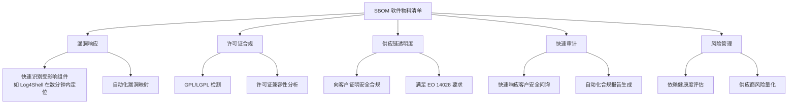
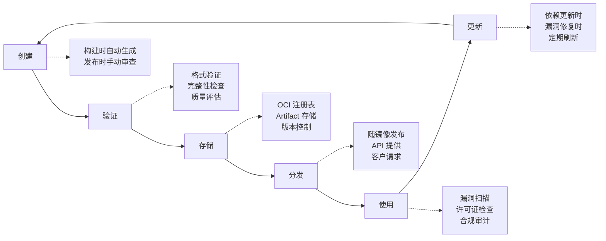
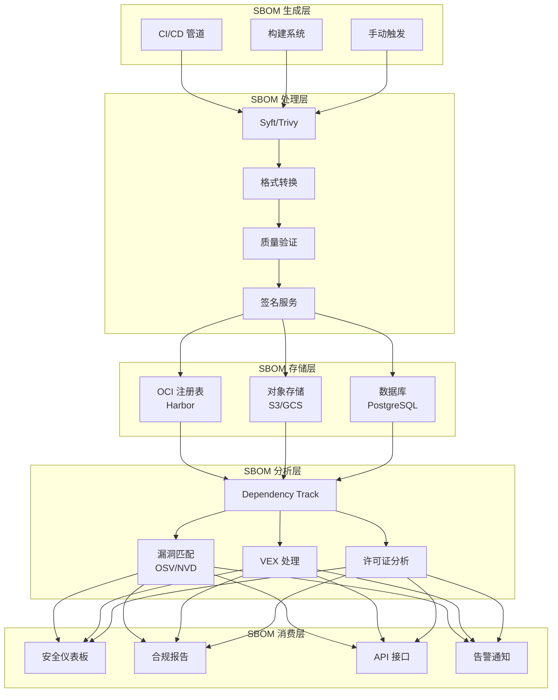

# SBOM 生成与管理 (SBOM Generation and Management)

> 软件物料清单（SBOM）是现代供应链安全的基础，提供软件组成的完整透明度，实现快速漏洞响应和合规性证明。

---

<!-- chunk: 目录 (Table of Contents) -->## 目录 (Table of Contents)

1. [SBOM 基础概念](#1-sbom-基础概念)
2. [SBOM 标准格式对比](#2-sbom-标准格式对比)
3. [Syft CLI 完整指南](#3-syft-cli-完整指南)
4. [[entities/trivy|Trivy]] SBOM 生成](#4-trivy-sbom-生成)
5. [其他 SBOM 生成工具](#5-其他-sbom-生成工具)
6. [SBOM 生命周期管理](#6-sbom-生命周期管理)
7. [CI/CD 集成实践](#7-cicd-集成实践)
8. [SBOM 存储与分发](#8-sbom-存储与分发)
9. [依赖图谱分析](#9-依赖图谱分析)
10. [SBOM 质量评估](#10-sbom-质量评估)
11. [SBOM 自动化工作流](#11-sbom-自动化工作流)
12. [企业级 SBOM 管理平台](#12-企业级-sbom-管理平台)

---

<!-- chunk: 1. SBOM 基础概念 -->## 1. SBOM 基础概念

#<!-- chunk: 1.1 什么是 SBOM -->## 1.1 什么是 SBOM

软件物料清单（Software Bill of Materials, SBOM）是软件组件和依赖关系的正式机器可读清单，类似于制造业中的物料清单（BOM）。

```
SBOM 类比:

制造业 BOM                    软件 SBOM
───────────────               ─────────────────
原材料清单              →     直接依赖列表
零件供应商信息          →     包维护者信息
零件版本/型号           →     包名称和版本
质量认证               →     许可证和合规信息
制造日期               →     构建时间戳
产品规格               →     包哈希/摘要
```

**SBOM 的三个核心问题：**

```
1. 这是什么软件？
   ─ 包名称、版本、生态系统
   ─ 唯一标识符（PURL, CPE）

2. 谁开发/维护它？
   ─ 供应商/作者信息
   ─ 许可证信息

3. 它与其他组件有什么关系？
   ─ 直接依赖
   ─ 传递依赖
   ─ 依赖关系图
```

#<!-- chunk: 1.2 SBOM 的价值 -->## 1.2 SBOM 的价值



#<!-- chunk: 1.3 SBOM 的最小数据要素 -->## 1.3 SBOM 的最小数据要素

根据 NTIA（美国国家电信和信息管理局）定义，最小 SBOM 应包含：

| 数据字段 | 描述 | 示例 |
|---------|------|------|
| 供应商名称 | 创建组件的实体 | Apache Software Foundation |
| 组件名称 | 单元名称 | log4j-core |
| 版本 | 组件版本字符串 | 2.17.1 |
| 其他唯一标识符 | PURL, CPE, SWID | pkg:maven/org.apache.logging.log4j/log4j-core@2.17.1 |
| 依赖关系 | 上游依赖的关系 | DEPENDS_ON log4j-api@2.17.1 |
| SBOM 作者 | 创建 SBOM 的实体 | security@company.com |
| 时间戳 | 创建或最后更新时间 | 2024-01-15T10:30:00Z |

#<!-- chunk: 1.4 PURL (Package URL) 规范 -->## 1.4 PURL (Package URL) 规范

```bash
# PURL 格式: scheme:type/namespace/name@version?qualifiers#subpath

# npm 包
pkg:npm/%40angular/core@14.2.0

# Maven (Java)
pkg:maven/org.springframework/spring-core@6.0.9

# PyPI (Python)
pkg:pypi/django@4.2.7

# Go 模块
pkg:golang/github.com/gin-gonic/gin@v1.9.1

# Alpine Linux 包
pkg:apk/alpine/busybox@1.35.0-r17

# Docker 镜像
pkg:docker/library/nginx@1.25.3

# GitHub 代码库
pkg:github/kubernetes/kubernetes@v1.29.0

# 验证 PURL 格式
pip install packageurl-python
python3 -c "
from packageurl import PackageURL
purl = PackageURL.from_string('pkg:npm/lodash@4.17.21')
print(f'Type: {purl.type}')
print(f'Name: {purl.name}')
print(f'Version: {purl.version}')
"
```

---

<!-- chunk: 2. SBOM 标准格式对比 -->## 2. SBOM 标准格式对比

#<!-- chunk: 2.1 SPDX vs CycloneDX -->## 2.1 SPDX vs CycloneDX

```
格式对比总览:

┌──────────────────────────────────────────────────────────┐
│                    格式比较矩阵                           │
├────────────────┬──────────────────┬─────────────────────┤
│ 特性           │ SPDX             │ CycloneDX           │
├────────────────┼──────────────────┼─────────────────────┤
│ 主导组织       │ Linux Foundation  │ OWASP               │
│ 当前版本       │ SPDX 2.3/3.0     │ CycloneDX 1.5       │
│ 支持格式       │ TV, JSON, YAML   │ XML, JSON, Protobuf │
│ 许可证重点     │ 非常强           │ 适中                │
│ 漏洞关联       │ 有限             │ 强（VEX 支持）      │
│ 服务追踪       │ 有               │ 强（Services 字段） │
│ 工具支持       │ 广泛             │ 广泛                │
│ 工业物联网     │ 有限             │ 强                  │
│ 合规性证明     │ 许可证合规       │ 安全合规            │
│ 推荐使用场景   │ 开源许可证追踪   │ 安全漏洞管理        │
└────────────────┴──────────────────┴─────────────────────┘
```

#<!-- chunk: 2.2 SPDX 格式详解 -->## 2.2 SPDX 格式详解

```json
// SPDX 2.3 JSON 格式示例（简化版）
{
  "SPDXID": "SPDXRef-DOCUMENT",
  "spdxVersion": "SPDX-2.3",
  "creationInfo": {
    "created": "2024-01-15T10:30:00Z",
    "creators": [
      "Tool: syft-0.103.0",
      "Organization: MyCompany"
    ],
    "licenseListVersion": "3.22"
  },
  "name": "myapp-v1.2.3",
  "dataLicense": "CC0-1.0",
  "documentNamespace": "https://spdx.org/spdxdocs/myapp-v1.2.3-abc123",
  
  "packages": [
    {
      "SPDXID": "SPDXRef-Package-gin",
      "name": "github.com/gin-gonic/gin",
      "version": "v1.9.1",
      "supplier": "Organization: gin-gonic",
      "originator": "Organization: gin-gonic",
      "downloadLocation": "https://github.com/gin-gonic/gin",
      "filesAnalyzed": false,
      "externalRefs": [
        {
          "referenceCategory": "PACKAGE-MANAGER",
          "referenceType": "purl",
          "referenceLocator": "pkg:golang/github.com/gin-gonic/gin@v1.9.1"
        }
      ],
      "licenseConcluded": "MIT",
      "licenseDeclared": "MIT",
      "copyrightText": "NOASSERTION",
      "primaryPackagePurpose": "LIBRARY"
    }
  ],
  
  "relationships": [
    {
      "spdxElementId": "SPDXRef-DOCUMENT",
      "relationshipType": "DESCRIBES",
      "relatedSpdxElement": "SPDXRef-Package-myapp"
    },
    {
      "spdxElementId": "SPDXRef-Package-myapp",
      "relationshipType": "DEPENDS_ON",
      "relatedSpdxElement": "SPDXRef-Package-gin"
    }
  ]
}
```

#<!-- chunk: 2.3 CycloneDX 格式详解 -->## 2.3 CycloneDX 格式详解

```json
// CycloneDX 1.5 JSON 格式示例
{
  "bomFormat": "CycloneDX",
  "specVersion": "1.5",
  "serialNumber": "urn:uuid:3e671687-395b-41f5-a30f-a58921a69b79",
  "version": 1,
  "metadata": {
    "timestamp": "2024-01-15T10:30:00Z",
    "tools": [
      {
        "vendor": "Anchore, Inc.",
        "name": "syft",
        "version": "0.103.0"
      }
    ],
    "authors": [
      {
        "name": "Security Team",
        "email": "security@mycompany.com"
      }
    ],
    "component": {
      "type": "container",
      "name": "myapp",
      "version": "1.2.3",
      "purl": "pkg:docker/myorg/myapp@1.2.3"
    }
  },
  
  "components": [
    {
      "type": "library",
      "name": "gin",
      "version": "v1.9.1",
      "purl": "pkg:golang/github.com/gin-gonic/gin@v1.9.1",
      "licenses": [
        {
          "license": {
            "id": "MIT"
          }
        }
      ],
      "hashes": [
        {
          "alg": "SHA-256",
          "content": "9f86d081884c7d659a2feaa0c55ad015a3bf4f1b2b0b822cd15d6c15b0f00a08"
        }
      ],
      "externalReferences": [
        {
          "type": "vcs",
          "url": "https://github.com/gin-gonic/gin"
        }
      ]
    }
  ],
  
  "dependencies": [
    {
      "ref": "pkg:docker/myorg/myapp@1.2.3",
      "dependsOn": [
        "pkg:golang/github.com/gin-gonic/gin@v1.9.1"
      ]
    }
  ],
  
  "vulnerabilities": [
    {
      "id": "CVE-2023-12345",
      "source": {
        "name": "NVD",
        "url": "https://nvd.nist.gov/vuln/detail/CVE-2023-12345"
      },
      "ratings": [
        {
          "source": {"name": "NVD"},
          "score": 9.8,
          "severity": "critical",
          "method": "CVSSv3"
        }
      ],
      "affects": [
        {
          "ref": "pkg:golang/github.com/gin-gonic/gin@v1.9.1"
        }
      ]
    }
  ]
}
```

#<!-- chunk: 2.4 格式选择指南 -->## 2.4 格式选择指南

```
格式选择决策树:

是否需要符合 FDA 医疗设备要求？
├── 是 → 使用 CycloneDX (FDA 偏好)
└── 否 → 继续...

是否主要关注许可证合规？
├── 是 → 使用 SPDX (许可证信息更完整)
└── 否 → 继续...

是否需要漏洞信息（VEX）集成？
├── 是 → 使用 CycloneDX (原生 VEX 支持)
└── 否 → 继续...

是否需要向美国联邦政府机构提交？
├── 是 → 需要 SPDX 或 CycloneDX 均可（EO 14028）
└── 否 → 根据工具链选择

最佳实践建议: 同时生成两种格式！
```

---

<!-- chunk: 3. Syft CLI 完整指南 -->## 3. Syft CLI 完整指南

#<!-- chunk: 3.1 安装与配置 -->## 3.1 安装与配置

```bash
# 安装 Syft - 方式一: 官方脚本
curl -sSfL https://raw.githubusercontent.com/anchore/syft/main/install.sh | \
  sh -s -- -b /usr/local/bin

# 安装 Syft - 方式二: Go 安装
go install github.com/anchore/syft/cmd/syft@latest

# 安装 Syft - 方式三: Homebrew (macOS)
brew install syft

# 安装 Syft - 方式四: 二进制下载
VERSION="v0.103.1"
curl -Lo syft.tar.gz \
  https://github.com/anchore/syft/releases/download/${VERSION}/syft_${VERSION}_linux_amd64.tar.gz
tar -xzf syft.tar.gz
sudo mv syft /usr/local/bin/
chmod +x /usr/local/bin/syft

# 验证安装
syft version
# 输出:
# syft: 0.103.1
# jsonSchemaVersion: 15.0.1
# dbSchemaVersion: 5

# Syft 配置文件
cat > ~/.syft/config.yaml << 'EOF'
# ~/.syft/config.yaml
log:
  level: warn
  
output:
  - format: spdx-json
    file: ""
    
catalogers:
  default-catalogers:
    enabled: true
  package-catalogers:
    enabled: true

# 排除不必要路径
file-metadata:
  digests:
    - sha1
    - sha256
    
exclude:
  - "**/.git/**"
  - "**/node_modules/.cache/**"
  - "**/vendor/**"
EOF
```

#<!-- chunk: 3.2 扫描目标类型 -->## 3.2 扫描目标类型

```bash
# ============ 容器镜像扫描 ============

# 扫描本地 Docker 镜像
syft nginx:latest

# 扫描并输出 SPDX JSON
syft nginx:latest -o spdx-json

# 扫描并输出 CycloneDX JSON
syft nginx:latest -o cyclonedx-json

# 扫描 OCI 镜像布局（不需要 Docker daemon）
syft oci-layout:./my-image-dir

# 扫描 Docker tar 归档
syft docker-archive:./my-image.tar

# 扫描私有仓库镜像（需要认证）
docker login myregistry.company.com
syft myregistry.company.com/myapp:v1.0.0

# ============ 文件系统扫描 ============

# 扫描当前目录
syft .

# 扫描特定目录
syft dir:/path/to/project

# 扫描包含 Go 模块的项目
syft dir:/path/to/go-project

# 扫描 Python 项目
syft dir:/path/to/python-project

# ============ 制品文件扫描 ============

# 扫描 JAR 文件
syft file:./app.jar

# 扫描 ZIP 包
syft file:./dependencies.zip

# 扫描 RPM 包
syft file:./package.rpm

# 扫描 Debian 包
syft file:./package.deb
```

#<!-- chunk: 3.3 输出格式详解 -->## 3.3 输出格式详解

```bash
# Syft 支持的所有输出格式

# 1. 表格格式（人类可读）
syft myapp:latest -o table
# 输出示例:
# NAME                    VERSION      TYPE
# alpine-baselayout       3.4.3-r1     apk
# alpine-keys             2.4-r1       apk
# libc-utils              0.7.5-r4     apk
# openssl                 3.1.4-r1     apk

# 2. JSON 格式（Syft 原生）
syft myapp:latest -o json > sbom.syft.json

# 3. SPDX 标签值格式（最简洁）
syft myapp:latest -o spdx > sbom.spdx

# 4. SPDX JSON 格式
syft myapp:latest -o spdx-json > sbom.spdx.json

# 5. SPDX RDF 格式
syft myapp:latest -o spdx-rdf > sbom.spdx.rdf

# 6. CycloneDX XML 格式
syft myapp:latest -o cyclonedx > sbom.cyclonedx.xml

# 7. CycloneDX JSON 格式
syft myapp:latest -o cyclonedx-json > sbom.cyclonedx.json

# 8. CycloneDX Protobuf 格式
syft myapp:latest -o cyclonedx-protobuf > sbom.cyclonedx.pb

# 9. 同时输出多种格式
syft myapp:latest \
  -o spdx-json=sbom.spdx.json \
  -o cyclonedx-json=sbom.cdx.json \
  -o table

# 10. 模板格式（自定义输出）
syft myapp:latest -o template -t custom-template.tmpl
```

#<!-- chunk: 3.4 高级扫描选项 -->## 3.4 高级扫描选项

```bash
# 深度扫描配置

# 1. 控制扫描深度
# 仅扫描已安装的包（不扫描未安装文件）
syft myapp:latest --scope squashed

# 扫描所有层（包括已删除的文件，仅镜像有效）
syft myapp:latest --scope all-layers

# 2. 包含/排除特定目录
syft dir:/myproject \
  --exclude "**/test/**" \
  --exclude "**/docs/**" \
  --exclude "**/*.test.go"

# 3. 配置目录搜索策略
syft dir:/myproject \
  --platform linux/amd64

# 4. 输出所有组件（包括开发依赖）
syft dir:/myproject --catalogers "+dev" 2>/dev/null || \
syft dir:/myproject  # 默认包含所有依赖

# 5. 详细日志
syft myapp:latest -v

# 6. 使用私有证书的仓库
syft registry://myregistry.internal/myapp:latest \
  --registry-cert=/path/to/ca.crt

# 7. 设置输出元数据
syft myapp:latest \
  -o spdx-json \
  --metadata="document-name=myapp-v1.0.0" \
  --metadata="document-namespace=https://mycompany.com/sbom/myapp-v1.0.0"
```

#<!-- chunk: 3.5 Syft 结果解析 -->## 3.5 Syft 结果解析

```python
#!/usr/bin/env python3
"""Syft SBOM 结果解析和统计"""

import json
from collections import defaultdict
from typing import List, Dict

def analyze_syft_sbom(sbom_file: str) -> None:
    """分析 Syft 生成的 SBOM"""
    with open(sbom_file) as f:
        sbom = json.load(f)
    
    artifacts = sbom.get("artifacts", [])
    
    # 按类型统计
    type_counts = defaultdict(int)
    for artifact in artifacts:
        type_counts[artifact.get("type", "unknown")] += 1
    
    # 按许可证统计
    license_counts = defaultdict(int)
    for artifact in artifacts:
        licenses = artifact.get("licenses", [])
        if licenses:
            for lic in licenses:
                license_id = lic.get("value", "UNKNOWN")
                license_counts[license_id] += 1
        else:
            license_counts["NO_LICENSE"] += 1
    
    # 统计无 PURL 的包（标识符完整性）
    no_purl = [a["name"] for a in artifacts 
               if not any(r.get("type") == "purl" 
                         for r in a.get("cpes", []))]
    
    print(f"\n{'='*60}")
    print(f"SBOM 分析报告: {sbom_file}")
    print(f"{'='*60}")
    print(f"\n总组件数: {len(artifacts)}")
    
    print(f"\n按类型分布:")
    for pkg_type, count in sorted(type_counts.items(), key=lambda x: -x[1]):
        print(f"  {pkg_type:30s} {count:5d}")
    
    print(f"\n主要许可证 (Top 10):")
    for lic, count in sorted(license_counts.items(), key=lambda x: -x[1])[:10]:
        print(f"  {lic:40s} {count:5d}")
    
    # 识别需要关注的许可证
    copyleft = ["GPL-2.0", "GPL-3.0", "LGPL-2.1", "LGPL-3.0", "AGPL-3.0"]
    copyleft_found = {k: v for k, v in license_counts.items() 
                      if any(c in k for c in copyleft)}
    if copyleft_found:
        print(f"\n⚠️  发现 Copyleft 许可证（需法律审查）:")
        for lic, count in copyleft_found.items():
            print(f"  {lic}: {count} 个组件")
    
    print(f"\n完整性检查:")
    print(f"  有 PURL 标识的组件: {len(artifacts) - len(no_purl)}/{len(artifacts)}")

if __name__ == "__main__":
    import sys
    analyze_syft_sbom(sys.argv[1] if len(sys.argv) > 1 else "sbom.syft.json")
```

---

<!-- chunk: 4. Trivy SBOM 生成 -->## 4. Trivy SBOM 生成

#<!-- chunk: 4.1 Trivy 安装与配置 -->## 4.1 Trivy 安装与配置

```bash
# 安装 Trivy - macOS
brew install aquasecurity/trivy/trivy

# 安装 Trivy - Linux
sudo apt-get install -y wget apt-transport-https gnupg lsb-release
wget -qO - https://aquasecurity.github.io/trivy-repo/deb/public.key | \
  gpg --dearmor | sudo tee /usr/share/keyrings/trivy.gpg > /dev/null
echo "deb [signed-by=/usr/share/keyrings/trivy.gpg] https://aquasecurity.github.io/trivy-repo/deb \
  $(lsb_release -sc) main" | sudo tee -a /etc/apt/sources.list.d/trivy.list
sudo apt-get update && sudo apt-get install -y trivy

# 安装 Trivy - 二进制
VERSION="v0.49.1"
curl -Lo trivy.tar.gz \
  https://github.com/aquasecurity/trivy/releases/download/${VERSION}/trivy_${VERSION}_Linux-64bit.tar.gz
tar -xzf trivy.tar.gz trivy
sudo mv trivy /usr/local/bin/

# 更新漏洞数据库
trivy image --download-db-only

# 验证安装
trivy version
```

#<!-- chunk: 4.2 Trivy SBOM 生成命令 -->## 4.2 Trivy SBOM 生成命令

```bash
# ============ 镜像 SBOM 生成 ============

# 生成 CycloneDX SBOM
trivy image \
  --format cyclonedx \
  --output sbom.cdx.json \
  nginx:latest

# 生成 SPDX SBOM
trivy image \
  --format spdx-json \
  --output sbom.spdx.json \
  nginx:latest

# 仅生成 SBOM（不扫描漏洞）
trivy image \
  --scanners sbom \
  --format cyclonedx \
  nginx:latest

# ============ 文件系统 SBOM 生成 ============

# 扫描当前目录
trivy fs \
  --format cyclonedx \
  --output fs-sbom.cdx.json \
  .

# 扫描特定语言的项目
trivy fs \
  --scanners vuln,config,secret,license \
  --format spdx-json \
  --output project-sbom.spdx.json \
  /path/to/project

# ============ Git 仓库 SBOM 生成 ============

# 扫描远程 Git 仓库
trivy repo \
  --format cyclonedx \
  --output repo-sbom.cdx.json \
  https://github.com/myorg/myapp

# 扫描本地仓库特定分支
trivy repo \
  --branch main \
  --format cyclonedx \
  .

# ============ OCI 制品 SBOM 生成 ============

# 生成并附加 SBOM 到镜像
trivy image \
  --format cyclonedx \
  --output sbom.cdx.json \
  myregistry.io/myapp:v1.0.0

# 提取已嵌入的 SBOM
trivy image \
  --extract-oci-sbom \
  --output extracted-sbom.json \
  myregistry.io/myapp:v1.0.0
```

#<!-- chunk: 4.3 Trivy 综合扫描（SBOM + 漏洞） -->## 4.3 Trivy 综合扫描（SBOM + 漏洞）

```bash
# 同时生成 SBOM 并扫描漏洞

# 完整的镜像分析
trivy image \
  --format table \
  --scanners vuln,config,secret,license \
  --severity CRITICAL,HIGH \
  myapp:latest

# 输出结构化 JSON（包含 SBOM 和漏洞）
trivy image \
  --format json \
  --output full-analysis.json \
  --scanners vuln \
  myapp:latest

# 基于 SBOM 进行漏洞扫描（两步法）
# 步骤1: 生成 SBOM
syft myapp:latest -o cyclonedx-json > sbom.cdx.json

# 步骤2: 基于 SBOM 扫描漏洞
trivy sbom \
  --severity CRITICAL,HIGH \
  --format table \
  sbom.cdx.json

# 步骤2替代: 使用 Grype
grype sbom:sbom.cdx.json

# CI 中的完整流程
trivy image \
  --format sarif \
  --output trivy-results.sarif \
  --severity CRITICAL,HIGH \
  --exit-code 1 \
  myapp:latest
```

#<!-- chunk: 4.4 Trivy 配置文件 -->## 4.4 Trivy 配置文件

```yaml
# trivy.yaml - Trivy 配置文件
---
# 扫描选项
scan:
  scanners:
    - vuln
    - config
    - secret
    - license
  
  # 跳过目录
  skip-dirs:
    - "**/.git"
    - "**/node_modules"
    - "**/vendor"
  
  # 跳过文件
  skip-files:
    - "**/*.test.go"

# 漏洞过滤
severity:
  - CRITICAL
  - HIGH

# 忽略特定 CVE（VEX 替代方案）
ignorefile: .trivyignore

# 输出配置
format: cyclonedx
output: sbom.cdx.json

# 缓存配置
cache:
  dir: ~/.cache/trivy
  clear: false

# 数据库
db:
  skip-update: false
  download-java-db: true

# Java 相关
java-db:
  repository:
    - ghcr.io/aquasecurity/trivy-java-db

# 许可证扫描
license:
  full: true
  ignored:
    - MIT
    - Apache-2.0
  forbidden:
    - GPL-3.0
    - AGPL-3.0

# 报告配置  
report:
  exit-code: 1
  exit-on-eol: false
```

```bash
# .trivyignore 文件示例（漏洞豁免）
# 格式: CVE-ID [到期日] [原因]

# 误报 - 我们的版本未受影响
CVE-2023-12345

# 已接受风险 - 无可用修复，低优先级
CVE-2022-98765 until:2024-06-30

# 特定包的漏洞豁免
CVE-2021-44228 openssl@1.1.1t-r4 # 不适用于此使用场景
```

---

<!-- chunk: 5. 其他 SBOM 生成工具 -->## 5. 其他 SBOM 生成工具

#<!-- chunk: 5.1 工具生态系统对比 -->## 5.1 工具生态系统对比

```
SBOM 工具生态系统:

┌──────────────────────────────────────────────────────┐
│ 工具         │ 主要能力          │ 最适场景          │
├──────────────┼───────────────────┼───────────────────┤
│ Syft         │ 生成，多格式      │ 通用 SBOM 生成    │
│ Trivy        │ 生成+扫描         │ 综合安全分析      │
│ CycloneDX CLI│ 生成，CycloneDX专 │ CycloneDX 专项    │
│ SPDX Tools   │ 生成，验证，转换  │ SPDX 工作流       │
│ cdxgen       │ 生成，多语言      │ 多语言项目        │
│ Tern         │ 容器层分析        │ 容器透明度        │
│ Dependency-  │ 生成，扫描        │ Java/JavaScript   │
│ Track        │                   │ 项目管理          │
│ OSS Review   │ 生成，许可证审查  │ 开源合规          │
│ Toolkit      │                   │                   │
└──────────────┴───────────────────┴───────────────────┘
```

#<!-- chunk: 5.2 CycloneDX CLI -->## 5.2 CycloneDX CLI

```bash
# 安装 CycloneDX CLI
npm install -g @cyclonedx/cyclonedx-npm

# 为 Node.js 项目生成 SBOM
cdx-npm \
  --output-format JSON \
  --output-file sbom.cdx.json \
  --package-lock-only

# 从 package-lock.json 生成
cdx-npm \
  --package-lock-only \
  --output-format JSON \
  --output-file sbom.cdx.json

# Maven (Java)
pip install cyclonedx-bom
cyclonedx-py --requirements requirements.txt -o sbom.cdx.json

# Gradle
./gradlew cyclonedxBom

# 验证 CycloneDX SBOM
npm install -g @cyclonedx/cyclonedx-library
cyclonedx validate sbom.cdx.json --spec-version 1.5
```

#<!-- chunk: 5.3 cdxgen -->## 5.3 cdxgen

```bash
# 安装 cdxgen - 支持40+语言/框架
npm install -g @cyclonedx/cdxgen

# Go 项目
cdxgen -t go -o sbom.cdx.json /path/to/go/project

# Java Maven 项目
cdxgen -t maven -o sbom.cdx.json /path/to/java/project

# Python 项目
cdxgen -t python -o sbom.cdx.json /path/to/python/project

# Rust 项目
cdxgen -t rust -o sbom.cdx.json /path/to/rust/project

# 多语言项目（自动检测）
cdxgen -o sbom.cdx.json /path/to/project

# 容器镜像
cdxgen -t docker -o sbom.cdx.json nginx:latest

# Kubernetes 部署文件
cdxgen -t k8s -o sbom.cdx.json /path/to/k8s/manifests

# 输出详细信息（包含层次结构）
cdxgen -t go \
  --include-formulation \
  -o sbom-with-build.cdx.json \
  /path/to/project
```

#<!-- chunk: 5.4 SBOM 格式转换 -->## 5.4 SBOM 格式转换

```bash
# SPDX Tools - SBOM 格式转换
pip install spdx-tools

# SPDX TV 转 JSON
pyspdxtools convert \
  --input sbom.spdx \
  --output sbom.spdx.json

# SPDX JSON 转 RDF
pyspdxtools convert \
  --input sbom.spdx.json \
  --output sbom.spdx.rdf

# 验证 SPDX 文件
pyspdxtools validate sbom.spdx.json

# 使用 CycloneDX Utilities 转换
# CycloneDX JSON 转 XML
cyclonedx convert \
  --input sbom.cdx.json \
  --output sbom.cdx.xml

# SPDX 转 CycloneDX（通过 Syft）
syft convert sbom.spdx.json -o cyclonedx-json > sbom.cdx.json

# CycloneDX 转 SPDX（通过 Syft）
syft convert sbom.cdx.json -o spdx-json > sbom.spdx.json
```

---

<!-- chunk: 6. SBOM 生命周期管理 -->## 6. SBOM 生命周期管理

#<!-- chunk: 6.1 SBOM 生命周期概览 -->## 6.1 SBOM 生命周期概览



#<!-- chunk: 6.2 SBOM 版本管理策略 -->## 6.2 SBOM 版本管理策略

```bash
# SBOM 版本命名约定
# 格式: {product}-{version}-{build_date}-{commit_sha}.{format}.{extension}

# 示例:
# myapp-v1.2.3-20240115-abc1234.spdx.json
# myapp-v1.2.3-20240115-abc1234.cdx.json

# SBOM 存储目录结构
sbom-storage/
├── by-version/
│   ├── v1.2.0/
│   │   ├── myapp-v1.2.0.spdx.json
│   │   └── myapp-v1.2.0.cdx.json
│   └── v1.2.1/
│       ├── myapp-v1.2.1.spdx.json
│       └── myapp-v1.2.1.cdx.json
├── by-image-digest/
│   └── sha256-abc123.../
│       ├── sbom.spdx.json
│       └── sbom.cdx.json
└── latest/
    ├── myapp.spdx.json  -> ../by-version/v1.2.1/myapp-v1.2.1.spdx.json
    └── myapp.cdx.json   -> ../by-version/v1.2.1/myapp-v1.2.1.cdx.json

# 自动化存储脚本
#!/bin/bash
store_sbom() {
  local IMAGE="$1"
  local SBOM_FILE="$2"
  local FORMAT="$3"  # spdx-json or cyclonedx-json
  
  DIGEST=$(docker inspect --format='{{index .RepoDigests 0}}' "$IMAGE" | \
    cut -d@ -f2 | tr ':' '-')
  VERSION=$(docker inspect --format='{{index .Config.Labels "version"}}' "$IMAGE")
  DATE=$(date +%Y%m%d)
  
  DEST_DIR="sbom-storage/by-digest/${DIGEST}"
  mkdir -p "$DEST_DIR"
  
  EXT=$([ "$FORMAT" = "spdx-json" ] && echo "spdx.json" || echo "cdx.json")
  cp "$SBOM_FILE" "$DEST_DIR/sbom.${EXT}"
  
  echo "SBOM stored: $DEST_DIR/sbom.${EXT}"
}
```

#<!-- chunk: 6.3 SBOM 完整性保护 -->## 6.3 SBOM 完整性保护

```bash
# SBOM 签名和验证

# 方法1: 使用 Cosign 签名 SBOM
# 生成 SBOM
syft myapp:latest -o cyclonedx-json > sbom.cdx.json

# 签名 SBOM 文件
cosign sign-blob \
  --bundle sbom.cdx.json.bundle \
  sbom.cdx.json

# 验证 SBOM 签名
cosign verify-blob \
  --bundle sbom.cdx.json.bundle \
  --certificate-identity="https://github.com/myorg/myapp/.github/workflows/release.yml@refs/tags/v1.0.0" \
  --certificate-oidc-issuer="https://token.actions.githubusercontent.com" \
  sbom.cdx.json

# 方法2: 将 SBOM 附加到镜像
cosign attach sbom \
  --sbom sbom.cdx.json \
  --type cyclonedx \
  ghcr.io/myorg/myapp:v1.0.0

# 下载并验证附加的 SBOM
cosign download sbom ghcr.io/myorg/myapp:v1.0.0 > sbom-from-registry.json

# 方法3: Cosign 证明（最安全）
cosign attest \
  --predicate sbom.cdx.json \
  --type cyclonedx \
  ghcr.io/myorg/myapp:v1.0.0

# 验证证明
cosign verify-attestation \
  --type cyclonedx \
  --certificate-identity="..." \
  --certificate-oidc-issuer="..." \
  ghcr.io/myorg/myapp:v1.0.0

# 方法4: GPG 签名（传统方式）
gpg --armor --detach-sign sbom.cdx.json
# 生成 sbom.cdx.json.asc

gpg --verify sbom.cdx.json.asc sbom.cdx.json
```

#<!-- chunk: 6.4 SBOM 差异分析 -->## 6.4 SBOM 差异分析

```python
#!/usr/bin/env python3
"""SBOM 差异分析工具 - 比较两个版本的组件变化"""

import json
import sys
from dataclasses import dataclass
from typing import Dict, List, Set, Optional

@dataclass
class Component:
    name: str
    version: str
    purl: str
    
    def __hash__(self):
        return hash(self.purl or f"{self.name}@{self.version}")
    
    def __eq__(self, other):
        return self.purl == other.purl if self.purl and other.purl else \
               (self.name == other.name and self.version == other.version)

def parse_cyclonedx(sbom_file: str) -> Dict[str, Component]:
    """解析 CycloneDX SBOM"""
    with open(sbom_file) as f:
        sbom = json.load(f)
    
    components = {}
    for comp in sbom.get("components", []):
        purl = comp.get("purl", "")
        name = comp.get("name", "")
        version = comp.get("version", "")
        c = Component(name=name, version=version, purl=purl)
        components[purl or f"{name}@{version}"] = c
    
    return components

def diff_sboms(old_file: str, new_file: str) -> None:
    """比较两个 SBOM 的差异"""
    old_components = parse_cyclonedx(old_file)
    new_components = parse_cyclonedx(new_file)
    
    old_keys = set(old_components.keys())
    new_keys = set(new_components.keys())
    
    added = new_keys - old_keys
    removed = old_keys - new_keys
    
    # 检测版本变更（同名但版本不同）
    old_by_name = {c.name: c for c in old_components.values()}
    new_by_name = {c.name: c for c in new_components.values()}
    
    upgraded = {}
    downgraded = {}
    
    for name in set(old_by_name.keys()) & set(new_by_name.keys()):
        old_ver = old_by_name[name].version
        new_ver = new_by_name[name].version
        if old_ver != new_ver:
            key = f"{name}: {old_ver} → {new_ver}"
            # 简单比较（完整版本比较需要语义化版本库）
            upgraded[name] = (old_ver, new_ver)
    
    print(f"\n{'='*60}")
    print(f"SBOM 差异分析报告")
    print(f"{'='*60}")
    print(f"比较: {old_file} → {new_file}")
    print(f"\n摘要:")
    print(f"  总组件数变化: {len(old_keys)} → {len(new_keys)}")
    print(f"  新增组件: {len(added)}")
    print(f"  移除组件: {len(removed)}")
    print(f"  版本变更: {len(upgraded)}")
    
    if added:
        print(f"\n✅ 新增组件 ({len(added)}):")
        for key in sorted(added)[:20]:
            comp = new_components[key]
            print(f"  + {comp.name}@{comp.version}")
    
    if removed:
        print(f"\n❌ 移除组件 ({len(removed)}):")
        for key in sorted(removed)[:20]:
            comp = old_components[key]
            print(f"  - {comp.name}@{comp.version}")
    
    if upgraded:
        print(f"\n🔄 版本变更 ({len(upgraded)}):")
        for name, (old_ver, new_ver) in sorted(upgraded.items())[:20]:
            print(f"  ~ {name}: {old_ver} → {new_ver}")

if __name__ == "__main__":
    if len(sys.argv) != 3:
        print("Usage: diff_sboms.py old-sbom.cdx.json new-sbom.cdx.json")
        sys.exit(1)
    diff_sboms(sys.argv[1], sys.argv[2])
```

---

<!-- chunk: 7. CI/CD 集成实践 -->## 7. CI/CD 集成实践

#<!-- chunk: 7.1 GitHub Actions SBOM 工作流 -->## 7.1 GitHub Actions SBOM 工作流

```yaml
# .github/workflows/sbom-generation.yml
name: SBOM Generation and Management

on:
  push:
    branches: [main]
    tags: ['v*']
  pull_request:
    branches: [main]

permissions:
  contents: read
  packages: write
  id-token: write

jobs:
  generate-sbom:
    runs-on: ubuntu-latest
    outputs:
      sbom-spdx: ${{ steps.upload-sbom.outputs.spdx-artifact }}
      sbom-cdx: ${{ steps.upload-sbom.outputs.cdx-artifact }}
    
    steps:
      - name: Checkout code
        uses: actions/checkout@b4ffde65f46336ab88eb53be808477a3936bae11
      
      # 方法1: 使用 Anchore SBOM Action（推荐）
      - name: Generate SBOM with Syft
        uses: anchore/sbom-action@78fc58e266e87a38d4194b2137a3d4e9baf7e6ef
        id: sbom-syft
        with:
          format: spdx-json
          artifact-name: sbom-${{ github.sha }}.spdx.json
          output-file: sbom.spdx.json
      
      # 同时生成 CycloneDX 格式
      - name: Generate CycloneDX SBOM
        uses: anchore/sbom-action@78fc58e266e87a38d4194b2137a3d4e9baf7e6ef
        with:
          format: cyclonedx-json
          artifact-name: sbom-${{ github.sha }}.cdx.json
          output-file: sbom.cdx.json
      
      # SBOM 质量检查
      - name: Validate SBOM
        run: |
          # 检查 SBOM 不为空
          COMPONENTS=$(cat sbom.cdx.json | jq '.components | length')
          echo "Found $COMPONENTS components in SBOM"
          if [ "$COMPONENTS" -lt 1 ]; then
            echo "ERROR: Empty SBOM generated!"
            exit 1
          fi
          
          # 检查 SBOM 格式有效性
          cat sbom.cdx.json | jq 'has("bomFormat") and has("specVersion") and has("components")' | \
            grep -q "true" || (echo "ERROR: Invalid CycloneDX format!" && exit 1)
          
          echo "✅ SBOM validation passed ($COMPONENTS components)"
      
      # 上传 SBOM 作为工作流制品
      - name: Upload SBOM artifacts
        id: upload-sbom
        uses: actions/upload-artifact@c7d193f32edcb7bfad88892161225aeda64e9392
        with:
          name: sbom-files-${{ github.sha }}
          path: |
            sbom.spdx.json
            sbom.cdx.json
          retention-days: 90
      
      # 发布时附加 SBOM 到 Release
      - name: Attach SBOM to release
        if: startsWith(github.ref, 'refs/tags/')
        uses: softprops/action-gh-release@9d7c94cfd0a1f3ed45544c887983e9fa900f0564
        with:
          files: |
            sbom.spdx.json
            sbom.cdx.json

  # SBOM 驱动的漏洞扫描
  scan-from-sbom:
    runs-on: ubuntu-latest
    needs: generate-sbom
    steps:
      - name: Download SBOM
        uses: actions/download-artifact@7a1cd3216ca9260cd8022db641d960b1db4d1be4
        with:
          name: sbom-files-${{ github.sha }}
      
      - name: Scan SBOM for vulnerabilities
        uses: anchore/scan-action@3343887d815d7b07465f6fdcd395bd66508d486a
        id: scan
        with:
          sbom: sbom.cdx.json
          fail-build: true
          severity-cutoff: high
          
      - name: Upload vulnerability report
        uses: github/codeql-action/upload-sarif@cdcdbb579706841c47f7063dda365e292e5cad7a
        if: always()
        with:
          sarif_file: ${{ steps.scan.outputs.sarif }}
          category: "sbom-vulnerability-scan"
```

#<!-- chunk: 7.2 GitLab CI SBOM 配置 -->## 7.2 GitLab CI SBOM 配置

```yaml
# .gitlab-ci.yml SBOM 生成配置
stages:
  - build
  - sbom
  - scan
  - publish

variables:
  IMAGE_TAG: ${CI_REGISTRY_IMAGE}:${CI_COMMIT_TAG:-${CI_COMMIT_SHORT_SHA}}

generate-sbom:
  stage: sbom
  image: anchore/syft:latest
  script:
    # 生成两种格式的 SBOM
    - syft ${IMAGE_TAG} -o spdx-json > sbom-${CI_COMMIT_SHA}.spdx.json
    - syft ${IMAGE_TAG} -o cyclonedx-json > sbom-${CI_COMMIT_SHA}.cdx.json
    
    # 验证 SBOM
    - |
      COMPONENT_COUNT=$(jq '.components | length' sbom-${CI_COMMIT_SHA}.cdx.json)
      echo "Generated SBOM with $COMPONENT_COUNT components"
      [ "$COMPONENT_COUNT" -gt 0 ] || exit 1
  
  artifacts:
    name: "sbom-${CI_COMMIT_SHA}"
    paths:
      - "sbom-*.spdx.json"
      - "sbom-*.cdx.json"
    expire_in: 1 year
    reports:
      cyclonedx: sbom-${CI_COMMIT_SHA}.cdx.json

scan-sbom:
  stage: scan
  image: anchore/grype:latest
  dependencies:
    - generate-sbom
  script:
    - |
      grype sbom:sbom-${CI_COMMIT_SHA}.cdx.json \
        --fail-on high \
        -o sarif > vulnerability-report.sarif
  
  artifacts:
    reports:
      sast: vulnerability-report.sarif
    when: always
```

#<!-- chunk: 7.3 Tekton Pipelines SBOM 任务 -->## 7.3 Tekton Pipelines SBOM 任务

```yaml
# tekton-sbom-task.yaml
apiVersion: tekton.dev/v1
kind: Task
metadata:
  name: generate-sbom
  labels:
    app.kubernetes.io/version: "0.1"
  annotations:
    tekton.dev/categories: Security
    tekton.dev/pipelines.minVersion: "0.41.0"
    tekton.dev/tags: sbom, security, supply-chain
spec:
  description: |
    Generate SBOM for a container image using Syft.
    Produces both SPDX and CycloneDX format SBOMs.
  
  params:
    - name: IMAGE
      description: Container image reference (with digest)
      type: string
    - name: OUTPUT_DIR
      description: Directory to write SBOM files
      default: "/workspace/sbom"
    - name: SYFT_VERSION
      description: Syft version to use
      default: "v0.103.1"
  
  workspaces:
    - name: output
      description: Workspace to store generated SBOMs
  
  results:
    - name: SPDX_SBOM
      description: Path to SPDX SBOM file
    - name: CDX_SBOM
      description: Path to CycloneDX SBOM file
    - name: COMPONENT_COUNT
      description: Number of components found
  
  steps:
    - name: install-syft
      image: alpine:3.19
      script: |
        #!/bin/sh
        set -e
        
        apk add --no-cache curl
        
        curl -sSfL https://raw.githubusercontent.com/anchore/syft/main/install.sh | \
          sh -s -- -b /workspace/tools $(params.SYFT_VERSION)
        
        /workspace/tools/syft version
    
    - name: generate-sbom
      image: alpine:3.19
      script: |
        #!/bin/sh
        set -e
        
        IMAGE="$(params.IMAGE)"
        OUTPUT="$(workspaces.output.path)"
        
        mkdir -p "${OUTPUT}"
        
        echo "Generating SPDX SBOM for ${IMAGE}..."
        /workspace/tools/syft "${IMAGE}" \
          -o spdx-json \
          > "${OUTPUT}/sbom.spdx.json"
        
        echo "Generating CycloneDX SBOM for ${IMAGE}..."
        /workspace/tools/syft "${IMAGE}" \
          -o cyclonedx-json \
          > "${OUTPUT}/sbom.cdx.json"
        
        # 统计组件数量
        COUNT=$(cat "${OUTPUT}/sbom.cdx.json" | \
          grep -o '"name"' | wc -l)
        
        echo -n "${OUTPUT}/sbom.spdx.json" > $(results.SPDX_SBOM.path)
        echo -n "${OUTPUT}/sbom.cdx.json" > $(results.CDX_SBOM.path)
        echo -n "${COUNT}" > $(results.COMPONENT_COUNT.path)
        
        echo "Generated SBOM with ${COUNT} components"
    
    - name: validate-sbom
      image: python:3.11-alpine
      script: |
        #!/bin/sh
        set -e
        
        pip install -q spdx-tools
        
        # 验证 SPDX SBOM
        OUTPUT="$(workspaces.output.path)"
        pyspdxtools validate "${OUTPUT}/sbom.spdx.json"
        echo "✅ SPDX SBOM validation passed"
```

---

<!-- chunk: 8. SBOM 存储与分发 -->## 8. SBOM 存储与分发

#<!-- chunk: 8.1 OCI 注册表存储 -->## 8.1 OCI 注册表存储

```bash
# 使用 OCI 注册表存储 SBOM

# 方法1: Cosign 附加 SBOM 到镜像
IMAGE="ghcr.io/myorg/myapp:v1.0.0"
SBOM_FILE="sbom.cdx.json"

# 附加 SBOM
cosign attach sbom \
  --sbom "$SBOM_FILE" \
  --type cyclonedx \
  "$IMAGE"

# 验证 SBOM 附加
cosign download sbom "$IMAGE"

# 方法2: ORAS 工具存储 SBOM 为 OCI 制品
# 安装 ORAS
brew install oras

# 推送 SBOM 作为 OCI 制品
oras push \
  ghcr.io/myorg/myapp:v1.0.0-sbom \
  --artifact-type "application/vnd.cyclonedx+json" \
  sbom.cdx.json:application/vnd.cyclonedx+json

# 下载 SBOM
oras pull \
  ghcr.io/myorg/myapp:v1.0.0-sbom \
  -o ./downloaded-sbom/

# 方法3: Harbor 镜像仓库原生 SBOM 支持
# Harbor 2.x 支持 OCI 制品，可存储 SBOM
# 通过 Harbor UI 或 API 关联 SBOM 到镜像
```

#<!-- chunk: 8.2 Dependency Track 平台 -->## 8.2 Dependency Track 平台

```bash
# Dependency Track - 开源 SBOM 管理平台
# 安装（使用 Docker Compose）

cat > dependency-track-compose.yaml << 'EOF'
version: '3.9'

volumes:
  dependency-track:

services:
  dtrack-apiserver:
    image: dependencytrack/apiserver:4.10.1
    environment:
      ALPINE_SECRET_KEY: "very-secret-key-change-in-production"
      ALPINE_DATABASE_MODE: "internal"
    volumes:
      - 'dependency-track:/data'
    ports:
      - "8081:8080"
    restart: unless-stopped
    
  dtrack-frontend:
    image: dependencytrack/frontend:4.10.1
    depends_on:
      - dtrack-apiserver
    environment:
      API_BASE_URL: "http://localhost:8081"
    ports:
      - "8080:8080"
    restart: unless-stopped
EOF

docker-compose -f dependency-track-compose.yaml up -d

# 上传 SBOM 到 Dependency Track
# 获取 API Key 后（在 UI 中生成）
DT_API_URL="http://localhost:8081"
DT_API_KEY="your-api-key"
PROJECT_UUID="your-project-uuid"

# 创建项目
curl -X PUT "$DT_API_URL/api/v1/project" \
  -H "X-Api-Key: $DT_API_KEY" \
  -H "Content-Type: application/json" \
  -d '{
    "name": "myapp",
    "version": "1.0.0",
    "classifier": "APPLICATION",
    "active": true
  }'

# 上传 SBOM
curl -X POST "$DT_API_URL/api/v1/bom" \
  -H "X-Api-Key: $DT_API_KEY" \
  -F "project=${PROJECT_UUID}" \
  -F "bom=@sbom.cdx.json"

# 查看分析结果
curl -s "$DT_API_URL/api/v1/vulnerability/project/${PROJECT_UUID}" \
  -H "X-Api-Key: $DT_API_KEY" | \
  jq '[.[] | select(.severity == "CRITICAL")] | length'
```

#<!-- chunk: 8.3 S3 SBOM 归档策略 -->## 8.3 S3 SBOM 归档策略

```bash
#!/bin/bash
# sbom-archival.sh - SBOM S3 归档管理

S3_BUCKET="s3://company-sbom-archive"
KMS_KEY_ID="arn:aws:kms:us-east-1:123456789:key/mrk-abc123"

# 上传 SBOM 到 S3（加密存储）
upload_sbom() {
  local IMAGE_NAME="$1"
  local IMAGE_VERSION="$2"
  local SBOM_FILE="$3"
  local FORMAT="$4"  # spdx or cdx
  
  local DATE=$(date +%Y/%m/%d)
  local S3_PATH="${S3_BUCKET}/${IMAGE_NAME}/${DATE}/${IMAGE_VERSION}"
  
  # 上传并加密
  aws s3 cp "$SBOM_FILE" \
    "${S3_PATH}/sbom.${FORMAT}.json" \
    --sse aws:kms \
    --sse-kms-key-id "$KMS_KEY_ID" \
    --metadata "image=${IMAGE_NAME},version=${IMAGE_VERSION},date=$(date -u +%Y-%m-%dT%H:%M:%SZ)"
  
  echo "Uploaded SBOM to: ${S3_PATH}/sbom.${FORMAT}.json"
  
  # 更新 latest 索引
  echo "${IMAGE_VERSION}" | aws s3 cp - \
    "${S3_BUCKET}/${IMAGE_NAME}/latest" \
    --content-type "text/plain"
}

# 检索 SBOM
retrieve_sbom() {
  local IMAGE_NAME="$1"
  local VERSION="${2:-latest}"
  local FORMAT="${3:-cdx}"
  
  if [ "$VERSION" = "latest" ]; then
    VERSION=$(aws s3 cp "s3://company-sbom-archive/${IMAGE_NAME}/latest" -)
  fi
  
  # 列出该版本的所有日期目录，取最新的
  LATEST_DATE=$(aws s3 ls "${S3_BUCKET}/${IMAGE_NAME}/" | \
    grep -E "[0-9]{4}/[0-9]{2}/[0-9]{2}/" | \
    sort -r | head -1 | awk '{print $2}')
  
  aws s3 cp \
    "${S3_BUCKET}/${IMAGE_NAME}/${LATEST_DATE}${VERSION}/sbom.${FORMAT}.json" \
    "sbom-${IMAGE_NAME}-${VERSION}.${FORMAT}.json"
  
  echo "Retrieved SBOM for ${IMAGE_NAME}:${VERSION}"
}

# S3 生命周期策略配置
configure_lifecycle() {
  cat > sbom-lifecycle-policy.json << 'EOF'
{
  "Rules": [
    {
      "ID": "SBOM-Tiering",
      "Status": "Enabled",
      "Transitions": [
        {
          "Days": 90,
          "StorageClass": "STANDARD_IA"
        },
        {
          "Days": 365,
          "StorageClass": "GLACIER"
        }
      ],
      "Expiration": {
        "Days": 2555
      }
    }
  ]
}
EOF
  
  aws s3api put-bucket-lifecycle-configuration \
    --bucket "company-sbom-archive" \
    --lifecycle-configuration file://sbom-lifecycle-policy.json
}
```

---

<!-- chunk: 9. 依赖图谱分析 -->## 9. 依赖图谱分析

#<!-- chunk: 9.1 依赖图谱可视化 -->## 9.1 依赖图谱可视化

```python
#!/usr/bin/env python3
"""依赖图谱分析和可视化"""

import json
import sys
from collections import defaultdict, deque
from typing import Dict, List, Set, Tuple

class DependencyGraph:
    """软件依赖图谱分析器"""
    
    def __init__(self, sbom_file: str):
        with open(sbom_file) as f:
            self.sbom = json.load(f)
        self.components = self._index_components()
        self.graph = self._build_graph()
        self.reverse_graph = self._build_reverse_graph()
    
    def _index_components(self) -> Dict[str, dict]:
        """索引所有组件"""
        index = {}
        for comp in self.sbom.get("components", []):
            purl = comp.get("purl", "")
            if purl:
                index[purl] = comp
        return index
    
    def _build_graph(self) -> Dict[str, Set[str]]:
        """构建依赖图（A depends on B）"""
        graph = defaultdict(set)
        for dep in self.sbom.get("dependencies", []):
            ref = dep.get("ref", "")
            for d in dep.get("dependsOn", []):
                graph[ref].add(d)
        return dict(graph)
    
    def _build_reverse_graph(self) -> Dict[str, Set[str]]:
        """构建反向依赖图（B is required by A）"""
        reverse = defaultdict(set)
        for source, targets in self.graph.items():
            for target in targets:
                reverse[target].add(source)
        return dict(reverse)
    
    def get_dependency_depth(self, component_purl: str) -> int:
        """获取组件在依赖树中的最大深度"""
        visited = set()
        max_depth = [0]
        
        def dfs(node, depth):
            if node in visited:
                return
            visited.add(node)
            max_depth[0] = max(max_depth[0], depth)
            for dep in self.graph.get(node, []):
                dfs(dep, depth + 1)
        
        dfs(component_purl, 0)
        return max_depth[0]
    
    def get_impacted_by(self, vulnerable_purl: str) -> List[str]:
        """获取受漏洞影响的上游组件（谁依赖了这个包）"""
        impacted = set()
        queue = deque([vulnerable_purl])
        
        while queue:
            current = queue.popleft()
            dependents = self.reverse_graph.get(current, set())
            for dep in dependents:
                if dep not in impacted:
                    impacted.add(dep)
                    queue.append(dep)
        
        return list(impacted)
    
    def get_critical_paths(self, 
                           source_purl: str, 
                           target_purl: str) -> List[List[str]]:
        """找出从 source 到 target 的所有依赖路径"""
        all_paths = []
        
        def find_paths(current, target, path, visited):
            if current == target:
                all_paths.append(path[:])
                return
            if current in visited:
                return
            visited.add(current)
            path.append(current)
            
            for next_node in self.graph.get(current, []):
                find_paths(next_node, target, path, visited)
            
            path.pop()
            visited.discard(current)
        
        find_paths(source_purl, target_purl, [], set())
        return all_paths
    
    def analyze_risk_profile(self) -> dict:
        """分析整体风险画像"""
        total = len(self.components)
        
        # 计算每个组件的传递依赖数量
        transitive_counts = {}
        for purl in self.components:
            deps = set()
            queue = deque([purl])
            while queue:
                current = queue.popleft()
                for dep in self.graph.get(current, []):
                    if dep not in deps:
                        deps.add(dep)
                        queue.append(dep)
            transitive_counts[purl] = len(deps)
        
        # 找出最高风险节点（最多被依赖的）
        most_critical = sorted(
            self.reverse_graph.items(),
            key=lambda x: len(x[1]),
            reverse=True
        )[:10]
        
        return {
            "total_components": total,
            "total_dependencies": sum(len(deps) for deps in self.graph.values()),
            "most_critical_components": [
                {
                    "purl": purl,
                    "name": self.components.get(purl, {}).get("name", "unknown"),
                    "dependent_count": len(deps)
                }
                for purl, deps in most_critical
                if purl in self.components
            ]
        }
    
    def export_dot_graph(self, output_file: str, max_nodes: int = 50):
        """导出 Graphviz DOT 格式图"""
        lines = ["digraph DependencyGraph {"]
        lines.append("  rankdir=LR;")
        lines.append("  node [shape=box];")
        
        # 取前 N 个节点
        nodes = list(self.components.keys())[:max_nodes]
        
        for purl in nodes:
            comp = self.components[purl]
            name = comp.get("name", purl)
            version = comp.get("version", "")
            node_id = purl.replace(":", "_").replace("/", "_").replace("@", "_")
            lines.append(f'  {node_id} [label="{name}\\n{version}"];')
        
        for source in nodes:
            src_id = source.replace(":", "_").replace("/", "_").replace("@", "_")
            for target in self.graph.get(source, []):
                if target in nodes:
                    tgt_id = target.replace(":", "_").replace("/", "_").replace("@", "_")
                    lines.append(f"  {src_id} -> {tgt_id};")
        
        lines.append("}")
        
        with open(output_file, 'w') as f:
            f.write("\n".join(lines))
        
        print(f"DOT graph exported to: {output_file}")
        print(f"Visualize with: dot -Tsvg {output_file} -o dependency-graph.svg")


# 使用示例
if __name__ == "__main__":
    dg = DependencyGraph("sbom.cdx.json")
    
    # 分析风险画像
    risk = dg.analyze_risk_profile()
    print(f"\n依赖图谱分析:")
    print(f"  总组件数: {risk['total_components']}")
    print(f"  总依赖关系: {risk['total_dependencies']}")
    
    print(f"\n最关键组件（被最多包依赖）:")
    for comp in risk["most_critical_components"][:5]:
        print(f"  {comp['name']}: {comp['dependent_count']} 个组件依赖它")
    
    # 导出图形
    dg.export_dot_graph("dependency-graph.dot")
```

---

<!-- chunk: 10. SBOM 质量评估 -->## 10. SBOM 质量评估

#<!-- chunk: 10.1 SBOM 质量指标 -->## 10.1 SBOM 质量指标

```python
#!/usr/bin/env python3
"""SBOM 质量评估框架 - 基于 NTIA SBOM 最小元素要求"""

import json
from dataclasses import dataclass, field
from typing import List, Dict

@dataclass
class QualityScore:
    """SBOM 质量评估结果"""
    total_components: int = 0
    components_with_purl: int = 0
    components_with_version: int = 0
    components_with_name: int = 0
    components_with_license: int = 0
    components_with_hash: int = 0
    has_metadata: bool = False
    has_timestamp: bool = False
    has_author: bool = False
    has_relationships: bool = False
    format_valid: bool = False
    
    issues: List[str] = field(default_factory=list)
    
    @property
    def purl_coverage(self) -> float:
        if self.total_components == 0:
            return 0
        return self.components_with_purl / self.total_components * 100
    
    @property
    def overall_score(self) -> float:
        """计算总体质量分数 (0-100)"""
        score = 0
        
        # 格式有效性 (20分)
        if self.format_valid:
            score += 20
        
        # PURL 覆盖率 (25分)
        score += self.purl_coverage * 0.25
        
        # 版本完整性 (15分)
        if self.total_components > 0:
            score += (self.components_with_version / self.total_components) * 15
        
        # 元数据完整性 (20分)
        if self.has_metadata:
            score += 7
        if self.has_timestamp:
            score += 7
        if self.has_author:
            score += 6
        
        # 关系信息 (10分)
        if self.has_relationships:
            score += 10
        
        # 许可证信息 (10分)
        if self.total_components > 0:
            score += (self.components_with_license / self.total_components) * 10
        
        return min(score, 100)
    
    @property
    def grade(self) -> str:
        """质量等级"""
        s = self.overall_score
        if s >= 90:
            return "A"
        elif s >= 80:
            return "B"
        elif s >= 70:
            return "C"
        elif s >= 60:
            return "D"
        else:
            return "F"


def evaluate_cyclonedx_sbom(sbom_file: str) -> QualityScore:
    """评估 CycloneDX SBOM 质量"""
    with open(sbom_file) as f:
        sbom = json.load(f)
    
    score = QualityScore()
    
    # 格式验证
    required_fields = ["bomFormat", "specVersion", "components"]
    score.format_valid = all(f in sbom for f in required_fields)
    if not score.format_valid:
        score.issues.append("Missing required CycloneDX fields")
    
    # 元数据检查
    metadata = sbom.get("metadata", {})
    score.has_metadata = bool(metadata)
    score.has_timestamp = bool(metadata.get("timestamp"))
    score.has_author = bool(metadata.get("authors") or metadata.get("tools"))
    
    if not score.has_timestamp:
        score.issues.append("Missing timestamp in metadata")
    if not score.has_author:
        score.issues.append("Missing author/tool information in metadata")
    
    # 组件分析
    components = sbom.get("components", [])
    score.total_components = len(components)
    
    for comp in components:
        if comp.get("purl"):
            score.components_with_purl += 1
        else:
            score.issues.append(f"Missing PURL for component: {comp.get('name', 'unknown')}")
        
        if comp.get("version"):
            score.components_with_version += 1
        
        if comp.get("name"):
            score.components_with_name += 1
        
        if comp.get("licenses"):
            score.components_with_license += 1
        
        if comp.get("hashes"):
            score.components_with_hash += 1
    
    # 关系检查
    score.has_relationships = bool(sbom.get("dependencies"))
    if not score.has_relationships:
        score.issues.append("Missing dependency relationships")
    
    return score


def print_quality_report(sbom_file: str) -> None:
    """打印 SBOM 质量报告"""
    score = evaluate_cyclonedx_sbom(sbom_file)
    
    print(f"\n{'='*60}")
    print(f"SBOM 质量评估报告")
    print(f"{'='*60}")
    print(f"文件: {sbom_file}")
    print(f"\n总体评分: {score.overall_score:.1f}/100 (等级: {score.grade})")
    
    print(f"\n详细指标:")
    print(f"  格式有效性:       {'✅' if score.format_valid else '❌'}")
    print(f"  元数据完整性:     {'✅' if score.has_metadata else '❌'}")
    print(f"  时间戳:           {'✅' if score.has_timestamp else '❌'}")
    print(f"  作者/工具信息:    {'✅' if score.has_author else '❌'}")
    print(f"  依赖关系:         {'✅' if score.has_relationships else '❌'}")
    print(f"  总组件数:         {score.total_components}")
    print(f"  PURL 覆盖率:      {score.purl_coverage:.1f}% ({score.components_with_purl}/{score.total_components})")
    print(f"  版本完整性:       {score.components_with_version}/{score.total_components}")
    print(f"  许可证覆盖率:     {score.components_with_license}/{score.total_components}")
    print(f"  哈希覆盖率:       {score.components_with_hash}/{score.total_components}")
    
    if score.issues:
        print(f"\n发现的问题 ({len(score.issues)}):")
        for issue in score.issues[:10]:
            print(f"  ⚠️  {issue}")


if __name__ == "__main__":
    import sys
    print_quality_report(sys.argv[1] if len(sys.argv) > 1 else "sbom.cdx.json")
```

---

<!-- chunk: 11. SBOM 自动化工作流 -->## 11. SBOM 自动化工作流

#<!-- chunk: 11.1 完整自动化流程 -->## 11.1 完整自动化流程

```bash
#!/bin/bash
# full-sbom-workflow.sh
# 完整的 SBOM 生成、签名、存储、分析工作流

set -euo pipefail

IMAGE="${1:?Usage: $0 <image> <version>}"
VERSION="${2:?Usage: $0 <image> <version>}"
REGISTRY="${REGISTRY:-ghcr.io/myorg}"
FULL_IMAGE="${REGISTRY}/${IMAGE}:${VERSION}"

echo "🚀 SBOM 自动化工作流"
echo "================================"
echo "镜像: ${FULL_IMAGE}"
echo ""

# ============ 阶段1: 生成 SBOM ============
echo "📄 阶段1: 生成 SBOM..."

# 生成 CycloneDX SBOM
syft "${FULL_IMAGE}" \
  -o cyclonedx-json \
  > "sbom-${IMAGE}-${VERSION}.cdx.json"

# 生成 SPDX SBOM
syft "${FULL_IMAGE}" \
  -o spdx-json \
  > "sbom-${IMAGE}-${VERSION}.spdx.json"

echo "✅ SBOM 生成完成"

# ============ 阶段2: 质量验证 ============
echo ""
echo "🔍 阶段2: SBOM 质量验证..."

COMPONENT_COUNT=$(jq '.components | length' "sbom-${IMAGE}-${VERSION}.cdx.json")
echo "  组件数量: ${COMPONENT_COUNT}"

if [ "${COMPONENT_COUNT}" -lt 1 ]; then
  echo "❌ SBOM 为空！中止流程。"
  exit 1
fi

PURL_COUNT=$(jq '[.components[] | select(.purl != null)] | length' "sbom-${IMAGE}-${VERSION}.cdx.json")
PURL_RATE=$(echo "scale=1; ${PURL_COUNT} * 100 / ${COMPONENT_COUNT}" | bc)
echo "  PURL 覆盖率: ${PURL_RATE}%"

if (( $(echo "${PURL_RATE} < 50" | bc -l) )); then
  echo "⚠️  PURL 覆盖率低于 50%，SBOM 质量可能不足"
fi

echo "✅ 质量验证通过"

# ============ 阶段3: 漏洞扫描 ============
echo ""
echo "🛡️ 阶段3: 漏洞扫描..."

VULN_REPORT="vuln-${IMAGE}-${VERSION}.json"

grype "sbom:sbom-${IMAGE}-${VERSION}.cdx.json" \
  -o json \
  > "${VULN_REPORT}" 2>/dev/null || true

CRITICAL_COUNT=$(jq '[.matches[] | select(.vulnerability.severity == "Critical")] | length' "${VULN_REPORT}" 2>/dev/null || echo "0")
HIGH_COUNT=$(jq '[.matches[] | select(.vulnerability.severity == "High")] | length' "${VULN_REPORT}" 2>/dev/null || echo "0")

echo "  严重漏洞: ${CRITICAL_COUNT}"
echo "  高危漏洞: ${HIGH_COUNT}"

if [ "${CRITICAL_COUNT}" -gt 0 ]; then
  echo "❌ 发现 ${CRITICAL_COUNT} 个严重漏洞！"
  jq -r '.matches[] | select(.vulnerability.severity == "Critical") | "  - \(.vulnerability.id): \(.artifact.name)@\(.artifact.version)"' "${VULN_REPORT}"
  exit 1
fi

echo "✅ 漏洞扫描通过"

# ============ 阶段4: 签名 ============
echo ""
echo "✍️ 阶段4: SBOM 签名..."

if command -v cosign &>/dev/null; then
  # 签名 SBOM 文件
  cosign sign-blob \
    --bundle "sbom-${IMAGE}-${VERSION}.cdx.json.bundle" \
    "sbom-${IMAGE}-${VERSION}.cdx.json" 2>/dev/null || \
    echo "⚠️  Cosign 签名跳过（未配置 OIDC）"
  
  # 附加 SBOM 到镜像
  cosign attach sbom \
    --sbom "sbom-${IMAGE}-${VERSION}.cdx.json" \
    --type cyclonedx \
    "${FULL_IMAGE}" 2>/dev/null || \
    echo "⚠️  SBOM 附加跳过"
fi

echo "✅ 签名阶段完成"

# ============ 阶段5: 存储 ============
echo ""
echo "💾 阶段5: 存储 SBOM..."

# 本地存档
ARCHIVE_DIR="sbom-archive/${IMAGE}/${VERSION}"
mkdir -p "${ARCHIVE_DIR}"
cp "sbom-${IMAGE}-${VERSION}.cdx.json" "${ARCHIVE_DIR}/sbom.cdx.json"
cp "sbom-${IMAGE}-${VERSION}.spdx.json" "${ARCHIVE_DIR}/sbom.spdx.json"
cp "${VULN_REPORT}" "${ARCHIVE_DIR}/vulnerabilities.json"

# 生成摘要文件
cat > "${ARCHIVE_DIR}/summary.json" << EOF
{
  "image": "${FULL_IMAGE}",
  "version": "${VERSION}",
  "generated_at": "$(date -u +%Y-%m-%dT%H:%M:%SZ)",
  "component_count": ${COMPONENT_COUNT},
  "purl_coverage": "${PURL_RATE}%",
  "vulnerabilities": {
    "critical": ${CRITICAL_COUNT},
    "high": ${HIGH_COUNT}
  }
}
EOF

echo "✅ 存储完成: ${ARCHIVE_DIR}"

# ============ 完成 ============
echo ""
echo "================================"
echo "🎉 SBOM 工作流完成！"
echo ""
echo "生成的文件:"
ls -lh "${ARCHIVE_DIR}/"
```

---

<!-- chunk: 12. 企业级 SBOM 管理平台 -->## 12. 企业级 SBOM 管理平台

#<!-- chunk: 12.1 平台架构设计 -->## 12.1 平台架构设计



#<!-- chunk: 12.2 SBOM API 服务 -->## 12.2 SBOM API 服务

```python
#!/usr/bin/env python3
"""SBOM 管理 API 服务（FastAPI 实现）"""

from fastapi import FastAPI, UploadFile, File, HTTPException, Depends
from fastapi.middleware.cors import CORSMiddleware
import json
import hashlib
import uuid
from datetime import datetime
from typing import List, Optional
import boto3

app = FastAPI(
    title="SBOM Management API",
    description="企业级 SBOM 生命周期管理服务",
    version="1.0.0"
)

# ============ SBOM 存储操作 ============

@app.post("/api/v1/sbom/upload")
async def upload_sbom(
    sbom_file: UploadFile = File(...),
    product_name: str = None,
    product_version: str = None,
    format: str = "cyclonedx"
):
    """上传 SBOM 文件"""
    content = await sbom_file.read()
    
    # 解析并验证 SBOM
    try:
        sbom_data = json.loads(content)
    except json.JSONDecodeError:
        raise HTTPException(status_code=400, detail="Invalid JSON format")
    
    # 生成 SBOM ID 和哈希
    sbom_id = str(uuid.uuid4())
    sbom_hash = hashlib.sha256(content).hexdigest()
    
    # 提取元数据
    if format == "cyclonedx":
        metadata = sbom_data.get("metadata", {})
        component_count = len(sbom_data.get("components", []))
        spec_version = sbom_data.get("specVersion", "unknown")
    else:  # spdx
        metadata = {}
        component_count = len(sbom_data.get("packages", []))
        spec_version = sbom_data.get("spdxVersion", "unknown")
    
    # 存储 SBOM（实际实现需连接数据库/S3）
    sbom_record = {
        "id": sbom_id,
        "product_name": product_name,
        "product_version": product_version,
        "format": format,
        "spec_version": spec_version,
        "sha256": sbom_hash,
        "component_count": component_count,
        "uploaded_at": datetime.utcnow().isoformat() + "Z",
        "file_size": len(content)
    }
    
    return {
        "sbom_id": sbom_id,
        "message": "SBOM uploaded successfully",
        "metadata": sbom_record
    }


@app.get("/api/v1/sbom/{sbom_id}")
async def get_sbom(sbom_id: str):
    """获取 SBOM 详情"""
    # 实际实现需要从数据库查询
    return {"sbom_id": sbom_id, "status": "found"}


@app.get("/api/v1/sbom/{sbom_id}/vulnerabilities")
async def get_sbom_vulnerabilities(
    sbom_id: str,
    severity: Optional[str] = None
):
    """获取 SBOM 关联的漏洞信息"""
    # 实际实现需要查询漏洞数据库
    return {
        "sbom_id": sbom_id,
        "vulnerabilities": [],
        "summary": {
            "critical": 0,
            "high": 0,
            "medium": 0,
            "low": 0
        }
    }


@app.get("/api/v1/sbom/{sbom_id}/licenses")
async def get_sbom_licenses(sbom_id: str):
    """获取 SBOM 中的许可证汇总"""
    return {
        "sbom_id": sbom_id,
        "licenses": {},
        "copyleft_detected": False
    }


@app.post("/api/v1/sbom/diff")
async def diff_sboms(
    sbom_id_old: str,
    sbom_id_new: str
):
    """比较两个 SBOM 的差异"""
    return {
        "added_components": [],
        "removed_components": [],
        "version_changed": [],
        "summary": {
            "total_added": 0,
            "total_removed": 0,
            "total_changed": 0
        }
    }


@app.get("/api/v1/products/{product}/sbom/latest")
async def get_latest_sbom(product: str):
    """获取产品最新版本的 SBOM"""
    return {"product": product, "latest_sbom_id": None}


if __name__ == "__main__":
    import uvicorn
    uvicorn.run(app, host="0.0.0.0", port=8080)
```

---

<!-- chunk: 参考资料 -->## 参考资料

| 资源 | 类型 | 链接 |
|------|------|------|
| Syft 文档 | 工具文档 | https://github.com/anchore/syft |
| Trivy 文档 | 工具文档 | https://aquasecurity.github.io/trivy |
| SPDX 规范 | 标准 | https://spdx.github.io/spdx-spec |
| CycloneDX 规范 | 标准 | https://cyclonedx.org/specification |
| NTIA SBOM | 政府指南 | https://www.ntia.gov/SBOM |
| CISA SBOM | 政府指南 | https://www.cisa.gov/sbom |
| Dependency Track | 开源平台 | https://dependencytrack.org |
| PURL 规范 | 标准 | https://github.com/package-url/purl-spec |
| OSV 漏洞数据库 | 数据源 | https://osv.dev |

---

*本文档涵盖 SBOM 生成与管理的完整技术栈，从工具选择到企业级平台架构。*
*版本: 1.0 | 最后更新: 2024年*

---

<!-- chunk: Obsidian 相关文档 -->## Obsidian 相关文档

- domain-05-security-compliance KUDIG Database — Global MOC
- [[domain-05-security-compliance/README|[[Domain 39: 供应链安全 (Supply Chain Security)|Domain 39: 供应链安全 (Supply Chain Security)]] Security]])]]
- [[domain-05-security-compliance/00-open-source-projects-index|Domain-39 供应链安全 — 开源项目索引]]
- 供应链安全概述 (Supply Chain Security Overview)
- 供应链安全成熟度模型 (Supply Chain Security Maturity Model)
- SBOM 漏洞分析与治理 (SBOM Vulnerability Analysis and Governance)
- SLSA 级别与实施 (SLSA Levels and Implementation)
- GitHub Actions SLSA 构建 (GitHub Actions SLSA Build)
- Sigstore 与 Cosign 签名 (Sigstore and Cosign Signing)
- Fulcio 与 Rekor 透明日志 (Fulcio and Rekor Transparency Logs)
- Policy Controller 镜像验证 (Policy Controller Image Verification...
- 合规自动化与审计 (Compliance Automation and Audit)

## See Also

- 01-supply-chain-security-overview
- 02-supply-chain-maturity-model
- 04-sbom-vulnerability-analysis
- 05-slsa-levels-implementation

- [[domain-05-security-compliance/README|返回目录]]