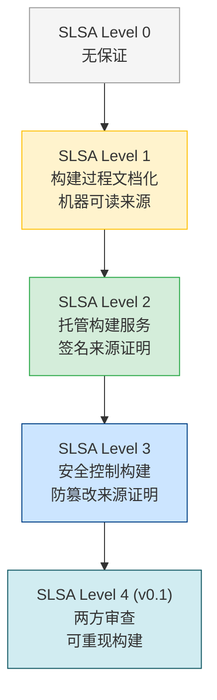
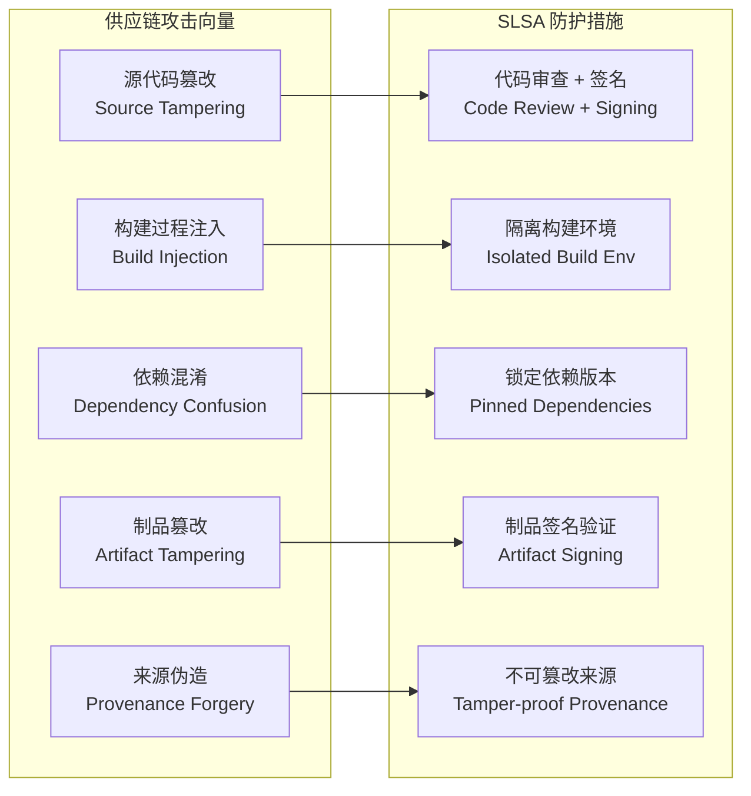
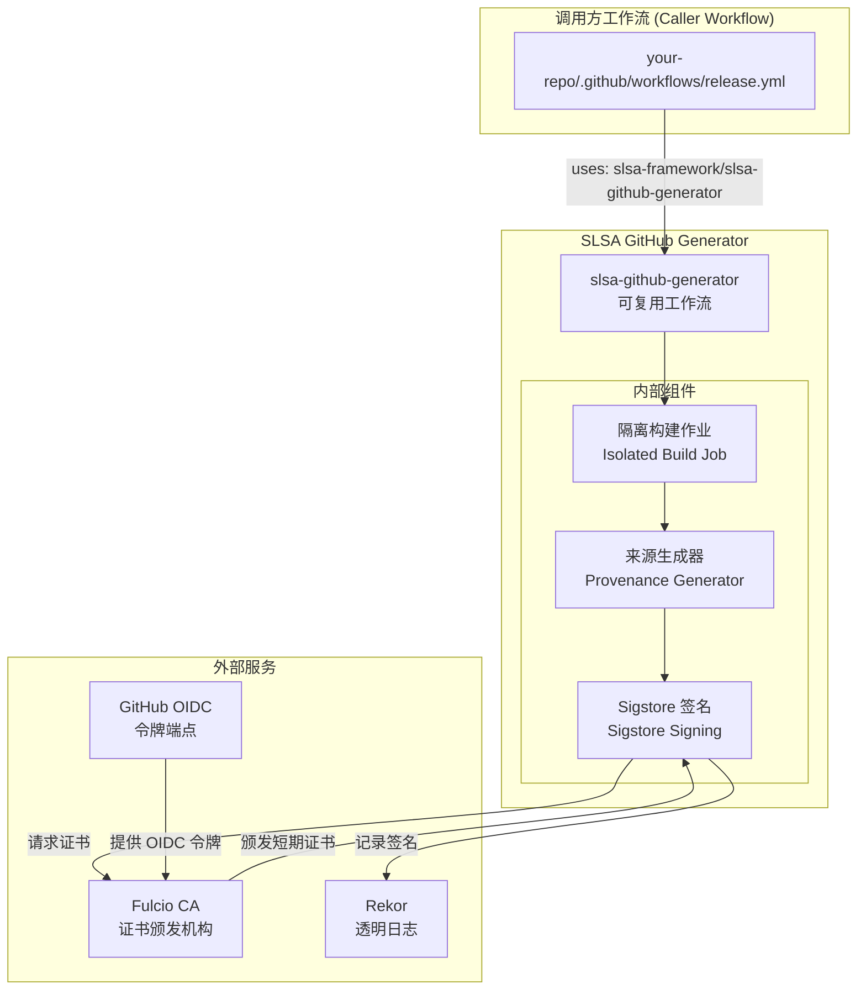
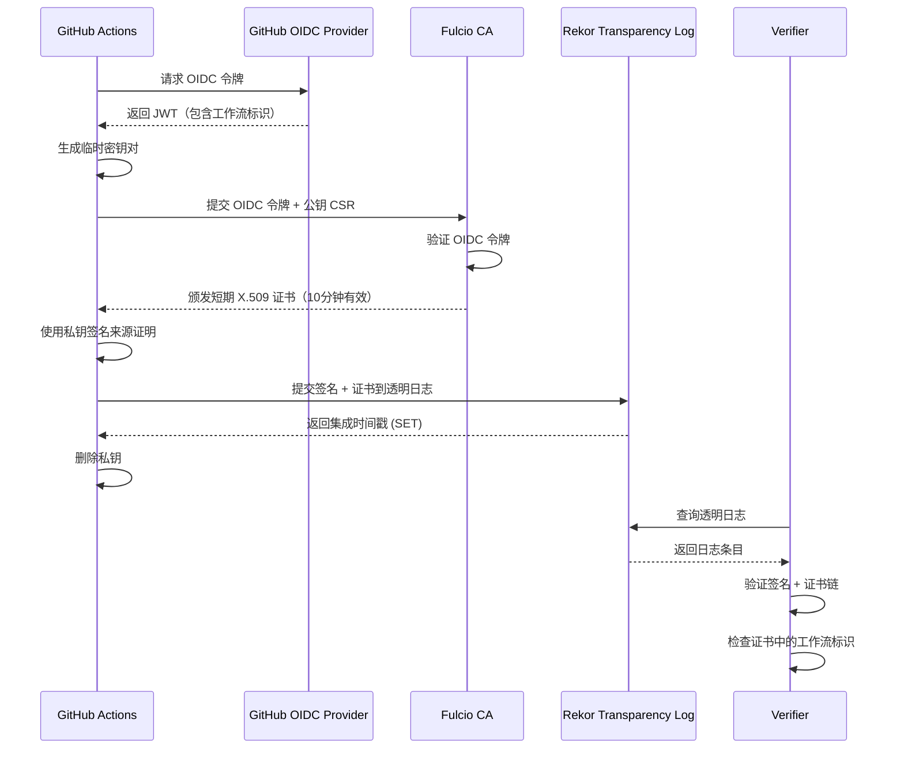
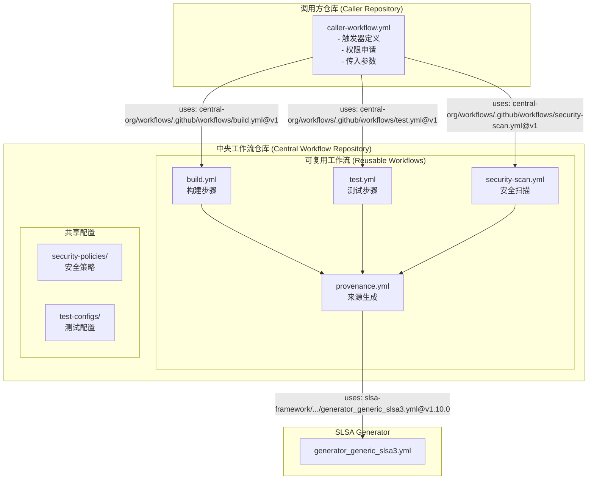
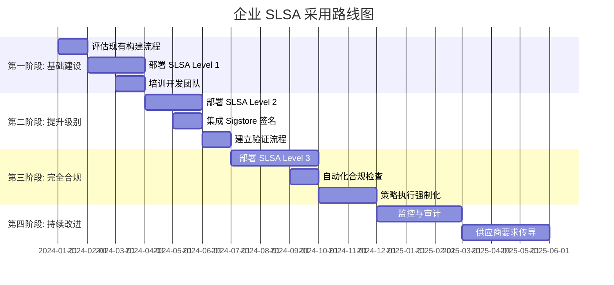

---
tags:
- security
- supply-chain
intent_queries:
- github-actions-slsa-build是什么？
- github-actions-slsa-build的使用方法
- github-actions-slsa-build的最佳实践

tier: peripheral---
title: GitHub Actions SLSA 构建 (GitHub Actions SLSA Build)
description: '<!-- chunk: 概述 (Overview)' -->## 概述 (Overview)'
category: supply-chain-security
tags:
- k8s
- supply-chain
- security
- sbom
- slsa
- [[Prometheus|prometheus]]
- grafana
- docker
- job
- webhook
last_updated: 2026-05
difficulty: advanced
reading_level: advanced
audience:
- 安全工程师
- SRE
- 架构师
estimated_read_time: 5min
intent_queries:
- GitHub Actions SLSA 构建 (GitHub Actions SLSA Build) 是什么
- 如何 GitHub Actions SLSA 构建 (GitHub Actions SLSA Build)
- [[Kubernetes|Kubernetes]] 39 supply chain security 最佳实践
trigger_keywords:
- GitHub
- Actions
- SLSA
- 构建
- GitHub
- Actions
- SLSA
- Build
authors:
- name: KUDIG Team
  role: contributor
k8s_versions:
- '1.28'
- '1.29'
- '1.30'
- '1.31'
- '1.32'
---

# GitHub Actions SLSA 构建 (GitHub Actions SLSA Build)

<!-- chunk: 概述 (Overview) -->## 概述 (Overview)

SLSA（Supply-chain Levels for Software Artifacts）是由 Google 提出、OpenSSF 维护的软件供应链安全框架。GitHub Actions 作为全球最流行的 CI/CD 平台，提供了原生的 SLSA 构建支持，通过 SLSA GitHub Generator 项目实现可验证的构建来源证明（Provenance）生成。

本文档深入介绍如何在 GitHub Actions 中实现 SLSA Level 1～Level 3 的构建，包括工作流配置、来源证明生成、证明签名，以及可复用工作流的最佳实践。

---

<!-- chunk: 1. SLSA 框架基础 (SLSA Framework Fundamentals) -->## 1. SLSA 框架基础 (SLSA Framework Fundamentals)

## 1.1 SLSA 级别定义 (SLSA Level Definitions)



| SLSA 级别 | 要求 | GitHub Actions 实现 |
|-----------|------|---------------------|
| Level 1 | 构建过程文档化，生成来源信息 | 任意工作流 + 来源生成脚本 |
| Level 2 | 使用托管构建服务，来源签名 | GitHub Actions + SLSA Generator |
| Level 3 | 防篡改构建环境，强制来源验证 | SLSA GitHub Generator 可复用工作流 |

## 1.2 SLSA 威胁模型 (SLSA Threat Model)



## 1.3 SLSA 来源证明格式 (SLSA Provenance Format)

SLSA 来源证明遵循 [in-toto Attestation Framework](https://github.com/in-toto/attestation) 格式：

```json
{
  "_type": "https://in-toto.io/Statement/v0.1",
  "subject": [
    {
      "name": "my-artifact.tar.gz",
      "digest": {
        "sha256": "abc123..."
      }
    }
  ],
  "predicateType": "https://slsa.dev/provenance/v0.2",
  "predicate": {
    "builder": {
      "id": "https://github.com/slsa-framework/slsa-github-generator/.github/workflows/generator_generic_slsa3.yml@refs/tags/v1.9.0"
    },
    "buildType": "https://github.com/slsa-framework/slsa-github-generator/generic@v1",
    "invocation": {
      "configSource": {
        "uri": "git+https://github.com/your-org/your-repo@refs/heads/main",
        "digest": {
          "sha1": "def456..."
        },
        "entryPoint": ".github/workflows/release.yml"
      },
      "parameters": {},
      "environment": {
        "github_actor": "github-actions",
        "github_actor_id": "12345",
        "github_event_name": "push",
        "github_ref": "refs/tags/v1.0.0",
        "github_ref_type": "tag",
        "github_repository_id": "67890",
        "github_repository_owner": "your-org",
        "github_repository_owner_id": "11111",
        "github_run_attempt": "1",
        "github_run_id": "99999",
        "github_run_number": "42",
        "github_sha1": "ghi789..."
      }
    },
    "buildConfig": {
      "version": 1,
      "steps": []
    },
    "metadata": {
      "buildInvocationID": "your-org/your-repo/actions/runs/99999/attempts/1",
      "buildStartedOn": "2024-01-15T10:00:00Z",
      "buildFinishedOn": "2024-01-15T10:05:00Z",
      "completeness": {
        "parameters": true,
        "environment": true,
        "materials": false
      },
      "reproducible": false
    },
    "materials": [
      {
        "uri": "git+https://github.com/your-org/your-repo@refs/tags/v1.0.0",
        "digest": {
          "sha1": "ghi789..."
        }
      }
    ]
  }
}
```

---

<!-- chunk: 2. SLSA GitHub Generator 项目 (SLSA GitHub Generator Project) -->## 2. SLSA GitHub Generator 项目 (SLSA GitHub Generator Project)

## 2.1 项目架构 (Project Architecture)



## 2.2 可复用工作流类型 (Reusable Workflow Types)

SLSA GitHub Generator 提供多种预构建工作流：

| 工作流 | 用途 | SLSA 级别 |
|--------|------|-----------|
| `generator_generic_slsa3.yml` | 通用制品（二进制、归档文件） | Level 3 |
| `generator_container_slsa3.yml` | 容器镜像 | Level 3 |
| `builder_go_slsa3.yml` | Go 语言构建器 | Level 3 |
| `builder_nodejs_slsa3.yml` | Node.js 构建器 | Level 3 |
| `builder_maven_slsa3.yml` | Maven 构建器 | Level 3 |
| `builder_gradle_slsa3.yml` | Gradle 构建器 | Level 3 |

---

<!-- chunk: 3. 通用制品 SLSA Level 3 构建 (Generic Artifact SLSA Level 3 Build) -->## 3. 通用制品 SLSA Level 3 构建 (Generic Artifact SLSA Level 3 Build)

## 3.1 基础工作流配置 (Basic Workflow Configuration)

```yaml
# .github/workflows/release.yml
name: Release with SLSA Level 3 Provenance

on:
  push:
    tags:
      - 'v[0-9]+.[0-9]+.[0-9]+'
  workflow_dispatch:
    inputs:
      version:
        description: 'Release version (e.g., v1.0.0)'
        required: true
        type: string

permissions:
  contents: write       # 创建 GitHub Release
  id-token: write       # 获取 OIDC 令牌（Sigstore 签名必需）
  actions: read         # 读取工作流信息（来源生成必需）

jobs:
  # ============================================================
  # 阶段 1: 构建制品
  # ============================================================
  build:
    name: Build Artifact
    runs-on: ubuntu-latest
    outputs:
      hashes: ${{ steps.hash.outputs.hashes }}

    steps:
      - name: Checkout repository
        uses: actions/checkout@v4
        with:
          fetch-depth: 0  # 获取完整历史用于版本信息

      - name: Set up build environment
        run: |
          sudo apt-get update
          sudo apt-get install -y make build-essential

      - name: Build binary
        run: |
          make build VERSION=${{ github.ref_name }}

      - name: Package artifact
        run: |
          tar -czf my-app-${{ github.ref_name }}-linux-amd64.tar.gz \
            -C ./dist my-app
          
          sha256sum my-app-${{ github.ref_name }}-linux-amd64.tar.gz \
            > checksums.txt

      - name: Generate artifact hashes
        id: hash
        run: |
          # 生成 Base64 编码的 SHA256 哈希（SLSA 生成器要求格式）
          echo "hashes=$(sha256sum ./my-app-*.tar.gz | base64 -w0)" \
            >> "$GITHUB_OUTPUT"

      - name: Upload artifact
        uses: actions/upload-artifact@v4
        with:
          name: release-artifacts
          path: |
            my-app-*.tar.gz
            checksums.txt
          if-no-files-found: error
          retention-days: 5

  # ============================================================
  # 阶段 2: 生成 SLSA Level 3 来源证明
  # ============================================================
  provenance:
    name: Generate SLSA Provenance
    needs: [build]
    permissions:
      actions: read         # 读取构建工作流信息
      id-token: write       # 请求 OIDC 令牌
      contents: write       # 上传来源证明到 Release

    # 注意：必须使用固定的版本标签，不能使用 main 分支
    uses: slsa-framework/slsa-github-generator/.github/workflows/generator_generic_slsa3.yml@v1.10.0
    with:
      base64-subjects: "${{ needs.build.outputs.hashes }}"
      upload-assets: true   # 自动上传到 GitHub Release
      compile-generator: false  # 使用预编译生成器（生产推荐）

  # ============================================================
  # 阶段 3: 创建 GitHub Release
  # ============================================================
  release:
    name: Create GitHub Release
    needs: [build, provenance]
    runs-on: ubuntu-latest
    permissions:
      contents: write

    steps:
      - name: Download artifacts
        uses: actions/download-artifact@v4
        with:
          name: release-artifacts

      - name: Create Release
        uses: softprops/action-gh-release@v2
        with:
          files: |
            my-app-*.tar.gz
            checksums.txt
          generate_release_notes: true
          draft: false
          prerelease: ${{ contains(github.ref_name, '-rc') || contains(github.ref_name, '-beta') }}
```

## 3.2 多架构构建与 SLSA (Multi-Architecture Build with SLSA)

```yaml
# .github/workflows/multi-arch-release.yml
name: Multi-Architecture Release with SLSA

on:
  push:
    tags: ['v*']

permissions:
  contents: write
  id-token: write
  actions: read

jobs:
  build-matrix:
    name: Build ${{ matrix.os }}-${{ matrix.arch }}
    runs-on: ${{ matrix.runner }}
    strategy:
      matrix:
        include:
          - os: linux
            arch: amd64
            runner: ubuntu-latest
            cc: gcc
          - os: linux
            arch: arm64
            runner: ubuntu-latest
            cc: aarch64-linux-gnu-gcc
          - os: darwin
            arch: amd64
            runner: macos-latest
            cc: clang
          - os: darwin
            arch: arm64
            runner: macos-latest-xlarge
            cc: clang
          - os: windows
            arch: amd64
            runner: windows-latest
            cc: cl
    outputs:
      # 动态输出每个矩阵的哈希值
      hashes: ${{ steps.collect.outputs.hashes }}

    steps:
      - uses: actions/checkout@v4

      - name: Build
        env:
          GOOS: ${{ matrix.os }}
          GOARCH: ${{ matrix.arch }}
          CC: ${{ matrix.cc }}
        run: |
          go build -o my-app-${{ matrix.os }}-${{ matrix.arch }} ./cmd/my-app

      - name: Package
        shell: bash
        run: |
          if [ "${{ matrix.os }}" = "windows" ]; then
            zip my-app-${{ github.ref_name }}-${{ matrix.os }}-${{ matrix.arch }}.zip \
              my-app-${{ matrix.os }}-${{ matrix.arch }}.exe
          else
            tar czf my-app-${{ github.ref_name }}-${{ matrix.os }}-${{ matrix.arch }}.tar.gz \
              my-app-${{ matrix.os }}-${{ matrix.arch }}
          fi

      - name: Upload artifact
        uses: actions/upload-artifact@v4
        with:
          name: artifact-${{ matrix.os }}-${{ matrix.arch }}
          path: my-app-${{ github.ref_name }}-*

  # 合并所有构建哈希
  collect-hashes:
    name: Collect All Artifact Hashes
    needs: [build-matrix]
    runs-on: ubuntu-latest
    outputs:
      hashes: ${{ steps.hash.outputs.hashes }}

    steps:
      - name: Download all artifacts
        uses: actions/download-artifact@v4
        with:
          pattern: artifact-*
          merge-multiple: true

      - name: Generate combined hashes
        id: hash
        run: |
          echo "hashes=$(sha256sum my-app-*.{tar.gz,zip} 2>/dev/null | base64 -w0)" \
            >> "$GITHUB_OUTPUT"

  # 统一来源证明（覆盖所有架构）
  provenance:
    needs: [collect-hashes]
    permissions:
      actions: read
      id-token: write
      contents: write
    uses: slsa-framework/slsa-github-generator/.github/workflows/generator_generic_slsa3.yml@v1.10.0
    with:
      base64-subjects: "${{ needs.collect-hashes.outputs.hashes }}"
      upload-assets: true
```

---

<!-- chunk: 4. 容器镜像 SLSA Level 3 构建 (Container Image SLSA Level 3 Build) -->## 4. 容器镜像 SLSA Level 3 构建 (Container Image SLSA Level 3 Build)

## 4.1 容器镜像工作流配置 (Container Image Workflow Configuration)

```yaml
# .github/workflows/container-release.yml
name: Container Image Release with SLSA Level 3

on:
  push:
    tags: ['v*']
  push:
    branches: [main]

env:
  REGISTRY: ghcr.io
  IMAGE_NAME: ${{ github.repository }}

permissions:
  contents: read
  packages: write
  id-token: write
  actions: read

jobs:
  # ============================================================
  # 构建并推送容器镜像
  # ============================================================
  build-image:
    name: Build and Push Container Image
    runs-on: ubuntu-latest
    outputs:
      image: ${{ steps.image.outputs.image }}
      digest: ${{ steps.build.outputs.digest }}

    steps:
      - name: Checkout repository
        uses: actions/checkout@v4

      - name: Set up Docker Buildx
        uses: docker/setup-buildx-action@v3
        with:
          driver-opts: |
            image=moby/buildkit:v0.13.0
            network=host

      - name: Log in to Container Registry
        uses: docker/login-action@v3
        with:
          registry: ${{ env.REGISTRY }}
          username: ${{ github.actor }}
          password: ${{ secrets.GITHUB_TOKEN }}

      - name: Extract Docker metadata
        id: meta
        uses: docker/metadata-action@v5
        with:
          images: ${{ env.REGISTRY }}/${{ env.IMAGE_NAME }}
          tags: |
            type=ref,event=branch
            type=ref,event=pr
            type=semver,pattern={{version}}
            type=semver,pattern={{major}}.{{minor}}
            type=semver,pattern={{major}}
            type=sha,prefix=sha-,format=short
          labels: |
            org.opencontainers.image.title=My Application
            org.opencontainers.image.description=My Application Container
            org.opencontainers.image.vendor=My Organization

      - name: Build and push Docker image
        id: build
        uses: docker/build-push-action@v5
        with:
          context: .
          platforms: linux/amd64,linux/arm64
          push: true
          tags: ${{ steps.meta.outputs.tags }}
          labels: ${{ steps.meta.outputs.labels }}
          # 使用 BuildKit 缓存加速构建
          cache-from: type=gha
          cache-to: type=gha,mode=max
          # 生成 SBOM（软件物料清单）
          sbom: true
          provenance: true
          # 确保输出包含摘要信息
          outputs: type=image,name=${{ env.REGISTRY }}/${{ env.IMAGE_NAME }},push=true,annotation-index.org.opencontainers.image.description=Multi-arch image

      - name: Output image reference
        id: image
        run: |
          echo "image=${{ env.REGISTRY }}/${{ env.IMAGE_NAME }}" >> "$GITHUB_OUTPUT"

  # ============================================================
  # 生成容器镜像 SLSA Level 3 来源证明
  # ============================================================
  provenance:
    name: Generate Container Image SLSA Provenance
    needs: [build-image]
    permissions:
      actions: read
      id-token: write
      packages: write  # 将来源证明推送到注册表

    uses: slsa-framework/slsa-github-generator/.github/workflows/generator_container_slsa3.yml@v1.10.0
    with:
      image: ${{ needs.build-image.outputs.image }}
      digest: ${{ needs.build-image.outputs.digest }}
      registry-username: ${{ github.actor }}
      # 可选：上传来源证明到 GitHub Release
      upload-tag-name: ${{ github.ref_name }}
    secrets:
      registry-password: ${{ secrets.GITHUB_TOKEN }}
```

## 4.2 多阶段 Dockerfile 最佳实践 (Multi-stage Dockerfile Best Practices)

```dockerfile
# Dockerfile - 针对 SLSA 优化的多阶段构建

# ===== 阶段 1: 依赖下载（可缓存） =====
FROM golang:1.22-alpine AS deps
WORKDIR /app

# 先复制依赖文件，利用 Docker 层缓存
COPY go.mod go.sum ./
RUN go mod download && go mod verify

# ===== 阶段 2: 构建（确定性构建） =====
FROM deps AS builder

# 构建参数，用于嵌入版本信息
ARG VERSION=dev
ARG COMMIT=unknown
ARG BUILD_DATE=unknown

COPY . .

# 确定性构建标志
RUN CGO_ENABLED=0 GOOS=linux go build \
    -trimpath \
    -ldflags="-s -w \
      -X main.Version=${VERSION} \
      -X main.Commit=${COMMIT} \
      -X main.BuildDate=${BUILD_DATE}" \
    -o /app/server \
    ./cmd/server

# ===== 阶段 3: 安全扫描（可选） =====
FROM aquasec/trivy:latest AS scanner
COPY --from=builder /app/server /app/server
RUN trivy filesystem --exit-code 1 --severity HIGH,CRITICAL /app/server || true

# ===== 阶段 4: 最终镜像（最小攻击面） =====
FROM gcr.io/distroless/static-debian12:nonroot AS final

# 复制 CA 证书（HTTPS 请求需要）
COPY --from=builder /etc/ssl/certs/ca-certificates.crt /etc/ssl/certs/

# 复制构建产物
COPY --from=builder /app/server /server

# 使用非 root 用户
USER nonroot:nonroot

# 暴露端口
EXPOSE 8080

# 健康检查
HEALTHCHECK --interval=30s --timeout=3s --start-period=5s --retries=3 \
  CMD ["/server", "health"]

ENTRYPOINT ["/server"]
```

---

<!-- chunk: 5. Go 语言专用 SLSA 构建器 (Go Language SLSA Builder) -->## 5. Go 语言专用 SLSA 构建器 (Go Language SLSA Builder)

## 5.1 Go Builder 工作流 (Go Builder Workflow)

```yaml
# .github/workflows/go-release.yml
name: Go Release with SLSA Level 3

on:
  push:
    tags: ['v*']

permissions:
  contents: write
  id-token: write
  actions: read

jobs:
  # Go SLSA 构建器直接从源码构建，无需单独的构建步骤
  build:
    permissions:
      id-token: write
      contents: write
      actions: read
    uses: slsa-framework/slsa-github-generator/.github/workflows/builder_go_slsa3.yml@v1.10.0
    with:
      go-version: "1.22"
      # Go 构建配置文件
      config: ".slsa-goreleaser.yml"
      # 是否评估构建器
      evaluate-runner-security: true
```

## 5.2 Go 构建配置文件 (Go Build Configuration File)

```yaml
# .slsa-goreleaser.yml - Go SLSA 构建器配置
version: 1

# 构建目标配置
builds:
  - id: my-app-linux-amd64
    binary: my-app
    main: ./cmd/my-app
    goos:
      - linux
    goarch:
      - amd64
    flags:
      - -trimpath
    ldflags:
      - -s -w
      - -X main.Version={{.Tag}}
      - -X main.GitCommit={{.Commit}}
      - -X main.BuildDate={{.Date}}
    env:
      - CGO_ENABLED=0

  - id: my-app-linux-arm64
    binary: my-app
    main: ./cmd/my-app
    goos:
      - linux
    goarch:
      - arm64
    flags:
      - -trimpath
    ldflags:
      - -s -w
      - -X main.Version={{.Tag}}
      - -X main.GitCommit={{.Commit}}
      - -X main.BuildDate={{.Date}}
    env:
      - CGO_ENABLED=0
      - CC=aarch64-linux-gnu-gcc

  - id: my-app-darwin
    binary: my-app
    main: ./cmd/my-app
    goos:
      - darwin
    goarch:
      - amd64
      - arm64
    flags:
      - -trimpath
    ldflags:
      - -s -w
      - -X main.Version={{.Tag}}

# 归档配置
archives:
  - format: tar.gz
    name_template: "my-app_{{.Os}}_{{.Arch}}"
```

---

<!-- chunk: 6. 来源证明签名机制 (Provenance Attestation Signing Mechanism) -->## 6. 来源证明签名机制 (Provenance Attestation Signing Mechanism)

## 6.1 Sigstore 无密钥签名流程 (Sigstore Keyless Signing Flow)



## 6.2 OIDC 令牌内容分析 (OIDC Token Content Analysis)

GitHub Actions OIDC 令牌包含以下关键声明（Claims）：

```json
{
  "jti": "unique-token-id",
  "sub": "repo:your-org/your-repo:ref:refs/tags/v1.0.0",
  "aud": "sigstore",
  "ref": "refs/tags/v1.0.0",
  "sha": "abc123def456...",
  "repository": "your-org/your-repo",
  "repository_owner": "your-org",
  "repository_owner_id": "12345",
  "run_id": "99999",
  "run_number": "42",
  "run_attempt": "1",
  "actor": "github-actions[bot]",
  "actor_id": "41898282",
  "workflow": "Release with SLSA Level 3 Provenance",
  "workflow_ref": "your-org/your-repo/.github/workflows/release.yml@refs/tags/v1.0.0",
  "workflow_sha": "def789...",
  "head_ref": "",
  "base_ref": "",
  "event_name": "push",
  "ref_type": "tag",
  "repository_visibility": "public",
  "job_workflow_ref": "slsa-framework/slsa-github-generator/.github/workflows/generator_generic_slsa3.yml@refs/tags/v1.10.0",
  "job_workflow_sha": "ghi012...",
  "iss": "https://token.actions.githubusercontent.com",
  "nbf": 1705315200,
  "exp": 1705315800,
  "iat": 1705315200
}
```

关键字段说明：
- `sub`: 主体标识，包含仓库和引用信息
- `job_workflow_ref`: 实际执行的工作流引用（用于 SLSA Level 3 验证）
- `workflow_ref`: 调用方工作流引用

---

<!-- chunk: 7. 来源证明验证 (Provenance Attestation Verification) -->## 7. 来源证明验证 (Provenance Attestation Verification)

## 7.1 使用 slsa-verifier 验证 (Verification with slsa-verifier)

```bash
# 安装 slsa-verifier
go install github.com/slsa-framework/slsa-verifier/v2/cli/slsa-verifier@v2.6.0

# 验证通用制品
slsa-verifier verify-artifact \
  my-app-v1.0.0-linux-amd64.tar.gz \
  --provenance-path my-app-v1.0.0-linux-amd64.tar.gz.intoto.jsonl \
  --source-uri github.com/your-org/your-repo \
  --source-tag v1.0.0

# 验证并检查构建器
slsa-verifier verify-artifact \
  my-app-v1.0.0-linux-amd64.tar.gz \
  --provenance-path my-app-v1.0.0-linux-amd64.tar.gz.intoto.jsonl \
  --source-uri github.com/your-org/your-repo \
  --builder-id "https://github.com/slsa-framework/slsa-github-generator/.github/workflows/generator_generic_slsa3.yml@refs/tags/v1.10.0"

# 验证容器镜像
slsa-verifier verify-image \
  ghcr.io/your-org/your-app:v1.0.0 \
  --source-uri github.com/your-org/your-repo \
  --source-tag v1.0.0

# 验证输出详细来源信息
slsa-verifier verify-artifact \
  my-app-v1.0.0-linux-amd64.tar.gz \
  --provenance-path my-app-v1.0.0-linux-amd64.tar.gz.intoto.jsonl \
  --source-uri github.com/your-org/your-repo \
  --print-provenance

# 从 GitHub Release 自动下载来源
gh release download v1.0.0 \
  --repo your-org/your-repo \
  --pattern "*.intoto.jsonl"

slsa-verifier verify-artifact \
  my-app-v1.0.0-linux-amd64.tar.gz \
  --provenance-path my-app-v1.0.0-linux-amd64.tar.gz.intoto.jsonl \
  --source-uri github.com/your-org/your-repo
```

## 7.2 验证结果解析 (Verification Result Parsing)

```bash
# 成功验证的输出示例
Verified signature against tlog entry index 12345678 at URL: 
  https://rekor.sigstore.dev/api/v1/log/entries/abc123...

Verified build using builder 
  "https://github.com/slsa-framework/slsa-github-generator/.github/workflows/generator_generic_slsa3.yml@refs/tags/v1.10.0"
  at commit def456...

PASSED: SLSA verification passed

# 失败验证示例
FAILED: SLSA verification failed: expected source repo 
  "github.com/your-org/your-repo", got 
  "github.com/attacker/malicious-repo"
```

## 7.3 在 CI 中集成验证 (Integrating Verification in CI)

```yaml
# .github/workflows/verify-dependency.yml
name: Verify Dependency SLSA Provenance

on:
  pull_request:
  push:
    branches: [main]

jobs:
  verify-slsa:
    name: Verify SLSA Provenance for Dependencies
    runs-on: ubuntu-latest

    steps:
      - name: Checkout
        uses: actions/checkout@v4

      - name: Install slsa-verifier
        run: |
          VERSION="v2.6.0"
          curl -sSfL "https://github.com/slsa-framework/slsa-verifier/releases/download/${VERSION}/slsa-verifier-linux-amd64" \
            -o slsa-verifier
          chmod +x slsa-verifier
          
          # 验证 slsa-verifier 本身的完整性
          curl -sSfL "https://github.com/slsa-framework/slsa-verifier/releases/download/${VERSION}/slsa-verifier-linux-amd64.intoto.jsonl" \
            -o slsa-verifier.intoto.jsonl
          
          # 使用 Cosign 验证工具本身
          cosign verify-blob \
            --certificate-oidc-issuer "https://token.actions.githubusercontent.com" \
            --certificate-identity "https://github.com/slsa-framework/slsa-verifier/.github/workflows/goreleaser.yml@refs/tags/${VERSION}" \
            slsa-verifier

      - name: Download and verify dependency
        run: |
          # 下载依赖制品
          curl -sSfL "https://github.com/some-org/some-tool/releases/download/v2.0.0/some-tool-linux-amd64.tar.gz" \
            -o some-tool-linux-amd64.tar.gz
          
          # 下载来源证明
          curl -sSfL "https://github.com/some-org/some-tool/releases/download/v2.0.0/multiple.intoto.jsonl" \
            -o some-tool.intoto.jsonl
          
          # 验证 SLSA 来源
          ./slsa-verifier verify-artifact \
            some-tool-linux-amd64.tar.gz \
            --provenance-path some-tool.intoto.jsonl \
            --source-uri github.com/some-org/some-tool \
            --source-tag v2.0.0 \
            --builder-id "https://github.com/slsa-framework/slsa-github-generator/.github/workflows/generator_generic_slsa3.yml@refs/tags/v1.10.0"
          
          echo "✅ Dependency verification passed"
```

---

<!-- chunk: 8. 可复用工作流安全设计 (Reusable Workflow Security Design) -->## 8. 可复用工作流安全设计 (Reusable Workflow Security Design)

## 8.1 可复用工作流结构 (Reusable Workflow Structure)



## 8.2 组织级可复用构建工作流 (Organization-Level Reusable Build Workflow)

```yaml
# central-workflows/.github/workflows/slsa-build.yml
# 组织中心化的 SLSA 构建工作流

name: Centralized SLSA Build

on:
  workflow_call:
    inputs:
      # 构建命令
      build-command:
        description: 'Command to build the artifact'
        required: true
        type: string
      
      # 制品路径
      artifact-path:
        description: 'Glob pattern for artifact files'
        required: true
        type: string
      
      # 制品名称
      artifact-name:
        description: 'Name for the uploaded artifact'
        required: false
        type: string
        default: 'release-artifact'
      
      # 是否运行安全扫描
      run-security-scan:
        description: 'Run security scan before building'
        required: false
        type: boolean
        default: true
      
      # Node.js 版本（可选）
      node-version:
        required: false
        type: string
        default: ''
      
      # Go 版本（可选）
      go-version:
        required: false
        type: string
        default: ''

    outputs:
      hashes:
        description: 'Base64-encoded SHA256 hashes of artifacts'
        value: ${{ jobs.build.outputs.hashes }}
      
      artifact-name:
        description: 'Name of uploaded artifact'
        value: ${{ jobs.build.outputs.artifact-name }}

    secrets:
      # 可选：私有依赖令牌
      private-registry-token:
        required: false

permissions:
  contents: read

jobs:
  # ============================================================
  # 安全扫描（可选）
  # ============================================================
  security-scan:
    name: Security Scan
    runs-on: ubuntu-latest
    if: ${{ inputs.run-security-scan }}

    steps:
      - uses: actions/checkout@v4

      - name: Run Trivy vulnerability scan
        uses: aquasecurity/trivy-action@0.20.0
        with:
          scan-type: 'fs'
          scan-ref: '.'
          format: 'table'
          exit-code: '1'
          ignore-unfixed: true
          severity: 'CRITICAL,HIGH'

      - name: Run Semgrep SAST
        uses: semgrep/semgrep-action@v1
        with:
          config: >-
            p/security-audit
            p/secrets

  # ============================================================
  # 构建
  # ============================================================
  build:
    name: Build Artifact
    runs-on: ubuntu-latest
    needs: [security-scan]
    if: always() && (needs.security-scan.result == 'success' || needs.security-scan.result == 'skipped')
    outputs:
      hashes: ${{ steps.hash.outputs.hashes }}
      artifact-name: ${{ inputs.artifact-name }}

    steps:
      - uses: actions/checkout@v4

      - name: Set up Node.js
        if: ${{ inputs.node-version != '' }}
        uses: actions/setup-node@v4
        with:
          node-version: ${{ inputs.node-version }}
          cache: 'npm'

      - name: Set up Go
        if: ${{ inputs.go-version != '' }}
        uses: actions/setup-go@v5
        with:
          go-version: ${{ inputs.go-version }}
          cache: true

      - name: Configure private registry
        if: ${{ secrets.private-registry-token != '' }}
        run: |
          echo "//registry.npmjs.org/:_authToken=${{ secrets.private-registry-token }}" >> ~/.npmrc

      - name: Run build command
        run: ${{ inputs.build-command }}

      - name: Generate hashes
        id: hash
        run: |
          echo "hashes=$(sha256sum ${{ inputs.artifact-path }} | base64 -w0)" \
            >> "$GITHUB_OUTPUT"

      - name: Upload artifact
        uses: actions/upload-artifact@v4
        with:
          name: ${{ inputs.artifact-name }}
          path: ${{ inputs.artifact-path }}
          if-no-files-found: error
```

## 8.3 调用组织工作流 (Calling Organization Workflow)

```yaml
# your-app/.github/workflows/release.yml
name: Release

on:
  push:
    tags: ['v*']

permissions:
  contents: write
  id-token: write
  actions: read

jobs:
  # 步骤 1: 调用组织共享构建工作流
  build:
    uses: your-org/central-workflows/.github/workflows/slsa-build.yml@v2
    with:
      build-command: "make build && make package"
      artifact-path: "dist/*.tar.gz"
      artifact-name: "release-binaries"
      run-security-scan: true
      go-version: "1.22"
    secrets:
      private-registry-token: ${{ secrets.PRIVATE_REGISTRY_TOKEN }}

  # 步骤 2: 生成 SLSA 来源证明
  provenance:
    needs: [build]
    permissions:
      actions: read
      id-token: write
      contents: write
    uses: slsa-framework/slsa-github-generator/.github/workflows/generator_generic_slsa3.yml@v1.10.0
    with:
      base64-subjects: "${{ needs.build.outputs.hashes }}"
      upload-assets: true

  # 步骤 3: 发布
  release:
    needs: [build, provenance]
    runs-on: ubuntu-latest
    permissions:
      contents: write
    steps:
      - name: Download artifacts
        uses: actions/download-artifact@v4
        with:
          name: ${{ needs.build.outputs.artifact-name }}

      - name: Create GitHub Release
        uses: softprops/action-gh-release@v2
        with:
          files: "*.tar.gz"
          generate_release_notes: true
```

---

<!-- chunk: 9. SLSA 合规性检查与监控 (SLSA Compliance Checking and Monitoring) -->## 9. SLSA 合规性检查与监控 (SLSA Compliance Checking and Monitoring)

## 9.1 自动化合规检查工作流 (Automated Compliance Check Workflow)

```yaml
# .github/workflows/slsa-compliance-check.yml
name: SLSA Compliance Verification

on:
  schedule:
    - cron: '0 2 * * 1'  # 每周一 02:00 UTC 检查
  workflow_dispatch:
    inputs:
      release-tag:
        description: 'Release tag to verify'
        required: true
        type: string

jobs:
  verify-all-releases:
    name: Verify SLSA Compliance for Recent Releases
    runs-on: ubuntu-latest

    steps:
      - name: Install slsa-verifier
        run: |
          curl -sSfL https://github.com/slsa-framework/slsa-verifier/releases/latest/download/slsa-verifier-linux-amd64 \
            -o /usr/local/bin/slsa-verifier
          chmod +x /usr/local/bin/slsa-verifier

      - name: Get recent releases
        id: releases
        run: |
          RELEASES=$(gh release list \
            --repo ${{ github.repository }} \
            --limit 5 \
            --json tagName \
            --jq '.[].tagName')
          echo "tags=$RELEASES" >> "$GITHUB_OUTPUT"
        env:
          GH_TOKEN: ${{ secrets.GITHUB_TOKEN }}

      - name: Verify each release
        run: |
          FAILED_RELEASES=()
          
          for TAG in ${{ steps.releases.outputs.tags }}; do
            echo "Verifying release: $TAG"
            
            # 下载制品和来源证明
            gh release download "$TAG" \
              --repo ${{ github.repository }} \
              --dir "/tmp/release-$TAG"
            
            # 遍历所有制品
            for ARTIFACT in /tmp/release-$TAG/*.tar.gz; do
              BASENAME=$(basename "$ARTIFACT")
              PROVENANCE="/tmp/release-$TAG/${BASENAME}.intoto.jsonl"
              
              if [ -f "$PROVENANCE" ]; then
                if slsa-verifier verify-artifact \
                  "$ARTIFACT" \
                  --provenance-path "$PROVENANCE" \
                  --source-uri "github.com/${{ github.repository }}" \
                  --source-tag "$TAG"; then
                  echo "✅ $TAG/$BASENAME: SLSA verification PASSED"
                else
                  echo "❌ $TAG/$BASENAME: SLSA verification FAILED"
                  FAILED_RELEASES+=("$TAG/$BASENAME")
                fi
              else
                echo "⚠️ $TAG/$BASENAME: No provenance found"
                FAILED_RELEASES+=("$TAG/$BASENAME (no provenance)")
              fi
            done
          done
          
          if [ ${#FAILED_RELEASES[@]} -gt 0 ]; then
            echo "FAILED RELEASES:"
            printf '  - %s\n' "${FAILED_RELEASES[@]}"
            exit 1
          fi
        env:
          GH_TOKEN: ${{ secrets.GITHUB_TOKEN }}

      - name: Create compliance report
        if: always()
        run: |
          cat > compliance-report.md << 'EOF'
          # SLSA Compliance Report
          
          **Date**: $(date -u +"%Y-%m-%d %H:%M:%S UTC")
          **Repository**: ${{ github.repository }}
          **Status**: ${{ job.status }}
          
          <!-- chunk: Verified Releases -->## Verified Releases
          
          <!-- Report content generated above -->
          EOF

      - name: Send alert on failure
        if: failure()
        uses: slackapi/slack-github-action@v1.26.0
        with:
          payload: |
            {
              "text": "⚠️ SLSA Compliance Check FAILED for ${{ github.repository }}",
              "blocks": [
                {
                  "type": "section",
                  "text": {
                    "type": "mrkdwn",
                    "text": "*SLSA Compliance Check Failed*\nRepository: `${{ github.repository }}`\nSee details: ${{ github.server_url }}/${{ github.repository }}/actions/runs/${{ github.run_id }}"
                  }
                }
              ]
            }
        env:
          SLACK_WEBHOOK_URL: ${{ secrets.SLACK_WEBHOOK_URL }}
```

## 9.2 SLSA 合规性仪表板配置 (SLSA Compliance Dashboard Configuration)

```yaml
# prometheus-slsa-metrics.yml
# 使用 Prometheus 监控 SLSA 合规状态

scrape_configs:
  - job_name: 'slsa-compliance'
    static_configs:
      - targets: ['slsa-monitor:9090']
    metrics_path: /metrics
    scrape_interval: 1h

# Grafana 仪表板查询示例
# Panel 1: SLSA 合规率
# PromQL: 
#   sum(slsa_artifact_verified_total{result="success"}) / 
#   sum(slsa_artifact_verified_total) * 100

# Panel 2: 未验证制品数量
# PromQL:
#   sum(slsa_artifact_verified_total{result="failed"})

# Panel 3: 来源证明覆盖率（按仓库）
# PromQL:
#   sum by (repository) (slsa_provenance_present{}) / 
#   sum by (repository) (slsa_release_total{}) * 100
```

---

<!-- chunk: 10. 高级场景与故障排查 (Advanced Scenarios and Troubleshooting) -->## 10. 高级场景与故障排查 (Advanced Scenarios and Troubleshooting)

## 10.1 私有仓库 SLSA 配置 (Private Repository SLSA Configuration)

```yaml
# 私有仓库需要额外配置
jobs:
  provenance:
    needs: [build]
    permissions:
      actions: read
      id-token: write
      contents: write
    uses: slsa-framework/slsa-github-generator/.github/workflows/generator_generic_slsa3.yml@v1.10.0
    with:
      base64-subjects: "${{ needs.build.outputs.hashes }}"
      # 私有仓库：不要上传到公开的 GitHub Release
      upload-assets: false
      # 改为存储到私有制品存储
      upload-tag-name: ""
    secrets:
      # 如果使用私有制品存储，提供凭证
      upload-asset-token: ${{ secrets.ARTIFACT_STORE_TOKEN }}
```

## 10.2 自定义来源预测谓词 (Custom Provenance Predicate)

```yaml
# 在来源中添加自定义材料信息
- name: Add custom materials to provenance
  run: |
    # 记录构建时依赖的外部来源
    cat > custom-materials.json << 'EOF'
    [
      {
        "uri": "pkg:npm/lodash@4.17.21",
        "digest": {
          "sha512": "abc123..."
        }
      },
      {
        "uri": "pkg:docker/node:18-alpine@sha256:def456...",
        "digest": {
          "sha256": "def456..."
        }
      }
    ]
    EOF
```

## 10.3 常见问题排查 (Common Issues Troubleshooting)

```bash
# 问题 1: OIDC 令牌权限不足
# 错误: Error: Process completed with exit code 1.
# Error: Unable to get OIDC token

# 解决方案：确保工作流有 id-token: write 权限
# 检查 GitHub 仓库设置 -> Actions -> General -> Workflow permissions

# 问题 2: 来源证明验证失败 - 构建器不匹配
# 错误: FAILED: expected builder ID 
#   "https://github.com/slsa-framework/.../generator_generic_slsa3.yml@refs/tags/v1.10.0"
#   got "https://github.com/.../generator_generic_slsa3.yml@refs/tags/v1.9.0"

# 解决方案：使用固定版本，并在验证时指定相同版本
slsa-verifier verify-artifact artifact.tar.gz \
  --provenance-path artifact.tar.gz.intoto.jsonl \
  --source-uri github.com/your-org/your-repo \
  --builder-id "https://github.com/slsa-framework/slsa-github-generator/.github/workflows/generator_generic_slsa3.yml@refs/tags/v1.10.0"

# 问题 3: 哈希格式错误
# 错误: Error: Invalid hash format

# 解决方案：确保使用正确的 base64 编码格式
echo "hashes=$(sha256sum artifact.tar.gz | base64 -w0)" >> "$GITHUB_OUTPUT"
# 注意：macOS 上使用 base64 -b 0（没有 -w 选项）

# 问题 4: Rekor 透明日志连接失败
# 解决方案：检查网络设置，或配置自托管 Rekor 实例
export COSIGN_EXPERIMENTAL=1
export REKOR_SERVER=https://your-rekor-instance.example.com

# 问题 5: 工作流无法访问 secrets
# 解决方案：在 workflow_call 中声明所需的 secrets
on:
  workflow_call:
    secrets:
      REQUIRED_SECRET:
        required: true
```

## 10.4 SLSA 安全加固清单 (SLSA Security Hardening Checklist)

```markdown
<!-- chunk: SLSA Level 3 实现检查清单 -->## SLSA Level 3 实现检查清单

## 构建环境
- [ ] 使用 GitHub Actions 托管运行器（不使用自托管）
- [ ] 工作流权限遵循最小权限原则
- [ ] 所有 actions 使用固定 SHA 哈希引用
- [ ] 使用 SLSA GitHub Generator 可复用工作流
- [ ] 构建步骤与来源生成步骤隔离

## 权限配置
- [ ] 顶层权限设置为 `contents: read`
- [ ] `id-token: write` 只在需要的 job 中申请
- [ ] `contents: write` 只在发布 job 中申请
- [ ] 禁用 `write-all` 默认权限

## 工作流安全
- [ ] 不使用 `pull_request_target` 触发器（除非必要）
- [ ] 用户输入（来自 issue/PR 标题等）不直接注入到 shell 命令
- [ ] 使用 `${{ env.VAR }}` 而非直接使用 `${{ github.event.xxx }}`
- [ ] 工作流文件受到分支保护规则保护

## 制品完整性
- [ ] 所有发布制品都有对应的来源证明
- [ ] 来源证明已上传到 GitHub Release
- [ ] 定期运行自动化验证检查
- [ ] SBOM 随制品一起发布

## 依赖管理
- [ ] 所有外部 actions 使用固定版本（SHA 或标签）
- [ ] 定期更新 SLSA Generator 版本
- [ ] 使用 Dependabot 自动更新 actions 依赖
```

---

<!-- chunk: 11. 企业级 SLSA 实施策略 (Enterprise SLSA Implementation Strategy) -->## 11. 企业级 SLSA 实施策略 (Enterprise SLSA Implementation Strategy)

## 11.1 渐进式 SLSA 采用路径 (Progressive SLSA Adoption Path)



## 11.2 组织策略配置 (Organization Policy Configuration)

```yaml
# .github/SLSA-POLICY.yml
# 组织级 SLSA 策略配置（供策略执行工具读取）

version: 1

policy:
  name: "Enterprise SLSA Policy"
  description: "Organizational SLSA requirements for all software releases"
  
  requirements:
    minimum-slsa-level: 2
    
    provenance:
      required: true
      verify-on-deploy: true
      
    signing:
      required: true
      method: "keyless"  # Sigstore 无密钥签名
      
    sbom:
      required: true
      formats: ["spdx-json", "cyclonedx"]
      
    vulnerability-scan:
      required: true
      max-critical: 0
      max-high: 5
      
  exceptions:
    # 豁免列表（需审批）
    - repository: "legacy-app"
      reason: "Migration in progress"
      expires: "2024-12-31"
      approved-by: "security-team"
      minimum-level: 1  # 豁免期间降低要求
      
  notifications:
    on-violation:
      - channel: "security-alerts"
        severity: "high"
    on-exception-expiry:
      - channel: "engineering-leads"
        days-before: 30
```

---

<!-- chunk: 12. 参考资料与延伸阅读 (References and Further Reading) -->## 12. 参考资料与延伸阅读 (References and Further Reading)

## 12.1 官方文档

| 资源 | URL |
|------|-----|
| SLSA 官方规范 | https://slsa.dev |
| SLSA GitHub Generator | https://github.com/slsa-framework/slsa-github-generator |
| slsa-verifier | https://github.com/slsa-framework/slsa-verifier |
| in-toto Attestation Framework | https://github.com/in-toto/attestation |
| OpenSSF Supply Chain Security | https://openssf.org/projects/ |

## 12.2 相关标准

- **NIST SP 800-218**: Secure Software Development Framework (SSDF)
- **CISA Software Supply Chain Security Guidance**
- **OpenSSF Scorecard**: 开源项目安全评分工具
- **SPDX**: Software Package Data Exchange（SBOM 标准）
- **CycloneDX**: 另一种 SBOM 格式标准

## 12.3 工具生态

```bash
# 安装关键工具
# 1. slsa-verifier - 验证 SLSA 来源
go install github.com/slsa-framework/slsa-verifier/v2/cli/slsa-verifier@latest

# 2. cosign - 容器镜像签名验证
go install github.com/sigstore/cosign/v2/cmd/cosign@latest

# 3. syft - 生成 SBOM
curl -sSfL https://raw.githubusercontent.com/anchore/syft/main/install.sh | sh -s -- -b /usr/local/bin

# 4. grype - 漏洞扫描
curl -sSfL https://raw.githubusercontent.com/anchore/grype/main/install.sh | sh -s -- -b /usr/local/bin

# 5. scorecard - OpenSSF Scorecard
go install sigs.k8s.io/release-utils/cmd/scorecard@latest
```

---

<!-- chunk: 总结 (Summary) -->## 总结 (Summary)

本文档涵盖了在 GitHub Actions 中实现 SLSA Level 3 构建的完整流程：

1. **SLSA 框架理解**: 四个安全级别的差异和要求
2. **SLSA GitHub Generator**: 可复用工作流的使用和配置
3. **通用制品构建**: 二进制文件和归档的 SLSA 实现
4. **容器镜像构建**: 容器镜像的 SLSA 来源证明
5. **Go 语言构建器**: 专用语言构建器的使用
6. **签名机制**: Sigstore 无密钥签名的工作原理
7. **来源验证**: 使用 slsa-verifier 验证制品完整性
8. **可复用工作流**: 组织级工作流标准化
9. **合规监控**: 自动化合规检查和告警
10. **企业采用**: 渐进式 SLSA 实施策略

通过实施 SLSA Level 3，组织可以：
- 防止构建过程中的恶意代码注入
- 提供可验证的制品来源证明
- 建立端到端的供应链安全审计能力
- 满足日益严格的监管和客户合规要求

---

<!-- chunk: Obsidian 相关文档 -->## Obsidian 相关文档

- domain-05-security-compliance MOC
- [[domain-05-security-compliance/README.md|Domain 05: 供应链安全 (Supply Chain Security)]]
- [[domain-05-security-compliance/00-open-source-projects-index.md|Domain-39 供应链安全 — 开源项目索引]]
- 供应链安全概述 (Supply Chain Security Overview)
- 供应链安全成熟度模型 (Supply Chain Security Maturity Model)
- SBOM 生成与管理 (SBOM Generation and Management)
- SBOM 漏洞分析与治理 (SBOM Vulnerability Analysis and Governance)
- SLSA 级别与实施 (SLSA Levels and Implementation)
- Sigstore 与 Cosign 签名 (Sigstore and Cosign Signing)
- Fulcio 与 Rekor 透明日志 (Fulcio and Rekor Transparency Logs)
- Policy Controller 镜像验证 (Policy Controller Image Verification...
- 合规自动化与审计 (Compliance Automation and Audit)

## See Also

- 04-sbom-vulnerability-analysis
- 05-slsa-levels-implementation
- 07-sigstore-cosign-signing
- 08-fulcio-rekor-transparency

- [[domain-05-security-compliance/README.md|返回目录]]