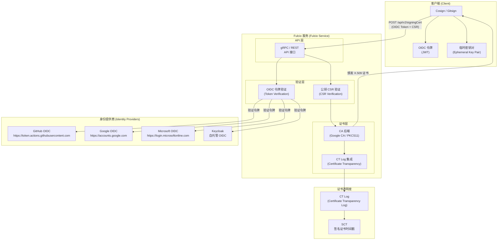
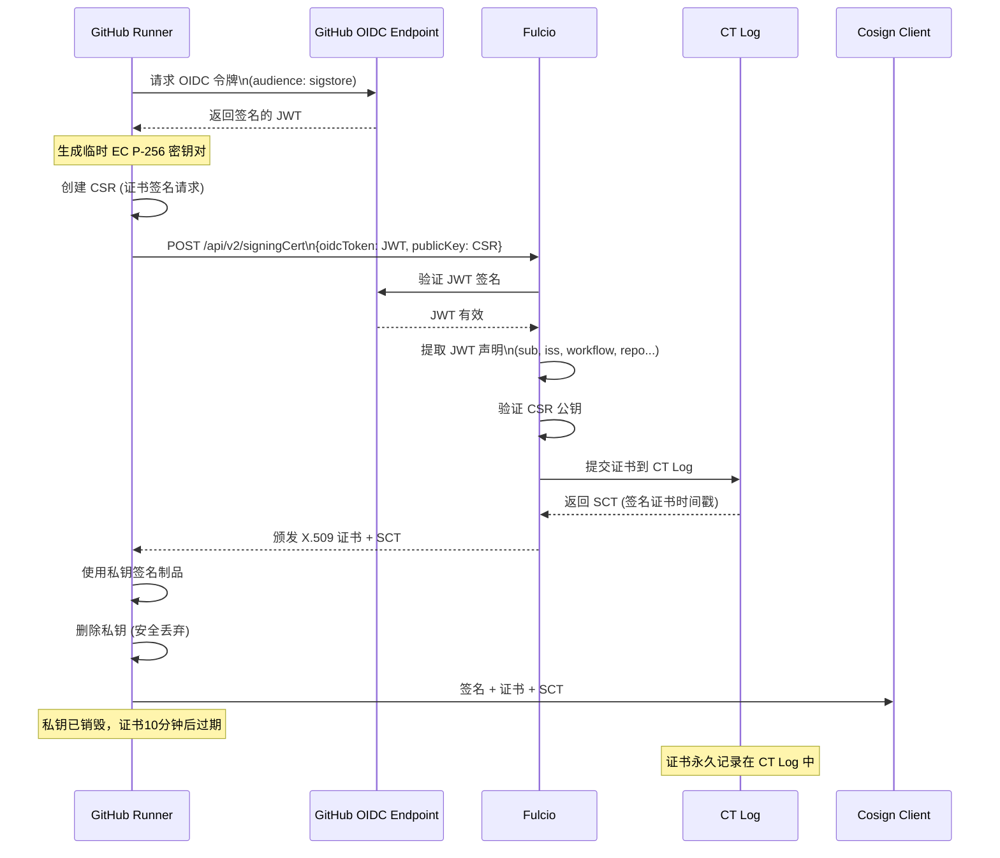
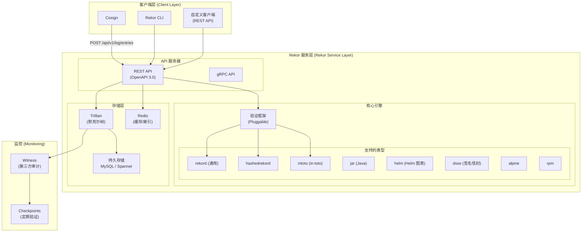
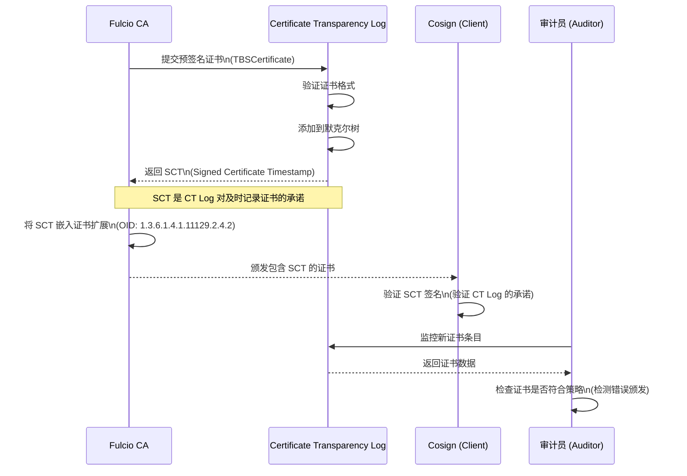
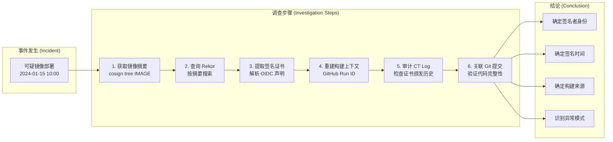
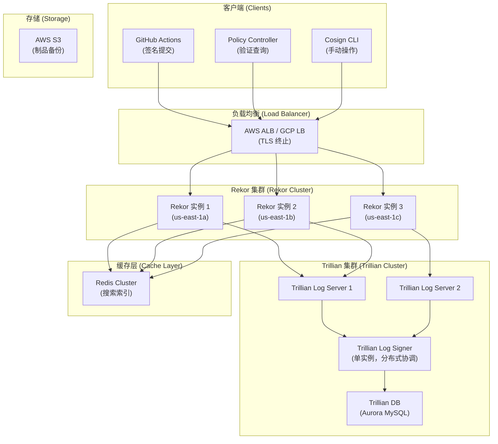

# Fulcio 与 Rekor 透明日志 (Fulcio and Rekor Transparency Logs)

<!-- chunk: 概述 (Overview) -->## 概述 (Overview)

**Fulcio** 是 Sigstore 生态中的证书颁发机构（CA），负责将 OIDC 身份转换为短期 X.509 代码签名证书。**Rekor** 是一个不可篡改的透明日志系统，记录所有软件供应链相关的加密证明。两者共同构成了 Sigstore 无密钥签名的信任基础。

本文档深入解析 Fulcio 的证书颁发流程、Rekor 的透明日志机制、证书透明度实现，以及在安全审计和事件调查中的应用。

---

<!-- chunk: 1. Fulcio 证书颁发机构 (Fulcio Certificate Authority) -->## 1. Fulcio 证书颁发机构 (Fulcio Certificate Authority)

#<!-- chunk: 1.1 Fulcio 系统架构 (Fulcio System Architecture) -->## 1.1 Fulcio 系统架构 (Fulcio System Architecture)



#<!-- chunk: 1.2 Fulcio 证书结构 (Fulcio Certificate Structure) -->## 1.2 Fulcio 证书结构 (Fulcio Certificate Structure)

Fulcio 颁发的证书是标准 X.509 v3 证书，包含特殊的 OID 扩展：

```bash
# 查看 Fulcio 颁发的证书
# 首先签名获取证书
COSIGN_EXPERIMENTAL=1 cosign sign \
  --yes \
  --output-certificate /tmp/signing.pem \
  ghcr.io/your-org/your-app:v1.0.0

# 解析证书内容
openssl x509 -in /tmp/signing.pem -text -noout

# 输出示例：
# Certificate:
#     Data:
#         Version: 3 (0x2)
#         Serial Number: ...
#         Signature Algorithm: ecdsa-with-SHA384
#         Issuer: O=sigstore.dev, CN=sigstore-intermediate
#         Validity
#             Not Before: Jan 15 10:00:00 2024 GMT
#             Not After : Jan 15 10:10:00 2024 GMT   ← 仅10分钟有效期！
#         Subject: (empty - 使用 SAN 代替)
#         Subject Public Key Info:
#             Public Key Algorithm: id-ecPublicKey
#                 Public-Key: (256 bit)
#         X509v3 extensions:
#             X509v3 Key Usage: critical
#                 Digital Signature
#             X509v3 Extended Key Usage: 
#                 Code Signing
#             X509v3 Subject Key Identifier: 
#                 ...
#             X509v3 Authority Key Identifier: 
#                 ...
#             X509v3 Subject Alternative Name: critical
#                 URI:https://github.com/your-org/your-repo/.github/workflows/release.yml@refs/tags/v1.0.0
#             
#             # Fulcio 自定义 OID 扩展
#             1.3.6.1.4.1.57264.1.1:
#                 https://token.actions.githubusercontent.com  ← OIDC Issuer
#             1.3.6.1.4.1.57264.1.2:
#                 push                                         ← GitHub Event
#             1.3.6.1.4.1.57264.1.3:
#                 refs/tags/v1.0.0                             ← Ref
#             1.3.6.1.4.1.57264.1.4:
#                 Release with SLSA Level 3                    ← Workflow Name
#             1.3.6.1.4.1.57264.1.5:
#                 your-org/your-repo                           ← Repository
#             1.3.6.1.4.1.57264.1.6:
#                 refs/tags/v1.0.0                             ← Ref
#             1.3.6.1.4.1.57264.1.7:
#                 12345678                                     ← Run ID
```

#<!-- chunk: 1.3 Fulcio OID 扩展参考 (Fulcio OID Extension Reference) -->## 1.3 Fulcio OID 扩展参考 (Fulcio OID Extension Reference)

| OID | 名称 | 描述 |
|-----|------|------|
| `1.3.6.1.4.1.57264.1.1` | OIDC Issuer | OIDC 令牌颁发者 URL |
| `1.3.6.1.4.1.57264.1.2` | GitHub Event | 触发工作流的事件类型 |
| `1.3.6.1.4.1.57264.1.3` | GitHub Ref | Git 引用（分支/标签） |
| `1.3.6.1.4.1.57264.1.4` | GitHub Workflow | 工作流名称 |
| `1.3.6.1.4.1.57264.1.5` | GitHub Repository | 仓库名称 |
| `1.3.6.1.4.1.57264.1.6` | GitHub Ref (v2) | Git 引用 |
| `1.3.6.1.4.1.57264.1.7` | GitHub Workflow Ref | 完整工作流引用 |
| `1.3.6.1.4.1.57264.1.8` | GitHub SHA | 提交 SHA |
| `1.3.6.1.4.1.57264.1.9` | GitHub Runner Environment | 运行器环境 |
| `1.3.6.1.4.1.57264.1.10` | GitHub Source Repository Digest | 源仓库摘要 |

---

<!-- chunk: 2. OIDC 身份验证流程 (OIDC Identity Verification Flow) -->## 2. OIDC 身份验证流程 (OIDC Identity Verification Flow)

#<!-- chunk: 2.1 GitHub Actions OIDC 令牌交换 (GitHub Actions OIDC Token Exchange) -->## 2.1 GitHub Actions OIDC 令牌交换 (GitHub Actions OIDC Token Exchange)



#<!-- chunk: 2.2 支持的 OIDC 提供商 (Supported OIDC Providers) -->## 2.2 支持的 OIDC 提供商 (Supported OIDC Providers)

```go
// Fulcio 默认支持的 OIDC 提供商配置
// 来源：https://github.com/sigstore/fulcio/blob/main/config/config.go

OIDCIssuers: map[string]OIDCIssuer{
    "https://token.actions.githubusercontent.com": {
        IssuerURL:   "https://token.actions.githubusercontent.com",
        ClientID:    "sigstore",
        Type:        IssuerTypeGitHubWorkflow,
        // 从 JWT sub 字段提取：
        // "repo:org/repo:ref:refs/tags/v1.0.0"
    },
    "https://accounts.google.com": {
        IssuerURL: "https://accounts.google.com",
        ClientID:  "sigstore",
        Type:      IssuerTypeEmail,
        // 使用 email 字段作为 SAN
    },
    "https://oauth2.sigstore.dev/auth": {
        IssuerURL:             "https://oauth2.sigstore.dev/auth",
        ClientID:              "sigstore",
        Type:                  IssuerTypeEmail,
    },
    "https://gitlab.com": {
        IssuerURL: "https://gitlab.com",
        ClientID:  "sigstore",
        Type:      IssuerTypeGitLabPipeline,
    },
    "https://oidc.circleci.com/org/ORGANIZATION_ID": {
        IssuerURL: "https://oidc.circleci.com/org/ORGANIZATION_ID",
        ClientID:  "sigstore",
        Type:      IssuerTypeCircleCI,
    },
}
```

#<!-- chunk: 2.3 验证 OIDC 令牌的 JWT 内容 (Verifying JWT Content) -->## 2.3 验证 OIDC 令牌的 JWT 内容 (Verifying JWT Content)

```bash
# 解码 OIDC 令牌（不需要密钥，仅解码 payload）
# 注意：生产中不要记录或打印 OIDC 令牌
decode_jwt() {
    local TOKEN=$1
    # 提取 payload（第二部分）
    echo $TOKEN | cut -d. -f2 | base64 -d 2>/dev/null | jq .
}

# 在 GitHub Actions 中调试 OIDC 令牌（仅用于调试）
# 注意：不要在生产中使用以下步骤
- name: Debug OIDC token (DEBUG ONLY)
  if: ${{ github.event_name == 'workflow_dispatch' }}
  run: |
    TOKEN=$(curl -s -H "Authorization: bearer $ACTIONS_ID_TOKEN_REQUEST_TOKEN" \
      "$ACTIONS_ID_TOKEN_REQUEST_URL&audience=sigstore" | jq -r .value)
    
    # 解码 payload（不打印完整令牌）
    echo $TOKEN | cut -d. -f2 | \
      python3 -c "import sys, base64, json; \
        data = sys.stdin.read().strip(); \
        # 填充 base64
        data += '=' * (4 - len(data) % 4); \
        print(json.dumps(json.loads(base64.b64decode(data)), indent=2))"

# 验证 Fulcio 根 CA 证书
curl -s https://fulcio.sigstore.dev/api/v2/trustBundle | \
  jq -r '.chains[].certificates[]' | \
  while read -r CERT; do
    echo "$CERT" | openssl x509 -text -noout 2>/dev/null | \
      grep -E "Subject:|Not Before:|Not After:|Serial Number"
    echo "---"
  done
```

---

<!-- chunk: 3. Rekor 透明日志深度解析 (Rekor Transparency Log Deep Dive) -->## 3. Rekor 透明日志深度解析 (Rekor Transparency Log Deep Dive)

#<!-- chunk: 3.1 Rekor 架构 (Rekor Architecture) -->## 3.1 Rekor 架构 (Rekor Architecture)



#<!-- chunk: 3.2 Rekor 日志条目格式 (Rekor Log Entry Format) -->## 3.2 Rekor 日志条目格式 (Rekor Log Entry Format)

```bash
# 查询特定条目
rekor-cli get --log-index 12345678

# 输出示例：
# LogID: c0d23d6ad406973f9559f3ba2d1ca01f84147d8ffc5b8445c224f98b9591801d
# Attestation: {"body":"...","integratedTime":1705315200,"logID":"c0d23d6a...","logIndex":12345678,"verification":{"inclusionProof":{"checkpoint":"rekor.sigstore.dev - 2605736670972794880\n150000000\nabc123...","hashes":["..."],"logIndex":12345678,"rootHash":"def456...","treeSize":150000000},"signedEntryTimestamp":"..."}}
# Index: 12345678
# IntegratedTime: 2024-01-15T10:00:00Z  ← 集成时间戳（不可篡改）
# UUID: abc123def456...
# Body: {
#   "apiVersion": "0.0.2",
#   "kind": "hashedrekord",
#   "spec": {
#     "data": {
#       "hash": {
#         "algorithm": "sha256",
#         "value": "..."
#       }
#     },
#     "signature": {
#       "content": "...",  ← Base64 编码的签名
#       "publicKey": {
#         "content": "..."  ← Base64 编码的公钥/证书
#       }
#     }
#   }
# }
```

#<!-- chunk: 3.3 Rekor 日志条目类型详解 (Rekor Log Entry Types) -->## 3.3 Rekor 日志条目类型详解 (Rekor Log Entry Types)

```bash
# hashedrekord - 最常用的条目类型（Cosign 使用）
cat > hashedrekord-entry.json << 'EOF'
{
  "apiVersion": "0.0.2",
  "kind": "hashedrekord",
  "spec": {
    "data": {
      "hash": {
        "algorithm": "sha256",
        "value": "abc123def456..."
      }
    },
    "signature": {
      "content": "MEQCIHxxxxxxxx...",
      "publicKey": {
        "content": "LS0tLS1CRUdJTi..."
      }
    }
  }
}
EOF

# 提交条目
rekor-cli upload \
  --rekor-server https://rekor.sigstore.dev \
  --type hashedrekord \
  --artifact /path/to/artifact \
  --signature artifact.sig \
  --public-key cosign.pub

# in-toto 条目（用于 SLSA 来源证明）
cat > intoto-entry.json << 'EOF'
{
  "apiVersion": "0.0.2",
  "kind": "intoto",
  "spec": {
    "content": {
      "envelope": {
        "payload": "eyJfdHlwZSI6...",  ← Base64 in-toto 声明
        "payloadType": "application/vnd.in-toto+json",
        "signatures": [
          {
            "keyid": "",
            "sig": "MEYCIQCxxx..."
          }
        ]
      }
    },
    "publicKey": "LS0tLS1CRUdJTi..."
  }
}
EOF
```

---

<!-- chunk: 4. Rekor CLI 完整操作指南 (Rekor CLI Complete Operations Guide) -->## 4. Rekor CLI 完整操作指南 (Rekor CLI Complete Operations Guide)

#<!-- chunk: 4.1 安装 Rekor CLI (Installing Rekor CLI) -->## 4.1 安装 Rekor CLI (Installing Rekor CLI)

```bash
# 安装 rekor-cli
go install github.com/sigstore/rekor/cmd/rekor-cli@latest

# 或从 Release 下载
REKOR_VERSION="v1.3.5"
curl -sSfL "https://github.com/sigstore/rekor/releases/download/${REKOR_VERSION}/rekor-cli-linux-amd64" \
  -o /usr/local/bin/rekor-cli
chmod +x /usr/local/bin/rekor-cli

# 验证安装
rekor-cli version
```

#<!-- chunk: 4.2 查询操作 (Query Operations) -->## 4.2 查询操作 (Query Operations)

```bash
# 查询日志信息（树大小、哈希等）
rekor-cli loginfo

# 输出示例：
# Tree Size: 150000000
# Root Hash: abc123...
# Timestamp: 2024-01-15T10:00:00Z
# TreeID: 1234567890

# 按制品哈希搜索
rekor-cli search \
  --sha "sha256:abc123def456..." \
  --rekor-server https://rekor.sigstore.dev

# 按公钥搜索（找到所有用该密钥签名的制品）
rekor-cli search \
  --public-key cosign.pub \
  --pki-format "x509" \
  --rekor-server https://rekor.sigstore.dev

# 按邮箱搜索
rekor-cli search \
  --email "user@example.com" \
  --rekor-server https://rekor.sigstore.dev

# 获取特定 UUID 的条目
rekor-cli get \
  --uuid "abc123def456..." \
  --rekor-server https://rekor.sigstore.dev

# 获取特定日志索引的条目
rekor-cli get \
  --log-index 12345678 \
  --rekor-server https://rekor.sigstore.dev \
  --format json | jq .

# 批量获取条目范围
for INDEX in $(seq 12345678 12345688); do
  echo "=== Index: $INDEX ==="
  rekor-cli get --log-index $INDEX --format json | \
    jq '{index: .logIndex, time: .integratedTime, kind: (.body | @base64d | fromjson | .kind)}'
done
```

#<!-- chunk: 4.3 包含证明验证 (Inclusion Proof Verification) -->## 4.3 包含证明验证 (Inclusion Proof Verification)

```bash
# 验证条目的默克尔树包含证明
rekor-cli verify \
  --uuid "abc123def456..." \
  --rekor-server https://rekor.sigstore.dev

# 输出示例：
# Current Root Hash: def789...
# Entry Hash: abc123...
# Entry Index: 12345678
# Current Tree Size: 150000000
# 
# Inclusion Proof:
# SHA256(0x01 | SHA256(leaf_hash) | SHA256(sibling_hash)) = root_hash
# Verified!

# 验证一致性证明（证明日志只追加，从不删除）
rekor-cli verify \
  --tree-id 1234567890 \
  --tree-size 150000000 \
  --root-hash "def789..." \
  --rekor-server https://rekor.sigstore.dev
```

#<!-- chunk: 4.4 Rekor REST API 使用 (Rekor REST API Usage) -->## 4.4 Rekor REST API 使用 (Rekor REST API Usage)

```bash
# 获取日志信息
curl -s "https://rekor.sigstore.dev/api/v1/log" | jq .

# 搜索条目（按制品哈希）
curl -s -X POST "https://rekor.sigstore.dev/api/v1/index/retrieve" \
  -H "Content-Type: application/json" \
  -d '{"hash": "sha256:abc123def456..."}' | jq .

# 获取条目
curl -s "https://rekor.sigstore.dev/api/v1/log/entries/abc123..." | jq .

# 批量获取条目
curl -s "https://rekor.sigstore.dev/api/v1/log/entries?logIndex=12345678&lastIndex=12345688" | jq .

# 获取包含证明
curl -s "https://rekor.sigstore.dev/api/v1/log/proof/consistency" \
  -H "Content-Type: application/json" \
  -d '{"firstTreeSize": 100000000, "lastTreeSize": 150000000}' | jq .

# 获取树最新签名检查点
curl -s "https://rekor.sigstore.dev/api/v1/log" | \
  jq '.signedTreeHead'
```

---

<!-- chunk: 5. 证书透明度 (Certificate Transparency) -->## 5. 证书透明度 (Certificate Transparency)

#<!-- chunk: 5.1 CT Log 与 SCT 机制 (CT Log and SCT Mechanism) -->## 5.1 CT Log 与 SCT 机制 (CT Log and SCT Mechanism)



#<!-- chunk: 5.2 SCT 验证 (SCT Verification) -->## 5.2 SCT 验证 (SCT Verification)

```bash
# 从证书中提取 SCT 信息
openssl x509 -in cert.pem -text -noout | \
  grep -A 10 "Signed Certificate Timestamp"

# 使用 cosign 验证 SCT
cosign verify \
  --certificate cert.pem \
  --signature sig.sig \
  --certificate-oidc-issuer "https://token.actions.githubusercontent.com" \
  --certificate-identity-regexp ".*" \
  --check-claims=false \
  artifact.tar.gz

# 手动验证 SCT 签名
# 1. 下载 CT Log 公钥
curl -s "https://fulcio.sigstore.dev/api/v1/rootCert" | \
  openssl x509 -text -noout

# 2. 使用 Go 工具验证 SCT
go run github.com/google/certificate-transparency-go/cmd/ct_hammer@latest verify-sct \
  --cert cert.pem \
  --ct-log-url https://ctfe.sigstore.dev/test
```

#<!-- chunk: 5.3 CT Log 监控 (CT Log Monitoring) -->## 5.3 CT Log 监控 (CT Log Monitoring)

```python
# ct_monitor.py - 监控 CT Log 的新证书
import requests
import base64
import json
from cryptography import x509
from cryptography.hazmat.backends import default_backend
import time

CT_LOG_URL = "https://ctfe.sigstore.dev/test"
MONITORED_DOMAINS = ["github.com/your-org"]

def get_sth():
    """获取签名树头（Signed Tree Head）"""
    response = requests.get(f"{CT_LOG_URL}/ct/v1/get-sth")
    return response.json()

def get_entries(start, end):
    """获取特定范围的证书条目"""
    response = requests.get(
        f"{CT_LOG_URL}/ct/v1/get-entries",
        params={"start": start, "end": end}
    )
    return response.json().get("entries", [])

def parse_cert_entry(entry):
    """解析证书条目"""
    leaf_input = base64.b64decode(entry["leaf_input"])
    # 解析 MerkleTreeLeaf 结构
    # 跳过版本(1字节) + 类型(1字节) + 时间戳(8字节) + 类型(2字节) + 长度(3字节)
    cert_data = leaf_input[15:]
    try:
        cert = x509.load_der_x509_certificate(cert_data, default_backend())
        return cert
    except Exception:
        return None

def monitor_certificates():
    """监控新证书"""
    sth = get_sth()
    tree_size = sth["tree_size"]
    
    print(f"Current tree size: {tree_size}")
    
    # 扫描最近 100 个条目
    start = max(0, tree_size - 100)
    entries = get_entries(start, tree_size - 1)
    
    suspicious_certs = []
    
    for i, entry in enumerate(entries):
        cert = parse_cert_entry(entry)
        if cert is None:
            continue
        
        # 检查 SAN（主体备用名称）
        try:
            san_ext = cert.extensions.get_extension_for_class(x509.SubjectAlternativeName)
            for uri in san_ext.value.get_values_for_type(x509.UniformResourceIdentifier):
                for domain in MONITORED_DOMAINS:
                    if domain in uri:
                        print(f"Found cert for {domain}:")
                        print(f"  URI: {uri}")
                        print(f"  Valid from: {cert.not_valid_before}")
                        print(f"  Valid until: {cert.not_valid_after}")
                        print(f"  Log index: {start + i}")
        except x509.extensions.ExtensionNotFound:
            pass
    
    return suspicious_certs

if __name__ == "__main__":
    while True:
        monitor_certificates()
        time.sleep(300)  # 每 5 分钟检查一次
```

---

<!-- chunk: 6. 审计追踪实践 (Audit Trail Practices) -->## 6. 审计追踪实践 (Audit Trail Practices)

#<!-- chunk: 6.1 供应链事件时间线重建 (Supply Chain Incident Timeline Reconstruction) -->## 6.1 供应链事件时间线重建 (Supply Chain Incident Timeline Reconstruction)



#<!-- chunk: 6.2 完整事件调查脚本 (Complete Incident Investigation Script) -->## 6.2 完整事件调查脚本 (Complete Incident Investigation Script)

```bash
#!/bin/bash
# investigate_image.sh - 调查容器镜像的供应链完整性

set -euo pipefail

IMAGE_REF="${1:?Usage: $0 <image-ref>}"
REKOR_URL="${REKOR_URL:-https://rekor.sigstore.dev}"
OUTPUT_DIR="${OUTPUT_DIR:-./investigation-$(date +%Y%m%d-%H%M%S)}"

mkdir -p "$OUTPUT_DIR"

echo "=== 供应链完整性调查 ==="
echo "镜像: $IMAGE_REF"
echo "输出目录: $OUTPUT_DIR"
echo "时间: $(date -u +%Y-%m-%dT%H:%M:%SZ)"
echo ""

# 步骤 1: 获取镜像摘要
echo ">>> 步骤 1: 获取镜像摘要"
DIGEST=$(crane digest "$IMAGE_REF" 2>/dev/null || echo "UNKNOWN")
echo "摘要: $DIGEST"
echo "$DIGEST" > "$OUTPUT_DIR/digest.txt"

# 步骤 2: 查看签名树
echo ""
echo ">>> 步骤 2: 查看签名树"
cosign tree "$IMAGE_REF" 2>&1 | tee "$OUTPUT_DIR/signature-tree.txt"

# 步骤 3: 验证签名并提取证书
echo ""
echo ">>> 步骤 3: 验证签名并提取证书"
cosign verify \
  --certificate-oidc-issuer "https://token.actions.githubusercontent.com" \
  --certificate-identity-regexp ".*" \
  --output-file "$OUTPUT_DIR/signatures.json" \
  "$IMAGE_REF" 2>&1 | tee "$OUTPUT_DIR/verify-output.txt" || true

# 步骤 4: 分析签名证书
echo ""
echo ">>> 步骤 4: 分析签名证书"
if [ -f "$OUTPUT_DIR/signatures.json" ]; then
  python3 << PYTHON
import json, base64, sys
from cryptography import x509
from cryptography.hazmat.backends import default_backend
from cryptography.x509.oid import NameOID

with open('$OUTPUT_DIR/signatures.json') as f:
    try:
        sigs = json.load(f)
    except json.JSONDecodeError:
        sigs = []

for i, sig in enumerate(sigs):
    print(f"\n=== 签名 #{i+1} ===")
    
    # 提取证书
    cert_b64 = sig.get('Cert', '') or sig.get('cert', '')
    if not cert_b64:
        print("  无证书信息")
        continue
    
    try:
        cert_pem = base64.b64decode(cert_b64)
        cert = x509.load_pem_x509_certificate(cert_pem, default_backend())
        
        print(f"  有效期: {cert.not_valid_before} - {cert.not_valid_after}")
        
        # 提取 SAN
        try:
            san = cert.extensions.get_extension_for_class(x509.SubjectAlternativeName)
            for uri in san.value.get_values_for_type(x509.UniformResourceIdentifier):
                print(f"  工作流: {uri}")
        except Exception:
            pass
        
        # 提取 Fulcio 扩展
        FULCIO_OIDS = {
            "1.3.6.1.4.1.57264.1.1": "OIDC Issuer",
            "1.3.6.1.4.1.57264.1.2": "GitHub Event",
            "1.3.6.1.4.1.57264.1.3": "GitHub Ref",
            "1.3.6.1.4.1.57264.1.4": "GitHub Workflow",
            "1.3.6.1.4.1.57264.1.5": "GitHub Repository",
            "1.3.6.1.4.1.57264.1.8": "GitHub SHA",
        }
        
        for ext in cert.extensions:
            oid_str = ext.oid.dotted_string
            if oid_str in FULCIO_OIDS:
                try:
                    value = ext.value.value.decode('utf-8')
                    print(f"  {FULCIO_OIDS[oid_str]}: {value}")
                except Exception as e:
                    print(f"  {FULCIO_OIDS[oid_str]}: <解码失败: {e}>")
    except Exception as e:
        print(f"  证书解析失败: {e}")

PYTHON
fi

# 步骤 5: 查询 Rekor
echo ""
echo ">>> 步骤 5: 查询 Rekor 透明日志"
if [ "$DIGEST" != "UNKNOWN" ]; then
  HASH=$(echo "$DIGEST" | sed 's/sha256://')
  
  ENTRIES=$(curl -s -X POST "$REKOR_URL/api/v1/index/retrieve" \
    -H "Content-Type: application/json" \
    -d "{\"hash\": \"sha256:${HASH}\"}" 2>/dev/null)
  
  echo "找到的 Rekor 条目:"
  echo "$ENTRIES" | jq -r '.[]' | while read UUID; do
    echo "  UUID: $UUID"
    curl -s "$REKOR_URL/api/v1/log/entries/${UUID}" | \
      jq -r '.[].integratedTime' | \
      xargs -I{} date -d @{} +"%Y-%m-%dT%H:%M:%SZ" 2>/dev/null | \
      while read TIME; do echo "  集成时间: $TIME"; done
  done
  
  echo "$ENTRIES" > "$OUTPUT_DIR/rekor-entries.json"
fi

# 步骤 6: 验证 SBOM 证明
echo ""
echo ">>> 步骤 6: 检查 SBOM 证明"
cosign verify-attestation \
  --type spdxjson \
  --certificate-oidc-issuer "https://token.actions.githubusercontent.com" \
  --certificate-identity-regexp ".*" \
  "$IMAGE_REF" > "$OUTPUT_DIR/sbom-attestation.json" 2>/dev/null && \
  echo "✅ SBOM 证明存在并有效" || \
  echo "⚠️ 未找到 SBOM 证明"

# 步骤 7: 检查漏洞证明
echo ""
echo ">>> 步骤 7: 检查漏洞扫描证明"
cosign verify-attestation \
  --type vuln \
  --certificate-oidc-issuer "https://token.actions.githubusercontent.com" \
  --certificate-identity-regexp ".*" \
  "$IMAGE_REF" > "$OUTPUT_DIR/vuln-attestation.json" 2>/dev/null && \
  echo "✅ 漏洞证明存在并有效" || \
  echo "⚠️ 未找到漏洞扫描证明"

# 生成报告
echo ""
echo ">>> 生成调查报告"
cat > "$OUTPUT_DIR/investigation-report.md" << REPORT
# 供应链完整性调查报告

**调查时间**: $(date -u +%Y-%m-%dT%H:%M:%SZ)
**镜像**: $IMAGE_REF
**摘要**: $DIGEST

<!-- chunk: 发现摘要 -->## 发现摘要

- 签名状态: $([ -f "$OUTPUT_DIR/signatures.json" ] && echo "✅ 存在" || echo "❌ 未找到")
- SBOM 证明: $([ -f "$OUTPUT_DIR/sbom-attestation.json" ] && echo "✅ 存在" || echo "⚠️ 未找到")
- 漏洞证明: $([ -f "$OUTPUT_DIR/vuln-attestation.json" ] && echo "✅ 存在" || echo "⚠️ 未找到")

<!-- chunk: 详细信息 -->## 详细信息

请查看以下文件获取详细信息：
- \`signature-tree.txt\`: 完整签名树
- \`signatures.json\`: 签名和证书详情
- \`rekor-entries.json\`: Rekor 透明日志条目
- \`sbom-attestation.json\`: SBOM 证明内容
- \`vuln-attestation.json\`: 漏洞扫描证明
REPORT

echo ""
echo "=== 调查完成 ==="
echo "报告保存至: $OUTPUT_DIR/"
ls -la "$OUTPUT_DIR/"
```

---

<!-- chunk: 7. 自托管 Rekor 部署 (Self-Hosted Rekor Deployment) -->## 7. 自托管 Rekor 部署 (Self-Hosted Rekor Deployment)

#<!-- chunk: 7.1 [[Kubernetes|Kubernetes]] 部署配置 (Kubernetes Deployment Configuration) -->## 7.1 Kubernetes 部署配置 (Kubernetes Deployment Configuration)

```yaml
# rekor-deployment.yaml
apiVersion: apps/v1
kind: Deployment
metadata:
  name: rekor-server
  namespace: sigstore-system
  labels:
    app: rekor-server
spec:
  replicas: 3
  selector:
    matchLabels:
      app: rekor-server
  strategy:
    type: RollingUpdate
    rollingUpdate:
      maxSurge: 1
      maxUnavailable: 0
  template:
    metadata:
      labels:
        app: rekor-server
    spec:
      serviceAccountName: rekor-server
      
      initContainers:
        - name: wait-for-trillian
          image: busybox:1.35
          command:
            - sh
            - -c
            - |
              until nc -z trillian-log-server 8091; do
                echo "Waiting for Trillian..."; sleep 5
              done
      
      containers:
        - name: rekor-server
          image: gcr.io/projectsigstore/rekor-server:v1.3.5
          ports:
            - name: http
              containerPort: 3000
            - name: metrics
              containerPort: 2112
          
          args:
            - "serve"
            - "--trillian_log_server.address=trillian-log-server.sigstore-system.svc:8091"
            - "--trillian_log_server.tlog_id=$(TREE_ID)"
            - "--redis_server.address=redis.sigstore-system.svc:6379"
            - "--rekor_server.hostname=rekor.your-company.com"
            - "--rekor_server.address=0.0.0.0"
            - "--rekor_server.port=3000"
            - "--enable_retrieve_api=true"
            - "--log_type=prod"
            - "--search_index.storage_provider=redis"
          
          env:
            - name: TREE_ID
              valueFrom:
                secretKeyRef:
                  name: rekor-config
                  key: tree-id
          
          volumeMounts:
            - name: rekor-key
              mountPath: /var/run/rekor
              readOnly: true
          
          resources:
            requests:
              cpu: 500m
              memory: 512Mi
            limits:
              cpu: 2000m
              memory: 2Gi
          
          livenessProbe:
            httpGet:
              path: /healthz
              port: 3000
            initialDelaySeconds: 30
            periodSeconds: 10
          
          readinessProbe:
            httpGet:
              path: /api/v1/log
              port: 3000
            initialDelaySeconds: 10
            periodSeconds: 5
      
      volumes:
        - name: rekor-key
          secret:
            secretName: rekor-signing-key

---
# rekor-service.yaml
apiVersion: v1
kind: Service
metadata:
  name: rekor-server
  namespace: sigstore-system
spec:
  selector:
    app: rekor-server
  ports:
    - name: http
      port: 80
      targetPort: 3000
    - name: metrics
      port: 2112
      targetPort: 2112
  type: ClusterIP

---
# rekor-ingress.yaml
apiVersion: networking.k8s.io/v1
kind: Ingress
metadata:
  name: rekor-server
  namespace: sigstore-system
  annotations:
    cert-manager.io/cluster-issuer: "letsencrypt-prod"
    nginx.ingress.kubernetes.io/proxy-body-size: "50m"
spec:
  tls:
    - hosts:
        - rekor.your-company.com
      secretName: rekor-tls
  rules:
    - host: rekor.your-company.com
      http:
        paths:
          - path: /
            pathType: Prefix
            backend:
              service:
                name: rekor-server
                port:
                  number: 80
```

#<!-- chunk: 7.2 Trillian 日志树初始化 (Trillian Log Tree Initialization) -->## 7.2 Trillian 日志树初始化 (Trillian Log Tree Initialization)

```bash
# 创建 Trillian 日志树
kubectl run trillian-admin \
  --image gcr.io/projectsigstore/trillian_log_server:v1.5.3 \
  --rm -it \
  --restart=Never \
  --namespace sigstore-system \
  -- /usr/local/bin/createtree \
    --admin_server trillian-log-server.sigstore-system.svc:8091 \
    --display_name "Rekor Production Log" \
    --log_type preordered

# 记录返回的 Tree ID
# 例如：Tree ID: 9876543210

# 存储到 Kubernetes Secret
kubectl create secret generic rekor-config \
  --namespace sigstore-system \
  --from-literal=tree-id=9876543210

# 验证树创建成功
kubectl run trillian-verify \
  --image gcr.io/projectsigstore/trillian_log_server:v1.5.3 \
  --rm -it \
  --restart=Never \
  --namespace sigstore-system \
  -- /usr/local/bin/log_client \
    --log_server trillian-log-server.sigstore-system.svc:8091 \
    --log_id 9876543210 \
    get_latest_signed_log_root
```

#<!-- chunk: 7.3 Rekor 签名密钥管理 (Rekor Signing Key Management) -->## 7.3 Rekor 签名密钥管理 (Rekor Signing Key Management)

```bash
# 生成 Rekor 签名密钥（用于签名树根哈希）
# 方法 1: 直接生成（开发/测试）
openssl ecparam -name prime256v1 -genkey -noout -out rekor-key.pem
openssl ec -in rekor-key.pem -pubout -out rekor-public-key.pem

# 将私钥存储到 Kubernetes Secret
kubectl create secret generic rekor-signing-key \
  --namespace sigstore-system \
  --from-file=private=rekor-key.pem \
  --from-file=public=rekor-public-key.pem

# 方法 2: 使用 KMS（生产推荐）
# GCP KMS
gcloud kms keys create rekor-signing-key \
  --location global \
  --keyring sigstore \
  --purpose asymmetric-signing \
  --default-algorithm ec-sign-p256-sha256

# 导出公钥
gcloud kms keys versions get-public-key 1 \
  --location global \
  --keyring sigstore \
  --key rekor-signing-key \
  --output-file rekor-public-key.pem

# 发布公钥供验证使用
cat rekor-public-key.pem
```

---

<!-- chunk: 8. 透明日志监控与告警 (Transparency Log Monitoring and Alerting) -->## 8. 透明日志监控与告警 (Transparency Log Monitoring and Alerting)

#<!-- chunk: 8.1 Rekor 监控配置 (Rekor Monitoring Configuration) -->## 8.1 Rekor 监控配置 (Rekor Monitoring Configuration)

```yaml
# prometheus-rekor-rules.yaml
apiVersion: monitoring.coreos.com/v1
kind: PrometheusRule
metadata:
  name: rekor-alerts
  namespace: sigstore-system

spec:
  groups:
    - name: rekor.rules
      interval: 30s
      rules:
        # 树大小增长率
        - record: rekor:log_entries_rate5m
          expr: rate(rekor_log_entries_total[5m])

        # 告警：日志增长停止
        - alert: RekorLogNotGrowing
          expr: rate(rekor_log_entries_total[1h]) == 0
          for: 2h
          labels:
            severity: warning
          annotations:
            summary: "Rekor 透明日志停止增长"
            description: "Rekor 日志在过去 2 小时内没有新条目"

        # 告警：Rekor 服务不可用
        - alert: RekorServiceDown
          expr: up{job="rekor"} == 0
          for: 5m
          labels:
            severity: critical
          annotations:
            summary: "Rekor 服务不可用"
            description: "Rekor 透明日志服务已停止响应超过 5 分钟"

        # 告警：API 延迟过高
        - alert: RekorHighLatency
          expr: histogram_quantile(0.99, rekor_api_request_duration_seconds_bucket) > 5
          for: 10m
          labels:
            severity: warning
          annotations:
            summary: "Rekor API 延迟过高"
            description: "99th 百分位延迟超过 5 秒"

        # 告警：错误率过高
        - alert: RekorHighErrorRate
          expr: rate(rekor_api_requests_total{status=~"5.."}[5m]) / rate(rekor_api_requests_total[5m]) > 0.05
          for: 5m
          labels:
            severity: critical
          annotations:
            summary: "Rekor API 错误率过高"
            description: "API 错误率超过 5%"
```

#<!-- chunk: 8.2 透明日志一致性监控 (Transparency Log Consistency Monitoring) -->## 8.2 透明日志一致性监控 (Transparency Log Consistency Monitoring)

```python
#!/usr/bin/env python3
# rekor_consistency_monitor.py
# 监控 Rekor 日志一致性，确保日志只追加不删除

import requests
import json
import time
import hashlib
import hmac
import base64
from datetime import datetime

REKOR_URL = "https://rekor.sigstore.dev"
CHECKPOINT_FILE = "/var/lib/rekor-monitor/checkpoint.json"

def get_signed_tree_head():
    """获取当前签名树头"""
    response = requests.get(f"{REKOR_URL}/api/v1/log")
    response.raise_for_status()
    return response.json()

def get_consistency_proof(first_size, last_size):
    """获取两个树大小之间的一致性证明"""
    response = requests.get(
        f"{REKOR_URL}/api/v1/log/proof/consistency",
        params={
            "firstTreeSize": first_size,
            "lastTreeSize": last_size
        }
    )
    response.raise_for_status()
    return response.json()

def verify_consistency_proof(old_root, old_size, new_root, new_size, proof_hashes):
    """
    验证默克尔树一致性证明
    确保从 old_size 到 new_size 的转变是纯追加操作
    """
    # 简化版证明验证
    # 生产中应使用完整的默克尔树验证库
    
    if old_size > new_size:
        return False, "新树大小小于旧树大小，可能发生了删除操作！"
    
    if old_size == new_size and old_root == new_root:
        return True, "树未变化"
    
    # 验证哈希链
    current_hash = old_root
    for hash_b64 in proof_hashes:
        hash_bytes = base64.b64decode(hash_b64)
        # 合并哈希（简化版）
        combined = current_hash.encode() + hash_bytes.hex().encode()
        current_hash = hashlib.sha256(combined).hexdigest()
    
    # 注意：完整验证需要实现 RFC 6962 的一致性证明验证算法
    return True, "一致性证明验证通过（简化版）"

def load_checkpoint():
    """加载上次检查的检查点"""
    try:
        with open(CHECKPOINT_FILE) as f:
            return json.load(f)
    except FileNotFoundError:
        return None

def save_checkpoint(sth):
    """保存当前检查点"""
    import os
    os.makedirs(os.path.dirname(CHECKPOINT_FILE), exist_ok=True)
    checkpoint = {
        "tree_size": sth["treeSize"],
        "root_hash": sth["rootHash"],
        "timestamp": datetime.utcnow().isoformat(),
        "tree_id": sth.get("treeID")
    }
    with open(CHECKPOINT_FILE, 'w') as f:
        json.dump(checkpoint, f, indent=2)
    return checkpoint

def monitor():
    """主监控循环"""
    print(f"[{datetime.utcnow().isoformat()}] 开始 Rekor 一致性监控")
    
    # 获取当前树头
    current_sth = get_signed_tree_head()
    current_size = current_sth["treeSize"]
    current_root = current_sth["rootHash"]
    
    print(f"当前树大小: {current_size}")
    print(f"当前根哈希: {current_root[:16]}...")
    
    # 加载上次检查点
    old_checkpoint = load_checkpoint()
    
    if old_checkpoint is None:
        print("首次运行，保存检查点")
        save_checkpoint(current_sth)
        return True
    
    old_size = old_checkpoint["tree_size"]
    old_root = old_checkpoint["root_hash"]
    
    print(f"上次检查: 树大小 {old_size}, 根哈希 {old_root[:16]}...")
    
    if current_size == old_size and current_root == old_root:
        print("✅ 日志未变化，一致")
        return True
    
    if current_size < old_size:
        print(f"❌ 严重警告！树大小减少：{old_size} -> {current_size}")
        print("这可能表示日志发生了删除操作！")
        return False
    
    # 获取一致性证明
    print(f"获取一致性证明 ({old_size} -> {current_size})...")
    
    try:
        proof = get_consistency_proof(old_size, current_size)
        hashes = proof.get("hashes", [])
        
        valid, message = verify_consistency_proof(
            old_root, old_size,
            current_root, current_size,
            hashes
        )
        
        if valid:
            print(f"✅ 一致性验证通过: {message}")
            new_entries = current_size - old_size
            print(f"   新增条目: {new_entries}")
            save_checkpoint(current_sth)
            return True
        else:
            print(f"❌ 一致性验证失败: {message}")
            return False
    
    except Exception as e:
        print(f"❌ 验证过程出错: {e}")
        return False

def main():
    while True:
        try:
            result = monitor()
            if not result:
                # 发送告警
                print("🚨 发送安全告警！")
                # 这里集成告警系统（PagerDuty/Slack/etc）
        except Exception as e:
            print(f"监控出错: {e}")
        
        # 每 10 分钟检查一次
        time.sleep(600)

if __name__ == "__main__":
    main()
```

---

<!-- chunk: 9. 日志条目类型高级应用 (Advanced Log Entry Type Applications) -->## 9. 日志条目类型高级应用 (Advanced Log Entry Type Applications)

#<!-- chunk: 9.1 DSSE 签名信封 (DSSE - Dead Simple Signing Envelope) -->## 9.1 DSSE 签名信封 (DSSE - Dead Simple Signing Envelope)

```bash
# DSSE 是 in-toto 推荐的签名信封格式
# 用于 SLSA 来源证明和自定义证明

# 查看 DSSE 格式的 Rekor 条目
rekor-cli get \
  --log-index 12345678 \
  --format json | \
  jq '.body | @base64d | fromjson | 
    select(.kind == "dsse") | 
    .spec.proposedContent.envelope | 
    {
      payloadType: .payloadType,
      payload: (.payload | @base64d | fromjson),
      sigCount: (.signatures | length)
    }'

# 提交 DSSE 条目
cat > dsse-payload.json << 'EOF'
{
  "payloadType": "application/vnd.in-toto+json",
  "payload": "eyJfdHlwZSI6Imh0dHBzOi8vaW4tdG90by5pby9TdGF0ZW1lbnQvdjAuMSIsInN1YmplY3QiOlt7Im5hbWUiOiJteS1hcHAiLCJkaWdlc3QiOnsic2hhMjU2IjoiYWJjMTIzIn19XSwicHJlZGljYXRlVHlwZSI6Imh0dHBzOi8vc2xzYS5kZXYvcHJvdmVuYW5jZS92MC4yIiwicHJlZGljYXRlIjp7fX0=",
  "signatures": [
    {
      "keyid": "",
      "sig": "MEYCIQCxxx..."
    }
  ]
}
EOF

rekor-cli upload \
  --rekor-server https://rekor.sigstore.dev \
  --type dsse \
  --artifact dsse-payload.json \
  --signature dsse-payload.json \
  --public-key signing-cert.pem \
  --pki-format x509
```

#<!-- chunk: 9.2 Helm Chart 签名 (Helm Chart Signing) -->## 9.2 Helm Chart 签名 (Helm Chart Signing)

```bash
# 对 Helm Chart 进行签名（使用 Rekor 记录）
# 首先，使用 cosign 签名 Helm Chart

# 打包 Chart
helm package ./my-chart

# 生成 Chart 文件的签名
cosign sign-blob \
  --yes \
  --bundle my-chart-1.0.0.tgz.bundle \
  my-chart-1.0.0.tgz

# 验证 Chart 签名
cosign verify-blob \
  --bundle my-chart-1.0.0.tgz.bundle \
  --certificate-oidc-issuer "https://token.actions.githubusercontent.com" \
  --certificate-identity-regexp ".*" \
  my-chart-1.0.0.tgz

# 将签名 Chart 推送到 OCI 注册表
helm push my-chart-1.0.0.tgz oci://ghcr.io/your-org/helm-charts

# 签名 OCI 注册表中的 Helm Chart
cosign sign \
  --yes \
  ghcr.io/your-org/helm-charts/my-chart:1.0.0

# 在 Helm 安装前验证
cosign verify \
  --certificate-oidc-issuer "https://token.actions.githubusercontent.com" \
  --certificate-identity-regexp ".*" \
  ghcr.io/your-org/helm-charts/my-chart:1.0.0 && \
  helm install my-release oci://ghcr.io/your-org/helm-charts/my-chart --version 1.0.0
```

---

<!-- chunk: 10. 企业级透明日志架构 (Enterprise Transparency Log Architecture) -->## 10. 企业级透明日志架构 (Enterprise Transparency Log Architecture)

#<!-- chunk: 10.1 高可用 Rekor 部署 (High-Availability Rekor Deployment) -->## 10.1 高可用 Rekor 部署 (High-Availability Rekor Deployment)



#<!-- chunk: 10.2 跨区域 Rekor 联邦 (Cross-Region Rekor Federation) -->## 10.2 跨区域 Rekor 联邦 (Cross-Region Rekor Federation)

```yaml
# rekor-federation-config.yaml
# 配置多个 Rekor 实例的联邦信任

apiVersion: v1
kind: ConfigMap
metadata:
  name: rekor-federation
  namespace: sigstore-system

data:
  # 每个区域的 Rekor 实例配置
  federation.yaml: |
    rekor_instances:
      - name: "us-east-1"
        url: "https://rekor-us-east.your-company.com"
        public_key: |
          -----BEGIN PUBLIC KEY-----
          MFkwEwYHKoZIzj0CAQYIKoZIzj0DAQcDQgAE...
          -----END PUBLIC KEY-----
        
      - name: "eu-west-1"
        url: "https://rekor-eu-west.your-company.com"
        public_key: |
          -----BEGIN PUBLIC KEY-----
          MFkwEwYHKoZIzj0CAQYIKoZIzj0DAQcDQgAF...
          -----END PUBLIC KEY-----
        
      - name: "ap-northeast-1"
        url: "https://rekor-ap-northeast.your-company.com"
        public_key: |
          -----BEGIN PUBLIC KEY-----
          MFkwEwYHKoZIzj0CAQYIKoZIzj0DAQcDQgAG...
          -----END PUBLIC KEY-----
    
    # 写入策略：写入最近的 Rekor 实例
    write_policy: "nearest"
    
    # 读取策略：从任意实例读取
    read_policy: "any"
    
    # 交叉验证：确保关键签名记录在多个实例
    cross_validation:
      enabled: true
      min_instances: 2
```

---

<!-- chunk: 11. 安全事件响应 (Security Incident Response) -->## 11. 安全事件响应 (Security Incident Response)

#<!-- chunk: 11.1 签名密钥泄露响应 (Signing Key Compromise Response) -->## 11.1 签名密钥泄露响应 (Signing Key Compromise Response)

```bash
#!/bin/bash
# key_compromise_response.sh - 签名密钥泄露应急响应

set -euo pipefail

COMPROMISED_KEY="${1:?Usage: $0 <compromised-key-path-or-kms-id>}"
INCIDENT_ID="${2:-$(date +%Y%m%d-%H%M%S)}"

echo "=== 签名密钥泄露应急响应 ==="
echo "事件 ID: $INCIDENT_ID"
echo "受损密钥: $COMPROMISED_KEY"
echo "开始时间: $(date -u)"
echo ""

# 步骤 1: 立即搜索所有使用该密钥的签名
echo ">>> 步骤 1: 搜索所有使用受损密钥的签名"
rekor-cli search \
  --public-key "$COMPROMISED_KEY" \
  --pki-format "x509" \
  --rekor-server https://rekor.sigstore.dev \
  > "/tmp/compromised-signatures-${INCIDENT_ID}.txt" 2>&1

SIGNATURE_COUNT=$(wc -l < "/tmp/compromised-signatures-${INCIDENT_ID}.txt")
echo "发现 ${SIGNATURE_COUNT} 个使用受损密钥的签名"

# 步骤 2: 撤销受损密钥（对于 KMS 密钥）
echo ""
echo ">>> 步骤 2: 禁用受损密钥"
# AWS KMS
if echo "$COMPROMISED_KEY" | grep -q "awskms://"; then
  KEY_ID=$(echo "$COMPROMISED_KEY" | sed 's/awskms:\/\/\///')
  aws kms disable-key --key-id "$KEY_ID"
  echo "✅ AWS KMS 密钥已禁用"
fi

# GCP KMS
if echo "$COMPROMISED_KEY" | grep -q "gcpkms://"; then
  KEY_VERSION=$(echo "$COMPROMISED_KEY" | sed 's/gcpkms:\/\///')
  gcloud kms keys versions disable 1 \
    --location=global \
    --keyring=cosign \
    --key="$COMPROMISED_KEY"
  echo "✅ GCP KMS 密钥已禁用"
fi

# 步骤 3: 生成受影响制品清单
echo ""
echo ">>> 步骤 3: 生成受影响制品清单"
cat "/tmp/compromised-signatures-${INCIDENT_ID}.txt" | \
  while read UUID; do
    if [ -n "$UUID" ]; then
      rekor-cli get --uuid "$UUID" --format json 2>/dev/null | \
        jq '{
          uuid: .uuid,
          time: .integratedTime,
          type: (.body | @base64d | fromjson | .kind),
          hash: (.body | @base64d | fromjson | .spec.data.hash.value // "N/A")
        }'
    fi
  done > "/tmp/affected-artifacts-${INCIDENT_ID}.json"

echo "受影响制品清单已保存"

# 步骤 4: 重新签名合法制品
echo ""
echo ">>> 步骤 4: 使用新密钥重新签名（手动确认需要）"
echo "请审查受影响制品清单并重新签名合法制品："
cat "/tmp/affected-artifacts-${INCIDENT_ID}.json" | jq .

# 步骤 5: 更新策略执行规则
echo ""
echo ">>> 步骤 5: 更新 Policy Controller 规则"
echo "请更新 ClusterImagePolicy 以拒绝使用受损密钥的签名"
echo "示例："
cat << 'EOF'
# 更新 ClusterImagePolicy 以拒绝受损密钥
kubectl patch clusterimagepolicy my-policy --type=json -p='[
  {
    "op": "replace",
    "path": "/spec/authorities/0/key/data",
    "value": "NEW_PUBLIC_KEY_DATA"
  }
]'
EOF

echo ""
echo "=== 应急响应完成 ==="
echo "事件 ID: $INCIDENT_ID"
echo "受损密钥: $COMPROMISED_KEY"
echo "受影响签名数: ${SIGNATURE_COUNT}"
echo "下一步: 通知安全团队并完成合规报告"
```

---

<!-- chunk: 12. 参考资料 (References) -->## 12. 参考资料 (References)

#<!-- chunk: 12.1 关键规范文档 -->## 12.1 关键规范文档

| 文档 | URL |
|------|-----|
| Rekor 设计文档 | https://docs.sigstore.dev/logging/overview/ |
| Fulcio 设计文档 | https://docs.sigstore.dev/certificate_authority/overview/ |
| RFC 6962 - CT | https://tools.ietf.org/html/rfc6962 |
| in-toto 规范 | https://github.com/in-toto/in-toto |
| Trillian 设计 | https://github.com/google/trillian |

#<!-- chunk: 12.2 相关工具 -->## 12.2 相关工具

```bash
# 安装完整工具集
# Rekor CLI
go install github.com/sigstore/rekor/cmd/rekor-cli@latest

# Cosign
go install github.com/sigstore/cosign/v2/cmd/cosign@latest

# Gitsign
go install github.com/sigstore/gitsign@latest

# Crane (OCI 工具)
go install github.com/google/go-containerregistry/cmd/crane@latest

# verify-attestations
go install github.com/slsa-framework/slsa-verifier/v2/cli/slsa-verifier@latest
```

---

<!-- chunk: 总结 (Summary) -->## 总结 (Summary)

Fulcio 和 Rekor 共同构成了 Sigstore 无密钥签名的信任基础：

1. **Fulcio 证书颁发**: 将短暂 OIDC 身份转换为 10 分钟有效的代码签名证书
2. **OID 扩展**: 证书中嵌入了 GitHub Actions 工作流的完整上下文信息
3. **CT Log 集成**: 每张证书都记录到证书透明度日志，防止错误颁发
4. **Rekor 透明日志**: 不可篡改的日志记录所有签名操作的时间戳
5. **包含证明**: 默克尔树结构保证了日志的完整性
6. **审计追踪**: 完整的事件时间线重建能力
7. **自托管部署**: 企业可使用 Kubernetes + Trillian 部署私有实例
8. **一致性监控**: 自动化检测日志篡改尝试
9. **事件响应**: 密钥泄露的快速响应流程
10. **高可用架构**: 多实例、多区域的生产级部署

通过 Fulcio 和 Rekor 的组合，Sigstore 实现了：
- **无需密钥管理**: OIDC 身份直接映射到签名
- **不可否认性**: 透明日志提供永久的签名记录
- **可审计性**: 完整的供应链证据链
- **开放标准**: 基于 in-toto、CT、TLS 等成熟标准

---

<!-- chunk: Obsidian 相关文档 -->## Obsidian 相关文档

- domain-05-security-compliance MOC
- [[domain-05-security-compliance/README.md|Domain 39: 供应链安全 (Supply Chain Security)]]
- [[domain-05-security-compliance/00-open-source-projects-index.md|Domain-39 供应链安全 — 开源项目索引]]
- 供应链安全概述 (Supply Chain Security Overview)
- 供应链安全成熟度模型 (Supply Chain Security Maturity Model)
- SBOM 生成与管理 (SBOM Generation and Management)
- SBOM 漏洞分析与治理 (SBOM Vulnerability Analysis and Governance)
- SLSA 级别与实施 (SLSA Levels and Implementation)
- GitHub Actions SLSA 构建 (GitHub Actions SLSA Build)
- Sigstore 与 Cosign 签名 (Sigstore and Cosign Signing)
- Policy Controller 镜像验证 (Policy Controller Image Verification...
- 合规自动化与审计 (Compliance Automation and Audit)

## See Also

- 06-github-actions-slsa-build
- 07-sigstore-cosign-signing
- 09-policy-controller-verification
- 10-compliance-automation-audit

- [[domain-05-security-compliance/README.md|返回目录]]